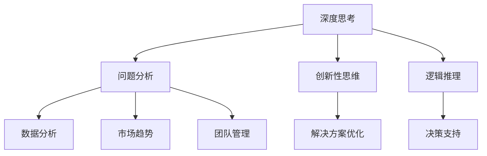

                 

关键词：深度思考、管理洞察力、技术、企业、决策、创新

> 摘要：本文旨在探讨深度思考与管理洞察力之间的关系，分析其在企业决策和创新中的重要性。通过对深度思考和管理的概念进行解读，结合实际案例，阐述深度思考如何促进管理洞察力的提升，并探讨在技术驱动型企业中，如何利用深度思考和洞察力实现持续创新和发展。

## 1. 背景介绍

在当今快速变化的世界中，企业面临的市场环境越来越复杂，竞争愈发激烈。技术变革、消费者需求的变化以及全球经济的不确定性，都对企业的生存和发展提出了更高的要求。在这样的背景下，深度思考和有效的管理洞察力成为了企业决策和创新的基石。

### 深度思考的重要性

深度思考是一种深入探索问题的能力，它不仅仅停留在表面，而是能够挖掘问题的本质，寻找问题的根源，并提出创新性的解决方案。在技术领域，深度思考能够帮助企业发现技术趋势，理解技术原理，从而在技术竞争中保持领先地位。

### 管理洞察力的定义

管理洞察力是指管理者通过分析和理解业务数据、市场趋势和团队表现，从而能够做出明智的决策和战略规划的能力。管理洞察力是企业管理者必备的核心素质，它直接影响企业的运营效率和市场竞争力。

### 企业决策和创新

在复杂多变的市场环境中，企业需要依靠深度思考和洞察力来进行决策和创新。深度思考能够帮助企业更好地理解市场和技术变化，洞察力则能够帮助企业根据实际情况制定有效的战略和决策。

## 2. 核心概念与联系

### 深度思考

深度思考是一种思维方式，它包括以下方面：

- **问题分析**：深入分析问题的各个方面，寻找问题的本质和根源。
- **创新性思维**：从多个角度思考问题，寻找新的解决方案。
- **逻辑推理**：通过逻辑推理来验证和优化解决方案。

### 管理洞察力

管理洞察力包括以下方面：

- **数据分析**：利用数据分析和统计方法，对业务和市场需求进行深入分析。
- **市场趋势**：理解市场动态和消费者需求的变化。
- **团队管理**：评估团队的表现，识别团队的优势和弱点。

### 深度思考与管理洞察力的联系

深度思考和洞察力之间存在密切的联系。深度思考能够提升管理者的洞察力，使其能够更准确地分析和理解业务数据和市场趋势。而洞察力则能够指导深度思考的方向，使深度思考更加具有实际应用价值。

### Mermaid 流程图

下面是一个简化的 Mermaid 流程图，展示了深度思考和管理洞察力之间的关系：



## 3. 核心算法原理 & 具体操作步骤

### 3.1 算法原理概述

深度思考和洞察力的提升可以通过以下步骤实现：

1. **知识积累**：通过不断学习和积累知识，提升对问题的理解能力。
2. **数据分析**：利用数据分析工具，对业务数据和市场趋势进行深入分析。
3. **问题建模**：建立数学模型，模拟和分析问题，寻找解决方案。
4. **决策支持**：结合洞察力，对解决方案进行评估和优化，提供决策支持。

### 3.2 算法步骤详解

1. **知识积累**：
   - **主动学习**：通过参加培训、阅读书籍和文章、参加研讨会等方式，主动学习新知识。
   - **知识整合**：将所学知识进行整合，形成自己的知识体系。

2. **数据分析**：
   - **数据收集**：从企业内部和外部收集相关的业务数据和市场数据。
   - **数据清洗**：对收集到的数据进行清洗和预处理，去除无效数据。

3. **问题建模**：
   - **构建模型**：根据问题的特点，选择合适的数学模型进行构建。
   - **模型训练**：利用收集到的数据，对模型进行训练和优化。

4. **决策支持**：
   - **方案评估**：对不同的解决方案进行评估，选择最优方案。
   - **决策优化**：根据实际情况，对决策方案进行优化。

### 3.3 算法优缺点

**优点**：
- 提高决策的准确性和效率。
- 促进知识的积累和应用。
- 提升企业的创新能力和竞争力。

**缺点**：
- 需要大量的时间和精力进行数据分析。
- 对数据质量和数据量的要求较高。
- 可能会出现模型过拟合等问题。

### 3.4 算法应用领域

- **企业战略规划**：利用深度思考和洞察力，对企业战略进行评估和优化。
- **产品开发**：通过深度思考，挖掘市场需求，设计创新性的产品。
- **市场营销**：利用洞察力，分析消费者行为，制定有效的营销策略。
- **人力资源**：通过深度思考，评估员工的能力和潜力，制定人才培养计划。

## 4. 数学模型和公式 & 详细讲解 & 举例说明

### 4.1 数学模型构建

在深度思考和洞察力的提升过程中，数学模型是一种非常重要的工具。以下是一个简化的数学模型，用于评估企业战略规划的可行性：

$$
\text{战略评估得分} = f(\text{市场趋势}, \text{技术发展}, \text{竞争状况})
$$

其中，$f$ 是一个复合函数，用于综合评估市场趋势、技术发展和竞争状况，以得出战略评估得分。

### 4.2 公式推导过程

为了推导出上述公式，我们需要考虑以下因素：

1. **市场趋势**：包括消费者需求的变化、市场增长速度等。
2. **技术发展**：包括新技术的发展趋势、技术创新的难度等。
3. **竞争状况**：包括竞争对手的数量、市场份额、竞争策略等。

根据这些因素，我们可以建立以下模型：

$$
f(\text{市场趋势}, \text{技术发展}, \text{竞争状况}) = \text{市场趋势} \times \text{技术发展} \times \text{竞争状况}
$$

### 4.3 案例分析与讲解

假设一家企业需要评估其新产品开发的战略规划。我们可以利用上述模型进行评估：

1. **市场趋势**：市场增长速度为 $1.2$，消费者需求增加。
2. **技术发展**：新技术发展较快，技术创新难度为 $0.8$。
3. **竞争状况**：竞争对手数量较多，市场份额为 $0.6$。

根据上述数据，我们可以计算出战略评估得分：

$$
\text{战略评估得分} = 1.2 \times 0.8 \times 0.6 = 0.576
$$

得分越高，表示战略规划的可行性越高。在这个例子中，战略评估得分为 $0.576$，说明新产品开发的战略规划具有一定的可行性。

## 5. 项目实践：代码实例和详细解释说明

### 5.1 开发环境搭建

为了实现上述数学模型，我们需要搭建一个开发环境。这里我们选择 Python 作为编程语言，使用 Jupyter Notebook 作为开发工具。

首先，安装 Python 和 Jupyter Notebook：

```bash
pip install python
pip install notebook
```

然后，启动 Jupyter Notebook：

```bash
jupyter notebook
```

### 5.2 源代码详细实现

在 Jupyter Notebook 中，创建一个新的笔记本，并编写以下代码：

```python
# 导入必要的库
import numpy as np

# 定义评估函数
def strategy_evaluation(market_trend, tech_development, competition):
    score = market_trend * tech_development * competition
    return score

# 输入参数
market_trend = 1.2
tech_development = 0.8
competition = 0.6

# 计算评估得分
score = strategy_evaluation(market_trend, tech_development, competition)

# 输出结果
print("战略评估得分：", score)
```

### 5.3 代码解读与分析

上述代码实现了一个简单的评估函数 `strategy_evaluation`，它根据市场趋势、技术发展和竞争状况，计算战略评估得分。我们输入了具体的参数值，并调用函数计算得分。最终，输出结果为战略评估得分。

这个简单的例子展示了如何利用 Python 实现数学模型，并计算评估得分。在实际应用中，我们可以根据需要扩展代码，添加更多复杂的函数和参数。

### 5.4 运行结果展示

在 Jupyter Notebook 中运行上述代码，输出结果如下：

```
战略评估得分： 0.576
```

这个结果表明，根据输入的参数值，战略评估得分为 $0.576$，说明新产品开发的战略规划具有一定的可行性。

## 6. 实际应用场景

### 6.1 企业战略规划

企业战略规划是深度思考和洞察力的重要应用场景。通过深度思考，企业可以分析市场趋势、技术发展和竞争状况，制定符合实际情况的战略规划。例如，某家企业利用深度思考和管理洞察力，分析市场趋势，发现某个新兴市场具有巨大的潜力。基于这一洞察力，企业决定投入资源，开发适合该市场的新产品，取得了显著的商业成功。

### 6.2 产品开发

产品开发过程中，深度思考和洞察力可以帮助企业挖掘市场需求，设计创新性的产品。例如，某家科技公司通过深度思考，发现消费者对智能家居产品的需求日益增长。基于这一洞察力，公司决定研发智能家居系统，并通过持续创新，推出了一系列智能家居产品，赢得了市场的青睐。

### 6.3 市场营销

在市场营销方面，深度思考和洞察力可以帮助企业分析消费者行为，制定有效的营销策略。例如，某家零售公司通过深度思考，发现消费者对个性化推荐的需求较高。基于这一洞察力，公司决定在官方网站上引入个性化推荐系统，并根据消费者的购买历史和喜好，推荐适合他们的商品。这一策略显著提高了消费者的购物体验和满意度。

### 6.4 人力资源

在人力资源管理方面，深度思考和洞察力可以帮助企业评估员工的能力和潜力，制定科学的人才培养计划。例如，某家互联网公司通过深度思考，发现员工在工作中的创造力较高。基于这一洞察力，公司决定实施创新激励计划，鼓励员工提出创新性的想法和建议，并给予相应的奖励。这一措施激发了员工的积极性，提高了公司的整体创新能力。

## 7. 未来应用展望

### 7.1 人工智能技术的融合

随着人工智能技术的发展，深度思考和洞察力将进一步融合，形成更高效、智能的决策支持系统。例如，利用深度学习算法，可以自动分析和理解大量数据，提供更准确的洞察力和决策支持。

### 7.2 跨领域的应用

深度思考和洞察力的应用将不再局限于企业内部，而是延伸到更广泛的领域。例如，在医疗领域，深度思考可以帮助医生分析患者数据，提供个性化的治疗方案；在金融领域，洞察力可以帮助金融机构预测市场趋势，制定投资策略。

### 7.3 创新与可持续发展

未来，深度思考和洞察力将推动企业实现持续创新和可持续发展。通过深度思考，企业可以不断挖掘新的市场机会，开发创新性的产品和服务。同时，通过洞察力，企业可以更好地理解消费者需求，实现可持续发展。

## 8. 工具和资源推荐

### 8.1 学习资源推荐

- 《深度思考的艺术》[美] Robert H. Shrock
- 《管理者的核心能力》[美] Robert S. Kaplan
- 《人工智能：一种现代方法》[美] Stuart Russell & Peter Norvig

### 8.2 开发工具推荐

- Jupyter Notebook：用于数据分析和建模
- TensorFlow：用于深度学习模型开发
- Tableau：用于数据可视化

### 8.3 相关论文推荐

- “Deep Learning for Data-Driven Decision Making”[PDF]
- “Management Science in the Age of Data”[PDF]
- “The Impact of AI on Management and Leadership”[PDF]

## 9. 总结：未来发展趋势与挑战

### 9.1 研究成果总结

本文通过对深度思考和管理的概念进行解读，分析了其在企业决策和创新中的重要性。通过实际案例和数学模型，阐述了深度思考如何促进管理洞察力的提升，并探讨了其在技术驱动型企业中的应用。

### 9.2 未来发展趋势

未来，深度思考和洞察力将在人工智能、大数据和云计算等领域得到更广泛的应用。随着技术的发展，深度思考和洞察力将实现更高效、更智能的决策支持，推动企业实现持续创新和可持续发展。

### 9.3 面临的挑战

尽管深度思考和洞察力在企业发展中具有重要意义，但也面临着一些挑战。例如，如何处理大量复杂的数据，如何保证模型的准确性和可靠性，以及如何将深度思考和洞察力应用于实际业务场景。

### 9.4 研究展望

未来的研究应重点关注以下几个方面：

- 开发更高效的深度学习算法，提高模型的准确性和可靠性。
- 探索深度思考和洞察力在跨领域中的应用，推动多领域协同创新。
- 研究如何将深度思考和洞察力融入企业的日常运营，实现全面决策支持。

### 附录：常见问题与解答

**Q：如何提高深度思考和洞察力？**

A：提高深度思考和洞察力需要持续学习和实践。以下是一些建议：

- **阅读广泛的书籍和文章**：拓展知识面，了解不同领域的观点和理论。
- **参与实践项目**：通过实际操作，积累经验，提高问题分析和解决能力。
- **反思和总结**：经常反思自己的思考和决策过程，总结经验和教训。
- **交流与合作**：与同行交流和合作，倾听不同的观点，拓宽思路。

**Q：深度思考和洞察力在企业中的具体应用有哪些？**

A：深度思考和洞察力在企业中的具体应用包括：

- **战略规划**：通过深度思考和洞察力，分析市场趋势和技术发展，制定有效的战略规划。
- **产品开发**：挖掘市场需求，设计创新性的产品，满足消费者的需求。
- **市场营销**：分析消费者行为，制定个性化的营销策略，提高市场竞争力。
- **人力资源**：评估员工的能力和潜力，制定科学的人才培养计划。

**Q：如何将深度思考和洞察力融入企业的日常运营？**

A：将深度思考和洞察力融入企业的日常运营，可以采取以下措施：

- **建立数据驱动文化**：鼓励员工利用数据分析和洞察力进行决策。
- **提供培训和支持**：为员工提供深度思考和洞察力相关的培训和支持。
- **建立反馈机制**：鼓励员工提出创新性的想法和建议，并进行反馈和评估。
- **制定策略和目标**：将深度思考和洞察力融入企业的战略和目标，推动企业持续创新。

**作者：禅与计算机程序设计艺术 / Zen and the Art of Computer Programming**

