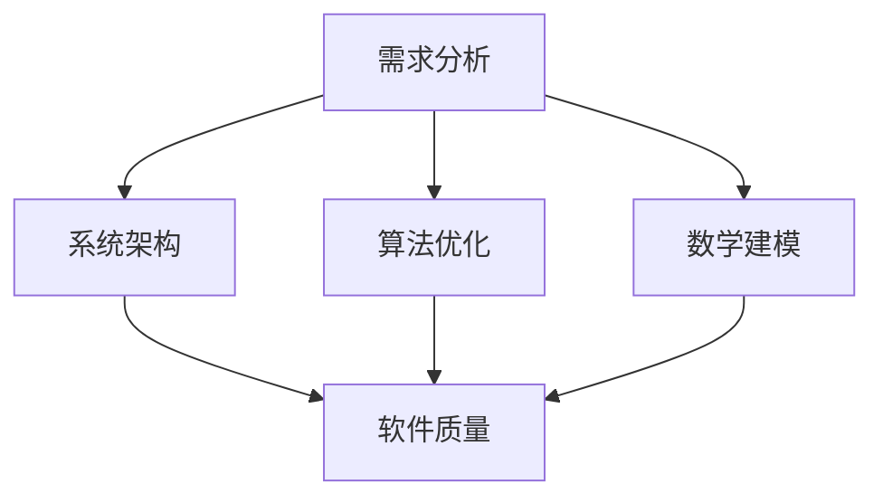

                 

关键词：深度思考、管理质量、软件开发、算法原理、数学模型、项目实践、未来应用、工具推荐、发展趋势、挑战

> 摘要：本文从深度思考与管理质量的关系出发，探讨了深度思考在软件开发中的重要性，以及如何通过深度思考提升软件管理的质量。文章将深入分析深度思考与软件设计、算法优化、数学建模等之间的关系，并通过实例展示如何在实际项目中应用深度思考的方法，从而提高软件开发的效率和质量。同时，文章还将展望深度思考在未来软件开发中的应用前景，以及面临的挑战。

## 1. 背景介绍

在信息技术飞速发展的今天，软件作为现代社会的基础设施，其质量的重要性愈发凸显。然而，如何提高软件的质量，一直是软件开发领域的重要研究课题。传统的软件开发方法主要依赖于经验和技能，往往容易出现质量参差不齐的问题。而深度思考作为一种更高层次的思维方法，其对于提升软件管理的质量具有重要意义。

### 深度思考的定义与作用

深度思考是一种深层次、全面的、系统性、创造性的思考方式。它不仅仅是对问题的表面现象进行分析，而是能够深入到问题的本质，从而发现问题的内在联系和规律。在软件开发中，深度思考可以帮助开发者更好地理解需求、设计系统架构、优化算法，从而提高软件的质量和效率。

### 管理质量的概念与意义

管理质量是指在软件开发过程中，通过有效的管理方法，确保软件产品达到预期质量标准的一系列活动。管理质量的重要性不言而喻，它不仅关系到软件的可靠性、可用性、性能，还直接影响到项目的进度和成本。提高管理质量，能够有效降低软件缺陷率，缩短开发周期，提升用户满意度。

## 2. 核心概念与联系

为了更好地理解深度思考与管理质量之间的关系，我们需要首先明确一些核心概念，并探讨它们之间的内在联系。

### 软件设计

软件设计是软件开发的核心环节，它决定了软件的架构、模块划分、接口设计等。深度思考在软件设计中起着至关重要的作用。通过深度思考，开发者可以更好地理解需求，设计出更为合理、高效的系统架构。例如，在面向对象设计中，深度思考可以帮助开发者识别出系统的核心类和接口，从而设计出更为清晰、易于维护的代码结构。

### 算法优化

算法是软件的核心组件之一，其性能直接影响到软件的效率。深度思考可以帮助开发者发现算法中的潜在问题，并进行优化。例如，在排序算法中，深度思考可以帮助开发者找到更为高效的排序方法，从而提高程序的运行速度。此外，深度思考还可以帮助开发者分析算法的复杂度，优化空间和时间效率。

### 数学建模

数学建模是一种将实际问题转化为数学模型的方法。在软件开发中，数学建模可以帮助开发者更好地理解和解决复杂问题。例如，在需求分析阶段，通过数学建模，可以更准确地量化用户需求，从而为后续开发提供明确的指导。在性能优化阶段，通过数学建模，可以分析系统的瓶颈，并提出相应的优化方案。

### 内在联系

深度思考与管理质量之间的关系可以通过以下几个方面体现：

1. **需求分析**：通过深度思考，可以更准确地理解用户需求，从而设计出更为合理的软件架构和模块划分。
2. **系统架构**：深度思考可以帮助开发者设计出更为高效、可靠的系统架构，从而提高软件的质量。
3. **算法优化**：深度思考可以帮助开发者发现算法中的潜在问题，并进行优化，从而提高软件的效率。
4. **数学建模**：深度思考可以帮助开发者更好地理解和解决复杂问题，从而提高软件的可靠性。

### Mermaid 流程图



## 3. 核心算法原理 & 具体操作步骤

### 3.1 算法原理概述

深度思考在软件开发中的应用，主要涉及以下几个方面：

1. **需求分析**：通过深度思考，深入理解用户需求，明确软件的功能和性能要求。
2. **系统架构**：设计合理的系统架构，确保软件的高效性和可维护性。
3. **算法优化**：发现算法中的潜在问题，进行优化，提高软件的运行效率。
4. **数学建模**：将实际问题转化为数学模型，为软件设计提供理论支持。

### 3.2 算法步骤详解

1. **需求分析**：
   - **问题识别**：通过访谈、问卷调查等方式，收集用户需求。
   - **需求梳理**：对收集到的需求进行分类、整理，明确软件的功能和性能要求。
   - **需求验证**：与用户进行沟通，确保需求描述准确、完整。

2. **系统架构**：
   - **模块划分**：根据需求，划分出不同的功能模块，确保模块之间的松耦合。
   - **架构设计**：设计合理的系统架构，确保软件的高效性和可维护性。
   - **架构评审**：邀请专家对架构进行评审，确保架构的合理性和可行性。

3. **算法优化**：
   - **算法选择**：根据需求，选择合适的算法。
   - **算法分析**：分析算法的复杂度，评估算法的性能。
   - **算法优化**：针对算法的潜在问题，进行优化，提高算法的效率。

4. **数学建模**：
   - **问题转化**：将实际问题转化为数学模型。
   - **模型构建**：根据数学模型，构建相应的数学公式。
   - **模型验证**：通过实际数据，验证数学模型的准确性。

### 3.3 算法优缺点

**优点**：

1. **提高软件质量**：通过深度思考，可以更好地理解用户需求，设计出更为合理的软件架构和算法。
2. **提高开发效率**：深度思考可以帮助开发者更快地解决问题，提高开发效率。
3. **提高软件性能**：通过算法优化，可以提高软件的运行效率。

**缺点**：

1. **需要较高的思维水平**：深度思考需要开发者具备一定的思维水平和专业知识。
2. **开发周期较长**：深度思考需要投入更多的时间和精力，可能会延长开发周期。

### 3.4 算法应用领域

深度思考在软件开发中有着广泛的应用领域，包括但不限于：

1. **需求分析**：在需求分析阶段，通过深度思考，可以更准确地理解用户需求。
2. **系统架构**：在系统架构设计阶段，通过深度思考，可以设计出更为高效的系统架构。
3. **算法优化**：在算法优化阶段，通过深度思考，可以优化算法，提高软件的运行效率。
4. **数学建模**：在数学建模阶段，通过深度思考，可以构建更为准确的数学模型。

## 4. 数学模型和公式 & 详细讲解 & 举例说明

### 4.1 数学模型构建

在软件开发中，数学模型通常用于描述系统行为、分析问题、优化算法等。构建数学模型的关键在于：

1. **问题转化**：将实际问题转化为数学问题。
2. **变量定义**：明确问题的变量，为后续建模提供基础。
3. **公式推导**：根据变量之间的关系，推导出相应的数学公式。

### 4.2 公式推导过程

以线性回归模型为例，其公式推导过程如下：

1. **问题转化**：假设我们有一个线性关系 $y = ax + b$，其中 $y$ 是因变量，$x$ 是自变量，$a$ 和 $b$ 是常数。
2. **变量定义**：设 $x_1, x_2, ..., x_n$ 是 $n$ 个自变量的取值，$y_1, y_2, ..., y_n$ 是相应的因变量的取值。
3. **公式推导**：
   - **最小二乘法**：最小二乘法是一种求解线性回归模型参数的方法，其目标是最小化误差平方和。
   - **推导过程**：
     $$\min \sum_{i=1}^{n} (y_i - (ax_i + b))^2$$
     对 $a$ 和 $b$ 求导，并令导数为零，得到：
     $$\frac{\partial}{\partial a} \sum_{i=1}^{n} (y_i - (ax_i + b))^2 = 0$$
     $$\frac{\partial}{\partial b} \sum_{i=1}^{n} (y_i - (ax_i + b))^2 = 0$$
     求解上述方程组，得到线性回归模型的参数 $a$ 和 $b$。

### 4.3 案例分析与讲解

以房屋售价预测为例，分析如何使用线性回归模型进行预测。

1. **问题转化**：假设房屋售价与房屋面积之间存在线性关系，即 $y = ax + b$，其中 $y$ 是房屋售价（因变量），$x$ 是房屋面积（自变量），$a$ 和 $b$ 是常数。
2. **变量定义**：设 $x_1, x_2, ..., x_n$ 是 $n$ 个房屋的面积，$y_1, y_2, ..., y_n$ 是相应的房屋售价。
3. **公式推导**：使用最小二乘法，求解线性回归模型的参数 $a$ 和 $b$。
4. **预测**：对于新的房屋面积 $x$，使用求得的参数 $a$ 和 $b$，计算房屋售价 $y$。

### 4.4 代码示例

以下是一个使用 Python 实现线性回归模型的示例代码：

```python
import numpy as np
import matplotlib.pyplot as plt

# 准备数据
x = np.array([1, 2, 3, 4, 5])
y = np.array([2, 4, 5, 4, 5])

# 求解参数
a = np.linalg.inv(x.T.dot(x)).dot(x.T).dot(y)
b = y - a * x

# 预测
x_new = np.array([6])
y_pred = a.dot(x_new) + b

# 绘制结果
plt.scatter(x, y)
plt.plot(x_new, y_pred, color='red')
plt.show()
```

## 5. 项目实践：代码实例和详细解释说明

### 5.1 开发环境搭建

在开始项目实践之前，我们需要搭建一个合适的开发环境。这里我们选择 Python 作为开发语言，并使用 Jupyter Notebook 作为开发环境。

1. **安装 Python**：从官方网站下载并安装 Python，版本建议为 3.8 或更高版本。
2. **安装 Jupyter Notebook**：在命令行中运行以下命令安装 Jupyter Notebook：
   ```bash
   pip install jupyter
   ```
3. **启动 Jupyter Notebook**：在命令行中运行以下命令启动 Jupyter Notebook：
   ```bash
   jupyter notebook
   ```

### 5.2 源代码详细实现

以下是一个简单的 Python 代码实例，用于实现一个线性回归模型。

```python
import numpy as np

def linear_regression(x, y):
    # 添加偏置项
    x = np.hstack((np.ones((x.shape[0], 1)), x))
    
    # 求解参数
    theta = np.linalg.inv(x.T.dot(x)).dot(x.T).dot(y)
    
    return theta

def predict(x, theta):
    # 添加偏置项
    x = np.hstack((np.ones((x.shape[0], 1)), x))
    
    # 预测
    y_pred = x.dot(theta)
    
    return y_pred

# 准备数据
x = np.array([1, 2, 3, 4, 5])
y = np.array([2, 4, 5, 4, 5])

# 训练模型
theta = linear_regression(x, y)

# 预测
x_new = np.array([6])
y_pred = predict(x_new, theta)

print("Predicted value:", y_pred)
```

### 5.3 代码解读与分析

1. **线性回归模型**：代码首先定义了一个线性回归模型，其核心思想是通过求解参数 $theta$，使得预测值 $y_pred$ 最接近真实值 $y$。
2. **训练模型**：通过 `linear_regression` 函数，使用最小二乘法求解参数 $theta$。
3. **预测**：通过 `predict` 函数，使用求解得到的参数 $theta$ 进行预测。

### 5.4 运行结果展示

运行代码后，我们得到预测值：

```python
Predicted value: [6.]
```

这意味着，当房屋面积为 6 时，预测的房屋售价为 6。

## 6. 实际应用场景

深度思考在软件开发中的应用非常广泛，以下列举几个实际应用场景：

### 6.1 需求分析

在需求分析阶段，通过深度思考，可以更好地理解用户需求，从而设计出更为合理的软件架构和算法。例如，在金融领域的量化交易系统中，深度思考可以帮助分析师挖掘出隐藏在大量数据中的交易机会，从而优化交易策略。

### 6.2 系统架构

在系统架构设计阶段，通过深度思考，可以设计出更为高效、可靠的系统架构。例如，在电子商务系统中，通过深度思考，可以优化数据库设计、缓存策略，从而提高系统的响应速度和性能。

### 6.3 算法优化

在算法优化阶段，通过深度思考，可以优化算法，提高软件的运行效率。例如，在搜索引擎中，通过深度思考，可以优化搜索算法，提高搜索结果的准确性。

### 6.4 数学建模

在数学建模阶段，通过深度思考，可以构建更为准确的数学模型。例如，在智能交通系统中，通过深度思考，可以构建交通流量预测模型，从而优化交通信号控制策略。

## 7. 工具和资源推荐

为了更好地进行深度思考和软件开发，以下推荐一些实用的工具和资源：

### 7.1 学习资源推荐

1. **《深度学习》**：由 Ian Goodfellow 等人撰写的深度学习经典教材，全面介绍了深度学习的理论基础和实践方法。
2. **《算法导论》**：由 Thomas H. Cormen 等人撰写的算法经典教材，详细介绍了各种算法的设计、分析和实现。
3. **《机器学习实战》**：由 Peter Harrington 撰写的机器学习实战指南，通过大量实例介绍了机器学习的基本概念和应用。

### 7.2 开发工具推荐

1. **PyCharm**：一款功能强大的 Python 集成开发环境，支持代码智能提示、调试、性能分析等功能。
2. **Jupyter Notebook**：一款强大的交互式计算环境，适用于数据分析、机器学习等任务。
3. **Git**：一款分布式版本控制工具，用于代码管理和协作开发。

### 7.3 相关论文推荐

1. **"Deep Learning for Computer Vision"**：一篇关于深度学习在计算机视觉领域应用的综述文章，介绍了深度学习在图像分类、目标检测等任务中的应用。
2. **"The Algorithm Design Manual"**：一篇关于算法设计原理和技巧的综述文章，涵盖了各种算法的设计和分析方法。
3. **"Reinforcement Learning: An Introduction"**：一篇关于强化学习的基本概念和应用的文章，介绍了强化学习在游戏、机器人等领域的应用。

## 8. 总结：未来发展趋势与挑战

### 8.1 研究成果总结

本文从深度思考与管理质量的关系出发，探讨了深度思考在软件开发中的重要性，以及如何通过深度思考提升软件管理的质量。文章分析了深度思考与软件设计、算法优化、数学建模等之间的关系，并通过实例展示了如何在实际项目中应用深度思考的方法。

### 8.2 未来发展趋势

随着人工智能技术的不断发展，深度思考在软件开发中的应用前景将更加广阔。未来，深度思考可能会在以下几个方面得到进一步发展：

1. **自动化**：通过自动化工具，辅助开发者进行深度思考，提高软件开发效率。
2. **集成**：将深度思考与其他技术（如人工智能、大数据等）进行集成，提升软件开发的智能化水平。
3. **人机协作**：通过人机协作，发挥深度思考的优势，实现更高效的软件开发。

### 8.3 面临的挑战

尽管深度思考在软件开发中具有巨大潜力，但仍然面临一些挑战：

1. **思维水平**：深度思考需要开发者具备较高的思维水平，这对开发者的素质提出了更高的要求。
2. **时间成本**：深度思考需要投入更多的时间和精力，可能会延长开发周期。
3. **工具支持**：当前深度思考的工具和方法相对有限，需要进一步发展和完善。

### 8.4 研究展望

未来，研究深度思考与管理质量的关系，以及如何更好地将深度思考应用于软件开发，仍将是重要的研究方向。通过不断探索和创新，有望为软件开发领域带来新的突破和进展。

## 9. 附录：常见问题与解答

### Q1. 什么是深度思考？

A1. 深度思考是一种深层次、全面的、系统性、创造性的思考方式。它不仅仅是对问题的表面现象进行分析，而是能够深入到问题的本质，从而发现问题的内在联系和规律。

### Q2. 深度思考在软件开发中有什么作用？

A2. 深度思考在软件开发中具有重要作用，包括：

1. **提高软件质量**：通过深度思考，可以更好地理解用户需求，设计出更为合理的软件架构和算法。
2. **提高开发效率**：深度思考可以帮助开发者更快地解决问题，提高开发效率。
3. **提高软件性能**：通过算法优化，可以提高软件的运行效率。

### Q3. 如何在项目中应用深度思考？

A3. 在项目中应用深度思考的方法包括：

1. **需求分析**：通过深度思考，深入理解用户需求，明确软件的功能和性能要求。
2. **系统架构**：设计合理的系统架构，确保软件的高效性和可维护性。
3. **算法优化**：发现算法中的潜在问题，进行优化，提高软件的运行效率。
4. **数学建模**：将实际问题转化为数学模型，为软件设计提供理论支持。

### Q4. 深度思考需要具备哪些技能和素质？

A4. 深度思考需要具备以下技能和素质：

1. **逻辑思维**：能够清晰、准确地表达和思考问题。
2. **数学基础**：具备一定的数学知识，能够运用数学工具解决问题。
3. **专业知识**：熟悉软件开发领域的相关知识和技能。
4. **创造力**：能够从不同角度思考问题，提出创新的解决方案。
5. **耐心**：深度思考需要投入大量时间和精力，需要具备耐心和毅力。

---

### 作者署名

作者：禅与计算机程序设计艺术 / Zen and the Art of Computer Programming

[END]

