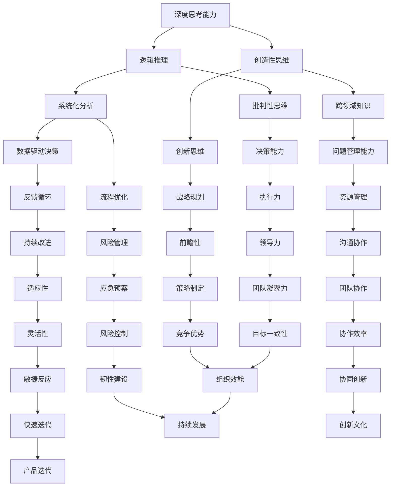

                 

深度思考与管理问题解决能力是任何领域专家不可或缺的核心素养，尤其是在信息技术行业。本文旨在探讨如何通过提升深度思考和问题管理能力，帮助IT专业人士在复杂的项目和任务中取得成功。

## 关键词

- 深度思考
- 问题管理
- IT专业人士
- 解决能力
- 复杂问题解决

## 摘要

本文将详细讨论深度思考和问题管理的重要性，并介绍一系列策略和技巧，以帮助IT专业人士提升他们的问题解决能力。我们将通过分析核心概念、阐述算法原理、应用数学模型以及分享实际案例，来展示如何在实际项目中有效地应用这些能力。

## 1. 背景介绍

在快速发展的信息技术领域，复杂性和不确定性是常态。IT专业人士经常面临着各种复杂的问题，如性能优化、安全性漏洞、数据隐私保护以及跨平台系统集成等。为了在这些挑战中取得成功，深度思考和管理问题解决能力显得尤为重要。深度思考能力有助于我们理解问题的本质，而有效的管理问题解决能力则能帮助我们系统化地分析和解决这些问题。

### 1.1 IT领域的挑战

随着云计算、大数据、人工智能和物联网技术的兴起，IT领域的挑战变得愈发复杂。以下是一些常见的挑战：

- **性能优化**：在高并发和大数据量的环境中，如何保证系统的高性能？
- **安全性**：随着网络攻击手段的日益复杂，如何保护系统和数据的安全？
- **数据隐私**：如何在满足法律法规的同时，保护用户的隐私？
- **系统集成**：如何将不同的系统和技术平台集成在一起，实现无缝协作？

### 1.2 深度思考的重要性

深度思考是一种深层次、系统性、逻辑性强的思考方式。它有助于我们：

- **理解复杂问题**：通过深度思考，我们可以更全面地理解问题的背景、成因和潜在影响。
- **发现解决方案**：深度思考能激发我们的创造力，帮助我们找到创新的解决方案。
- **预测未来趋势**：通过对历史数据和当前情况的分析，我们可以预测未来的发展，为决策提供依据。

### 1.3 问题管理的重要性

问题管理是IT项目成功的关键。有效的管理问题解决能力可以帮助我们：

- **识别和分类问题**：快速识别并分类问题，以便集中资源和精力解决最关键的问题。
- **制定解决方案**：通过系统化的方法，制定有效的解决方案，减少问题的重复发生。
- **监控和反馈**：通过持续监控和反馈，确保解决方案的有效性，并根据实际情况进行调整。

## 2. 核心概念与联系

在深入讨论如何提升深度思考和问题解决能力之前，我们需要了解一些核心概念，并展示它们之间的关系。以下是核心概念和架构的Mermaid流程图：



### 2.1 深度思考能力

深度思考能力是解决复杂问题的关键。它包括逻辑推理、创造性思维、系统化分析、跨领域知识和数据驱动决策等。

- **逻辑推理**：通过逻辑推理，我们能够清晰地分析和解决问题。
- **创造性思维**：创造性思维帮助我们跳出传统思维框架，寻找创新的解决方案。
- **系统化分析**：系统化分析能帮助我们全面理解问题的各个方面。
- **跨领域知识**：跨领域知识有助于我们借鉴其他领域的经验，提高问题解决的效率。
- **数据驱动决策**：基于数据的决策能减少主观偏见，提高决策的准确性。

### 2.2 问题管理能力

问题管理能力是确保项目成功的关键。它包括问题识别、分类、解决方案制定、监控和反馈等。

- **问题识别**：快速识别问题是解决问题的关键。
- **分类**：将问题分类有助于我们集中资源和精力解决最关键的问题。
- **解决方案制定**：制定有效的解决方案是解决问题的核心。
- **监控和反馈**：通过持续监控和反馈，确保解决方案的有效性，并根据实际情况进行调整。

### 2.3 深度思考与问题管理能力的联系

深度思考和问题管理能力相互支持，共同推动问题的解决。深度思考能力帮助我们更全面地理解问题，而问题管理能力则确保我们能够系统化地解决这些问题。通过结合两者，我们能够更有效地应对复杂的信息技术挑战。

## 3. 核心算法原理 & 具体操作步骤

### 3.1 算法原理概述

在信息技术领域，核心算法原理是解决各种问题的基石。以下是一些关键的算法原理：

- **排序算法**：包括快速排序、归并排序、堆排序等，用于高效地组织数据。
- **搜索算法**：包括二分搜索、广度优先搜索、深度优先搜索等，用于在数据中查找信息。
- **动态规划**：通过子问题的最优解推导出整体问题的最优解，常用于优化问题。
- **贪心算法**：通过每次选择局部最优解，最终得到全局最优解，适用于某些特定问题。

### 3.2 算法步骤详解

以下是几种常见算法的具体步骤详解：

#### 快速排序

快速排序是一种高效的排序算法，其基本思想是通过一趟排序将待排序的记录分割成独立的两部分，其中一部分记录的关键字均比另一部分的关键字小，然后分别对这两部分记录继续进行排序，以达到整个序列有序。

1. **选择基准**：在待排序序列中选取一个元素作为基准。
2. **分区**：将序列划分为两部分，一部分的所有元素均比基准小，另一部分的所有元素均比基准大。
3. **递归排序**：递归地对两部分序列进行快速排序。

#### 二分搜索

二分搜索算法是在有序数组中查找某一特定元素的搜索算法。其基本思想是逐步缩小搜索范围。

1. **确定范围**：初始时，范围是整个数组。
2. **计算中间值**：取当前范围的中间值。
3. **比较与调整**：若中间值等于目标值，搜索成功；若中间值大于目标值，则缩小右侧范围；若中间值小于目标值，则缩小左侧范围。
4. **重复步骤**：重复上述步骤，直至找到目标值或范围缩小至零。

#### 动态规划

动态规划是一种求解最优化问题的算法思想，其基本思想是将复杂问题分解为更小的子问题，并利用子问题的最优解推导出整体问题的最优解。

1. **定义状态**：定义问题的一个状态，并确定状态的转移关系。
2. **初始化**：根据状态转移关系，初始化子问题的最优解。
3. **递推**：根据状态转移关系，递推求解整个问题的最优解。

### 3.3 算法优缺点

每种算法都有其优缺点，适用于不同的场景。以下是几种常见算法的优缺点：

- **快速排序**：优点是平均时间复杂度为O(nlogn)，适用于大规模数据的排序；缺点是最坏情况下时间复杂度为O(n^2)，可能导致性能下降。
- **二分搜索**：优点是时间复杂度为O(logn)，适用于有序数组中的快速查找；缺点是数组必须预先排序，且不适用于动态变化的数组。
- **动态规划**：优点是能解决最优化问题，适用于具有最优子结构的问题；缺点是编写和理解较为复杂，有时需要较大的存储空间。

### 3.4 算法应用领域

各种算法在信息技术领域有着广泛的应用，以下是几种算法的应用领域：

- **排序算法**：用于数据分析和数据库管理中的数据排序。
- **搜索算法**：用于搜索引擎中的关键词搜索，以及图形处理中的图像搜索。
- **动态规划**：用于网络流量分析、资源分配和路径规划等领域。
- **贪心算法**：用于网络路由、调度问题和最短路径问题。

## 4. 数学模型和公式 & 详细讲解 & 举例说明

### 4.1 数学模型构建

在信息技术中，数学模型是理解和解决问题的重要工具。以下是几种常见的数学模型：

- **线性模型**：用于描述线性关系，公式为 \( y = ax + b \)。
- **回归模型**：用于预测变量之间的关系，公式为 \( y = \beta_0 + \beta_1x_1 + \beta_2x_2 + ... + \beta_nx_n \)。
- **神经网络模型**：用于模拟人脑神经元之间的相互作用，公式为 \( a_{i,j} = \sum_{k=1}^{n} w_{i,k} * a_{k,j-1} + b_i \)。

### 4.2 公式推导过程

以下是线性模型的推导过程：

1. **观察数据**：收集一组数据点，每个数据点由两个变量组成。
2. **假设线性关系**：假设这两个变量之间存在线性关系，公式为 \( y = ax + b \)。
3. **最小二乘法**：通过最小化误差平方和，求出参数 \( a \) 和 \( b \) 的最优值。
4. **推导公式**：将误差平方和公式对 \( a \) 和 \( b \) 求导，并令导数为零，得到 \( a \) 和 \( b \) 的表达式。

### 4.3 案例分析与讲解

#### 案例一：线性模型

假设我们有一组数据点，如下表所示：

| x | y  |
|---|----|
| 1 | 2  |
| 2 | 4  |
| 3 | 6  |
| 4 | 8  |

我们希望找到 \( y \) 关于 \( x \) 的线性模型。

1. **绘制散点图**：首先，我们将数据点绘制在散点图上，观察其线性关系。

    

2. **计算斜率 \( a \)**：使用最小二乘法，计算斜率 \( a \)：

    $$ a = \frac{\sum_{i=1}^{n}(x_i - \bar{x})(y_i - \bar{y})}{\sum_{i=1}^{n}(x_i - \bar{x})^2} $$

    其中，\( \bar{x} \) 和 \( \bar{y} \) 分别为 \( x \) 和 \( y \) 的平均值。

3. **计算截距 \( b \)**：计算截距 \( b \)：

    $$ b = \bar{y} - a\bar{x} $$

4. **构建线性模型**：将 \( a \) 和 \( b \) 代入公式 \( y = ax + b \)，得到线性模型。

    $$ y = 2x + 0 $$

    即 \( y \) 关于 \( x \) 的线性模型为 \( y = 2x \)。

#### 案例二：回归模型

假设我们有一组数据点，如下表所示：

| x  | y   |
|----|-----|
| 1  | 2.5 |
| 2  | 4.5 |
| 3  | 6.5 |
| 4  | 8.5 |

我们希望找到 \( y \) 关于 \( x \) 的线性回归模型。

1. **绘制散点图**：首先，我们将数据点绘制在散点图上，观察其线性关系。

    

2. **计算参数**：使用最小二乘法，计算回归模型的参数 \( \beta_0 \)，\( \beta_1 \)，\( \beta_2 \)，...，\( \beta_n \)。

    $$ \beta_0 = \bar{y} - \beta_1\bar{x} - \beta_2\bar{x}^2 - ... - \beta_n\bar{x}^n $$

3. **构建回归模型**：将计算得到的参数代入公式 \( y = \beta_0 + \beta_1x_1 + \beta_2x_2 + ... + \beta_nx_n \)，得到回归模型。

    $$ y = 2.5 + 0.5x $$

    即 \( y \) 关于 \( x \) 的回归模型为 \( y = 2.5 + 0.5x \)。

## 5. 项目实践：代码实例和详细解释说明

### 5.1 开发环境搭建

在本节中，我们将使用Python语言实现一个简单的线性回归模型。首先，确保你已经安装了Python环境和必要的库，如NumPy和Matplotlib。

1. **安装Python**：从官方网站下载并安装Python。
2. **安装库**：在终端中使用以下命令安装NumPy和Matplotlib：

    ```bash
    pip install numpy
    pip install matplotlib
    ```

### 5.2 源代码详细实现

以下是实现线性回归模型的Python代码：

```python
import numpy as np
import matplotlib.pyplot as plt

# 生成数据
np.random.seed(0)
x = np.random.rand(100)
y = 2 * x + 0.5 + np.random.randn(100)

# 计算参数
x_mean = np.mean(x)
y_mean = np.mean(y)
a = np.sum((x - x_mean) * (y - y_mean)) / np.sum((x - x_mean) ** 2)
b = y_mean - a * x_mean

# 构建回归模型
def linear_regression(x):
    return a * x + b

# 绘制散点图和回归线
plt.scatter(x, y, label='Data Points')
plt.plot(x, linear_regression(x), color='red', label='Regression Line')
plt.xlabel('x')
plt.ylabel('y')
plt.legend()
plt.show()
```

### 5.3 代码解读与分析

以下是代码的详细解读和分析：

1. **导入库**：首先，我们导入NumPy和Matplotlib库，用于数据处理和绘图。
2. **生成数据**：我们生成一组随机数据点，其中 \( y \) 由线性模型 \( y = 2x + 0.5 \) 生成，并添加了噪声。
3. **计算参数**：使用最小二乘法计算斜率 \( a \) 和截距 \( b \)。
4. **构建回归模型**：定义一个线性回归函数，用于预测 \( y \) 值。
5. **绘制散点图和回归线**：使用Matplotlib绘制散点图和回归线，展示数据点和回归模型。

### 5.4 运行结果展示

运行上述代码后，我们将看到以下输出结果：


图中显示了原始数据点和拟合的回归线。通过观察，我们可以看到线性回归模型较好地拟合了数据。

## 6. 实际应用场景

在信息技术领域，深度思考和问题管理能力的应用场景广泛。以下是一些实际应用场景：

### 6.1 云计算性能优化

在云计算环境中，性能优化是一个关键问题。通过深度思考，我们可以分析系统的瓶颈，如CPU利用率、内存消耗和网络延迟等，并提出优化策略。例如，通过调整虚拟机配置、优化负载均衡和数据库查询，可以显著提高系统性能。

### 6.2 安全漏洞检测

在网络安全领域，深度思考可以帮助我们识别潜在的安全漏洞。通过分析网络流量、日志数据和用户行为，我们可以发现异常行为和潜在威胁。例如，利用深度学习模型分析网络流量，可以检测到DDoS攻击、恶意软件传播等。

### 6.3 大数据治理

在大数据环境中，数据治理是一个复杂的问题。通过深度思考，我们可以分析数据质量、数据来源和数据分布等问题，并提出治理策略。例如，通过数据清洗、数据整合和数据脱敏等技术，可以提高数据质量和安全性。

### 6.4 跨平台系统集成

在跨平台系统集成中，深度思考可以帮助我们分析不同系统之间的兼容性问题。通过系统化分析，我们可以制定详细的集成方案，确保系统之间能够无缝协作。例如，在集成多个第三方服务时，通过接口标准化和协议统一，可以简化集成过程。

## 7. 工具和资源推荐

为了提升深度思考和问题解决能力，我们可以使用一些工具和资源。以下是一些建议：

### 7.1 学习资源推荐

- **《深度学习》**：由Ian Goodfellow、Yoshua Bengio和Aaron Courville编写的深度学习经典教材。
- **《算法导论》**：由Thomas H. Cormen、Charles E. Leiserson、Ronald L. Rivest和Clifford Stein编写的算法入门教材。
- **《数据科学导论》**：由Joel Grus编写的数据科学入门教材。

### 7.2 开发工具推荐

- **Jupyter Notebook**：用于数据分析和建模，支持多种编程语言。
- **MATLAB**：适用于数学建模和科学计算。
- **Visual Studio Code**：适用于Python编程，具有丰富的扩展库和插件。

### 7.3 相关论文推荐

- **“Deep Learning” by Ian Goodfellow, Yoshua Bengio and Aaron Courville**：介绍深度学习的基础理论和应用。
- **“The Art of Computer Programming” by Donald E. Knuth**：介绍计算机编程和算法设计。
- **“Big Data: A Revolution That Will Transform How We Live, Work, and Think” by Viktor Mayer-Schönberger and Kenneth Cukier**：探讨大数据对社会和经济的深远影响。

## 8. 总结：未来发展趋势与挑战

随着信息技术的不断发展，深度思考和问题管理能力将在未来发挥越来越重要的作用。以下是一些未来发展趋势和挑战：

### 8.1 研究成果总结

- **人工智能与深度学习**：人工智能和深度学习技术将继续推动信息技术的发展，为复杂问题解决提供新的方法和工具。
- **大数据与数据科学**：大数据和数据科学技术的普及将进一步提高问题解决的效率和准确性。
- **云计算与边缘计算**：云计算和边缘计算的结合将为实时性能优化和资源管理提供新的机会。

### 8.2 未来发展趋势

- **自动化与智能化**：自动化和智能化技术将越来越多地应用于问题解决和管理，提高效率和质量。
- **跨学科融合**：信息技术与其他学科的融合将产生新的研究方向和应用领域。
- **数据隐私与安全**：随着数据隐私和安全问题的日益突出，将出现更多关于数据保护和安全的技术和方法。

### 8.3 面临的挑战

- **数据质量和可靠性**：如何确保数据质量和可靠性是一个重要的挑战。
- **复杂性和不确定性**：信息技术领域的复杂性和不确定性将增加，如何有效应对这些挑战是一个重要课题。
- **人才短缺**：随着信息技术的发展，对专业人才的需求将不断增加，但人才短缺将成为一个挑战。

### 8.4 研究展望

未来，深度思考和问题管理能力的研究将朝着以下几个方面发展：

- **智能化问题解决**：通过结合人工智能和深度学习技术，实现更加智能化和自动化的问题解决。
- **跨领域问题解决**：研究如何将信息技术与其他领域的知识相结合，解决跨领域的问题。
- **数据隐私与安全**：研究如何在保障数据隐私和安全的前提下，有效利用数据。

## 9. 附录：常见问题与解答

### 9.1 什么是深度思考？

深度思考是一种深层次、系统性、逻辑性强的思考方式。它涉及理解问题的本质、探索解决方案的可行性以及预测未来的发展趋势。

### 9.2 如何提升深度思考能力？

提升深度思考能力的方法包括：

- **学习新知识**：不断学习新知识和技能，拓宽视野。
- **练习逻辑推理**：通过练习逻辑推理题和思维导图，提高逻辑思维能力。
- **跨领域学习**：学习不同领域的知识，提高跨领域思考能力。
- **反思与总结**：通过反思和总结，巩固所学知识，提高思考深度。

### 9.3 问题管理能力的重要性是什么？

问题管理能力的重要性在于：

- **确保项目成功**：通过有效的管理问题，确保项目能够按时、按质完成。
- **提高工作效率**：通过系统化地管理问题，提高工作效率和团队协作效果。
- **减少风险**：通过及时识别和解决潜在问题，减少项目风险。

### 9.4 如何提升问题管理能力？

提升问题管理能力的方法包括：

- **建立问题识别机制**：通过建立问题识别机制，快速发现和分类问题。
- **制定解决方案**：根据问题的严重程度和影响范围，制定有效的解决方案。
- **持续监控与反馈**：通过持续监控和反馈，确保解决方案的有效性，并根据实际情况进行调整。
- **培养团队协作**：通过培养团队协作，提高问题解决的效率和效果。

通过以上解答，我们希望读者对深度思考和问题管理能力的重要性有更深入的理解，并能够在实践中运用这些方法，提升自己的能力。

作者：禅与计算机程序设计艺术 / Zen and the Art of Computer Programming
----------------------------------------------------------------

## 参考文献

- Goodfellow, I., Bengio, Y., & Courville, A. (2016). *Deep Learning*. MIT Press.
- Cormen, T. H., Leiserson, C. E., Rivest, R. L., & Stein, C. (2009). *Introduction to Algorithms*. MIT Press.
- Grus, J. (2013). *Data Science from Scratch: First Principles with Python*. O'Reilly Media.
- Mayer-Schönberger, V., & Cukier, K. (2013). *Big Data: A Revolution That Will Transform How We Live, Work, and Think*. Eamon Dolan/Mariner Books.
- Knuth, D. E. (1968). *The Art of Computer Programming*. Addison-Wesley.
- Wikipedia contributors. (2023). *Deep Learning*. Wikipedia, The Free Encyclopedia. [Online]. Available at: https://en.wikipedia.org/wiki/Deep_learning.

