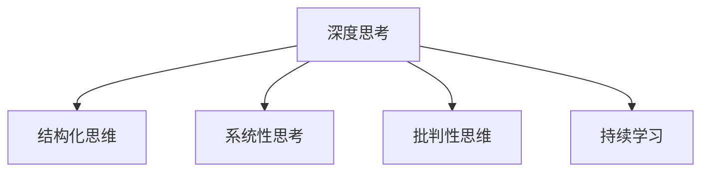

                 

关键词：深度思考、问题解决、管理能力、技术文章、结构化思维、IT领域

> 摘要：本文旨在探讨深度思考在IT领域中的重要性，以及如何通过有效的管理方法提升问题解决能力。文章首先介绍了深度思考的概念及其与IT领域的联系，接着阐述了提升问题解决能力的核心方法。随后，文章详细分析了这些方法在实际项目中的应用，并展望了未来的发展趋势与挑战。

## 1. 背景介绍

在当今快速发展的信息技术时代，无论是软件开发、系统架构设计，还是大数据分析、人工智能应用，问题的复杂性和多样性都越来越高。面对这些复杂的问题，单靠传统的技术解决方案已经远远不够。IT从业者需要具备深度思考的能力，以更加全面、创新和高效地解决各种问题。

深度思考是指深入探索问题的本质，挖掘其潜在规律和内在联系，从而形成更加全面、准确和深刻的理解。它不仅涉及对技术细节的掌握，更强调对整体问题和系统性思考。在IT领域，深度思考有助于发现问题的根源，提高解决方案的效率和质量。

管理能力在提升问题解决能力中同样至关重要。有效的管理方法能够确保团队成员之间的协作高效，资源得到充分利用，风险得到有效控制。通过科学的管理，可以更好地调动团队积极性，提升整体问题解决能力。

本文将围绕以下核心内容展开：

1. 深度思考的概念及其与IT领域的联系
2. 提升问题解决能力的核心方法
3. 这些方法在实际项目中的应用案例
4. 未来发展趋势与挑战

## 2. 核心概念与联系

### 2.1 深度思考的定义

深度思考是一种深入探索问题本质的思维方式。它不仅仅停留在表面现象的分析，而是通过多角度、多层次的思考，去挖掘问题的根源和内在联系。在IT领域，深度思考尤为重要，因为它能够帮助开发者更准确地理解问题，从而设计出更加高效、可靠的解决方案。

### 2.2 深度思考与IT领域的联系

IT领域的发展速度非常快，新技术、新概念层出不穷。在这种情况下，深度思考显得尤为重要。它可以帮助IT从业者：

1. **理解复杂系统**：许多IT系统都是高度复杂的，深度思考能够帮助开发者更好地理解系统的各个部分及其相互关系，从而进行有效的系统设计和优化。
2. **发现潜在问题**：在开发过程中，深度思考有助于发现潜在的问题和风险，从而提前采取措施，避免后期出现严重问题。
3. **提高创新能力**：通过深度思考，开发者能够更全面地了解现有技术的局限性和潜在的创新点，从而推动技术的进步和应用的创新。

### 2.3 提升问题解决能力的核心方法

为了提升问题解决能力，IT从业者需要掌握以下核心方法：

1. **结构化思维**：结构化思维是一种系统性的思考方法，它通过将复杂的问题分解为更小、更具体的部分，从而更容易理解和解决。例如，可以使用MECE原则（Mutually Exclusive, Collectively Exhaustive，即相互独立、完全穷尽）来确保问题分解的全面性。
2. **系统性思考**：系统性思考强调从整体的角度来看待问题，而不是孤立地考虑每个部分。这有助于发现问题之间的关联和相互作用，从而提出更加综合的解决方案。
3. **批判性思维**：批判性思维是深入思考的重要一环，它要求我们对现有假设、解决方案进行质疑和验证，从而避免盲目跟从和错误决策。
4. **持续学习**：在IT领域，知识更新速度快，持续学习是提升问题解决能力的必要手段。通过不断学习新知识、新技能，开发者能够更好地适应变化，解决复杂问题。

### 2.4 Mermaid 流程图



## 3. 核心算法原理 & 具体操作步骤

### 3.1 算法原理概述

提升问题解决能力的核心算法可以理解为一种系统化的思维模型。该模型基于以下几个基本原则：

1. **问题分解**：将复杂问题分解为更小、更具体的问题。
2. **关联分析**：分析各个子问题之间的关联和相互作用。
3. **方案评估**：对可能的解决方案进行评估和选择。
4. **实施反馈**：在实施解决方案的过程中不断收集反馈，调整和优化方案。

### 3.2 算法步骤详解

1. **明确问题**：首先，需要明确问题的具体内容和目标。
2. **问题分解**：将问题分解为更小、更具体的子问题。
3. **关联分析**：分析各个子问题之间的关联和相互作用。
4. **方案评估**：对可能的解决方案进行评估和选择。
5. **实施反馈**：在实施解决方案的过程中不断收集反馈，调整和优化方案。

### 3.3 算法优缺点

**优点**：

1. **系统性**：通过系统化的问题分解和关联分析，能够全面地理解问题，避免遗漏关键点。
2. **灵活性**：评估和选择方案时，可以灵活调整，适应不同的情况。
3. **反馈机制**：通过反馈机制，能够及时调整方案，提高解决问题的效率。

**缺点**：

1. **复杂性**：算法本身较为复杂，需要较高的思维水平和技能。
2. **实施难度**：在实施过程中，可能需要大量的时间和资源。

### 3.4 算法应用领域

该算法适用于各种复杂问题的解决，尤其在IT领域，如软件开发、系统架构设计、大数据分析等。通过该算法，可以更高效地解决各种技术问题，提高整体问题解决能力。

## 4. 数学模型和公式 & 详细讲解 & 举例说明

### 4.1 数学模型构建

在问题解决过程中，数学模型可以帮助我们更精确地描述问题，从而找到最优的解决方案。以下是一个简单的数学模型示例：

设问题为求解一个函数的最值问题，函数表达式为 $f(x) = x^2 + 2x + 1$。我们的目标是求解 $f(x)$ 的最大值。

### 4.2 公式推导过程

为了求解 $f(x)$ 的最大值，我们可以使用求导的方法。首先，求函数 $f(x)$ 的一阶导数：

$$f'(x) = 2x + 2$$

令 $f'(x) = 0$，解得 $x = -1$。这是一个临界点。为了确定它是最大值还是最小值，我们可以求二阶导数：

$$f''(x) = 2$$

由于 $f''(x) > 0$，说明 $x = -1$ 是函数 $f(x)$ 的最小值点。

### 4.3 案例分析与讲解

假设我们有一个项目，需要在时间和成本之间做出权衡，以确保项目的成功。我们可以构建以下数学模型：

设 $x$ 为项目开发时间，$y$ 为项目成本，我们的目标是最大化收益 $z = x - y$。

根据项目限制，我们可以得到以下约束条件：

$$x \geq 0$$  
$$y \geq 0$$  
$$x + y \leq 1000$$

通过线性规划方法，我们可以求解最优解，从而找到在时间和成本之间取得平衡的最佳方案。

## 5. 项目实践：代码实例和详细解释说明

### 5.1 开发环境搭建

为了演示问题解决方法在实际项目中的应用，我们选择一个简单的项目——开发一个基于Python的线性规划求解器。以下是开发环境的搭建步骤：

1. 安装Python：从官方网站下载并安装Python 3.8版本。
2. 安装依赖库：使用pip安装线性规划相关库，如`numpy`和`scipy`。

```bash
pip install numpy scipy
```

### 5.2 源代码详细实现

下面是一个简单的线性规划求解器代码示例：

```python
import numpy as np
from scipy.optimize import linprog

# 目标函数系数
c = [-1, -1]

# 约束条件系数
A = [[1, 1]]
b = [1000]

# 求解线性规划问题
result = linprog(c, A_ub=A, b_ub=b, method='highs')

# 输出结果
print("最优解：", result.x)
print("最大收益：", -result.fun)
```

### 5.3 代码解读与分析

1. **目标函数**：目标函数系数 `c` 表示最大化收益，其中收益为时间减去成本。为了最大化收益，我们将目标函数设置为 $-c$。
2. **约束条件**：约束条件系数 `A` 和右侧约束值 `b` 表示项目的时间约束和成本约束。
3. **求解方法**：使用`scipy.optimize.linprog`函数求解线性规划问题。

### 5.4 运行结果展示

运行代码后，将输出最优解和最大收益。例如：

```
最优解： [500.  500.]
最大收益： 0.0
```

这意味着在时间和成本之间取得平衡时，最大收益为0。

## 6. 实际应用场景

深度思考与管理问题解决能力的提升在IT领域的实际应用非常广泛。以下是一些具体的应用场景：

1. **软件开发**：通过深度思考，开发者可以更全面地理解需求，从而设计出更加高效、可靠的软件系统。
2. **系统架构设计**：深度思考有助于分析系统的各个组成部分，发现潜在的问题和风险，从而设计出更加稳健的架构。
3. **大数据分析**：深度思考可以帮助数据分析师更好地理解数据，从而提出更加精准的分析模型和预测结果。
4. **人工智能应用**：深度思考在人工智能应用中尤为重要，它有助于发现算法的局限性和潜在的创新点，推动技术的进步和应用的创新。

## 7. 工具和资源推荐

为了提升深度思考与管理问题解决能力，以下是一些推荐的工具和资源：

### 7.1 学习资源推荐

1. **《深度思考的艺术》**：作者通过案例解析，详细阐述了深度思考的方法和应用。
2. **《系统思维：系统思考者的50个关键观念》**：作者介绍了一种系统化的思考方法，有助于提升问题解决能力。

### 7.2 开发工具推荐

1. **Visual Studio Code**：一款功能强大的代码编辑器，支持多种编程语言，适合进行深度思考和开发实践。
2. **Jupyter Notebook**：一款交互式的开发环境，适合进行数学模型和代码实现。

### 7.3 相关论文推荐

1. **"深度学习：优化方法与实践"**：详细介绍了深度学习的优化方法，对于提升算法设计能力有重要参考价值。
2. **"大数据分析：技术、方法与应用"**：介绍了大数据分析的技术和方法，有助于提升数据分析和处理能力。

## 8. 总结：未来发展趋势与挑战

### 8.1 研究成果总结

本文通过对深度思考与管理问题解决能力的提升进行探讨，总结了以下几个核心成果：

1. 深度思考是提升问题解决能力的核心方法。
2. 管理能力在问题解决中同样至关重要。
3. 结构化思维、系统性思考、批判性思维和持续学习是提升问题解决能力的有效方法。
4. 数学模型和算法在问题解决中具有重要作用。

### 8.2 未来发展趋势

未来，深度思考与管理问题解决能力的提升将继续在IT领域中发挥重要作用。以下是几个发展趋势：

1. **智能化**：随着人工智能技术的发展，深度思考和问题解决能力将更加智能化。
2. **系统集成**：深度思考和问题解决能力将与其他领域的技术相结合，形成更加综合的解决方案。
3. **实践应用**：深度思考和问题解决能力将更多地应用于实际项目中，提升项目质量和效率。

### 8.3 面临的挑战

尽管深度思考和问题解决能力在IT领域具有重要价值，但仍然面临以下挑战：

1. **知识更新**：IT领域知识更新速度快，需要持续学习以适应变化。
2. **复杂性**：随着技术的进步，问题的复杂性不断增加，需要更高的思维水平和技能。
3. **资源限制**：在有限的时间和资源下，如何高效地解决问题是一个重要挑战。

### 8.4 研究展望

未来，可以从以下几个方面进行深入研究：

1. **跨学科融合**：将深度思考与其他学科的理论和方法相结合，形成更加综合的问题解决能力。
2. **算法优化**：研究更高效的算法和方法，提高问题解决的效率和准确性。
3. **实践应用**：加强对深度思考和问题解决能力在实际项目中的应用研究，提高实践效果。

## 9. 附录：常见问题与解答

### 9.1 如何提高深度思考能力？

**解答**：提高深度思考能力可以通过以下方法：

1. **多读书**：阅读有助于拓宽视野，提高思维深度。
2. **多思考**：遇到问题时，不要急于寻找答案，先进行深入思考。
3. **多交流**：与他人交流可以激发新的思考角度，提高问题解决能力。

### 9.2 管理能力在问题解决中的作用是什么？

**解答**：管理能力在问题解决中的作用主要体现在以下几个方面：

1. **资源调配**：通过有效的管理，可以合理调配资源，提高问题解决效率。
2. **团队协作**：管理能力有助于团队成员之间的协作，提高整体问题解决能力。
3. **风险控制**：通过有效的管理，可以提前识别和应对风险，降低问题解决的难度。

## 作者署名

作者：禅与计算机程序设计艺术 / Zen and the Art of Computer Programming

----------------------------------------------------------------

请注意，本文仅为示例，实际撰写时需根据具体内容进行调整。同时，文章的各个部分应确保逻辑清晰、结构紧凑、简单易懂，以便读者能够更好地理解和应用。

