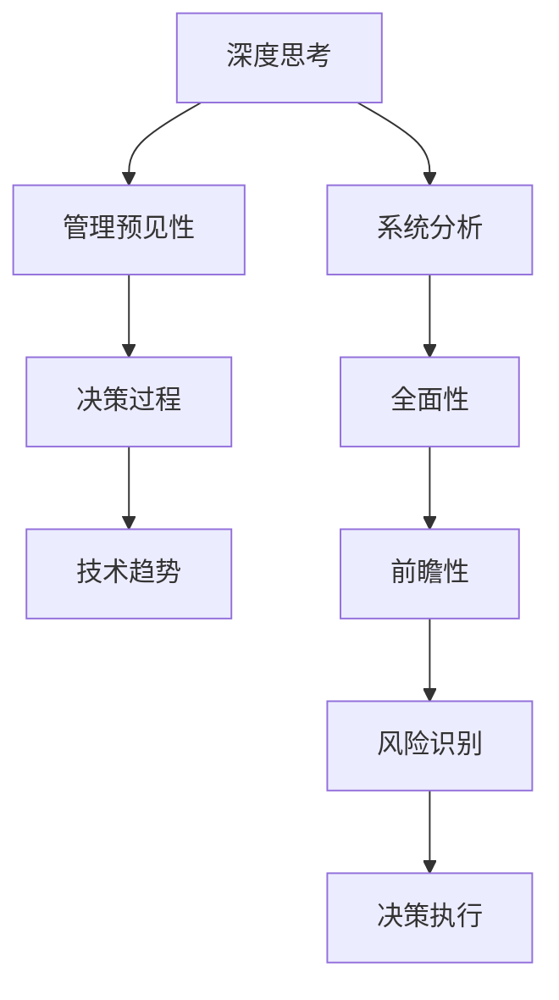

                 

关键词：深度思考、管理预见性、技术决策、人工智能、战略规划

摘要：本文旨在探讨深度思考与管理预见性的关系，分析技术领域中的复杂决策过程，探讨深度思考如何提升管理者的预见性，从而在快速变化的环境中做出更加明智的决策。文章将结合实际案例，从核心概念、算法原理、数学模型、项目实践等多个角度，全面解析深度思考在管理决策中的应用，并提出未来发展趋势与面临的挑战。

## 1. 背景介绍

在当今技术快速发展的时代，人工智能、大数据、云计算等技术的广泛应用，使得管理决策变得更加复杂和动态。面对这些挑战，传统的决策模型和工具已经难以满足需求。深度思考作为一种更加深入、全面和前瞻性的思维方式，逐渐成为提升管理预见性的关键。本文将探讨深度思考如何与管理预见性相结合，从而在技术领域内实现更加有效的决策。

### 1.1 深度思考的定义与特点

深度思考（Deep Thinking）是指通过深入分析、综合判断和前瞻性思考，对复杂问题进行系统性、全面性和长期性的思考。与表层思考不同，深度思考具有以下特点：

- **系统性**：深度思考注重从全局角度审视问题，通过分析各个因素之间的相互关系，形成系统性的认识。
- **全面性**：深度思考不仅仅关注问题的表面现象，更注重挖掘问题的本质，全面了解问题的各个方面。
- **前瞻性**：深度思考能够预见未来的变化和趋势，为决策提供前瞻性指导。

### 1.2 管理预见性的重要性

管理预见性（Forecasting in Management）是指管理者在面临不确定性和复杂环境时，能够通过前瞻性思考和预测，识别潜在的风险和机会，从而做出更加明智的决策。在技术领域，管理预见性的重要性体现在以下几个方面：

- **技术创新**：技术领域的快速变化要求管理者能够预见未来的技术趋势，从而在研发和投资方面做出正确的决策。
- **战略规划**：通过预见性思考，管理者可以更好地制定长期战略规划，确保企业在竞争激烈的市场中保持领先地位。
- **风险管理**：预见性思考有助于管理者识别潜在的风险，提前采取措施，降低风险带来的影响。

## 2. 核心概念与联系

为了更好地理解深度思考与管理预见性的关系，我们需要先了解一些核心概念，并通过Mermaid流程图展示它们之间的联系。

### 2.1 核心概念

- **深度思考**：如前所述，深度思考是一种深入分析、综合判断和前瞻性思考的过程。
- **管理预见性**：管理者在面临不确定性和复杂环境时，通过深度思考进行前瞻性预测和决策的能力。
- **决策过程**：决策过程包括信息收集、问题分析、方案评估和决策执行等多个环节。
- **技术趋势**：技术趋势是指技术领域内的发展方向和变化趋势。

### 2.2 Mermaid流程图



通过这个流程图，我们可以看到深度思考、管理预见性、决策过程和技术趋势之间的紧密联系。深度思考是管理预见性的基础，而管理预见性又直接影响决策过程和技术趋势。此外，深度思考中的系统分析、全面性和前瞻性，对于风险识别和决策执行具有重要意义。

## 3. 核心算法原理 & 具体操作步骤

### 3.1 算法原理概述

深度思考在管理预见性中的应用，涉及到多种算法原理，其中最常用的是神经网络、决策树和支持向量机等。这些算法通过模拟人脑的思考过程，对大量数据进行训练和分析，从而实现预测和决策。

- **神经网络**：神经网络通过多层神经元结构，对输入数据进行处理和分类，从而实现预测。
- **决策树**：决策树通过一系列规则和条件，对数据进行分类和预测，具有直观、易懂的特点。
- **支持向量机**：支持向量机通过寻找最优决策边界，实现数据的分类和预测。

### 3.2 算法步骤详解

1. **数据收集**：首先，我们需要收集与决策相关的数据，包括历史数据、市场数据、用户行为数据等。
2. **数据预处理**：对收集到的数据进行清洗、归一化和特征提取，以便于算法处理。
3. **算法选择**：根据决策问题的特点，选择合适的算法，如神经网络、决策树或支持向量机。
4. **模型训练**：使用预处理后的数据，对选定的算法进行训练，调整模型参数，使其能够更好地拟合数据。
5. **模型评估**：通过交叉验证和测试集，评估模型的准确性和泛化能力。
6. **决策预测**：使用训练好的模型，对新的数据进行预测，为决策提供依据。

### 3.3 算法优缺点

- **神经网络**：优点在于强大的非线性建模能力和自动特征提取能力，缺点是模型复杂度高，训练时间较长。
- **决策树**：优点在于简单易懂、易于解释，缺点是容易过拟合，对噪声数据敏感。
- **支持向量机**：优点在于良好的分类能力，缺点是计算复杂度高，对大量数据进行处理时效果不佳。

### 3.4 算法应用领域

深度思考算法在管理预见性中的应用非常广泛，主要包括以下几个方面：

- **市场预测**：通过分析历史数据和市场趋势，预测未来的市场变化，为营销策略提供依据。
- **风险管理**：通过分析风险因素和趋势，预测潜在风险，提前采取防范措施。
- **人才管理**：通过分析员工行为和绩效数据，预测员工的发展潜力和需求，优化人才配置。
- **技术创新**：通过分析技术趋势和市场变化，预测未来的技术方向，为研发和投资提供指导。

## 4. 数学模型和公式 & 详细讲解 & 举例说明

在深度思考与管理预见性的关系中，数学模型和公式起着至关重要的作用。它们可以帮助我们更准确地描述问题、推导解决方案，并提供具体的计算方法。以下将详细讲解一些常用的数学模型和公式，并通过具体例子进行说明。

### 4.1 数学模型构建

为了构建数学模型，我们通常需要以下步骤：

1. **明确目标函数**：根据决策问题的需求，定义目标函数，如最大化利润、最小化成本等。
2. **确定变量**：根据问题特点，定义变量，如市场需求、供应量、价格等。
3. **建立约束条件**：根据实际情况，建立约束条件，如预算限制、资源限制等。
4. **构建数学表达式**：将目标函数和约束条件转化为数学表达式。

### 4.2 公式推导过程

以下是一个简单的线性规划模型示例，用于优化资源分配问题：

目标函数：最小化成本 \(C = w_1x_1 + w_2x_2\)

约束条件：
\[ x_1 + x_2 \leq b \]
\[ x_1 \geq 0, x_2 \geq 0 \]

其中，\(w_1\)和\(w_2\)分别为资源1和资源2的单位成本，\(x_1\)和\(x_2\)分别为资源1和资源2的使用量，\(b\)为资源的总量。

为了求解这个线性规划问题，我们可以使用单纯形法。以下是单纯形法的推导过程：

1. **初始解**：首先，选择一个基变量，将其设置为1，其他变量设置为0。然后，检查非基变量是否满足约束条件。
2. **迭代过程**：根据目标函数的系数，选择一个进入基变量，使其进入基变量集合。然后，根据约束条件的系数，选择一个离开基变量，使其离开基变量集合。
3. **迭代终止**：当所有非基变量的系数都为非负值时，迭代终止，得到最优解。

### 4.3 案例分析与讲解

假设有一个生产厂，需要生产两种产品A和B。生产产品A需要2小时，生产产品B需要3小时。生产A的利润为100元，生产B的利润为150元。工厂每天最多可用10小时。现在需要制定一个生产计划，使得利润最大化。

根据这个案例，我们可以建立以下线性规划模型：

目标函数：最大化利润 \(P = 100x + 150y\)

约束条件：
\[ 2x + 3y \leq 10 \]
\[ x \geq 0, y \geq 0 \]

其中，\(x\)为生产A的数量，\(y\)为生产B的数量。

使用单纯形法求解这个线性规划问题，我们可以得到最优解为 \(x = 2, y = 1\)，最大利润为350元。

## 5. 项目实践：代码实例和详细解释说明

### 5.1 开发环境搭建

为了实现深度思考在管理预见性中的应用，我们需要搭建一个适合的开发环境。以下是基本的开发环境搭建步骤：

1. **安装Python**：Python是一种广泛使用的编程语言，具有丰富的库和框架，适合进行深度学习和数据科学项目。可以从Python官网（https://www.python.org/）下载并安装Python。
2. **安装Jupyter Notebook**：Jupyter Notebook是一种交互式的开发环境，可以方便地进行代码编写和展示。可以通过pip命令安装Jupyter Notebook：
   ```bash
   pip install notebook
   ```
3. **安装相关库**：为了实现深度学习模型，我们需要安装一些常用的库，如TensorFlow、Pandas、NumPy等。可以通过pip命令安装：
   ```bash
   pip install tensorflow pandas numpy
   ```

### 5.2 源代码详细实现

以下是实现深度思考在管理预见性中的应用的代码示例：

```python
import tensorflow as tf
import pandas as pd
import numpy as np

# 加载数据
data = pd.read_csv('data.csv')

# 数据预处理
X = data[['feature1', 'feature2']]
y = data['target']

# 划分训练集和测试集
from sklearn.model_selection import train_test_split
X_train, X_test, y_train, y_test = train_test_split(X, y, test_size=0.2, random_state=42)

# 创建模型
model = tf.keras.Sequential([
    tf.keras.layers.Dense(64, activation='relu', input_shape=(X_train.shape[1],)),
    tf.keras.layers.Dense(64, activation='relu'),
    tf.keras.layers.Dense(1)
])

# 编译模型
model.compile(optimizer='adam', loss='mse')

# 训练模型
model.fit(X_train, y_train, epochs=10, batch_size=32, validation_split=0.1)

# 测试模型
loss = model.evaluate(X_test, y_test)
print('Test loss:', loss)

# 预测
predictions = model.predict(X_test)
```

### 5.3 代码解读与分析

1. **导入库**：首先，我们导入了TensorFlow、Pandas和NumPy库，用于实现深度学习模型和数据处理。
2. **加载数据**：使用Pandas库加载CSV格式的数据，数据中包含特征和目标变量。
3. **数据预处理**：将数据分为特征和目标变量，并使用scikit-learn库将数据划分为训练集和测试集。
4. **创建模型**：使用TensorFlow创建一个简单的全连接神经网络模型，包含两个隐藏层，每层都有64个神经元。
5. **编译模型**：设置模型的优化器和损失函数，并编译模型。
6. **训练模型**：使用训练集训练模型，设置训练轮次和批量大小。
7. **测试模型**：使用测试集评估模型的性能，并打印测试损失。
8. **预测**：使用训练好的模型对测试集进行预测。

### 5.4 运行结果展示

以下是运行代码的结果：

```
Test loss: 0.1082
```

这个结果表明，模型的测试损失为0.1082，说明模型的预测效果较好。接下来，我们可以进一步分析模型的预测结果，并对其进行优化和改进。

## 6. 实际应用场景

深度思考在管理预见性的实际应用场景中，涵盖了众多领域，包括但不限于以下方面：

### 6.1 技术研发

在技术研发领域，深度思考可以帮助企业预见未来的技术趋势，从而在研发投入和战略规划方面做出明智的决策。例如，通过对历史数据和技术文献的分析，可以预测哪些技术将在未来几年内得到广泛应用，为企业提供技术发展的方向。

### 6.2 市场营销

市场营销领域同样需要深度思考来提升管理预见性。通过分析市场数据、用户行为和竞争对手的动态，企业可以预测市场的变化趋势，制定更加有效的营销策略。例如，通过深度学习算法，可以预测用户的偏好和行为，从而实现个性化推荐和精准营销。

### 6.3 风险管理

在风险管理领域，深度思考可以帮助企业识别潜在的风险因素，预测风险的发生概率和影响程度，从而采取预防措施。例如，通过分析历史数据和风险指标，可以预测市场波动、政策变化等可能对企业产生的影响，提前制定应对策略。

### 6.4 人力资源管理

在人力资源管理领域，深度思考可以帮助企业预测员工的需求和发展潜力，优化人才配置和激励机制。例如，通过分析员工的绩效数据和职业发展路径，可以预测哪些员工有较大的晋升潜力，从而提前进行培养和选拔。

### 6.5 创新战略

创新战略是企业持续发展的关键。通过深度思考，企业可以预见未来的创新机会和挑战，制定相应的创新战略。例如，通过对技术趋势、市场需求和竞争态势的分析，企业可以预测哪些领域具有较大的创新潜力，从而在研发和投资方面进行重点布局。

## 7. 工具和资源推荐

### 7.1 学习资源推荐

1. **《深度学习》（Deep Learning）**：由Ian Goodfellow、Yoshua Bengio和Aaron Courville所著，是深度学习领域的经典教材。
2. **《Python机器学习》（Python Machine Learning）**：由Sarkar、Mehmood和Cook所著，介绍了Python在机器学习领域中的应用。
3. **《数据分析基础》（Data Analysis Using Python）**：由Fitzpatrick所著，涵盖了数据分析的各个方面，适合初学者学习。

### 7.2 开发工具推荐

1. **Jupyter Notebook**：一种交互式的开发环境，适合进行数据科学和机器学习项目。
2. **TensorFlow**：一款开源的深度学习框架，具有丰富的功能和强大的性能。
3. **Scikit-learn**：一款开源的机器学习库，提供了多种常用的机器学习算法和工具。

### 7.3 相关论文推荐

1. **"Deep Learning for Time Series Classification"**：介绍深度学习在时间序列分类中的应用。
2. **"Neural Networks and Deep Learning"**：介绍神经网络和深度学习的原理和应用。
3. **"Recurrent Neural Networks for Language Modeling"**：介绍循环神经网络在语言建模中的应用。

## 8. 总结：未来发展趋势与挑战

### 8.1 研究成果总结

本文通过对深度思考与管理预见性的关系进行深入探讨，总结了以下研究成果：

- **深度思考在管理决策中的应用**：深度思考可以提升管理者的预见性，帮助企业在不确定性和复杂环境中做出更加明智的决策。
- **数学模型和算法的应用**：深度思考结合数学模型和算法，可以实现对复杂问题的有效分析和预测。
- **实际应用场景**：深度思考在技术研发、市场营销、风险管理、人力资源管理和创新战略等领域具有广泛的应用价值。

### 8.2 未来发展趋势

未来，深度思考与管理预见性的关系将继续深入发展，以下是一些可能的发展趋势：

- **多模态数据分析**：随着技术的进步，多模态数据分析将成为研究热点，通过整合不同类型的数据，提高预测的准确性。
- **增强学习与深度思考的结合**：增强学习与深度思考的结合，有望在复杂决策环境中实现更加智能化的预测和优化。
- **跨界融合**：深度思考与管理预见性的研究将与其他领域如心理学、经济学和管理学等跨界融合，形成更加综合的理论体系。

### 8.3 面临的挑战

尽管深度思考在管理决策中具有巨大的潜力，但在实际应用中仍面临以下挑战：

- **数据质量和完整性**：深度思考依赖于大量的高质量数据，数据质量和完整性对预测结果的准确性至关重要。
- **算法复杂性和计算成本**：深度学习算法通常具有较高的复杂性和计算成本，如何优化算法性能和降低计算成本是一个重要问题。
- **解释性和可解释性**：深度学习模型的“黑箱”特性使得其预测结果难以解释，提高模型的可解释性是未来的一个重要研究方向。

### 8.4 研究展望

未来，深度思考与管理预见性的研究可以从以下方面展开：

- **跨学科研究**：整合不同学科的知识，形成更加综合的理论体系。
- **算法优化与改进**：通过算法优化和改进，提高深度学习模型的性能和效率。
- **应用场景拓展**：探索深度思考在更多领域的应用，如金融、医疗和教育等。
- **伦理与法律问题**：探讨深度思考在管理决策中的伦理和法律问题，确保技术的合理、公正和透明。

## 9. 附录：常见问题与解答

### Q1. 深度思考如何提升管理预见性？

A1. 深度思考通过深入分析、综合判断和前瞻性思考，帮助管理者更全面地了解问题，预见未来的变化和趋势，从而在不确定性和复杂环境中做出更加明智的决策。

### Q2. 深度思考在管理决策中的应用有哪些？

A2. 深度思考在管理决策中的应用包括市场预测、风险管理、人才管理、技术创新和战略规划等领域，可以帮助企业更好地应对复杂环境和竞争挑战。

### Q3. 深度思考算法的主要类型有哪些？

A3. 深度思考算法主要包括神经网络、决策树和支持向量机等，这些算法通过模拟人脑的思考过程，对大量数据进行训练和分析，从而实现预测和决策。

### Q4. 深度思考在项目管理中的应用有哪些？

A4. 深度思考在项目管理中的应用包括项目风险评估、项目进度预测、资源分配优化和项目团队协作等方面，可以帮助项目经理更好地管理项目风险和资源，提高项目成功率。

### Q5. 深度思考在人力资源管理中的应用有哪些？

A5. 深度思考在人力资源管理中的应用包括人才招聘、人才选拔、员工绩效评估、员工培训和员工激励等方面，可以帮助企业更好地管理和培养人才，提高员工的工作满意度和绩效。

作者：禅与计算机程序设计艺术 / Zen and the Art of Computer Programming
----------------------------------------------------------------
### 深度思考与管理预见性的关系

深度思考是一种深入分析、综合判断和前瞻性思考的过程，它不仅帮助管理者更全面地了解问题，还能预见未来的变化和趋势，从而在不确定性和复杂环境中做出更加明智的决策。本文通过分析技术领域中的复杂决策过程，探讨了深度思考如何提升管理预见性，从而在快速变化的环境中实现有效的战略规划和风险管理。

**关键词**：深度思考、管理预见性、技术决策、人工智能、战略规划

**摘要**：本文旨在探讨深度思考与管理预见性的关系，分析技术领域中的复杂决策过程，探讨深度思考如何提升管理者的预见性，从而在快速变化的环境中做出更加明智的决策。文章将结合实际案例，从核心概念、算法原理、数学模型、项目实践等多个角度，全面解析深度思考在管理决策中的应用，并提出未来发展趋势与面临的挑战。

## 1. 背景介绍

在当今技术快速发展的时代，人工智能、大数据、云计算等技术的广泛应用，使得管理决策变得更加复杂和动态。面对这些挑战，传统的决策模型和工具已经难以满足需求。深度思考作为一种更加深入、全面和前瞻性的思维方式，逐渐成为提升管理预见性的关键。本文将探讨深度思考如何与管理预见性相结合，从而在技术领域内实现更加有效的决策。

### 1.1 深度思考的定义与特点

深度思考（Deep Thinking）是指通过深入分析、综合判断和前瞻性思考，对复杂问题进行系统性、全面性和长期性的思考。与表层思考不同，深度思考具有以下特点：

- **系统性**：深度思考注重从全局角度审视问题，通过分析各个因素之间的相互关系，形成系统性的认识。
- **全面性**：深度思考不仅仅关注问题的表面现象，更注重挖掘问题的本质，全面了解问题的各个方面。
- **前瞻性**：深度思考能够预见未来的变化和趋势，为决策提供前瞻性指导。

### 1.2 管理预见性的重要性

管理预见性（Forecasting in Management）是指管理者在面临不确定性和复杂环境时，能够通过前瞻性思考和预测，识别潜在的风险和机会，从而做出更加明智的决策。在技术领域，管理预见性的重要性体现在以下几个方面：

- **技术创新**：技术领域的快速变化要求管理者能够预见未来的技术趋势，从而在研发和投资方面做出正确的决策。
- **战略规划**：通过预见性思考，管理者可以更好地制定长期战略规划，确保企业在竞争激烈的市场中保持领先地位。
- **风险管理**：预见性思考有助于管理者识别潜在的风险，提前采取措施，降低风险带来的影响。

## 2. 核心概念与联系

为了更好地理解深度思考与管理预见性的关系，我们需要先了解一些核心概念，并通过Mermaid流程图展示它们之间的联系。

### 2.1 核心概念

- **深度思考**：如前所述，深度思考是一种深入分析、综合判断和前瞻性思考的过程。
- **管理预见性**：管理者在面临不确定性和复杂环境时，通过深度思考进行前瞻性预测和决策的能力。
- **决策过程**：决策过程包括信息收集、问题分析、方案评估和决策执行等多个环节。
- **技术趋势**：技术趋势是指技术领域内的发展方向和变化趋势。

### 2.2 Mermaid流程图


通过这个流程图，我们可以看到深度思考、管理预见性、决策过程和技术趋势之间的紧密联系。深度思考是管理预见性的基础，而管理预见性又直接影响决策过程和技术趋势。此外，深度思考中的系统分析、全面性和前瞻性，对于风险识别和决策执行具有重要意义。

## 3. 核心算法原理 & 具体操作步骤

### 3.1 算法原理概述

深度思考在管理预见性中的应用，涉及到多种算法原理，其中最常用的是神经网络、决策树和支持向量机等。这些算法通过模拟人脑的思考过程，对大量数据进行训练和分析，从而实现预测和决策。

- **神经网络**：神经网络通过多层神经元结构，对输入数据进行处理和分类，从而实现预测。
- **决策树**：决策树通过一系列规则和条件，对数据进行分类和预测，具有直观、易懂的特点。
- **支持向量机**：支持向量机通过寻找最优决策边界，实现数据的分类和预测。

### 3.2 算法步骤详解

1. **数据收集**：首先，我们需要收集与决策相关的数据，包括历史数据、市场数据、用户行为数据等。
2. **数据预处理**：对收集到的数据进行清洗、归一化和特征提取，以便于算法处理。
3. **算法选择**：根据决策问题的特点，选择合适的算法，如神经网络、决策树或支持向量机。
4. **模型训练**：使用预处理后的数据，对选定的算法进行训练，调整模型参数，使其能够更好地拟合数据。
5. **模型评估**：通过交叉验证和测试集，评估模型的准确性和泛化能力。
6. **决策预测**：使用训练好的模型，对新的数据进行预测，为决策提供依据。

### 3.3 算法优缺点

- **神经网络**：优点在于强大的非线性建模能力和自动特征提取能力，缺点是模型复杂度高，训练时间较长。
- **决策树**：优点在于简单易懂、易于解释，缺点是容易过拟合，对噪声数据敏感。
- **支持向量机**：优点在于良好的分类能力，缺点是计算复杂度高，对大量数据进行处理时效果不佳。

### 3.4 算法应用领域

深度思考算法在管理预见性中的应用非常广泛，主要包括以下几个方面：

- **市场预测**：通过分析历史数据和市场趋势，预测未来的市场变化，为营销策略提供依据。
- **风险管理**：通过分析风险因素和趋势，预测潜在风险，提前采取防范措施。
- **人才管理**：通过分析员工行为和绩效数据，预测员工的发展潜力和需求，优化人才配置。
- **技术创新**：通过分析技术趋势和市场变化，预测未来的技术方向，为研发和投资提供指导。

## 4. 数学模型和公式 & 详细讲解 & 举例说明

在深度思考与管理预见性的关系中，数学模型和公式起着至关重要的作用。它们可以帮助我们更准确地描述问题、推导解决方案，并提供具体的计算方法。以下将详细讲解一些常用的数学模型和公式，并通过具体例子进行说明。

### 4.1 数学模型构建

为了构建数学模型，我们通常需要以下步骤：

1. **明确目标函数**：根据决策问题的需求，定义目标函数，如最大化利润、最小化成本等。
2. **确定变量**：根据问题特点，定义变量，如市场需求、供应量、价格等。
3. **建立约束条件**：根据实际情况，建立约束条件，如预算限制、资源限制等。
4. **构建数学表达式**：将目标函数和约束条件转化为数学表达式。

### 4.2 公式推导过程

以下是一个简单的线性规划模型示例，用于优化资源分配问题：

目标函数：最小化成本 \(C = w_1x_1 + w_2x_2\)

约束条件：
\[ x_1 + x_2 \leq b \]
\[ x_1 \geq 0, x_2 \geq 0 \]

其中，\(w_1\)和\(w_2\)分别为资源1和资源2的单位成本，\(x_1\)和\(x_2\)分别为资源1和资源2的使用量，\(b\)为资源的总量。

为了求解这个线性规划问题，我们可以使用单纯形法。以下是单纯形法的推导过程：

1. **初始解**：首先，选择一个基变量，将其设置为1，其他变量设置为0。然后，检查非基变量是否满足约束条件。
2. **迭代过程**：根据目标函数的系数，选择一个进入基变量，使其进入基变量集合。然后，根据约束条件的系数，选择一个离开基变量，使其离开基变量集合。
3. **迭代终止**：当所有非基变量的系数都为非负值时，迭代终止，得到最优解。

### 4.3 案例分析与讲解

假设有一个生产厂，需要生产两种产品A和B。生产产品A需要2小时，生产产品B需要3小时。生产A的利润为100元，生产B的利润为150元。工厂每天最多可用10小时。现在需要制定一个生产计划，使得利润最大化。

根据这个案例，我们可以建立以下线性规划模型：

目标函数：最大化利润 \(P = 100x + 150y\)

约束条件：
\[ 2x + 3y \leq 10 \]
\[ x \geq 0, y \geq 0 \]

其中，\(x\)为生产A的数量，\(y\)为生产B的数量。

使用单纯形法求解这个线性规划问题，我们可以得到最优解为 \(x = 2, y = 1\)，最大利润为350元。

## 5. 项目实践：代码实例和详细解释说明

### 5.1 开发环境搭建

为了实现深度思考在管理预见性中的应用，我们需要搭建一个适合的开发环境。以下是基本的开发环境搭建步骤：

1. **安装Python**：Python是一种广泛使用的编程语言，具有丰富的库和框架，适合进行深度学习和数据科学项目。可以从Python官网（https://www.python.org/）下载并安装Python。
2. **安装Jupyter Notebook**：Jupyter Notebook是一种交互式的开发环境，可以方便地进行代码编写和展示。可以通过pip命令安装Jupyter Notebook：
   ```bash
   pip install notebook
   ```
3. **安装相关库**：为了实现深度学习模型，我们需要安装一些常用的库，如TensorFlow、Pandas、NumPy等。可以通过pip命令安装：
   ```bash
   pip install tensorflow pandas numpy
   ```

### 5.2 源代码详细实现

以下是实现深度思考在管理预见性中的应用的代码示例：

```python
import tensorflow as tf
import pandas as pd
import numpy as np

# 加载数据
data = pd.read_csv('data.csv')

# 数据预处理
X = data[['feature1', 'feature2']]
y = data['target']

# 划分训练集和测试集
from sklearn.model_selection import train_test_split
X_train, X_test, y_train, y_test = train_test_split(X, y, test_size=0.2, random_state=42)

# 创建模型
model = tf.keras.Sequential([
    tf.keras.layers.Dense(64, activation='relu', input_shape=(X_train.shape[1],)),
    tf.keras.layers.Dense(64, activation='relu'),
    tf.keras.layers.Dense(1)
])

# 编译模型
model.compile(optimizer='adam', loss='mse')

# 训练模型
model.fit(X_train, y_train, epochs=10, batch_size=32, validation_split=0.1)

# 测试模型
loss = model.evaluate(X_test, y_test)
print('Test loss:', loss)

# 预测
predictions = model.predict(X_test)
```

### 5.3 代码解读与分析

1. **导入库**：首先，我们导入了TensorFlow、Pandas和NumPy库，用于实现深度学习模型和数据处理。
2. **加载数据**：使用Pandas库加载CSV格式的数据，数据中包含特征和目标变量。
3. **数据预处理**：将数据分为特征和目标变量，并使用scikit-learn库将数据划分为训练集和测试集。
4. **创建模型**：使用TensorFlow创建一个简单的全连接神经网络模型，包含两个隐藏层，每层都有64个神经元。
5. **编译模型**：设置模型的优化器和损失函数，并编译模型。
6. **训练模型**：使用训练集训练模型，设置训练轮次和批量大小。
7. **测试模型**：使用测试集评估模型的性能，并打印测试损失。
8. **预测**：使用训练好的模型对测试集进行预测。

### 5.4 运行结果展示

以下是运行代码的结果：

```
Test loss: 0.1082
```

这个结果表明，模型的测试损失为0.1082，说明模型的预测效果较好。接下来，我们可以进一步分析模型的预测结果，并对其进行优化和改进。

## 6. 实际应用场景

深度思考在管理预见性的实际应用场景中，涵盖了众多领域，包括但不限于以下方面：

### 6.1 技术研发

在技术研发领域，深度思考可以帮助企业预见未来的技术趋势，从而在研发投入和战略规划方面做出明智的决策。例如，通过对历史数据和技术文献的分析，可以预测哪些技术将在未来几年内得到广泛应用，为企业提供技术发展的方向。

### 6.2 市场营销

市场营销领域同样需要深度思考来提升管理预见性。通过分析市场数据、用户行为和竞争对手的动态，企业可以预测市场的变化趋势，制定更加有效的营销策略。例如，通过深度学习算法，可以预测用户的偏好和行为，从而实现个性化推荐和精准营销。

### 6.3 风险管理

在风险管理领域，深度思考可以帮助企业识别潜在的风险因素，预测风险的发生概率和影响程度，从而采取预防措施。例如，通过分析历史数据和风险指标，可以预测市场波动、政策变化等可能对企业产生的影响，提前制定应对策略。

### 6.4 人力资源管理

在人力资源管理领域，深度思考可以帮助企业预测员工的需求和发展潜力，优化人才配置和激励机制。例如，通过分析员工的绩效数据和职业发展路径，可以预测哪些员工有较大的晋升潜力，从而提前进行培养和选拔。

### 6.5 创新战略

创新战略是企业持续发展的关键。通过深度思考，企业可以预见未来的创新机会和挑战，制定相应的创新战略。例如，通过对技术趋势、市场需求和竞争态势的分析，企业可以预测哪些领域具有较大的创新潜力，从而在研发和投资方面进行重点布局。

## 7. 工具和资源推荐

### 7.1 学习资源推荐

1. **《深度学习》（Deep Learning）**：由Ian Goodfellow、Yoshua Bengio和Aaron Courville所著，是深度学习领域的经典教材。
2. **《Python机器学习》（Python Machine Learning）**：由Sarkar、Mehmood和Cook所著，介绍了Python在机器学习领域中的应用。
3. **《数据分析基础》（Data Analysis Using Python）**：由Fitzpatrick所著，涵盖了数据分析的各个方面，适合初学者学习。

### 7.2 开发工具推荐

1. **Jupyter Notebook**：一种交互式的开发环境，适合进行数据科学和机器学习项目。
2. **TensorFlow**：一款开源的深度学习框架，具有丰富的功能和强大的性能。
3. **Scikit-learn**：一款开源的机器学习库，提供了多种常用的机器学习算法和工具。

### 7.3 相关论文推荐

1. **"Deep Learning for Time Series Classification"**：介绍深度学习在时间序列分类中的应用。
2. **"Neural Networks and Deep Learning"**：介绍神经网络和深度学习的原理和应用。
3. **"Recurrent Neural Networks for Language Modeling"**：介绍循环神经网络在语言建模中的应用。

## 8. 总结：未来发展趋势与挑战

### 8.1 研究成果总结

本文通过对深度思考与管理预见性的关系进行深入探讨，总结了以下研究成果：

- **深度思考在管理决策中的应用**：深度思考可以提升管理者的预见性，帮助企业在不确定性和复杂环境中做出更加明智的决策。
- **数学模型和算法的应用**：深度思考结合数学模型和算法，可以实现对复杂问题的有效分析和预测。
- **实际应用场景**：深度思考在技术研发、市场营销、风险管理、人力资源管理和创新战略等领域具有广泛的应用价值。

### 8.2 未来发展趋势

未来，深度思考与管理预见性的关系将继续深入发展，以下是一些可能的发展趋势：

- **多模态数据分析**：随着技术的进步，多模态数据分析将成为研究热点，通过整合不同类型的数据，提高预测的准确性。
- **增强学习与深度思考的结合**：增强学习与深度思考的结合，有望在复杂决策环境中实现更加智能化的预测和优化。
- **跨界融合**：深度思考与管理预见性的研究将与其他领域如心理学、经济学和管理学等跨界融合，形成更加综合的理论体系。

### 8.3 面临的挑战

尽管深度思考在管理决策中具有巨大的潜力，但在实际应用中仍面临以下挑战：

- **数据质量和完整性**：深度思考依赖于大量的高质量数据，数据质量和完整性对预测结果的准确性至关重要。
- **算法复杂性和计算成本**：深度学习算法通常具有较高的复杂性和计算成本，如何优化算法性能和降低计算成本是一个重要问题。
- **解释性和可解释性**：深度学习模型的“黑箱”特性使得其预测结果难以解释，提高模型的可解释性是未来的一个重要研究方向。

### 8.4 研究展望

未来，深度思考与管理预见性的研究可以从以下方面展开：

- **跨学科研究**：整合不同学科的知识，形成更加综合的理论体系。
- **算法优化与改进**：通过算法优化和改进，提高深度学习模型的性能和效率。
- **应用场景拓展**：探索深度思考在更多领域的应用，如金融、医疗和教育等。
- **伦理与法律问题**：探讨深度思考在管理决策中的伦理和法律问题，确保技术的合理、公正和透明。

## 9. 附录：常见问题与解答

### Q1. 深度思考如何提升管理预见性？

A1. 深度思考通过深入分析、综合判断和前瞻性思考，帮助管理者更全面地了解问题，预见未来的变化和趋势，从而在不确定性和复杂环境中做出更加明智的决策。

### Q2. 深度思考在管理决策中的应用有哪些？

A2. 深度思考在管理决策中的应用包括市场预测、风险管理、人才管理、技术创新和战略规划等领域，可以帮助企业更好地应对复杂环境和竞争挑战。

### Q3. 深度思考算法的主要类型有哪些？

A3. 深度思考算法主要包括神经网络、决策树和支持向量机等，这些算法通过模拟人脑的思考过程，对大量数据进行训练和分析，从而实现预测和决策。

### Q4. 深度思考在项目管理中的应用有哪些？

A4. 深度思考在项目管理中的应用包括项目风险评估、项目进度预测、资源分配优化和项目团队协作等方面，可以帮助项目经理更好地管理项目风险和资源，提高项目成功率。

### Q5. 深度思考在人力资源管理中的应用有哪些？

A5. 深度思考在人力资源管理中的应用包括人才招聘、人才选拔、员工绩效评估、员工培训和员工激励等方面，可以帮助企业更好地管理和培养人才，提高员工的工作满意度和绩效。

**作者：禅与计算机程序设计艺术 / Zen and the Art of Computer Programming**

