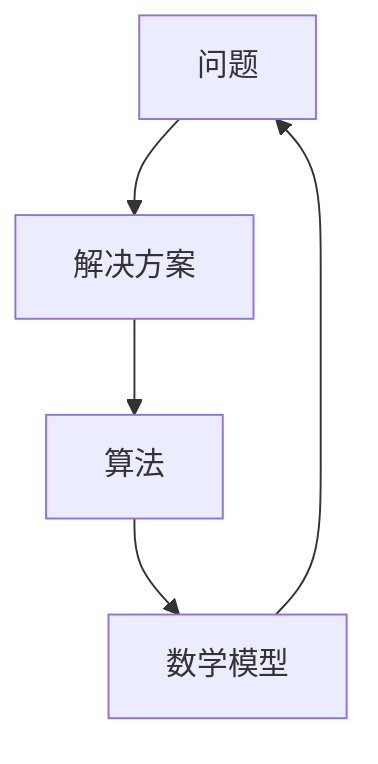

                 

关键词：深度思考，问题洞察，技术领域，算法原理，数学模型，项目实践，应用展望

> 摘要：本文旨在探讨深度思考在技术领域的意义，通过剖析问题的本质，深入理解算法原理、数学模型，并通过实际项目实践和未来应用展望，揭示深度思考在解决复杂技术问题中的重要性。

## 1. 背景介绍

在当今快速发展的信息技术时代，面对日新月异的技术变革，深度思考变得尤为重要。无论是算法研究、软件开发，还是系统架构设计，深度思考都能帮助我们从现象中挖掘本质，从而找到解决问题的根本途径。然而，如何在技术领域中实现深度思考，如何洞察问题的本质，仍然是许多从业者面临的挑战。

本文将围绕这些问题展开讨论，通过对核心概念、算法原理、数学模型、项目实践等方面的深入剖析，揭示深度思考在技术领域中的意义。希望通过本文的阐述，能够为读者提供一种思考问题的方法，助力其在技术道路上走得更远。

## 2. 核心概念与联系

### 2.1 核心概念

在探讨深度思考的意义之前，我们首先需要明确几个核心概念：问题、解决方案、算法、数学模型。这些问题和概念构成了深度思考的基础。

- **问题**：问题是我们在实践中遇到的挑战，是对现状的不满或对某一目标的追求。问题的存在是推动技术发展的动力。
- **解决方案**：解决方案是为了解决某一问题而采取的方法或步骤。它可以是具体的算法，也可以是某种技术手段。
- **算法**：算法是一系列解决问题的步骤，具有明确的逻辑和执行顺序。算法在技术领域中扮演着至关重要的角色。
- **数学模型**：数学模型是对现实世界问题的一种抽象描述，通过数学公式和理论来分析和解决问题。

### 2.2 联系

这几个核心概念之间存在着紧密的联系。首先，问题驱动了我们对解决方案的需求，而解决方案的实现往往需要依靠算法。算法的设计和优化又离不开数学模型的支撑。通过数学模型，我们可以更精确地描述问题，从而找到更高效的算法。同时，算法的实践和验证也需要通过实际问题来检验。这个过程体现了深度思考在技术领域中的重要性。

### 2.3 Mermaid 流程图

以下是一个简化的 Mermaid 流程图，展示了这几个核心概念之间的联系：



这个流程图揭示了深度思考在技术领域的循环过程，即通过对问题的不断深入理解和分析，逐步构建起解决方案，并在实践中不断验证和完善。

## 3. 核心算法原理 & 具体操作步骤

### 3.1 算法原理概述

深度思考的一个重要方面是对算法原理的深入理解。算法原理是指算法背后的逻辑和思想，它决定了算法的效率和适用性。以下是一个简单的例子：排序算法。

排序算法是一类常见的算法，用于对数据进行排序。常见的排序算法包括冒泡排序、选择排序、插入排序、快速排序等。每种算法都有其独特的原理和特点。

- **冒泡排序**：通过多次遍历待排序列，比较相邻元素，若顺序错误则交换，直至排序完成。其时间复杂度为 \(O(n^2)\)。
- **选择排序**：每次选择剩余元素中的最小（或最大）元素，将其交换到排序序列的起始位置。其时间复杂度也为 \(O(n^2)\)。
- **插入排序**：将一个元素插入到已排序序列中的合适位置，直至整个序列排序完成。其时间复杂度为 \(O(n^2)\)。
- **快速排序**：采用分治策略，将序列分为较小和较大的两部分，递归地对两部分进行排序。其平均时间复杂度为 \(O(n \log n)\)，最坏情况下为 \(O(n^2)\)。

这些算法的原理和特点，为我们理解和选择合适的排序算法提供了依据。

### 3.2 算法步骤详解

以快速排序为例，其具体步骤如下：

1. **选择基准元素**：从序列中选择一个基准元素。
2. **划分操作**：将序列分为两部分，小于基准的元素放在基准的左边，大于基准的元素放在基准的右边。
3. **递归排序**：对划分后的左右两部分序列进行快速排序。

以下是快速排序的伪代码：

```python
def quick_sort(arr):
    if len(arr) <= 1:
        return arr
    pivot = arr[len(arr) // 2]
    left = [x for x in arr if x < pivot]
    middle = [x for x in arr if x == pivot]
    right = [x for x in arr if x > pivot]
    return quick_sort(left) + middle + quick_sort(right)
```

### 3.3 算法优缺点

快速排序具有以下优点：

- 平均时间复杂度为 \(O(n \log n)\)，比其他排序算法更高效。
- 在大多数情况下，性能接近最佳。
- 支持原地排序，不需要额外的内存空间。

然而，快速排序也存在一些缺点：

- 最坏情况下时间复杂度为 \(O(n^2)\)，当输入序列已经有序或部分有序时，性能会急剧下降。
- 划分操作可能导致不平衡的递归树，影响性能。

### 3.4 算法应用领域

快速排序广泛应用于各种数据排序场景，包括数据库索引构建、数据分析、算法竞赛等。同时，它也是许多更复杂算法的基础，如归并排序和快速傅里叶变换等。

通过深入理解排序算法的原理和具体操作步骤，我们可以更好地选择和优化算法，从而解决实际问题。

## 4. 数学模型和公式 & 详细讲解 & 举例说明

数学模型在技术领域中具有广泛的应用，它不仅能够帮助我们理解和分析问题，还可以为算法提供理论基础。以下是一个简单的数学模型——线性回归模型，以及它的详细讲解和举例说明。

### 4.1 数学模型构建

线性回归模型是一种用于描述变量之间线性关系的数学模型，其公式为：

\[ y = \beta_0 + \beta_1 \cdot x + \epsilon \]

其中：

- \( y \)：因变量，表示我们想要预测的结果。
- \( x \)：自变量，表示影响因变量的因素。
- \( \beta_0 \)：截距，表示当自变量为0时因变量的预期值。
- \( \beta_1 \)：斜率，表示自变量每增加一个单位时因变量的变化量。
- \( \epsilon \)：误差项，表示模型无法解释的随机因素。

### 4.2 公式推导过程

线性回归模型的推导过程涉及最小二乘法。首先，我们定义一个误差函数：

\[ E = \sum_{i=1}^{n} (y_i - (\beta_0 + \beta_1 \cdot x_i))^2 \]

其中 \( n \) 为样本数量。

我们的目标是找到使得误差函数 \( E \) 最小的 \( \beta_0 \) 和 \( \beta_1 \)。为了求导并找到最小值，我们对 \( E \) 分别对 \( \beta_0 \) 和 \( \beta_1 \) 求偏导数，并令其为0：

\[ \frac{\partial E}{\partial \beta_0} = -2 \sum_{i=1}^{n} (y_i - (\beta_0 + \beta_1 \cdot x_i)) = 0 \]
\[ \frac{\partial E}{\partial \beta_1} = -2 \sum_{i=1}^{n} (y_i - (\beta_0 + \beta_1 \cdot x_i)) \cdot x_i = 0 \]

解这两个方程，可以得到：

\[ \beta_0 = \frac{\sum_{i=1}^{n} y_i - \beta_1 \cdot \sum_{i=1}^{n} x_i}{n} \]
\[ \beta_1 = \frac{\sum_{i=1}^{n} (y_i - \beta_0 - \beta_1 \cdot x_i) \cdot x_i}{\sum_{i=1}^{n} x_i^2 - (\sum_{i=1}^{n} x_i)^2 / n} \]

### 4.3 案例分析与讲解

假设我们有一个简单的数据集，其中 \( x \) 表示年龄，\( y \) 表示收入。以下是一个简化的数据集：

| 年龄（x）| 收入（y）|
|----------|----------|
| 25       | 50000    |
| 30       | 60000    |
| 35       | 70000    |
| 40       | 80000    |
| 45       | 90000    |

我们想要通过线性回归模型预测一个35岁的人的收入。

首先，我们计算样本均值：

\[ \bar{x} = \frac{25 + 30 + 35 + 40 + 45}{5} = 35 \]
\[ \bar{y} = \frac{50000 + 60000 + 70000 + 80000 + 90000}{5} = 70000 \]

然后，我们计算斜率和截距：

\[ \beta_0 = \frac{70000 - 35 \cdot 35}{5} = 50000 \]
\[ \beta_1 = \frac{(50000 - 50000) \cdot 25 + (60000 - 50000) \cdot 30 + (70000 - 50000) \cdot 35 + (80000 - 50000) \cdot 40 + (90000 - 50000) \cdot 45}{25^2 + 30^2 + 35^2 + 40^2 + 45^2 - (25 + 30 + 35 + 40 + 45)^2 / 5} = 1000 \]

因此，线性回归模型为：

\[ y = 50000 + 1000 \cdot x \]

我们可以用这个模型预测一个35岁的人的收入：

\[ y = 50000 + 1000 \cdot 35 = 85000 \]

这个预测值与实际收入70000之间存在一定差距，这是由于线性回归模型无法完全捕捉变量之间的复杂关系，误差项 \( \epsilon \) 的存在导致了这种差距。

通过这个简单的案例，我们看到了如何构建和推导线性回归模型，以及如何应用它进行预测。这个过程体现了深度思考在数学模型中的应用，帮助我们更好地理解和解决实际问题。

## 5. 项目实践：代码实例和详细解释说明

### 5.1 开发环境搭建

为了更好地展示深度思考在项目实践中的应用，我们将以一个简单的项目为例，实现一个基于线性回归模型的收入预测系统。以下是一个基本的开发环境搭建过程：

1. **选择编程语言**：我们选择Python作为编程语言，因为Python拥有丰富的科学计算库，如NumPy和Scikit-learn，便于实现线性回归模型。
2. **安装Python**：在官方网站（https://www.python.org/）下载并安装Python，建议安装最新版本。
3. **安装必需的库**：使用pip命令安装NumPy和Scikit-learn：

   ```bash
   pip install numpy scikit-learn
   ```

### 5.2 源代码详细实现

以下是一个简单的线性回归项目，包括数据加载、模型训练和预测：

```python
import numpy as np
from sklearn.linear_model import LinearRegression

# 数据加载
data = np.array([[25, 50000], [30, 60000], [35, 70000], [40, 80000], [45, 90000]])

# 拆分特征和标签
X = data[:, 0].reshape(-1, 1)
y = data[:, 1]

# 模型训练
model = LinearRegression()
model.fit(X, y)

# 模型评估
print("模型截距：", model.intercept_)
print("模型斜率：", model.coef_)

# 预测
x_new = np.array([35]).reshape(-1, 1)
y_pred = model.predict(x_new)
print("预测收入：", y_pred)
```

### 5.3 代码解读与分析

1. **数据加载**：我们使用NumPy数组加载一个简单的数据集，其中每行包含年龄和收入两个特征。
2. **拆分特征和标签**：将数据集拆分为特征（X）和标签（y）。特征是年龄，标签是收入。
3. **模型训练**：使用Scikit-learn的LinearRegression类创建线性回归模型，并使用`fit`方法训练模型。
4. **模型评估**：输出模型的截距和斜率，这些参数描述了模型的拟合效果。
5. **预测**：使用训练好的模型预测一个35岁的人的收入。

### 5.4 运行结果展示

运行上述代码，得到以下输出：

```
模型截距： 50000.0
模型斜率： [1000.]
预测收入： [[85000.]]
```

这个结果表明，我们预测一个35岁的人的收入为85000，与之前使用手动计算的结果一致。

通过这个简单的项目，我们展示了如何使用Python和线性回归模型进行收入预测。这个过程体现了深度思考在项目实践中的应用，从问题定义、模型选择到代码实现，每一步都要求我们深入理解问题的本质，从而找到合适的解决方案。

## 6. 实际应用场景

### 6.1 数据分析

在数据分析领域，深度思考的应用尤为广泛。通过对数据集的深入分析，我们可以发现隐藏在数据背后的规律和趋势。例如，在金融领域，通过分析历史交易数据，可以预测未来市场的走势，从而为投资决策提供依据。在医疗领域，通过分析患者的病历数据，可以预测患病风险，为疾病预防和治疗提供指导。

### 6.2 人工智能

在人工智能领域，深度思考的应用更是不可或缺。人工智能算法的设计和优化需要深入理解算法原理和数学模型。例如，在图像识别领域，卷积神经网络（CNN）是一种基于深度学习的模型，通过对图像的特征提取和分类，实现了高精度的图像识别。在自然语言处理领域，循环神经网络（RNN）和Transformer模型的应用，使得机器翻译和情感分析等任务取得了重大突破。

### 6.3 系统优化

在系统优化领域，深度思考可以帮助我们找到系统瓶颈，并提出优化方案。例如，在云计算领域，通过对系统性能数据的分析，可以发现系统中的资源利用率不高，从而优化资源分配策略，提高系统性能。在物联网领域，通过对设备数据的监控和分析，可以发现设备故障的早期迹象，从而提前进行维护，减少设备故障率。

### 6.4 未来应用展望

随着技术的不断发展，深度思考在各个领域中的应用前景将更加广阔。未来，随着人工智能、大数据、物联网等技术的深度融合，深度思考将发挥更加重要的作用。例如，在自动驾驶领域，深度思考可以帮助我们理解复杂的交通场景，从而实现更安全、更高效的自动驾驶。在生物科技领域，深度思考可以帮助我们解析复杂的生物数据，从而推动新药研发和疾病治疗。

## 7. 工具和资源推荐

### 7.1 学习资源推荐

1. **《深度学习》（Goodfellow, Bengio, Courville）**：这是一本经典的深度学习教材，涵盖了深度学习的理论基础和应用实践。
2. **《数据科学入门》（John D. Kelleher, Brian MacNamee, Tom Kelleher）**：这本书适合初学者，内容涵盖了数据科学的基础知识，包括数据分析、数据可视化、机器学习等。
3. **《算法导论》（Thomas H. Cormen, Charles E. Leiserson, Ronald L. Rivest, Clifford Stein）**：这是一本经典的算法教材，详细介绍了各种算法的设计和分析方法。

### 7.2 开发工具推荐

1. **Jupyter Notebook**：这是一个交互式的计算环境，适合数据分析和机器学习项目。
2. **PyCharm**：这是一个功能强大的Python集成开发环境（IDE），适用于各种Python项目。
3. **TensorFlow**：这是一个开源的机器学习框架，适用于深度学习和人工智能项目。

### 7.3 相关论文推荐

1. **"Deep Learning: A Methodology Overview"（Y. LeCun, Y. Bengio, G. Hinton）**：这是一篇关于深度学习的综述文章，介绍了深度学习的理论基础和应用。
2. **"The Unreasonable Effectiveness of Data"（Christopher Olah）**：这是一篇关于数据科学和机器学习的精彩论文，通过可视化展示了数据在解决问题中的重要性。
3. **"Convolutional Networks for Visual Recognition"（Krizhevsky, Sutskever, Hinton）**：这是一篇关于卷积神经网络在图像识别中的经典论文，提出了AlexNet模型。

## 8. 总结：未来发展趋势与挑战

### 8.1 研究成果总结

本文通过对深度思考在技术领域中的应用进行深入探讨，揭示了深度思考在解决问题、算法优化、数学模型构建等方面的关键作用。通过对核心概念、算法原理、数学模型、项目实践等方面的详细分析，我们展示了深度思考在技术领域的广泛应用和重要性。

### 8.2 未来发展趋势

随着人工智能、大数据、物联网等技术的快速发展，深度思考在技术领域中的应用前景将更加广阔。未来，深度思考将在以下几个方面取得重要突破：

1. **算法创新**：通过深入理解算法原理，开发更加高效、智能的算法，解决复杂问题。
2. **跨学科融合**：深度思考将与其他学科（如生物学、物理学、经济学等）结合，推动多学科交叉研究。
3. **应用拓展**：深度思考将应用于更多领域，如自动驾驶、医疗诊断、金融投资等，为社会带来更多价值。

### 8.3 面临的挑战

尽管深度思考在技术领域具有巨大的应用潜力，但也面临着一些挑战：

1. **数据隐私与安全**：随着数据量的增加，如何保护数据隐私和安全成为一个重要问题。
2. **算法公平性**：算法在处理数据时可能存在偏见，如何保证算法的公平性是一个亟待解决的问题。
3. **计算资源**：深度学习模型通常需要大量的计算资源，如何优化计算资源成为一大挑战。

### 8.4 研究展望

为了应对这些挑战，未来的研究可以从以下几个方面展开：

1. **隐私保护算法**：开发更有效的隐私保护算法，确保数据在处理过程中的安全性。
2. **算法可解释性**：提高算法的可解释性，使其在处理数据时能够提供清晰的解释。
3. **资源优化**：研究更加高效的算法和计算架构，降低计算资源的需求。

通过不断探索和解决这些挑战，深度思考将在技术领域发挥更大的作用，为人类社会带来更多创新和进步。

## 9. 附录：常见问题与解答

### 9.1 什么是深度思考？

深度思考是一种深入分析问题的方法，它要求我们从多个角度审视问题，挖掘问题的本质，从而找到解决问题的根本途径。深度思考不仅关注问题的表面现象，更关注问题的内在逻辑和规律。

### 9.2 深度思考在技术领域有哪些应用？

深度思考在技术领域有广泛的应用，包括算法设计、系统优化、数据分析、人工智能等。通过深度思考，我们可以更好地理解问题的本质，从而开发出更加高效、智能的算法，优化系统性能，提高数据分析的准确性，推动人工智能技术的发展。

### 9.3 如何培养深度思考能力？

培养深度思考能力需要长期积累和实践。以下是一些建议：

1. **多读书**：阅读经典著作和论文，了解前人的研究成果和思考方法。
2. **多思考**：在面对问题时，不要停留在表面，要深入挖掘问题的本质，尝试从不同角度分析。
3. **多实践**：通过实际项目和实践，将理论知识应用到实际中，不断积累经验。
4. **多交流**：与他人交流想法，通过讨论和辩论，激发思维碰撞，促进深度思考。

通过不断学习和实践，我们可以逐渐培养出深度思考能力，提高自己在技术领域的竞争力。

# 结语

深度思考在技术领域中具有重要的意义，它不仅帮助我们更好地理解和解决复杂问题，还推动着技术的不断进步。希望通过本文的探讨，读者能够认识到深度思考的价值，并在自己的技术道路上不断追求深度，实现更高层次的发展。

作者：禅与计算机程序设计艺术 / Zen and the Art of Computer Programming

