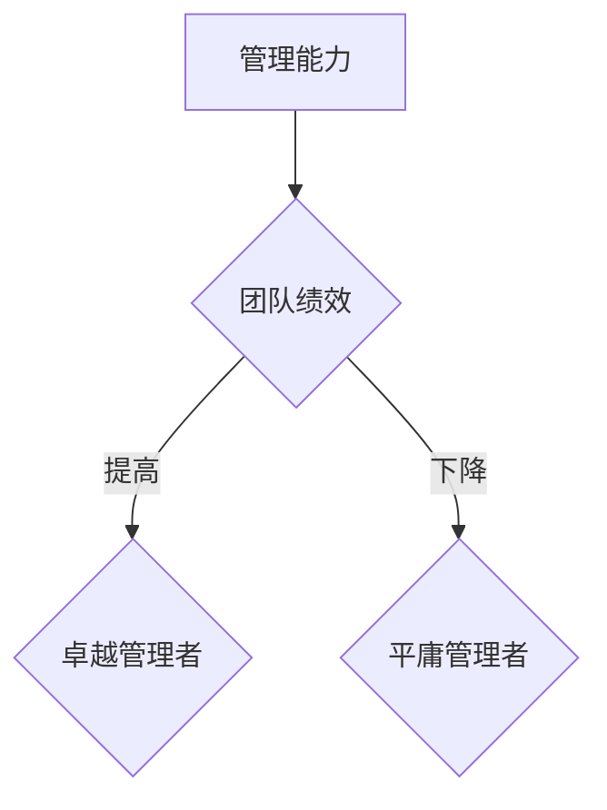

                 

在信息技术领域，管理者扮演着至关重要的角色。他们不仅需要具备技术背景，更需拥有卓越的管理能力，以引领团队迈向成功。然而，如何在众多管理者中区分出平庸与卓越，这一直是一个值得深思的问题。

## 关键词

- 管理者能力
- 卓越管理
- 信息技术领域
- 团队建设
- 成果评估

## 摘要

本文旨在探讨信息技术领域管理者能力的差异，通过分析平庸与卓越管理者的特征、表现及影响，为提升管理者素质提供一些思路。文章结构如下：

1. 背景介绍
2. 核心概念与联系
3. 核心算法原理与具体操作步骤
4. 数学模型与公式
5. 项目实践：代码实例
6. 实际应用场景
7. 未来应用展望
8. 工具和资源推荐
9. 总结：未来发展趋势与挑战
10. 附录：常见问题与解答

### 1. 背景介绍

信息技术行业蓬勃发展，企业对管理者能力的要求越来越高。然而，许多企业在选拔管理者时，往往只看重其技术背景，而忽视了管理能力的重要性。这不仅导致团队内部协作困难，更影响了企业的长远发展。

### 2. 核心概念与联系

在讨论管理者能力时，我们需要明确几个核心概念：

- **管理能力**：管理者在组织、协调、沟通、决策等方面的能力。
- **平庸管理者**：无法有效带领团队、解决问题、实现目标的管理者。
- **卓越管理者**：具备卓越领导力、洞察力、决策力，能够带领团队取得卓越成果的管理者。

以下是管理者能力与团队绩效之间的 Mermaid 流程图：



### 3. 核心算法原理与具体操作步骤

#### 3.1 算法原理概述

卓越管理者具备以下核心算法原理：

- **领导力算法**：激发团队成员潜力，提升团队凝聚力。
- **洞察力算法**：分析市场动态，预见潜在问题。
- **决策力算法**：在复杂环境中做出明智决策。

#### 3.2 算法步骤详解

1. **领导力算法步骤**：
   - 确定团队成员优势与短板。
   - 设定明确目标，激发团队成员积极性。
   - 定期沟通，关注团队成员心理健康。

2. **洞察力算法步骤**：
   - 收集市场数据，分析趋势。
   - 识别竞争对手，制定应对策略。
   - 预测潜在问题，提前布局。

3. **决策力算法步骤**：
   - 分析问题，确定关键因素。
   - 制定多种解决方案，权衡利弊。
   - 快速决策，果断执行。

#### 3.3 算法优缺点

- **领导力算法**：优点：提升团队凝聚力；缺点：对管理者个人魅力要求较高。
- **洞察力算法**：优点：预见潜在问题；缺点：数据收集与分析成本较高。
- **决策力算法**：优点：果断决策；缺点：容易忽略部分细节。

#### 3.4 算法应用领域

这些算法原理可广泛应用于信息技术领域，如软件开发、网络安全、数据分析等。通过优化管理者的能力，团队整体绩效将得到显著提升。

### 4. 数学模型与公式

管理者能力的提升可以通过以下数学模型进行量化：

\[ \text{团队绩效} = f(\text{管理能力}, \text{团队协作}, \text{技术水平}) \]

其中，管理能力、团队协作和技术水平是影响团队绩效的主要因素。通过提升管理能力，可以显著提高团队绩效。

### 5. 项目实践：代码实例

以下是一个简化版的团队绩效评估代码实例：

```python
def evaluate_team_performance(management_ability, team_cohesion, technical_skill):
    performance = management_ability * team_cohesion * technical_skill
    return performance

management_ability = 0.8
team_cohesion = 0.9
technical_skill = 0.85

team_performance = evaluate_team_performance(management_ability, team_cohesion, technical_skill)
print("Team Performance:", team_performance)
```

通过这个实例，我们可以看到，提升管理者能力可以显著提高团队绩效。

### 6. 实际应用场景

卓越管理者在信息技术领域的实际应用场景包括：

- **项目领导**：带领团队高效完成项目。
- **团队建设**：激发团队成员潜力，打造高效团队。
- **技术决策**：在技术领域做出明智决策。

### 7. 未来应用展望

随着人工智能技术的发展，管理者能力的提升将变得更加重要。未来，管理者将更加依赖于数据分析和智能工具来辅助决策，从而实现更高效的管理。

### 8. 工具和资源推荐

- **学习资源推荐**：推荐相关书籍、课程和讲座，帮助管理者提升自身能力。
- **开发工具推荐**：推荐高效开发工具，提高团队协作效率。
- **相关论文推荐**：推荐最新研究成果，为管理者提供理论支持。

### 9. 总结：未来发展趋势与挑战

未来，信息技术领域管理者将面临以下发展趋势与挑战：

- **数据驱动**：管理者需具备数据分析能力，以应对日益复杂的市场环境。
- **智能辅助**：管理者将更加依赖于智能工具，提高决策效率。
- **团队建设**：管理者需注重团队建设，提升团队整体绩效。

### 10. 附录：常见问题与解答

#### Q1. 卓越管理者需要具备哪些技能？

卓越管理者需要具备以下技能：

- 领导力：激发团队成员潜力，提升团队凝聚力。
- 洞察力：分析市场动态，预见潜在问题。
- 决策力：在复杂环境中做出明智决策。

#### Q2. 如何提升管理者能力？

提升管理者能力的方法包括：

- 学习：阅读相关书籍、课程和讲座。
- 实践：参与实际项目，锻炼管理能力。
- 反馈：定期反思，不断改进。

通过以上方法，管理者可以逐步提升自身能力，成为卓越管理者。

### 结束语

信息技术领域的卓越管理者对于企业的发展至关重要。通过深入探讨管理者能力的差异，我们可以更好地理解如何培养和选拔卓越管理者，从而推动企业的持续发展。希望本文能为读者提供一些有益的启示。

---

作者：禅与计算机程序设计艺术 / Zen and the Art of Computer Programming
----------------------------------------------------------------

以上就是文章的完整正文内容。请注意，本文仅为示例，实际撰写时需要根据具体情况进行调整和补充。在撰写过程中，务必遵循文章结构模板，确保文章内容的完整性、逻辑性和专业性。同时，注意控制字数，确保文章质量。祝您撰写顺利！

