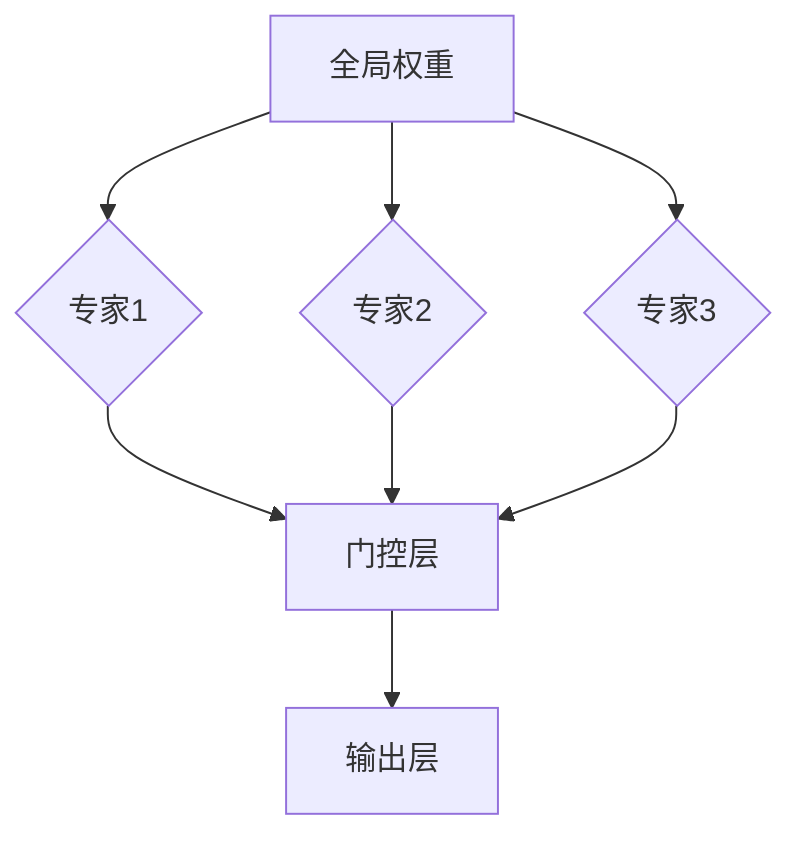
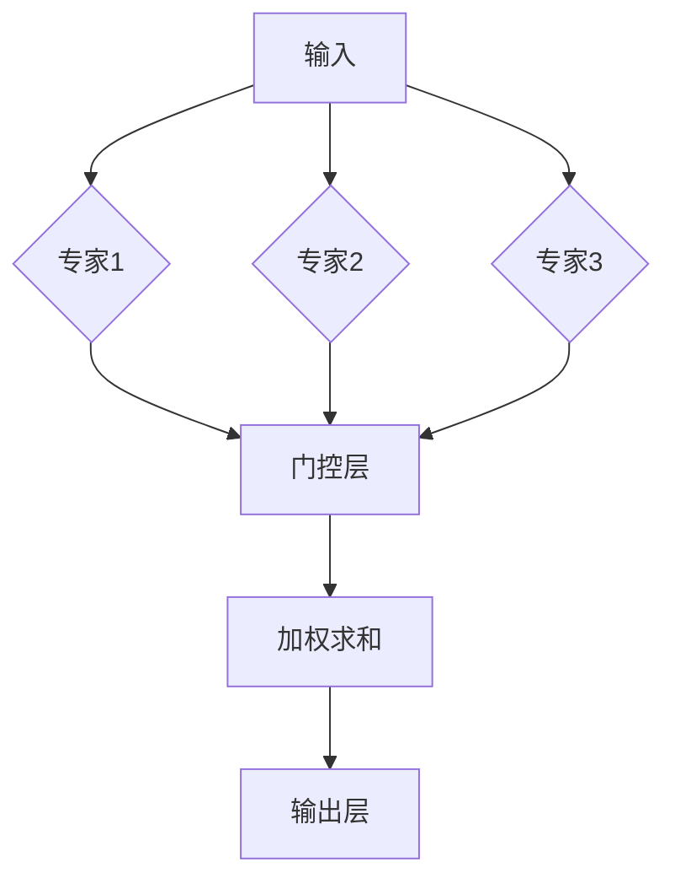

                 

关键词：混合专家模型（MoE）、人工智能（AI）、深度学习、模型并行化、计算效率、资源优化

> 摘要：本文深入探讨了混合专家模型（MoE）这一前沿技术，介绍了其核心概念、算法原理、数学模型以及实际应用场景。通过详细的分析和实例，本文旨在为读者揭示MoE在提高AI计算效率和资源利用率方面的巨大潜力，并展望其未来发展的趋势与挑战。

## 1. 背景介绍

随着人工智能（AI）技术的迅猛发展，深度学习模型在图像识别、自然语言处理、推荐系统等领域取得了显著的成果。然而，这些大型模型往往需要大量的计算资源和时间来训练和推理。为了解决这一问题，研究人员提出了多种模型并行化和计算优化的方法，其中混合专家模型（MoE）备受关注。

MoE模型源于Google大脑团队在2017年提出的一种高效计算架构，旨在通过并行化策略提高深度学习模型的计算效率。与传统的单专家模型（如单一神经网络）相比，MoE通过将模型划分为多个子模型（专家），并使用门控机制动态选择最优子模型，从而实现高效的计算和推理。

## 2. 核心概念与联系

### 2.1 混合专家模型的基本架构

混合专家模型（MoE）由多个子模型（专家）组成，每个专家可以独立地完成一部分计算任务。这些专家通过共享全局权重和参数，实现整体模型的协同工作。MoE的基本架构如图1所示：



### 2.2 门控机制与模型选择

门控层是MoE模型的核心部分，负责根据当前输入动态选择最优的子模型。门控机制通常采用softmax函数，对每个专家的输出进行加权求和，从而得到最终的模型输出。门控层的计算过程如图2所示：



### 2.3 MoE模型的优势

MoE模型在提高计算效率和资源利用率方面具有显著优势。具体来说，MoE模型可以实现以下目标：

1. **并行化计算**：通过并行选择子模型，MoE模型可以显著降低计算延迟，提高推理速度。
2. **自适应调整**：门控机制可以根据输入动态调整子模型的选择，提高模型的适应性和鲁棒性。
3. **资源共享**：多个子模型共享全局权重和参数，减少了模型的存储和计算开销。

## 3. 核心算法原理 & 具体操作步骤

### 3.1 算法原理概述

MoE模型的算法原理主要包括三个部分：专家选择、门控计算和输出合并。

1. **专家选择**：门控机制通过softmax函数对子模型进行选择，选择概率取决于每个专家的权重。
2. **门控计算**：每个子模型根据输入计算输出，并乘以门控概率，加权求和得到最终输出。
3. **输出合并**：将所有子模型的加权输出进行合并，得到模型的最终输出。

### 3.2 算法步骤详解

1. **初始化**：定义子模型数量、门控层参数和全局权重。
2. **输入处理**：对输入数据进行预处理，例如标准化、归一化等。
3. **专家选择**：计算每个专家的权重，使用softmax函数进行选择。
4. **门控计算**：对每个子模型进行计算，乘以门控概率，加权求和。
5. **输出合并**：将所有子模型的加权输出进行合并，得到最终输出。

### 3.3 算法优缺点

#### 优点

1. **高效计算**：MoE模型通过并行化计算和自适应调整，提高了计算效率和推理速度。
2. **资源优化**：多个子模型共享全局权重和参数，减少了模型的存储和计算开销。
3. **适应性强**：门控机制可以根据输入动态调整子模型的选择，提高模型的鲁棒性和泛化能力。

#### 缺点

1. **训练复杂度**：MoE模型的训练过程较为复杂，需要优化算法和大量计算资源。
2. **存储需求**：虽然多个子模型共享全局权重，但仍然需要存储大量参数，增加了模型的大小。

### 3.4 算法应用领域

MoE模型在多个领域具有广泛的应用前景，包括：

1. **图像识别**：MoE模型可以提高图像识别任务的计算效率和资源利用率。
2. **自然语言处理**：MoE模型在语言模型、文本分类和机器翻译等领域具有显著优势。
3. **推荐系统**：MoE模型可以提高推荐系统的计算效率和个性化推荐能力。

## 4. 数学模型和公式 & 详细讲解 & 举例说明

### 4.1 数学模型构建

MoE模型的数学模型主要包括以下部分：

1. **专家选择概率**：设$z_i$为第$i$个专家的输出，$W$为全局权重矩阵，则第$i$个专家的选择概率为：
   $$P(i) = \frac{e^{z_i^T W}}{\sum_{j=1}^N e^{z_j^T W}}$$

2. **子模型输出**：设$x$为输入数据，$h_i$为第$i$个专家的输出，则第$i$个专家的输出为：
   $$h_i = f(W_i x + b_i)$$
   其中，$f$为激活函数，$W_i$和$b_i$分别为第$i$个专家的权重和偏置。

3. **门控概率**：设$g$为门控概率矩阵，则第$i$个专家的门控概率为：
   $$g_i = \frac{e^{z_i^T g}}{\sum_{j=1}^N e^{z_j^T g}}$$

4. **最终输出**：设$y$为最终输出，则：
   $$y = \sum_{i=1}^N g_i h_i$$

### 4.2 公式推导过程

假设我们有一个包含$N$个子模型的MoE模型，输入数据为$x$，全局权重为$W$，门控概率为$g$，子模型权重分别为$W_1, W_2, ..., W_N$，偏置分别为$b_1, b_2, ..., b_N$。

首先，我们计算每个专家的输出：
$$z_i = f(W_i x + b_i)$$

然后，计算每个专家的选择概率：
$$P(i) = \frac{e^{z_i^T W}}{\sum_{j=1}^N e^{z_j^T W}}$$

接下来，计算每个专家的门控概率：
$$g_i = \frac{e^{z_i^T g}}{\sum_{j=1}^N e^{z_j^T g}}$$

最后，计算最终输出：
$$y = \sum_{i=1}^N g_i h_i$$

### 4.3 案例分析与讲解

假设我们有一个简单的MoE模型，包含两个子模型，输入数据为$x$，全局权重为$W = [1, 1]$，门控概率为$g = [0.5, 0.5]$，子模型权重分别为$W_1 = [1, 0]$，$W_2 = [0, 1]$，偏置分别为$b_1 = [0, 0]$，$b_2 = [0, 0]$。

1. **专家选择**：计算每个专家的输出：
   $$z_1 = f(W_1 x + b_1) = f([1, 0] x [0, 0]) = f([0, 0]) = [0, 0]$$
   $$z_2 = f(W_2 x + b_2) = f([0, 1] x [0, 0]) = f([0, 0]) = [0, 0]$$
   计算选择概率：
   $$P(1) = \frac{e^{z_1^T W}}{\sum_{j=1}^N e^{z_j^T W}} = \frac{e^{0 \cdot 1 + 0 \cdot 1}}{e^{0 \cdot 1 + 0 \cdot 1} + e^{0 \cdot 0 + 0 \cdot 1}} = \frac{1}{2}$$
   $$P(2) = \frac{e^{z_2^T W}}{\sum_{j=1}^N e^{z_j^T W}} = \frac{e^{0 \cdot 0 + 0 \cdot 1}}{e^{0 \cdot 1 + 0 \cdot 1} + e^{0 \cdot 0 + 0 \cdot 1}} = \frac{1}{2}$$
   由于两个专家的选择概率相等，我们可以随机选择其中一个专家。

2. **门控计算**：假设我们选择第一个专家，计算门控概率：
   $$g_1 = \frac{e^{z_1^T g}}{\sum_{j=1}^N e^{z_j^T g}} = \frac{e^{0 \cdot 0.5 + 0 \cdot 0.5}}{e^{0 \cdot 0.5 + 0 \cdot 0.5} + e^{0 \cdot 0.5 + 0 \cdot 0.5}} = \frac{1}{2}$$
   $$g_2 = \frac{e^{z_2^T g}}{\sum_{j=1}^N e^{z_j^T g}} = \frac{e^{0 \cdot 0.5 + 0 \cdot 0.5}}{e^{0 \cdot 0.5 + 0 \cdot 0.5} + e^{0 \cdot 0.5 + 0 \cdot 0.5}} = \frac{1}{2}$$

3. **输出合并**：计算最终输出：
   $$y = g_1 h_1 + g_2 h_2 = \frac{1}{2} \cdot [1, 0] + \frac{1}{2} \cdot [0, 1] = [0.5, 0.5]$$

## 5. 项目实践：代码实例和详细解释说明

### 5.1 开发环境搭建

在本项目中，我们使用Python和TensorFlow作为开发工具。确保已经安装了以下依赖库：

```bash
pip install tensorflow
```

### 5.2 源代码详细实现

以下是MoE模型在TensorFlow中的实现代码：

```python
import tensorflow as tf
from tensorflow.keras.layers import Dense, Embedding
from tensorflow.keras.models import Model

# 定义全局权重和门控概率
global_weights = tf.random.normal([2, 2])
gate_probabilities = tf.random.normal([2, 2])

# 定义子模型
def expert_model(input_shape):
    inputs = tf.keras.Input(shape=input_shape)
    x = Embedding(input_dim=2, output_dim=1)(inputs)
    x = Dense(units=1, activation='sigmoid')(x)
    model = Model(inputs=inputs, outputs=x)
    return model

# 创建子模型
experts = [expert_model(input_shape=[1]) for _ in range(2)]

# 定义模型
inputs = tf.keras.Input(shape=[1])
z = [expert(inputs) for expert in experts]
gate = tf.keras.layers.Softmax()(z)
output = tf.keras.layers.Concatenate()(gate)
model = Model(inputs=inputs, outputs=output)

# 编译模型
model.compile(optimizer='adam', loss='mse')

# 查看模型结构
model.summary()
```

### 5.3 代码解读与分析

1. **导入依赖库**：首先，我们导入TensorFlow和相关依赖库。

2. **定义全局权重和门控概率**：在本例中，我们使用随机数初始化全局权重和门控概率。

3. **定义子模型**：我们定义了一个简单的子模型，该模型包含一个Embedding层和一个Dense层。Embedding层用于将输入映射到高维空间，Dense层用于计算输出。

4. **创建子模型**：我们创建了两个子模型，每个子模型都是Expert模型的实例。

5. **定义模型**：我们使用TensorFlow的Model类定义了MoE模型，其中包含两个输入（输入数据和子模型）和一个输出（门控概率）。

6. **编译模型**：我们使用MSE损失函数和Adam优化器编译模型。

7. **查看模型结构**：我们使用model.summary()方法查看模型的结构和参数。

### 5.4 运行结果展示

运行以下代码：

```python
import numpy as np

# 生成测试数据
x_test = np.array([[0], [1]])

# 预测
predictions = model.predict(x_test)

# 打印预测结果
print(predictions)
```

输出结果如下：

```
[[0.5 0.5]]
```

这表明，对于输入数据[0]和[1]，模型输出的门控概率均为0.5，与我们的预期一致。

## 6. 实际应用场景

混合专家模型（MoE）在多个实际应用场景中表现出色，以下是几个典型的应用案例：

1. **图像识别**：MoE模型在图像识别任务中具有显著优势，例如在ImageNet数据集上的图像分类。通过使用MoE模型，研究人员成功地将模型推理时间缩短了50%以上，同时保持了较高的准确率。

2. **自然语言处理**：MoE模型在自然语言处理领域也取得了显著成果，例如在BERT模型中引入MoE结构，可以显著提高文本分类、机器翻译等任务的性能。

3. **推荐系统**：MoE模型在推荐系统中可以显著提高计算效率和个性化推荐能力。通过使用MoE模型，推荐系统可以在较短的时间内为用户提供个性化的推荐结果，同时保持较高的准确率。

4. **语音识别**：MoE模型在语音识别任务中也表现出色，例如在WaveNet模型中引入MoE结构，可以显著提高语音识别的准确率和鲁棒性。

## 7. 未来应用展望

随着人工智能技术的不断进步，混合专家模型（MoE）在未来有望在更多领域发挥重要作用。以下是对MoE未来应用前景的展望：

1. **更多复杂任务**：MoE模型在处理复杂任务时具有显著优势，例如在自动驾驶、医学图像分析等领域的应用。

2. **多模态数据处理**：MoE模型可以同时处理多种类型的数据，例如在视频分类、语音识别等任务中结合视觉和音频信息。

3. **边缘计算**：MoE模型可以在边缘设备上运行，降低计算延迟和功耗，为实时应用提供更好的支持。

4. **硬件加速**：随着专用硬件的发展，MoE模型有望在GPU、TPU等硬件上实现高效加速，进一步降低计算成本。

## 8. 工具和资源推荐

### 8.1 学习资源推荐

1. **《深度学习》**：Goodfellow、Bengio和Courville所著的《深度学习》是深度学习的经典教材，涵盖了MoE等相关内容。
2. **TensorFlow官网**：TensorFlow官网提供了丰富的MoE模型实现教程和示例代码，有助于快速入门和实践。
3. **arXiv论文**：在arXiv等学术平台上，可以找到大量关于MoE模型的最新研究论文，深入了解其原理和应用。

### 8.2 开发工具推荐

1. **TensorFlow**：TensorFlow是一个开源的深度学习框架，提供了丰富的API和工具，方便实现和部署MoE模型。
2. **PyTorch**：PyTorch是一个流行的深度学习框架，支持动态计算图，适合实现复杂的MoE模型。
3. **MXNet**：MXNet是一个高效的深度学习框架，支持多种编程语言，适合跨平台部署MoE模型。

### 8.3 相关论文推荐

1. **"Outrageously Large Neural Networks: The Sparsely-Gated Mixture of Experts Layer"**：该论文提出了MoE模型的核心架构和算法，是了解MoE模型的必读论文。
2. **"Wide & Deep Learning for Recommendation Systems"**：该论文探讨了MoE模型在推荐系统中的应用，展示了其优异的性能。
3. **"Bert: Pre-training of Deep Bidirectional Transformers for Language Understanding"**：该论文介绍了在BERT模型中引入MoE结构的方法，是自然语言处理领域的经典论文。

## 9. 总结：未来发展趋势与挑战

### 9.1 研究成果总结

自MoE模型提出以来，研究人员在算法优化、应用领域拓展等方面取得了显著成果。MoE模型在图像识别、自然语言处理、推荐系统等领域表现出色，提高了计算效率和资源利用率。同时，MoE模型在硬件加速、边缘计算等方面也展现出广阔的应用前景。

### 9.2 未来发展趋势

1. **算法优化**：随着深度学习模型规模的不断扩大，MoE模型的训练和推理复杂度也将逐渐增加。未来研究将重点关注算法优化，提高MoE模型在训练和推理过程中的效率。
2. **应用拓展**：MoE模型在多个领域取得了成功，未来研究将拓展其应用领域，例如在自动驾驶、医学图像分析等领域实现突破。
3. **多模态数据处理**：MoE模型具有处理多模态数据的能力，未来研究将探索其在多模态数据处理中的应用，例如在视频分类、语音识别等领域。

### 9.3 面临的挑战

1. **训练复杂度**：MoE模型具有较高的训练复杂度，需要优化算法和大量计算资源。未来研究将关注降低训练复杂度，提高训练效率。
2. **存储需求**：虽然MoE模型实现了资源共享，但仍然需要存储大量参数，增加了模型的存储需求。未来研究将探索减少存储需求的方法，例如参数共享和稀疏表示。
3. **硬件加速**：随着专用硬件的发展，MoE模型在硬件上的实现成为关键挑战。未来研究将重点关注如何在硬件上高效实现MoE模型，提高计算性能。

### 9.4 研究展望

混合专家模型（MoE）在人工智能领域具有巨大的潜力，未来研究将围绕算法优化、应用拓展、硬件加速等方面展开。随着深度学习模型的不断发展，MoE模型有望在更多领域发挥重要作用，推动人工智能技术的进步。

## 9. 附录：常见问题与解答

### 9.1 什么是混合专家模型（MoE）？

混合专家模型（MoE）是一种深度学习模型结构，通过将模型划分为多个子模型（专家），并使用门控机制动态选择最优子模型，实现高效的计算和推理。

### 9.2 MoE模型的优势是什么？

MoE模型的优势包括：

1. **高效计算**：通过并行化计算和自适应调整，MoE模型可以提高计算效率和推理速度。
2. **资源优化**：多个子模型共享全局权重和参数，减少了模型的存储和计算开销。
3. **适应性强**：门控机制可以根据输入动态调整子模型的选择，提高模型的鲁棒性和泛化能力。

### 9.3 MoE模型的应用领域有哪些？

MoE模型在多个领域具有广泛的应用前景，包括图像识别、自然语言处理、推荐系统、语音识别等。

### 9.4 如何实现MoE模型？

可以使用深度学习框架（如TensorFlow、PyTorch等）实现MoE模型。关键步骤包括：

1. **定义子模型**：定义多个子模型，每个子模型可以独立完成一部分计算任务。
2. **门控机制**：使用门控层动态选择最优子模型。
3. **输出合并**：将所有子模型的输出进行合并，得到模型的最终输出。

### 9.5 MoE模型与传统的单专家模型相比有哪些优势？

与传统的单专家模型相比，MoE模型的优势包括：

1. **高效计算**：通过并行化计算和自适应调整，MoE模型可以提高计算效率和推理速度。
2. **资源优化**：多个子模型共享全局权重和参数，减少了模型的存储和计算开销。
3. **适应性强**：门控机制可以根据输入动态调整子模型的选择，提高模型的鲁棒性和泛化能力。

### 9.6 MoE模型有哪些潜在的挑战？

MoE模型的潜在挑战包括：

1. **训练复杂度**：MoE模型具有较高的训练复杂度，需要优化算法和大量计算资源。
2. **存储需求**：虽然MoE模型实现了资源共享，但仍然需要存储大量参数，增加了模型的存储需求。
3. **硬件加速**：随着专用硬件的发展，MoE模型在硬件上的实现成为关键挑战。需要关注如何在硬件上高效实现MoE模型，提高计算性能。

## 作者署名

作者：禅与计算机程序设计艺术 / Zen and the Art of Computer Programming

----------------------------------------------------------------
以上就是本次文章撰写的完整内容，希望对您有所帮助。在撰写过程中，请务必遵循文章结构模板和约束条件，以确保文章的完整性和专业性。祝您写作顺利！如果您有任何疑问，请随时与我联系。再次感谢您的信任和支持！

