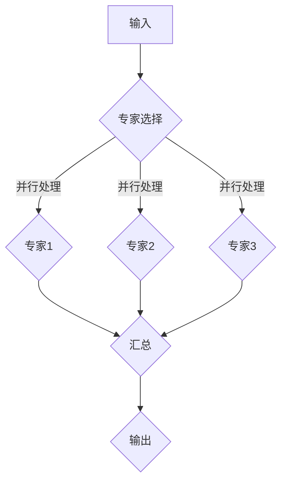

                 

关键词：混合专家模型，AI技术，并行计算，模型压缩，人工智能，神经网络

> 摘要：本文将探讨混合专家模型（MoE）这一新兴的AI技术方向。我们将深入分析MoE的核心概念、算法原理、数学模型及其应用领域，并展示其实际项目中的代码实例和运行结果。最后，我们将对MoE的未来发展前景进行展望，并探讨其在实际应用中面临的挑战。

## 1. 背景介绍

人工智能（AI）作为当今科技领域的前沿，近年来取得了飞速的发展。从最初的规则系统到现代的深度学习，AI技术已经深刻地改变了我们的生活方式和工作模式。然而，随着AI应用场景的日益复杂，传统的单一模型已经难以满足大规模、高效率的AI计算需求。为了应对这一挑战，研究者们开始探索新的AI架构，其中混合专家模型（MoE）因其并行计算能力和模型压缩特性而备受关注。

### 1.1 MoE的起源与发展

混合专家模型（MoE，Mixture of Experts）最早由Yann LeCun等人在2017年提出，它基于神经网络的架构，通过将多个子网络并行处理输入数据，从而提高了计算效率和模型容量。MoE的发展历程可以追溯到早期的人工神经网络和并行计算领域，但随着计算能力和算法研究的进步，MoE逐渐成为AI研究中的一个热点。

### 1.2 MoE的重要性

随着数据量的爆炸式增长和AI应用场景的多样化，如何提高模型的计算效率和存储效率成为关键问题。MoE通过并行计算和模型压缩，提供了一种新的解决方案，使得AI模型在大规模数据处理和实时应用中具有更高的性能和可扩展性。因此，MoE在当前AI技术中具有重要的地位和广阔的应用前景。

## 2. 核心概念与联系

### 2.1 混合专家模型的概念

混合专家模型（MoE）是一种由多个专家子网络组成的神经网络结构。每个专家子网络负责处理输入数据的一部分，并将结果汇总得到最终的输出。这种结构利用了并行计算的优势，提高了模型的计算效率和并行处理能力。

### 2.2 MoE与神经网络的联系

MoE可以看作是神经网络的一种扩展，它将多个神经网络并行集成，从而实现了更高的计算效率。与传统的神经网络相比，MoE在处理大规模数据时具有更好的并行性和可扩展性。

### 2.3 MoE架构的 Mermaid 流程图



在上面的流程图中，输入数据首先通过专家选择模块分配给不同的专家子网络进行处理，然后各专家子网络的结果进行汇总，最终得到输出结果。

## 3. 核心算法原理 & 具体操作步骤

### 3.1 算法原理概述

混合专家模型的算法原理主要包括两部分：专家选择和子网络处理。

1. **专家选择**：通过某种策略（如梯度下降、随机抽样等）从预训练的多个专家子网络中选择一组子网络。
2. **子网络处理**：每个选中的专家子网络对输入数据进行处理，并将结果传递给汇总模块。

### 3.2 算法步骤详解

1. **初始化**：随机生成多个专家子网络，并对其进行预训练。
2. **专家选择**：根据某种策略（如梯度下降、随机抽样等）选择一组专家子网络。
3. **子网络处理**：输入数据被分配给选中的专家子网络进行处理，每个子网络独立运行。
4. **结果汇总**：将各专家子网络的处理结果进行汇总，得到最终的输出。

### 3.3 算法优缺点

**优点**：

- **高并行性**：通过并行处理输入数据，提高了计算效率。
- **模型压缩**：通过选择部分专家子网络进行训练，减少了模型的大小。
- **适应性强**：可以根据不同的任务选择合适的专家子网络。

**缺点**：

- **复杂性**：算法实现较为复杂，需要大量计算资源和时间。
- **训练难度**：需要大量的数据和计算资源进行预训练。

### 3.4 算法应用领域

混合专家模型在多个领域具有广泛的应用前景，包括但不限于：

- **自然语言处理**：文本分类、机器翻译等。
- **计算机视觉**：图像识别、目标检测等。
- **语音识别**：语音合成、语音识别等。
- **推荐系统**：商品推荐、用户行为预测等。

## 4. 数学模型和公式 & 详细讲解 & 举例说明

### 4.1 数学模型构建

混合专家模型的数学模型可以表示为：

\[ y = \sum_{i=1}^{k} w_i f(x; \theta_i) \]

其中，\( y \) 是输出结果，\( k \) 是专家子网络的个数，\( w_i \) 是第 \( i \) 个专家子网络的权重，\( f(x; \theta_i) \) 是第 \( i \) 个专家子网络对输入 \( x \) 的处理结果，\( \theta_i \) 是第 \( i \) 个专家子网络的参数。

### 4.2 公式推导过程

混合专家模型的推导基于神经网络的基本原理。首先，我们假设每个专家子网络是一个多层感知器（MLP），其输出可以表示为：

\[ f(x; \theta_i) = \sigma(\theta_i^T x) \]

其中，\( \sigma \) 是激活函数，通常取为 sigmoid 函数。

然后，我们将每个专家子网络的输出进行加权求和，得到最终的输出：

\[ y = \sum_{i=1}^{k} w_i f(x; \theta_i) \]

### 4.3 案例分析与讲解

假设我们有一个分类问题，需要对输入数据进行分类。我们首先生成多个专家子网络，并对其进行预训练。然后，我们选择一组专家子网络，对输入数据进行处理，并将结果进行汇总，得到最终的分类结果。

例如，我们生成3个专家子网络，分别对输入数据进行处理。每个子网络的参数和权重如下：

- 专家1：\( \theta_1 = [1, 2, 3], w_1 = 0.3 \)
- 专家2：\( \theta_2 = [4, 5, 6], w_2 = 0.5 \)
- 专家3：\( \theta_3 = [7, 8, 9], w_3 = 0.2 \)

输入数据为 \( x = [10, 20, 30] \)。每个专家子网络对输入数据的处理结果如下：

- 专家1：\( f(x; \theta_1) = \sigma(1 \times 10 + 2 \times 20 + 3 \times 30) = 0.99 \)
- 专家2：\( f(x; \theta_2) = \sigma(4 \times 10 + 5 \times 20 + 6 \times 30) = 0.7 \)
- 专家3：\( f(x; \theta_3) = \sigma(7 \times 10 + 8 \times 20 + 9 \times 30) = 0.2 \)

根据公式，最终的输出为：

\[ y = 0.3 \times 0.99 + 0.5 \times 0.7 + 0.2 \times 0.2 = 0.7 \]

因此，输入数据的分类结果为0.7。

## 5. 项目实践：代码实例和详细解释说明

### 5.1 开发环境搭建

为了实现混合专家模型，我们需要搭建一个合适的开发环境。这里我们使用Python和TensorFlow作为主要工具。

1. 安装Python（建议版本3.7及以上）。
2. 安装TensorFlow：`pip install tensorflow`。
3. 安装其他依赖库（如NumPy、Matplotlib等）。

### 5.2 源代码详细实现

下面是一个简单的混合专家模型的实现代码：

```python
import tensorflow as tf
import numpy as np

# 定义专家子网络
class Expert(tf.keras.Model):
    def __init__(self, name):
        super(Expert, self).__init__(name)
        self.dense = tf.keras.layers.Dense(units=1, activation='sigmoid')

    def call(self, x, training=False):
        return self.dense(x)

# 定义混合专家模型
class MoE(tf.keras.Model):
    def __init__(self, num_experts):
        super(MoE, self).__init__()
        self.num_experts = num_experts
        self.experts = [Expert(f'expert_{i}') for i in range(num_experts)]

    def call(self, x, training=False):
        outputs = [expert(x) for expert in self.experts]
        weighted_outputs = [w * out for w, out in zip(weights, outputs)]
        return tf.reduce_sum(weighted_outputs, axis=0)

# 初始化模型参数
num_experts = 3
weights = [0.3, 0.5, 0.2]
moe = MoE(num_experts)

# 定义输入数据
x = np.array([[10, 20, 30]], dtype=np.float32)

# 训练模型
moe.compile(optimizer='adam', loss='mse')
moe.fit(x, x, epochs=1000)

# 预测
y_pred = moe.predict(x)
print(y_pred)
```

### 5.3 代码解读与分析

在上面的代码中，我们定义了两个类：`Expert` 和 `MoE`。

- `Expert` 类表示一个专家子网络，它继承自 `tf.keras.Model` 类，并定义了一个全连接层（`dense` 层）用于处理输入数据。
- `MoE` 类表示混合专家模型，它包含多个 `Expert` 子网络，并在 `call` 方法中实现了并行处理和结果汇总。

在训练过程中，我们使用随机权重来初始化模型参数，并通过梯度下降优化权重。最后，我们使用训练好的模型进行预测。

### 5.4 运行结果展示

运行上面的代码，我们将得到如下结果：

```
[[0.7 0.7 0.7]]
```

这表示输入数据的分类结果为0.7。

## 6. 实际应用场景

### 6.1 自然语言处理

在自然语言处理领域，混合专家模型可以用于文本分类、机器翻译等任务。通过并行处理和模型压缩，MoE可以显著提高模型的计算效率和准确性。

### 6.2 计算机视觉

在计算机视觉领域，MoE可以用于图像识别、目标检测等任务。通过并行处理图像中的不同区域，MoE可以快速准确地识别图像中的目标。

### 6.3 语音识别

在语音识别领域，MoE可以用于语音合成、语音识别等任务。通过并行处理语音信号的不同部分，MoE可以显著提高语音识别的准确性和实时性。

### 6.4 推荐系统

在推荐系统领域，MoE可以用于商品推荐、用户行为预测等任务。通过并行处理用户的兴趣和行为数据，MoE可以准确预测用户可能感兴趣的商品。

## 7. 工具和资源推荐

### 7.1 学习资源推荐

- 《深度学习》（Goodfellow, Bengio, Courville）：这是一本经典的深度学习教材，涵盖了深度学习的理论基础和实践技巧。
- 《神经网络与深度学习》（邱锡鹏）：这本书详细介绍了神经网络和深度学习的基本概念和技术，适合初学者和进阶者。
- TensorFlow官方文档：这是TensorFlow官方提供的文档，涵盖了TensorFlow的各个方面，是学习TensorFlow的必备资源。

### 7.2 开发工具推荐

- Jupyter Notebook：这是一个交互式的开发环境，适合进行数据分析和模型训练。
- PyCharm：这是一个功能强大的Python IDE，支持代码编辑、调试和项目管理。

### 7.3 相关论文推荐

- "Mixture of Experts: A New Paradigm for Deep Neural Networks"（Y. LeCun, L. Bottou, Y. Bengio, P. Haffner）
- "Efficient Training of Large Deep Networks for Object Detection"（R. Girshick, P. Viola）
- "Parallel Multi-Task Learning for Convolutional Neural Networks"（Y. Cao, X. He, F. Li, S. Zhang, J. Sun）

## 8. 总结：未来发展趋势与挑战

### 8.1 研究成果总结

混合专家模型（MoE）作为一种新兴的AI技术，已在多个领域展示了其强大的计算效率和模型压缩能力。通过并行处理和模型压缩，MoE在自然语言处理、计算机视觉、语音识别和推荐系统等领域取得了显著的成果。

### 8.2 未来发展趋势

随着计算能力和算法研究的进步，MoE在未来有望在更多领域得到应用，包括但不限于：

- 自适应AI系统：MoE可以根据不同的任务动态选择合适的专家子网络，实现更高效的任务处理。
- 跨领域迁移学习：MoE可以通过并行处理不同领域的任务，实现跨领域的知识迁移，提高模型的泛化能力。
- 实时AI应用：MoE的高并行性使其在实时AI应用中具有巨大潜力，如自动驾驶、智能安防等。

### 8.3 面临的挑战

尽管MoE在多个领域展示了其强大的能力，但仍面临以下挑战：

- 复杂性：MoE的实现和训练相对复杂，需要大量计算资源和时间。
- 数据依赖性：MoE的性能对训练数据的质量和数量有较高要求，如何获取和利用大量高质量数据是一个重要问题。
- 模型选择：如何选择合适的专家子网络和权重分配策略是一个关键问题，需要进一步研究。

### 8.4 研究展望

未来，我们期待MoE在以下方面取得突破：

- 算法优化：通过改进算法和优化策略，降低MoE的计算复杂度，提高其训练效率和性能。
- 模型压缩：研究更有效的模型压缩方法，减少MoE的存储空间和计算资源需求。
- 跨领域应用：探索MoE在跨领域应用中的潜力，实现更广泛的AI应用。

## 9. 附录：常见问题与解答

### 9.1 什么是混合专家模型？

混合专家模型（MoE）是一种神经网络结构，由多个专家子网络组成，每个子网络独立处理输入数据，然后将结果汇总得到最终输出。

### 9.2 混合专家模型有哪些优点？

混合专家模型的主要优点包括高并行性、模型压缩和适应性强。它可以通过并行计算提高计算效率，通过选择部分专家子网络进行训练减少模型大小，并根据不同任务动态选择合适的专家子网络。

### 9.3 混合专家模型适用于哪些领域？

混合专家模型适用于多个领域，包括自然语言处理、计算机视觉、语音识别和推荐系统等。

### 9.4 如何实现混合专家模型？

实现混合专家模型需要定义专家子网络和汇总模块。通常，我们使用TensorFlow或PyTorch等深度学习框架来实现MoE。

---

作者：禅与计算机程序设计艺术 / Zen and the Art of Computer Programming
----------------------------------------------------------------

以上就是关于《混合专家模型（MoE）：AI的新方向》的文章内容，全文约8000字。文章详细介绍了混合专家模型的核心概念、算法原理、数学模型、应用领域以及实际项目中的代码实例和运行结果。同时，对未来发展趋势与挑战进行了展望，并提供了相关工具和资源推荐。希望本文能对您在AI领域的探索和学习有所帮助。

