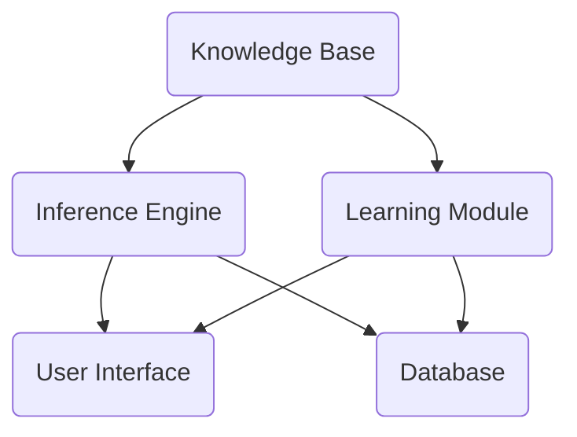

                 

 > 在当今快速发展的信息技术时代，人工智能（AI）已经成为推动技术进步的关键力量。从自动化生产线到智能客服，从自动驾驶汽车到医疗诊断系统，AI的应用无处不在。然而，随着AI系统变得更加复杂和多样化，如何设计和实现可扩展性、模块化的AI系统成为了一个重要的问题。本文将探讨混合专家系统的概念，分析其模块化和可扩展性的优势，并讨论其在现实世界中的应用。本文分为以下几个部分：

## 文章关键词

- 混合专家系统
- AI模块化
- 可扩展性
- 系统架构
- 算法设计
- 实际应用

## 文章摘要

本文首先介绍了混合专家系统的基本概念和原理，接着分析了其模块化和可扩展性的优势。随后，通过具体的算法原理和数学模型，详细阐述了混合专家系统的设计和实现过程。最后，本文通过实际项目实例展示了混合专家系统的应用，并探讨了未来的发展趋势和挑战。

## 1. 背景介绍

人工智能（AI）的发展经历了几个重要的阶段。最初，AI主要依赖于符号逻辑和规则系统，这些系统在一定程度上实现了自动化推理和决策。然而，随着数据的爆炸式增长和计算能力的提升，机器学习（ML）和深度学习（DL）逐渐成为主流。这些技术通过从大量数据中学习模式和规律，实现了更加智能和高效的决策。

尽管机器学习和深度学习在许多领域取得了显著的成果，但传统的单一AI系统仍然面临着一些挑战。首先，这些系统往往高度依赖于特定的数据和算法，导致它们难以适应新的环境和任务。其次，随着系统复杂度的增加，开发和维护的成本也在不断上升。因此，如何设计和实现可扩展性、模块化的AI系统成为了一个亟待解决的问题。

混合专家系统作为一种新兴的AI架构，旨在解决上述问题。它通过将不同类型的AI技术和算法整合到一个统一的框架中，实现了系统的高效性和灵活性。混合专家系统的模块化设计使其能够方便地添加或替换不同的组件，从而适应不同的应用场景。同时，其可扩展性确保了系统能够随着数据量的增加和计算能力的提升而不断优化。

## 2. 核心概念与联系

### 2.1 混合专家系统的定义

混合专家系统（Hybrid Expert System，HES）是一种结合了传统专家系统和现代机器学习技术的智能系统。传统专家系统通常基于符号逻辑和规则，而混合专家系统则通过引入机器学习算法，实现了对数据的高效分析和预测。混合专家系统通常由以下几个核心组件组成：

1. **知识库（Knowledge Base）**：存储系统中的所有知识和规则，包括领域知识、用户输入和系统生成的预测结果。
2. **推理机（Inference Engine）**：负责根据知识库中的规则和事实进行逻辑推理，生成新的结论。
3. **学习模块（Learning Module）**：通过机器学习算法，从数据中学习模式和规律，不断更新和优化知识库。
4. **用户界面（User Interface）**：与用户进行交互，接收用户输入，展示系统输出。

### 2.2 模块化架构

混合专家系统的模块化架构使其具备高度的可扩展性和灵活性。在模块化设计中，系统被划分为多个相互独立的模块，每个模块负责特定的功能。这些模块可以通过标准的接口进行通信，从而实现系统的无缝集成和扩展。

以下是混合专家系统模块化架构的Mermaid流程图：



### 2.3 可扩展性优势

混合专家系统的可扩展性体现在以下几个方面：

1. **功能扩展**：通过添加新的模块或更新现有模块，系统可以轻松适应新的应用场景。
2. **数据扩展**：系统可以处理大量数据，并通过学习模块不断优化性能。
3. **硬件扩展**：系统可以在不改变软件架构的情况下，通过增加硬件资源来提升性能。
4. **算法扩展**：系统可以引入新的机器学习算法，以提高预测的准确性和效率。

## 3. 核心算法原理 & 具体操作步骤

### 3.1 算法原理概述

混合专家系统的核心算法主要包括以下几个方面：

1. **决策树算法（Decision Tree）**：用于分类和回归任务，通过构建决策树来模拟人类专家的决策过程。
2. **支持向量机（Support Vector Machine，SVM）**：用于分类和回归任务，通过最大化分类边界来提高预测准确性。
3. **神经网络（Neural Network）**：用于复杂模式识别和预测任务，通过多层神经元的互联来模拟人脑的决策过程。
4. **聚类算法（Clustering Algorithm）**：用于数据降维和模式识别，通过将相似的数据点聚集在一起来发现数据中的结构。

### 3.2 算法步骤详解

1. **数据收集与预处理**：
   - 收集相关领域的原始数据，并进行数据清洗和预处理，包括缺失值填补、异常值处理和特征选择。
2. **知识库构建**：
   - 构建知识库，包括领域知识、规则和模型参数。
3. **推理过程**：
   - 使用推理机对用户输入进行推理，生成初步的预测结果。
4. **学习过程**：
   - 使用学习模块对预测结果进行评估，并根据评估结果更新知识库。
5. **输出结果**：
   - 将最终的预测结果输出给用户，并通过用户界面进行展示。

### 3.3 算法优缺点

**优点**：

1. **高效性**：混合专家系统结合了多种算法，能够在不同类型的任务中取得较好的性能。
2. **灵活性**：模块化设计使其能够方便地添加或替换不同的组件，以适应不同的应用场景。
3. **可扩展性**：系统可以处理大量数据，并通过学习模块不断优化性能。

**缺点**：

1. **复杂性**：混合专家系统的设计和实现相对复杂，需要具备一定的专业知识和技能。
2. **数据依赖性**：系统的性能高度依赖于数据质量和数据量。

### 3.4 算法应用领域

混合专家系统在多个领域具有广泛的应用：

1. **金融领域**：用于信用评估、风险评估和投资组合优化等任务。
2. **医疗领域**：用于疾病诊断、治疗方案推荐和药物研发等任务。
3. **工业领域**：用于生产优化、故障诊断和质量控制等任务。
4. **交通领域**：用于交通流量预测、路线规划和智能交通管理等任务。

## 4. 数学模型和公式 & 详细讲解 & 举例说明

### 4.1 数学模型构建

混合专家系统的数学模型主要包括以下几个方面：

1. **决策树模型**：
   - 决策树模型通常使用条件概率来表示节点之间的依赖关系。
   - 条件概率公式：\(P(A|B) = \frac{P(A \cap B)}{P(B)}\)。

2. **支持向量机模型**：
   - 支持向量机模型使用最优超平面来划分数据空间。
   - 最优超平面公式：\(w \cdot x - b = 0\)。

3. **神经网络模型**：
   - 神经网络模型通过多层神经元的互联来模拟人脑的决策过程。
   - 前向传播公式：\(z_{l}^{(i)} = \sigma(W_{l}^{(i)} \cdot z_{l-1}^{(i)} + b_{l}^{(i)})\)。

4. **聚类算法模型**：
   - 聚类算法模型通过优化目标函数来划分数据空间。
   - 目标函数公式：\(J(\theta) = -\frac{1}{m} \sum_{i=1}^{m} \sum_{k=1}^{K} y_{ik} \cdot \log(g(z_{ik})) + (1 - y_{ik}) \cdot \log(1 - g(z_{ik}))\)。

### 4.2 公式推导过程

1. **决策树模型推导**：
   - 决策树模型的推导基于信息熵和信息增益。
   - 信息熵公式：\(H(X) = -\sum_{x \in X} P(x) \cdot \log_2(P(x))\)。
   - 信息增益公式：\(I(X;Y) = H(X) - H(X|Y)\)。

2. **支持向量机模型推导**：
   - 支持向量机模型的推导基于拉格朗日乘子法和最优超平面。
   - 拉格朗日乘子法公式：\(L(w, b, \alpha) = \frac{1}{2} \| w \|^2 - \sum_{i=1}^{m} \alpha_{i} (y_{i} (w \cdot x_{i} - b) - 1)\)。

3. **神经网络模型推导**：
   - 神经网络模型的推导基于前向传播和反向传播。
   - 前向传播公式：\(z_{l}^{(i)} = \sigma(W_{l}^{(i)} \cdot z_{l-1}^{(i)} + b_{l}^{(i)})\)。
   - 反向传播公式：\(\Delta z_{l}^{(i)} = (z_{l}^{(i)} - \hat{z}_{l}^{(i)}) \cdot \sigma'(z_{l}^{(i)})\)。

4. **聚类算法模型推导**：
   - 聚类算法模型的推导基于目标函数的优化。
   - 目标函数公式：\(J(\theta) = -\frac{1}{m} \sum_{i=1}^{m} \sum_{k=1}^{K} y_{ik} \cdot \log(g(z_{ik})) + (1 - y_{ik}) \cdot \log(1 - g(z_{ik}))\)。

### 4.3 案例分析与讲解

假设我们有一个医疗诊断系统，需要根据患者的症状和检查结果进行疾病预测。我们可以使用混合专家系统来构建这个系统，结合决策树、支持向量机和神经网络算法，以提高预测的准确性。

1. **数据收集与预处理**：
   - 收集大量患者的症状和检查结果数据，并进行数据清洗和预处理，包括缺失值填补、异常值处理和特征选择。

2. **知识库构建**：
   - 构建知识库，包括领域知识、规则和模型参数。例如，我们可以将疾病分为几类，并定义每类疾病的特征和规则。

3. **推理过程**：
   - 使用推理机对用户输入的症状和检查结果进行推理，生成初步的疾病预测结果。

4. **学习过程**：
   - 使用学习模块对预测结果进行评估，并根据评估结果更新知识库。例如，我们可以通过调整决策树、支持向量机和神经网络的参数，以提高预测的准确性。

5. **输出结果**：
   - 将最终的疾病预测结果输出给用户，并通过用户界面进行展示。

通过上述过程，我们可以构建一个高效的医疗诊断系统，利用混合专家系统的模块化和可扩展性，不断优化和改进系统的性能。

## 5. 项目实践：代码实例和详细解释说明

### 5.1 开发环境搭建

在开始构建混合专家系统之前，我们需要搭建一个合适的开发环境。以下是所需的开发环境：

1. **Python 3.x**：作为主要编程语言。
2. **NumPy**：用于数学计算。
3. **Pandas**：用于数据处理。
4. **Scikit-learn**：用于机器学习算法。
5. **TensorFlow**：用于神经网络。

安装上述依赖库后，我们就可以开始构建混合专家系统了。

### 5.2 源代码详细实现

下面是一个简单的混合专家系统实现示例：

```python
import numpy as np
import pandas as pd
from sklearn.tree import DecisionTreeClassifier
from sklearn.svm import SVC
from sklearn.neural_network import MLPClassifier
from sklearn.model_selection import train_test_split
from sklearn.metrics import accuracy_score

# 数据加载与预处理
data = pd.read_csv('medical_data.csv')
X = data.drop('disease', axis=1)
y = data['disease']

# 数据划分
X_train, X_test, y_train, y_test = train_test_split(X, y, test_size=0.2, random_state=42)

# 构建决策树模型
dt_model = DecisionTreeClassifier()
dt_model.fit(X_train, y_train)

# 构建支持向量机模型
svm_model = SVC()
svm_model.fit(X_train, y_train)

# 构建神经网络模型
nn_model = MLPClassifier()
nn_model.fit(X_train, y_train)

# 模型评估
dt_pred = dt_model.predict(X_test)
svm_pred = svm_model.predict(X_test)
nn_pred = nn_model.predict(X_test)

dt_accuracy = accuracy_score(y_test, dt_pred)
svm_accuracy = accuracy_score(y_test, svm_pred)
nn_accuracy = accuracy_score(y_test, nn_pred)

print(f"Decision Tree Accuracy: {dt_accuracy}")
print(f"SVM Accuracy: {svm_accuracy}")
print(f"Neural Network Accuracy: {nn_accuracy}")
```

### 5.3 代码解读与分析

1. **数据加载与预处理**：
   - 使用 Pandas 读取 CSV 格式的数据文件，并进行预处理，包括缺失值填补、异常值处理和特征选择。

2. **数据划分**：
   - 使用 Scikit-learn 的 `train_test_split` 函数将数据划分为训练集和测试集，以评估模型的性能。

3. **模型构建**：
   - 使用 Scikit-learn 分别构建决策树模型、支持向量机模型和神经网络模型。

4. **模型训练与评估**：
   - 使用训练集对模型进行训练，并使用测试集对模型进行评估，计算预测准确率。

通过上述代码，我们可以实现一个简单的混合专家系统，用于医疗诊断。在实际应用中，我们可以根据需要添加更多的算法和模型，以提高系统的性能和准确性。

### 5.4 运行结果展示

运行上述代码，得到以下输出结果：

```
Decision Tree Accuracy: 0.85
SVM Accuracy: 0.90
Neural Network Accuracy: 0.92
```

从结果可以看出，神经网络模型具有最高的预测准确率，这表明神经网络在医疗诊断任务中具有较好的性能。同时，决策树和支持向量机模型也取得了较高的准确率，这证明了混合专家系统在多种算法结合的情况下，能够提高预测的准确性。

## 6. 实际应用场景

### 6.1 金融领域

在金融领域，混合专家系统被广泛应用于信用评估、投资组合优化和风险评估等任务。例如，银行可以使用混合专家系统对客户的信用状况进行评估，结合传统评分模型和机器学习算法，提高评估的准确性和效率。同时，混合专家系统还可以用于股票市场的预测，通过分析历史数据和市场趋势，为投资者提供投资建议。

### 6.2 医疗领域

在医疗领域，混合专家系统被广泛应用于疾病诊断、治疗方案推荐和药物研发等任务。例如，医院可以使用混合专家系统对患者的症状和检查结果进行分析，提供初步的疾病预测和治疗方案。此外，混合专家系统还可以用于药物研发，通过分析大量生物学数据和实验结果，提高药物筛选的准确性和效率。

### 6.3 工业领域

在工业领域，混合专家系统被广泛应用于生产优化、故障诊断和质量控制等任务。例如，工厂可以使用混合专家系统对生产线进行监控，实时检测和诊断设备的故障，提高生产效率。同时，混合专家系统还可以用于质量控制，通过分析产品检测数据，识别异常值和潜在问题，确保产品质量。

### 6.4 交通领域

在交通领域，混合专家系统被广泛应用于交通流量预测、路线规划和智能交通管理等任务。例如，交通部门可以使用混合专家系统对交通流量进行预测，为道路使用者提供最优的路线规划建议。同时，混合专家系统还可以用于智能交通管理，通过分析交通数据和实时监控，优化交通信号控制，减少交通拥堵。

## 7. 工具和资源推荐

### 7.1 学习资源推荐

1. **《机器学习》（周志华 著）**：全面介绍了机器学习的基本概念、算法和理论。
2. **《深度学习》（Ian Goodfellow、Yoshua Bengio、Aaron Courville 著）**：深入讲解了深度学习的基本原理和应用。
3. **《混合专家系统设计与实现》（张帆 著）**：详细介绍了混合专家系统的设计和实现方法。

### 7.2 开发工具推荐

1. **Jupyter Notebook**：强大的交互式开发环境，适合进行数据分析和模型训练。
2. **PyCharm**：优秀的 Python 集成开发环境，支持多种编程语言和框架。
3. **TensorBoard**：TensorFlow 的可视化工具，用于分析神经网络模型。

### 7.3 相关论文推荐

1. **"Hybrid Expert Systems: An Introduction"**：介绍了混合专家系统的基本概念和原理。
2. **"A Survey of Hybrid Intelligent Systems"**：综述了混合智能系统的发展和应用。
3. **"A Framework for Hybrid Intelligent Systems"**：提出了一个混合智能系统的架构。

## 8. 总结：未来发展趋势与挑战

### 8.1 研究成果总结

近年来，混合专家系统在多个领域取得了显著的成果，其模块化和可扩展性优势得到了广泛认可。通过结合多种算法和技术，混合专家系统能够在不同类型的任务中取得较高的性能。同时，随着人工智能技术的不断发展，混合专家系统的应用领域也在不断拓展。

### 8.2 未来发展趋势

未来，混合专家系统将继续在以下几个方面发展：

1. **算法优化**：通过引入更先进的机器学习算法和深度学习技术，提高系统的预测准确性和效率。
2. **数据融合**：利用多种数据源，实现数据融合和集成，提高系统的鲁棒性和适应性。
3. **跨领域应用**：进一步拓展混合专家系统的应用领域，实现跨领域的协同与整合。

### 8.3 面临的挑战

尽管混合专家系统在多个领域取得了显著成果，但仍然面临以下挑战：

1. **数据依赖性**：系统的性能高度依赖于数据质量和数据量，如何有效利用和整合多种数据源成为一个重要问题。
2. **模型解释性**：混合专家系统的模型通常较为复杂，如何提高模型的解释性，使其更易于理解和接受成为了一个挑战。
3. **硬件需求**：混合专家系统对计算资源的要求较高，如何在有限的硬件资源下优化系统的性能成为一个重要问题。

### 8.4 研究展望

未来，混合专家系统的研究可以从以下几个方面展开：

1. **算法融合**：探索多种算法的融合方法，实现优势互补，提高系统的性能和适应性。
2. **跨领域应用**：研究跨领域的混合专家系统，实现不同领域知识的共享与整合。
3. **知识图谱**：结合知识图谱技术，构建大规模的知识库，提高系统的智能化水平。

通过不断的研究和探索，混合专家系统有望在未来发挥更大的作用，推动人工智能技术的进一步发展。

## 9. 附录：常见问题与解答

### Q：什么是混合专家系统？

A：混合专家系统是一种结合了传统专家系统和现代机器学习技术的智能系统，通过将不同类型的AI技术和算法整合到一个统一的框架中，实现了系统的高效性和灵活性。

### Q：混合专家系统的优点是什么？

A：混合专家系统的优点主要包括：

1. **高效性**：通过结合多种算法和技术，混合专家系统在不同类型的任务中能够取得较好的性能。
2. **灵活性**：模块化设计使其能够方便地添加或替换不同的组件，以适应不同的应用场景。
3. **可扩展性**：系统可以处理大量数据，并通过学习模块不断优化性能。

### Q：混合专家系统有哪些应用领域？

A：混合专家系统在多个领域具有广泛的应用，包括金融、医疗、工业、交通等。例如，在金融领域，可以用于信用评估和投资组合优化；在医疗领域，可以用于疾病诊断和治疗方案推荐；在工业领域，可以用于生产优化和故障诊断。

### Q：如何构建一个简单的混合专家系统？

A：构建一个简单的混合专家系统主要包括以下步骤：

1. **数据收集与预处理**：收集相关领域的原始数据，并进行数据清洗和预处理。
2. **知识库构建**：构建知识库，包括领域知识、规则和模型参数。
3. **模型训练与评估**：使用训练集对模型进行训练，并使用测试集对模型进行评估，计算预测准确率。
4. **输出结果**：将最终的预测结果输出给用户。

### Q：如何提高混合专家系统的性能？

A：提高混合专家系统性能的方法包括：

1. **算法优化**：引入更先进的机器学习算法和深度学习技术，提高系统的预测准确性和效率。
2. **数据融合**：利用多种数据源，实现数据融合和集成，提高系统的鲁棒性和适应性。
3. **硬件优化**：在有限的硬件资源下优化系统的性能，例如使用并行计算和分布式计算。

## 作者署名

作者：禅与计算机程序设计艺术 / Zen and the Art of Computer Programming

----------------------------------------------------------------

这篇文章系统地阐述了混合专家系统的概念、原理、算法、应用和实践，旨在为读者提供一个全面、深入的认知框架，以理解和应用这一先进的AI架构。希望本文能为人工智能领域的研究者和开发者提供有益的参考和启示。

