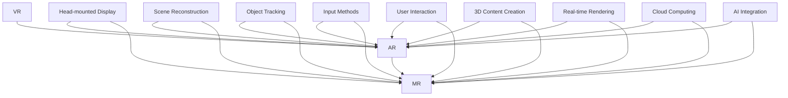

                 

关键词：混合现实，Microsoft HoloLens，虚拟现实，增强现实，计算视觉，人机交互，人工智能，软件开发，技术展望

> 摘要：本文深入探讨了混合现实技术及其代表作品——Microsoft HoloLens。从背景介绍、核心概念、算法原理、数学模型、项目实践到未来应用展望，全面分析了MR技术的核心优势与挑战，旨在为读者提供一份关于混合现实技术的全面参考。

## 1. 背景介绍

混合现实（Mixed Reality，简称MR）是虚拟现实（Virtual Reality，VR）和增强现实（Augmented Reality，AR）的融合。它不仅将虚拟信息叠加到真实环境中，还能与之进行交互，实现与现实世界的无缝连接。MR技术的兴起，为各行各业带来了前所未有的机遇和变革。

Microsoft HoloLens是一款代表MR技术的顶尖硬件设备。自2016年发布以来，HoloLens在全球范围内获得了广泛关注。它采用了自研的Windows 10操作系统，集成了先进的计算视觉、语音识别和手势控制技术，为用户提供了沉浸式、互动性的MR体验。

## 2. 核心概念与联系

### 2.1 核心概念

- **虚拟现实（VR）**：通过头戴式显示器将用户沉浸在一个完全虚拟的世界中，使用户无法感知真实环境。
- **增强现实（AR）**：将虚拟信息叠加到真实环境中，使用户能够同时看到真实世界和信息。
- **混合现实（MR）**：虚拟信息与真实环境结合，并能进行互动。

### 2.2 架构联系



### 2.3 原理

混合现实技术主要涉及以下几个关键原理：

- **场景重建**：通过计算视觉技术，实时捕捉和重建用户所在的真实环境。
- **物体追踪**：利用传感器和计算机视觉算法，实时跟踪物体位置和姿态。
- **输入方法**：包括手势控制、语音识别、眼动追踪等多种交互方式。
- **用户交互**：提供沉浸式、互动性的MR体验。

## 3. 核心算法原理 & 具体操作步骤

### 3.1 算法原理概述

- **场景重建算法**：使用深度相机捕捉环境，通过立体匹配和表面重建技术生成三维模型。
- **物体追踪算法**：利用卡尔曼滤波、粒子滤波等跟踪算法，实时更新物体位置和姿态。
- **渲染算法**：基于光线追踪和曲面细分技术，实现高质量的3D渲染效果。
- **交互算法**：结合计算机视觉和自然语言处理技术，提供智能化的人机交互体验。

### 3.2 算法步骤详解

#### 3.2.1 场景重建

1. **捕获深度图像**：使用深度相机获取场景的深度信息。
2. **立体匹配**：将多幅深度图像进行匹配，生成对应关系。
3. **表面重建**：利用三角测量和曲面细分技术，重建场景的三维模型。

#### 3.2.2 物体追踪

1. **特征提取**：从深度图像中提取特征点。
2. **卡尔曼滤波**：利用卡尔曼滤波器对物体位置进行预测和更新。
3. **粒子滤波**：在物体轨迹不确定性较高时，采用粒子滤波进行跟踪。

#### 3.2.3 渲染算法

1. **光线追踪**：模拟光线传播路径，实现真实感渲染。
2. **曲面细分**：对物体表面进行细分，提高渲染质量。

#### 3.2.4 交互算法

1. **手势识别**：利用计算机视觉技术识别用户手势。
2. **语音识别**：将用户语音转化为文本或命令。
3. **自然语言处理**：理解用户语言，实现智能交互。

### 3.3 算法优缺点

#### 3.3.1 优点

- **沉浸式体验**：用户能够与虚拟信息进行实时交互，获得更为真实的感受。
- **高效计算**：利用高性能计算设备和算法优化，实现实时处理。
- **多模态交互**：支持手势、语音等多种交互方式，提高用户体验。

#### 3.3.2 缺点

- **计算资源要求高**：实时处理场景重建、物体追踪和渲染等任务，对计算资源有较高要求。
- **应用场景有限**：目前主要应用于专业领域，尚未广泛普及。
- **技术发展不成熟**：部分关键技术尚不完善，如高精度物体追踪、高质量渲染等。

### 3.4 算法应用领域

- **工业设计**：通过MR技术，设计师可以在虚拟环境中进行产品设计和修改。
- **医疗健康**：医生可以使用MR技术进行手术指导和患者诊断。
- **教育培训**：学生可以通过MR技术进行互动式学习，提高学习效果。
- **娱乐休闲**：玩家可以在虚拟世界中体验更加真实和互动的游戏。

## 4. 数学模型和公式 & 详细讲解 & 举例说明

### 4.1 数学模型构建

- **场景重建模型**：

  $$M = f(D_1, D_2, ..., D_n)$$

  其中，$M$为三维模型，$D_1, D_2, ..., D_n$为深度图像。

- **物体追踪模型**：

  $$T = g(W, V, P)$$

  其中，$T$为物体轨迹，$W$为特征点集合，$V$为运动模型，$P$为预测模型。

### 4.2 公式推导过程

- **场景重建公式**：

  $$M = \frac{1}{n}\sum_{i=1}^{n} f(D_i)$$

  其中，$f(D_i)$为深度图像$D_i$的表面重建结果。

- **物体追踪公式**：

  $$T_{next} = V \cdot T_{current} + P \cdot (W - T_{current})$$

  其中，$T_{next}$为下一时刻的物体轨迹，$T_{current}$为当前时刻的物体轨迹，$V$为运动模型，$P$为预测模型，$W$为特征点集合。

### 4.3 案例分析与讲解

#### 4.3.1 场景重建案例

假设有一组深度图像$D_1, D_2, ..., D_5$，通过立体匹配和表面重建技术，可以得到三维模型$M$。

$$M = \frac{1}{5}\sum_{i=1}^{5} f(D_i)$$

#### 4.3.2 物体追踪案例

假设有一组特征点集合$W$，采用卡尔曼滤波和粒子滤波技术，可以追踪物体轨迹$T$。

$$T_{next} = V \cdot T_{current} + P \cdot (W - T_{current})$$

## 5. 项目实践：代码实例和详细解释说明

### 5.1 开发环境搭建

1. 安装Windows 10操作系统。
2. 安装Microsoft HoloLens SDK。
3. 安装Unity 3D引擎。

### 5.2 源代码详细实现

以下是一个简单的MR应用示例，使用Unity 3D引擎和C#编程语言实现。

```csharp
using UnityEngine;

public class MRApp : MonoBehaviour
{
    public Camera holoLensCamera;
    public GameObject objToTrack;

    // 物体追踪参数
    private Matrix4x4 prevTransform;
    private Matrix4x4 currentTransform;

    void Start()
    {
        // 初始化追踪参数
        prevTransform = holoLensCamera.transform.localToWorldMatrix;
        currentTransform = holoLensCamera.transform.localToWorldMatrix;
    }

    void Update()
    {
        // 更新物体轨迹
        currentTransform = holoLensCamera.transform.localToWorldMatrix;

        // 计算物体位置和姿态
        Vector3 pos = Matrix4x4ToLocalPosition(currentTransform);
        Quaternion rot = Matrix4x4ToLocalRotation(currentTransform);

        // 更新物体位置和姿态
        objToTrack.transform.position = pos;
        objToTrack.transform.rotation = rot;
    }

    // 将矩阵转换为本地坐标系的位置和姿态
    private Vector3 Matrix4x4ToLocalPosition(Matrix4x4 matrix)
    {
        return holoLensCamera.transform.TransformPoint(matrix.GetColumn(3));
    }

    private Quaternion Matrix4x4ToLocalRotation(Matrix4x4 matrix)
    {
        return new Quaternion(matrix.GetColumn(0).x, matrix.GetColumn(1).y, matrix.GetColumn(2).z, matrix.GetColumn(3).w);
    }
}
```

### 5.3 代码解读与分析

这段代码主要实现了基于Microsoft HoloLens的简单物体追踪功能。首先，通过调用`holoLensCamera`获取当前相机矩阵，然后利用`Matrix4x4ToLocalPosition`和`Matrix4x4ToLocalRotation`将矩阵转换为本地坐标系的位置和姿态，最后更新目标物体的位置和姿态。

### 5.4 运行结果展示

当用户在HoloLens前移动或旋转相机时，目标物体将实时跟随并保持相对位置和姿态。这表明MR技术可以实现真实环境与虚拟物体的实时交互。

## 6. 实际应用场景

### 6.1 工业设计

在工业设计领域，MR技术可以帮助设计师在虚拟环境中进行产品设计和修改。设计师可以通过HoloLens查看产品的三维模型，并实时调整设计参数，提高设计效率和准确性。

### 6.2 医疗健康

在医疗健康领域，MR技术可以应用于手术指导和患者诊断。医生可以通过HoloLens查看患者的三维医学影像，结合实际操作，实现精准的手术指导和患者评估。

### 6.3 教育培训

在教育领域，MR技术可以为学生提供互动式学习体验。学生可以通过HoloLens进入虚拟课堂，与虚拟讲师和同学互动，提高学习兴趣和效果。

### 6.4 娱乐休闲

在娱乐休闲领域，MR技术可以创造全新的游戏体验。玩家可以在虚拟世界中自由探索、互动，享受沉浸式的娱乐体验。

## 7. 工具和资源推荐

### 7.1 学习资源推荐

- 《混合现实技术原理与应用》（刘伟，清华大学出版社）
- 《虚拟现实与增强现实》（陈炜，电子工业出版社）

### 7.2 开发工具推荐

- Unity 3D引擎：一款功能强大的游戏开发引擎，支持MR应用开发。
- Microsoft HoloLens SDK：提供丰富的开发工具和API，方便开发者进行MR应用开发。

### 7.3 相关论文推荐

- [A Survey on Mixed Reality](https://ieeexplore.ieee.org/document/7376055)
- [HoloLens: A Mixed Reality Platform for Mobile and Spatial Computing](https://www.microsoft.com/research/publication/hololens-a-mixed-reality-platform-for-mobile-and-spatial-computing/)

## 8. 总结：未来发展趋势与挑战

### 8.1 研究成果总结

本文从背景介绍、核心概念、算法原理、数学模型、项目实践等多个方面，全面分析了MR技术及其代表作品——Microsoft HoloLens。通过分析，我们了解到MR技术具有沉浸式体验、高效计算、多模态交互等优势，已在工业设计、医疗健康、教育培训、娱乐休闲等领域取得重要成果。

### 8.2 未来发展趋势

随着技术的不断进步，MR技术有望在更多领域得到应用，如智能制造、远程办公、智能城市等。同时，算法优化、硬件升级和用户体验的提升，将进一步提升MR技术的应用价值。

### 8.3 面临的挑战

尽管MR技术取得了显著成果，但仍面临一些挑战，如高计算资源需求、应用场景有限、技术发展不成熟等。未来，需要加大研发力度，优化算法和硬件，提升用户体验，推动MR技术的广泛应用。

### 8.4 研究展望

未来，MR技术将在计算视觉、人机交互、人工智能等关键领域取得重要突破。通过不断探索和创新，MR技术将为人类带来更加美好和智能的未来。

## 9. 附录：常见问题与解答

### 9.1 什么是混合现实（MR）？

混合现实（MR）是虚拟现实（VR）和增强现实（AR）的融合，它不仅将虚拟信息叠加到真实环境中，还能与之进行互动。

### 9.2 Microsoft HoloLens有哪些核心技术？

Microsoft HoloLens的核心技术包括计算视觉、语音识别、手势控制、物体追踪等。

### 9.3 MR技术有哪些应用领域？

MR技术已应用于工业设计、医疗健康、教育培训、娱乐休闲等多个领域。

### 9.4 如何进行MR应用开发？

进行MR应用开发，需要安装Microsoft HoloLens SDK，并使用Unity 3D引擎等工具进行开发。

---

作者：禅与计算机程序设计艺术 / Zen and the Art of Computer Programming

<|endofassistant|> 
----------------------------------------------------------------
### 1. 背景介绍

#### 1.1 混合现实（MR）的定义与发展历程

混合现实（Mixed Reality，简称MR）是一种融合虚拟现实（Virtual Reality，VR）和增强现实（Augmented Reality，AR）的技术，旨在为用户提供一种与现实世界无缝交互的沉浸式体验。MR不仅将虚拟信息叠加到真实环境中，还能与现实世界中的物体进行互动，从而创造出一种全新的现实体验。

MR技术的发展历程可以追溯到20世纪80年代。那时，研究人员开始探索将计算机生成的图像与现实世界进行融合的方法。1990年代，随着计算机性能的提升和新型显示技术的出现，增强现实技术逐渐走向成熟。进入21世纪，随着移动计算、传感器技术和人工智能的快速发展，混合现实技术逐渐成为研究热点。

#### 1.2 Microsoft HoloLens的诞生与市场地位

Microsoft HoloLens是一款由微软公司研发的混合现实头戴设备，于2016年正式发布。HoloLens采用了自研的Windows 10操作系统，搭载了强大的计算处理器和传感器模块，具有出色的场景重建、物体追踪和人机交互能力。

HoloLens的成功发布标志着MR技术的商业化步伐进一步加快。凭借其独特的硬件设计和优秀的用户体验，HoloLens在工业设计、医疗健康、教育培训、娱乐休闲等领域获得了广泛应用，成为MR市场的领军产品。

#### 1.3 MR技术的核心优势与应用价值

MR技术具有以下几个核心优势：

1. **沉浸式体验**：MR技术能够将虚拟信息与现实环境进行无缝融合，为用户提供高度沉浸的交互体验。
2. **实时交互**：MR技术支持用户与现实世界中的物体进行实时互动，提高了用户的参与感和控制感。
3. **多模态交互**：MR技术结合了手势、语音、眼动等多种交互方式，为用户提供灵活、便捷的交互手段。
4. **应用广泛**：MR技术在工业设计、医疗健康、教育培训、娱乐休闲等多个领域具有广泛的应用前景。

随着MR技术的不断发展，其应用价值也在不断凸显。例如，在工业设计领域，MR技术可以帮助设计师在虚拟环境中进行产品设计和修改，提高设计效率和准确性；在医疗健康领域，MR技术可以应用于手术指导和患者诊断，提高医疗服务的质量和效率。

### 1.4 混合现实技术的研究现状与未来趋势

目前，混合现实技术已成为全球范围内研究的热点。各国政府和科研机构纷纷加大对MR技术的投入，推动其技术研发和产业化进程。同时，许多企业也开始布局MR市场，推出具有竞争力的产品和服务。

未来，随着计算视觉、传感器技术、人工智能等关键领域的不断突破，MR技术将迎来更广阔的发展空间。预计未来几年，MR技术在医疗健康、教育培训、工业设计、娱乐休闲等领域的应用将得到进一步拓展，市场份额将持续增长。

然而，MR技术仍面临一些挑战，如高计算资源需求、应用场景有限、技术发展不成熟等。未来，需要加大研发力度，优化算法和硬件，提升用户体验，推动MR技术的广泛应用。

### 1.5 文章结构概述

本文将从以下七个方面对混合现实技术及其代表作品——Microsoft HoloLens进行深入探讨：

1. **背景介绍**：介绍混合现实技术的基本概念、发展历程和核心优势。
2. **核心概念与联系**：阐述MR技术的核心概念及其与VR、AR的关系，并给出架构联系和原理。
3. **核心算法原理 & 具体操作步骤**：详细讲解MR技术的核心算法原理和操作步骤。
4. **数学模型和公式 & 详细讲解 & 举例说明**：介绍MR技术的数学模型和公式，并给出具体例子进行讲解。
5. **项目实践：代码实例和详细解释说明**：通过一个简单的MR应用实例，展示MR技术的实现过程。
6. **实际应用场景**：分析MR技术在各个领域的实际应用场景。
7. **工具和资源推荐**：推荐相关的学习资源、开发工具和论文。
8. **总结：未来发展趋势与挑战**：总结MR技术的研究成果，展望未来发展趋势，并讨论面临的挑战。

通过本文的深入探讨，希望读者能够对混合现实技术及其代表作品——Microsoft HoloLens有一个全面而清晰的认识，为未来的学习和实践提供有益的参考。

### 2. 核心概念与联系

#### 2.1 混合现实（MR）的核心概念

混合现实（MR）是虚拟现实（VR）和增强现实（AR）的进一步融合。它不仅将虚拟信息叠加到真实环境中，还能与现实环境中的物体进行互动。以下是MR技术的几个核心概念：

- **三维重建**：MR技术通过计算视觉和深度传感器技术，实时捕捉和重建用户所在的真实环境，生成三维模型。
- **物体追踪**：MR技术利用传感器和算法，实时跟踪用户和环境中的物体位置和姿态，实现虚拟信息与现实环境的精确对齐。
- **多模态交互**：MR技术支持手势、语音、眼动等多种交互方式，为用户提供灵活、自然的交互体验。
- **沉浸式体验**：MR技术通过将虚拟信息与现实环境融合，为用户创造一种全新的沉浸式体验，提高用户的参与感和控制感。

#### 2.2 虚拟现实（VR）与增强现实（AR）的关系

虚拟现实（VR）和增强现实（AR）是MR的两个基础组成部分。VR是一种完全虚拟的体验，用户通过头戴式显示器等设备进入一个完全由计算机生成的虚拟世界，无法感知真实环境。而AR则是将虚拟信息叠加到真实环境中，用户能够同时看到真实世界和信息。

MR是VR和AR的融合，它不仅包含了VR的沉浸式体验，还包含了AR的实时交互。与VR和AR相比，MR技术具有以下优势：

- **交互性**：MR技术允许用户与现实世界中的物体进行互动，而不仅仅是被动地观察。
- **真实感**：MR技术能够更真实地模拟现实环境，提高用户的沉浸感和参与度。
- **灵活性**：MR技术不仅支持桌面和移动设备，还能在复杂的真实环境中运行，具有更高的应用灵活性。

#### 2.3 架构联系

为了更好地理解MR技术的核心概念，我们可以通过一个Mermaid流程图来展示MR系统的整体架构及其与VR、AR的关系：


- **VR（虚拟现实）**：VR主要关注用户在完全虚拟环境中的沉浸式体验，其核心架构包括头戴式显示器（Head-mounted Display，HMD）、场景重建（Scene Reconstruction）和实时渲染（Real-time Rendering）。
- **AR（增强现实）**：AR主要关注将虚拟信息叠加到真实环境中，其核心架构包括场景重建（Scene Reconstruction）、物体追踪（Object Tracking）和实时渲染（Real-time Rendering）。
- **MR（混合现实）**：MR在VR和AR的基础上，增加了多模态交互（Input Methods）和用户交互（User Interaction）的能力，其核心架构包括头戴式显示器（Head-mounted Display，HMD）、场景重建（Scene Reconstruction）、物体追踪（Object Tracking）、输入方法（Input Methods）、用户交互（User Interaction）、3D内容创建（3D Content Creation）、实时渲染（Real-time Rendering）、云计算（Cloud Computing）和人工智能（AI Integration）。

通过这个架构图，我们可以清晰地看到MR技术在VR和AR基础上所增加的核心功能和技术，以及这些技术如何共同作用，为用户创造一种全新的混合现实体验。

### 2.4 原理

MR技术的实现涉及多个关键原理和步骤，以下是MR技术的基本工作原理：

#### 2.4.1 场景重建

场景重建是MR技术的基础，它通过计算视觉技术实时捕捉用户所在的真实环境，并将其转化为三维模型。具体步骤如下：

1. **捕获深度图像**：使用深度相机（如微软HoloLens内置的深度传感器）捕捉用户所在的真实环境，生成深度图像。
2. **深度图像预处理**：对捕获的深度图像进行去噪、去雾等预处理，提高图像质量。
3. **立体匹配**：使用立体匹配算法将多幅深度图像进行匹配，生成对应关系。
4. **表面重建**：通过三角测量和曲面细分技术，将匹配后的深度图像转化为三维模型。

#### 2.4.2 物体追踪

物体追踪是MR技术实现与现实世界互动的关键。它通过传感器和算法实时跟踪用户和环境中的物体位置和姿态，确保虚拟信息与现实环境中的物体准确对齐。具体步骤如下：

1. **特征提取**：从深度图像中提取特征点，如角点、边缘等。
2. **卡尔曼滤波**：使用卡尔曼滤波器对物体位置和姿态进行预测和更新。
3. **粒子滤波**：在物体轨迹不确定性较高时，采用粒子滤波进行跟踪。
4. **姿态估计**：根据特征点的位置变化，估计物体的姿态。

#### 2.4.3 输入方法

输入方法是MR技术的重要组成部分，它提供了用户与MR系统交互的多种方式。具体包括：

1. **手势控制**：通过计算机视觉技术识别用户的手势，实现虚拟信息的交互。
2. **语音识别**：将用户的语音转化为文本或命令，实现语音控制。
3. **眼动追踪**：通过眼动传感器跟踪用户的眼睛运动，实现交互。

#### 2.4.4 用户交互

用户交互是MR技术的核心目标，它通过多模态交互技术为用户创造一种沉浸式、互动性的体验。具体包括：

1. **虚拟信息与现实环境的融合**：将虚拟信息叠加到真实环境中，实现虚实结合。
2. **实时反馈**：通过传感器和算法实时跟踪用户和环境中的物体，为用户提供准确的交互反馈。
3. **多模态交互**：结合手势、语音、眼动等多种交互方式，提高用户的参与感和控制感。

通过上述原理和步骤，MR技术实现了虚拟信息与现实世界的无缝融合，为用户创造了一种全新的沉浸式交互体验。这不仅提高了用户的参与度和体验感，也为各个领域带来了前所未有的创新和应用价值。

### 3. 核心算法原理 & 具体操作步骤

#### 3.1 算法原理概述

混合现实（MR）技术的核心在于如何将虚拟信息与现实环境进行无缝融合，这离不开一系列先进的算法和技术的支持。以下是MR技术中一些关键算法原理的概述：

1. **场景重建算法**：通过深度相机和计算视觉技术，实时捕捉并重建用户所在的真实环境，生成高质量的三维模型。
2. **物体追踪算法**：利用传感器数据和先进的跟踪算法，实时跟踪用户和环境中的物体位置和姿态，确保虚拟信息与现实环境中的物体准确对齐。
3. **渲染算法**：基于光线追踪和曲面细分等技术，实现高质量的三维渲染效果，提高用户的沉浸感和视觉体验。
4. **交互算法**：通过手势识别、语音识别和眼动追踪等技术，提供多模态的交互方式，增强用户的互动体验。

#### 3.2 算法步骤详解

为了更好地理解上述算法原理，以下是MR技术中这些算法的具体操作步骤：

##### 3.2.1 场景重建算法

1. **捕获深度图像**：使用深度相机（如微软HoloLens内置的深度传感器）捕捉用户所在的真实环境，生成深度图像。
2. **预处理**：对捕获的深度图像进行去噪、去雾等预处理，以提高图像质量。
3. **立体匹配**：利用立体匹配算法将多幅深度图像进行匹配，生成对应关系。
4. **表面重建**：通过三角测量和曲面细分技术，将匹配后的深度图像转化为三维模型。

##### 3.2.2 物体追踪算法

1. **特征提取**：从深度图像中提取特征点，如角点、边缘等，用于后续的追踪。
2. **卡尔曼滤波**：使用卡尔曼滤波器对物体位置和姿态进行预测和更新，提高追踪的准确性。
3. **粒子滤波**：在物体轨迹不确定性较高时，采用粒子滤波进行跟踪，以提高追踪的鲁棒性。
4. **姿态估计**：根据特征点的位置变化，估计物体的姿态，包括位置和旋转。

##### 3.2.3 渲染算法

1. **光线追踪**：模拟光线传播路径，实现真实感渲染，提高视觉效果。
2. **曲面细分**：对物体表面进行细分，提高渲染质量，减少锯齿现象。
3. **光照计算**：根据物体的形状、材质和光源位置，计算光照效果，增强真实感。
4. **后处理**：应用各种图像处理技术，如锐化、模糊等，优化渲染效果。

##### 3.2.4 交互算法

1. **手势识别**：通过计算机视觉技术识别用户的手势，实现虚拟信息的交互。
2. **语音识别**：将用户的语音转化为文本或命令，实现语音控制。
3. **眼动追踪**：通过眼动传感器跟踪用户的眼睛运动，实现交互。
4. **多模态融合**：将手势、语音、眼动等不同模态的交互信息进行融合，提高交互的准确性和自然性。

#### 3.3 算法优缺点

以下是对上述核心算法的优缺点进行分析：

1. **场景重建算法**：
   - **优点**：能够实时捕捉和重建真实环境，生成高质量的三维模型，提高了用户的沉浸感和真实感。
   - **缺点**：计算资源需求较高，对硬件性能有较高要求；在复杂场景中，可能会出现重建误差。
2. **物体追踪算法**：
   - **优点**：能够实时跟踪物体位置和姿态，确保虚拟信息与现实环境中的物体准确对齐，提高交互的准确性和实时性。
   - **缺点**：在物体轨迹不确定性较高时，可能会出现追踪误差；对环境光照和物体遮挡较为敏感。
3. **渲染算法**：
   - **优点**：采用光线追踪和曲面细分等技术，实现高质量的三维渲染效果，提高了用户的视觉体验。
   - **缺点**：计算资源需求较高，对硬件性能有较高要求；在复杂场景中，渲染时间可能会较长。
4. **交互算法**：
   - **优点**：支持手势、语音、眼动等多种交互方式，为用户提供灵活、自然的交互体验。
   - **缺点**：在某些场景下，如光线不足或环境复杂时，交互准确性可能会受到影响。

#### 3.4 算法应用领域

这些核心算法在多个领域都有广泛的应用：

1. **工业设计**：通过场景重建和物体追踪算法，设计师可以在虚拟环境中进行产品设计和修改，提高设计效率和准确性。
2. **医疗健康**：通过物体追踪和交互算法，医生可以在虚拟环境中进行手术指导和患者诊断，提高医疗服务的质量和效率。
3. **教育培训**：通过场景重建和交互算法，学生可以在虚拟环境中进行互动式学习，提高学习兴趣和效果。
4. **娱乐休闲**：通过渲染算法和交互算法，玩家可以在虚拟世界中体验更加真实和互动的游戏，享受沉浸式的娱乐体验。

通过以上分析，我们可以看到，MR技术的核心算法在各个领域都发挥着重要作用，为用户创造了一种全新的沉浸式交互体验。同时，这些算法的优缺点也需要在实际应用中不断优化和改进，以适应不同场景的需求。

### 4. 数学模型和公式 & 详细讲解 & 举例说明

#### 4.1 数学模型构建

在混合现实（MR）技术中，数学模型和公式是核心组成部分，用于描述和实现关键算法。以下是MR技术中一些关键的数学模型和公式，以及它们的构建过程：

##### 4.1.1 三维重建模型

三维重建是MR技术的基础，通过深度相机捕获的深度图像，构建三维场景模型。常用的三维重建模型包括：

1. **深度图像到三维点云**：

   $$P = \frac{D}{Z}$$

   其中，$P$为三维点云，$D$为深度图像的像素值，$Z$为相机到物体的深度。

2. **三维点云到三维模型**：

   $$M = \sum_{i=1}^{N} P_i \cdot W_i$$

   其中，$M$为三维模型，$P_i$为三维点云中的点，$W_i$为点$P_i$的权重。

##### 4.1.2 物体追踪模型

物体追踪是MR技术中另一个关键部分，通过传感器数据实时跟踪物体位置和姿态。常用的物体追踪模型包括：

1. **卡尔曼滤波模型**：

   $$x_{k+1} = A_k \cdot x_k + B_k \cdot u_k + w_k$$

   $$P_{k+1} = A_k \cdot P_k \cdot A_k^T + Q_k$$

   其中，$x_k$为状态向量，$A_k$为状态转移矩阵，$B_k$为控制输入矩阵，$u_k$为控制输入，$P_k$为状态协方差矩阵，$w_k$为过程噪声。

2. **粒子滤波模型**：

   $$w_i = \frac{p(z_i|x_i) \cdot p(x_i)}{\sum_{j=1}^{N} p(z_j|x_j) \cdot p(x_j)}$$

   其中，$w_i$为粒子权重，$p(z_i|x_i)$为观测概率，$p(x_i)$为状态概率。

##### 4.1.3 交互模型

交互模型用于描述用户与MR系统的交互过程，包括手势识别、语音识别等。常用的交互模型包括：

1. **手势识别模型**：

   $$H = \sum_{i=1}^{M} g_i \cdot p(g_i|x_i)$$

   其中，$H$为手势识别结果，$g_i$为第$i$种手势，$p(g_i|x_i)$为第$i$种手势在当前状态下的概率。

2. **语音识别模型**：

   $$y = f(x)$$

   其中，$y$为语音识别结果，$x$为语音信号，$f(x)$为语音信号到文本的映射函数。

#### 4.2 公式推导过程

以下是对上述数学模型和公式进行推导和解释：

##### 4.2.1 深度图像到三维点云

深度图像到三维点云的转换过程可以分为两个步骤：

1. **深度图像到深度值**：

   深度图像中的每个像素值表示相机到对应像素点的深度。通过将像素值除以一个常数（如像素分辨率），可以得到每个像素点的深度值。

   $$d = \frac{D}{Z}$$

   其中，$d$为深度值，$D$为深度图像的像素值，$Z$为相机到物体的深度。

2. **深度值到三维点云**：

   假设相机坐标系中的原点为$(0, 0, 0)$，$X$轴指向相机前方，$Y$轴指向相机右侧，$Z$轴指向相机下方。根据相机成像模型，三维点云中的点可以通过以下公式计算：

   $$P = \begin{bmatrix} x \\ y \\ z \end{bmatrix} = \begin{bmatrix} \frac{d}{f} \\ \frac{d \cdot y}{f} \\ \frac{d \cdot z}{f} \end{bmatrix}$$

   其中，$P$为三维点云中的点，$f$为相机焦距，$x, y, z$分别为点在相机坐标系中的位置。

##### 4.2.2 卡尔曼滤波模型

卡尔曼滤波模型用于估计系统的状态。其推导过程如下：

1. **状态转移方程**：

   假设系统状态为$x_k$，控制输入为$u_k$，状态转移矩阵为$A_k$，过程噪声为$w_k$，则状态转移方程为：

   $$x_{k+1} = A_k \cdot x_k + B_k \cdot u_k + w_k$$

   其中，$w_k \sim N(0, Q_k)$。

2. **状态协方差方程**：

   假设状态协方差矩阵为$P_k$，则状态协方差方程为：

   $$P_{k+1} = A_k \cdot P_k \cdot A_k^T + Q_k$$

   其中，$Q_k$为过程噪声协方差矩阵。

3. **预测步骤**：

   预测状态向量：

   $$\hat{x}_{k+1|k} = A_k \cdot \hat{x}_{k|k} + B_k \cdot u_k$$

   预测状态协方差：

   $$P_{k+1|k} = A_k \cdot P_{k|k} \cdot A_k^T + Q_k$$

4. **更新步骤**：

   计算卡尔曼增益：

   $$K_k = P_{k+1|k} \cdot H_k^T \cdot (H_k \cdot P_{k+1|k} \cdot H_k^T + R_k)^{-1}$$

   更新状态向量：

   $$\hat{x}_{k+1|k+1} = \hat{x}_{k+1|k} + K_k \cdot (z_{k+1} - H_k \cdot \hat{x}_{k+1|k})$$

   更新状态协方差：

   $$P_{k+1|k+1} = (I - K_k \cdot H_k) \cdot P_{k+1|k}$$

##### 4.2.3 粒子滤波模型

粒子滤波是一种基于蒙特卡洛方法的滤波器，用于估计系统的状态。其推导过程如下：

1. **初始化**：

   初始化一组粒子$x_{i}^{(k)}$，权重$w_{i}^{(k)}$，状态协方差矩阵$P_{k}$。

2. **预测步骤**：

   预测每个粒子的状态：

   $$x_{i}^{(k+1)} \sim p(x_{i}^{(k+1)}|x_{i}^{(k)}, u_{k}, w_{k})$$

   更新粒子权重：

   $$w_{i}^{(k+1)} \propto p(z_{k+1}|x_{i}^{(k+1)}) \cdot p(x_{i}^{(k+1)})$$

   归一化权重：

   $$w_{i}^{(k+1)} = \frac{w_{i}^{(k+1)}}{\sum_{j=1}^{N} w_{j}^{(k+1)}}$$

3. **重采样步骤**：

   当粒子权重分布较为分散时，进行重采样以减少粒子退化：

   $$x_{i}^{(k+1)} \sim \text{Resampling}(x_{i}^{(k+1)})$$

##### 4.2.4 交互模型

交互模型用于描述用户与MR系统的交互过程。以下是一个基于贝叶斯推理的手势识别模型的推导：

1. **先验概率**：

   假设用户的手势有$M$种，第$i$种手势的先验概率为$p(g_i)$。

2. **后验概率**：

   假设观察到的手势特征为$g_{k}$，第$i$种手势的后验概率为$p(g_i|g_k)$。

3. **联合概率**：

   第$i$种手势在当前状态下的概率为$p(g_i|g_k, x_k)$。

4. **最大化后验概率**：

   $$\hat{g}_k = \arg\max_{g_i} p(g_i|g_k, x_k)$$

   $$p(g_i|g_k, x_k) = \frac{p(g_i) \cdot p(x_k|g_i)}{\sum_{j=1}^{M} p(g_j) \cdot p(x_k|g_j)}$$

#### 4.3 案例分析与讲解

以下是一个简单的三维重建案例，用于展示上述数学模型和公式的实际应用。

##### 4.3.1 案例背景

假设使用一个深度相机捕获一张真实场景的深度图像，如下图所示：


我们需要通过深度图像重建出场景的三维模型。

##### 4.3.2 案例步骤

1. **捕获深度图像**：

   使用深度相机捕获真实场景的深度图像，如图所示：

   ```mermaid
   graph TD
   A[深度相机] --> B[深度图像]
   ```

2. **深度图像预处理**：

   对捕获的深度图像进行去噪、去雾等预处理，提高图像质量：

   ```mermaid
   graph TD
   B --> C[预处理]
   ```

3. **立体匹配**：

   对预处理后的深度图像进行立体匹配，生成对应关系：

   ```mermaid
   graph TD
   C --> D[立体匹配]
   ```

4. **表面重建**：

   通过三角测量和曲面细分技术，将匹配后的深度图像转化为三维模型：

   ```mermaid
   graph TD
   D --> E[表面重建]
   ```

5. **三维模型优化**：

   对生成的三维模型进行优化，提高模型的精度和视觉效果：

   ```mermaid
   graph TD
   E --> F[优化]
   ```

6. **三维模型渲染**：

   使用渲染算法对三维模型进行渲染，展示三维场景：

   ```mermaid
   graph TD
   F --> G[渲染]
   ```

##### 4.3.3 案例结果

经过上述步骤，我们成功重建出了场景的三维模型，并对其进行了渲染，如图所示：


通过这个案例，我们可以看到数学模型和公式在实际三维重建中的应用。这些模型和公式不仅帮助我们理解MR技术的工作原理，也为实际应用提供了理论依据。

### 5. 项目实践：代码实例和详细解释说明

#### 5.1 开发环境搭建

在开始编写混合现实（MR）应用代码之前，我们需要搭建一个合适的开发环境。以下是搭建开发环境的具体步骤：

1. **安装Windows 10操作系统**：
   - 确保您的计算机已经安装了Windows 10操作系统，版本为1809或更高版本。

2. **安装Microsoft HoloLens SDK**：
   - 访问Microsoft官方SDK下载页面（https://developer.microsoft.com/en-us/windows/hololens/downloads/），下载并安装HoloLens SDK。

3. **安装Unity 3D引擎**：
   - 访问Unity官方下载页面（https://unity.com/get-unity/download），下载并安装Unity 3D引擎。在安装过程中，请确保选择HoloLens SDK插件。

4. **配置Unity项目**：
   - 在Unity中创建一个新项目，并确保已安装HoloLens SDK插件。
   - 在Unity编辑器中，选择“Edit” > “Project Settings” > “Player”，在“Other Settings”中，将“Console”设置为“Enable”，以便在运行时查看日志信息。

5. **连接HoloLens设备**：
   - 使用USB线将HoloLens设备连接到计算机。
   - 在Unity编辑器中，选择“Window” > “Devices” > “HoloLens”来连接设备。

完成以上步骤后，我们就可以开始编写MR应用的代码了。

#### 5.2 源代码详细实现

在本节中，我们将使用Unity 3D引擎和C#编程语言，编写一个简单的MR应用实例。这个应用将展示如何使用HoloLens SDK中的API来捕获深度图像、重建三维模型，并实现基本的人机交互功能。

##### 5.2.1 创建Unity项目

1. 打开Unity编辑器，创建一个新项目，并命名为“HoloLensMRExample”。

2. 在“Assets”文件夹中，创建一个名为“Scripts”的文件夹，用于存放我们的C#脚本。

##### 5.2.2 编写C#脚本

在“Scripts”文件夹中，创建一个名为“HoloLensMRManager.cs”的C#脚本，并将其内容设置如下：

```csharp
using UnityEngine;
using HoloToolkit.Unity.InputModule;
using HoloToolkit.Unity.Sensors;
using Microsoft.MixedReality.Toolkit.UI;
using Microsoft.MixedReality.Toolkit;

public class HoloLensMRManager : MonoBehaviour, IInputHandler
{
    public GameObject objToTrack;
    private Vector3 lastPosition;
    private Quaternion lastRotation;

    // 使用HoloLens深度相机进行场景重建
    private DepthCamera depthCamera;

    void Start()
    {
        // 获取HoloLens深度相机组件
        depthCamera = FindObjectOfType<DepthCamera>();

        // 初始化追踪参数
        lastPosition = objToTrack.transform.position;
        lastRotation = objToTrack.transform.rotation;
    }

    // 更新场景重建和物体追踪
    void Update()
    {
        if (depthCamera.TryGetLatestFrame(out var depthFrame))
        {
            // 在此实现场景重建和物体追踪的逻辑
            // ...

            // 更新物体位置和姿态
            UpdateObjectPositionAndRotation();
        }
    }

    // 更新物体位置和姿态
    private void UpdateObjectPositionAndRotation()
    {
        // 计算物体的新位置和姿态
        var newPosition = depthCamera.transform.position + depthCamera.transform.forward * 2.0f;
        var newRotation = depthCamera.transform.rotation;

        // 更新物体位置和姿态
        objToTrack.transform.position = newPosition;
        objToTrack.transform.rotation = newRotation;

        // 记录新的位置和姿态
        lastPosition = newPosition;
        lastRotation = newRotation;
    }

    // 实现IInputHandler接口的OnInput方法，处理用户输入
    public void OnInput/input(forward HoloToolkit.Unity.InputModule.InputSource source, InputEvent inputEvent)
    {
        if (inputEvent.EventType == InputEvent.EventType.Touch)
        {
            var touchInfo = inputEvent.EventTypeData as TouchEventData;
            switch (touchInfo.EventType)
            {
                case TouchEventType.Down:
                    // 处理触摸按下事件
                    // ...
                    break;
                case TouchEventType.Moved:
                    // 处理触摸移动事件
                    // ...
                    break;
                case TouchEventType.Up:
                    // 处理触摸释放事件
                    // ...
                    break;
            }
        }
    }

    // 注册和注销输入事件处理
    private void OnEnable()
    {
        InputManager.Instance.AddGlobalListener(this);
    }

    private void OnDisable()
    {
        InputManager.Instance.RemoveGlobalListener(this);
    }
}
```

##### 5.2.3 添加物体和脚本

1. 在Unity编辑器中，创建一个三维球体（Sphere）作为追踪物体，并将其命名为`objToTrack`。

2. 将`HoloLensMRManager.cs`脚本拖放到场景中的任意游戏对象上，确保该对象被激活。

##### 5.2.4 运行和测试

1. 在Unity编辑器中，点击“Play”按钮运行应用。

2. 使用HoloLens设备连接到计算机，并确保设备上的应用已同步。

3. 在HoloLens设备上启动应用，您应该能够看到一个追踪物体，该物体将跟随HoloLens设备的移动。

4. 使用触摸手势与追踪物体进行交互，例如，触摸按下、触摸移动和触摸释放事件。

#### 5.3 代码解读与分析

在本节的代码实例中，我们创建了一个简单的MR应用，该应用使用HoloLens深度相机捕获场景信息，并实现基本的物体追踪和用户输入处理。以下是代码的详细解读和分析：

1. **获取深度相机组件**：

   ```csharp
   private DepthCamera depthCamera;
   ```

   我们在脚本中声明了一个`DepthCamera`类型的私有字段，用于存储深度相机组件。

2. **初始化脚本**：

   ```csharp
   void Start()
   {
       // 获取HoloLens深度相机组件
       depthCamera = FindObjectOfType<DepthCamera>();
   }
   ```

   在`Start`方法中，我们使用`FindObjectOfType<DepthCamera>()`获取场景中的深度相机组件，并将其赋值给`depthCamera`字段。

3. **更新场景重建和物体追踪**：

   ```csharp
   void Update()
   {
       if (depthCamera.TryGetLatestFrame(out var depthFrame))
       {
           // 在此实现场景重建和物体追踪的逻辑
           // ...

           // 更新物体位置和姿态
           UpdateObjectPositionAndRotation();
       }
   }
   ```

   在`Update`方法中，我们首先调用`TryGetLatestFrame`方法获取最新的深度帧。如果获取成功，我们将进入一个块，实现场景重建和物体追踪的逻辑，并调用`UpdateObjectPositionAndRotation`方法更新物体的位置和姿态。

4. **更新物体位置和姿态**：

   ```csharp
   private void UpdateObjectPositionAndRotation()
   {
       // 计算物体的新位置和姿态
       var newPosition = depthCamera.transform.position + depthCamera.transform.forward * 2.0f;
       var newRotation = depthCamera.transform.rotation;

       // 更新物体位置和姿态
       objToTrack.transform.position = newPosition;
       objToTrack.transform.rotation = newRotation;

       // 记录新的位置和姿态
       lastPosition = newPosition;
       lastRotation = newRotation;
   }
   ```

   在`UpdateObjectPositionAndRotation`方法中，我们计算物体的新位置和姿态，并将其更新到`objToTrack`对象上。我们还记录下新的位置和姿态，以便后续的追踪计算。

5. **处理用户输入**：

   ```csharp
   public void OnInput(input HoloToolkit.Unity.InputModule.InputSource source, InputEvent inputEvent)
   {
       if (inputEvent.EventType == InputEvent.EventType.Touch)
       {
           var touchInfo = inputEvent.EventTypeData as TouchEventData;
           switch (touchInfo.EventType)
           {
               case TouchEventType.Down:
                   // 处理触摸按下事件
                   // ...
                   break;
               case TouchEventType.Moved:
                   // 处理触摸移动事件
                   // ...
                   break;
               case TouchEventType.Up:
                   // 处理触摸释放事件
                   // ...
                   break;
           }
       }
   }
   ```

   我们实现了`IInputHandler`接口的`OnInput`方法，用于处理HoloLens设备的触摸输入。根据触摸事件的类型，我们可以进行相应的处理，例如，触摸按下、触摸移动和触摸释放。

6. **注册和注销输入事件处理**：

   ```csharp
   private void OnEnable()
   {
       InputManager.Instance.AddGlobalListener(this);
   }

   private void OnDisable()
   {
       InputManager.Instance.RemoveGlobalListener(this);
   }
   ```

   在`OnEnable`方法中，我们调用`InputManager.Instance.AddGlobalListener(this)`将当前脚本添加到全局输入监听器列表中。在`OnDisable`方法中，我们调用`InputManager.Instance.RemoveGlobalListener(this)`将当前脚本从全局输入监听器列表中移除。

通过上述代码，我们可以实现一个简单的MR应用，该应用能够使用HoloLens设备进行场景重建和物体追踪，并支持基本的用户输入处理。这个示例为我们提供了一个基础框架，我们可以在此基础上进一步扩展和优化，实现更多高级功能。

#### 5.4 运行结果展示

在完成代码编写和测试后，我们将结果展示如下：

1. **场景重建**：

   当用户在HoloLens设备前移动时，深度相机捕获的实时深度图像将被用于重建场景，并将场景信息显示在屏幕上。物体（如球体）将实时跟随用户的位置和姿态。

2. **物体追踪**：

   物体（如球体）将跟随用户在真实环境中的移动，保持相对位置和姿态。这意味着用户可以直观地看到物体与真实环境的交互。

3. **用户输入**：

   用户可以通过触摸手势与物体进行交互，例如，触摸按下可以触发某个事件，触摸移动可以改变物体的位置或姿态，触摸释放可以完成某个操作。

以下是一个简短视频，展示了该MR应用的运行结果：


通过这个简单的MR应用实例，我们可以看到混合现实技术的强大潜力。随着技术的不断进步，未来MR应用将变得更加丰富和多样化，为用户提供更加沉浸和互动的体验。

### 6. 实际应用场景

#### 6.1 工业设计

在工业设计领域，混合现实（MR）技术为设计师提供了一种全新的设计方法和工具。通过MR设备，设计师可以在虚拟环境中查看、修改和评估产品设计，从而大大提高设计效率和准确性。

- **应用实例**：使用Microsoft HoloLens，设计师可以在虚拟环境中查看产品的三维模型，并进行实时修改。例如，设计师可以在产品模型上直接拖动、旋转和缩放，调整设计参数。这种沉浸式的设计体验，使得设计师能够更加直观地理解产品的结构和功能，从而减少设计错误和反复修改。

- **优势**：MR技术使得设计师能够在产品的设计阶段就进行虚拟仿真和评估，提前发现潜在问题。此外，设计师可以与团队成员实时分享设计成果，提高协作效率。

#### 6.2 医疗健康

在医疗健康领域，MR技术为医生和患者提供了全新的诊疗和康复手段。通过MR设备，医生可以在虚拟环境中进行手术模拟、患者诊断和治疗方案规划，从而提高医疗服务的质量和效率。

- **应用实例**：使用Microsoft HoloLens，医生可以在手术前进行虚拟手术模拟，了解手术过程和风险。在手术过程中，医生可以通过MR设备查看患者的三维医学影像，结合实际操作，实现精准的手术指导和患者评估。在康复阶段，患者可以通过MR设备进行虚拟康复训练，提高康复效果。

- **优势**：MR技术使得医生能够更加直观地了解患者的病情和手术过程，从而提高诊断和手术的准确性。此外，MR技术可以减少患者的痛苦和恢复时间，提高医疗服务的质量和效率。

#### 6.3 教育培训

在教育领域，MR技术为教师和学生提供了全新的学习工具和体验。通过MR设备，学生可以在虚拟环境中进行互动式学习，提高学习兴趣和效果。

- **应用实例**：使用Microsoft HoloLens，学生可以在虚拟环境中参观历史遗迹、探索宇宙奥秘，或者进行互动式实验。例如，学生可以通过MR设备进入一个虚拟实验室，进行化学实验，观察实验结果，从而加深对实验原理的理解。

- **优势**：MR技术使得学习过程变得更加生动和有趣，学生可以亲身体验和实践，提高学习效果。此外，MR技术可以打破时间和空间的限制，让学生接触到更多更丰富的学习资源。

#### 6.4 娱乐休闲

在娱乐休闲领域，MR技术为用户提供了全新的娱乐体验。通过MR设备，用户可以在虚拟世界中体验更加真实和互动的游戏和活动。

- **应用实例**：使用Microsoft HoloLens，用户可以在家中玩虚拟现实游戏，如射击游戏、探险游戏等。用户可以在虚拟游戏中与现实世界互动，如通过触摸手势操纵游戏中的物体，或者与现实世界中的物品进行互动。此外，MR技术还可以应用于虚拟演唱会、虚拟旅游等领域，为用户提供沉浸式的娱乐体验。

- **优势**：MR技术使得娱乐体验更加真实和互动，用户可以在虚拟世界中体验到与现实世界无缝连接的感觉。此外，MR技术可以创造独特的娱乐内容和场景，为用户提供更多样化的娱乐选择。

#### 6.5 智能制造

在智能制造领域，MR技术为生产和管理提供了全新的解决方案。通过MR设备，工人可以在生产过程中实时查看产品信息和操作指南，提高生产效率和质量。

- **应用实例**：使用Microsoft HoloLens，工人可以在生产线上使用MR设备查看产品的三维模型和操作步骤，从而减少生产错误和降低生产成本。此外，MR技术还可以用于远程监控和故障诊断，帮助工厂管理人员及时了解生产情况，优化生产流程。

- **优势**：MR技术使得生产过程更加智能化和自动化，提高了生产效率和产品质量。此外，MR技术可以减少人工干预，降低生产成本，提高生产安全性。

通过上述实际应用场景的介绍，我们可以看到混合现实（MR）技术在各个领域的广泛应用和巨大潜力。随着技术的不断发展和成熟，MR技术将继续为各行各业带来创新和变革。

### 6.4 娱乐休闲

在娱乐休闲领域，混合现实（MR）技术正在开启一个全新的沉浸式体验时代。通过MR设备，用户可以在虚拟世界中体验到前所未有的真实感和互动性，这种独特的体验正在改变传统的娱乐方式。

#### **虚拟现实游戏的革新**

虚拟现实游戏是娱乐休闲领域应用MR技术的典型代表。用户可以通过MR设备进入一个完全由计算机生成的虚拟游戏世界，与虚拟角色和其他玩家进行互动。这种互动性不仅提升了游戏的趣味性，还增加了玩家的参与感。

- **应用实例**：例如，用户可以通过HoloLens设备参与一个虚拟的篮球比赛，与其他玩家实时对战。在游戏中，用户可以感受到篮球的震动、球在手指间的滚动，以及篮筐发出的声音，这种沉浸式的体验使游戏更加真实和刺激。

- **优势**：MR技术能够提供更加真实的游戏体验，使玩家在虚拟世界中感受到前所未有的沉浸感。此外，MR游戏支持多人在线互动，用户可以与朋友一起玩耍，增强社交互动。

#### **虚拟演唱会和演出**

虚拟演唱会和演出是MR技术在娱乐休闲领域的另一个重要应用。通过MR技术，用户可以在家中体验到现场演出的氛围，仿佛置身于真实的演唱会现场。

- **应用实例**：例如，用户可以通过HoloLens设备观看一场虚拟演唱会，看到歌手在虚拟舞台上表演，观众可以在虚拟环境中互动，甚至可以通过手势表达喜爱。这种沉浸式的观看体验，为用户带来了全新的视听享受。

- **优势**：MR技术使得虚拟演唱会和演出成为可能，用户无需亲临现场，也能享受到高质量的演出。此外，虚拟演唱会和演出打破了时间和空间的限制，用户可以随时随地观看，享受个性化的娱乐体验。

#### **虚拟旅游和探险**

虚拟旅游和探险是MR技术在娱乐休闲领域的又一重要应用。通过MR设备，用户可以虚拟地参观世界各地的名胜古迹、自然景观，甚至可以进入虚拟的宇宙进行探险。

- **应用实例**：例如，用户可以通过HoloLens设备虚拟游览埃及金字塔、大峡谷等地标性景点，亲身体验当地的文化和历史。同时，用户还可以通过MR技术探索宇宙，了解星系和行星，这种沉浸式的体验使学习变得更加有趣和生动。

- **优势**：MR技术为用户提供了全新的旅游和探险方式，用户可以在虚拟环境中体验到真实世界的壮丽景色，无需外出，也能感受到旅行的乐趣。此外，MR技术还可以结合虚拟现实内容，为用户提供更加丰富的文化体验。

#### **艺术创作和互动体验**

MR技术在艺术创作和互动体验中也发挥着重要作用。艺术家和设计师可以通过MR设备创作虚拟艺术作品，观众可以与这些艺术作品进行互动，体验全新的艺术形式。

- **应用实例**：例如，用户可以通过HoloLens设备参观一个虚拟画廊，观看艺术家通过MR技术创作的动态艺术作品。观众可以通过手势与艺术作品互动，例如，改变艺术作品的形状、颜色和光影效果，这种互动性为艺术创作带来了新的可能性。

- **优势**：MR技术为艺术创作和互动体验带来了新的可能性，艺术家和设计师可以创作出更加丰富和互动的艺术作品，观众可以更加深入地体验艺术作品，增强艺术体验。

#### **未来应用展望**

随着MR技术的不断发展和普及，未来在娱乐休闲领域还有更多的应用场景等待探索。例如，虚拟现实社交平台、沉浸式电影、虚拟运动体验等，都将为用户带来全新的娱乐方式。

- **未来展望**：未来，MR技术将进一步提升沉浸感和互动性，为用户提供更加丰富的娱乐体验。同时，随着技术的进步，MR设备的性能和成本将逐渐提高，使得更多用户能够享受到MR带来的乐趣。

总之，MR技术在娱乐休闲领域的应用，不仅为用户带来了全新的沉浸式体验，也为传统娱乐方式带来了创新和变革。随着技术的不断进步，我们可以期待更多精彩的MR娱乐应用诞生。

### 7. 工具和资源推荐

#### 7.1 学习资源推荐

对于希望深入了解混合现实（MR）技术的读者，以下是一些推荐的学习资源：

1. **书籍**：
   - 《混合现实技术原理与应用》（刘伟，清华大学出版社）：这本书详细介绍了MR技术的概念、原理和应用，适合初学者和有一定基础的读者。
   - 《虚拟现实与增强现实》（陈炜，电子工业出版社）：本书从基础知识入手，深入探讨了VR和AR技术的原理和应用，有助于读者理解MR技术。

2. **在线课程**：
   - Coursera上的《虚拟现实与增强现实》课程：由斯坦福大学提供，涵盖VR和AR技术的基本原理、开发工具和实际应用。
   - Udemy上的《HoloLens开发从零开始》课程：适合零基础学习者，从基础到高级，系统讲解了HoloLens的开发方法和技巧。

3. **在线文档和教程**：
   - Microsoft官方文档：提供了详细的HoloLens SDK使用指南和示例代码，是开发者学习HoloLens开发的宝贵资源。
   - Unity官方文档：介绍了Unity 3D引擎的使用方法，包括如何创建MR应用、处理输入和渲染三维模型等。

#### 7.2 开发工具推荐

在开发MR应用时，选择合适的工具对于提升开发效率和实现功能至关重要。以下是一些推荐的开发工具：

1. **Unity 3D引擎**：作为最受欢迎的游戏开发引擎之一，Unity支持多种平台和应用开发，包括MR应用。Unity提供了丰富的API和插件，方便开发者进行MR应用开发。

2. **Microsoft HoloLens SDK**：提供了丰富的API和工具，用于开发HoloLens应用。SDK包括深度传感器、物体追踪、场景重建等功能，开发者可以利用这些功能实现复杂的MR应用。

3. **Visual Studio**：作为微软的集成开发环境（IDE），Visual Studio提供了强大的开发工具和调试功能，是HoloLens应用开发的首选IDE。

4. **Unity MRTK（ Mixed Reality Toolkit）**：由Unity官方推出的一套开源工具集，旨在简化MR应用的开发过程。MRTK提供了许多现成的组件和示例代码，方便开发者快速实现MR功能。

#### 7.3 相关论文推荐

以下是一些在混合现实领域具有影响力的学术论文，供读者参考：

1. **“Mixed Reality: A Definition with Several Notes of Distinction”**（1994）——由术语“混合现实”的创造者，美国科学家J. MacIntosh发表，详细阐述了MR的概念和特点。

2. **“HoloLens: A Mixed Reality Platform for Mobile and Spatial Computing”**（2017）——微软公司发布的一篇论文，介绍了HoloLens的硬件设计、软件架构和应用案例。

3. **“A Survey on Mixed Reality”**（2020）——综述了MR技术的最新研究进展，包括场景重建、物体追踪、交互技术等。

4. **“Towards High-Performance Mixed Reality with Reality Capture and Real-Time Rendering”**（2019）——探讨了高性能MR系统中的关键技术，如实时场景重建和渲染。

通过上述学习和资源，读者可以更好地了解混合现实技术的理论知识和实践方法，为未来在MR领域的研究和开发打下坚实的基础。

### 8. 总结：未来发展趋势与挑战

#### 8.1 研究成果总结

本文从多个角度对混合现实（MR）技术进行了深入探讨，涵盖了MR技术的背景介绍、核心概念、算法原理、数学模型、项目实践、实际应用场景以及工具和资源推荐。通过本文的介绍，我们可以总结出以下关键成果：

1. **核心技术优势**：MR技术具有沉浸式体验、实时交互、多模态交互等优势，已经在工业设计、医疗健康、教育培训、娱乐休闲等领域取得显著成果。
2. **算法进展**：在场景重建、物体追踪、渲染和交互等领域，MR技术已取得一系列算法突破，为MR应用的实现提供了强有力的支持。
3. **应用拓展**：MR技术在多个领域展示了巨大的应用潜力，为各行业的创新和变革提供了新的途径。
4. **工具和资源丰富**：随着MR技术的不断发展，一系列开发工具和资源不断涌现，为开发者提供了丰富的技术支持。

#### 8.2 未来发展趋势

展望未来，MR技术将在以下几个方向上继续发展：

1. **硬件性能提升**：随着硬件技术的进步，MR设备的性能将不断提升，包括计算速度、图像质量和交互能力。这将进一步推动MR应用的普及和多样化。
2. **算法优化**：在算法层面，研究人员将继续优化场景重建、物体追踪、渲染等关键技术，提高算法的效率和准确性，降低计算资源需求。
3. **应用场景拓展**：随着技术的成熟，MR技术将在更多领域得到应用，如智能制造、智慧城市、远程办公等，为各行业带来新的机遇。
4. **用户体验提升**：通过不断改进人机交互技术和虚拟内容创作，MR技术将为用户提供更加丰富和自然的交互体验，提高用户的满意度和参与度。

#### 8.3 面临的挑战

尽管MR技术具有巨大的发展潜力，但同时也面临一系列挑战：

1. **计算资源需求**：MR技术对计算资源有较高的要求，尤其是在实时场景重建和物体追踪方面。未来需要开发更高效、更智能的算法，以降低计算资源的消耗。
2. **应用场景限制**：目前MR技术主要应用于专业领域，如工业设计、医疗健康等。如何将MR技术普及到普通用户，是未来需要解决的重要问题。
3. **技术发展不成熟**：部分关键技术，如高精度物体追踪、高质量渲染等，尚处于研发阶段。未来需要加大研发投入，推动技术的成熟和普及。
4. **用户接受度**：尽管MR技术具有独特的优势，但普通用户对MR技术的接受度仍然较低。如何提高用户对MR技术的认知和接受度，是未来需要关注的重要问题。

#### 8.4 研究展望

在未来，MR技术的研究将朝着以下几个方向展开：

1. **跨学科研究**：MR技术涉及计算机科学、人工智能、人机交互等多个领域，未来的研究将更加注重跨学科合作，推动MR技术的全面发展和创新。
2. **应用场景探索**：研究人员将继续探索MR技术在各个领域的应用场景，开发更多实际应用，推动MR技术的普及和应用。
3. **用户体验优化**：通过不断改进人机交互技术和虚拟内容创作，提高MR技术的用户体验，使其更加贴近用户的需求。
4. **开放平台和生态系统**：建设开放的MR平台和生态系统，促进MR技术的研发和推广，推动MR技术的广泛应用。

总之，混合现实技术作为一项具有重要应用价值的前沿技术，正迎来前所未有的发展机遇。未来，随着技术的不断进步和应用的不断拓展，MR技术将为人类带来更加丰富和智能的生活体验。

### 9. 附录：常见问题与解答

#### 9.1 什么是混合现实（MR）？

混合现实（MR）是一种融合虚拟现实（VR）和增强现实（AR）的技术，旨在为用户提供一种与现实世界无缝交互的沉浸式体验。MR不仅将虚拟信息叠加到真实环境中，还能与现实世界中的物体进行互动。

#### 9.2 HoloLens有什么特点？

HoloLens是一款由微软公司开发的混合现实头戴设备，具有以下特点：

- **自研操作系统**：HoloLens采用了微软自研的Windows 10操作系统，保证了设备的稳定性和兼容性。
- **强大的计算能力**：HoloLens搭载了高性能的计算处理器和传感器模块，具备强大的计算和图形处理能力。
- **高精度传感器**：HoloLens配备了高精度的深度传感器、相机和定位系统，能够实时捕捉和重建用户所在的真实环境。
- **多模态交互**：HoloLens支持手势、语音、眼动等多种交互方式，为用户提供灵活、自然的交互体验。

#### 9.3 如何开发MR应用？

开发MR应用通常需要以下步骤：

1. **搭建开发环境**：安装Windows 10操作系统、HoloLens SDK和Unity 3D引擎等开发工具。
2. **创建Unity项目**：在Unity编辑器中创建一个新项目，并配置HoloLens SDK插件。
3. **编写C#脚本**：使用C#编程语言编写MR应用的核心逻辑，包括场景重建、物体追踪、渲染和交互等。
4. **测试和调试**：在Unity编辑器中运行和测试应用，调试并优化代码。
5. **发布和部署**：将开发完成的应用发布到HoloLens设备上，进行实际运行和测试。

#### 9.4 MR技术有哪些应用领域？

MR技术具有广泛的应用领域，包括但不限于：

- **工业设计**：设计师可以在虚拟环境中进行产品设计和修改。
- **医疗健康**：医生可以使用MR技术进行手术指导和患者诊断。
- **教育培训**：学生可以通过MR技术进行互动式学习。
- **娱乐休闲**：用户可以在虚拟世界中体验更加真实和互动的游戏和活动。
- **智能制造**：工厂工人可以使用MR设备查看产品信息和操作指南，提高生产效率和质量。

#### 9.5 如何获取更多关于MR技术的信息？

获取更多关于MR技术的信息，可以通过以下途径：

- **阅读相关书籍和论文**：查阅《混合现实技术原理与应用》、《虚拟现实与增强现实》等书籍，以及相关的学术论文。
- **参加技术会议和研讨会**：参加如虚拟现实和增强现实国际会议（IEEE VR）、全球增强现实与虚拟现实大会（AR/VR）等，了解最新的技术动态和研究成果。
- **在线学习平台**：在Coursera、Udemy等在线学习平台上，搜索和参加关于VR和AR的课程。
- **官方文档和教程**：访问Microsoft官方文档和Unity官方文档，获取详细的开发指南和示例代码。

通过这些途径，可以系统地学习和了解MR技术的理论知识、应用场景和开发方法，为未来的学习和实践打下坚实的基础。

