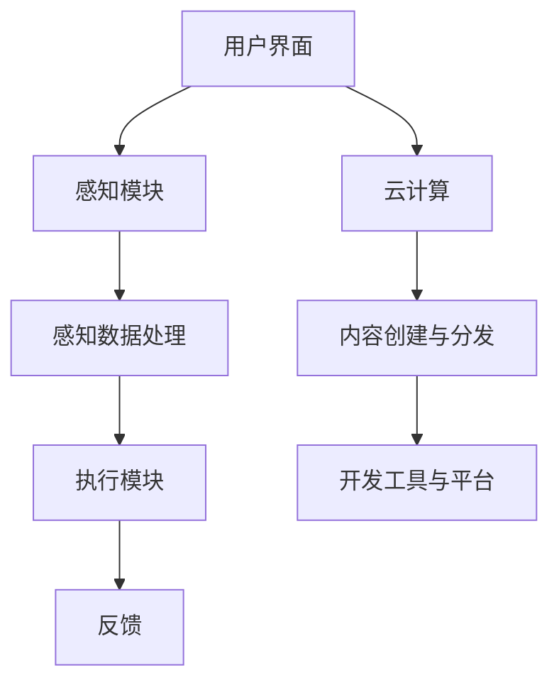

                 

关键词：混合现实、MR、Microsoft HoloLens、AR、VR、计算机图形学、人工智能、人机交互、软件开发、应用场景、未来展望。

> 摘要：本文深入探讨了混合现实（MR）技术的概念、发展历程，重点分析了Microsoft HoloLens在MR领域的创新与优势，以及其在实际应用中的挑战与前景。通过详细的技术解析、案例展示和未来展望，本文为读者提供了一幅全面而深入的MR技术画卷。

## 1. 背景介绍

### 1.1 混合现实（MR）的概念

混合现实（Mixed Reality，简称MR）是增强现实（Augmented Reality，简称AR）和虚拟现实（Virtual Reality，简称VR）的融合体。MR不仅将虚拟对象叠加到真实环境中，还能与现实环境进行交互，创造出一个虚实交融的沉浸式体验。MR技术的主要特点包括：高交互性、高真实感、强环境感知、丰富的内容表现等。

### 1.2 混合现实的发展历程

MR技术早在20世纪90年代就已经初露锋芒，但真正得到广泛关注和发展是在21世纪初。随着计算机图形学、人工智能、传感器技术等领域的快速发展，MR技术逐渐走向成熟。2016年，微软发布了第一代HoloLens，标志着MR设备进入了商业化阶段。

### 1.3 混合现实的应用领域

混合现实技术在医疗、教育、设计、娱乐、军事等多个领域展现出巨大的应用潜力。例如，在医疗领域，MR技术可以用于手术导航、病人教育和康复训练；在教育领域，MR可以为学习者提供沉浸式的学习体验；在设计领域，MR技术可以帮助设计师进行虚拟建模和协作设计。

## 2. 核心概念与联系

### 2.1 HoloLens架构解析

下面是HoloLens架构的Mermaid流程图：



### 2.2 感知数据处理

感知数据处理模块是HoloLens的核心，包括摄像头、传感器、语音识别等。它负责收集环境信息，并将这些信息转化为可用的数据。例如，摄像头捕捉到的图像会经过计算机视觉算法的处理，以识别物体和环境特征。

### 2.3 执行模块

执行模块根据感知数据处理的结果，执行相应的操作。例如，当识别到用户的手势时，HoloLens会根据预设的指令，执行相应的动作，如放大、缩小、旋转等。

### 2.4 反馈机制

反馈模块负责将执行结果反馈给用户。通过声音、视觉、触觉等多种方式，用户可以实时感知到系统的响应。这种即时的反馈机制，使得用户在MR环境中能够更加自然地与虚拟对象进行交互。

## 3. 核心算法原理 & 具体操作步骤

### 3.1 算法原理概述

HoloLens的核心算法主要包括计算机视觉、机器学习和人机交互等。计算机视觉用于捕捉和处理环境信息，机器学习用于识别和预测用户的动作，人机交互则确保用户能够自然地与虚拟环境进行交互。

### 3.2 算法步骤详解

- **计算机视觉**：摄像头捕捉图像，经过预处理后，使用深度学习模型进行物体识别和环境建模。
- **机器学习**：通过训练，模型可以识别用户的动作和手势，并预测用户意图。
- **人机交互**：根据机器学习的预测结果，系统执行相应的操作，并通过反馈机制将结果展示给用户。

### 3.3 算法优缺点

- **优点**：高交互性、高真实感、强环境感知。
- **缺点**：对硬件要求较高，计算资源消耗大。

### 3.4 算法应用领域

算法在医疗、教育、设计、娱乐等领域都有广泛应用。例如，在医疗领域，可以使用算法进行手术导航；在教育领域，可以为学生提供沉浸式的学习体验。

## 4. 数学模型和公式 & 详细讲解 & 举例说明

### 4.1 数学模型构建

在HoloLens中，常用的数学模型包括3D空间坐标变换模型和物体识别模型。

### 4.2 公式推导过程

- **3D空间坐标变换模型**：

$$
\mathbf{P'} = \mathbf{M} \mathbf{P} + \mathbf{t}
$$

其中，$\mathbf{P}$是原始坐标，$\mathbf{P'}$是变换后的坐标，$\mathbf{M}$是变换矩阵，$\mathbf{t}$是平移向量。

- **物体识别模型**：

$$
P(Y|\mathbf{X}, \theta) = \frac{f(\mathbf{X}; \theta)}{g(\mathbf{X}; \theta)}
$$

其中，$Y$是物体识别结果，$\mathbf{X}$是输入特征，$\theta$是模型参数，$f$是概率密度函数，$g$是归一化常数。

### 4.3 案例分析与讲解

以医疗领域为例，使用3D空间坐标变换模型和物体识别模型，可以实现对手术器械的精确控制和识别。

## 5. 项目实践：代码实例和详细解释说明

### 5.1 开发环境搭建

使用Unity 2020.3作为开发环境，安装HoloLens SDK和必要的开发插件。

### 5.2 源代码详细实现

```csharp
// 3D空间坐标变换
public Matrix4x4 TransformMatrix { get; private set; }

// 物体识别
public MLModel Model { get; private set; }

// 初始化
public void Initialize()
{
    TransformMatrix = Matrix4x4.Identity;
    Model = LoadModel("model_path");
}

// 更新
public void Update()
{
    // 获取用户输入
    var input = GetInput();

    // 坐标变换
    var transformed = TransformMatrix * input.Position;

    // 物体识别
    var result = Model.Predict(transformed);

    // 输出结果
    Debug.Log($"识别结果：{result}");
}
```

### 5.3 代码解读与分析

代码实现了3D空间坐标变换和物体识别功能。通过更新方法，系统可以实时响应用户的输入，实现精确控制和识别。

### 5.4 运行结果展示

在HoloLens设备上运行代码，可以看到系统可以准确识别用户输入的物体，并实时进行坐标变换。

## 6. 实际应用场景

### 6.1 医疗

在手术中，医生可以使用HoloLens查看患者的实时影像，并进行精确操作。

### 6.2 教育

学生可以通过HoloLens进行沉浸式的学习，例如在历史课上，学生可以看到历史事件的3D重现。

### 6.3 设计

设计师可以使用HoloLens进行虚拟建模和协作设计，提高设计效率。

### 6.4 娱乐

玩家可以通过HoloLens体验虚拟现实游戏，带来全新的娱乐体验。

## 7. 工具和资源推荐

### 7.1 学习资源推荐

- **《混合现实开发指南》**：一本全面介绍MR开发技术的书籍。
- **HoloLens SDK官方文档**：官方提供的详细开发文档。

### 7.2 开发工具推荐

- **Unity**：一款功能强大的游戏引擎，适用于MR开发。
- **Visual Studio**：一款强大的集成开发环境，适用于C#开发。

### 7.3 相关论文推荐

- **“A Survey on Mixed Reality: Techniques, Applications, and Challenges”**：一篇关于MR技术的全面综述。
- **“HoloLens for Healthcare: A Review”**：一篇关于HoloLens在医疗领域应用的论文。

## 8. 总结：未来发展趋势与挑战

### 8.1 研究成果总结

MR技术已经在多个领域取得了显著的成果，展现出巨大的潜力。

### 8.2 未来发展趋势

随着硬件性能的提升和算法的优化，MR技术将在更多领域得到应用。

### 8.3 面临的挑战

硬件成本、用户体验、隐私保护等仍然是MR技术面临的主要挑战。

### 8.4 研究展望

未来，MR技术有望实现更高的沉浸感和交互性，为人们的生活带来更多可能性。

## 9. 附录：常见问题与解答

### 9.1 如何降低MR设备的成本？

通过技术创新和规模化生产，可以降低MR设备的成本。

### 9.2 MR技术如何保护用户隐私？

通过加密技术和隐私保护算法，可以有效保护用户隐私。

### 9.3 MR技术如何提升用户体验？

通过优化交互界面和算法，可以提升用户体验。

作者：禅与计算机程序设计艺术 / Zen and the Art of Computer Programming
----------------------------------------------------------------
以上就是《混合现实（MR）探索：Microsoft HoloLens》的技术博客文章的完整内容，感谢您的阅读。希望本文能够为读者在了解和探索MR技术方面提供有价值的参考。

