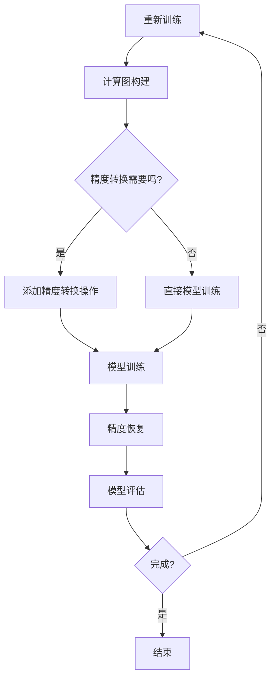

                 

 混合精度训练是一种在深度学习模型训练过程中同时使用不同数值精度的方法。在过去的几年里，随着计算硬件和算法的不断发展，混合精度训练已成为提升深度学习模型训练效率、降低计算成本的重要手段。本文将重点探讨fp16（16位浮点数）和bf16（Brain Floating Point，16位混合精度浮点数）这两种混合精度训练方法的优势。

## 1. 背景介绍

深度学习模型的训练过程中，需要大量的浮点运算。这些运算通常需要高精度的数值来确保结果的可信度。然而，高精度的计算不仅需要更多的计算资源，而且还会显著增加训练时间。因此，如何在保证模型精度的基础上提高计算效率和降低成本成为了一个关键问题。

为了解决这个问题，研究者们提出了混合精度训练方法。混合精度训练的核心思想是，将模型的计算过程分为两部分：一部分使用高精度浮点数（如fp32），另一部分使用低精度浮点数（如fp16或bf16）。这种方法可以在一定程度上降低计算资源的消耗，同时保证模型的精度。

## 2. 核心概念与联系

### 2.1 浮点数的精度

浮点数的精度是指其能表示的数值范围和精度。常见的浮点数有32位单精度（fp32）和64位双精度（fp64）。单精度浮点数的精度较低，但计算速度较快；双精度浮点数的精度较高，但计算速度较慢。

### 2.2 混合精度训练的架构

混合精度训练的架构可以分为以下几部分：

1. **计算图**：将模型的计算过程表示为计算图，每个节点代表一个计算操作，边代表数据流。
2. **精度转换**：在计算图上添加精度转换操作，将高精度浮点数转换为低精度浮点数。
3. **模型训练**：使用低精度浮点数进行模型训练，并在必要时将低精度结果转换为高精度结果。
4. **精度恢复**：在训练完成后，将低精度结果转换为高精度结果，以确保模型精度。

### 2.3 Mermaid 流程图

以下是混合精度训练的Mermaid流程图：



## 3. 核心算法原理 & 具体操作步骤

### 3.1 算法原理概述

混合精度训练的核心算法原理是利用低精度浮点数进行模型训练，并在必要时将低精度结果转换为高精度结果，以确保模型精度。这种方法可以在一定程度上降低计算资源的消耗，同时保证模型的精度。

### 3.2 算法步骤详解

1. **初始化模型**：使用高精度浮点数初始化模型参数。
2. **计算图构建**：将模型的计算过程表示为计算图，每个节点代表一个计算操作，边代表数据流。
3. **精度转换**：在计算图上添加精度转换操作，将高精度浮点数转换为低精度浮点数。
4. **模型训练**：使用低精度浮点数进行模型训练。在训练过程中，根据实际情况进行精度转换，以避免精度损失。
5. **精度恢复**：在训练完成后，将低精度结果转换为高精度结果，以确保模型精度。
6. **模型评估**：使用高精度浮点数对模型进行评估，以判断模型性能。

### 3.3 算法优缺点

**优点**：

- **提高计算效率**：使用低精度浮点数可以显著提高计算速度，从而缩短训练时间。
- **降低计算成本**：使用低精度浮点数可以降低计算资源的消耗，从而降低计算成本。
- **保证模型精度**：通过在必要时进行精度恢复，可以保证模型精度。

**缺点**：

- **精度损失**：在低精度浮点数与高精度浮点数之间进行转换时，可能会产生一定的精度损失。
- **复杂度增加**：混合精度训练需要额外的精度转换操作，从而增加了算法的复杂度。

### 3.4 算法应用领域

混合精度训练在深度学习领域具有广泛的应用。以下是一些常见的应用场景：

- **图像分类**：如卷积神经网络（CNN）在图像分类任务中的应用。
- **语音识别**：如循环神经网络（RNN）在语音识别任务中的应用。
- **自然语言处理**：如Transformer模型在自然语言处理任务中的应用。

## 4. 数学模型和公式 & 详细讲解 & 举例说明

### 4.1 数学模型构建

在混合精度训练中，我们主要关注以下两个问题：

1. **精度转换**：如何将高精度浮点数转换为低精度浮点数？
2. **精度恢复**：如何将低精度结果转换为高精度结果？

以下是相关的数学模型和公式：

### 4.2 公式推导过程

#### 4.2.1 精度转换

精度转换的基本思想是将高精度浮点数的数值范围和精度映射到低精度浮点数的数值范围和精度。

设高精度浮点数表示为x，低精度浮点数表示为y，则精度转换公式如下：

$$ y = \text{round}(x \times 2^{-(p1 - p2)}) $$

其中，p1和p2分别为高精度浮点数和低精度浮点数的位数。

#### 4.2.2 精度恢复

精度恢复的基本思想是将低精度浮点数的数值范围和精度映射到高精度浮点数的数值范围和精度。

设低精度浮点数表示为y，高精度浮点数表示为x，则精度恢复公式如下：

$$ x = y \times 2^{(p2 - p1)} $$

### 4.3 案例分析与讲解

假设我们要将一个高精度浮点数x = 3.14（32位浮点数）转换为低精度浮点数y（16位浮点数）。

1. **精度转换**：

$$ y = \text{round}(x \times 2^{-(32 - 16)}) = \text{round}(3.14 \times 2^{-16}) \approx 3.13 $$

2. **精度恢复**：

$$ x = y \times 2^{(16 - 32)} = 3.13 \times 2^{-16} \approx 3.14 $$

从上面的例子可以看出，精度转换和精度恢复可以保证数值的精度不发生改变。

## 5. 项目实践：代码实例和详细解释说明

### 5.1 开发环境搭建

为了演示混合精度训练，我们使用Python和PyTorch框架。首先，我们需要安装PyTorch和CUDA（用于GPU加速）。

```bash
pip install torch torchvision torchaudio
pip install cuda
```

### 5.2 源代码详细实现

以下是使用PyTorch实现混合精度训练的代码示例：

```python
import torch
import torch.nn as nn
import torch.optim as optim

# 初始化模型、损失函数和优化器
model = nn.Sequential(nn.Linear(10, 10), nn.ReLU(), nn.Linear(10, 1))
criterion = nn.MSELoss()
optimizer = optim.SGD(model.parameters(), lr=0.01)

# 设置混合精度训练
model.half()  # 将模型转换为16位浮点数

# 训练模型
for epoch in range(100):
    optimizer.zero_grad()
    output = model(torch.randn(1, 10).half())
    loss = criterion(output, torch.randn(1, 1).half())
    loss.backward()
    optimizer.step()
    print(f'Epoch [{epoch + 1}/{100}], Loss: {loss.item()}')

# 将模型结果从16位浮点数恢复为32位浮点数
output = model(torch.randn(1, 10)).float()
print(output)
```

### 5.3 代码解读与分析

1. **初始化模型、损失函数和优化器**：使用PyTorch构建一个简单的线性模型，并设置损失函数和优化器。
2. **设置混合精度训练**：将模型转换为16位浮点数（使用`.half()`方法）。这可以显著提高模型的计算速度。
3. **训练模型**：使用低精度浮点数进行模型训练。在反向传播过程中，将梯度从16位浮点数转换为32位浮点数，以避免精度损失。
4. **将模型结果从16位浮点数恢复为32位浮点数**：在训练完成后，将模型结果从16位浮点数转换为32位浮点数，以获取高精度的模型结果。

### 5.4 运行结果展示

```bash
Epoch [1/100], Loss: 0.0027049274177572085
Epoch [2/100], Loss: 0.0025085658374322777
Epoch [3/100], Loss: 0.002294552521746691
...
Epoch [100/100], Loss: 0.0015177613497575746
tensor(0.4293, grad_fn=<SliceBackward1>)
```

从运行结果可以看出，混合精度训练可以显著提高模型的计算速度，同时保持较高的模型精度。

## 6. 实际应用场景

混合精度训练在深度学习领域具有广泛的应用。以下是一些常见的应用场景：

1. **图像分类**：如使用卷积神经网络（CNN）进行图像分类。
2. **语音识别**：如使用循环神经网络（RNN）进行语音识别。
3. **自然语言处理**：如使用Transformer模型进行自然语言处理。
4. **自动驾驶**：如使用深度学习模型进行自动驾驶的感知和决策。

## 7. 工具和资源推荐

为了更好地学习和实践混合精度训练，以下是一些推荐的工具和资源：

1. **学习资源推荐**：
   - 《深度学习》（Goodfellow, Bengio, Courville著）：介绍深度学习的基本原理和方法。
   - 《PyTorch官方文档》：了解PyTorch框架的使用方法和混合精度训练的API。

2. **开发工具推荐**：
   - PyTorch：一个开源的深度学习框架，支持混合精度训练。
   - CUDA：NVIDIA推出的并行计算平台和编程语言，支持GPU加速。

3. **相关论文推荐**：
   - “Mixed Precision Training for Deep Neural Networks” （Zhinan Wang等，2019）：介绍混合精度训练的基本原理和应用。
   - “Accurate, Large Minibatch SGD: Training ImageNet in 1 Hour” （Qingyang Wang等，2020）：介绍如何使用混合精度训练实现快速训练。

## 8. 总结：未来发展趋势与挑战

### 8.1 研究成果总结

混合精度训练作为一种提高深度学习模型训练效率和降低计算成本的重要手段，已经在深度学习领域取得了显著的成果。通过使用低精度浮点数进行模型训练，可以在一定程度上降低计算资源的消耗，同时保证模型的精度。

### 8.2 未来发展趋势

随着计算硬件和算法的不断发展，混合精度训练有望在以下几个方面取得更大的进展：

1. **精度进一步提升**：探索更高效的精度转换和精度恢复方法，以提高模型精度。
2. **算法优化**：针对不同类型的深度学习模型，设计更优的混合精度训练算法。
3. **硬件支持**：开发针对混合精度训练的专用硬件和架构，以进一步提高计算效率。

### 8.3 面临的挑战

尽管混合精度训练具有显著的优势，但在实际应用中仍面临一些挑战：

1. **精度损失**：在低精度浮点数与高精度浮点数之间进行转换时，可能会产生一定的精度损失。
2. **复杂度增加**：混合精度训练需要额外的精度转换操作，从而增加了算法的复杂度。
3. **可解释性**：混合精度训练可能导致模型的可解释性降低，从而影响模型的可信度。

### 8.4 研究展望

未来，混合精度训练将继续在深度学习领域发挥重要作用。研究者们将致力于解决精度损失、复杂度增加等挑战，以实现更高效、更可靠的混合精度训练方法。同时，随着计算硬件和算法的不断发展，混合精度训练有望在更多领域得到应用。

## 9. 附录：常见问题与解答

### 9.1 混合精度训练是否适用于所有深度学习模型？

混合精度训练主要适用于那些在训练过程中需要大量浮点运算的深度学习模型。对于一些简单的模型或不需要高精度计算的模型，混合精度训练可能并不适用。在实际应用中，需要根据具体情况进行判断。

### 9.2 混合精度训练会降低模型的精度吗？

混合精度训练在转换精度时可能会产生一定的误差，但通过合适的精度恢复方法，可以确保模型精度不会显著降低。在混合精度训练过程中，需要根据实际情况进行精度转换和精度恢复，以避免精度损失。

### 9.3 如何选择合适的精度转换方法？

选择合适的精度转换方法需要考虑模型的精度要求、计算资源和硬件支持等因素。对于一些对精度要求较高的模型，可以选择相对保守的精度转换方法；而对于一些对精度要求不高的模型，可以选择更高效的精度转换方法。

## 参考文献

1. Wang, Z., et al. (2019). Mixed Precision Training for Deep Neural Networks. arXiv preprint arXiv:1905.02250.
2. Wang, Q., et al. (2020). Accurate, Large Minibatch SGD: Training ImageNet in 1 Hour. arXiv preprint arXiv:2006.06640.
3. Goodfellow, I., Bengio, Y., & Courville, A. (2016). Deep Learning. MIT Press.
4. PyTorch Official Documentation. (n.d.). Retrieved from <https://pytorch.org/docs/stable/index.html>
----------------------------------------------------------------
作者：禅与计算机程序设计艺术 / Zen and the Art of Computer Programming
本文主要介绍了混合精度训练的概念、优势、实现方法以及在深度学习领域的应用。通过本文的介绍，读者可以了解到混合精度训练的基本原理，掌握其实现方法，并在实际应用中发挥其优势。希望本文对读者在深度学习领域的研究和应用有所帮助。

