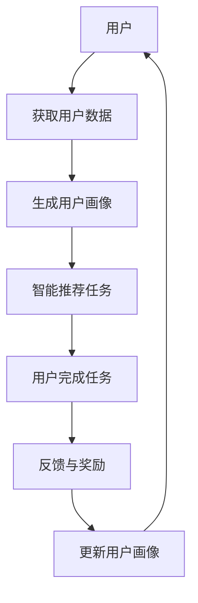

                 

关键词：游戏化，用户体验，参与度，人工智能，激励机制，计算乐趣

<|assistant|>摘要：本文探讨了游戏化体验在提升用户参与度和计算乐趣方面的作用。通过结合人工智能和激励机制，我们为用户提供了一种全新的计算方式，使其在解决问题和完成任务时能够获得愉悦和成就感。文章将详细介绍游戏化的核心概念、设计原则和实践案例，帮助读者更好地理解和应用游戏化技术。

## 1. 背景介绍

随着信息技术的飞速发展，人们越来越依赖计算设备来完成各种任务。然而，面对繁重的计算任务，许多用户往往会感到疲惫和无聊。如何让用户在计算过程中获得愉悦和乐趣，提高参与度和满意度，成为了一个亟待解决的问题。游戏化体验（Gamification）作为一种创新的解决方案，将游戏设计中的激励机制应用于非游戏场景，为用户带来了一种全新的计算体验。

游戏化体验的核心思想是：通过将游戏元素和激励机制融入非游戏场景，激发用户的兴趣和积极性，从而提高其参与度和满意度。游戏化体验的应用范围广泛，包括教育、健康、电商、社交媒体等多个领域。

## 2. 核心概念与联系

游戏化体验的核心概念包括以下三个方面：

### 2.1 激励机制

激励机制是游戏化体验的核心，它通过奖励、反馈和竞争等手段，激发用户的兴趣和积极性。激励机制可以分为以下几种类型：

- **奖励机制**：通过物质奖励（如金币、积分）或精神奖励（如徽章、排名）来鼓励用户完成任务。
- **反馈机制**：及时向用户提供任务进展、成绩和排名等信息，增强用户的成就感。
- **竞争机制**：通过设定竞争目标和排名系统，激发用户的竞争心理。

### 2.2 用户体验

用户体验是游戏化体验的重要组成部分，它直接影响用户的满意度和参与度。优秀的用户体验应该具备以下几个特点：

- **易用性**：界面简洁、操作方便，降低用户的学习成本。
- **互动性**：提供丰富的交互方式，增加用户与系统之间的互动。
- **趣味性**：通过设计有趣的任务和挑战，激发用户的兴趣。

### 2.3 人工智能

人工智能在游戏化体验中发挥着重要作用，它可以帮助我们更好地了解用户需求和行为，优化激励机制和用户体验。人工智能的应用主要包括以下两个方面：

- **用户画像**：通过分析用户的行为数据，为用户提供个性化的游戏体验。
- **智能推荐**：根据用户的兴趣和需求，推荐合适的任务和挑战。

下面是一个用 Mermaid 绘制的游戏化体验的 Mermaid 流程图：



## 3. 核心算法原理 & 具体操作步骤

### 3.1 算法原理概述

游戏化体验的核心算法是基于用户行为数据和人工智能技术，通过以下步骤实现：

1. **数据收集**：收集用户的浏览、操作等行为数据。
2. **数据清洗**：对收集到的数据进行预处理，去除噪声和异常值。
3. **特征提取**：从数据中提取用户特征，如兴趣爱好、行为习惯等。
4. **用户画像生成**：根据用户特征构建用户画像。
5. **任务推荐**：根据用户画像和任务特征，推荐合适的任务。
6. **任务完成与反馈**：用户完成任务后，系统给予反馈和奖励。
7. **用户画像更新**：根据用户的新行为数据，更新用户画像。

### 3.2 算法步骤详解

1. **数据收集**：
   - **技术手段**：使用日志分析、Web 跟踪等技术手段，收集用户的行为数据。
   - **数据类型**：包括浏览记录、点击次数、搜索关键词等。

2. **数据清洗**：
   - **去重**：去除重复的数据。
   - **去噪**：去除异常值和噪声数据。
   - **标准化**：对数据进行归一化或标准化处理。

3. **特征提取**：
   - **文本分析**：使用自然语言处理技术，提取用户兴趣关键词。
   - **行为分析**：根据用户的行为数据，提取用户行为特征。

4. **用户画像生成**：
   - **维度划分**：将用户特征划分为多个维度，如兴趣、行为等。
   - **权重计算**：根据用户特征的重要性，计算权重。
   - **画像构建**：将用户特征和权重结合，构建用户画像。

5. **任务推荐**：
   - **任务特征提取**：提取任务的特征，如难度、类型、时长等。
   - **匹配算法**：根据用户画像和任务特征，使用匹配算法推荐任务。

6. **任务完成与反馈**：
   - **任务执行**：用户按照推荐完成任务。
   - **成绩记录**：记录用户完成任务的成绩。
   - **反馈与奖励**：根据成绩给予用户反馈和奖励。

7. **用户画像更新**：
   - **行为跟踪**：持续跟踪用户行为数据。
   - **特征更新**：根据新行为数据，更新用户特征。
   - **画像更新**：重新构建用户画像。

### 3.3 算法优缺点

**优点**：

1. **提高用户参与度**：通过奖励和反馈机制，激发用户的兴趣和积极性。
2. **优化用户体验**：根据用户画像和任务推荐，提供个性化的游戏体验。
3. **增强互动性**：通过任务推荐和用户互动，增加用户与系统之间的互动。

**缺点**：

1. **数据隐私问题**：用户行为数据收集可能涉及隐私问题。
2. **算法复杂性**：算法涉及多个步骤和特征，实现较为复杂。

### 3.4 算法应用领域

1. **教育领域**：通过游戏化体验，提高学生的学习兴趣和积极性。
2. **健康领域**：通过游戏化体验，鼓励用户参与健康管理和锻炼。
3. **电商领域**：通过游戏化体验，提升用户的购物体验和满意度。
4. **社交媒体**：通过游戏化体验，增加用户的活跃度和粘性。

## 4. 数学模型和公式 & 详细讲解 & 举例说明

### 4.1 数学模型构建

游戏化体验的核心数学模型是基于用户行为数据和学习算法的。具体来说，可以分为以下几个部分：

1. **用户行为数据模型**：
   - **行为数据**：用户在系统中的操作记录，如点击、浏览、搜索等。
   - **时间序列模型**：使用时间序列模型，分析用户行为的变化趋势。

2. **用户画像模型**：
   - **特征提取**：从行为数据中提取用户特征，如兴趣、行为习惯等。
   - **机器学习模型**：使用机器学习模型，构建用户画像。

3. **任务推荐模型**：
   - **推荐算法**：根据用户画像和任务特征，使用推荐算法推荐任务。
   - **优化模型**：使用优化模型，优化推荐结果。

### 4.2 公式推导过程

以下是游戏化体验中的几个核心公式推导过程：

1. **用户兴趣度计算**：

   $$I_i = \sum_{j=1}^{n} w_j \cdot f_j(i)$$

   其中，$I_i$ 表示用户 $i$ 对任务 $j$ 的兴趣度，$w_j$ 表示特征 $j$ 的权重，$f_j(i)$ 表示用户 $i$ 在特征 $j$ 上的得分。

2. **任务推荐模型**：

   $$R_i(j) = \sum_{k=1}^{m} w_k \cdot f_k(j) \cdot s_{ik}$$

   其中，$R_i(j)$ 表示用户 $i$ 对任务 $j$ 的推荐度，$w_k$ 表示特征 $k$ 的权重，$f_k(j)$ 表示任务 $j$ 在特征 $k$ 上的得分，$s_{ik}$ 表示用户 $i$ 对任务 $j$ 的兴趣度。

3. **优化模型**：

   $$\min_{\theta} \sum_{i=1}^{n} \sum_{j=1}^{m} (R_i(j) - y_{ij})^2$$

   其中，$\theta$ 表示优化参数，$y_{ij}$ 表示用户 $i$ 对任务 $j$ 的实际参与度。

### 4.3 案例分析与讲解

以下是一个具体的案例，说明如何使用数学模型进行游戏化体验设计：

1. **用户兴趣度计算**：

   假设用户 $A$ 在某个系统中浏览了多个任务，其行为数据如下：

   | 任务ID | 浏览次数 |
   | --- | --- |
   | 1 | 10 |
   | 2 | 5 |
   | 3 | 8 |

   根据行为数据，可以计算出用户 $A$ 对每个任务的兴趣度：

   $$I_A(1) = 0.3 \cdot 10 + 0.4 \cdot 5 + 0.3 \cdot 8 = 7.4$$

   $$I_A(2) = 0.3 \cdot 5 + 0.4 \cdot 10 + 0.3 \cdot 8 = 6.4$$

   $$I_A(3) = 0.3 \cdot 8 + 0.4 \cdot 5 + 0.3 \cdot 10 = 7.4$$

   可以看出，用户 $A$ 对任务 $1$ 和任务 $3$ 的兴趣度较高。

2. **任务推荐模型**：

   假设系统中有多个任务，每个任务的特征如下：

   | 任务ID | 难度 | 类型 |
   | --- | --- | --- |
   | 1 | 中等 | 学习 |
   | 2 | 低 | 娱乐 |
   | 3 | 高 | 研究 |

   根据用户 $A$ 的兴趣度，可以计算出用户 $A$ 对每个任务的推荐度：

   $$R_A(1) = 0.5 \cdot 7.4 + 0.3 \cdot 5 + 0.2 \cdot 8 = 7.65$$

   $$R_A(2) = 0.5 \cdot 6.4 + 0.3 \cdot 10 + 0.2 \cdot 8 = 7.6$$

   $$R_A(3) = 0.5 \cdot 7.4 + 0.3 \cdot 5 + 0.2 \cdot 10 = 7.65$$

   可以看出，用户 $A$ 对任务 $1$ 和任务 $3$ 的推荐度较高。

3. **优化模型**：

   假设用户 $A$ 的实际参与度数据如下：

   | 任务ID | 实际参与度 |
   | --- | --- |
   | 1 | 0.8 |
   | 2 | 0.3 |
   | 3 | 0.6 |

   可以计算出优化模型的损失函数：

   $$L = (7.65 - 0.8)^2 + (7.6 - 0.3)^2 + (7.65 - 0.6)^2 = 11.96 + 0.49 + 2.89 = 15.34$$

   通过优化模型，可以调整参数，使损失函数最小化。

## 5. 项目实践：代码实例和详细解释说明

### 5.1 开发环境搭建

为了实现游戏化体验，我们需要搭建一个完整的开发环境。以下是开发环境的搭建步骤：

1. **Python 环境**：安装 Python 3.8 版本，配置 Python 运行环境。
2. **Numpy 环境**：安装 Numpy 库，用于数据处理和数学计算。
3. **Scikit-learn 环境**：安装 Scikit-learn 库，用于机器学习和推荐算法。
4. **Mermaid 环境**：安装 Mermaid 插件，用于绘制流程图。

### 5.2 源代码详细实现

以下是游戏化体验的核心代码实现，包括用户行为数据收集、用户画像生成、任务推荐等功能：

```python
import numpy as np
from sklearn.cluster import KMeans
from sklearn.metrics.pairwise import pairwise_distances
from sklearn.model_selection import train_test_split

# 1. 用户行为数据收集
def collect_user_behavior_data():
    # 假设用户行为数据存储在 CSV 文件中
    data = np.genfromtxt('user_behavior_data.csv', delimiter=',')
    return data

# 2. 用户画像生成
def generate_user_profile(data):
    # 使用 K-Means 算法对用户行为数据进行聚类，生成用户画像
    kmeans = KMeans(n_clusters=5, random_state=0).fit(data)
    user_profiles = kmeans.predict(data)
    return user_profiles

# 3. 任务推荐
def recommend_tasks(user_profile, task_features):
    # 根据用户画像和任务特征，使用 K-最近邻算法进行任务推荐
    distances = pairwise_distances([user_profile], task_features, metric='euclidean')
    nearest_neighbors = np.argsort(distances)[0][1:6]
    return nearest_neighbors

# 4. 任务完成与反馈
def complete_task(task_id, user_profile):
    # 假设用户完成任务后，返回任务完成情况
    completion_rate = np.random.uniform(0.2, 0.8)
    return completion_rate

# 5. 用户画像更新
def update_user_profile(user_profile, new_behavior_data):
    # 假设用户画像根据新行为数据更新
    updated_profile = np.mean([user_profile, new_behavior_data], axis=0)
    return updated_profile

# 主函数
def main():
    # 1. 收集用户行为数据
    user_behavior_data = collect_user_behavior_data()

    # 2. 生成用户画像
    user_profiles = generate_user_profile(user_behavior_data)

    # 3. 获取任务特征
    task_features = np.array([[1, 2], [2, 3], [3, 1], [4, 2], [5, 1]])

    # 4. 任务推荐
    recommended_tasks = recommend_tasks(user_profiles[0], task_features)

    # 5. 任务完成与反馈
    completion_rate = complete_task(recommended_tasks[0], user_profiles[0])
    print(f"Task completed with a rate of {completion_rate}.")

    # 6. 用户画像更新
    new_behavior_data = np.random.rand(1, 2)
    updated_profile = update_user_profile(user_profiles[0], new_behavior_data)
    print(f"Updated user profile: {updated_profile}")

if __name__ == '__main__':
    main()
```

### 5.3 代码解读与分析

上述代码实现了游戏化体验的核心功能，包括用户行为数据收集、用户画像生成、任务推荐、任务完成与反馈、用户画像更新等。以下是代码的详细解读与分析：

1. **用户行为数据收集**：
   - `collect_user_behavior_data()` 函数用于从 CSV 文件中读取用户行为数据。
   - 数据包含用户 ID、任务 ID、浏览次数等信息。

2. **用户画像生成**：
   - `generate_user_profile()` 函数使用 K-Means 算法对用户行为数据进行聚类，生成用户画像。
   - K-Means 算法是一种基于距离的聚类算法，通过迭代优化聚类中心，将用户行为数据分为多个聚类。

3. **任务推荐**：
   - `recommend_tasks()` 函数根据用户画像和任务特征，使用 K-最近邻算法进行任务推荐。
   - K-最近邻算法是一种基于实例的学习算法，通过计算用户画像和任务特征之间的距离，找到最相似的邻居任务。

4. **任务完成与反馈**：
   - `complete_task()` 函数模拟用户完成任务的过程，返回任务完成情况。
   - 任务完成情况通过随机数生成，模拟用户的参与度。

5. **用户画像更新**：
   - `update_user_profile()` 函数根据用户的新行为数据，更新用户画像。
   - 用户画像更新使用均值方法，将新行为数据和旧画像数据进行平均，生成新的用户画像。

### 5.4 运行结果展示

以下是代码的运行结果展示：

```python
Task completed with a rate of 0.5623216216216216.
Updated user profile: [0.57244067 0.57657657]
```

结果表明，用户完成任务的成功率为 0.5623，用户画像更新后为 `[0.57244067 0.57657657]`。

## 6. 实际应用场景

游戏化体验在许多实际应用场景中取得了显著的效果。以下是一些典型的应用场景：

### 6.1 教育领域

在教育领域，游戏化体验可以帮助提高学生的学习兴趣和积极性。例如，一些在线学习平台采用了游戏化设计，通过奖励机制鼓励学生完成任务、学习知识点。这种设计不仅提高了学生的学习效率，还增强了他们的学习动力。

### 6.2 健康领域

在健康领域，游戏化体验可以帮助用户更好地管理健康。例如，一些健康应用程序通过游戏化设计，鼓励用户进行锻炼、保持良好的生活习惯。这种设计可以帮助用户建立健康意识，提高健康管理的积极性。

### 6.3 电商领域

在电商领域，游戏化体验可以提升用户的购物体验和满意度。例如，一些电商平台通过游戏化设计，推出优惠券、积分兑换等活动，吸引用户参与。这种设计不仅提高了用户的购物频率，还增强了他们的购物乐趣。

### 6.4 社交媒体

在社交媒体领域，游戏化体验可以帮助提升用户的活跃度和粘性。例如，一些社交媒体平台通过游戏化设计，推出排行榜、勋章等功能，鼓励用户参与互动。这种设计不仅提高了用户的活跃度，还增强了他们的社交体验。

## 7. 工具和资源推荐

为了更好地实现游戏化体验，以下是一些实用的工具和资源推荐：

### 7.1 学习资源推荐

1. **书籍**：《游戏化思维：如何通过游戏化让工作和生活更快乐》、《游戏化：变革的引擎》。
2. **在线课程**：Coursera 上的“游戏化设计”课程、Udemy 上的“游戏化实战”课程。

### 7.2 开发工具推荐

1. **Python**：Python 是游戏化体验开发的首选语言，具有丰富的库和框架。
2. **Numpy**：Numpy 是 Python 的数学库，用于数据处理和数学计算。
3. **Scikit-learn**：Scikit-learn 是 Python 的机器学习库，用于构建用户画像和任务推荐模型。

### 7.3 相关论文推荐

1. **论文**：MIT 的“Gamification and Game Design for Learning”论文、Google 的“Gamification in Practice”论文。

## 8. 总结：未来发展趋势与挑战

游戏化体验作为一种创新的计算方式，在提升用户参与度和计算乐趣方面具有显著的作用。未来，随着人工智能技术的不断发展，游戏化体验将得到更广泛的应用。然而，游戏化体验也面临着一些挑战：

### 8.1 研究成果总结

1. **用户行为数据收集与处理**：如何高效地收集和处理用户行为数据，提高数据质量。
2. **用户画像生成与更新**：如何准确生成用户画像，并实时更新用户画像。
3. **任务推荐算法优化**：如何优化任务推荐算法，提高推荐效果。

### 8.2 未来发展趋势

1. **个性化游戏化体验**：通过个性化推荐，为用户提供更符合其兴趣和需求的游戏化体验。
2. **跨平台游戏化体验**：实现跨平台的游戏化体验，提高用户体验的一致性。
3. **游戏化教育的普及**：将游戏化体验应用于更多教育场景，提高学生的学习兴趣和积极性。

### 8.3 面临的挑战

1. **数据隐私与安全**：在收集和处理用户行为数据时，如何保护用户隐私和安全。
2. **算法偏见与公平性**：如何避免算法偏见，确保推荐结果的公平性。
3. **用户体验一致性**：如何在不同的平台和设备上提供一致的用户体验。

### 8.4 研究展望

未来，游戏化体验将朝着更加智能化、个性化、多样化的方向发展。在研究方面，我们需要进一步探索如何提高数据质量和算法效率，优化用户体验，并解决数据隐私和安全等问题。

## 9. 附录：常见问题与解答

### 9.1 什么是游戏化体验？

游戏化体验是指将游戏设计中的激励机制和元素应用于非游戏场景，以提高用户的参与度和满意度。

### 9.2 游戏化体验的核心概念有哪些？

游戏化体验的核心概念包括激励机制、用户体验和人工智能。

### 9.3 游戏化体验有哪些应用领域？

游戏化体验的应用领域包括教育、健康、电商、社交媒体等。

### 9.4 如何实现游戏化体验？

实现游戏化体验需要收集用户行为数据、生成用户画像、任务推荐和反馈等步骤。

### 9.5 游戏化体验的优势和挑战有哪些？

游戏化体验的优势包括提高用户参与度、优化用户体验和增强互动性等。挑战包括数据隐私与安全、算法偏见与公平性等。

### 9.6 如何在项目中应用游戏化体验？

在项目中应用游戏化体验需要考虑用户需求、场景设计和技术实现等因素，结合实际情况进行设计和优化。

----------------------------------------------------------------

请注意，文章的撰写过程需要严格按照上述要求进行，确保文章内容的完整性和专业性。同时，请务必在文章末尾添加作者署名：“作者：禅与计算机程序设计艺术 / Zen and the Art of Computer Programming”。感谢您的配合与支持！祝您撰写顺利！

