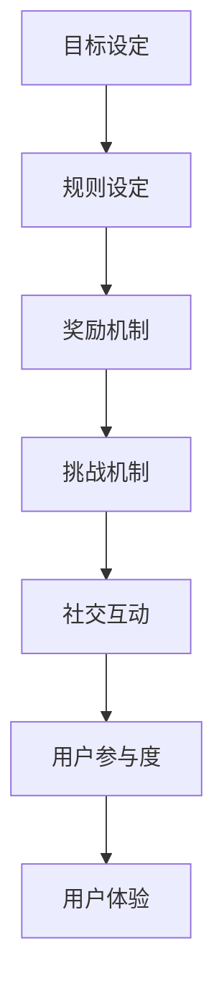

                 

关键词：游戏化，用户体验，人类计算，激励系统，设计原理

> 摘要：随着科技的发展，人类与计算机的交互变得越来越频繁，如何提升这种交互的体验成为了研究者们关注的焦点。本文将探讨游戏化作为一种提升人类计算体验的方法，通过引入游戏化的设计原则，探讨其核心概念、实施步骤及其在各个领域的应用，以期为广大开发者和设计师提供有价值的参考。

## 1. 背景介绍

在当今信息时代，计算机已经成为我们日常生活中不可或缺的工具。从办公到娱乐，从教育到社交，计算机的应用已经深入到了我们生活的方方面面。然而，尽管计算机的功能日益强大，但很多人在操作计算机时仍然感到乏味和疲惫。这种用户体验的问题，直接影响了计算机在各个领域的应用效果。

游戏化（Gamification）是一种通过引入游戏设计元素来增强非游戏体验的方法。它不仅适用于游戏领域，也可以应用于教育、健康、市场营销等多个领域。游戏化的核心在于利用游戏中的激励机制、挑战机制和社交机制来提高用户的参与度和满意度，从而提升用户体验。

本文将围绕游戏化的核心概念、实施步骤及其在各个领域的应用进行深入探讨，旨在为开发者、设计师以及相关从业人员提供一种新的思路和方法，以提升人类计算体验。

## 2. 核心概念与联系

### 2.1 游戏化的定义

游戏化（Gamification）是一种将游戏设计元素应用于非游戏情境中的方法。这些元素包括但不限于：

- **目标设定（Goals）**：明确用户需要达成的目标。
- **规则设定（Rules）**：制定游戏规则，确保游戏公平、透明。
- **奖励机制（Rewards）**：提供奖励，以激励用户积极参与。
- **挑战机制（Challenges）**：设置挑战，提高用户的成就感。
- **社交互动（Social Interaction）**：鼓励用户之间的互动和协作。

### 2.2 游戏化的原理与架构

游戏化的原理可以概括为以下几点：

1. **激励理论**：通过奖励机制来激发用户的内在动机。
2. **行为心理学**：利用行为心理学原理，设计能够引导用户行为的机制。
3. **系统动力学**：通过反馈和迭代，持续优化用户体验。

游戏化的架构可以分为以下几个层次：

1. **目标层**：明确用户需要达成的目标。
2. **规则层**：制定游戏规则，确保游戏公平、透明。
3. **机制层**：设计奖励机制、挑战机制和社交互动机制。
4. **反馈层**：提供实时反馈，帮助用户了解自己的进度和成就。

### 2.3 游戏化与用户参与度的关系

游戏化通过引入游戏设计元素，能够有效提高用户的参与度。具体来说：

- **目标设定**：明确的目标能够激发用户的动机，提高参与度。
- **规则设定**：明确的规则能够增加用户对系统的信任度，提高参与度。
- **奖励机制**：奖励能够提供即时反馈，增强用户的成就感和持续参与的动力。
- **挑战机制**：适当的挑战能够提高用户的兴趣和参与度。
- **社交互动**：社交互动能够增加用户的归属感和持续参与的动力。

### 2.4 游戏化与用户体验的关系

游戏化不仅能够提高用户的参与度，还能够提升用户体验。具体来说：

- **可视化**：游戏化设计中的可视化元素能够提高用户的操作便利性。
- **互动性**：游戏化设计中的互动性能够增强用户的参与感。
- **成就感**：游戏化设计中的成就感和奖励机制能够增强用户的满意度。
- **学习效果**：游戏化设计中的挑战和奖励机制能够提高用户的学习效果。

### 2.5 游戏化的 Mermaid 流程图



## 3. 核心算法原理 & 具体操作步骤

### 3.1 算法原理概述

游戏化的核心算法原理可以概括为以下几点：

1. **目标导向**：通过设定明确的目标，引导用户行为。
2. **规则驱动**：通过制定规则，确保游戏化过程的公平、透明。
3. **激励机制**：通过奖励机制，激励用户积极参与。
4. **挑战设计**：通过设置挑战，提高用户的兴趣和成就感。
5. **社交互动**：通过社交互动，增强用户的归属感和持续参与的动力。

### 3.2 算法步骤详解

1. **目标设定**：明确用户需要达成的目标。目标应具有挑战性，但不应过于困难，以避免用户产生挫败感。

2. **规则设定**：制定游戏规则，确保游戏化过程的公平、透明。规则应简洁明了，便于用户理解和遵守。

3. **奖励机制设计**：设计奖励机制，以激励用户积极参与。奖励可以包括虚拟货币、积分、徽章等。

4. **挑战设计**：设置适当的挑战，以提高用户的兴趣和成就感。挑战应具有递进性，以保持用户的持续兴趣。

5. **社交互动机制设计**：设计社交互动机制，鼓励用户之间的互动和协作。社交互动可以包括排行榜、社交网络等。

6. **反馈机制设计**：提供实时反馈，帮助用户了解自己的进度和成就。反馈可以包括进度条、成就图标等。

7. **迭代优化**：根据用户的反馈和参与数据，持续优化游戏化设计，以提高用户体验。

### 3.3 算法优缺点

**优点**：

- 提高用户参与度：通过引入游戏设计元素，提高用户的参与度和满意度。
- 提升用户体验：通过优化用户交互流程，提升用户体验。
- 激发用户创造力：通过设置挑战和奖励机制，激发用户的创造力和想象力。

**缺点**：

- 需要大量设计工作：游戏化设计需要充分考虑用户需求，进行大量的设计和优化工作。
- 可能引发过度依赖：过度游戏化可能导致用户对系统的过度依赖，影响正常工作生活。

### 3.4 算法应用领域

游戏化算法可以应用于多个领域，包括但不限于：

- **教育领域**：通过游戏化设计，提高学生的学习兴趣和学习效果。
- **健康领域**：通过游戏化设计，激励用户保持健康习惯，提高健康水平。
- **营销领域**：通过游戏化设计，提高用户的品牌忠诚度和参与度。
- **企业管理**：通过游戏化设计，提高员工的工作积极性和工作效率。

## 4. 数学模型和公式 & 详细讲解 & 举例说明

### 4.1 数学模型构建

游戏化中的数学模型主要包括以下几种：

1. **期望效用模型**：用于计算用户在游戏化过程中的期望效用。
2. **博弈论模型**：用于分析用户在游戏化过程中的策略行为。
3. **马尔可夫决策过程**：用于优化游戏化设计，以提高用户的参与度和满意度。

### 4.2 公式推导过程

以期望效用模型为例，其公式推导过程如下：

\[ EU = U(W) - c(P) \]

其中：

- \( EU \)：期望效用
- \( U(W) \)：用户在游戏化过程中的总效用
- \( c(P) \)：用户为达到目标所需的成本

### 4.3 案例分析与讲解

以下是一个关于游戏化在教育领域的案例分析：

**案例背景**：某在线教育平台希望通过游戏化设计提高学生的学习兴趣和学习效果。

**解决方案**：

1. **目标设定**：设定明确的学习目标，如掌握某一知识点、完成某一任务等。
2. **规则设定**：制定简洁明了的学习规则，如学习时间要求、作业提交要求等。
3. **奖励机制设计**：设计积分奖励机制，如学习时长奖励、作业优秀奖励等。
4. **挑战设计**：设置难度递增的学习任务，以激发学生的兴趣和成就感。
5. **社交互动机制设计**：引入班级排行榜、学习小组等社交互动机制，增强学生的归属感和持续学习动力。
6. **反馈机制设计**：提供实时学习进度和成就反馈，帮助学生了解自己的学习情况和进步。

**效果评估**：

- **学习兴趣**：通过数据统计，发现学生参与学习的积极性明显提高。
- **学习效果**：通过考试和作业成绩的对比，发现学生的学习效果有所提升。
- **用户满意度**：通过用户调查，发现用户对平台的学习体验满意度较高。

## 5. 项目实践：代码实例和详细解释说明

### 5.1 开发环境搭建

1. **环境要求**：Windows/Linux/Mac 操作系统，Python 3.8 以上版本。
2. **安装依赖**：使用 pip 工具安装 Flask 框架、PyMySQL 驱动和其他相关库。

### 5.2 源代码详细实现

以下是一个简单的游戏化学习平台实现示例：

```python
from flask import Flask, render_template, request, redirect, url_for

app = Flask(__name__)

# 数据库连接
import pymysql
conn = pymysql.connect(
    host='localhost',
    user='root',
    password='password',
    database='game_learning'
)

@app.route('/')
def index():
    return render_template('index.html')

@app.route('/learn', methods=['GET', 'POST'])
def learn():
    if request.method == 'POST':
        # 处理学习请求
        user = request.form['user']
        knowledge = request.form['knowledge']
        # 将数据存储到数据库
        with conn.cursor() as cursor:
            cursor.execute("INSERT INTO learning (user, knowledge) VALUES (%s, %s)", (user, knowledge))
            conn.commit()
        return redirect(url_for('result'))
    return render_template('learn.html')

@app.route('/result')
def result():
    # 查询学习结果
    with conn.cursor() as cursor:
        cursor.execute("SELECT * FROM learning")
        results = cursor.fetchall()
    return render_template('result.html', results=results)

if __name__ == '__main__':
    app.run(debug=True)
```

### 5.3 代码解读与分析

- **数据库连接**：使用 pymysql 库连接数据库，执行 SQL 查询和插入操作。
- **路由配置**：定义两个路由，一个用于显示学习页面，另一个用于处理学习请求并显示学习结果。
- **前端模板**：使用 Flask 的模板渲染功能，实现前端页面展示。

### 5.4 运行结果展示

运行程序后，用户可以通过浏览器访问学习页面，填写用户名和知识点后提交学习请求。程序会将数据存储到数据库中，并在结果页面显示所有学习记录。

## 6. 实际应用场景

游戏化设计在多个领域都有着广泛的应用，以下是一些实际应用场景：

### 6.1 教育领域

游戏化设计可以应用于在线教育平台，通过设置学习目标、奖励机制和挑战任务，提高学生的学习兴趣和学习效果。例如，通过排行榜和勋章系统，激发学生的竞争意识和成就感。

### 6.2 健康领域

游戏化设计可以应用于健康管理应用，通过设置健康目标、奖励机制和挑战任务，激励用户保持健康习惯。例如，通过步数挑战、健康知识问答等，提高用户的健康意识和参与度。

### 6.3 营销领域

游戏化设计可以应用于市场营销活动，通过设置活动目标、奖励机制和挑战任务，提高用户的参与度和品牌忠诚度。例如，通过抽奖活动、答题竞赛等，增加用户的互动体验。

### 6.4 企业管理

游戏化设计可以应用于企业管理系统，通过设置工作目标、奖励机制和挑战任务，提高员工的工作积极性和工作效率。例如，通过任务排行榜、勋章系统等，激发员工的竞争意识和团队合作精神。

### 6.5 社交网络

游戏化设计可以应用于社交网络平台，通过设置社交目标、奖励机制和挑战任务，增强用户的互动体验和平台粘性。例如，通过点赞排行榜、好友挑战等，提高用户的参与度和活跃度。

## 7. 工具和资源推荐

### 7.1 学习资源推荐

1. **《游戏化设计实践》**：本书详细介绍了游戏化设计的基本原理和实践方法，适合游戏化设计初学者。
2. **《用户体验要素》**：本书从用户角度出发，探讨了如何设计优质的产品体验，对游戏化设计有很好的参考价值。

### 7.2 开发工具推荐

1. **Flask**：Python 的轻量级 Web 框架，适合快速搭建游戏化平台。
2. **React**：JavaScript 的前端库，适合构建动态和用户友好的前端界面。

### 7.3 相关论文推荐

1. **"Gamification in Education: A Systematic Review"**：该论文系统总结了游戏化在教育领域的应用和研究现状。
2. **"The Elements of Gamification"**：该论文详细阐述了游戏化设计的核心元素和实施方法。

## 8. 总结：未来发展趋势与挑战

### 8.1 研究成果总结

游戏化设计作为一种提升用户体验的方法，已经在多个领域取得了显著的成果。通过引入游戏设计元素，游戏化设计能够有效提高用户的参与度和满意度，从而提升产品和服务质量。

### 8.2 未来发展趋势

随着科技的不断进步和人们对高质量用户体验的日益重视，游戏化设计在未来有望在更多领域得到应用。特别是随着人工智能、大数据等技术的发展，游戏化设计将更加智能化、个性化，为用户提供更优质的体验。

### 8.3 面临的挑战

尽管游戏化设计具有巨大的潜力，但在实际应用中仍然面临着一些挑战：

1. **设计复杂度**：游戏化设计需要充分考虑用户需求，进行大量的设计和优化工作，具有较高的设计复杂度。
2. **用户依赖性**：过度游戏化可能导致用户对系统的过度依赖，影响正常的工作和生活。
3. **数据隐私**：游戏化设计通常涉及大量的用户数据，如何确保用户数据的安全和隐私是一个重要问题。

### 8.4 研究展望

未来的研究可以从以下几个方面展开：

1. **智能游戏化设计**：利用人工智能技术，实现游戏化设计的自动化和个性化。
2. **游戏化伦理**：研究游戏化设计中的伦理问题，确保游戏化设计的公正性和公平性。
3. **跨领域应用**：探索游戏化设计在其他领域的应用，如医疗、金融等。

## 9. 附录：常见问题与解答

### 9.1 什么是游戏化？

游戏化是一种通过引入游戏设计元素（如目标、规则、奖励等）来增强非游戏体验的方法。它不仅适用于游戏领域，还可以应用于教育、健康、市场营销等多个领域。

### 9.2 游戏化设计的核心原则是什么？

游戏化设计的核心原则包括目标导向、规则驱动、激励机制、挑战设计和社交互动。这些原则有助于提高用户的参与度和满意度，从而提升用户体验。

### 9.3 游戏化设计在哪些领域有应用？

游戏化设计在多个领域都有应用，包括教育、健康、市场营销、企业管理等。例如，在线教育平台可以通过游戏化设计提高学生的学习兴趣和学习效果，健康管理应用可以通过游戏化设计激励用户保持健康习惯。

### 9.4 如何确保游戏化设计的有效性？

确保游戏化设计有效性的关键在于深入理解用户需求，进行大量的设计和优化工作，并进行持续的迭代和优化。此外，还需要充分考虑游戏化设计的伦理问题，确保游戏化设计的公正性和公平性。

### 9.5 游戏化设计与用户体验的关系是什么？

游戏化设计通过引入游戏设计元素，能够有效提高用户的参与度和满意度，从而提升用户体验。具体来说，游戏化设计可以提高用户操作的便利性、增强用户的成就感、提高用户的学习效果等。

### 9.6 游戏化设计有哪些缺点？

游戏化设计的缺点主要包括设计复杂度较高、可能导致用户对系统的过度依赖、数据隐私问题等。如何平衡游戏化设计的优点和缺点，确保游戏化设计的有效性，是一个重要问题。

----------------------------------------------------------------

作者：禅与计算机程序设计艺术 / Zen and the Art of Computer Programming

