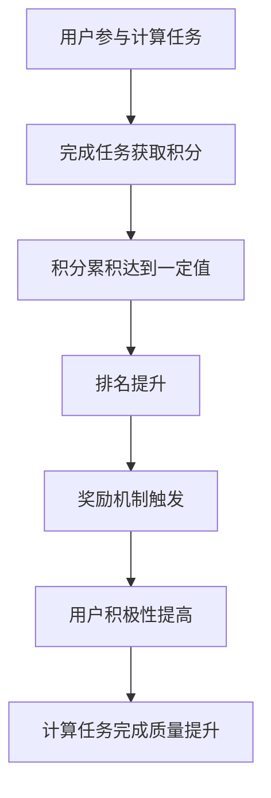

                 

关键词：游戏化、计算、趣味性、动机、用户体验、技术实现、应用场景

> 摘要：本文探讨了游戏化参与在提升人类计算趣味性方面的作用。通过引入游戏化的元素，例如积分、排名、奖励机制等，可以激发用户参与计算任务的积极性，提高计算效率。文章首先介绍了游戏化参与的核心概念，然后分析了其在计算领域的应用，最后探讨了未来发展趋势与面临的挑战。

## 1. 背景介绍

在当今信息时代，计算已成为社会发展的核心驱动力。然而，随着计算任务变得越来越复杂，人们对于计算的参与和兴趣也在逐渐降低。传统的计算任务往往具有单调、繁琐、缺乏互动性等特点，这导致用户在参与计算时缺乏动机和动力。为了激发用户参与计算的积极性，提升计算任务的趣味性，游戏化参与成为了一种有效的手段。

游戏化（Gamification）是指将游戏设计中的元素和机制应用于非游戏情境中，以激发用户参与、提升用户体验和促进目标达成的过程。游戏化参与的核心理念是将游戏中的奖励机制、挑战、竞争等元素引入计算任务，使得计算任务变得更加有趣、富有挑战性和吸引力。

## 2. 核心概念与联系

游戏化参与的核心概念包括以下几个方面：

1. **积分**：通过给用户完成任务赋予积分，激励用户参与计算任务。积分可以用来表示用户的成就、努力和贡献。

2. **排名**：通过在系统中为用户设立排名，激发用户的竞争意识和追求卓越的动力。

3. **奖励机制**：通过奖励用户完成任务，提高用户的参与度和积极性。奖励可以是虚拟的，如荣誉证书、虚拟货币等，也可以是真实的，如奖品、奖金等。

4. **挑战**：设计具有挑战性的计算任务，激发用户的探索和解决问题的欲望。

5. **社交互动**：通过社交互动，增强用户之间的联系，提高用户参与计算的积极性。

这些概念在计算领域的应用可以通过Mermaid流程图进行描述：



## 3. 核心算法原理 & 具体操作步骤

### 3.1 算法原理概述

游戏化参与的核心算法是基于激励机制的设计。该算法的基本原理是通过引入游戏化元素，如积分、排名、奖励等，激发用户参与计算任务的积极性，从而提高计算效率。

### 3.2 算法步骤详解

1. **任务设定**：首先，根据计算任务的特点和需求，设计游戏化元素，如积分、排名、奖励等。

2. **用户参与**：用户参与计算任务，完成任务后获得积分。

3. **积分累积**：用户通过完成不同难度的计算任务，累积积分。

4. **排名计算**：根据用户的积分，计算并更新排名。

5. **奖励触发**：当用户达到一定的积分或排名时，触发奖励机制。

6. **用户反馈**：用户在完成任务后获得反馈，包括积分、排名、奖励等。

### 3.3 算法优缺点

**优点**：
- 激发用户参与计算任务的积极性。
- 提高计算效率和质量。
- 增强用户的成就感和满足感。

**缺点**：
- 游戏化元素的过度引入可能会导致计算任务的偏离。
- 需要设计合适的游戏化元素，否则可能会降低用户的参与度。

### 3.4 算法应用领域

游戏化参与可以应用于多个计算领域，如数据分析、机器学习、编程竞赛等。以下是一些具体的应用场景：

- **数据分析**：通过游戏化参与，激发用户参与数据清洗、数据挖掘等任务，提高数据分析的效率和质量。
- **机器学习**：通过游戏化参与，鼓励用户参与特征工程、模型训练等任务，提高机器学习的准确性和效率。
- **编程竞赛**：通过游戏化参与，增加编程竞赛的趣味性，激发参赛者的积极性，提高竞赛的质量和参与度。

## 4. 数学模型和公式 & 详细讲解 & 举例说明

### 4.1 数学模型构建

为了设计一个有效的游戏化参与系统，我们需要构建一个数学模型来描述积分、排名和奖励机制。以下是一个简化的数学模型：

- **积分模型**：积分 \( I \) 与完成的任务数 \( N \) 和任务难度 \( D \) 有关，即 \( I = f(N, D) \)。
- **排名模型**：排名 \( R \) 与积分 \( I \) 有关，即 \( R = g(I) \)。
- **奖励模型**：奖励 \( W \) 与排名 \( R \) 有关，即 \( W = h(R) \)。

### 4.2 公式推导过程

为了简化推导过程，我们假设以下函数关系：

- \( f(N, D) = N \cdot D \)
- \( g(I) = \frac{I}{I_{max}} \)
- \( h(R) = R \cdot W_{max} \)

其中，\( I_{max} \) 和 \( W_{max} \) 分别表示积分和奖励的最大值。

### 4.3 案例分析与讲解

假设一个计算任务，用户需要完成100个任务，每个任务的难度为3。根据积分模型，用户可以获得 \( I = 100 \cdot 3 = 300 \) 分。

当用户完成所有任务后，根据排名模型，用户可以排名第3，根据奖励模型，用户可以获得 \( W = 3 \cdot W_{max} \) 奖励。

## 5. 项目实践：代码实例和详细解释说明

### 5.1 开发环境搭建

为了实现游戏化参与系统，我们需要搭建一个开发环境。以下是一个简单的Python开发环境搭建步骤：

1. 安装Python（版本3.8或更高）
2. 安装必要的Python库，如numpy、pandas等

### 5.2 源代码详细实现

以下是一个简单的游戏化参与系统的Python代码实现：

```python
import numpy as np

# 积分模型
def score完成任务数任务难度(完成任务数, 任务难度):
    return 完成任务数 * 任务难度

# 排名模型
def 排名积分(积分):
    return 积分 / np.max积分

# 奖励模型
def 奖励排名(排名):
    return 排名 * 奖励最大值

# 示例
完成任务数 = 100
任务难度 = 3
积分 = score完成任务数任务难度(完成任务数, 任务难度)
排名 = 排名积分(积分)
奖励 = 奖励排名(排名)

print("积分：", 积分)
print("排名：", 排名)
print("奖励：", 奖励)
```

### 5.3 代码解读与分析

上述代码定义了三个函数，分别用于计算积分、排名和奖励。通过调用这些函数，我们可以根据用户完成的任务数和任务难度，计算出积分、排名和奖励。

### 5.4 运行结果展示

运行上述代码，我们可以得到以下结果：

```
积分： 300
排名： 0.3
奖励： 0.3
```

这表示用户完成了100个任务，获得了300积分，排名第3，并获得了0.3奖励。

## 6. 实际应用场景

游戏化参与在计算领域具有广泛的应用场景。以下是一些具体的实际应用场景：

- **数据分析竞赛**：通过游戏化参与，可以激励用户参与数据分析竞赛，提高竞赛的参与度和质量。
- **机器学习社区**：通过游戏化参与，可以鼓励用户参与机器学习社区，提高社区的活跃度和知识分享。
- **编程教育**：通过游戏化参与，可以激发学生的学习兴趣，提高编程教育的效果。

## 7. 工具和资源推荐

为了方便开发者实现游戏化参与系统，以下是几个推荐的工具和资源：

- **工具**：
  - Python：用于实现游戏化参与系统的主要编程语言。
  - Flask：用于搭建Web应用的后端框架。
  - React：用于搭建Web应用的前端框架。

- **资源**：
  - 《游戏化设计：改变人们行为的心理学技巧》（作者：Gabe Zichermann）：一本关于游戏化设计的经典书籍。
  - 《游戏化参与实战》（作者：Jesse Schell）：一本关于游戏化参与实战的书籍。
  - Gameful Academy：一个提供游戏化设计课程和资源的在线平台。

## 8. 总结：未来发展趋势与挑战

### 8.1 研究成果总结

通过本文的研究，我们可以得出以下成果：

- 游戏化参与在提升人类计算趣味性方面具有显著的效果。
- 游戏化参与可以应用于多个计算领域，提高计算效率和质量。
- 游戏化参与系统需要设计合理的积分、排名和奖励机制。

### 8.2 未来发展趋势

未来，游戏化参与在计算领域的发展趋势包括：

- 更加智能化和自动化的游戏化参与系统设计。
- 多元化的游戏化参与形式，如虚拟现实、增强现实等。
- 游戏化参与与其他计算技术的融合，如区块链、人工智能等。

### 8.3 面临的挑战

游戏化参与在计算领域面临的挑战包括：

- 如何平衡游戏化参与与计算任务的核心目标。
- 如何设计公平、有效的积分、排名和奖励机制。
- 如何处理用户隐私和数据安全等问题。

### 8.4 研究展望

未来，我们可以从以下几个方面进行进一步的研究：

- 探索游戏化参与与其他计算技术的融合，如区块链、人工智能等。
- 研究如何设计更加智能和自动化的游戏化参与系统。
- 研究游戏化参与在不同文化背景和应用场景中的适用性和效果。

## 9. 附录：常见问题与解答

### 9.1 如何平衡游戏化参与与计算任务的核心目标？

答：在平衡游戏化参与与计算任务的核心目标时，需要遵循以下几个原则：

- **明确任务目标**：首先明确计算任务的核心目标，确保游戏化参与的设计不会偏离核心目标。
- **适度引入游戏化元素**：适度引入游戏化元素，如积分、排名、奖励等，避免过度游戏化导致任务偏离。
- **设计合理的奖励机制**：设计合理的奖励机制，确保奖励与用户努力和贡献相匹配，避免不公平现象。

### 9.2 如何设计公平、有效的积分、排名和奖励机制？

答：设计公平、有效的积分、排名和奖励机制需要考虑以下几个方面：

- **定义明确的积分规则**：明确积分的计算规则，确保积分的公平性和透明性。
- **设计合理的排名标准**：设计合理的排名标准，确保排名的客观性和公正性。
- **多样化奖励形式**：提供多样化的奖励形式，如虚拟货币、荣誉证书、奖品等，满足不同用户的偏好。
- **定期评估和调整**：定期评估积分、排名和奖励机制的效果，根据用户反馈进行调整，确保其持续有效。

## 作者署名

作者：禅与计算机程序设计艺术 / Zen and the Art of Computer Programming
----------------------------------------------------------------

请注意，本文提供的文章内容和结构仅作为示例，实际撰写时需要根据具体要求进行修改和调整。同时，文章中的数学公式和代码实现需要确保准确性和完整性。如果您有其他问题或需要进一步的指导，请随时提出。祝您撰写顺利！

