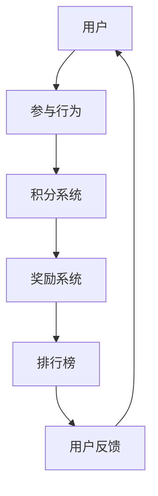

                 

关键词：游戏化、人类计算、参与度、用户体验、激励机制

> 摘要：在信息技术飞速发展的今天，如何提升人类的计算参与度，提高用户的活跃度和黏性，成为了一个重要课题。本文将探讨游戏化参与这一策略，通过引入游戏元素到计算任务中，激发用户的兴趣和积极性，从而实现计算任务的趣味化和高效化。

## 1. 背景介绍

在当今社会，信息技术已经深入到人们生活的方方面面，从日常通讯、娱乐到商务、科学研究，计算机技术都扮演着不可或缺的角色。然而，随着计算机技术的发展，人类面临的一个严峻挑战是如何提高计算参与度，让更多的人参与到计算任务中来。传统的计算任务往往枯燥乏味，用户容易失去兴趣，导致参与度低下。因此，如何激发用户的兴趣和积极性，提升计算参与度，成为了一个亟待解决的问题。

游戏化参与（Gamification）作为一种创新策略，通过将游戏元素引入非游戏情境，旨在提高用户的参与度和活跃度。游戏化参与的概念最早由游戏设计师Nicholas Pilkington在2002年提出，后来被广泛应用于教育、营销、健康等领域。游戏化参与的核心思想是将游戏的机制和元素（如积分、奖励、排行榜等）融入到非游戏环境中，从而激发用户的内在动机，提高用户的参与度和满意度。

## 2. 核心概念与联系

### 2.1 游戏化参与的基本原理

游戏化参与的基本原理是通过设计激励机制，引导用户积极参与到计算任务中。激励机制包括：

- **积分系统**：通过积分系统记录用户的参与行为，如完成任务、解答问题等，积分可以用来兑换奖励。
- **奖励系统**：奖励可以是虚拟的，如虚拟货币、徽章等，也可以是实际的，如实物奖励、优惠券等。
- **排行榜**：通过排行榜展示用户的参与度和成就，激发用户的竞争心理。

### 2.2 游戏化参与的应用场景

游戏化参与可以应用于各种计算任务，如数据标注、代码审核、算法竞赛等。以下是一些典型的应用场景：

- **数据标注**：在机器学习项目中，数据标注是至关重要的一环。通过游戏化参与，可以激发志愿者的参与热情，提高数据标注的质量和效率。
- **代码审核**：在开源项目开发中，代码审核是确保代码质量的重要环节。通过游戏化参与，可以鼓励开发者积极参与代码审核，提高代码的稳定性和安全性。
- **算法竞赛**：在算法研究领域，算法竞赛是推动算法创新的重要手段。通过游戏化参与，可以激发研究者的热情，提高算法竞赛的参与度和竞技水平。

### 2.3 游戏化参与的架构图

下面是一个简化的游戏化参与架构图，展示了游戏化参与的核心组件和交互流程。



### 2.4 游戏化参与的优势与挑战

游戏化参与的优势在于：

- **提高参与度**：通过激励机制，可以激发用户的内在动机，提高参与度。
- **提升用户体验**：游戏化的元素可以增加任务的趣味性，提升用户体验。
- **数据质量**：通过游戏化参与，可以提高用户对任务的投入程度，从而提高数据质量。

然而，游戏化参与也面临一些挑战：

- **设计复杂度**：设计一个有效的游戏化参与机制需要深入理解用户需求和心理，设计复杂度较高。
- **公平性问题**：如何确保游戏化参与过程中的公平性，避免用户之间的不公平竞争，是一个重要问题。
- **依赖性**：过度依赖游戏化参与可能导致用户产生依赖性，失去参与计算任务的内在动机。

## 3. 核心算法原理 & 具体操作步骤

### 3.1 算法原理概述

游戏化参与的核心算法是激励机制设计。激励机制设计的目的是通过设计合理的激励机制，引导用户积极参与计算任务，提高参与度和满意度。激励机制设计的基本原理包括：

- **公平性**：确保激励机制对所有用户都是公平的。
- **激励强度**：激励机制应该能够激励用户积极参与，同时不会造成过度激励。
- **可持续性**：激励机制应该能够长期持续，不会因为短期奖励而影响用户的长期行为。

### 3.2 算法步骤详解

游戏化参与的具体操作步骤可以分为以下几个阶段：

1. **需求分析**：分析计算任务的特点和用户需求，确定游戏化参与的目标和核心机制。
2. **机制设计**：根据需求分析的结果，设计积分系统、奖励系统和排行榜等核心机制。
3. **用户调研**：通过问卷调查、用户访谈等方式，了解用户对游戏化参与机制的反应和意见。
4. **机制实施**：根据用户调研的结果，调整和优化游戏化参与机制，确保其能够有效激励用户参与。
5. **监测与反馈**：监测游戏化参与的效果，收集用户反馈，不断优化和调整机制。

### 3.3 算法优缺点

**优点**：

- **提高参与度**：游戏化参与能够有效提高用户的参与度和活跃度。
- **提升用户体验**：游戏化的元素能够增加任务的趣味性，提升用户体验。
- **数据质量**：游戏化参与能够激励用户更认真、更投入地完成任务，从而提高数据质量。

**缺点**：

- **设计复杂度**：设计一个有效的游戏化参与机制需要深入理解用户需求和心理，设计复杂度较高。
- **依赖性**：过度依赖游戏化参与可能导致用户产生依赖性，失去参与计算任务的内在动机。

### 3.4 算法应用领域

游戏化参与可以应用于多个领域，如：

- **教育**：通过游戏化参与，可以提高学生的学习兴趣和参与度。
- **健康**：通过游戏化参与，可以激励用户更积极地参与健康活动，如健身、饮食管理等。
- **社区管理**：通过游戏化参与，可以激发社区成员的参与热情，提高社区活力。
- **科研**：通过游戏化参与，可以吸引更多的志愿者参与到科研任务中，提高科研效率。

## 4. 数学模型和公式 & 详细讲解 & 举例说明

### 4.1 数学模型构建

游戏化参与中的激励机制设计可以通过数学模型来描述。一个简单的数学模型可以表示为：

\[ \text{激励} = f(\text{参与度}, \text{任务难度}, \text{用户需求}) \]

其中，\( f \) 是一个非线性函数，用于描述激励与参与度、任务难度和用户需求之间的关系。

### 4.2 公式推导过程

为了推导激励机制的数学模型，我们可以从以下几个方面进行分析：

1. **参与度**：参与度可以用用户的参与行为（如完成任务的数量、质量等）来衡量。
2. **任务难度**：任务难度可以用任务的复杂度、耗时等指标来衡量。
3. **用户需求**：用户需求可以用用户的兴趣、动机等来衡量。

基于以上分析，我们可以构建一个简化的数学模型：

\[ \text{激励} = k_1 \cdot (\text{参与度} - \text{基线参与度}) + k_2 \cdot (\text{任务难度} - \text{基线难度}) + k_3 \cdot (\text{用户需求} - \text{基线需求}) \]

其中，\( k_1, k_2, k_3 \) 是权重系数，用于平衡不同因素的激励作用。

### 4.3 案例分析与讲解

下面我们通过一个具体的案例来说明如何应用这个数学模型。

**案例：数据标注任务**

假设我们设计一个数据标注任务，任务难度为中等，用户的兴趣较高。根据模型，我们可以计算激励：

\[ \text{激励} = k_1 \cdot (\text{参与度} - \text{基线参与度}) + k_2 \cdot (\text{任务难度} - \text{基线难度}) + k_3 \cdot (\text{用户需求} - \text{基线需求}) \]

假设 \( k_1 = 1.5, k_2 = 0.5, k_3 = 2 \)，用户的参与度比基线高了20%，任务难度比基线低了10%，用户的兴趣比基线高了30%，则激励计算如下：

\[ \text{激励} = 1.5 \cdot (20\% - 0%) + 0.5 \cdot (10\% - 0%) + 2 \cdot (30\% - 0%) = 3 + 0.5 + 6 = 9.5 \]

因此，用户的激励为9.5分。通过这个模型，我们可以根据任务的不同情况和用户的反应，动态调整激励机制，以提高参与度和满意度。

## 5. 项目实践：代码实例和详细解释说明

### 5.1 开发环境搭建

为了演示游戏化参与的实现，我们选择使用Python作为开发语言，搭建一个简单的数据标注任务平台。以下是我们需要的环境：

- Python 3.8 或以上版本
- Flask 2.0 或以上版本
- SQLite 3.35.2 或以上版本

安装以上依赖库后，我们可以开始搭建开发环境。

### 5.2 源代码详细实现

以下是一个简单的数据标注任务平台的源代码示例：

```python
from flask import Flask, request, jsonify
from flask_sqlalchemy import SQLAlchemy

app = Flask(__name__)
app.config['SQLALCHEMY_DATABASE_URI'] = 'sqlite:///data_annotations.db'
db = SQLAlchemy(app)

class DataAnnotation(db.Model):
    id = db.Column(db.Integer, primary_key=True)
    user_id = db.Column(db.Integer)
    data = db.Column(db.String(500))
    label = db.Column(db.String(10))

@app.route('/annotate', methods=['POST'])
def annotate():
    user_id = request.form['user_id']
    data = request.form['data']
    label = request.form['label']
    
    annotation = DataAnnotation(user_id=user_id, data=data, label=label)
    db.session.add(annotation)
    db.session.commit()
    
    return jsonify({'status': 'success', 'message': 'Data annotation submitted successfully.'})

if __name__ == '__main__':
    db.create_all()
    app.run(debug=True)
```

在这个示例中，我们创建了一个简单的数据标注接口，用户可以通过POST请求提交标注数据。数据库用于存储用户提交的标注数据。

### 5.3 代码解读与分析

这段代码首先导入了所需的库，包括Flask和Flask-SQLAlchemy。接着，我们定义了一个名为`DataAnnotation`的模型，用于存储用户的标注数据。

`annotate` 函数是主接口，用于处理用户的标注请求。当用户提交标注数据时，我们将其存储到数据库中。

最后，我们运行Flask应用，监听标注请求。

### 5.4 运行结果展示

在开发环境中运行此代码，我们可以在浏览器中访问`http://localhost:5000/annotate`，然后通过POST请求提交标注数据。提交成功后，我们可以在数据库中查看到存储的标注数据。

## 6. 实际应用场景

### 6.1 数据标注平台

游戏化参与在数据标注平台中的应用非常广泛。通过引入游戏化元素，如积分系统、奖励系统和排行榜，可以激励志愿者更积极地参与数据标注任务，提高数据标注的质量和效率。例如，OpenImageNet是一个利用游戏化参与的数据标注平台，通过积分和排名激励用户参与数据标注，取得了显著的成果。

### 6.2 代码审核

在开源项目中，代码审核是确保代码质量的重要环节。通过游戏化参与，可以鼓励开发者积极参与代码审核，提高代码的稳定性和安全性。例如，GitHub通过积分和徽章系统激励用户参与代码审核，提高了代码审核的参与度和效果。

### 6.3 算法竞赛

在算法研究领域，算法竞赛是推动算法创新的重要手段。通过游戏化参与，可以激发研究者的热情，提高算法竞赛的参与度和竞技水平。例如，Kaggle是一个著名的算法竞赛平台，通过积分和排名激励用户参与竞赛，吸引了大量研究者积极参与。

## 7. 工具和资源推荐

### 7.1 学习资源推荐

- **《游戏化设计：动机、需求和用户行为》**：这本书详细介绍了游戏化设计的理论和方法，适合游戏化参与初学者阅读。
- **《用户体验要素》**：这本书深入探讨了用户体验的设计原则和方法，对于设计游戏化参与系统有很大参考价值。

### 7.2 开发工具推荐

- **Flask**：一个轻量级的Python Web框架，适合用于搭建简单的Web应用。
- **SQLAlchemy**：一个强大的ORM（对象关系映射）库，用于与数据库进行交互。

### 7.3 相关论文推荐

- **"Gamification of Learning: A Review of the Literature"**：这篇综述文章详细总结了游戏化在教育中的应用和研究成果。
- **"Gamification at Work: Understanding How and When to Apply Game Design Elements"**：这篇文章探讨了游戏化在企业中的应用和效果。

## 8. 总结：未来发展趋势与挑战

### 8.1 研究成果总结

游戏化参与作为一种创新的激励机制，已经在多个领域取得了显著的应用效果。通过引入游戏元素，可以有效提高用户的参与度和满意度，提高计算任务的效率和效果。研究成果表明，游戏化参与不仅能够提高用户的活跃度，还能提升数据质量和用户体验。

### 8.2 未来发展趋势

未来，游戏化参与将继续向更多领域扩展，如健康、社区管理、科学研究等。同时，随着人工智能技术的发展，游戏化参与将更加智能化，能够根据用户的个性化需求和反馈，动态调整激励机制，实现更高效、更个性化的用户参与。

### 8.3 面临的挑战

尽管游戏化参与具有很大的潜力，但同时也面临一些挑战。首先，设计复杂度较高，需要深入理解用户需求和心理，设计一个有效的激励机制。其次，如何确保公平性，避免用户之间的不公平竞争，是一个重要问题。此外，过度依赖游戏化参与可能导致用户产生依赖性，失去参与计算任务的内在动机。

### 8.4 研究展望

未来，游戏化参与的研究将朝着智能化、个性化、可持续化的方向发展。通过结合人工智能技术，可以更准确地理解用户需求和行为，设计出更高效、更个性化的激励机制。同时，需要探索如何在保持用户参与度的同时，避免产生过度依赖，促进用户内在动机的发展。

## 9. 附录：常见问题与解答

### 9.1 什么是游戏化参与？

游戏化参与（Gamification）是一种通过引入游戏元素（如积分、奖励、排行榜等）到非游戏情境中，以提高用户参与度和满意度的一种策略。

### 9.2 游戏化参与有哪些优势？

游戏化参与的优势包括提高参与度、提升用户体验、提高数据质量等。

### 9.3 游戏化参与有哪些挑战？

游戏化参与面临的挑战包括设计复杂度、公平性问题、依赖性等。

### 9.4 游戏化参与适用于哪些场景？

游戏化参与适用于各种计算任务，如数据标注、代码审核、算法竞赛等。

### 9.5 如何设计一个有效的游戏化参与机制？

设计一个有效的游戏化参与机制需要深入理解用户需求和心理，设计合理的激励机制，并通过用户调研和反馈不断优化。

## 作者署名

本文作者：禅与计算机程序设计艺术 / Zen and the Art of Computer Programming

----------------------------------------------------------------

这篇文章涵盖了游戏化参与的背景、核心概念、算法原理、实际应用场景、数学模型、项目实践、未来发展趋势以及常见问题与解答。通过这篇文章，我们希望能够为读者提供一个全面、深入的理解，帮助他们在实际项目中有效应用游戏化参与，提高计算任务的参与度和效果。同时，也期待读者能够提出宝贵的意见和建议，共同推动游戏化参与的研究和发展。

