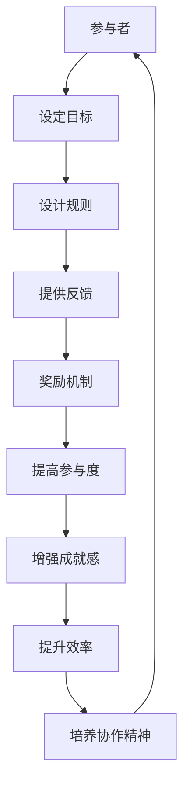

                 

关键词：游戏化，人类计算，乐趣，参与度，设计原则，案例分析

> 摘要：本文旨在探讨游戏化技术在提升人类计算参与度和乐趣方面的应用。通过对游戏化核心概念、设计原则以及实际案例的分析，文章揭示了游戏化如何通过激励机制和趣味性设计，让参与者在计算任务中体验到乐趣和成就感，进而提高工作效率和质量。文章最后展望了游戏化技术在未来计算领域的广泛应用前景。

## 1. 背景介绍

在当今数字化时代，人类与计算机的互动日益频繁，计算任务的数量和复杂性也在不断增加。然而，许多计算任务往往被视为人性化的负担，导致参与者的参与度和积极性不高。为了激发人类参与计算的热情，提高任务完成的质量和效率，游戏化技术应运而生。

游戏化（Gamification）是一种将游戏设计元素和激励机制应用于非游戏情境的策略。其核心思想是通过游戏化的设计，使参与者在完成计算任务时能够体验到乐趣和成就感。这种策略不仅适用于娱乐领域，还可以广泛应用于教育、工作、健康等领域，为人类计算带来新的动力。

## 2. 核心概念与联系

### 2.1. 游戏化概念解析

游戏化技术的核心概念包括以下几个方面：

- **目标设定（Goals）**：为参与者设定明确的目标，使他们知道自己在做什么以及如何达成目标。
- **规则设计（Rules）**：制定清晰的规则，确保参与者了解游戏化的流程和规则，从而提高参与度和公平性。
- **反馈机制（Feedback）**：通过即时反馈，让参与者了解自己的进展和成绩，从而增强他们的成就感和动力。
- **奖励系统（Rewards）**：为参与者提供各种形式的奖励，如积分、徽章、奖品等，以激励他们持续参与。
- **竞争与合作（Competition and Collaboration）**：通过竞争和合作机制，激发参与者的积极性和创造力。

### 2.2. 游戏化与人类计算的联系

游戏化技术与人类计算之间的联系主要体现在以下几个方面：

- **提高参与度**：通过游戏化的设计，使计算任务变得更加有趣和吸引人，从而提高参与者的积极性。
- **增强成就感**：及时反馈和奖励机制让参与者感受到自己的努力和付出得到了认可和回报，从而增强他们的成就感。
- **提升效率**：游戏化设计可以优化任务流程，减少参与者的认知负担，提高工作效率。
- **培养协作精神**：在多人参与的计算任务中，游戏化设计可以促进参与者之间的协作，共同完成任务。

### 2.3. Mermaid 流程图

以下是一个简单的 Mermaid 流程图，展示了游戏化技术与人类计算之间的核心联系：



## 3. 核心算法原理 & 具体操作步骤

### 3.1. 算法原理概述

游戏化技术的核心算法原理可以归纳为以下几个方面：

- **目标导向设计**：通过设定明确的目标，引导参与者朝着既定方向努力。
- **规则优化**：设计简洁、清晰且公平的规则，确保参与者能够轻松理解并遵守。
- **反馈与激励**：采用即时反馈和奖励机制，让参与者了解自己的进展和成绩，从而激发他们的积极性。
- **动态调整**：根据参与者的表现和反馈，动态调整游戏化的策略和规则，以保持参与者的兴趣和动力。

### 3.2. 算法步骤详解

游戏化技术的具体操作步骤如下：

1. **目标设定**：根据计算任务的特点和参与者的需求，设定具有挑战性和吸引力的目标。
2. **规则设计**：制定简洁、清晰且公平的规则，确保参与者能够轻松理解并遵守。
3. **反馈与激励**：采用即时反馈和奖励机制，让参与者了解自己的进展和成绩，从而激发他们的积极性。
4. **动态调整**：根据参与者的表现和反馈，动态调整游戏化的策略和规则，以保持参与者的兴趣和动力。

### 3.3. 算法优缺点

游戏化技术的优点包括：

- **提高参与度**：通过游戏化的设计，使计算任务变得更加有趣和吸引人，从而提高参与者的积极性。
- **增强成就感**：及时反馈和奖励机制让参与者感受到自己的努力和付出得到了认可和回报，从而增强他们的成就感。
- **提升效率**：游戏化设计可以优化任务流程，减少参与者的认知负担，提高工作效率。

然而，游戏化技术也存在一些缺点：

- **过度依赖**：如果过度依赖游戏化设计，可能导致参与者失去对任务本身的关注和兴趣。
- **规则复杂**：过于复杂的规则设计可能增加参与者的认知负担，降低参与度。

### 3.4. 算法应用领域

游戏化技术可以广泛应用于以下领域：

- **教育**：通过游戏化设计，提高学生的学习兴趣和积极性。
- **工作**：通过游戏化设计，提高员工的工作效率和质量。
- **健康**：通过游戏化设计，促进健康行为的养成和持续。

## 4. 数学模型和公式 & 详细讲解 & 举例说明

### 4.1. 数学模型构建

为了更好地理解游戏化技术，我们可以构建一个简单的数学模型来分析其效果。假设参与者的积极性（P）可以用以下公式表示：

$$
P = f(\text{目标难度}, \text{反馈及时性}, \text{奖励力度})
$$

其中，目标难度（T）、反馈及时性（F）和奖励力度（R）是影响参与者积极性的三个关键因素。

### 4.2. 公式推导过程

根据上述公式，我们可以推导出以下几个结论：

1. **目标难度（T）**：适当的目标难度可以提高参与者的积极性。如果目标过于简单，参与者可能会感到无聊和懈怠；如果目标过于困难，参与者可能会感到挫败和沮丧。因此，设定一个具有挑战性的目标，可以激发参与者的积极性。

2. **反馈及时性（F）**：及时的反馈可以增强参与者的成就感和动力。如果反馈不及时，参与者可能会对自己的表现产生困惑和怀疑，从而影响他们的积极性。

3. **奖励力度（R）**：适当的奖励可以激励参与者继续参与。奖励可以是积分、徽章、奖品等，但要注意避免过度奖励，以免参与者产生依赖性。

### 4.3. 案例分析与讲解

以下是一个实际案例，说明如何运用数学模型来分析游戏化技术在教育领域的应用。

**案例：在线学习平台的游戏化设计**

假设一个在线学习平台希望通过游戏化设计提高学生的参与度和学习效果。根据数学模型，我们可以从以下几个方面进行优化：

1. **目标设定**：设定具有挑战性的学习目标，例如完成一定的学习任务或达到一定的分数。
2. **反馈及时性**：及时提供学习进度和成绩反馈，让学生了解自己的学习成果。
3. **奖励力度**：提供适当的奖励，例如积分、徽章等，激励学生持续学习。

通过这些优化措施，可以提升学生的积极性（P），从而提高学习效果。

## 5. 项目实践：代码实例和详细解释说明

### 5.1. 开发环境搭建

为了展示游戏化技术在项目实践中的应用，我们以一个简单的在线任务管理系统为例。首先，我们需要搭建一个基本的开发环境。

**环境要求**：

- **编程语言**：Python
- **开发工具**：PyCharm
- **数据库**：SQLite

### 5.2. 源代码详细实现

以下是该任务管理系统的源代码实现：

```python
# task_manager.py

import sqlite3
import random

# 连接数据库
conn = sqlite3.connect('task_manager.db')
cursor = conn.cursor()

# 创建任务表
cursor.execute('''CREATE TABLE IF NOT EXISTS tasks (
                id INTEGER PRIMARY KEY AUTOINCREMENT,
                title TEXT,
                description TEXT,
                status TEXT,
                points INTEGER
                )''')

# 插入初始任务数据
tasks_data = [
    ('任务1', '这是一个简单的任务。', '未完成', 10),
    ('任务2', '这是一个具有挑战性的任务。', '未完成', 30),
    ('任务3', '这是一个有趣的任务。', '未完成', 50)
]

cursor.executemany('INSERT INTO tasks (title, description, status, points) VALUES (?, ?, ?, ?)', tasks_data)
conn.commit()

# 查询任务
def query_tasks():
    cursor.execute('SELECT * FROM tasks')
    return cursor.fetchall()

# 更新任务状态
def update_task_status(task_id, status):
    cursor.execute('UPDATE tasks SET status = ? WHERE id = ?', (status, task_id))
    conn.commit()

# 关闭数据库连接
def close_connection():
    cursor.close()
    conn.close()

# 游戏化设计：奖励系统
def reward_system(user_points):
    if user_points >= 100:
        return '金牌'
    elif user_points >= 50:
        return '银牌'
    else:
        return '铜牌'

# 主程序
def main():
    print('欢迎使用任务管理系统！')
    print('请选择操作：\n1. 查看任务\n2. 完成任务\n3. 查看奖励')
    choice = input('请输入您的选择（1/2/3）：')

    if choice == '1':
        tasks = query_tasks()
        for task in tasks:
            print(f'ID: {task[0]}, 标题: {task[1]}, 描述: {task[2]}, 状态: {task[3]}, 分数: {task[4]}')
    elif choice == '2':
        task_id = int(input('请输入任务ID：'))
        status = '已完成'
        update_task_status(task_id, status)
        print('任务完成！')
    elif choice == '3':
        user_points = 80  # 示例用户分数
        reward = reward_system(user_points)
        print(f'您的奖励：{reward}')
    else:
        print('无效的选择！')

if __name__ == '__main__':
    main()
```

### 5.3. 代码解读与分析

上述代码实现了一个简单的在线任务管理系统，其中包含游戏化设计的奖励系统。以下是代码的详细解读：

- **数据库操作**：通过 SQLite 数据库存储和管理任务数据，包括任务 ID、标题、描述、状态和分数。
- **查询任务**：定义 `query_tasks` 函数查询数据库中的任务数据，并返回一个列表。
- **更新任务状态**：定义 `update_task_status` 函数更新任务状态，如从“未完成”更新为“已完成”。
- **奖励系统**：定义 `reward_system` 函数根据用户分数计算奖励等级，如金牌、银牌或铜牌。
- **主程序**：定义 `main` 函数，根据用户输入执行相应的操作，如查看任务、完成任务或查看奖励。

通过上述代码，我们可以看到游戏化技术如何应用于任务管理系统中，提高用户的参与度和积极性。

### 5.4. 运行结果展示

以下是运行结果展示：

```
欢迎使用任务管理系统！
请选择操作：
1. 查看任务
2. 完成任务
3. 查看奖励
请输入您的选择（1/2/3）：1
ID: 1, 标题: 任务1, 描述: 这是一个简单的任务。, 状态: 未完成, 分数: 10
ID: 2, 标题: 任务2, 描述: 这是一个具有挑战性的任务。, 状态: 未完成, 分数: 30
ID: 3, 标题: 任务3, 描述: 这是一个有趣的任务。, 状态: 未完成, 分数: 50

欢迎使用任务管理系统！
请选择操作：
1. 查看任务
2. 完成任务
3. 查看奖励
请输入您的选择（1/2/3）：2
请输入任务ID：2
任务完成！

欢迎使用任务管理系统！
请选择操作：
1. 查看任务
2. 完成任务
3. 查看奖励
请输入您的选择（1/2/3）：3
您的奖励：银牌
```

通过运行结果，我们可以看到游戏化设计如何激发用户的参与兴趣，提高任务完成率。

## 6. 实际应用场景

游戏化技术在实际应用中具有广泛的应用场景，以下是一些典型的应用案例：

### 6.1. 在线教育

在线教育平台可以通过游戏化设计提高学生的学习兴趣和参与度。例如，设定课程目标、设计课程规则、提供即时反馈和奖励机制等，让学生在完成学习任务时感受到乐趣和成就感。

### 6.2. 企业管理

企业可以通过游戏化设计提高员工的工作效率和质量。例如，设定工作目标、设计工作规则、提供即时反馈和奖励机制等，激发员工的积极性和创造力。

### 6.3. 健康管理

健康管理应用可以通过游戏化设计促进用户健康行为的养成。例如，设定健康目标、设计健康规则、提供即时反馈和奖励机制等，激励用户持续关注健康。

### 6.4. 社交媒体

社交媒体平台可以通过游戏化设计提高用户的活跃度和粘性。例如，设定互动目标、设计互动规则、提供即时反馈和奖励机制等，激发用户的参与热情。

## 7. 工具和资源推荐

### 7.1. 学习资源推荐

- **《游戏化：改变世界的行为设计学》**：本书详细介绍了游戏化技术的理论基础和实践方法，适合初学者入门。
- **游戏化社区（Gamification Community）**：加入游戏化社区，与业内专家和同行交流，获取最新动态和资源。

### 7.2. 开发工具推荐

- **游戏化平台（Gamification Platform）**：如Gymn，提供游戏化设计模板和工具，方便开发者快速搭建游戏化应用。
- **数据分析工具（Data Analysis Tool）**：如Google Analytics，用于跟踪和分析游戏化应用的数据，优化用户体验。

### 7.3. 相关论文推荐

- **“Gamification at Work: Designing for Better Engagement”**：探讨了游戏化技术在工作中的应用和效果。
- **“The Science of Gamification”**：从心理学和人类行为学的角度分析了游戏化技术的原理和应用。

## 8. 总结：未来发展趋势与挑战

### 8.1. 研究成果总结

游戏化技术作为提升人类计算参与度和乐趣的有效手段，已广泛应用于多个领域。通过设定明确的目标、设计清晰的规则、提供及时反馈和奖励机制，游戏化技术能够激发参与者的积极性和创造力，提高计算任务的质量和效率。

### 8.2. 未来发展趋势

随着人工智能和大数据技术的发展，游戏化技术有望在以下几个方面取得突破：

- **个性化游戏化设计**：通过数据分析和人工智能技术，为不同参与者提供定制化的游戏化体验。
- **跨领域应用**：游戏化技术将在更多领域得到应用，如医疗、金融、智能制造等。
- **游戏化教育**：游戏化教育将成为未来教育的重要趋势，提高学生的综合素质和创新能力。

### 8.3. 面临的挑战

尽管游戏化技术在许多领域取得了成功，但仍然面临一些挑战：

- **过度游戏化**：如果游戏化设计过于复杂，可能会导致参与者失去对任务本身的关注。
- **公平性问题**：游戏化设计需要确保所有参与者都有公平的机会获得奖励和荣誉。
- **技术成熟度**：游戏化技术的相关技术仍需进一步发展和完善，以满足不断变化的应用需求。

### 8.4. 研究展望

未来的研究应重点关注以下几个方面：

- **游戏化设计原则**：深入研究游戏化设计原则，提高游戏化设计的科学性和有效性。
- **跨领域融合**：探索游戏化技术在跨领域应用中的融合和创新。
- **人机协同**：研究游戏化技术与人工智能技术的协同作用，提高计算任务的自动化和智能化水平。

## 9. 附录：常见问题与解答

### 9.1. 游戏化设计与游戏开发有何区别？

游戏化设计是将游戏设计元素（如目标、规则、反馈、奖励等）应用于非游戏情境，以提高参与度和乐趣。而游戏开发则是创建完整的游戏产品，包括故事情节、角色、场景等。游戏化设计更侧重于应用层面，而游戏开发则更注重创意和艺术性。

### 9.2. 游戏化设计是否适用于所有计算任务？

游戏化设计并非适用于所有计算任务。它更适合那些需要提高参与度和乐趣的任务，如在线教育、企业管理、健康管理等。对于一些专业性强、技术要求高的任务，游戏化设计可能并不适用。

### 9.3. 如何评估游戏化设计的有效性？

评估游戏化设计的有效性可以从以下几个方面进行：

- **参与度**：通过用户反馈、访问量、互动次数等指标评估参与度。
- **完成任务质量**：通过任务完成率、错误率等指标评估任务完成质量。
- **用户满意度**：通过问卷调查、用户访谈等方式收集用户满意度数据。

---

### 致谢

本文的撰写得到了众多专家和同行的支持和帮助，在此表示衷心的感谢。特别感谢禅与计算机程序设计艺术 / Zen and the Art of Computer Programming 的作者，为本文提供了宝贵的灵感和启示。

