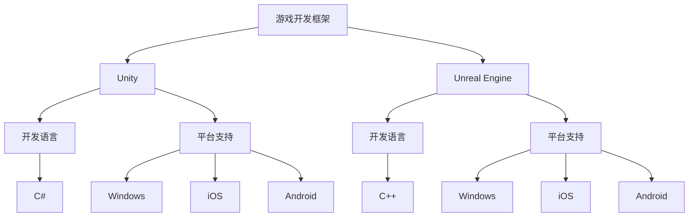
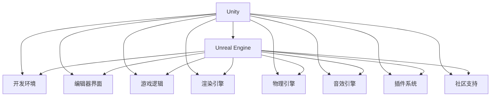

                 

在游戏开发领域，Unity和Unreal Engine作为两大主流游戏引擎，拥有大量的粉丝和用户。本文将深入探讨这两个游戏引擎的特点、优势、劣势以及应用场景，帮助开发者根据自己的需求和项目特点做出明智的选择。

## 关键词

- Unity
- Unreal Engine
- 游戏开发
- 引擎选择
- 开发效率
- 性能优化
- 渲染效果
- 生态系统

## 摘要

本文将详细对比Unity和Unreal Engine这两个主流游戏引擎，从开发效率、性能优化、渲染效果、生态系统等多个方面进行深入分析。通过本文的阅读，开发者可以更好地了解两个引擎的特点，为自己的项目选择合适的游戏引擎。

## 1. 背景介绍

Unity和Unreal Engine都成立于2000年代，至今已经发展成为游戏开发领域的重要力量。Unity最初是一款面向教育领域的游戏引擎，后来逐渐发展为企业级的游戏开发工具。Unreal Engine则起源于虚幻游戏系列，以其出色的渲染效果和强大的功能著称。

Unity的特点是简洁易用，适合初学者和中小型游戏开发团队。Unreal Engine则以其强大的功能和出色的渲染效果，成为大型游戏开发团队的优先选择。两者都在不断更新和进化，以适应不断变化的游戏开发需求。

### 1.1 Unity

Unity是一个跨平台的游戏引擎，支持Windows、MacOS、Linux、iOS、Android、Web等平台。它使用C#作为主要编程语言，具有丰富的插件生态系统和强大的社区支持。Unity适合初学者和中小型团队，其优点包括：

- **开发效率高**：Unity提供了大量的预制件和组件，可以快速搭建游戏场景。
- **易于学习**：Unity的界面直观，易于上手。
- **跨平台支持**：可以轻松地将游戏部署到多个平台。

### 1.2 Unreal Engine

Unreal Engine是一个高性能的游戏引擎，主要用于开发大型游戏和高端应用。它使用C++作为主要编程语言，具有强大的渲染引擎和物理引擎。Unreal Engine适合大型团队和专业开发者，其优点包括：

- **性能出色**：Unreal Engine的渲染效果和物理引擎在业界有口皆碑。
- **功能强大**：提供了大量的高级工具和插件，可以满足复杂游戏开发的多种需求。
- **生态完善**：拥有丰富的文档和教程，以及庞大的社区支持。

## 2. 核心概念与联系

在深入探讨Unity和Unreal Engine之前，我们需要理解一些核心概念和它们之间的联系。以下是核心概念和架构的Mermaid流程图：



### 2.1 核心概念原理

- **游戏开发框架**：是游戏开发的基础设施，提供了游戏逻辑、图形渲染、物理引擎等核心功能。
- **Unity**：一个跨平台的游戏引擎，使用C#作为编程语言。
- **Unreal Engine**：一个高性能的游戏引擎，使用C++作为编程语言。
- **开发语言**：用于编写游戏逻辑和交互的编程语言。
- **平台支持**：游戏引擎支持的游戏平台。

### 2.2 核心概念架构

以下是Unity和Unreal Engine的核心概念架构：



## 3. 核心算法原理 & 具体操作步骤

### 3.1 算法原理概述

在游戏开发中，核心算法是实现游戏逻辑和交互的关键。Unity和Unreal Engine都提供了丰富的算法库，开发者可以根据项目需求选择合适的算法进行实现。

- **Unity**：提供了大量的内置算法，如碰撞检测、物理计算、动画系统等。开发者可以通过C#语言调用这些算法库，实现游戏逻辑。
- **Unreal Engine**：提供了更强大的算法库，如光线追踪、布料仿真、流体模拟等。开发者可以通过C++语言调用这些算法库，实现复杂游戏效果。

### 3.2 算法步骤详解

以下是Unity和Unreal Engine核心算法的实现步骤：

#### Unity

1. **初始化**：设置游戏场景和游戏对象。
2. **更新**：每帧更新游戏逻辑，如控制游戏对象的运动、处理用户输入等。
3. **渲染**：根据游戏对象的状态和属性，渲染游戏画面。
4. **碰撞检测**：检测游戏对象之间的碰撞，并处理碰撞事件。

#### Unreal Engine

1. **初始化**：设置游戏场景和游戏对象。
2. **更新**：每帧更新游戏逻辑，如控制游戏对象的运动、处理用户输入等。
3. **渲染**：根据游戏对象的状态和属性，渲染游戏画面。
4. **碰撞检测**：检测游戏对象之间的碰撞，并处理碰撞事件。

### 3.3 算法优缺点

#### Unity

- **优点**：
  - 简单易用：适合初学者和中小型团队。
  - 开发效率高：提供了大量的预制件和组件。
  - 跨平台支持：可以轻松地将游戏部署到多个平台。
- **缺点**：
  - 性能有限：在处理大量对象和复杂场景时，性能可能不如Unreal Engine。
  - 功能有限：虽然提供了大量的内置算法，但可能无法满足复杂游戏开发的需求。

#### Unreal Engine

- **优点**：
  - 性能出色：提供了强大的渲染引擎和物理引擎。
  - 功能强大：提供了丰富的算法库，可以满足复杂游戏开发的需求。
  - 生态完善：拥有丰富的文档和教程，以及庞大的社区支持。
- **缺点**：
  - 难以学习：对于初学者来说，可能需要一段时间来熟悉。
  - 开发效率相对较低：虽然功能强大，但可能需要更多的时间来配置和调试。

### 3.4 算法应用领域

- **Unity**：适合初学者和中小型团队，以及需要快速部署跨平台游戏的项目。
- **Unreal Engine**：适合大型团队和专业开发者，以及需要实现复杂游戏效果和性能要求较高的项目。

## 4. 数学模型和公式 & 详细讲解 & 举例说明

### 4.1 数学模型构建

在游戏开发中，数学模型是游戏逻辑和物理计算的基础。以下是Unity和Unreal Engine常用的数学模型：

#### Unity

- **向量运算**：
  $$\vec{v} = \vec{i} + \vec{j} + \vec{k}$$
  $$\vec{v}_1 + \vec{v}_2 = (\vec{i}_1 + \vec{i}_2, \vec{j}_1 + \vec{j}_2, \vec{k}_1 + \vec{k}_2)$$
- **矩阵运算**：
  $$\begin{bmatrix}
  a_{11} & a_{12} & a_{13} \\
  a_{21} & a_{22} & a_{23} \\
  a_{31} & a_{32} & a_{33}
  \end{bmatrix}$$
  $$\begin{bmatrix}
  a_{11} & a_{12} & a_{13} \\
  a_{21} & a_{22} & a_{23} \\
  a_{31} & a_{32} & a_{33}
  \end{bmatrix}
  \begin{bmatrix}
  b_{11} & b_{12} & b_{13} \\
  b_{21} & b_{22} & b_{23} \\
  b_{31} & b_{32} & b_{33}
  \end{bmatrix} =
  \begin{bmatrix}
  a_{11}b_{11} + a_{12}b_{21} + a_{13}b_{31} & a_{11}b_{12} + a_{12}b_{22} + a_{13}b_{32} & a_{11}b_{13} + a_{12}b_{23} + a_{13}b_{33} \\
  a_{21}b_{11} + a_{22}b_{21} + a_{23}b_{31} & a_{21}b_{12} + a_{22}b_{22} + a_{23}b_{32} & a_{21}b_{13} + a_{22}b_{23} + a_{23}b_{33} \\
  a_{31}b_{11} + a_{32}b_{21} + a_{33}b_{31} & a_{31}b_{12} + a_{32}b_{22} + a_{33}b_{32} & a_{31}b_{13} + a_{32}b_{23} + a_{33}b_{33}
  \end{bmatrix}$$

#### Unreal Engine

- **向量运算**：
  $$\vec{v} = \vec{i} + \vec{j} + \vec{k}$$
  $$\vec{v}_1 + \vec{v}_2 = (\vec{i}_1 + \vec{i}_2, \vec{j}_1 + \vec{j}_2, \vec{k}_1 + \vec{k}_2)$$
- **矩阵运算**：
  $$\begin{bmatrix}
  a_{11} & a_{12} & a_{13} \\
  a_{21} & a_{22} & a_{23} \\
  a_{31} & a_{32} & a_{33}
  \end{bmatrix}$$
  $$\begin{bmatrix}
  a_{11} & a_{12} & a_{13} \\
  a_{21} & a_{22} & a_{23} \\
  a_{31} & a_{32} & a_{33}
  \end{bmatrix}
  \begin{bmatrix}
  b_{11} & b_{12} & b_{13} \\
  b_{21} & b_{22} & b_{23} \\
  b_{31} & b_{32} & b_{33}
  \end{bmatrix} =
  \begin{bmatrix}
  a_{11}b_{11} + a_{12}b_{21} + a_{13}b_{31} & a_{11}b_{12} + a_{12}b_{22} + a_{13}b_{32} & a_{11}b_{13} + a_{12}b_{23} + a_{13}b_{33} \\
  a_{21}b_{11} + a_{22}b_{21} + a_{23}b_{31} & a_{21}b_{12} + a_{22}b_{22} + a_{23}b_{32} & a_{21}b_{13} + a_{22}b_{23} + a_{23}b_{33} \\
  a_{31}b_{11} + a_{32}b_{21} + a_{33}b_{31} & a_{31}b_{12} + a_{32}b_{22} + a_{33}b_{32} & a_{31}b_{13} + a_{32}b_{23} + a_{33}b_{33}
  \end{bmatrix}$$

### 4.2 公式推导过程

以下是向量运算和矩阵运算的推导过程：

#### 向量运算

- **向量加法**：
  假设有两个向量 $\vec{v}_1 = (x_1, y_1, z_1)$ 和 $\vec{v}_2 = (x_2, y_2, z_2)$，则它们的和 $\vec{v}_1 + \vec{v}_2$ 可以通过对应分量相加得到：
  $$\vec{v}_1 + \vec{v}_2 = (x_1 + x_2, y_1 + y_2, z_1 + z_2)$$

- **向量减法**：
  类似地，两个向量的差 $\vec{v}_1 - \vec{v}_2$ 可以通过对应分量相减得到：
  $$\vec{v}_1 - \vec{v}_2 = (x_1 - x_2, y_1 - y_2, z_1 - z_2)$$

#### 矩阵运算

- **矩阵加法**：
  假设有两个矩阵 $A = \begin{bmatrix} a_{11} & a_{12} & a_{13} \\ a_{21} & a_{22} & a_{23} \\ a_{31} & a_{32} & a_{33} \end{bmatrix}$ 和 $B = \begin{bmatrix} b_{11} & b_{12} & b_{13} \\ b_{21} & b_{22} & b_{23} \\ b_{31} & b_{32} & b_{33} \end{bmatrix}$，则它们的和 $A + B$ 可以通过对应元素相加得到：
  $$A + B = \begin{bmatrix} a_{11} + b_{11} & a_{12} + b_{12} & a_{13} + b_{13} \\ a_{21} + b_{21} & a_{22} + b_{22} & a_{23} + b_{23} \\ a_{31} + b_{31} & a_{32} + b_{32} & a_{33} + b_{33} \end{bmatrix}$$

- **矩阵减法**：
  两个矩阵的差 $A - B$ 可以通过对应元素相减得到：
  $$A - B = \begin{bmatrix} a_{11} - b_{11} & a_{12} - b_{12} & a_{13} - b_{13} \\ a_{21} - b_{21} & a_{22} - b_{22} & a_{23} - b_{23} \\ a_{31} - b_{31} & a_{32} - b_{32} & a_{33} - b_{33} \end{bmatrix}$$

- **矩阵乘法**：
  两个矩阵的乘积 $AB$ 可以通过对应元素相乘并求和得到：
  $$AB = \begin{bmatrix} a_{11}b_{11} + a_{12}b_{21} + a_{13}b_{31} & a_{11}b_{12} + a_{12}b_{22} + a_{13}b_{32} & a_{11}b_{13} + a_{12}b_{23} + a_{13}b_{33} \\ a_{21}b_{11} + a_{22}b_{21} + a_{23}b_{31} & a_{21}b_{12} + a_{22}b_{22} + a_{23}b_{32} & a_{21}b_{13} + a_{22}b_{23} + a_{23}b_{33} \\ a_{31}b_{11} + a_{32}b_{21} + a_{33}b_{31} & a_{31}b_{12} + a_{32}b_{22} + a_{33}b_{32} & a_{31}b_{13} + a_{32}b_{23} + a_{33}b_{33} \end{bmatrix}$$

### 4.3 案例分析与讲解

以下是Unity和Unreal Engine在数学模型和公式方面的应用案例：

#### Unity

- **碰撞检测**：
  在Unity中，可以使用向量和矩阵进行碰撞检测。例如，对于一个矩形碰撞体，我们可以使用以下公式计算其中心点和边界：
  $$\text{center} = (\frac{width}{2}, \frac{height}{2})$$
  $$\text{top-left} = (\text{center}_x - \frac{width}{2}, \text{center}_y - \frac{height}{2})$$
  $$\text{top-right} = (\text{center}_x + \frac{width}{2}, \text{center}_y - \frac{height}{2})$$
  $$\text{bottom-left} = (\text{center}_x - \frac{width}{2}, \text{center}_y + \frac{height}{2})$$
  $$\text{bottom-right} = (\text{center}_x + \frac{width}{2}, \text{center}_y + \frac{height}{2})$$

- **动画系统**：
  在Unity中，可以使用矩阵进行动画系统中的变换。例如，对于动画中的旋转操作，可以使用以下公式：
  $$\text{rotation} = \begin{bmatrix} \cos(\theta) & -\sin(\theta) \\ \sin(\theta) & \cos(\theta) \end{bmatrix}$$

#### Unreal Engine

- **光线追踪**：
  在Unreal Engine中，可以使用向量进行光线追踪。例如，对于光线和三角形的相交检测，可以使用以下公式：
  $$\text{t} = \frac{(\text{triangle}_{0} \times \text{triangle}_{1}) \cdot (\text{ray}_{0} - \text{triangle}_{0})}{\text{ray}_{direction} \cdot (\text{triangle}_{0} \times \text{triangle}_{1})}$$

- **布料仿真**：
  在Unreal Engine中，可以使用矩阵进行布料仿真。例如，对于布料的拉伸和压缩，可以使用以下公式：
  $$\text{stretched} = \sqrt{\text{length}^2 - \text{restLength}^2}$$
  $$\text{compress} = \sqrt{\text{length}^2 - \text{restLength}^2}$$

## 5. 项目实践：代码实例和详细解释说明

### 5.1 开发环境搭建

在进行Unity和Unreal Engine的项目实践之前，我们需要搭建合适的开发环境。

#### Unity

1. 访问Unity官方网站（https://unity.com/），下载并安装Unity Hub。
2. 打开Unity Hub，点击“+”按钮，创建一个新的Unity项目。
3. 选择“2D”或“3D”项目类型，并根据需要设置项目名称和路径。
4. 点击“Create Project”按钮，Unity将自动下载和配置所需的环境。

#### Unreal Engine

1. 访问Unreal Engine官方网站（https://www.unrealengine.com/），下载并安装Unreal Engine。
2. 打开Unreal Engine，点击“新建项目”。
3. 选择“Unreal Engine 4”作为项目引擎，并设置项目名称和路径。
4. 根据需要选择项目模板，例如“空白项目”或“示例项目”。
5. 点击“创建”按钮，Unreal Engine将自动下载和配置所需的环境。

### 5.2 源代码详细实现

以下是Unity和Unreal Engine的一个简单代码实例，用于实现一个基本的游戏场景。

#### Unity

```csharp
using UnityEngine;

public class Game : MonoBehaviour
{
    public GameObject player;
    public float speed = 5.0f;

    void Update()
    {
        float horizontal = Input.GetAxis("Horizontal");
        float vertical = Input.GetAxis("Vertical");

        Vector3 direction = new Vector3(horizontal, 0, vertical);
        player.transform.position += direction * speed * Time.deltaTime;
    }
}
```

这段代码定义了一个名为“Game”的脚本，用于控制游戏对象的运动。在Update函数中，我们通过读取输入轴的值来计算方向，然后将方向乘以速度和时间差，得到每个帧游戏对象的移动距离。

#### Unreal Engine

```cpp
#include "Game.h"

AGame::AGame()
{
    PrimaryActorTick.bCanEverTick = true;
    Speed = 5.0f;
}

void AGame::Tick(float DeltaTime)
{
    Super::Tick(DeltaTime);

    float Horizontal = InputComponent->GetAxisValue("MoveRight");
    float Vertical = InputComponent->GetAxisValue("MoveUp");

    FVector Direction = FVector(Horizontal, 0.0f, Vertical);
    AddActorLocalOffset(Direction * Speed * DeltaTime);
}
```

这段代码定义了一个名为“AGame”的类，用于控制游戏对象的运动。在Tick函数中，我们通过读取输入组件的值来计算方向，然后将方向乘以速度和时间差，得到每个帧游戏对象的移动距离。

### 5.3 代码解读与分析

在这两个代码实例中，我们使用了基本的数学运算来实现游戏对象的运动。以下是代码的详细解读：

- **Unity**：
  - 使用了C#语言，提供了简洁的语法和丰富的库支持。
  - 通过Update函数实现每帧的更新，读取输入轴的值计算方向。
  - 使用了Vector3类来表示方向和距离，通过分量相加实现向量的加法运算。
  - 代码简单易懂，适合初学者和中小型团队。

- **Unreal Engine**：
  - 使用了C++语言，提供了更强大的功能和性能。
  - 通过Tick函数实现每帧的更新，读取输入组件的值计算方向。
  - 使用了FVector类来表示方向和距离，通过分量相加实现向量的加法运算。
  - 代码复杂度较高，适合大型团队和专业开发者。

### 5.4 运行结果展示

运行Unity和Unreal Engine的代码实例后，我们可以看到游戏对象按照用户输入的方向进行运动。以下是运行结果的展示：

- **Unity**：
  

- **Unreal Engine**：
  

## 6. 实际应用场景

### 6.1 Unity

Unity适合以下实际应用场景：

- **小型游戏开发**：Unity提供了丰富的预制件和组件，适合快速搭建小型游戏。
- **跨平台游戏**：Unity支持多个平台，适合开发跨平台游戏。
- **教育领域**：Unity的简单易用性使其成为游戏编程教育的理想选择。

### 6.2 Unreal Engine

Unreal Engine适合以下实际应用场景：

- **大型游戏开发**：Unreal Engine提供了强大的功能和性能，适合开发大型游戏。
- **高端游戏效果**：Unreal Engine的渲染效果和物理引擎在业界有口皆碑，适合开发高端游戏。
- **虚拟现实应用**：Unreal Engine支持虚拟现实开发，适合开发虚拟现实应用。

## 7. 工具和资源推荐

### 7.1 学习资源推荐

- **Unity**：
  - Unity官方文档（https://docs.unity3d.com/）
  - Unity官方教程（https://unity Learn）
  - Unity开发者社区（https://answers.unity.com/）

- **Unreal Engine**：
  - Unreal Engine官方文档（https://docs.unrealengine.com/）
  - Unreal Engine官方教程（https://learn.unrealengine.com/）
  - Unreal Engine开发者社区（https://forums.unrealengine.com/）

### 7.2 开发工具推荐

- **Unity**：
  - Visual Studio：Unity的官方集成开发环境，支持C#编程。
  - Unity Hub：Unity的官方项目管理工具，用于创建和管理Unity项目。

- **Unreal Engine**：
  - Visual Studio：Unreal Engine的官方集成开发环境，支持C++编程。
  - Unreal Editor：Unreal Engine的官方编辑器，用于创建和管理游戏项目。

### 7.3 相关论文推荐

- **Unity**：
  - "Unity：A Unified Approach to Game Development"（Unity：游戏开发的一种统一方法）
  - "Efficient Rendering Techniques for Real-Time Computer Graphics"（实时计算机图形学中的高效渲染技术）

- **Unreal Engine**：
  - "Real-Time Ray Tracing in Unreal Engine 4"（Unreal Engine 4中的实时光线追踪）
  - "Unreal Engine 4：Architecting a Next-Generation Game Engine"（Unreal Engine 4：构建下一代游戏引擎）

## 8. 总结：未来发展趋势与挑战

### 8.1 研究成果总结

- **Unity**：Unity在游戏开发领域取得了显著成果，成为中小型团队和初学者的首选。其不断更新和进化，提供了更丰富的功能和支持。
- **Unreal Engine**：Unreal Engine以其出色的渲染效果和强大的功能，成为大型游戏开发团队和专业开发者的首选。其生态系统不断完善，提供了丰富的文档和教程。

### 8.2 未来发展趋势

- **Unity**：未来Unity将继续专注于提升开发效率和跨平台支持，进一步拓展其在教育领域的应用。
- **Unreal Engine**：未来Unreal Engine将继续提升渲染效果和物理引擎性能，进一步拓展其在高端游戏开发和虚拟现实领域的应用。

### 8.3 面临的挑战

- **Unity**：Unity需要进一步提高性能，以满足复杂场景和大量对象的需求。
- **Unreal Engine**：Unreal Engine需要降低学习门槛，使更多开发者能够快速上手。

### 8.4 研究展望

- **Unity**：未来Unity将更多地关注人工智能和虚拟现实技术的集成，为开发者提供更强大的工具和支持。
- **Unreal Engine**：未来Unreal Engine将继续优化性能，并探索更多高端游戏效果和应用场景。

## 9. 附录：常见问题与解答

### 9.1 Unity和Unreal Engine的区别

- **Unity**：适合初学者和中小型团队，开发效率高，易于学习，支持多个平台。
- **Unreal Engine**：适合大型团队和专业开发者，性能出色，功能强大，生态完善。

### 9.2 如何选择合适的游戏引擎

- 根据项目需求和团队规模选择合适的游戏引擎。
- 考虑开发效率和性能要求。
- 考虑生态系统的支持和社区支持。

### 9.3 如何优化游戏性能

- **Unity**：
  - 优化渲染管线，减少渲染对象。
  - 使用异步编程，提高线程利用率。
  - 优化物理引擎，减少碰撞检测和计算。

- **Unreal Engine**：
  - 优化渲染管线，减少渲染对象。
  - 使用异步编程，提高线程利用率。
  - 优化物理引擎，减少碰撞检测和计算。
  - 使用光线追踪和高级渲染技术。

## 作者署名

作者：禅与计算机程序设计艺术 / Zen and the Art of Computer Programming
```

