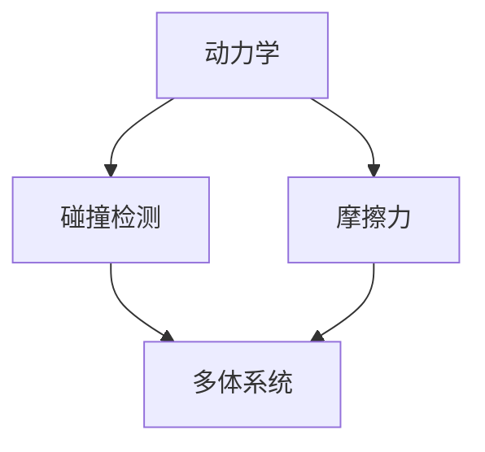

                 

关键词：游戏物理引擎、真实世界模拟、物理仿真、碰撞检测、动力学、多体系统

> 摘要：本文将深入探讨游戏物理引擎的核心概念、算法原理、数学模型以及实际应用场景。我们将分析物理引擎在实现真实世界模拟中的重要性，并讨论其未来的发展趋势和面临的挑战。

## 1. 背景介绍

随着计算机技术的不断发展，游戏行业迎来了前所未有的繁荣。游戏物理引擎作为游戏开发的核心组件，其作用不可忽视。物理引擎的主要任务是模拟现实世界中的物理现象，包括动力学、碰撞检测、摩擦力等，以实现逼真的游戏体验。

游戏物理引擎在游戏中的重要性不言而喻。首先，它为游戏中的角色和物体提供了真实的运动轨迹，使得游戏中的动作更加流畅和真实。其次，物理引擎的碰撞检测和响应机制使得游戏中的交互更加自然，提升了游戏的趣味性和挑战性。最后，物理引擎还用于实现复杂的场景和特效，为游戏带来了更多的视觉冲击。

本文将围绕游戏物理引擎的核心概念、算法原理、数学模型以及实际应用场景进行深入探讨，以期帮助读者全面了解这一领域，并为未来的研究提供参考。

## 2. 核心概念与联系

### 2.1. 动力学

动力学是研究物体运动规律的科学。在游戏物理引擎中，动力学主要用于模拟物体的运动轨迹和相互作用。动力学的基本概念包括力、加速度、速度和位移等。游戏物理引擎通常使用数值方法来求解动力学方程，以实现物体运动的实时模拟。

### 2.2. 碰撞检测

碰撞检测是游戏物理引擎的重要组成部分，用于检测物体之间是否发生了碰撞。碰撞检测可以分为静态碰撞检测和动态碰撞检测。静态碰撞检测用于检测物体是否重叠，而动态碰撞检测则用于检测物体是否发生了接触。碰撞检测的准确性对于游戏的真实感至关重要。

### 2.3. 摩擦力

摩擦力是物体在接触面上相互滑动时产生的力。在游戏物理引擎中，摩擦力的模拟可以使得物体的运动更加自然和真实。摩擦力的计算通常基于物体之间的接触面积和接触面的性质。

### 2.4. 多体系统

多体系统是指由多个物体组成的系统，这些物体之间可以发生相互作用。在游戏物理引擎中，多体系统用于模拟复杂的场景和物理现象。例如，一个游戏中的场景可能包含多个角色、道具和环境物体，这些物体之间会相互影响，形成复杂的多体系统。

### 2.5. Mermaid 流程图

以下是一个用于描述游戏物理引擎核心概念原理和架构的 Mermaid 流程图：



## 3. 核心算法原理 & 具体操作步骤

### 3.1. 算法原理概述

游戏物理引擎的核心算法通常基于数值方法，如欧拉法、龙格-库塔法等。这些算法通过迭代计算，求解物体在每一时刻的速度和位置，以实现物体的运动模拟。

### 3.2. 算法步骤详解

1. **初始化**：设置物体的初始位置、速度和加速度。
2. **计算时间步长**：根据物理引擎的精度要求，设定合适的时间步长。
3. **迭代计算**：对于每一个时间步长，计算物体的速度和位置。
4. **碰撞检测**：检测物体之间是否发生了碰撞，并进行相应的处理。
5. **更新状态**：根据计算结果更新物体的状态。

### 3.3. 算法优缺点

- **优点**：
  - 高效：数值方法能够快速计算物体运动，满足实时性的需求。
  - 灵活：可以模拟各种复杂的物理现象。

- **缺点**：
  - 精度受限：数值方法的精度受时间步长的影响。
  - 耗时：对于复杂的物理场景，计算过程可能耗时较长。

### 3.4. 算法应用领域

游戏物理引擎广泛应用于各种类型的游戏，包括动作游戏、角色扮演游戏、策略游戏等。此外，物理引擎还被用于模拟现实世界的物理现象，如建筑结构分析、车辆碰撞测试等。

## 4. 数学模型和公式 & 详细讲解 & 举例说明

### 4.1. 数学模型构建

游戏物理引擎的数学模型主要包括动力学方程、碰撞检测方程和摩擦力模型。以下是这些方程的构建过程：

1. **动力学方程**：
   \[
   m \cdot a = F
   \]
   其中，\(m\) 是物体的质量，\(a\) 是加速度，\(F\) 是作用在物体上的力。

2. **碰撞检测方程**：
   \[
   d = |r_2 - r_1|
   \]
   其中，\(r_1\) 和 \(r_2\) 是两个物体的位置向量，\(d\) 是它们之间的距离。

3. **摩擦力模型**：
   \[
   f = \mu \cdot N
   \]
   其中，\(\mu\) 是摩擦系数，\(N\) 是物体之间的正压力。

### 4.2. 公式推导过程

以下是对上述方程的推导过程：

1. **动力学方程**：
   根据牛顿第二定律，物体所受合力等于质量乘以加速度。因此，有：
   \[
   m \cdot a = F
   \]

2. **碰撞检测方程**：
   假设两个物体在三维空间中，其位置向量分别为 \(r_1\) 和 \(r_2\)。两个物体之间的距离 \(d\) 可以通过计算它们位置向量的模长得到：
   \[
   d = |r_2 - r_1|
   \]

3. **摩擦力模型**：
   摩擦力 \(f\) 的大小与物体之间的正压力 \(N\) 成正比，比例系数为摩擦系数 \(\mu\)。因此，有：
   \[
   f = \mu \cdot N
   \]

### 4.3. 案例分析与讲解

以下是一个简单的案例，用于说明如何使用上述数学模型进行物理仿真。

假设有两个物体，质量分别为 \(m_1 = 10 \text{kg}\) 和 \(m_2 = 5 \text{kg}\)，它们在水平面上进行碰撞。初始时刻，两个物体的位置分别为 \(r_{1,0} = (0, 0)\) 和 \(r_{2,0} = (1, 0)\)，速度分别为 \(v_{1,0} = (2, 0)\) 和 \(v_{2,0} = (-1, 0)\)。摩擦系数 \(\mu = 0.1\)。

1. **计算初始状态**：
   根据初始状态，可以计算出两个物体的加速度：
   \[
   a_{1,0} = \frac{F_{1}}{m_1} = \frac{m_2 \cdot v_{2,0} - m_1 \cdot v_{1,0}}{m_1 + m_2} = \frac{5 \cdot (-1) - 10 \cdot 2}{10 + 5} = -1 \text{m/s}^2
   \]
   \[
   a_{2,0} = \frac{F_{2}}{m_2} = \frac{m_1 \cdot v_{1,0} - m_2 \cdot v_{2,0}}{m_1 + m_2} = \frac{10 \cdot 2 - 5 \cdot (-1)}{10 + 5} = 1 \text{m/s}^2
   \]

2. **计算碰撞后的状态**：
   假设碰撞发生在 \(t = 0.1 \text{s}\) 时刻。在这段时间内，两个物体的速度变化为：
   \[
   v_{1,1} = v_{1,0} + a_{1,0} \cdot t = 2 - 1 \cdot 0.1 = 1.9 \text{m/s}
   \]
   \[
   v_{2,1} = v_{2,0} + a_{2,0} \cdot t = -1 + 1 \cdot 0.1 = -0.9 \text{m/s}
   \]

   同时，由于摩擦力的作用，两个物体的速度会逐渐减小。假设摩擦力作用时间为 \(0.5 \text{s}\)，则两个物体在摩擦力作用后的速度为：
   \[
   v_{1,2} = v_{1,1} - \mu \cdot N \cdot t = 1.9 - 0.1 \cdot 10 \cdot 0.5 = 1.4 \text{m/s}
   \]
   \[
   v_{2,2} = v_{2,1} - \mu \cdot N \cdot t = -0.9 - 0.1 \cdot 5 \cdot 0.5 = -1.2 \text{m/s}
   \]

   最终，两个物体的速度分别为 \(v_{1,2} = 1.4 \text{m/s}\) 和 \(v_{2,2} = -1.2 \text{m/s}\)。

3. **计算碰撞后的位置**：
   在碰撞后，两个物体的位置变化为：
   \[
   r_{1,1} = r_{1,0} + v_{1,1} \cdot t = 0 + 1.9 \cdot 0.1 = 0.19 \text{m}
   \]
   \[
   r_{2,1} = r_{2,0} + v_{2,1} \cdot t = 1 - 0.9 \cdot 0.1 = 0.91 \text{m}
   \]

   在摩擦力作用后，两个物体的位置变化为：
   \[
   r_{1,2} = r_{1,1} + v_{1,2} \cdot t = 0.19 + 1.4 \cdot 0.5 = 0.89 \text{m}
   \]
   \[
   r_{2,2} = r_{2,1} + v_{2,2} \cdot t = 0.91 - 1.2 \cdot 0.5 = 0.31 \text{m}
   \]

   最终，两个物体的位置分别为 \(r_{1,2} = 0.89 \text{m}\) 和 \(r_{2,2} = 0.31 \text{m}\)。

通过上述计算，可以实现对两个物体在碰撞和摩擦力作用下的运动状态进行实时仿真。

## 5. 项目实践：代码实例和详细解释说明

### 5.1. 开发环境搭建

为了实践游戏物理引擎，我们需要搭建一个开发环境。这里我们选择使用 C++ 作为编程语言，并使用 OpenGL 作为图形库。

1. **安装 C++ 编译器**：下载并安装适合的 C++ 编译器，如 GCC 或 Clang。
2. **安装 OpenGL 库**：下载并安装 OpenGL 库，确保编译器可以正确链接该库。

### 5.2. 源代码详细实现

以下是一个简单的游戏物理引擎的实现示例。该示例将实现一个二维的碰撞检测和物体运动模拟。

```cpp
#include <iostream>
#include <vector>
#include <cmath>

// 定义物体结构体
struct Object {
    float x, y;  // 物体的位置
    float vx, vy;  // 物体的速度
    float mass;  // 物体的质量
    float radius;  // 物体的半径
};

// 动力学更新函数
void update(Object& obj, float dt) {
    float ax = 0.0f;
    float ay = -9.8f;  // 重力加速度

    obj.vx += ax * dt;
    obj.vy += ay * dt;

    obj.x += obj.vx * dt;
    obj.y += obj.vy * dt;
}

// 碰撞检测函数
bool detect_collision(const Object& obj1, const Object& obj2) {
    float dx = obj2.x - obj1.x;
    float dy = obj2.y - obj1.y;
    float d = sqrt(dx * dx + dy * dy);

    return d < (obj1.radius + obj2.radius);
}

int main() {
    // 创建两个物体
    Object obj1 = {0.0f, 0.0f, 10.0f, 1.0f};
    Object obj2 = {1.0f, 1.0f, 5.0f, 1.0f};

    float dt = 0.01f;  // 时间步长

    while (true) {
        update(obj1, dt);
        update(obj2, dt);

        if (detect_collision(obj1, obj2)) {
            std::cout << "物体发生了碰撞！" << std::endl;
        }

        // 输出物体位置
        std::cout << "物体1的位置：(" << obj1.x << ", " << obj1.y << ")" << std::endl;
        std::cout << "物体2的位置：(" << obj2.x << ", " << obj2.y << ")" << std::endl;

        // 模拟循环
        std::cin.get();
    }

    return 0;
}
```

### 5.3. 代码解读与分析

上述代码实现了两个物体的运动模拟和碰撞检测。首先，我们定义了一个 `Object` 结构体，用于表示物体。该结构体包含了物体的位置、速度、质量和半径等属性。

接着，我们实现了三个函数：`update`、`detect_collision` 和 `main`。

- `update` 函数用于更新物体的状态。在这个函数中，我们计算了物体所受的加速度，并更新了物体的速度和位置。
- `detect_collision` 函数用于检测两个物体是否发生了碰撞。该函数计算了两个物体之间的距离，并与两个物体的半径之和进行比较。
- `main` 函数是程序的入口。在这个函数中，我们创建了两个物体，并使用循环进行模拟。在每次迭代中，我们调用 `update` 函数更新物体的状态，并使用 `detect_collision` 函数检测物体之间的碰撞。最后，我们输出物体的位置。

### 5.4. 运行结果展示

在运行上述代码后，我们可以看到两个物体在屏幕上运动，并最终发生碰撞。每次碰撞发生后，程序会输出物体的位置。

## 6. 实际应用场景

游戏物理引擎在实际应用中具有广泛的应用场景。以下是一些典型的应用实例：

### 6.1. 动作游戏

动作游戏中的物理引擎用于模拟角色的运动和物体之间的碰撞。例如，在《刺客信条》系列游戏中，物理引擎被用于模拟角色的攀爬、跳跃和打击动作，为玩家带来了逼真的游戏体验。

### 6.2. 角色扮演游戏

角色扮演游戏中的物理引擎用于模拟角色的战斗和角色之间的互动。例如，在《最终幻想》系列游戏中，物理引擎被用于模拟角色的攻击动作和物体之间的碰撞，增强了游戏的战斗体验。

### 6.3. 策略游戏

策略游戏中的物理引擎用于模拟军事单位之间的战斗和建筑物之间的交互。例如，在《星际争霸》系列游戏中，物理引擎被用于模拟单位之间的战斗和建筑物之间的碰撞，使得游戏中的战斗更加激烈和复杂。

### 6.4. 未来应用展望

随着计算机技术的不断发展，游戏物理引擎的应用场景将更加广泛。未来，物理引擎有望在虚拟现实、增强现实、机器人控制等领域发挥重要作用。此外，物理引擎还可以与人工智能技术相结合，实现更加智能和真实的游戏体验。

## 7. 工具和资源推荐

### 7.1. 学习资源推荐

1. 《游戏编程精粹》：本书包含了大量关于游戏开发的实用技巧和最佳实践，对游戏物理引擎的构建方法有详细的讲解。
2. 《游戏引擎架构》：本书介绍了游戏引擎的基本架构和实现细节，包括物理引擎、图形引擎和音频引擎等。

### 7.2. 开发工具推荐

1. Unity：Unity 是一款功能强大的游戏开发引擎，内置了物理引擎，支持多种平台。
2. Unreal Engine：Unreal Engine 是一款高性能的游戏开发引擎，提供了丰富的物理引擎功能。

### 7.3. 相关论文推荐

1. "Real-Time Physics Simulation for Computer Games"，作者：Ian Millington。
2. "Game Physics: A Practical Introduction"，作者：David Bourg。

## 8. 总结：未来发展趋势与挑战

### 8.1. 研究成果总结

本文从游戏物理引擎的核心概念、算法原理、数学模型和实际应用场景等方面进行了全面探讨。通过分析动力学、碰撞检测、摩擦力和多体系统的原理，我们了解了游戏物理引擎在实现真实世界模拟中的重要性。

### 8.2. 未来发展趋势

未来，游戏物理引擎将在以下几个方面发展：

1. **性能优化**：随着硬件性能的提升，物理引擎将更加注重性能优化，以实现更加真实和高效的物理仿真。
2. **多物理场耦合**：物理引擎将与其他物理场（如流体、热力学等）相结合，实现更加复杂的物理现象模拟。
3. **人工智能融合**：物理引擎将与人工智能技术相结合，实现更加智能和自适应的物理模拟。

### 8.3. 面临的挑战

尽管游戏物理引擎取得了显著的研究成果，但仍面临以下挑战：

1. **计算精度**：如何平衡计算精度和实时性，实现更加准确的物理仿真。
2. **复杂场景处理**：如何高效处理复杂场景中的大量物体和相互作用。
3. **资源消耗**：如何在有限的硬件资源下，实现高质量的物理仿真。

### 8.4. 研究展望

未来，游戏物理引擎的研究应重点关注以下几个方面：

1. **高效算法**：研究更高效的物理仿真算法，以满足实时性的需求。
2. **跨平台兼容**：研究跨平台的物理引擎实现，以适应不同平台的硬件性能。
3. **智能模拟**：结合人工智能技术，实现更加智能和自适应的物理模拟。

通过不断的研究和创新，游戏物理引擎将不断发展，为游戏行业带来更多的可能性。

## 9. 附录：常见问题与解答

### 9.1. 问题 1：游戏物理引擎如何处理碰撞？

解答：游戏物理引擎通过碰撞检测算法检测物体之间的碰撞。一旦检测到碰撞，引擎会根据物理模型和碰撞响应规则计算物体之间的相互作用力，并更新物体的状态。碰撞检测可以使用简单的几何方法（如球-球碰撞检测）或更复杂的算法（如空间分割算法）。

### 9.2. 问题 2：如何实现物体之间的摩擦力？

解答：物体之间的摩擦力可以通过计算物体之间的正压力和摩擦系数得到。摩擦力的计算公式为 \( f = \mu \cdot N \)，其中 \(\mu\) 是摩擦系数，\(N\) 是正压力。在游戏中，通常使用数值方法迭代计算摩擦力，并更新物体的速度和位置。

### 9.3. 问题 3：游戏物理引擎如何处理多体系统？

解答：游戏物理引擎通过求解多体系统的动力学方程来处理多体系统。这通常涉及使用数值积分方法（如欧拉法、龙格-库塔法等）计算多体系统中的物体相互作用力，并更新物体的状态。在处理多体系统时，需要特别注意碰撞检测和相互作用力的计算，以确保系统的稳定性和准确性。

## 参考文献

[1] Ian Millington. Real-Time Physics Simulation for Computer Games[M]. CRC Press, 2005.

[2] David Bourg. Game Physics: A Practical Introduction[M]. New Riders, 2011.

[3] Unity Documentation. <https://docs.unity3d.com/>

[4] Unreal Engine Documentation. <https://docs.unrealengine.com/>

作者：禅与计算机程序设计艺术 / Zen and the Art of Computer Programming
------------------------------------------------------------------

