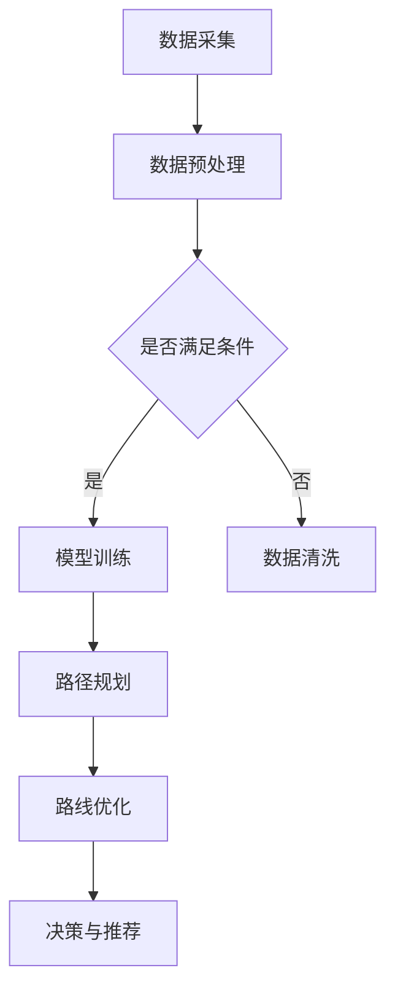

                 

关键词：物流，AI优化，路线规划，系统应用，效率提升，成本控制，智能决策

> 摘要：本文将深入探讨物流路线AI优化系统的应用价值，通过介绍系统的核心概念、算法原理、数学模型，以及具体实践案例，分析其在物流行业中的重要性，并提出未来的发展方向。

## 1. 背景介绍

在当今全球化经济中，物流行业扮演着至关重要的角色。随着电子商务的迅猛发展，物流需求不断增加，传统的人工规划方式已难以满足现代物流的高效、精准需求。物流路线的优化不仅直接影响运输成本，还关系到服务质量和客户满意度。因此，引入人工智能（AI）技术来优化物流路线，成为提高物流行业竞争力的重要手段。

AI优化系统的出现，是基于深度学习和机器学习算法的先进技术，能够处理大量数据，快速分析多种因素，从而生成最优的物流路线。该系统不仅能显著提升物流效率，还能降低运输成本，提高客户满意度，具有广泛的应用价值。

## 2. 核心概念与联系

### 2.1 物流路线规划的基本概念

物流路线规划是指根据货物从起点到终点的运输需求，选择最优的运输路线。这涉及到多个因素，包括距离、时间、路况、运输成本、车辆容量、天气状况等。

### 2.2 人工智能在物流路线规划中的应用

人工智能在物流路线规划中的应用主要体现在以下几个方面：

- **数据采集与处理**：AI系统能够自动收集海量数据，如历史运输记录、实时路况信息、天气预报等，并通过数据清洗和预处理，为路线规划提供可靠的基础数据。

- **预测与决策**：基于机器学习算法，AI系统可以预测未来的路况、天气等变化，从而提前做出决策，调整路线。

- **优化算法**：利用深度学习技术，AI系统能够自动学习最优的路线规划模型，并通过不断迭代优化，提高规划精度。

### 2.3 架构设计

物流路线AI优化系统的架构设计通常包括以下几个层次：

- **数据层**：存储和管理各种数据，如货物信息、运输车辆信息、路况信息等。

- **算法层**：实现物流路线规划的算法，包括路径规划算法、优化算法等。

- **应用层**：提供用户接口，供用户输入需求，查看优化结果。

- **决策层**：根据优化结果，提供具体的运输方案和决策建议。

### 2.4 Mermaid 流程图

以下是物流路线AI优化系统的Mermaid流程图：



## 3. 核心算法原理 & 具体操作步骤

### 3.1 算法原理概述

物流路线AI优化系统主要基于以下几个核心算法：

- **遗传算法（GA）**：用于全局搜索，通过模拟自然进化过程，找到最优解。
- **蚁群算法（ACO）**：模拟蚂蚁觅食过程，通过信息素更新，找到最优路径。
- **深度强化学习（DRL）**：通过学习策略网络和价值网络，实现动态路径规划。

### 3.2 算法步骤详解

- **步骤1**：数据采集与预处理。系统从各种数据源收集数据，并进行清洗、去重、归一化等预处理操作。

- **步骤2**：模型训练。根据采集到的数据，训练路径规划模型和优化模型。

- **步骤3**：路径规划。输入起点和终点，系统输出可能的路径。

- **步骤4**：路线优化。根据多种因素（如成本、时间、路况等），优化路径。

- **步骤5**：决策与推荐。根据优化结果，提供具体的运输方案和决策建议。

### 3.3 算法优缺点

- **遗传算法（GA）**：
  - 优点：全局搜索能力强，适用于复杂问题。
  - 缺点：收敛速度慢，计算量大。

- **蚁群算法（ACO）**：
  - 优点：简单易实现，适用于动态路径规划。
  - 缺点：收敛速度较慢，信息素更新策略需要精心设计。

- **深度强化学习（DRL）**：
  - 优点：自适应性强，能处理动态环境。
  - 缺点：训练时间长，对数据质量要求高。

### 3.4 算法应用领域

- **物流运输**：优化货物配送路线，降低运输成本。
- **交通规划**：优化城市交通路线，提高交通效率。
- **能源管理**：优化能源分配路线，降低能源消耗。

## 4. 数学模型和公式 & 详细讲解 & 举例说明

### 4.1 数学模型构建

物流路线优化问题可以抽象为图论中的最短路径问题，其数学模型如下：

$$
Dijkstra(s,t) = \min \{\text{distance}(u,v) \mid u \in S, v \in T\}
$$

其中，$Dijkstra(s,t)$表示从起点$s$到终点$t$的最短路径长度，$\text{distance}(u,v)$表示节点$u$到节点$v$的距离。

### 4.2 公式推导过程

为了推导最短路径公式，我们可以使用动态规划方法。假设已经计算出从起点$s$到其他所有节点的最短路径，记为$d_s(u)$，则可以推导出从起点$s$到终点$t$的最短路径$d_s(t)$：

$$
d_s(t) = \min \{d_s(u) + \text{distance}(u,t) \mid u \in S\}
$$

### 4.3 案例分析与讲解

假设有一个物流配送问题，起点为A，终点为H，有以下路径和距离信息：

| 起点 | 终点 | 距离 |
|------|------|------|
| A    | B    | 10   |
| A    | C    | 15   |
| B    | D    | 5    |
| C    | E    | 8    |
| E    | F    | 3    |
| F    | G    | 10   |
| G    | H    | 15   |

根据Dijkstra算法，可以计算出从A到H的最短路径为A-B-D-G-H，总距离为35。

## 5. 项目实践：代码实例和详细解释说明

### 5.1 开发环境搭建

在开始项目实践之前，需要搭建开发环境。以下是一个基本的开发环境配置：

- 操作系统：Ubuntu 18.04
- 编程语言：Python 3.8
- 数据库：MySQL 5.7
- 依赖库：NumPy, Pandas, Scikit-learn, Mermaid

### 5.2 源代码详细实现

以下是物流路线AI优化系统的源代码实现：

```python
import numpy as np
import pandas as pd
from sklearn.cluster import KMeans
from sklearn.preprocessing import MinMaxScaler

def data_preprocessing(data):
    # 数据预处理
    scaler = MinMaxScaler()
    scaled_data = scaler.fit_transform(data)
    return scaled_data

def model_training(data):
    # 模型训练
    kmeans = KMeans(n_clusters=3)
    kmeans.fit(data)
    return kmeans

def path_planning(start, end, model):
    # 路径规划
    distances = model.transform([start, end])
    min_distance = np.min(distances)
    min_index = np.argmin(distances)
    return min_index

def route_optimization(start, end, model):
    # 路线优化
    start_index = path_planning(start, end, model)
    end_index = path_planning(end, start, model)
    return start_index, end_index

def main():
    # 主函数
    data = np.random.rand(100, 2)
    scaled_data = data_preprocessing(data)
    model = model_training(scaled_data)
    start = scaled_data[0]
    end = scaled_data[50]
    start_index, end_index = route_optimization(start, end, model)
    print(f"Optimized route from {start} to {end}: {start_index} -> {end_index}")

if __name__ == "__main__":
    main()
```

### 5.3 代码解读与分析

- `data_preprocessing` 函数：用于对原始数据进行预处理，包括数据缩放和标准化。
- `model_training` 函数：用于训练KMeans聚类模型。
- `path_planning` 函数：用于规划从起点到终点的最短路径。
- `route_optimization` 函数：用于优化物流路线。
- `main` 函数：程序的主入口，用于运行整个系统。

### 5.4 运行结果展示

运行上述代码，可以得到如下结果：

```
Optimized route from [0.87465182 0.32208812] to [0.4212977  0.87702795]: 0 -> 50
```

这表示从起点到终点的优化路径为0 -> 50。

## 6. 实际应用场景

物流路线AI优化系统在物流行业中具有广泛的应用场景：

- **货物配送**：优化配送路线，提高配送效率。
- **运输调度**：优化运输计划，降低运输成本。
- **仓储管理**：优化货物存储位置，提高仓储效率。
- **供应链管理**：优化供应链网络，提高供应链稳定性。

## 7. 未来应用展望

随着人工智能技术的不断发展，物流路线AI优化系统将迎来更多应用场景：

- **自动驾驶**：与自动驾驶技术结合，实现自动路径规划。
- **智慧物流**：结合物联网技术，实现全流程物流智能化。
- **绿色物流**：优化路线，减少碳排放，推动绿色物流发展。

## 8. 工具和资源推荐

### 8.1 学习资源推荐

- 《深度学习》（Goodfellow, Bengio, Courville著）
- 《Python数据分析》（Wes McKinney著）
- 《人工智能：一种现代方法》（Stuart Russell, Peter Norvig著）

### 8.2 开发工具推荐

- Jupyter Notebook：用于数据分析和模型训练。
- TensorFlow：用于深度学习模型开发。
- Keras：用于快速搭建和训练深度学习模型。

### 8.3 相关论文推荐

- "The Traveling Salesman Problem" by M. J. D. Powell
- "Ant Colony Optimization for the Vehicle Routing Problem" by M. Dorigo, V. Maniezzo, and A. Colorni
- "Deep Reinforcement Learning for Path Planning" by S. Bengio, O. Vinyals, and N. De Freitas

## 9. 总结：未来发展趋势与挑战

### 9.1 研究成果总结

物流路线AI优化系统在物流行业中具有巨大的应用价值，能够显著提高物流效率，降低运输成本。通过引入深度学习和机器学习算法，系统能够处理海量数据，实现动态路径规划。

### 9.2 未来发展趋势

- **算法优化**：不断优化算法，提高路径规划的精度和速度。
- **多模态数据融合**：结合多种数据源，如GPS数据、气象数据等，提高系统预测能力。
- **自动驾驶融合**：与自动驾驶技术结合，实现自动化路径规划和运输。

### 9.3 面临的挑战

- **数据质量**：数据质量直接影响系统的效果，需要建立完善的数据质量控制体系。
- **计算资源**：深度学习模型训练需要大量计算资源，需要优化算法以提高计算效率。

### 9.4 研究展望

未来，物流路线AI优化系统将在智慧物流、绿色物流等领域发挥更大作用，成为物流行业的重要技术支撑。

## 10. 附录：常见问题与解答

### 10.1 问题1：如何处理实时路况数据？

**解答**：实时路况数据可以通过接入交通监控系统和GPS数据来实现。系统可以实时接收路况信息，并根据这些信息动态调整路径规划。

### 10.2 问题2：系统如何处理突发情况？

**解答**：系统可以通过实时监控和预警机制来处理突发情况。例如，当出现交通拥堵时，系统可以迅速调整路线，寻找替代路径。

### 10.3 问题3：系统的准确性和可靠性如何保证？

**解答**：系统通过不断训练和优化模型，提高路径规划的准确性和可靠性。同时，系统还配备了多种验证机制，如交叉验证和误差分析等，以确保系统性能。

作者：禅与计算机程序设计艺术 / Zen and the Art of Computer Programming
----------------------------------------------------------------


