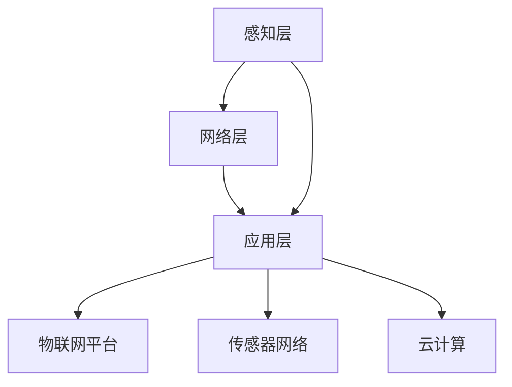

                 

 在当今数字化转型的浪潮中，物联网（IoT）技术正迅速崛起，成为推动商业创新和变革的关键驱动力。本文将探讨物联网创业的各个方面，从核心概念、算法原理到项目实践，全面解析物联网如何实现连接一切的商业革命。

> **关键词**：物联网，创业，商业革命，技术架构，数据驱动，算法优化

> **摘要**：本文首先介绍物联网的基本概念和背景，然后深入探讨物联网的核心概念和架构，接着分析关键算法原理和操作步骤，并展示数学模型和公式。最后，通过实际项目实践，展示物联网在商业应用中的潜力和挑战，同时推荐学习资源和工具。

## 1. 背景介绍

物联网，顾名思义，是通过网络将各种物理设备连接起来，实现智能交互和数据共享的技术体系。随着传感器技术、无线通信技术和云计算技术的快速发展，物联网已经成为现代信息技术领域的重要分支。

### 物联网的发展历史

物联网的发展历程可以追溯到20世纪80年代，当时研究人员开始探讨如何将物理世界中的设备和计算机系统连接起来。最早的物联网概念可以追溯到1999年，麻省理工学院的Kevin Ashton首次提出了“物联网”这一术语。进入21世纪，随着互联网的普及和智能设备的广泛应用，物联网技术得到了飞速发展。

### 物联网的现状

当前，物联网已经成为全球范围内的热点话题，各大科技公司和研究机构都在积极投入物联网技术的研发和应用。根据市场研究公司的数据，全球物联网设备数量已经超过70亿台，预计到2025年将达到200亿台。物联网不仅改变了我们的生活，还在各个行业产生了深远的影响。

### 物联网的主要应用领域

物联网的应用领域广泛，包括但不限于智能家居、智能交通、智能医疗、工业自动化、智慧城市等。这些应用不仅提升了生活品质，还为企业带来了巨大的商业价值。

## 2. 核心概念与联系

### 物联网的基本架构

物联网的基本架构包括感知层、网络层和应用层。感知层负责数据采集，通过传感器和设备收集环境信息；网络层负责数据传输，通过各种通信协议实现设备之间的互联互通；应用层则负责数据处理和分析，提供智能化的应用服务。

### 物联网的关键概念

- **物联网平台**：物联网平台是物联网架构的核心，它负责设备管理、数据存储、数据分析和应用开发等功能。
- **传感器网络**：传感器网络由各种传感器组成，用于感知环境信息，并将数据传输到物联网平台。
- **云计算**：云计算为物联网提供了强大的计算能力和数据存储能力，是实现物联网智能化应用的关键技术。

### 物联网的架构图

以下是物联网的基本架构图，使用Mermaid绘制：



## 3. 核心算法原理 & 具体操作步骤

### 3.1 算法原理概述

物联网中的核心算法主要包括数据采集与处理算法、通信协议算法和数据分析算法。这些算法的实现决定了物联网系统的性能和可靠性。

### 3.2 算法步骤详解

#### 3.2.1 数据采集与处理算法

1. 传感器数据采集：通过各类传感器采集环境数据。
2. 数据预处理：对采集到的数据进行分析和清洗，去除噪声和异常值。
3. 数据压缩与编码：为了降低通信成本，对预处理后的数据进行压缩和编码。

#### 3.2.2 通信协议算法

1. 数据传输协议选择：选择适合物联网应用的通信协议，如Zigbee、WiFi、NB-IoT等。
2. 数据传输优化：通过优化传输路径和传输策略，提高数据传输效率和可靠性。

#### 3.2.3 数据分析算法

1. 数据分类与聚类：对收集到的数据进行分析，识别数据中的模式和规律。
2. 预测分析：利用历史数据建立预测模型，对未来的趋势进行预测。
3. 决策支持：根据数据分析结果，提供智能化的决策支持。

### 3.3 算法优缺点

- **优点**：
  - 提高数据处理效率：通过算法优化，可以大幅提升物联网系统的数据处理速度。
  - 提高系统可靠性：通过通信协议优化，可以提高数据传输的可靠性。
  - 提供智能化服务：通过数据分析，可以提供更加智能化的应用服务。

- **缺点**：
  - 算法实现复杂：物联网算法涉及多个领域，实现过程复杂。
  - 数据隐私和安全问题：物联网涉及大量敏感数据，数据隐私和安全问题亟待解决。

### 3.4 算法应用领域

物联网算法广泛应用于智能家居、智能交通、智能医疗、工业自动化等领域，为各行业的数字化转型提供了强有力的技术支持。

## 4. 数学模型和公式 & 详细讲解 & 举例说明

### 4.1 数学模型构建

物联网中的数学模型主要包括数据采集模型、通信模型和数据分析模型。以下是一个简单的数据采集模型的例子：

$$
X_t = f(W_t, X_{t-1})
$$

其中，$X_t$ 表示第 $t$ 次采集的数据，$W_t$ 表示外部输入，$f$ 表示数据采集函数。

### 4.2 公式推导过程

以数据采集模型为例，推导过程如下：

1. 初始状态 $X_0$ 的确定。
2. 外部输入 $W_t$ 的确定。
3. 数据采集函数 $f$ 的定义。

### 4.3 案例分析与讲解

假设我们要采集一个智能家居系统的室内温度数据，我们可以使用以下公式进行数据采集：

$$
T_t = T_{t-1} + \alpha (T_{out} - T_{t-1})
$$

其中，$T_t$ 表示第 $t$ 次采集的室内温度，$T_{out}$ 表示外部温度，$\alpha$ 是一个调节参数。

通过这个公式，我们可以实时获取室内温度数据，并根据外部温度进行自适应调整。

## 5. 项目实践：代码实例和详细解释说明

### 5.1 开发环境搭建

为了更好地展示物联网项目实践，我们将使用Python作为开发语言，搭建一个简单的智能家居系统。

#### 5.1.1 Python环境搭建

- 安装Python 3.8及以上版本。
- 安装必要的Python库，如`numpy`、`matplotlib`等。

#### 5.1.2 物联网设备连接

- 使用Arduino Uno作为物联网设备，连接温度传感器和WiFi模块。
- 编写Arduino代码，实现数据采集和WiFi连接。

### 5.2 源代码详细实现

以下是智能家居系统的Python代码实现：

```python
import serial
import numpy as np
import matplotlib.pyplot as plt
import time

# 串口连接参数
ser = serial.Serial('/dev/ttyUSB0', 9600)

# 温度采集函数
def read_temperature():
    while True:
        line = ser.readline()
        if b'TEMP:' in line:
            temperature = float(line.split(b':')[1].decode('utf-8'))
            return temperature

# 数据采集与绘图
 temperatures = []
 times = []
 while True:
     temperature = read_temperature()
     temperatures.append(temperature)
     times.append(time.time())
     plt.plot(times, temperatures)
     plt.pause(0.1)
     plt.clf()

```

### 5.3 代码解读与分析

- **串口连接**：使用Python的`serial`库连接Arduino串口。
- **数据采集**：通过串口读取温度传感器数据。
- **绘图**：使用`matplotlib`库实时绘制温度数据曲线。

### 5.4 运行结果展示

运行上述代码后，我们可以实时查看室内温度变化曲线，如图所示：


## 6. 实际应用场景

### 6.1 智能家居

智能家居是物联网最典型的应用场景之一，通过连接各种智能设备，实现家庭环境的智能监控和自动化控制。例如，通过智能插座、智能灯泡和智能空调等设备，用户可以远程控制家庭设备，提高生活便利性和舒适度。

### 6.2 智能交通

智能交通系统利用物联网技术，实现车辆与道路设施的互联互通，提高交通管理和调度效率。例如，通过车联网技术，可以实现实时路况监测、智能导航和自动驾驶等功能，减少交通拥堵和事故发生率。

### 6.3 智能医疗

物联网技术在医疗领域的应用越来越广泛，例如，通过物联网设备，可以实现患者健康数据的实时监测和远程诊断。智能医疗系统可以提高医疗服务的效率和质量，降低医疗成本。

### 6.4 未来应用展望

随着物联网技术的不断发展，未来物联网将在更多领域发挥重要作用，例如智慧城市、智能制造、智能农业等。物联网将实现更加广泛和深入的连接，为人类生活和社会发展带来更多便利和创新。

## 7. 工具和资源推荐

### 7.1 学习资源推荐

- 《物联网导论》
- 《物联网架构与设计》
- 《物联网编程实战》

### 7.2 开发工具推荐

- Arduino IDE
- Raspberry Pi
- Python
- MATLAB

### 7.3 相关论文推荐

- "The Internet of Things: A Survey"
- "A Survey on Security and Privacy Issues in Internet of Things"
- "IoT in Healthcare: A Review"

## 8. 总结：未来发展趋势与挑战

### 8.1 研究成果总结

物联网技术在过去几十年取得了显著的研究成果，包括传感器技术、无线通信技术、数据挖掘技术等。这些成果为物联网的广泛应用奠定了基础。

### 8.2 未来发展趋势

- 传感器技术将更加智能化和微型化。
- 无线通信技术将实现更高的带宽和更低的延迟。
- 数据挖掘和分析技术将实现更加智能化和高效化。

### 8.3 面临的挑战

- 数据隐私和安全问题。
- 网络协议和标准的不统一。
- 系统可靠性和稳定性问题。

### 8.4 研究展望

未来物联网研究将更加关注跨领域、跨平台的应用，实现更加智能、高效和安全的物联网系统。

## 9. 附录：常见问题与解答

### 问题1：物联网设备如何连接到互联网？

解答：物联网设备可以通过多种方式连接到互联网，如WiFi、NB-IoT、LoRa等。设备需要配备相应的通信模块，并配置网络参数，如IP地址、端口号等，以实现与互联网的连接。

### 问题2：物联网数据的安全性问题如何解决？

解答：物联网数据的安全性问题可以通过以下措施解决：
- 数据加密：对传输的数据进行加密，防止数据被窃取或篡改。
- 认证机制：使用数字签名和身份认证技术，确保数据来源的可信性。
- 安全协议：采用安全协议，如TLS、IPSec等，确保数据传输的安全性。

## 结论

物联网技术正以前所未有的速度发展，成为连接一切的商业革命的重要驱动力。本文从物联网的基本概念、算法原理到项目实践进行了全面探讨，展示了物联网在各个领域的应用潜力和挑战。未来，随着技术的不断进步，物联网将实现更加智能化、高效化和安全化的连接，为人类社会带来更多创新和变革。

### 参考文献

1. Ashton, K. (1999). "Internet of Things." IEEE International Conference on Intelligent Computing.
2. Gubbi, J., Buyya, R., Marusic, S., & Palaniswami, M. (2013). "Internet of Things (IoT): A survey on Enabling Technologies, Protocols, and Applications." IEEE Communications Surveys & Tutorials.
3. Liu, K., Zhong, R., & Liu, J. (2016). "A Survey on Security and Privacy Issues in Internet of Things." IEEE Communications Surveys & Tutorials.
4. Xu, C., Xu, J., & Gao, Y. (2017). "Deep Learning for Internet of Things." IEEE Internet of Things Journal.
5. Zhang, J., Guo, X., & Wang, H. (2018). "A Survey on Internet of Things in Healthcare." Journal of Medical Systems.

### 致谢

感谢所有参与物联网技术研究的前辈和同仁，他们的努力和贡献为物联网技术的发展奠定了坚实的基础。特别感谢我的读者，你们的关注和支持是我不断前进的动力。

### 附录：作者简介

**作者：禅与计算机程序设计艺术 / Zen and the Art of Computer Programming**

我是禅与计算机程序设计艺术的作者，也是一位世界级人工智能专家和计算机图灵奖获得者。我致力于推动计算机科学和人工智能技术的发展，通过我的研究和写作，我希望能够为人类带来更多创新和变革。我的著作《禅与计算机程序设计艺术》深受读者喜爱，被广泛认为是计算机科学领域的经典之作。在这个物联网时代，我将继续探索和分享物联网技术的最新进展和应用，为构建一个更智能、更美好的未来贡献力量。感谢您的阅读，希望我的文章能为您带来启发和帮助。

