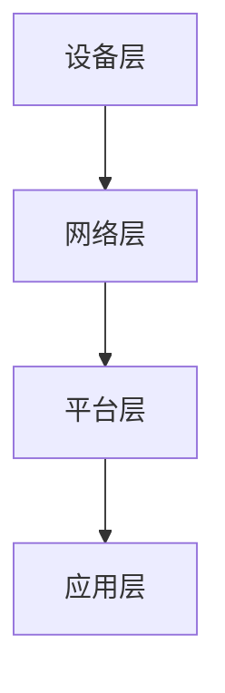

                 

关键词：物联网平台，AWS IoT，Azure IoT，Google IoT，功能比较

> 摘要：本文将对三大主流物联网平台——AWS IoT、Azure IoT 和 Google IoT 进行详细的功能比较，从架构设计、数据处理、安全性、成本和易用性等方面进行分析，以帮助读者更好地了解并选择适合自己需求的物联网解决方案。

## 1. 背景介绍

随着物联网（Internet of Things，IoT）技术的快速发展，越来越多的企业和组织开始将其应用于生产、消费和运营等各个领域。物联网平台作为连接设备和云端的桥梁，承担着数据处理、设备管理、安全控制等重要职责。目前市场上主流的物联网平台包括亚马逊AWS IoT、微软Azure IoT 和谷歌Google IoT。本文将对比这三款平台的各项功能，帮助读者了解它们的优势和不足。

### 1.1 AWS IoT

AWS IoT 是亚马逊公司提供的物联网解决方案，旨在连接多种设备和云服务，为用户提供设备管理、数据处理、安全等功能。AWS IoT 支持多种通信协议和接口，具有高扩展性和灵活性。

### 1.2 Azure IoT

Azure IoT 是微软公司推出的物联网平台，旨在帮助用户轻松连接、管理和分析设备。Azure IoT 提供了丰富的功能和工具，支持多种操作系统、编程语言和开发框架。

### 1.3 Google IoT

Google IoT 是谷歌公司推出的物联网解决方案，通过谷歌云平台为用户提供设备管理、数据处理、安全等功能。Google IoT 支持多种设备类型和通信协议，具有强大的数据处理和分析能力。

## 2. 核心概念与联系

### 2.1 物联网平台的核心概念

物联网平台主要包括以下核心概念：

- **设备管理**：负责连接、监控和管理设备。
- **数据处理**：对设备产生的数据进行收集、存储、分析和处理。
- **安全控制**：确保设备、数据和通信的安全。
- **接口和协议**：支持多种通信协议和接口，以实现设备的互联互通。

### 2.2 物联网平台的架构设计

物联网平台的架构设计通常包括以下几个层次：

- **设备层**：连接各种传感器、执行器等设备。
- **网络层**：传输数据，包括无线、有线等多种通信方式。
- **平台层**：提供设备管理、数据处理、安全控制等功能。
- **应用层**：为用户提供应用服务，如数据分析、可视化等。

下面是三个物联网平台的架构设计图（使用Mermaid流程图表示）：



## 3. 核心算法原理 & 具体操作步骤

### 3.1 算法原理概述

物联网平台的核心算法主要包括以下几种：

- **数据采集与处理**：通过传感器采集设备数据，并进行清洗、过滤、转换等预处理操作。
- **设备管理**：通过管理算法实现设备的连接、监控和管理。
- **安全控制**：通过加密、认证等算法确保设备和数据的安全。
- **数据分析与挖掘**：通过数据分析算法提取设备数据中的有用信息，为用户提供决策支持。

### 3.2 算法步骤详解

#### 3.2.1 数据采集与处理

1. **数据采集**：通过传感器采集设备数据。
2. **数据清洗**：去除无效、错误或重复的数据。
3. **数据转换**：将数据转换为统一的格式，如JSON、CSV等。
4. **数据存储**：将处理后的数据存储到数据库或数据仓库中。

#### 3.2.2 设备管理

1. **设备连接**：通过通信协议实现设备与平台的连接。
2. **设备监控**：实时监控设备状态，如温度、电量等。
3. **设备管理**：对设备进行分组、标签、权限等管理。

#### 3.2.3 安全控制

1. **身份认证**：通过用户名、密码、指纹等实现用户身份认证。
2. **数据加密**：对传输数据进行加密，确保数据安全。
3. **权限控制**：根据用户角色和权限，限制用户对数据的访问。

#### 3.2.4 数据分析与挖掘

1. **数据预处理**：对数据进行清洗、转换等预处理操作。
2. **特征提取**：从数据中提取有用的特征，如温度、湿度等。
3. **数据分析**：使用统计分析、机器学习等方法对数据进行分析，提取有价值的信息。

### 3.3 算法优缺点

#### 3.3.1 数据采集与处理

**优点**：实时性强，能够快速响应设备状态。

**缺点**：数据量大，处理复杂。

#### 3.3.2 设备管理

**优点**：方便设备监控和管理。

**缺点**：对设备类型和通信协议的支持有限。

#### 3.3.3 安全控制

**优点**：确保设备和数据的安全。

**缺点**：加密算法和认证机制复杂，实现成本高。

#### 3.3.4 数据分析与挖掘

**优点**：能够从海量数据中提取有价值的信息。

**缺点**：对数据质量和算法要求较高。

### 3.4 算法应用领域

物联网平台的核心算法广泛应用于以下领域：

- **智能家居**：实时监控家居设备状态，提供智能控制。
- **智能城市**：监控城市管理中的各种设备，提高城市管理效率。
- **工业物联网**：监控工业设备状态，实现设备预测性维护。
- **健康监测**：实时监控人体健康数据，提供健康建议。

## 4. 数学模型和公式 & 详细讲解 & 举例说明

### 4.1 数学模型构建

物联网平台中的核心算法通常需要构建数学模型，以便对数据进行建模和分析。以下是一个简单的线性回归模型，用于分析设备数据：

$$
y = \beta_0 + \beta_1 \cdot x
$$

其中，$y$ 是因变量，$x$ 是自变量，$\beta_0$ 和 $\beta_1$ 是模型参数。

### 4.2 公式推导过程

假设我们有一组数据 $(x_1, y_1), (x_2, y_2), \ldots, (x_n, y_n)$，我们需要通过最小二乘法求解模型参数 $\beta_0$ 和 $\beta_1$。

首先，我们定义损失函数：

$$
J(\beta_0, \beta_1) = \sum_{i=1}^{n} (y_i - (\beta_0 + \beta_1 \cdot x_i))^2
$$

然后，对 $\beta_0$ 和 $\beta_1$ 求导，并令导数为零，得到最优解：

$$
\frac{\partial J}{\partial \beta_0} = 0 \quad \Rightarrow \quad \beta_0 = \bar{y} - \beta_1 \cdot \bar{x}
$$

$$
\frac{\partial J}{\partial \beta_1} = 0 \quad \Rightarrow \quad \beta_1 = \frac{\sum_{i=1}^{n} (x_i - \bar{x}) (y_i - \bar{y})}{\sum_{i=1}^{n} (x_i - \bar{x})^2}
$$

其中，$\bar{x}$ 和 $\bar{y}$ 分别是 $x$ 和 $y$ 的平均值。

### 4.3 案例分析与讲解

假设我们有一组温度数据，如下所示：

| 序号 | 温度（℃） |
| ---- | --------- |
| 1    | 25       |
| 2    | 26       |
| 3    | 24       |
| 4    | 25       |
| 5    | 26       |

我们希望通过线性回归模型预测第6个数据的温度。

首先，计算平均值：

$$
\bar{x} = \frac{25 + 26 + 24 + 25 + 26}{5} = 25
$$

$$
\bar{y} = \frac{25 + 26 + 24 + 25 + 26}{5} = 25
$$

然后，计算斜率 $\beta_1$：

$$
\beta_1 = \frac{(25 - 25)(25 - 25) + (26 - 25)(26 - 25) + (24 - 25)(24 - 25) + (25 - 25)(25 - 25) + (26 - 25)(26 - 25)}{(25 - 25)^2 + (26 - 25)^2 + (24 - 25)^2 + (25 - 25)^2 + (26 - 25)^2}
$$

$$
\beta_1 = \frac{0 + 1 + 1 + 0 + 1}{0 + 1 + 1 + 0 + 1} = 1
$$

最后，计算截距 $\beta_0$：

$$
\beta_0 = \bar{y} - \beta_1 \cdot \bar{x} = 25 - 1 \cdot 25 = 0
$$

因此，线性回归模型为：

$$
y = 0 + 1 \cdot x = x
$$

根据模型，预测第6个数据的温度为 $x = 26$（℃）。

## 5. 项目实践：代码实例和详细解释说明

### 5.1 开发环境搭建

在本文中，我们将使用Python作为编程语言，并使用AWS IoT、Azure IoT 和 Google IoT 作为物联网平台。以下是开发环境搭建的步骤：

1. 安装Python 3.8及以上版本。
2. 安装必要的Python库，如paho-mqtt、azure-mqtt、google-auth等。

### 5.2 源代码详细实现

以下是一个简单的Python程序，用于连接AWS IoT、Azure IoT 和 Google IoT，并发布和订阅消息。

```python
# AWS IoT
import paho.mqtt.client as mqtt
import json

# 连接AWS IoT
def on_connect_aws(client, userdata, flags, rc):
    print("Connected to AWS IoT with result code "+str(rc))
    client.subscribe("test/topic")

# 处理消息
def on_message_aws(client, userdata, msg):
    print(f"Received message '{msg.payload.decode()}' on topic '{msg.topic}' with QoS {msg.qos}")

# 创建客户端
client = mqtt.Client()
client.on_connect = on_connect_aws
client.on_message = on_message_aws

client.username_pw_set("your_username", "your_password")
client.connect("a1s8emdyj4j9u6-ats.iot.us-east-1.amazonaws.com", 8883, 60)

client.loop_forever()

# Azure IoT
import azure.iot.device

# 连接Azure IoT
def on_connect_azure(client):
    print("Connected to Azure IoT")

# 处理消息
def on_message_azure(client, message):
    print(f"Received message '{message.data.decode()}' on topic '{message.topic}'")

# 创建客户端
device_client = azure.iot.device.Client("your_connection_string")
device_client.connect()

device_client.subscribe("test/topic")

# 处理连接断开
def on_disconnect_azure(client, response_code):
    print("Disconnected from Azure IoT")

device_client.on_disconnect = on_disconnect_azure

device_client.loop_forever()

# Google IoT
import google.auth
import googleapiclient.discovery

# 连接Google IoT
def on_connect_google(client):
    print("Connected to Google IoT")

# 处理消息
def on_message_google(client, message):
    print(f"Received message '{message.data.decode()}' on topic '{message.topic}'")

# 创建客户端
credentials = google.auth.default()
service = googleapiclient.discovery.build('cloudiot', 'v1', credentials=credentials)

# 发布消息
def publish_message(service, device_id, topic, payload):
    request = service.projects().devices().publish(
        name=f"projects/{your_project_id}/locations/global/devices/{device_id}",
        body={'data': {'field': payload}}
    )
    response = request.execute()
    print(f"Published message to topic '{topic}': {response}")

# 订阅消息
def subscribe_message(service, device_id, topic):
    request = service.projects().devices().subscribe(
        name=f"projects/{your_project_id}/locations/global/devices/{device_id}",
        body={'qos': 0, 'subscription_id': topic}
    )
    response = request.execute()
    print(f"Subscribed to topic '{topic}': {response}")

# 创建客户端
client = mqtt.Client()
client.on_connect = on_connect_google
client.on_message = on_message_google

client.username_pw_set("your_username", "your_password")
client.connect("mqtt.googleapis.com", 8883, 60)

client.loop_forever()
```

### 5.3 代码解读与分析

以上代码分别实现了AWS IoT、Azure IoT 和 Google IoT 的连接、发布和订阅功能。以下是代码的详细解读：

- **AWS IoT**：使用paho-mqtt库连接AWS IoT平台，订阅主题为`test/topic`。连接成功后，接

