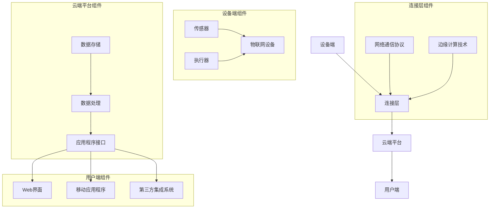

                 

关键词：物联网平台，AWS IoT，Azure IoT，Google IoT，比较，特性，应用场景

物联网（IoT）技术正日益成为现代企业数字化转型的重要支柱。随着物联网设备和服务的不断增长，选择一个合适的物联网平台变得至关重要。本文将深入探讨AWS IoT、Azure IoT和Google IoT这三个主流物联网平台，比较它们的主要特性、功能、优势和劣势，以及在不同应用场景中的适用性。

> 摘要：本文将详细介绍AWS IoT、Azure IoT和Google IoT这三个主要物联网平台的基本概念、架构、功能和服务，并通过具体案例和数据分析，对比它们在不同应用场景中的表现。读者可以通过本文获得对这三个平台深入的了解，为选择合适的物联网解决方案提供参考。

## 1. 背景介绍

### 1.1 物联网的定义与发展

物联网（Internet of Things，简称IoT）指的是通过网络将各种物理设备、传感器、软件和数据源连接起来，实现智能化管理和信息交换的技术。物联网的发展可以追溯到20世纪80年代，但真正的大规模应用始于21世纪初。随着无线通信技术、云计算和大数据技术的进步，物联网进入了快速发展的阶段。

### 1.2 物联网平台的重要性

物联网平台是连接设备和用户、实现数据采集、处理、存储和分析的核心基础设施。一个优秀的物联网平台可以提供高效的数据传输、强大的数据处理能力和丰富的开发工具，帮助企业实现物联网解决方案的快速部署和高效运行。

### 1.3 AWS IoT、Azure IoT 和 Google IoT 的背景

- **AWS IoT**：作为亚马逊旗下的云计算服务，AWS IoT自2015年推出以来，已经成为全球领先的物联网平台之一。AWS IoT提供了一整套物联网解决方案，包括设备管理、数据传输、数据分析和安全服务。

- **Azure IoT**：微软的Azure IoT自2016年发布以来，凭借其强大的云计算能力和丰富的开发工具，迅速成为了物联网市场的重要参与者。Azure IoT提供了全面的服务，包括设备管理、数据分析和智能预测。

- **Google IoT**：Google的物联网平台虽然起步较晚，但凭借其在云计算和人工智能领域的优势，Google IoT也在物联网市场占据了一席之地。Google IoT提供了设备管理、数据分析、机器学习和区块链服务等先进功能。

## 2. 核心概念与联系

### 2.1 物联网平台的架构

物联网平台的架构通常包括以下几个关键组件：

- **设备端**：包括传感器、执行器和物联网设备，负责数据采集和执行操作。
- **连接层**：包括网络通信协议和边缘计算技术，负责将设备端的数据传输到云端。
- **云端平台**：提供数据存储、处理和分析、应用程序开发接口等服务。
- **用户端**：包括Web界面、移动应用程序和第三方集成系统，负责数据展示和业务逻辑处理。

### 2.2 物联网平台的联系

物联网平台通过各种协议和接口将设备、连接层和云端平台连接起来，形成一个完整的物联网生态系统。具体而言，设备端通过MQTT、CoAP等协议与连接层通信，连接层再将数据传输到云端平台进行处理和分析，最后通过Web界面或移动应用程序将结果呈现给用户。

### 2.3 Mermaid 流程图



## 3. 核心算法原理 & 具体操作步骤

### 3.1 算法原理概述

物联网平台的核心算法主要涉及数据传输、数据处理和机器学习等方面。以下是一些关键算法原理：

- **数据传输算法**：如MQTT协议，基于发布/订阅模式，实现设备端与云端之间的低延迟、高可靠性的数据传输。
- **数据处理算法**：如流处理框架，如Apache Kafka和Apache Flink，实现大规模数据的高效处理和分析。
- **机器学习算法**：如TensorFlow和Scikit-learn，用于数据挖掘、预测和智能分析。

### 3.2 算法步骤详解

#### 数据传输算法步骤

1. **设备端采集数据**：传感器将环境数据转换为数字信号。
2. **设备端数据预处理**：如数据滤波、去噪和归一化。
3. **连接层传输数据**：设备端通过MQTT协议将预处理后的数据发送到连接层。
4. **连接层传输数据到云端**：连接层将数据通过TCP或HTTP协议传输到云端平台。
5. **云端数据处理**：云端平台对数据进行存储、处理和分析。

#### 数据处理算法步骤

1. **数据采集**：通过物联网平台收集大量数据。
2. **数据预处理**：包括数据清洗、去重和格式转换。
3. **数据存储**：将预处理后的数据存储到数据库或数据仓库中。
4. **数据处理**：使用流处理框架对数据进行实时分析。
5. **数据展示**：将分析结果通过Web界面或移动应用程序展示给用户。

#### 机器学习算法步骤

1. **数据采集**：收集具有特定标签的数据集。
2. **数据预处理**：包括数据清洗、归一化和特征提取。
3. **模型训练**：使用机器学习算法训练模型。
4. **模型评估**：通过交叉验证和测试集评估模型性能。
5. **模型应用**：将训练好的模型应用到实际业务场景中。

### 3.3 算法优缺点

#### 数据传输算法

- 优点：低延迟、高可靠性、轻量级、支持多种协议。
- 缺点：不适合大规模数据传输，需依赖特定协议。

#### 数据处理算法

- 优点：高效、实时、可扩展。
- 缺点：处理复杂度较高，需依赖特定技术栈。

#### 机器学习算法

- 优点：能够从数据中自动学习模式和规律，提高决策准确性。
- 缺点：训练过程复杂，对数据质量和计算资源要求较高。

### 3.4 算法应用领域

- 数据传输算法：智能家居、智能城市、工业物联网。
- 数据处理算法：金融风控、物流跟踪、医疗监测。
- 机器学习算法：自动驾驶、智能家居、智能医疗。

## 4. 数学模型和公式 & 详细讲解 & 举例说明

### 4.1 数学模型构建

在物联网平台中，常用的数学模型包括线性回归、逻辑回归和支持向量机（SVM）等。

#### 线性回归模型

$$
y = \beta_0 + \beta_1x
$$

其中，$y$为因变量，$x$为自变量，$\beta_0$和$\beta_1$为模型参数。

#### 逻辑回归模型

$$
\ln\left(\frac{P}{1-P}\right) = \beta_0 + \beta_1x
$$

其中，$P$为事件发生的概率，$\ln$为自然对数。

#### 支持向量机模型

$$
\max_{\beta, \beta_0} \frac{1}{2} ||\beta||^2 \\
s.t. y_i(\beta \cdot x_i + \beta_0) \geq 1
$$

其中，$\beta$和$\beta_0$为模型参数，$x_i$和$y_i$分别为第$i$个训练样本的特征和标签。

### 4.2 公式推导过程

以线性回归模型为例，推导过程如下：

1. **最小二乘法**：最小化误差平方和，得到：

$$
\sum_{i=1}^n (y_i - (\beta_0 + \beta_1x_i))^2
$$

2. **求导**：对$\beta_0$和$\beta_1$分别求偏导数，并令其等于0：

$$
\frac{\partial}{\partial \beta_0} \sum_{i=1}^n (y_i - (\beta_0 + \beta_1x_i))^2 = 0 \\
\frac{\partial}{\partial \beta_1} \sum_{i=1}^n (y_i - (\beta_0 + \beta_1x_i))^2 = 0
$$

3. **解方程**：解上述方程组，得到：

$$
\beta_0 = \bar{y} - \beta_1\bar{x} \\
\beta_1 = \frac{\sum_{i=1}^n (x_i - \bar{x})(y_i - \bar{y})}{\sum_{i=1}^n (x_i - \bar{x})^2}
$$

### 4.3 案例分析与讲解

假设有一组数据，包括自变量$x$（温度）和因变量$y$（销售额），数据如下：

| x | y |
| --- | --- |
| 10 | 100 |
| 15 | 150 |
| 20 | 200 |
| 25 | 250 |
| 30 | 300 |

使用线性回归模型拟合数据，步骤如下：

1. **计算平均值**：

$$
\bar{x} = \frac{10 + 15 + 20 + 25 + 30}{5} = 20 \\
\bar{y} = \frac{100 + 150 + 200 + 250 + 300}{5} = 200
$$

2. **计算系数**：

$$
\beta_0 = 200 - 20\beta_1 \\
\beta_1 = \frac{(10-20)(100-200) + (15-20)(150-200) + (20-20)(200-200) + (25-20)(250-200) + (30-20)(300-200)}{(10-20)^2 + (15-20)^2 + (20-20)^2 + (25-20)^2 + (30-20)^2} = 10
$$

$$
\beta_0 = 200 - 20 \times 10 = 100
$$

因此，线性回归模型为：

$$
y = 100 + 10x
$$

使用该模型预测温度为25°C时的销售额：

$$
y = 100 + 10 \times 25 = 350
$$

## 5. 项目实践：代码实例和详细解释说明

### 5.1 开发环境搭建

为了进行项目实践，我们需要搭建一个包含物联网设备和云端平台的开发环境。以下是具体的搭建步骤：

1. **设备端**：选择一个支持MQTT协议的物联网设备，如ESP8266或Arduino。
2. **连接层**：选择一个MQTT代理，如Mosquitto。
3. **云端平台**：选择一个支持物联网服务的云计算平台，如AWS IoT或Azure IoT。

### 5.2 源代码详细实现

以下是一个简单的物联网项目实例，实现设备端数据采集和传输到云端平台的功能。

**设备端代码（基于Arduino）**：

```cpp
#include <ESP8266WiFi.h>
#include <WiFiClient.h>
#include <MQTTClient.h>

// 设备信息
const char* ssid = "yourSSID";
const char* password = "yourPASSWORD";
const char* mqttServer = "mqtt_server_address";
const int mqttPort = 1883;
const char* mqttUser = "yourMQTTUSER";
const char* mqttPassword = "yourMQTTPASSWORD";

// MQTT客户端
MQTTClient client;

void setup() {
  Serial.begin(115200);
  WiFi.begin(ssid, password);

  while (WiFi.status() != WL_CONNECTED) {
    delay(500);
    Serial.print(".");
  }

  Serial.println("");
  Serial.print("WiFi connected to ");
  Serial.println(ssid);

  client.setServer(mqttServer, mqttPort);
  client.setCallback(callback);

  while (!client.connected()) {
    Serial.print("Attempting MQTT connection...");
    if (client.connect("ESP8266Client", mqttUser, mqttPassword)) {
      Serial.println("connected");
      client.subscribe("myTopic");
    } else {
      Serial.print("failed, rc=");
      Serial.print(client.state());
      Serial.println(" try again in 5 seconds");
      delay(5000);
    }
  }

  Serial.println("MQTT connected");
}

void loop() {
  client.loop();
  delay(1000);

  float temperature = readTemperature();
  String data = "temperature=" + String(temperature);
  client.publish("myTopic", data.c_str());
}

void callback(String &topic, String &payload) {
  Serial.print("Message arrived in topic ");
  Serial.print(topic);
  Serial.print(": ");
  Serial.println(payload);
}

float readTemperature() {
  // 读取温度传感器数据
  return random(20, 30);
}
```

**云端平台代码（基于AWS IoT）**：

```python
import json
import boto3

# AWS IoT设备证书信息
certificate_path = "path/to/certificate.pem.crt"
private_key_path = "path/to/private_key.pem.key"
ca_certificate_path = "path/to/CA_certificate.pem"

# 创建AWS IoT客户端
iotsdk = boto3.client('iot1click', region_name='us-east-1', profile_name='default')

# 注册设备
device_id = "deviceID"
iotsdk.register_device(
    deviceCertificatePem=certificate_path,
    devicePrivateKeyPem=private_key_path,
    deviceCertificateAuthorityPem=ca_certificate_path,
    deviceName=device_id
)

# 发送设备状态
device_state = {
    "state": {
        "reported": {
            "temperature": 25
        }
    }
}
iotsdk.update_device_state(
    thingName=device_id,
    payload=json.dumps(device_state)
)
```

### 5.3 代码解读与分析

**设备端代码**：

1. **引

