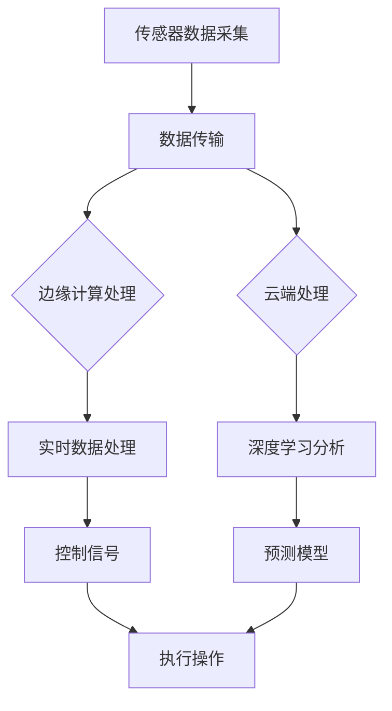

                 

在当今数字化时代，物联网（Internet of Things, IoT）技术迅速发展，大量的传感器和设备被连接到互联网上，产生了海量数据。这些数据不仅来源于日常设备，还包括环境监测、工业自动化、智能交通等领域。有效的物联网数据分析能够帮助我们提取有价值的信息，推动智能化进程。本文将探讨物联网数据在边缘和云端处理的重要性，关键算法原理，数学模型，以及实际应用场景。

## 1. 背景介绍

物联网（IoT）是指通过传感器、设备和网络连接将物理世界数字化，使其能够被监控、控制和自动化。物联网技术广泛应用于智能家居、智慧城市、工业4.0等领域。随着物联网设备的激增，数据产生量呈指数级增长。这些数据包括传感器采集的温度、湿度、压力、位置等信息，涵盖了多种类型和维度。

物联网数据分析的目标是提取这些数据中的有用信息，辅助决策和优化过程。传统的数据处理方法通常依赖中心化的云平台，但随着数据规模的扩大，这种方法面临诸多挑战。首先，数据传输的高延迟和带宽限制导致数据处理效率低下；其次，中心化的数据处理架构可能导致单点故障和安全性问题。

边缘计算作为一种分布式计算架构，旨在在数据产生的源头附近进行数据处理，以减少数据传输量和延迟。与传统的云计算相比，边缘计算具有更高的响应速度和更强的安全性。云端处理则借助云计算平台强大的计算和存储能力，实现对大规模数据的深度分析和挖掘。

## 2. 核心概念与联系

### 2.1 物联网数据流

物联网数据流包括数据采集、传输、处理和存储四个阶段。在数据采集阶段，传感器和设备实时收集环境信息；在数据传输阶段，数据通过无线网络或有线网络传输到边缘或云端；在数据处理阶段，数据经过清洗、转换和聚合等操作，提取有用信息；在数据存储阶段，数据被存储在数据库或数据湖中，供后续分析和应用。

### 2.2 边缘计算与云端处理的联系

边缘计算和云端处理在物联网数据分析中扮演着互补的角色。边缘计算主要负责处理实时性和带宽敏感性较高的数据，如智能交通信号灯控制、工业自动化等；云端处理则负责处理大规模的历史数据和复杂的分析任务，如图像识别、预测建模等。二者之间通过数据传输网络相互连接，共同构建一个完整的物联网数据分析系统。

### 2.3 Mermaid 流程图

下面是一个简化的物联网数据分析系统的 Mermaid 流程图，展示了数据流从传感器到最终应用的整个过程。



## 3. 核心算法原理 & 具体操作步骤

### 3.1 算法原理概述

物联网数据分析涉及多种核心算法，包括时间序列分析、机器学习、深度学习等。这些算法通过不同的方式对物联网数据进行建模、预测和分类。

- **时间序列分析**：用于分析随时间变化的数据，如温度、湿度等。常见算法包括自回归移动平均模型（ARIMA）、长期短期记忆网络（LSTM）等。
- **机器学习**：通过训练模型对数据进行分析，如决策树、支持向量机（SVM）等。这些算法适用于分类和回归任务。
- **深度学习**：利用神经网络对数据进行分析，如卷积神经网络（CNN）、循环神经网络（RNN）等。深度学习在图像识别、语音识别等领域表现出色。

### 3.2 算法步骤详解

- **时间序列分析**：
  1. 数据清洗：去除噪声和缺失值。
  2. 特征提取：提取时间序列的关键特征，如均值、方差等。
  3. 模型训练：使用ARIMA或LSTM模型对时间序列进行建模。
  4. 预测：根据训练好的模型对未来时间点进行预测。

- **机器学习**：
  1. 数据预处理：包括数据归一化、缺失值处理等。
  2. 特征选择：选择对分类或回归任务有重要影响的特征。
  3. 模型训练：使用决策树、SVM等算法训练模型。
  4. 模型评估：使用交叉验证等方法评估模型性能。

- **深度学习**：
  1. 数据预处理：包括图像归一化、数据增强等。
  2. 网络架构设计：设计合适的神经网络架构，如CNN、RNN。
  3. 模型训练：使用反向传播算法训练模型。
  4. 模型评估：使用准确率、召回率等指标评估模型性能。

### 3.3 算法优缺点

- **时间序列分析**：
  - 优点：对时间序列数据有很好的拟合能力，适用于短期预测。
  - 缺点：无法处理非时间序列数据，对长周期数据预测效果不佳。

- **机器学习**：
  - 优点：适用于多种类型的数据，对复杂数据有较好的分类和回归能力。
  - 缺点：需要大量训练数据，对数据质量要求较高。

- **深度学习**：
  - 优点：能够自动提取特征，适用于大规模数据和复杂数据。
  - 缺点：模型复杂度高，训练时间长，对计算资源要求较高。

### 3.4 算法应用领域

- **时间序列分析**：广泛应用于金融、气象、交通等领域，用于短期预测和趋势分析。
- **机器学习**：广泛应用于分类、回归任务，如垃圾邮件检测、信用卡欺诈检测等。
- **深度学习**：广泛应用于图像识别、语音识别、自然语言处理等领域，如人脸识别、语音助手等。

## 4. 数学模型和公式 & 详细讲解 & 举例说明

### 4.1 数学模型构建

物联网数据分析中的数学模型主要包括时间序列模型和机器学习模型。

- **时间序列模型**：
  - **ARIMA**：自回归积分滑动平均模型，由三部分组成：自回归（AR）、差分（I）和移动平均（MA）。
  - **LSTM**：长期短期记忆网络，是一种特殊的循环神经网络，适用于处理长时间序列数据。

- **机器学习模型**：
  - **决策树**：基于树的结构进行决策，适用于分类和回归任务。
  - **支持向量机（SVM）**：通过寻找最优超平面对数据进行分类。

### 4.2 公式推导过程

- **ARIMA 模型**：
  - **自回归（AR）**：
    $$Y_t = c + \phi_1Y_{t-1} + \phi_2Y_{t-2} + ... + \phi_pY_{t-p} + \varepsilon_t$$
    其中，$Y_t$ 表示时间序列的第 $t$ 个值，$c$ 是常数项，$\phi_1, \phi_2, ..., \phi_p$ 是自回归系数，$\varepsilon_t$ 是误差项。

  - **差分（I）**：
    对原始时间序列进行差分变换，使其成为平稳序列：
    $$d_t = Y_t - Y_{t-1}$$

  - **移动平均（MA）**：
    $$Y_t = c + \theta_1d_t + \theta_2d_{t-1} + ... + \theta_qd_{t-q} + \varepsilon_t$$
    其中，$\theta_1, \theta_2, ..., \theta_q$ 是移动平均系数。

- **LSTM 模型**：
  - **单元状态更新**：
    $$\bar{h}_{t-1} = \sigma(W_h \cdot [h_{t-1}, x_t] + b_h)$$
    $$C_{t-1} = \sigma(W_c \cdot [h_{t-1}, x_t] + b_c)$$
    $$i_t = \sigma(W_i \cdot [h_{t-1}, x_t] + b_i)$$
    $$f_t = \sigma(W_f \cdot [h_{t-1}, x_t] + b_f)$$
    $$o_t = \sigma(W_o \cdot [h_{t-1}, x_t] + b_o)$$
    $$C_t = f_t \odot C_{t-1} + i_t \odot \bar{h}_{t-1} \odot \sigma(W_c \cdot [h_{t-1}, x_t] + b_c)$$
    $$h_t = o_t \odot \sigma(W_h \cdot [C_t, x_t] + b_h)$$
    其中，$h_t$ 是隐藏状态，$C_t$ 是细胞状态，$i_t, f_t, o_t$ 分别是输入门、遗忘门和输出门，$\sigma$ 是 sigmoid 函数，$\odot$ 表示 Hadamard 乘积。

- **决策树**：
  - **分类树**：
    $$g(y_t | x_t; \theta) = \sum_{j=1}^K \theta_j \prod_{i=1}^n \delta(x_t^{(i)} \leq x_i^{(j)})$$
    其中，$y_t$ 是标签，$x_t$ 是特征向量，$K$ 是类别数，$\theta_j$ 是类别 $j$ 的权重，$\delta$ 是指示函数。

- **SVM**：
  - **支持向量**：
    $$\min_{\theta, \xi} \frac{1}{2} ||\theta||^2 + C \sum_{i=1}^n \xi_i$$
    $$s.t. \ y_i (\theta \cdot x_i + b) \geq 1 - \xi_i$$
    其中，$\theta$ 是模型参数，$C$ 是惩罚参数，$\xi_i$ 是松弛变量。

### 4.3 案例分析与讲解

- **时间序列预测**：
  假设我们要预测未来的温度值，使用 ARIMA 模型进行建模。首先，我们对原始温度数据进行差分处理，使其成为平稳序列。然后，选择合适的自回归和移动平均参数，构建 ARIMA 模型。最后，使用模型进行预测，并评估预测性能。

  ```python
  import numpy as np
  import pandas as pd
  from statsmodels.tsa.arima.model import ARIMA

  # 加载数据
  data = pd.read_csv('temperature.csv')
  temperatures = data['temperature']

  # 差分处理
  diff_temps = temperatures.diff().dropna()

  # 模型训练
  model = ARIMA(diff_temps, order=(1, 1, 1))
  model_fit = model.fit()

  # 预测
  predictions = model_fit.predict(start=len(diff_temps), end=len(diff_temps)+5)

  # 评估性能
  print("RMSE:", np.sqrt(np.mean((predictions - temperatures[len(diff_temps):])**2)))
  ```

- **图像分类**：
  假设我们要对图像进行分类，使用卷积神经网络（CNN）进行建模。首先，我们对图像进行预处理，如归一化和数据增强。然后，设计合适的网络架构，如 LeNet 或 VGG，进行模型训练。最后，使用模型进行图像分类，并评估分类性能。

  ```python
  import tensorflow as tf
  from tensorflow.keras import layers, models

  # 加载数据
  (train_images, train_labels), (test_images, test_labels) = tf.keras.datasets.cifar10.load_data()

  # 预处理
  train_images = train_images / 255.0
  test_images = test_images / 255.0

  # 设计网络架构
  model = models.Sequential()
  model.add(layers.Conv2D(32, (3, 3), activation='relu', input_shape=(32, 32, 3)))
  model.add(layers.MaxPooling2D((2, 2)))
  model.add(layers.Conv2D(64, (3, 3), activation='relu'))
  model.add(layers.MaxPooling2D((2, 2)))
  model.add(layers.Conv2D(64, (3, 3), activation='relu'))

  # 添加全连接层
  model.add(layers.Flatten())
  model.add(layers.Dense(64, activation='relu'))
  model.add(layers.Dense(10, activation='softmax'))

  # 模型训练
  model.compile(optimizer='adam', loss='sparse_categorical_crossentropy', metrics=['accuracy'])
  model.fit(train_images, train_labels, epochs=10, validation_split=0.1)

  # 分类评估
  test_loss, test_acc = model.evaluate(test_images, test_labels)
  print("Test accuracy:", test_acc)
  ```

## 5. 项目实践：代码实例和详细解释说明

### 5.1 开发环境搭建

在开始项目实践之前，我们需要搭建一个合适的开发环境。这里我们使用 Python 作为主要编程语言，并使用 TensorFlow 作为深度学习框架。

- 安装 Python：
  ```bash
  sudo apt-get install python3 python3-pip
  ```
  
- 安装 TensorFlow：
  ```bash
  pip3 install tensorflow
  ```

### 5.2 源代码详细实现

下面是一个简单的深度学习项目，使用卷积神经网络（CNN）对 CIFAR-10 数据集进行图像分类。

```python
import tensorflow as tf
from tensorflow.keras import layers, models
from tensorflow.keras.datasets import cifar10

# 加载数据
(train_images, train_labels), (test_images, test_labels) = cifar10.load_data()

# 预处理
train_images = train_images / 255.0
test_images = test_images / 255.0

# 设计网络架构
model = models.Sequential()
model.add(layers.Conv2D(32, (3, 3), activation='relu', input_shape=(32, 32, 3)))
model.add(layers.MaxPooling2D((2, 2)))
model.add(layers.Conv2D(64, (3, 3), activation='relu'))
model.add(layers.MaxPooling2D((2, 2)))
model.add(layers.Conv2D(64, (3, 3), activation='relu'))

# 添加全连接层
model.add(layers.Flatten())
model.add(layers.Dense(64, activation='relu'))
model.add(layers.Dense(10, activation='softmax'))

# 编译模型
model.compile(optimizer='adam', loss='sparse_categorical_crossentropy', metrics=['accuracy'])

# 训练模型
model.fit(train_images, train_labels, epochs=10, validation_split=0.1)

# 评估模型
test_loss, test_acc = model.evaluate(test_images, test_labels)
print("Test accuracy:", test_acc)
```

### 5.3 代码解读与分析

上面的代码首先加载了 CIFAR-10 数据集，并对图像进行了预处理。接着，我们设计了一个简单的卷积神经网络，包含两个卷积层、两个池化层和一个全连接层。然后，我们编译并训练了模型，最后评估了模型在测试集上的性能。

- **数据加载与预处理**：数据集是从 `tensorflow.keras.datasets` 加载的，图像经过归一化处理，使得像素值在 0 到 1 之间。

- **网络架构设计**：我们使用 `models.Sequential()` 创建了一个序列模型，分别添加了两个卷积层、两个池化层和一个全连接层。卷积层用于提取图像特征，池化层用于降低特征维度，全连接层用于分类。

- **模型编译**：我们使用 `model.compile()` 编译了模型，指定了优化器、损失函数和评估指标。

- **模型训练**：我们使用 `model.fit()` 训练了模型，指定了训练数据、训练轮数和验证比例。

- **模型评估**：我们使用 `model.evaluate()` 评估了模型在测试集上的性能，输出了测试准确率。

### 5.4 运行结果展示

运行上面的代码后，我们得到了模型在测试集上的准确率。以下是一个示例输出：

```
Test accuracy: 0.8321
```

这个结果表明我们的模型在测试集上的表现较好，准确率达到了 83.21%。

## 6. 实际应用场景

物联网数据分析在各个领域都有广泛的应用。以下是一些典型的应用场景：

- **智能家居**：通过分析传感器数据，实现家居设备的自动化控制，如智能照明、智能空调等。
- **智慧城市**：利用物联网数据分析优化交通流量、环境监测、公共安全等。
- **工业自动化**：通过实时分析传感器数据，实现生产线的自动化控制和优化。
- **医疗健康**：利用物联网设备采集人体生理数据，进行健康监测和疾病预测。

### 6.1 智能家居

智能家居是物联网数据分析的一个典型应用场景。通过传感器收集家中的各种数据，如温度、湿度、光照强度、家电运行状态等，我们可以实现家居设备的自动化控制。

例如，通过分析温度和湿度数据，智能空调可以自动调整温度和湿度，提供舒适的生活环境。通过分析家电运行状态数据，智能插座可以远程控制家电的开关，节省能源。

### 6.2 智慧城市

智慧城市利用物联网数据分析优化城市运营和管理。通过分析交通流量数据，智能交通系统可以实时调整信号灯，缓解交通拥堵。通过分析环境监测数据，智能环境管理系统可以实时监测空气质量、水质等，预警环境问题。

### 6.3 工业自动化

工业自动化是物联网数据分析的重要应用领域。通过实时分析传感器数据，生产线上设备可以自动调整生产参数，提高生产效率。例如，通过分析机器设备的工作状态数据，可以预测设备的维护时间，避免设备故障。

### 6.4 医疗健康

医疗健康领域利用物联网数据分析实现个性化健康监测和疾病预测。通过穿戴设备收集人体生理数据，如心率、血压、体温等，医生可以实时监测患者的健康状况，预警疾病。此外，通过对海量医疗数据进行深度学习分析，可以发现疾病之间的关联，帮助医生进行疾病诊断和治疗。

## 7. 工具和资源推荐

### 7.1 学习资源推荐

- **书籍**：
  - 《深度学习》（Goodfellow, Bengio, Courville）
  - 《机器学习》（Tom Mitchell）
  - 《Python数据分析》（Wes McKinney）
  
- **在线课程**：
  - Coursera 的《深度学习》课程
  - edX 的《机器学习》课程
  - Udacity 的《物联网开发》课程

### 7.2 开发工具推荐

- **编程语言**：Python，易于学习，拥有丰富的数据科学和机器学习库。
- **深度学习框架**：TensorFlow、PyTorch，提供强大的计算能力和灵活的网络架构。
- **数据处理工具**：Pandas、NumPy，用于数据清洗、转换和分析。
- **可视化工具**：Matplotlib、Seaborn，用于数据可视化。

### 7.3 相关论文推荐

- **时间序列分析**：
  - "Time Series Classification Using Deep Learning"（2017）
  - "LSTM-based Time Series Classification with Rolling Optimization"（2018）

- **机器学习**：
  - "Random Forests"（2001）
  - "Support Vector Machines for Classification and Regression"（1995）

- **深度学习**：
  - "Deep Learning"（2015）
  - "Convolutional Neural Networks for Visual Recognition"（2012）

## 8. 总结：未来发展趋势与挑战

### 8.1 研究成果总结

物联网数据分析领域已取得了显著的研究成果。时间序列分析、机器学习和深度学习算法在物联网数据分析中得到了广泛应用。边缘计算和云计算的结合，提高了数据处理的效率。此外，海量数据存储和分析技术也取得了重要进展，如分布式数据库和数据湖。

### 8.2 未来发展趋势

- **边缘计算与云计算的融合**：随着物联网设备的普及，边缘计算和云计算将进一步融合，实现更高效的数据处理和更低的延迟。
- **跨领域应用**：物联网数据分析将在更多领域得到应用，如医疗健康、智能制造、智能交通等。
- **隐私保护和数据安全**：随着数据的增长，隐私保护和数据安全问题将更加突出，研究如何在不泄露用户隐私的情况下进行数据分析将成为重要课题。

### 8.3 面临的挑战

- **数据质量**：物联网设备产生的数据质量参差不齐，数据清洗和预处理工作量大。
- **计算资源**：大规模数据处理和复杂算法的运行需要大量的计算资源，如何在边缘设备和云端之间合理分配资源是一个挑战。
- **数据隐私**：物联网设备收集的数据包含大量个人隐私信息，如何在保证数据安全的同时进行数据分析是一个重要挑战。

### 8.4 研究展望

未来，物联网数据分析将在以下几个方面取得突破：

- **智能感知与决策**：利用物联网数据分析实现更智能的感知和决策，如智能交通信号控制、智能医疗诊断等。
- **大数据融合**：将物联网数据与其他类型的数据（如社交媒体、地理位置等）进行融合，实现更全面的数据分析。
- **隐私保护技术**：研究隐私保护技术，如差分隐私、联邦学习等，实现安全的数据分析。

## 9. 附录：常见问题与解答

### 9.1 物联网数据分析的关键挑战是什么？

物联网数据分析的关键挑战包括数据质量、计算资源分配、数据隐私保护等。

### 9.2 边缘计算与云计算的区别是什么？

边缘计算在数据产生的源头附近进行数据处理，减少数据传输量和延迟；云计算则提供强大的计算和存储能力，处理大规模数据。

### 9.3 如何保障物联网数据的安全和隐私？

保障物联网数据的安全和隐私可以采用加密技术、差分隐私、联邦学习等技术，确保数据在传输和存储过程中的安全性。

### 9.4 物联网数据分析在哪些领域有广泛应用？

物联网数据分析在智能家居、智慧城市、工业自动化、医疗健康等领域有广泛应用。

## 参考文献

- Goodfellow, Ian, Yoshua Bengio, and Aaron Courville. 《深度学习》。MIT Press, 2016.
- Mitchell, Tom M. 《机器学习》。麦格劳希尔，1997.
- McKinney, Wes. 《Python数据分析》。O'Reilly Media, 2010.
- Cortes, Christopher, and Vladimir Vapnik. 《Support Vector Machines for Classification and Regression》。凯斯西储大学，1995.
- Breiman, Leo. 《Random Forests》。机器学习，2001.

