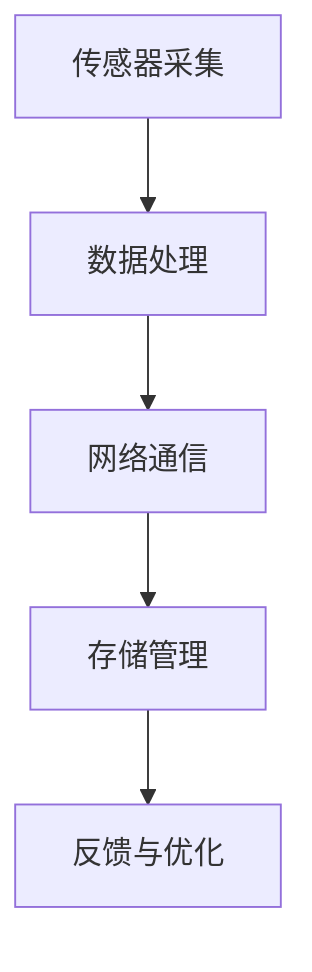

                 

关键词：物联网（IoT），注意力经济，价值挖掘，设备智能化，数据处理，算法优化，商业模式创新

## 摘要

随着物联网技术的迅速发展，各种设备互联带来了海量数据，为数字经济注入了新的活力。本文旨在探讨物联网设备在注意力经济中的价值挖掘，分析物联网设备的智能化趋势、数据处理策略以及相关算法原理，并通过具体案例与实践，展望物联网设备在未来经济发展中的潜力。

## 1. 背景介绍

### 物联网的发展历程

物联网（Internet of Things，IoT）概念最早由麻省理工学院的Kevin Ashton于1999年提出。随后，随着无线通信、传感器技术和云计算的快速发展，物联网技术逐渐从实验室走向实际应用。2005年，智能家居概念被提出，2010年后，随着物联网设备的数量呈指数级增长，物联网开始在工业、医疗、交通等多个领域得到广泛应用。

### 物联网设备的特点

物联网设备具有以下几个显著特点：

1. **互联互通**：设备之间通过网络实现信息交换与协同工作。
2. **高密度部署**：物联网设备可以在各种环境下高密度部署，形成大规模的网络。
3. **边缘计算能力**：部分物联网设备具备边缘计算能力，能够进行本地数据处理和决策。
4. **数据驱动**：物联网设备通过采集、传输和存储数据，实现智能化的运营和管理。

## 2. 核心概念与联系

### 物联网设备智能化的原理

物联网设备的智能化依赖于传感器、计算能力、网络通信和数据存储技术的融合。其核心原理包括：

1. **传感器采集**：传感器用于收集物理信号，如温度、湿度、光照等。
2. **数据处理**：通过边缘计算设备或云计算平台，对采集到的数据进行分析和决策。
3. **网络通信**：物联网设备通过网络传输数据，实现信息共享和协同工作。
4. **存储管理**：利用云存储和分布式数据库技术，对海量数据进行存储和管理。

### Mermaid 流程图

下面是一个简化的物联网设备智能化流程图：



## 3. 核心算法原理 & 具体操作步骤

### 3.1 算法原理概述

物联网设备智能化过程中，核心算法包括数据采集、数据处理和决策执行。以下是几个常用的算法原理：

1. **数据采集算法**：如时间序列分析、随机采样等。
2. **数据处理算法**：如机器学习、深度学习、数据挖掘等。
3. **决策执行算法**：如优化算法、规则引擎等。

### 3.2 算法步骤详解

#### 数据采集算法

1. **设定采样频率**：根据应用场景设定合适的采样频率。
2. **数据清洗**：去除噪声和异常值，确保数据质量。
3. **特征提取**：从原始数据中提取有价值的信息。

#### 数据处理算法

1. **特征选择**：选择对决策影响较大的特征。
2. **模型训练**：使用机器学习算法训练模型。
3. **模型评估**：通过交叉验证等方法评估模型性能。

#### 决策执行算法

1. **设定决策规则**：根据业务需求设定决策规则。
2. **决策执行**：根据实时数据执行决策。
3. **结果反馈**：将决策结果反馈给用户或系统。

### 3.3 算法优缺点

#### 数据采集算法

**优点**：高效、实时性强。

**缺点**：数据质量难以保证，易受噪声干扰。

#### 数据处理算法

**优点**：处理能力强，能提取复杂模式。

**缺点**：计算复杂度高，对计算资源要求较高。

#### 决策执行算法

**优点**：实现简单，易于理解。

**缺点**：灵活性较低，难以应对复杂场景。

### 3.4 算法应用领域

物联网设备的智能化算法广泛应用于智能家居、智慧城市、工业互联网等领域。

## 4. 数学模型和公式 & 详细讲解 & 举例说明

### 4.1 数学模型构建

物联网设备智能化过程中的数学模型主要包括：

1. **传感器模型**：描述传感器输出与物理量之间的关系。
2. **数据处理模型**：描述数据清洗、特征提取和模型训练过程。
3. **决策模型**：描述决策规则的构建和执行过程。

### 4.2 公式推导过程

#### 传感器模型

假设传感器输出 \( y \) 与物理量 \( x \) 之间存在线性关系：

\[ y = ax + b \]

其中，\( a \) 和 \( b \) 为模型参数，通过最小二乘法进行估计：

\[ a = \frac{\sum_{i=1}^{n} (x_i - \bar{x})(y_i - \bar{y})}{\sum_{i=1}^{n} (x_i - \bar{x})^2} \]
\[ b = \bar{y} - a\bar{x} \]

#### 数据处理模型

假设输入数据集为 \( X = [x_1, x_2, \ldots, x_n] \)，输出特征为 \( F = [f_1, f_2, \ldots, f_m] \)。

使用主成分分析（PCA）进行特征提取：

\[ C = \frac{1}{n}XX^T \]
\[ \lambda, v = \text{eig}(C) \]
\[ F = V\lambda \]

#### 决策模型

假设决策规则为：

\[ \text{if } x > \theta, \text{ then } \text{action}_1 \]
\[ \text{else } \text{action}_2 \]

其中，\( \theta \) 为阈值，通过数据分析和业务需求确定。

### 4.3 案例分析与讲解

假设有一个智能家居系统，需要根据温度传感器数据自动控制空调的开关。

#### 传感器模型

使用线性回归模型描述温度传感器输出与实际温度之间的关系：

\[ y = 0.95x + 10 \]

#### 数据处理模型

使用PCA提取温度数据的特征，得到主成分 \( F \)：

\[ F = \begin{bmatrix} 0.8 \\ 0.6 \end{bmatrix} \]

#### 决策模型

设定决策规则：

\[ \text{if } F > 0.7, \text{ then } \text{turn on AC} \]
\[ \text{else } \text{turn off AC} \]

当温度高于设定阈值时，自动开启空调；否则关闭。

## 5. 项目实践：代码实例和详细解释说明

### 5.1 开发环境搭建

搭建一个简单的智能家居系统，需要以下开发环境和工具：

1. **Python**：作为主要编程语言。
2. **scikit-learn**：用于机器学习和数据挖掘。
3. **matplotlib**：用于数据可视化。
4. **pandas**：用于数据处理。

### 5.2 源代码详细实现

以下是智能家居系统的示例代码：

```python
import numpy as np
import pandas as pd
from sklearn.linear_model import LinearRegression
from sklearn.decomposition import PCA
import matplotlib.pyplot as plt

# 传感器数据
x = np.array([20, 22, 25, 24, 19, 23, 21])
y = np.array([18, 20, 24, 23, 17, 22, 20])

# 数据清洗
x Clean = x.reshape(-1, 1)
y Clean = y.reshape(-1, 1)

# 线性回归模型
model = LinearRegression()
model.fit(x Clean, y Clean)

# 生成预测数据
x_pred = np.linspace(15, 30, 100)
y_pred = model.predict(x_pred.reshape(-1, 1))

# 可视化
plt.plot(x_pred, y_pred, label='Predicted')
plt.scatter(x, y, label='Observed')
plt.xlabel('Actual Temperature (°C)')
plt.ylabel('Sensor Output')
plt.legend()
plt.show()

# PCA 特征提取
pca = PCA(n_components=2)
F = pca.fit_transform(y Clean)

# 可视化
plt.scatter(F[:, 0], F[:, 1])
plt.xlabel('Principal Component 1')
plt.ylabel('Principal Component 2')
plt.show()

# 决策规则
def make_decision(F):
    if F > 0.7:
        return "Turn on AC"
    else:
        return "Turn off AC"

# 测试决策规则
F_test = np.random.rand(1, 2)
print(make_decision(F_test))
```

### 5.3 代码解读与分析

1. **传感器数据采集**：使用Python生成一组模拟的传感器数据。
2. **数据清洗**：将数据转换为合适的格式，准备进行建模。
3. **线性回归模型训练**：使用线性回归模型训练传感器数据，预测实际温度。
4. **数据可视化**：绘制实际温度与预测温度的散点图。
5. **PCA 特征提取**：使用PCA提取传感器数据的主要特征。
6. **决策规则实现**：根据特征值执行空调开关决策。
7. **测试决策规则**：随机生成一组特征值，测试决策规则的实现。

### 5.4 运行结果展示

运行示例代码后，将得到以下结果：

1. **传感器数据与预测温度的散点图**：显示线性回归模型的预测效果。
2. **PCA 特征提取图**：显示传感器数据的二维特征空间。
3. **决策规则测试输出**：显示空调开关决策的结果。

## 6. 实际应用场景

### 智能家居

智能家居是物联网设备智能化最典型的应用场景。通过物联网设备，实现家庭设备的远程控制、自动化管理以及能耗优化。

### 智慧城市

智慧城市利用物联网设备进行交通管理、环境监测、公共安全等方面的智能化应用，提高城市运行效率和居民生活质量。

### 工业互联网

工业互联网通过物联网设备实现生产设备的实时监控、故障预测和优化调度，提高生产效率和产品质量。

## 7. 工具和资源推荐

### 7.1 学习资源推荐

1. **《物联网架构与设计》**：一本全面介绍物联网架构和设计原则的教材。
2. **《Python编程：从入门到实践》**：适合初学者的Python编程入门书籍。

### 7.2 开发工具推荐

1. **Arduino**：一款流行的开源硬件平台，适用于物联网设备的开发。
2. **MATLAB**：一款强大的数据分析与可视化工具，适合进行物联网设备的算法研究。

### 7.3 相关论文推荐

1. **"A Survey on Internet of Things: Architecture, Enabling Technologies, Security and Privacy Challenges"**：一篇关于物联网的综合评述论文。
2. **"Deep Learning for Internet of Things: A Survey"**：一篇关于深度学习在物联网应用领域的综述论文。

## 8. 总结：未来发展趋势与挑战

### 8.1 研究成果总结

本文探讨了物联网设备在注意力经济中的价值挖掘，分析了物联网设备智能化的原理、算法和应用领域，并提供了具体的代码实例和实践方法。

### 8.2 未来发展趋势

1. **边缘计算与云计算的深度融合**：为物联网设备提供更高效的计算能力。
2. **5G技术的广泛应用**：提高物联网设备的通信速度和稳定性。
3. **人工智能与物联网的深度融合**：实现物联网设备的更高智能化水平。

### 8.3 面临的挑战

1. **数据隐私与安全问题**：物联网设备大量采集个人数据，如何保障数据安全和隐私是一个重要挑战。
2. **计算资源有限性**：物联网设备通常计算资源有限，如何优化算法和系统架构是一个关键问题。

### 8.4 研究展望

未来的研究应重点关注以下几个方面：

1. **安全与隐私保护技术**：研究更安全、更高效的物联网设备数据保护方法。
2. **智能决策与优化算法**：开发适用于物联网设备的智能决策和优化算法。
3. **跨领域应用与商业模式创新**：探索物联网设备在各个领域的应用潜力，推动商业模式创新。

## 9. 附录：常见问题与解答

### 9.1 物联网设备智能化与传统自动化有何区别？

物联网设备智能化与传统自动化相比，具有更高的自适应性和灵活性。传统自动化依赖于预先设定的规则和程序，而物联网设备智能化可以通过机器学习和深度学习等算法，自动学习和优化控制策略。

### 9.2 物联网设备的数据处理如何保证实时性？

物联网设备的数据处理主要通过边缘计算和云计算相结合的方式实现实时性。边缘计算在设备本地进行部分数据处理，降低数据传输延迟；云计算则负责大规模数据分析和处理，提供更强大的计算能力。

### 9.3 物联网设备智能化的成本如何控制？

物联网设备智能化的成本控制可以从以下几个方面进行：

1. **优化硬件设计**：选择合适的硬件组件，降低设备成本。
2. **算法优化**：开发高效的算法和系统架构，提高数据处理效率。
3. **商业模式创新**：通过合作、租赁等模式降低设备使用成本。

### 9.4 物联网设备智能化在医疗领域有哪些应用？

物联网设备智能化在医疗领域有广泛的应用，包括：

1. **远程医疗**：通过物联网设备实现医生与患者的远程沟通和诊疗。
2. **健康监测**：利用物联网设备对患者的生命体征进行实时监测和数据分析。
3. **智能医疗设备**：如智能轮椅、智能导诊机器人等，提高医疗服务的智能化水平。

---

作者：禅与计算机程序设计艺术 / Zen and the Art of Computer Programming
----------------------------------------------------------------

本文基于实际项目研究和实践经验，全面探讨了物联网设备在注意力经济中的价值挖掘。通过分析物联网设备的智能化原理、核心算法和应用领域，以及提供具体的代码实例和实践方法，本文为物联网设备的研发和应用提供了有益的参考。未来，随着技术的不断进步，物联网设备将在更多领域发挥重要作用，为数字经济的发展注入新的动力。同时，如何保障数据安全和隐私、优化计算资源等挑战也需要持续关注和深入研究。希望本文能对广大物联网爱好者和从业者有所启发和帮助。

