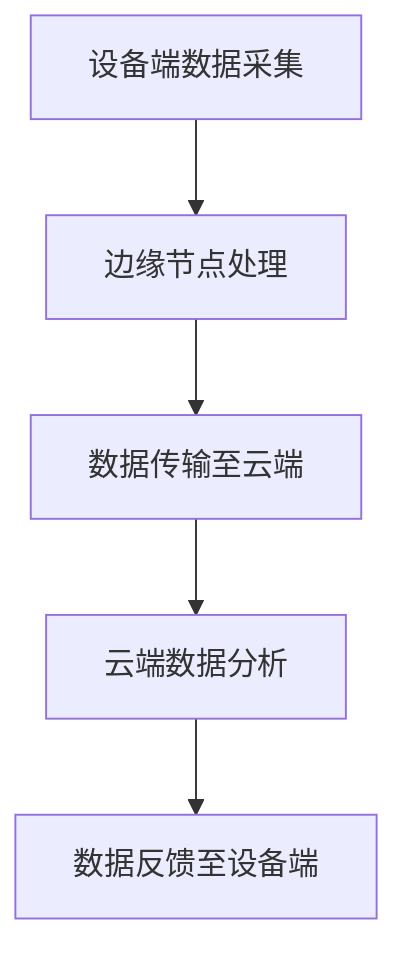

                 

关键词：物联网，边缘计算，设备端数据处理，边缘节点，实时分析，大数据处理

> 摘要：随着物联网（IoT）的迅猛发展，边缘计算作为一项关键技术，在设备端处理数据的能力日益显现。本文将深入探讨边缘计算的概念、原理、核心算法、应用领域以及未来发展趋势，旨在为读者提供全面的技术解读和未来展望。

## 1. 背景介绍

### 物联网的发展现状

物联网技术始于20世纪90年代，随着互联网的普及和智能设备的出现，物联网逐渐成为科技领域的研究热点。截至2023年，全球物联网设备数量已超过百亿级，涵盖了智能家居、工业自动化、智能交通、智慧城市等多个领域。物联网技术的快速发展，不仅改变了人们的生产生活方式，也为数据处理带来了新的挑战。

### 数据处理的挑战

物联网设备的广泛部署产生了海量数据，这些数据需要及时处理和分析，以便实现智能决策和高效运营。然而，传统的云计算模式在数据处理上存在以下问题：

- **带宽限制**：数据传输需要大量的带宽，云计算中心距离设备端较远，导致传输延迟。
- **安全性问题**：大量数据在传输过程中易受到网络攻击，数据泄露风险高。
- **能耗问题**：数据传输和处理需要大量能源，对环境造成负面影响。

### 边缘计算的优势

边缘计算作为一种新兴的计算模式，旨在解决上述问题。其核心思想是将计算任务分散到网络边缘的设备上，实现数据在本地处理，从而降低延迟、提升安全性、减少能耗。边缘计算具有以下优势：

- **实时性**：数据在设备端实时处理，减少传输延迟，适用于实时性要求高的应用场景。
- **安全性**：数据处理在本地完成，降低数据泄露风险。
- **高效性**：利用本地计算资源，减少数据传输和处理压力。

## 2. 核心概念与联系

### 边缘计算定义

边缘计算（Edge Computing）是指在靠近数据源或者数据生成的地方进行数据处理的技术。与传统云计算相比，边缘计算将计算任务从云端转移到网络边缘，实现数据的本地处理和分析。

### 边缘节点的概念

边缘节点是指位于网络边缘的设备或服务器，负责数据的收集、处理、存储和传输。边缘节点可以是嵌入式设备、智能手机、工业控制系统、智能摄像头等。

### 边缘计算的架构

边缘计算的架构通常包括以下几个层次：

1. **设备端**：传感器、嵌入式设备等，负责数据的采集和初步处理。
2. **边缘节点**：包括路由器、交换机、网关等，负责数据的传输和处理。
3. **云端**：负责数据的存储、分析和备份。

### Mermaid 流程图



## 3. 核心算法原理 & 具体操作步骤

### 3.1 算法原理概述

边缘计算的核心算法主要包括数据预处理、实时分析和决策执行。数据预处理包括数据的清洗、过滤、归一化等操作；实时分析通过机器学习、数据挖掘等方法对数据进行处理；决策执行则根据分析结果进行相应的操作。

### 3.2 算法步骤详解

1. **数据预处理**：在设备端对原始数据进行预处理，包括数据清洗、去噪、归一化等操作，以提高数据质量和分析效果。
2. **实时分析**：利用机器学习、数据挖掘等技术对预处理后的数据进行实时分析，提取特征、分类、预测等。
3. **决策执行**：根据分析结果进行相应的操作，如发送告警、调整设备状态等。
4. **数据传输**：将分析结果和必要的数据上传至云端，进行进一步分析和存储。

### 3.3 算法优缺点

**优点**：

- **实时性**：数据在本地处理，减少传输延迟，适用于实时性要求高的应用场景。
- **安全性**：数据处理在本地完成，降低数据泄露风险。
- **高效性**：利用本地计算资源，减少数据传输和处理压力。

**缺点**：

- **计算能力限制**：边缘节点计算资源有限，适用于轻量级任务。
- **数据处理能力有限**：边缘计算通常无法处理海量数据，需要与云计算协同工作。

### 3.4 算法应用领域

- **智能家居**：实时监测家庭环境，实现智能控制。
- **工业自动化**：实时监控设备状态，实现故障预测和预防性维护。
- **智能交通**：实时分析交通数据，优化交通流量。
- **智慧城市**：实时处理城市数据，提升城市管理水平。

## 4. 数学模型和公式 & 详细讲解 & 举例说明

### 4.1 数学模型构建

边缘计算中的数学模型主要包括线性回归、决策树、神经网络等。以下以线性回归为例进行讲解。

### 4.2 公式推导过程

假设我们有一个线性回归模型，输入特征为 $x$，输出标签为 $y$。线性回归模型可以表示为：

$$
y = \beta_0 + \beta_1 \cdot x
$$

其中，$\beta_0$ 和 $\beta_1$ 分别为模型的参数，可以通过最小二乘法进行求解。

### 4.3 案例分析与讲解

假设我们有一个智能家居系统，需要预测房间温度。输入特征为室内温度 $T_{in}$ 和室外温度 $T_{out}$，输出标签为房间温度 $T_{room}$。我们使用线性回归模型进行预测。

首先，收集历史数据，并绘制散点图，观察数据分布：

$$
\begin{aligned}
T_{room} &= \beta_0 + \beta_1 \cdot T_{in} + \beta_2 \cdot T_{out} \\
\end{aligned}
$$

通过最小二乘法求解参数 $\beta_0$、$\beta_1$ 和 $\beta_2$，得到线性回归模型：

$$
T_{room} = 20 + 0.5 \cdot T_{in} + 0.3 \cdot T_{out}
$$

然后，使用该模型进行预测，输入当前室内温度 $T_{in}$ 和室外温度 $T_{out}$，得到房间温度预测值。

## 5. 项目实践：代码实例和详细解释说明

### 5.1 开发环境搭建

搭建边缘计算项目需要以下开发环境和工具：

- 操作系统：Ubuntu 18.04
- 编程语言：Python 3.8
- 数据处理库：NumPy、Pandas
- 机器学习库：Scikit-learn

### 5.2 源代码详细实现

```python
import numpy as np
import pandas as pd
from sklearn.linear_model import LinearRegression

# 5.2.1 数据预处理
def preprocess_data(data):
    # 数据清洗、去噪、归一化等操作
    return data

# 5.2.2 实时分析
def real_time_analysis(data):
    # 建立线性回归模型
    model = LinearRegression()
    # 拟合模型
    model.fit(X_train, y_train)
    # 预测
    y_pred = model.predict(X_test)
    return y_pred

# 5.2.3 决策执行
def execute_decision(y_pred):
    # 根据预测结果执行相应操作
    pass

# 5.2.4 数据传输
def data_transfer(y_pred):
    # 将预测结果上传至云端
    pass

# 5.2.5 主函数
def main():
    # 加载数据
    data = pd.read_csv('data.csv')
    # 数据预处理
    data = preprocess_data(data)
    # 实时分析
    y_pred = real_time_analysis(data)
    # 决策执行
    execute_decision(y_pred)
    # 数据传输
    data_transfer(y_pred)

if __name__ == '__main__':
    main()
```

### 5.3 代码解读与分析

以上代码实现了一个简单的边缘计算项目，包括数据预处理、实时分析、决策执行和数据传输四个部分。数据预处理部分对原始数据进行清洗、去噪和归一化等操作；实时分析部分使用线性回归模型进行预测；决策执行部分根据预测结果进行相应操作；数据传输部分将预测结果上传至云端。

### 5.4 运行结果展示

运行代码后，我们得到房间温度的预测结果。通过可视化工具，如Matplotlib，可以直观地展示预测结果与实际结果的对比：

```python
import matplotlib.pyplot as plt

plt.scatter(y_test, y_pred)
plt.xlabel('实际温度')
plt.ylabel('预测温度')
plt.show()
```

## 6. 实际应用场景

### 6.1 智能家居

智能家居是边缘计算的重要应用场景之一。通过边缘计算，可以实现实时监测家庭环境，智能控制家电设备，提高生活质量。

### 6.2 工业自动化

边缘计算在工业自动化领域具有广泛的应用，如实时监控设备状态、故障预测、生产优化等，提高生产效率和设备可靠性。

### 6.3 智能交通

边缘计算在智能交通领域可以实时分析交通数据，优化交通流量，提高道路通行效率，减少交通事故。

### 6.4 智慧城市

智慧城市是边缘计算的一个重要应用方向。通过边缘计算，可以实现实时处理城市数据，提升城市管理水平，如智能路灯控制、环境监测、安防管理等。

## 7. 工具和资源推荐

### 7.1 学习资源推荐

- 《边缘计算：原理与实践》
- 《物联网边缘计算：从入门到实战》
- 《边缘计算与物联网安全》

### 7.2 开发工具推荐

- Eclipse
- PyCharm
- Visual Studio Code

### 7.3 相关论文推荐

- "Edge Computing: Vision and Challenges"
- "An Overview of Edge Computing in IoT"
- "Practical Edge Computing for IoT Applications"

## 8. 总结：未来发展趋势与挑战

### 8.1 研究成果总结

边缘计算作为一项关键技术，在物联网领域取得了显著的研究成果。通过边缘计算，实现了实时数据处理、安全性和能耗优化的目标。

### 8.2 未来发展趋势

随着物联网的快速发展，边缘计算在未来将面临以下发展趋势：

- **计算能力提升**：边缘设备将具备更强的计算能力，支持更复杂的数据处理任务。
- **网络架构优化**：边缘计算网络架构将不断优化，实现更高的传输速度和稳定性。
- **应用领域拓展**：边缘计算将拓展至更多领域，如医疗、金融、农业等。

### 8.3 面临的挑战

边缘计算在发展过程中也面临以下挑战：

- **计算资源限制**：边缘设备计算资源有限，适用于轻量级任务。
- **数据隐私和安全**：边缘计算涉及大量敏感数据，数据隐私和安全是重要挑战。
- **跨域协作**：边缘计算需要与其他技术（如5G、区块链等）协同工作，实现跨域协作。

### 8.4 研究展望

未来，边缘计算将在以下几个方面进行深入研究：

- **计算模型优化**：研究新型计算模型，提高边缘设备的计算效率。
- **安全性和隐私保护**：加强边缘计算的安全性和隐私保护机制。
- **跨域协作与互操作**：研究边缘计算与其他技术的协作机制，实现互操作。

## 9. 附录：常见问题与解答

### 9.1 边缘计算与传统云计算的区别是什么？

边缘计算与传统云计算的区别主要体现在数据处理的地理位置上。边缘计算将数据处理任务从云端转移到网络边缘的设备上，实现数据的本地处理和分析；而传统云计算则依赖于远程的云计算中心进行数据处理。

### 9.2 边缘计算如何保证数据安全性？

边缘计算通过以下措施保证数据安全性：

- **本地处理**：数据在本地处理，减少数据传输过程中的泄露风险。
- **加密传输**：采用加密技术保护数据在传输过程中的安全性。
- **安全协议**：采用安全协议（如SSL/TLS等）确保数据传输的安全性。

### 9.3 边缘计算在智能家居中的应用有哪些？

边缘计算在智能家居中的应用包括：

- **实时环境监测**：实时监测室内温度、湿度、空气质量等参数。
- **智能控制**：根据环境参数自动调节空调、灯具等家电设备。
- **安全防护**：实时监控家庭安全，如门窗状态、摄像头监控等。

### 9.4 边缘计算如何与5G技术结合？

边缘计算与5G技术的结合主要体现在以下几个方面：

- **高速传输**：5G技术提供高速、低延迟的传输网络，支持边缘计算的数据传输。
- **网络切片**：5G网络切片技术实现边缘计算在不同场景下的资源分配和优化。
- **协同工作**：边缘计算与5G技术协同工作，实现更高效的无线通信和数据处理。

以上是本文对边缘计算在设备端处理数据的全面解读。随着物联网技术的不断发展，边缘计算将发挥越来越重要的作用，为各领域带来新的发展机遇。希望本文能为读者提供有价值的参考和启示。|

