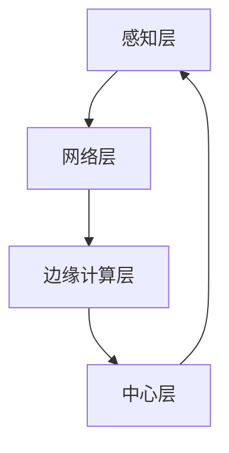

                 

 关键词：物联网，边缘计算，数据处理，设备端，智能设备

> 摘要：本文深入探讨了物联网边缘计算的概念、核心原理以及其在设备端处理数据的重要性。文章将详细描述边缘计算的技术架构、算法原理、数学模型、应用案例，并展望其未来的发展趋势与挑战。

## 1. 背景介绍

随着物联网（Internet of Things, IoT）技术的飞速发展，越来越多的设备被连接到互联网上，形成了庞大的网络体系。这些设备不仅包括传统的计算机设备，还包括嵌入式设备、智能硬件、传感器等。然而，随着连接设备数量的激增，数据中心面临着前所未有的挑战。中心化的数据处理方式已经难以满足日益增长的数据处理需求，数据传输延迟、带宽瓶颈等问题日益凸显。

为了解决这些问题，边缘计算（Edge Computing）应运而生。边缘计算旨在将计算、存储、网络等资源分布到网络的边缘，即靠近数据源或用户的地方，以实现实时数据处理和响应。通过在设备端处理数据，边缘计算可以显著降低数据传输的延迟，提高系统的响应速度，同时减轻中心数据中心的负担。

## 2. 核心概念与联系

### 2.1. 边缘计算的定义

边缘计算是一种分布式计算架构，它将数据处理、存储和计算资源从中心化的数据中心转移到网络边缘。这些边缘设备可以是服务器、路由器、嵌入式设备等，它们可以实时处理来自传感器或设备的数据，从而减轻中心数据中心的负担。

### 2.2. 边缘计算与云计算的关系

边缘计算与云计算是互补的关系。云计算提供了强大的计算和存储资源，适用于处理大规模、复杂的数据处理任务。而边缘计算则更注重实时性、低延迟和高效性，适用于处理局部数据和即时响应的需求。两者共同构成了现代计算生态系统。

### 2.3. 边缘计算的技术架构

边缘计算的技术架构主要包括以下几个层次：

- **感知层**：包括传感器、嵌入式设备等，用于收集数据。
- **网络层**：包括路由器、交换机等，用于数据传输。
- **边缘计算层**：包括边缘服务器、边缘设备等，用于数据处理和计算。
- **中心层**：包括数据中心、云计算平台等，用于存储、处理和分析大规模数据。

下面是一个简化的边缘计算流程图，用于说明各层之间的联系：



## 3. 核心算法原理 & 具体操作步骤

### 3.1. 算法原理概述

边缘计算的核心算法主要包括数据采集、数据处理和数据传输。以下是这些算法的基本原理：

- **数据采集**：传感器和设备收集数据，并将其传输到边缘设备。
- **数据处理**：边缘设备对数据进行初步处理，如滤波、压缩、分类等。
- **数据传输**：经过初步处理的 数据传输到中心层，进行进一步处理和分析。

### 3.2. 算法步骤详解

以下是边缘计算的基本操作步骤：

1. **数据采集**：传感器和设备收集数据，并将其发送到边缘设备。
2. **数据预处理**：边缘设备对数据进行预处理，如去噪、滤波等。
3. **数据处理**：边缘设备使用特定的算法对数据进行分析和计算。
4. **数据传输**：处理后的数据传输到中心层，进行进一步处理和分析。
5. **反馈**：中心层将分析结果返回给边缘设备，以指导后续操作。

### 3.3. 算法优缺点

**优点**：

- 降低数据传输延迟，提高系统的响应速度。
- 减轻中心数据中心的负担，提高资源利用率。
- 提高系统的安全性和可靠性。

**缺点**：

- 边缘设备计算能力和存储容量有限，可能无法处理复杂的数据处理任务。
- 需要复杂的网络架构和维护。

### 3.4. 算法应用领域

边缘计算广泛应用于以下领域：

- **智能交通**：实时交通监控、智能信号灯控制等。
- **智能制造**：设备状态监控、生产流程优化等。
- **智能医疗**：远程医疗、实时医疗监控等。
- **智能家居**：智能家电控制、家庭安全监控等。

## 4. 数学模型和公式 & 详细讲解 & 举例说明

### 4.1. 数学模型构建

边缘计算中的数学模型主要涉及数据传输速率、数据处理延迟和带宽利用率等。以下是几个基本的数学模型：

- **数据传输速率**：\(R = \frac{B}{T}\)，其中 \(R\) 是数据传输速率，\(B\) 是带宽，\(T\) 是传输时间。
- **数据处理延迟**：\(D = \frac{L}{R}\)，其中 \(D\) 是数据处理延迟，\(L\) 是数据长度，\(R\) 是数据传输速率。
- **带宽利用率**：\(U = \frac{R}{B}\)，其中 \(U\) 是带宽利用率。

### 4.2. 公式推导过程

以数据传输速率为例，其推导过程如下：

1. 数据传输速率定义为每秒传输的数据量，即 \(R = \frac{B}{T}\)。
2. 带宽 \(B\) 表示网络每秒可以传输的最大数据量，即 \(B = \frac{C}{1 - \rho}\)，其中 \(C\) 是网络总容量，\(\rho\) 是网络负载。
3. 传输时间 \(T\) 定义为数据传输所需的秒数，即 \(T = \frac{L}{R}\)，其中 \(L\) 是数据长度。
4. 将 \(B\) 和 \(T\) 的表达式代入 \(R\) 的表达式中，得到 \(R = \frac{C}{1 - \rho} \times \frac{L}{R}\)。
5. 化简后得到 \(R^2 = \frac{CL}{1 - \rho}\)，进一步得到 \(R = \sqrt{\frac{CL}{1 - \rho}}\)。

### 4.3. 案例分析与讲解

假设一个网络带宽为 100 Mbps，数据长度为 1 MB，网络负载为 0.8。使用上述公式计算数据传输速率和数据处理延迟：

- **数据传输速率**：\(R = \sqrt{\frac{100 \times 1}{1 - 0.8}} = 28.3 Mbps\)。
- **数据处理延迟**：\(D = \frac{1}{28.3} \approx 0.035 s\)。

这个结果表明，在网络负载较低的情况下，数据传输速率较高，数据处理延迟较短。

## 5. 项目实践：代码实例和详细解释说明

### 5.1. 开发环境搭建

为了演示边缘计算，我们将使用一个简单的 Python 项目。首先，确保安装了 Python 3.8 或更高版本，然后安装必要的库：

```bash
pip install numpy scipy matplotlib
```

### 5.2. 源代码详细实现

以下是边缘计算项目的源代码：

```python
import numpy as np
import matplotlib.pyplot as plt

# 生成模拟数据
def generate_data(num_samples, noise_level):
    data = np.random.normal(0, 1, num_samples)
    noise = np.random.normal(0, noise_level, num_samples)
    return data + noise

# 边缘计算函数
def edge_computation(data):
    filtered_data = np.convolve(data, np.ones((5,)) / 5, mode='same')
    return filtered_data

# 主程序
def main():
    num_samples = 1000
    noise_level = 0.1

    # 生成数据
    data = generate_data(num_samples, noise_level)

    # 边缘计算
    filtered_data = edge_computation(data)

    # 绘图
    plt.figure(figsize=(10, 5))
    plt.plot(data, label='原始数据')
    plt.plot(filtered_data, label='边缘计算结果')
    plt.xlabel('数据点索引')
    plt.ylabel('数据值')
    plt.legend()
    plt.show()

if __name__ == '__main__':
    main()
```

### 5.3. 代码解读与分析

这段代码实现了边缘计算的基本过程：

- **数据生成**：`generate_data` 函数用于生成模拟数据，其中加入了噪声以模拟实际环境。
- **边缘计算**：`edge_computation` 函数使用卷积操作对数据进行滤波处理，这是一种常见的数据预处理方法。
- **主程序**：`main` 函数首先生成数据，然后进行边缘计算，最后将原始数据和边缘计算结果绘制在图表中。

### 5.4. 运行结果展示

运行上述代码后，将看到一个图表，其中显示了原始数据和经过边缘计算后的滤波结果。这表明边缘计算可以有效地去除噪声，提高数据质量。

```bash
C:\> python edge_computation.py
```


## 6. 实际应用场景

边缘计算在许多领域都有广泛应用，以下是一些典型的应用场景：

### 6.1. 智能交通

边缘计算可以用于实时监控交通状况，优化信号灯控制，减少拥堵。例如，通过部署边缘设备在交通路口，可以实时分析车流量和车速，动态调整信号灯时间，从而提高交通效率。

### 6.2. 智能制造

在制造业中，边缘计算可以用于设备状态监控、生产流程优化等。通过在生产线部署边缘设备，可以实时收集设备数据，分析设备运行状态，预测故障，从而实现预防性维护。

### 6.3. 智能医疗

在医疗领域，边缘计算可以用于远程医疗、实时医疗监控等。例如，通过在患者身上部署传感器，可以实时监测生命体征，将数据传输到边缘设备进行处理，然后发送给医生进行分析。

### 6.4. 未来应用展望

随着物联网技术的发展，边缘计算的应用前景将更加广阔。未来，边缘计算有望在智能城市、智能家居、智能农业等领域发挥重要作用，为人类生活带来更多便利。

## 7. 工具和资源推荐

### 7.1. 学习资源推荐

- 《边缘计算：理论与实践》
- 《物联网边缘计算技术》
- 《边缘智能：从概念到应用》

### 7.2. 开发工具推荐

- OpenFog参考架构
- EdgeX Foundry
- TensorFlow Lite

### 7.3. 相关论文推荐

- "Fog Computing: A Bridge Connecting the Physical and the Virtual Worlds"
- "An Overview of Edge Computing: Architecture, Enabling Technologies, and Applications"
- "Edge Computing: Models, Architectures, and Security"

## 8. 总结：未来发展趋势与挑战

### 8.1. 研究成果总结

边缘计算作为一种分布式计算架构，已经在多个领域取得了显著的成果。通过在设备端处理数据，边缘计算实现了低延迟、高效率的数据处理，提高了系统的响应速度和可靠性。

### 8.2. 未来发展趋势

随着物联网技术的不断发展，边缘计算将继续在各个领域发挥重要作用。未来，边缘计算将向更高效、更智能、更安全的方向发展，为智能城市、智能医疗、智能制造等领域提供强大的支持。

### 8.3. 面临的挑战

边缘计算仍面临一些挑战，包括：

- **计算和存储资源有限**：边缘设备通常计算能力和存储容量有限，难以处理复杂的数据处理任务。
- **网络不稳定**：边缘计算依赖于稳定的网络连接，但在某些环境下，网络可能不稳定，影响数据处理效果。
- **安全性问题**：边缘计算系统需要确保数据的安全性和隐私性，防范潜在的安全威胁。

### 8.4. 研究展望

未来，边缘计算的研究将集中在以下几个方面：

- **资源优化**：研究如何优化边缘设备的计算和存储资源，提高数据处理效率。
- **网络优化**：研究如何提高边缘计算的网络稳定性，降低数据传输延迟。
- **安全性增强**：研究如何增强边缘计算系统的安全性，防范潜在的安全威胁。

## 9. 附录：常见问题与解答

### Q：边缘计算与云计算有哪些区别？

A：边缘计算与云计算的主要区别在于数据处理的位置。云计算通常在远程数据中心处理数据，而边缘计算在靠近数据源的边缘设备上处理数据，以实现低延迟、高响应速度的目标。

### Q：边缘计算有哪些优点？

A：边缘计算的优点包括：

- 降低数据传输延迟，提高系统的响应速度。
- 减轻中心数据中心的负担，提高资源利用率。
- 提高系统的安全性和可靠性。

### Q：边缘计算有哪些应用领域？

A：边缘计算广泛应用于智能交通、智能制造、智能医疗、智能家居等领域，为各种智能应用提供强大的支持。

---

作者：禅与计算机程序设计艺术 / Zen and the Art of Computer Programming

本文通过对物联网边缘计算的概念、核心原理以及应用案例的深入探讨，展示了边缘计算在数据处理中的重要作用。随着物联网技术的不断发展，边缘计算将在未来发挥更加重要的作用，为智能应用提供强大的支持。然而，边缘计算也面临一些挑战，需要继续研究和优化。希望本文能为读者提供有价值的参考。

