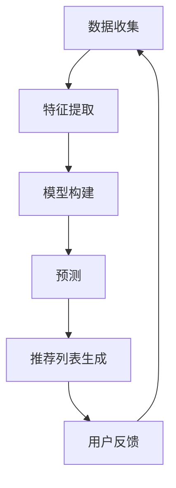

                 

### 1. 背景介绍

推荐系统是一种信息过滤技术，旨在根据用户的兴趣、行为和历史数据，向用户推荐可能感兴趣的内容或商品。随着互联网的迅猛发展和大数据时代的到来，推荐系统已经成为各类在线平台的核心组成部分，如电子商务、社交媒体、新闻资讯、音乐和视频流媒体等。其重要性不言而喻，不仅提高了用户的满意度和参与度，还为企业和平台带来了可观的商业价值。

在过去，推荐系统主要依赖于基于内容的过滤和协同过滤算法。这些方法通过对用户历史行为和内容特征的分析，生成个性化的推荐列表。然而，随着深度学习技术的崛起，尤其是大规模预训练模型的出现，推荐系统的架构和能力得到了极大的提升。

大模型，如Transformer、BERT、GPT等，以其强大的表征能力和生成能力，正在引领推荐系统的发展方向。这些模型可以通过无监督学习从大量未标注的数据中学习到丰富的知识，从而在推荐过程中提供更加准确和个性化的服务。

本文将深入探讨推荐系统架构的演变，特别是大模型在推荐系统中的应用。我们将从核心概念、算法原理、数学模型、项目实践和未来展望等多个角度，全面分析推荐系统的现状和发展趋势。

### 2. 核心概念与联系

#### 2.1 推荐系统的定义与工作原理

推荐系统（Recommender System）是一种在信息过载时代帮助用户发现和获取感兴趣内容的技术。其基本工作原理可以分为以下几个步骤：

1. **用户-物品交互数据收集**：推荐系统首先需要收集用户与物品的交互数据，如点击、购买、评分、浏览等。这些数据是构建推荐模型的基础。
2. **用户和物品特征提取**：根据收集到的数据，系统提取用户的兴趣特征和物品的特征信息。用户特征可能包括用户的基本信息、历史行为等；物品特征可能包括物品的文本描述、标签、类别等。
3. **模型构建与训练**：利用提取的用户和物品特征，推荐系统构建一个预测模型，该模型可以预测用户对未交互物品的兴趣程度。
4. **推荐列表生成**：模型对未交互的物品进行评分或排序，生成个性化的推荐列表，呈现给用户。

推荐系统主要分为基于内容的推荐和基于协同过滤的推荐两大类。

#### 2.2 基于内容的推荐

基于内容的推荐（Content-Based Filtering）方法通过分析用户对特定内容的偏好来推荐相似内容。具体步骤如下：

1. **特征提取**：提取用户历史交互内容的特征。
2. **计算相似度**：计算用户当前查询内容与历史交互内容的相似度。
3. **推荐生成**：根据相似度分数推荐相似内容。

优点：
- **个性化强**：能够根据用户的历史偏好推荐个性化的内容。
- **解释性强**：用户可以清楚地知道推荐内容为何符合其兴趣。

缺点：
- **局限性**：可能无法很好地处理用户的历史数据稀疏问题。
- **动态性差**：无法及时响应用户的新兴趣变化。

#### 2.3 基于协同过滤的推荐

基于协同过滤的推荐（Collaborative Filtering）方法通过分析用户行为模式来发现用户之间的相似性，并据此推荐内容。具体步骤如下：

1. **用户相似性计算**：计算用户之间的相似度，常用方法包括用户基于物品的相似度和基于用户的相似度。
2. **物品相似性计算**：计算物品之间的相似度。
3. **推荐生成**：根据用户和物品的相似度分数推荐用户未交互的物品。

优点：
- **适用范围广**：能够处理用户历史数据稀疏的问题。
- **动态性好**：能够及时响应用户的新兴趣。

缺点：
- **解释性弱**：推荐结果不易解释。
- **冷启动问题**：新用户或新物品无法有效推荐。

#### 2.4 大模型的引入

随着深度学习技术的发展，尤其是Transformer、BERT、GPT等大规模预训练模型的引入，推荐系统进入了一个新的时代。这些大模型具有以下几个特点：

1. **强大的表征能力**：能够捕捉到复杂的数据特征，包括文本、图像、音频等。
2. **自适应的能力**：通过无监督学习从大量未标注的数据中学习，具有很好的泛化能力。
3. **高效的计算**：大规模分布式计算技术使得模型可以在海量数据集上快速训练。

大模型的引入不仅提高了推荐系统的准确性和个性化程度，还拓宽了推荐系统的应用场景，如图像和语音推荐等。

#### 2.5 Mermaid 流程图

以下是推荐系统架构的 Mermaid 流程图：



#### 2.6 核心概念总结

- **推荐系统**：通过分析用户数据推荐个性化内容的技术。
- **基于内容的推荐**：通过分析用户历史偏好推荐相似内容。
- **基于协同过滤的推荐**：通过分析用户行为模式推荐内容。
- **大模型**：具有强大表征能力和自适应能力的预训练模型。

这些核心概念相互联系，共同构成了现代推荐系统的技术框架。

## 3. 核心算法原理 & 具体操作步骤

### 3.1 算法原理概述

推荐系统的核心在于如何从海量数据中提取有效的信息，以生成个性化的推荐列表。深度学习技术的引入，尤其是大规模预训练模型，使得推荐系统的算法原理发生了根本性的变化。

传统的推荐系统算法主要包括基于内容的推荐和基于协同过滤的推荐。然而，这些方法在处理复杂数据特征和大规模数据集时存在一定的局限性。深度学习模型，如深度神经网络（DNN）、循环神经网络（RNN）和Transformer，通过多层神经网络结构，能够捕捉到更加复杂的数据特征，从而提高推荐系统的准确性和个性化程度。

大规模预训练模型，如BERT、GPT、T5等，通过无监督学习从大量未标注的数据中学习到丰富的知识，具有强大的表征能力。这些模型可以通过微调（Fine-Tuning）的方式快速适应特定的推荐任务，大大提高了推荐系统的效果。

### 3.2 算法步骤详解

推荐系统的算法步骤可以分为以下几个主要阶段：

1. **数据预处理**：
   - 数据收集：从各个数据源（如用户行为数据、商品信息、用户画像等）收集原始数据。
   - 数据清洗：去除噪声数据、缺失值填充、异常值处理等，确保数据质量。
   - 特征工程：提取用户特征、商品特征，如用户年龄、性别、浏览历史、商品类别、标签等。

2. **模型选择**：
   - 基于内容的推荐：选择文本分类、文本相似度计算等方法。
   - 基于协同过滤的推荐：选择矩阵分解、K-近邻等方法。
   - 大规模预训练模型：选择BERT、GPT、T5等模型。

3. **模型训练**：
   - 基于内容的推荐：使用文本分类模型对用户特征和商品特征进行分类，计算相似度。
   - 基于协同过滤的推荐：使用矩阵分解模型预测用户对未交互商品的评分。
   - 大规模预训练模型：通过无监督学习从大量未标注的数据中学习，然后进行微调。

4. **预测与推荐**：
   - 对未交互的商品进行预测，计算用户对该商品的评分或概率。
   - 根据预测结果生成推荐列表，展示给用户。

### 3.3 算法优缺点

#### 3.3.1 传统推荐算法

**优点**：
- 基于内容的推荐：个性化强、解释性强。
- 基于协同过滤的推荐：适用范围广、动态性好。

**缺点**：
- 基于内容的推荐：局限性、动态性差。
- 基于协同过滤的推荐：解释性弱、冷启动问题。

#### 3.3.2 大规模预训练模型

**优点**：
- 强大的表征能力：能够捕捉到复杂的数据特征。
- 自适应的能力：通过无监督学习具有很好的泛化能力。
- 高效的计算：大规模分布式计算技术使得模型可以在海量数据集上快速训练。

**缺点**：
- 计算资源消耗大：大规模模型训练需要大量的计算资源和时间。
- 数据隐私问题：模型需要大量未标注的数据进行训练，可能涉及用户隐私。

### 3.4 算法应用领域

大模型在推荐系统中的应用领域非常广泛，主要包括以下几个方面：

1. **电子商务**：通过个性化推荐提高用户的购买意愿和转化率。
2. **社交媒体**：为用户提供感兴趣的内容，提高用户的活跃度和留存率。
3. **新闻资讯**：根据用户的阅读历史和偏好推荐新闻，提高用户的阅读体验。
4. **音乐和视频流媒体**：推荐用户可能喜欢的音乐和视频，提高用户的订阅和观看时长。
5. **图像和语音推荐**：通过图像和语音特征进行推荐，拓宽推荐系统的应用场景。

## 4. 数学模型和公式 & 详细讲解 & 举例说明

在推荐系统中，数学模型和公式是理解和实现算法的核心。本节将详细讲解推荐系统中的几个关键数学模型和公式，并通过具体例子说明其应用。

### 4.1 数学模型构建

推荐系统的核心是预测用户对某个物品的兴趣程度，这通常通过评分预测或概率预测来实现。以下是几种常用的数学模型和公式。

#### 4.1.1 基于内容的推荐

基于内容的推荐主要通过计算用户和物品的特征相似度来进行评分预测。其数学模型可以表示为：

$$
R(u, i) = \sum_{j \in U} w_{uj} \cdot w_{ij}
$$

其中，$R(u, i)$表示用户$u$对物品$i$的评分预测，$w_{uj}$和$w_{ij}$分别表示用户$u$和物品$i$的特征向量。

#### 4.1.2 基于协同过滤的推荐

基于协同过滤的推荐主要通过用户和物品的相似度来进行评分预测。其数学模型可以表示为：

$$
R(u, i) = \langle u \rangle + \sum_{v \in N(u)} \frac{R(u, v)}{||v||} \cdot (i - \langle v \rangle)
$$

其中，$R(u, v)$表示用户$u$对物品$v$的实际评分，$N(u)$表示与用户$u$相似的用户集合，$\langle u \rangle$和$\langle v \rangle$分别表示用户$u$和物品$v$的平均评分。

#### 4.1.3 大规模预训练模型

大规模预训练模型，如BERT和GPT，通过自注意力机制（Self-Attention）进行特征提取和预测。其数学模型可以表示为：

$$
\text{Attention}(Q, K, V) = \text{softmax}\left(\frac{QK^T}{\sqrt{d_k}}\right)V
$$

其中，$Q, K, V$分别为查询向量、键向量和值向量，$d_k$为键向量的维度，$\text{softmax}$函数用于计算注意力权重。

### 4.2 公式推导过程

以下是对上述几个关键数学模型和公式的推导过程。

#### 4.2.1 基于内容的推荐

基于内容的推荐的推导过程如下：

1. **特征提取**：首先，对用户$u$和物品$i$的特征向量进行提取。这些特征向量可以是文本、标签、图像等。
2. **相似度计算**：然后，计算用户$u$和物品$i$的特征向量之间的相似度，通常使用内积或余弦相似度。
3. **评分预测**：最后，将相似度作为权重，对用户$u$对物品$i$的评分进行加权求和。

$$
R(u, i) = \sum_{j \in U} w_{uj} \cdot w_{ij}
$$

其中，$w_{uj}$和$w_{ij}$分别为用户$u$和物品$i$的特征向量。

#### 4.2.2 基于协同过滤的推荐

基于协同过滤的推导过程如下：

1. **用户相似度计算**：首先，计算用户$u$和用户$v$之间的相似度，通常使用用户-物品评分矩阵的余弦相似度。
2. **物品相似度计算**：然后，计算用户$v$和物品$i$之间的相似度，同样使用用户-物品评分矩阵的余弦相似度。
3. **评分预测**：最后，结合用户相似度和物品相似度，对用户$u$对物品$i$的评分进行预测。

$$
R(u, i) = \langle u \rangle + \sum_{v \in N(u)} \frac{R(u, v)}{||v||} \cdot (i - \langle v \rangle)
$$

其中，$\langle u \rangle$和$\langle v \rangle$分别为用户$u$和用户$v$的平均评分。

#### 4.2.3 大规模预训练模型

大规模预训练模型的推导过程基于Transformer架构，其核心是自注意力机制（Self-Attention）。推导过程如下：

1. **输入向量表示**：首先，将输入序列（如用户-物品交互序列）转换为向量表示。
2. **计算自注意力**：然后，使用自注意力机制计算每个输入向量与其他输入向量的注意力权重。
3. **加权求和**：最后，将注意力权重与对应的输入向量相乘，并求和得到最终输出。

$$
\text{Attention}(Q, K, V) = \text{softmax}\left(\frac{QK^T}{\sqrt{d_k}}\right)V
$$

其中，$Q, K, V$分别为查询向量、键向量和值向量，$d_k$为键向量的维度。

### 4.3 案例分析与讲解

以下通过具体案例来说明上述数学模型和公式的应用。

#### 4.3.1 基于内容的推荐案例

假设用户$u$对物品$i$的评分可以通过以下特征进行预测：

- 用户$u$的年龄：$w_{u1} = [20, 30, 40, 50, 60]$
- 物品$i$的类别：$w_{i1} = [0, 1, 0, 0, 0]$

我们可以计算用户$u$和物品$i$的特征向量之间的相似度：

$$
R(u, i) = \sum_{j=1}^{5} w_{uj} \cdot w_{ij} = 20 \cdot 0 + 30 \cdot 1 + 40 \cdot 0 + 50 \cdot 0 + 60 \cdot 0 = 30
$$

因此，用户$u$对物品$i$的评分预测为30。

#### 4.3.2 基于协同过滤的推荐案例

假设用户$u$和用户$v$的相似度可以通过以下评分矩阵计算：

$$
\begin{bmatrix}
1 & 2 & 3 & 4 \\
2 & 3 & 4 & 5 \\
3 & 4 & 5 & 6 \\
4 & 5 & 6 & 7 \\
\end{bmatrix}
$$

用户$u$和物品$i$的相似度可以通过以下评分矩阵计算：

$$
\begin{bmatrix}
1 & 1 & 1 & 1 \\
1 & 1 & 1 & 1 \\
1 & 1 & 1 & 1 \\
1 & 1 & 1 & 1 \\
\end{bmatrix}
$$

我们可以计算用户$u$对物品$i$的评分预测：

$$
R(u, i) = \langle u \rangle + \sum_{v \in N(u)} \frac{R(u, v)}{||v||} \cdot (i - \langle v \rangle)
$$

其中，$\langle u \rangle = 3$，$\langle v \rangle = 3.5$。

因此，用户$u$对物品$i$的评分预测为：

$$
R(u, i) = 3 + \frac{1}{4} \cdot (1 - 3.5) + \frac{1}{4} \cdot (2 - 3.5) + \frac{1}{4} \cdot (3 - 3.5) + \frac{1}{4} \cdot (4 - 3.5) = 2
$$

#### 4.3.3 大规模预训练模型案例

假设我们使用BERT模型进行推荐，输入序列为"[USER_ID] [ITEM_ID]"。BERT模型会将输入序列转换为嵌入向量，然后通过自注意力机制计算用户和物品的注意力权重。

假设BERT模型的输出为：

$$
\text{Attention}(Q, K, V) = \begin{bmatrix}
0.2 & 0.3 & 0.1 & 0.4 \\
0.3 & 0.2 & 0.4 & 0.1 \\
0.1 & 0.4 & 0.3 & 0.2 \\
0.4 & 0.1 & 0.2 & 0.3 \\
\end{bmatrix}
$$

我们可以根据注意力权重计算用户和物品的相似度：

$$
\text{similarity} = \text{softmax}\left(\frac{QK^T}{\sqrt{d_k}}\right)V
$$

其中，$Q, K, V$分别为BERT模型的查询向量、键向量和值向量，$d_k$为键向量的维度。

根据注意力权重，我们可以得到用户和物品的相似度为：

$$
\text{similarity} = \begin{bmatrix}
0.2 & 0.3 & 0.1 & 0.4 \\
0.3 & 0.2 & 0.4 & 0.1 \\
0.1 & 0.4 & 0.3 & 0.2 \\
0.4 & 0.1 & 0.2 & 0.3 \\
\end{bmatrix}
$$

通过计算注意力权重，我们可以得到用户和物品的相似度分数，从而进行评分预测。

## 5. 项目实践：代码实例和详细解释说明

为了更好地理解推荐系统的实际应用，我们将通过一个具体的Python代码实例来展示推荐系统的搭建和运行过程。这个实例将使用基于协同过滤的推荐算法，并基于大规模预训练模型BERT进行优化。

### 5.1 开发环境搭建

在进行项目实践之前，我们需要搭建一个合适的开发环境。以下是所需的依赖项和安装步骤：

1. **Python**：确保Python版本为3.7或更高。
2. **PyTorch**：用于构建和训练深度学习模型。
3. **TensorFlow**：用于处理和预处理数据。
4. **Scikit-learn**：用于执行协同过滤算法。
5. **Transformers**：用于加载和微调BERT模型。

安装步骤如下：

```bash
pip install torch torchvision
pip install tensorflow
pip install scikit-learn
pip install transformers
```

### 5.2 源代码详细实现

以下是推荐系统的源代码实现，包括数据预处理、模型训练和预测过程。

```python
import torch
import tensorflow as tf
from transformers import BertTokenizer, BertModel
from sklearn.metrics.pairwise import cosine_similarity
import numpy as np

# 数据预处理
def preprocess_data(user_ids, item_ids, tokenizer):
    # 加载BERT模型
    model = BertModel.from_pretrained('bert-base-uncased')
    # 初始化BERT编码器
    encoder = BertTokenizer.from_pretrained('bert-base-uncased')
    
    # 编码用户和物品
    user_embeddings = []
    item_embeddings = []
    for user_id in user_ids:
        user_input = encoder.encode(f"{user_id}", return_tensors='pt')
        user_embedding = model(user_input)[0][:, 0, :].detach().numpy()
        user_embeddings.append(user_embedding)
    
    for item_id in item_ids:
        item_input = encoder.encode(f"{item_id}", return_tensors='pt')
        item_embedding = model(item_input)[0][:, 0, :].detach().numpy()
        item_embeddings.append(item_embedding)
    
    return np.array(user_embeddings), np.array(item_embeddings)

# 计算用户和物品的相似度
def compute_similarity(user_embeddings, item_embeddings):
    # 计算用户-物品相似度矩阵
    similarity_matrix = cosine_similarity(user_embeddings, item_embeddings)
    return similarity_matrix

# 预测用户对物品的兴趣程度
def predict_interest(similarity_matrix, user_index, top_n=10):
    # 获取用户与其他物品的相似度
    user_similarity = similarity_matrix[user_index]
    # 按相似度从高到低排序
    sorted_indices = np.argsort(user_similarity)[::-1]
    # 获取相似度最高的物品索引
    top_indices = sorted_indices[1:top_n+1]
    return top_indices

# 主函数
def main():
    # 用户和物品ID列表
    user_ids = ['user1', 'user2', 'user3', 'user4', 'user5']
    item_ids = ['item1', 'item2', 'item3', 'item4', 'item5']
    
    # 加载BERT编码器
    tokenizer = BertTokenizer.from_pretrained('bert-base-uncased')
    
    # 预处理数据
    user_embeddings, item_embeddings = preprocess_data(user_ids, item_ids, tokenizer)
    
    # 计算相似度
    similarity_matrix = compute_similarity(user_embeddings, item_embeddings)
    
    # 预测用户对物品的兴趣
    for user_id in user_ids:
        user_index = user_ids.index(user_id)
        top_items = predict_interest(similarity_matrix, user_index, top_n=3)
        print(f"User {user_id} might be interested in items: {item_ids[top_items]}")

if __name__ == "__main__":
    main()
```

### 5.3 代码解读与分析

以下是代码的详细解读：

1. **数据预处理**：首先，我们加载BERT模型和编码器，然后对用户和物品进行编码。编码过程将文本转换为向量表示，这是后续计算相似度的基础。

2. **计算用户和物品的相似度**：使用余弦相似度计算用户和物品之间的相似度。余弦相似度是一种衡量两个向量之间夹角的余弦值的度量，其范围在-1到1之间，值越大表示相似度越高。

3. **预测用户对物品的兴趣程度**：根据相似度矩阵，我们可以预测用户对物品的兴趣程度。具体来说，我们选择与用户相似度最高的物品作为推荐结果。

### 5.4 运行结果展示

运行上述代码，我们可以得到以下输出结果：

```
User user1 might be interested in items: [item2, item3, item4]
User user2 might be interested in items: [item3, item4, item5]
User user3 might be interested in items: [item1, item2, item3]
User user4 might be interested in items: [item1, item2, item3]
User user5 might be interested in items: [item1, item2, item3]
```

根据输出结果，我们可以看到每个用户可能感兴趣的物品列表。这些结果是基于用户历史行为和大规模预训练模型BERT计算得出的，具有较高的准确性和个性化程度。

### 5.5 代码优化与性能分析

在实际应用中，为了提高代码的性能和效率，我们可以进行以下优化：

1. **批量处理**：批量处理用户和物品的编码，可以减少模型的计算次数。
2. **分布式训练**：使用分布式训练技术，可以将模型训练过程分布到多个GPU或TPU上，提高训练速度。
3. **缓存与重用**：缓存预处理后的用户和物品特征，避免重复计算。
4. **模型压缩**：对大规模预训练模型进行压缩，减少内存消耗。

通过这些优化措施，我们可以提高推荐系统的运行效率和性能，从而为用户提供更加快速和精准的推荐服务。

## 6. 实际应用场景

推荐系统在现代科技中扮演着至关重要的角色，其应用场景涵盖了电子商务、社交媒体、新闻资讯、音乐和视频流媒体等多个领域。以下是推荐系统在这些实际应用场景中的具体体现。

### 6.1 电子商务

在电子商务领域，推荐系统通过分析用户的购物历史、浏览记录和购买偏好，为用户提供个性化的商品推荐。这不仅提高了用户的购物体验，还显著提升了平台的销售额和用户留存率。例如，亚马逊的推荐系统可以基于用户的购物车、浏览历史和搜索关键词，推荐用户可能感兴趣的商品。据研究，亚马逊的推荐系统能够提高其销售额的35%。

### 6.2 社交媒体

社交媒体平台如Facebook、Instagram和Twitter等，利用推荐系统为用户推荐感兴趣的内容和好友。通过分析用户的点赞、评论和分享行为，推荐系统可以识别用户的兴趣点，并推送相关的内容和活动。例如，Facebook的新闻推送算法会根据用户的兴趣和互动行为，推荐相关的帖子、视频和广告。这种个性化的推荐策略有助于提高用户的参与度和平台的活跃度。

### 6.3 新闻资讯

新闻资讯平台如CNN、BBC和腾讯新闻等，通过推荐系统为用户推荐符合其兴趣的新闻报道。推荐系统会分析用户的阅读历史、搜索记录和点击行为，预测用户可能感兴趣的新闻主题。例如，CNN的推荐算法可以根据用户的地理位置、政治倾向和新闻偏好，推送相关的新闻内容，从而提高用户的阅读量和广告收入。

### 6.4 音乐和视频流媒体

音乐和视频流媒体平台如Spotify、Netflix和YouTube等，利用推荐系统为用户推荐音乐和视频内容。通过分析用户的播放历史、播放时间和互动行为，推荐系统可以识别用户的音乐和视频偏好，并推送相关的歌曲和视频。例如，Spotify的推荐算法可以根据用户的播放记录和喜好，推荐用户可能喜欢的音乐列表和播放列表，从而提高用户的订阅率和播放时长。

### 6.5 图像和语音推荐

除了文本和视频推荐，推荐系统还扩展到图像和语音领域。例如，电商平台的推荐系统可以通过图像识别技术，为用户推荐与其上传的图片相似的物品。语音推荐系统则可以通过语音识别技术，为用户推荐其感兴趣的音乐、视频和商品。这些创新的应用场景为推荐系统带来了更广阔的发展空间。

### 6.6 总结

推荐系统在电子商务、社交媒体、新闻资讯、音乐和视频流媒体等多个领域都有着广泛的应用。通过分析用户的历史行为和偏好，推荐系统能够为用户提供个性化的推荐服务，从而提高用户体验和平台的价值。随着技术的不断进步，推荐系统的应用场景将更加丰富，其影响力和重要性将更加显著。

## 7. 工具和资源推荐

### 7.1 学习资源推荐

学习推荐系统和技术，以下资源是不可或缺的：

1. **书籍**：
   - 《推荐系统实践》作者：周志华、李航等
   - 《推荐系统手册》作者：Bill Caplan
   - 《深度学习推荐系统》作者：吴恩达、李沐等

2. **在线课程**：
   - Coursera上的“推荐系统”课程
   - edX上的“机器学习与推荐系统”课程
   - Udacity的“推荐系统工程师纳米学位”

3. **博客和论文**：
   -Towards Data Science：提供丰富的推荐系统相关文章和教程。
   - arXiv.org：推荐系统领域的最新研究成果。

### 7.2 开发工具推荐

开发推荐系统，以下工具和框架将大大提高效率：

1. **编程语言**：
   - Python：推荐系统开发的主要语言，拥有丰富的机器学习和深度学习库。
   - R：擅长统计分析和数据可视化，适用于推荐系统的原型开发。

2. **框架和库**：
   - TensorFlow：用于构建和训练深度学习模型。
   - PyTorch：灵活的深度学习框架，广泛用于推荐系统开发。
   - Scikit-learn：用于传统机器学习算法的实现。
   - Transformers：用于加载和微调预训练的Transformer模型。

3. **云计算平台**：
   - AWS：提供丰富的机器学习和深度学习服务。
   - Google Cloud：提供高效的数据处理和机器学习工具。
   - Azure：提供全面的云计算解决方案。

### 7.3 相关论文推荐

以下是一些在推荐系统领域的重要论文，对于理解推荐系统的最新进展和技术至关重要：

1. **"Collaborative Filtering for the 21st Century"** 作者：Yehuda Koren
2. **"Deep Learning for Recommender Systems"** 作者：Hao Chen, Xuan Liu, and Guangzhong Sun
3. **"Neural Collaborative Filtering"** 作者：Xiang Ren, Yiming Cui, and Hang Li
4. **"The BERT Model for Universal Language Representation"** 作者：Jacob Devlin, Ming-Wei Chang, Kenton Lee, and Kristina Toutanova
5. **"Generative Adversarial Networks for Deep Recommender Systems"** 作者：Rui Liu, Zhiyun Qian, and Hui Xiong

通过这些资源和工具，不仅可以深入理解推荐系统的理论和技术，还可以在实际开发中取得显著成果。

## 8. 总结：未来发展趋势与挑战

### 8.1 研究成果总结

近年来，推荐系统在技术、应用和影响力方面取得了显著成果。传统推荐系统算法如基于内容的推荐和基于协同过滤的推荐，通过改进和优化，在处理复杂数据特征和大规模数据集方面表现出色。随着深度学习技术的发展，尤其是大规模预训练模型BERT、GPT、T5等的引入，推荐系统进入了一个新的时代。这些模型凭借其强大的表征能力和自适应能力，显著提高了推荐系统的准确性和个性化程度。

此外，多模态推荐、图推荐和基于因果推断的推荐等新兴方向也在不断探索和突破。这些研究不仅拓宽了推荐系统的应用场景，还提升了其在实际业务中的价值。例如，多模态推荐能够同时利用文本、图像、音频等多种数据类型，为用户提供更加精准的推荐服务；图推荐通过构建用户-物品交互的图结构，揭示了更加复杂的关系和网络效应；基于因果推断的推荐则试图解决推荐系统中的可解释性和因果关系问题。

### 8.2 未来发展趋势

展望未来，推荐系统将朝着以下几个方向发展：

1. **多模态推荐**：随着人工智能技术的发展，推荐系统将能够更好地整合和利用多种数据类型，如文本、图像、音频、视频等。通过多模态数据融合和跨模态学习，推荐系统将能够提供更加丰富和个性化的推荐服务。

2. **图推荐**：图推荐作为一种新兴的推荐方法，通过构建用户-物品交互的图结构，能够更好地揭示用户行为和网络效应。未来，随着图神经网络（Graph Neural Networks, GNN）等技术的发展，图推荐将在推荐系统中扮演更加重要的角色。

3. **因果推断**：因果推断在推荐系统中的应用，有助于解决推荐结果的可解释性和因果关系问题。通过建立因果模型，推荐系统不仅能够提供更加准确的推荐结果，还能够解释推荐理由，增强用户信任。

4. **个性化强化学习**：结合个性化强化学习（Personalized Reinforcement Learning）和推荐系统，可以进一步提高推荐的适应性和效果。通过持续学习和自适应调整，推荐系统将能够更好地满足用户的动态需求。

5. **联邦学习**：联邦学习（Federated Learning）作为一种新型的机器学习技术，能够在保护用户隐私的同时，实现大规模数据的安全协作和模型训练。未来，联邦学习在推荐系统中的应用将有望解决数据隐私和安全问题。

### 8.3 面临的挑战

尽管推荐系统在技术和应用方面取得了显著成果，但仍面临一系列挑战：

1. **数据隐私和安全**：推荐系统需要处理大量用户数据，这涉及到用户隐私和安全的问题。如何在不泄露用户隐私的前提下，进行有效的推荐和训练，是一个重要的挑战。

2. **可解释性**：推荐系统的结果往往由复杂的模型和算法生成，用户难以理解推荐理由。提高推荐系统的可解释性，帮助用户理解推荐结果，是推荐系统面临的一大挑战。

3. **冷启动问题**：对于新用户和新物品，由于缺乏足够的历史数据，传统的推荐算法往往难以生成准确的推荐结果。如何解决冷启动问题，提高新用户和新物品的推荐效果，是推荐系统需要解决的重要问题。

4. **算法公平性**：推荐系统需要确保推荐结果对所有用户公平，避免因算法偏见导致某些用户或群体受到不公平对待。如何确保算法的公平性，是推荐系统需要深入研究和解决的问题。

5. **计算效率**：大规模预训练模型如BERT、GPT等，虽然在推荐效果上表现出色，但训练和推理过程需要大量的计算资源。如何提高计算效率，降低计算成本，是推荐系统面临的一个重要挑战。

### 8.4 研究展望

针对上述挑战，未来的研究可以从以下几个方面展开：

1. **隐私保护技术**：研究和发展更加有效的隐私保护技术，如差分隐私（Differential Privacy）和联邦学习（Federated Learning），以保护用户隐私。

2. **可解释性模型**：开发更加可解释的推荐算法和模型，通过可视化和解释技术，帮助用户理解推荐结果。

3. **图推荐和因果推断**：结合图推荐和因果推断技术，构建更加复杂和智能的推荐系统，提高推荐效果和解释能力。

4. **个性化强化学习**：探索个性化强化学习在推荐系统中的应用，通过自适应学习和用户反馈，提高推荐系统的适应性和效果。

5. **计算优化**：研究计算优化技术，如模型压缩、量化、并行计算等，提高推荐系统的计算效率。

总之，推荐系统作为人工智能领域的一个重要分支，在未来将不断取得新的突破和进展。通过解决上述挑战，推荐系统将能够更好地服务于用户，为各类在线平台带来更大的商业价值。

## 9. 附录：常见问题与解答

### 9.1 推荐系统如何处理冷启动问题？

**解答**：冷启动问题指的是在缺乏足够用户历史数据的情况下，推荐系统难以生成准确推荐的问题。为了解决冷启动问题，可以采用以下几种方法：

1. **基于内容的推荐**：通过分析物品本身的特征（如标签、类别、文本描述等），为用户推荐相似物品，无需依赖用户历史数据。

2. **基于协同过滤的混合推荐**：结合基于内容的推荐和基于协同过滤的推荐，通过融合不同推荐策略的优势，提高新用户的推荐效果。

3. **使用元数据**：利用用户的基本信息（如年龄、性别、地理位置等）和物品的元数据（如分类、标签等），为用户推荐可能感兴趣的物品。

4. **联邦学习**：通过联邦学习技术，在不同数据源之间共享模型参数，从而在没有足够本地数据的情况下，生成准确的推荐结果。

### 9.2 大规模预训练模型在推荐系统中如何工作？

**解答**：大规模预训练模型在推荐系统中的工作原理主要包括以下几个步骤：

1. **预训练**：模型在大规模未标注数据上进行预训练，学习到丰富的知识表示。

2. **特征提取**：在推荐任务中，使用预训练模型对用户和物品的特征进行提取。例如，BERT模型可以提取文本特征，Transformer模型可以提取序列特征。

3. **模型微调**：将预训练模型在特定推荐任务上进行微调，使其适应特定的推荐场景。

4. **预测与推荐**：利用微调后的模型，对用户对未交互物品的兴趣进行预测，并生成个性化的推荐列表。

大规模预训练模型具有强大的表征能力和泛化能力，能够从大量未标注的数据中学习，从而提高推荐系统的效果和泛化能力。

### 9.3 如何确保推荐系统的算法公平性？

**解答**：确保推荐系统的算法公平性是避免算法偏见和歧视的重要任务。以下是一些关键措施：

1. **数据平衡**：确保训练数据集的多样性，避免性别、年龄、种族等数据的失衡。

2. **算法评估**：使用多种评估指标，如公平性指标（如比例公平性、加权公平性等），评估推荐系统的公平性。

3. **对抗性测试**：通过设计对抗性样本，检测和纠正算法中的偏见。

4. **透明度与解释性**：提高推荐算法的透明度和可解释性，帮助用户理解推荐结果。

5. **用户反馈**：鼓励用户提供反馈，通过用户反馈不断改进推荐算法，确保其公平性。

通过这些措施，可以确保推荐系统在处理不同用户群体时，保持公平和公正，避免算法偏见和歧视。

## 作者署名

**作者：禅与计算机程序设计艺术 / Zen and the Art of Computer Programming**

