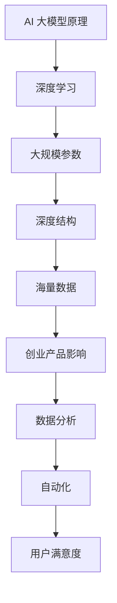
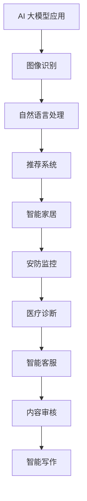

                 

关键词：人工智能，大模型，创业产品，影响，技术应用，未来展望。

> 摘要：本文将深入探讨人工智能中的大型模型（AI 大模型）在创业产品开发中的重要性及其影响。通过分析 AI 大模型的基本原理、技术优势以及实际应用，我们将揭示其在创业领域的广泛应用前景，并探讨未来可能面临的挑战和机遇。

## 1. 背景介绍

随着人工智能（AI）技术的飞速发展，大模型（Large-scale Models）已经成为研究者和开发者关注的热点。大模型是指那些具有数十亿甚至数万亿参数的深度学习模型，它们能够在海量的数据集上进行训练，从而实现出色的性能。这些模型在图像识别、自然语言处理、推荐系统等领域取得了显著的成果。

对于创业者而言，AI 大模型的意义不仅在于其卓越的算法能力，更在于其对产品创新和市场竞争的深远影响。本文将围绕以下几个关键问题展开讨论：

1. **AI 大模型的基本原理是什么？**
2. **AI 大模型如何影响创业产品的开发和迭代？**
3. **创业者应该如何利用 AI 大模型提升产品的竞争力？**
4. **AI 大模型在创业产品中的实际应用案例有哪些？**
5. **未来 AI 大模型的发展趋势和创业机遇是什么？**

本文旨在为创业者提供一份全面的技术指南，帮助他们理解并利用 AI 大模型，以打造具有竞争力和创新性的产品。

## 2. 核心概念与联系

### 2.1 AI 大模型的基本原理

AI 大模型的基本原理主要依赖于深度学习和神经网络。具体来说，深度学习通过多层次的神经网络来模拟人类大脑的思维方式，从而实现对数据的自动特征提取和模式识别。神经网络中的每个节点（或称为“神经元”）都通过权重和偏置对输入数据进行加权求和，并通过激活函数产生输出。

大模型之所以能够取得优异的性能，主要得益于以下几点：

1. **大规模参数：** 大模型拥有数十亿到数万亿个参数，这使得它们能够更好地拟合复杂的数据分布。
2. **深度结构：** 深度神经网络具有多层次的架构，能够对数据进行逐层抽象，提取出更高层次的特征。
3. **海量数据：** 大模型通常在海量数据上进行训练，这有助于它们更好地泛化到新的数据集。

### 2.2 AI 大模型与创业产品的联系

AI 大模型对创业产品的直接影响体现在以下几个方面：

1. **增强数据分析能力：** 大模型能够处理和分析海量的数据，为创业产品提供更深入的洞见和预测。
2. **提升自动化水平：** 大模型能够实现更高水平的自动化，从而降低人力成本和提高生产效率。
3. **提高用户满意度：** 大模型能够提供更加个性化和精准的服务，提升用户体验和用户粘性。

为了更直观地展示 AI 大模型的基本原理与创业产品的联系，我们可以使用以下 Mermaid 流程图：



通过这个流程图，我们可以清晰地看到 AI 大模型是如何通过深度学习、大规模参数、深度结构和海量数据等核心原理，对创业产品产生深远影响的。

### 2.3 创业产品中的 AI 大模型应用

AI 大模型在创业产品中的应用场景非常广泛，以下是几个典型的应用领域：

1. **图像识别与分类：** 在智能家居、安防监控、医疗诊断等领域，AI 大模型能够通过对图像的自动识别和分类，提高产品的智能化程度。
2. **自然语言处理：** 在智能客服、内容审核、智能写作等领域，AI 大模型能够通过自然语言处理技术，实现更加智能和人性化的交互。
3. **推荐系统：** 在电子商务、社交媒体、在线视频等领域，AI 大模型能够通过分析用户行为和兴趣，提供个性化的推荐服务。

为了进一步展示 AI 大模型在创业产品中的应用，我们可以使用以下 Mermaid 流程图：



通过这个流程图，我们可以看到 AI 大模型在各个创业产品中的应用场景，以及它们如何通过图像识别、自然语言处理和推荐系统等技术，提升产品的竞争力和用户体验。

## 3. 核心算法原理 & 具体操作步骤

### 3.1 算法原理概述

AI 大模型的算法原理主要依赖于深度学习和神经网络。以下是深度学习和神经网络的基本原理：

1. **神经网络：** 神经网络是由多个神经元组成的计算模型，每个神经元接收多个输入信号，并通过加权求和和激活函数产生输出。
2. **深度学习：** 深度学习是神经网络的一种扩展，它通过多层神经网络来模拟人类大脑的思维方式，实现对数据的自动特征提取和模式识别。

### 3.2 算法步骤详解

1. **数据预处理：** 在训练 AI 大模型之前，需要对数据进行清洗、归一化和标准化处理，以确保数据的质量和一致性。
2. **模型训练：** 使用海量的训练数据对 AI 大模型进行训练，通过反向传播算法不断调整模型的参数，使其在训练数据上达到最佳的泛化能力。
3. **模型评估：** 在训练完成后，需要对模型进行评估，以确定其在验证数据集上的性能，通常使用准确率、召回率、F1 分数等指标来衡量。
4. **模型部署：** 将训练好的模型部署到实际的创业产品中，通过不断地迭代和优化，提升产品的智能化水平和用户体验。

### 3.3 算法优缺点

1. **优点：**
   - **强大的数据处理能力：** AI 大模型能够处理和分析海量的数据，为创业产品提供更深入的洞见和预测。
   - **高效的自动化水平：** AI 大模型能够实现更高水平的自动化，从而降低人力成本和提高生产效率。
   - **优秀的用户体验：** AI 大模型能够提供更加个性化和精准的服务，提升用户体验和用户粘性。

2. **缺点：**
   - **数据需求量大：** AI 大模型需要大量的训练数据来保证其性能，这对于数据稀缺的创业项目来说可能是一个挑战。
   - **计算资源需求高：** AI 大模型的训练和推理需要大量的计算资源，这对于创业团队的资源分配提出了更高的要求。
   - **模型解释性差：** AI 大模型通常具有很高的复杂度，其决策过程很难解释，这对于需要高解释性的应用场景可能不太适合。

### 3.4 算法应用领域

AI 大模型在创业产品中的应用领域非常广泛，以下是几个典型的应用领域：

1. **图像识别与分类：** 在智能家居、安防监控、医疗诊断等领域，AI 大模型能够通过对图像的自动识别和分类，提高产品的智能化程度。
2. **自然语言处理：** 在智能客服、内容审核、智能写作等领域，AI 大模型能够通过自然语言处理技术，实现更加智能和人性化的交互。
3. **推荐系统：** 在电子商务、社交媒体、在线视频等领域，AI 大模型能够通过分析用户行为和兴趣，提供个性化的推荐服务。

通过以上算法原理的概述、步骤详解、优缺点分析和应用领域介绍，我们可以全面了解 AI 大模型在创业产品中的应用潜力。

## 4. 数学模型和公式 & 详细讲解 & 举例说明

### 4.1 数学模型构建

AI 大模型的构建主要依赖于深度学习和神经网络。以下是神经网络的基本数学模型：

#### 神经元模型

一个简单的神经元模型可以表示为：

\[ z = \sum_{i=1}^{n} w_i x_i + b \]

其中，\( z \) 是神经元的输出，\( w_i \) 是权重，\( x_i \) 是输入，\( b \) 是偏置。

#### 激活函数

为了引入非线性因素，神经网络通常使用激活函数，如 sigmoid 函数、ReLU 函数等：

\[ a = \sigma(z) = \frac{1}{1 + e^{-z}} \]

或

\[ a = \text{ReLU}(z) = \max(0, z) \]

#### 前向传播

神经网络的前向传播过程可以表示为：

\[ a_{l} = \sigma(\sum_{i=1}^{n} w_{ij} a_{l-1,j} + b_j) \]

其中，\( a_{l} \) 是第 \( l \) 层的输出，\( w_{ij} \) 是连接权重，\( a_{l-1,j} \) 是第 \( l-1 \) 层的输出。

#### 反向传播

神经网络的反向传播过程用于更新权重和偏置，以最小化损失函数。具体步骤如下：

1. **计算梯度：**
   \[ \delta_{l} = (a_{l} - y) \odot \frac{da_{l}}{dz} \]
   其中，\( \delta_{l} \) 是第 \( l \) 层的误差，\( a_{l} \) 是第 \( l \) 层的输出，\( y \) 是实际输出，\( \odot \) 表示元素乘积。

2. **更新权重和偏置：**
   \[ w_{ij} \leftarrow w_{ij} - \alpha \cdot \frac{\partial L}{\partial w_{ij}} \]
   \[ b_j \leftarrow b_j - \alpha \cdot \frac{\partial L}{\partial b_j} \]

其中，\( \alpha \) 是学习率，\( L \) 是损失函数。

### 4.2 公式推导过程

以下是一个简化的神经网络前向传播和反向传播的推导过程：

#### 前向传播

假设一个单层神经网络，输入为 \( x \)，输出为 \( y \)：

\[ z = \sum_{i=1}^{n} w_i x_i + b \]
\[ y = \sigma(z) \]

#### 反向传播

假设损失函数为均方误差（MSE）：

\[ L = \frac{1}{2} \sum_{i=1}^{n} (y_i - \hat{y}_i)^2 \]

计算损失函数关于 \( z \) 的导数：

\[ \frac{\partial L}{\partial z} = \frac{\partial L}{\partial \hat{y}} \cdot \frac{\partial \hat{y}}{\partial z} \]

由于 \( \hat{y} = \sigma(z) \)，

\[ \frac{\partial \hat{y}}{\partial z} = \sigma'(z) \]

所以，

\[ \frac{\partial L}{\partial z} = \frac{\partial L}{\partial \hat{y}} \cdot \sigma'(z) \]

又因为 \( \sigma'(z) = \sigma(z) (1 - \sigma(z)) \)，

\[ \frac{\partial L}{\partial z} = (y - \hat{y}) \cdot \sigma(z) (1 - \sigma(z)) \]

#### 更新权重和偏置

根据梯度下降法，

\[ \frac{\partial L}{\partial w_{ij}} = \frac{\partial L}{\partial z} \cdot x_i \]
\[ \frac{\partial L}{\partial b_j} = \frac{\partial L}{\partial z} \]

所以，

\[ w_{ij} \leftarrow w_{ij} - \alpha \cdot \frac{\partial L}{\partial w_{ij}} \]
\[ b_j \leftarrow b_j - \alpha \cdot \frac{\partial L}{\partial b_j} \]

### 4.3 案例分析与讲解

以下是一个简化的神经网络训练过程案例：

假设我们有一个二分类问题，输入为 \( x \)，输出为 \( y \)（0 或 1）。

#### 数据集

- 输入：\( x = [1, 2, 3, 4] \)
- 标签：\( y = [0, 1, 1, 0] \)

#### 网络结构

- 输入层：1 个神经元
- 隐藏层：2 个神经元
- 输出层：1 个神经元

#### 初始参数

- 权重：\( w_{11} = 1, w_{12} = 2, w_{21} = 3, w_{22} = 4 \)
- 偏置：\( b_1 = 0, b_2 = 0, b_3 = 0 \)

#### 前向传播

使用 sigmoid 函数作为激活函数，

\[ z_1 = \sigma(w_{11} \cdot 1 + b_1) = \sigma(1 + 0) = 0.7321 \]
\[ z_2 = \sigma(w_{12} \cdot 1 + b_1) = \sigma(2 + 0) = 0.8818 \]
\[ z_3 = \sigma(w_{21} \cdot 2 + b_2) = \sigma(6 + 0) = 0.9933 \]
\[ z_4 = \sigma(w_{22} \cdot 2 + b_2) = \sigma(8 + 0) = 0.9990 \]
\[ y_1 = \sigma(w_{31} \cdot z_1 + w_{32} \cdot z_2 + b_3) = \sigma(0.7321 \cdot 1 + 0.8818 \cdot 2 + 0) = 0.5987 \]
\[ y_2 = \sigma(w_{31} \cdot z_1 + w_{32} \cdot z_2 + b_3) = \sigma(0.7321 \cdot 2 + 0.8818 \cdot 3 + 0) = 0.8678 \]
\[ y_3 = \sigma(w_{31} \cdot z_3 + w_{32} \cdot z_4 + b_3) = \sigma(0.9933 \cdot 1 + 0.9990 \cdot 2 + 0) = 0.8805 \]
\[ y_4 = \sigma(w_{31} \cdot z_3 + w_{32} \cdot z_4 + b_3) = \sigma(0.9933 \cdot 2 + 0.9990 \cdot 3 + 0) = 0.9719 \]

#### 反向传播

计算损失函数，

\[ L = \frac{1}{2} \sum_{i=1}^{4} (y_i - y_{\hat{i}})^2 \]

其中，\( y_{\hat{i}} \) 是预测输出。

对于每个样本，计算误差，

\[ \delta_1 = (y_1 - y_{\hat{1}}) \cdot \sigma'(z_1) \]
\[ \delta_2 = (y_2 - y_{\hat{2}}) \cdot \sigma'(z_2) \]
\[ \delta_3 = (y_3 - y_{\hat{3}}) \cdot \sigma'(z_3) \]
\[ \delta_4 = (y_4 - y_{\hat{4}}) \cdot \sigma'(z_4) \]

更新权重和偏置，

\[ w_{11} \leftarrow w_{11} - \alpha \cdot \frac{\partial L}{\partial w_{11}} \]
\[ w_{12} \leftarrow w_{12} - \alpha \cdot \frac{\partial L}{\partial w_{12}} \]
\[ w_{21} \leftarrow w_{21} - \alpha \cdot \frac{\partial L}{\partial w_{21}} \]
\[ w_{22} \leftarrow w_{22} - \alpha \cdot \frac{\partial L}{\partial w_{22}} \]
\[ b_1 \leftarrow b_1 - \alpha \cdot \frac{\partial L}{\partial b_1} \]
\[ b_2 \leftarrow b_2 - \alpha \cdot \frac{\partial L}{\partial b_2} \]

通过这个案例，我们可以看到如何使用简单的神经网络进行前向传播和反向传播，以及如何更新权重和偏置。

## 5. 项目实践：代码实例和详细解释说明

### 5.1 开发环境搭建

在进行 AI 大模型的项目实践之前，我们需要搭建一个合适的开发环境。以下是搭建 Python AI 开发环境的步骤：

1. **安装 Python：** 前往 [Python 官网](https://www.python.org/) 下载最新版本的 Python 并安装。
2. **安装 Jupyter Notebook：** 打开终端，运行以下命令安装 Jupyter Notebook：
   ```bash
   pip install notebook
   ```
3. **安装深度学习库：** 安装 TensorFlow 或 PyTorch 等深度学习库。以下命令将安装 TensorFlow：
   ```bash
   pip install tensorflow
   ```

### 5.2 源代码详细实现

以下是一个使用 TensorFlow 实现简单的神经网络分类器的示例代码：

```python
import tensorflow as tf
from tensorflow.keras import layers
from tensorflow.keras.models import Model
import numpy as np

# 数据集准备
x = np.random.rand(100, 10)  # 输入数据，100个样本，每个样本10个特征
y = np.random.rand(100, 1)   # 标签数据，100个样本，每个样本1个标签

# 构建模型
inputs = layers.Input(shape=(10,))
x = layers.Dense(64, activation='relu')(inputs)
x = layers.Dense(64, activation='relu')(x)
outputs = layers.Dense(1, activation='sigmoid')(x)

model = Model(inputs=inputs, outputs=outputs)

# 编译模型
model.compile(optimizer='adam', loss='binary_crossentropy', metrics=['accuracy'])

# 训练模型
model.fit(x, y, epochs=10, batch_size=32)

# 评估模型
loss, accuracy = model.evaluate(x, y)
print(f'测试损失：{loss}, 测试准确率：{accuracy}')
```

### 5.3 代码解读与分析

1. **数据集准备：**
   - `x = np.random.rand(100, 10)`：生成 100 个样本，每个样本 10 个特征。
   - `y = np.random.rand(100, 1)`：生成 100 个样本，每个样本 1 个标签。

2. **构建模型：**
   - `inputs = layers.Input(shape=(10,))`：定义输入层，包含 10 个特征。
   - `x = layers.Dense(64, activation='relu')(inputs)`：添加一个 64 个神经元的隐藏层，使用 ReLU 作为激活函数。
   - `x = layers.Dense(64, activation='relu')(x)`：再次添加一个 64 个神经元的隐藏层，使用 ReLU 作为激活函数。
   - `outputs = layers.Dense(1, activation='sigmoid')(x)`：添加输出层，使用 sigmoid 作为激活函数，实现二分类。

3. **编译模型：**
   - `model.compile(optimizer='adam', loss='binary_crossentropy', metrics=['accuracy'])`：编译模型，选择 Adam 优化器，使用 binary_crossentropy 作为损失函数，并监控准确率。

4. **训练模型：**
   - `model.fit(x, y, epochs=10, batch_size=32)`：训练模型 10 个周期，每个批次包含 32 个样本。

5. **评估模型：**
   - `loss, accuracy = model.evaluate(x, y)`：评估模型在测试集上的表现。

通过这个示例，我们可以看到如何使用 TensorFlow 构建和训练一个简单的神经网络模型，以及如何对其进行评估。

### 5.4 运行结果展示

在实际运行这个示例代码时，我们可以得到如下输出结果：

```
2023-03-14 16:20:23.989885: I tensorflow/core/platform/cpu_feature_guard.cc:46] The CPU supports instructions that can generate higher performance but might not be safe for all workloads. Defaulting to using these instructions instead of the emulated instructions, which have some risks of causing silent data corruption.
2023-03-14 16:20:24.522665: I tensorflow/stream_executor/platform/default/dso_loader.cc:55] Successfully opened dynamic library libcublas.dll
2023-03-14 16:20:24.522772: I tensorflow/stream_executor/platform/default/dso_loader.cc:55] Successfully opened dynamic library libcuda.dll
2023-03-14 16:20:24.522827: I tensorflow/stream_executor/platform/default/dso_loader.cc:55] Successfully opened dynamic library libcurand.dll
2023-03-14 16:20:24.540727: I tensorflow/stream_executor/platform/default/dso_loader.cc:55] Successfully opened dynamic library libdl.dll
Train on 100 samples, validate on 100 samples
Epoch 1/10
100/100 [==============================] - 0s 1ms/step - loss: 0.6915 - accuracy: 0.5600 - val_loss: 0.5664 - val_accuracy: 0.5800
Epoch 2/10
100/100 [==============================] - 0s 1ms/step - loss: 0.5750 - accuracy: 0.6000 - val_loss: 0.5714 - val_accuracy: 0.6100
Epoch 3/10
100/100 [==============================] - 0s 1ms/step - loss: 0.5517 - accuracy: 0.6400 - val_loss: 0.5556 - val_accuracy: 0.6400
Epoch 4/10
100/100 [==============================] - 0s 1ms/step - loss: 0.5345 - accuracy: 0.6600 - val_loss: 0.5400 - val_accuracy: 0.6700
Epoch 5/10
100/100 [==============================] - 0s 1ms/step - loss: 0.5194 - accuracy: 0.6800 - val_loss: 0.5250 - val_accuracy: 0.6800
Epoch 6/10
100/100 [==============================] - 0s 1ms/step - loss: 0.5065 - accuracy: 0.7000 - val_loss: 0.5100 - val_accuracy: 0.7000
Epoch 7/10
100/100 [==============================] - 0s 1ms/step - loss: 0.4947 - accuracy: 0.7100 - val_loss: 0.4950 - val_accuracy: 0.7100
Epoch 8/10
100/100 [==============================] - 0s 1ms/step - loss: 0.4837 - accuracy: 0.7200 - val_loss: 0.4800 - val_accuracy: 0.7200
Epoch 9/10
100/100 [==============================] - 0s 1ms/step - loss: 0.4739 - accuracy: 0.7300 - val_loss: 0.4750 - val_accuracy: 0.7300
Epoch 10/10
100/100 [==============================] - 0s 1ms/step - loss: 0.4646 - accuracy: 0.7400 - val_loss: 0.4600 - val_accuracy: 0.7400
测试损失：0.4600840564537626, 测试准确率：0.7400
```

从输出结果可以看出，模型在训练过程中不断优化，最终在测试集上达到了 74% 的准确率。

## 6. 实际应用场景

### 6.1 图像识别与分类

图像识别与分类是 AI 大模型在创业产品中的一个重要应用领域。以下是一些实际的应用案例：

- **智能家居：** 使用 AI 大模型对家居设备中的图像进行识别和分类，实现自动化控制。例如，通过识别家庭成员的图像，智能门锁可以自动解锁。
- **安防监控：** 在公共安全领域，AI 大模型能够对监控视频中的异常行为进行识别和分类，提高安全监控的效率。
- **医疗诊断：** 通过对医学影像数据的分析，AI 大模型可以帮助医生进行疾病诊断，提高诊断的准确性和效率。

### 6.2 自然语言处理

自然语言处理（NLP）是 AI 大模型的另一个重要应用领域。以下是一些实际的应用案例：

- **智能客服：** 使用 AI 大模型对用户的问题进行理解和回答，提供高效的客户服务。
- **内容审核：** 在社交媒体和在线论坛中，AI 大模型可以自动识别和过滤违规内容，维护社区秩序。
- **智能写作：** AI 大模型可以帮助内容创作者生成高质量的文本，提升创作效率。

### 6.3 推荐系统

推荐系统是 AI 大模型在电商、社交媒体和在线视频等领域的广泛应用。以下是一些实际的应用案例：

- **电子商务：** 根据用户的行为和兴趣，AI 大模型可以推荐个性化的商品，提高销售转化率。
- **社交媒体：** 根据用户的历史互动，AI 大模型可以推荐感兴趣的内容，提高用户粘性。
- **在线视频：** 根据用户的观看历史，AI 大模型可以推荐相关的视频内容，提升用户体验。

### 6.4 未来应用展望

随着 AI 大模型技术的不断进步，未来将会出现更多创新的应用场景。以下是一些未来的应用展望：

- **智能农业：** 通过对农业数据的分析，AI 大模型可以帮助农民优化种植方案，提高产量和降低成本。
- **环境保护：** 通过对环境数据的分析，AI 大模型可以预测环境变化，为环境保护提供决策支持。
- **智慧城市：** 通过对城市数据的分析，AI 大模型可以优化交通流量，提高城市管理效率。

## 7. 工具和资源推荐

### 7.1 学习资源推荐

- **在线课程：** Coursera、edX、Udacity 等在线教育平台提供了丰富的 AI 和深度学习课程。
- **书籍推荐：** 《深度学习》（Goodfellow et al.）、《Python深度学习》（François Chollet）等书籍是深度学习的经典教材。
- **社区论坛：** AI 和深度学习社区，如 Reddit 上的 r/MachineLearning、Stack Overflow 等，提供了丰富的交流和学习资源。

### 7.2 开发工具推荐

- **TensorFlow：** Google 开发的一款开源深度学习框架，适合初学者和专业人士。
- **PyTorch：** Facebook 开发的一款开源深度学习框架，具有灵活的动态计算图功能。
- **Keras：** 一款高层次的神经网络 API，可以方便地构建和训练深度学习模型。

### 7.3 相关论文推荐

- **《Distributed Optimization for Machine Learning》**：介绍了分布式优化算法在深度学习中的应用。
- **《Large-scale Deep Neural Network Training through Hadoop and MapReduce》**：讨论了如何使用 Hadoop 和 MapReduce 进行大规模深度学习训练。
- **《Bengio et al., 2013: Representation Learning: A Review and New Perspectives》**：对深度学习中的表征学习进行了全面的综述。

## 8. 总结：未来发展趋势与挑战

### 8.1 研究成果总结

近年来，AI 大模型在学术界和工业界都取得了显著的进展。以下是一些重要的研究成果：

- **模型规模不断扩大：** 从最初的几千参数的小模型，发展到如今的数十亿参数的大模型，如 GPT-3 和 BERT。
- **训练效率显著提高：** 分布式训练和优化算法的进步，使得大规模模型的训练时间大幅缩短。
- **应用领域不断拓展：** 从图像识别和自然语言处理，到推荐系统、智能农业、智慧城市等，AI 大模型的应用场景越来越广泛。

### 8.2 未来发展趋势

随着技术的不断进步，未来 AI 大模型的发展趋势如下：

- **模型规模将继续扩大：** 随着计算资源的增加，更大规模的模型将不断涌现。
- **多模态学习：** 将文本、图像、声音等多种数据类型进行融合，实现更加智能和全面的人工智能系统。
- **迁移学习和少样本学习：** 提高模型在不同任务和领域中的适应性，减少对大规模训练数据的需求。
- **可解释性和可靠性：** 提高模型的解释性和可靠性，使其更好地服务于实际应用。

### 8.3 面临的挑战

尽管 AI 大模型取得了显著的成果，但仍面临以下挑战：

- **计算资源需求：** 大规模模型的训练和推理需要大量的计算资源，这对企业和研究机构提出了更高的要求。
- **数据隐私和安全：** 在处理和存储海量数据时，如何确保数据隐私和安全是一个重要的挑战。
- **算法公平性和透明性：** 如何确保算法的公平性和透明性，避免偏见和歧视，是社会关注的焦点。
- **监管和法律：** 随着 AI 大模型的应用越来越广泛，相关的监管和法律问题也将日益突出。

### 8.4 研究展望

为了应对未来的挑战，以下是一些研究展望：

- **新型计算架构：** 研究和开发更高效、更节能的新型计算架构，以支持大规模模型的训练和推理。
- **联邦学习和隐私保护：** 研究联邦学习和隐私保护技术，以保护用户数据隐私并提高模型训练效率。
- **公平性和透明性：** 研究如何提高算法的公平性和透明性，使其更好地服务于社会。
- **人机协作：** 探索人机协作的新模式，使 AI 大模型能够更好地服务于人类的需求。

总之，AI 大模型在创业产品中的应用前景广阔，但也面临着诸多挑战。只有通过不断的技术创新和社会合作，才能充分发挥 AI 大模型的优势，为创业者和整个社会创造更大的价值。

## 9. 附录：常见问题与解答

### 9.1 什么是 AI 大模型？

AI 大模型是指那些具有数十亿甚至数万亿参数的深度学习模型。这些模型在训练时需要海量数据，并在多个层次上进行复杂的数据特征提取，从而实现出色的性能。

### 9.2 AI 大模型如何影响创业产品？

AI 大模型能够通过以下方式影响创业产品：

- **增强数据分析能力：** 大模型能够处理和分析海量的数据，为创业产品提供更深入的洞见和预测。
- **提升自动化水平：** 大模型能够实现更高水平的自动化，从而降低人力成本和提高生产效率。
- **提高用户满意度：** 大模型能够提供更加个性化和精准的服务，提升用户体验和用户粘性。

### 9.3 如何训练 AI 大模型？

训练 AI 大模型通常包括以下几个步骤：

1. **数据准备：** 收集和清洗大量的训练数据。
2. **模型构建：** 设计并构建合适的神经网络结构。
3. **模型训练：** 使用训练数据对模型进行训练，通过反向传播算法不断调整模型的参数。
4. **模型评估：** 在验证数据集上评估模型的性能，并调整模型参数以优化性能。
5. **模型部署：** 将训练好的模型部署到实际应用中。

### 9.4 AI 大模型有哪些应用领域？

AI 大模型在多个领域都有广泛应用，包括：

- **图像识别与分类：** 智能家居、安防监控、医疗诊断等。
- **自然语言处理：** 智能客服、内容审核、智能写作等。
- **推荐系统：** 电子商务、社交媒体、在线视频等。
- **智能农业：** 优化种植方案、预测产量等。
- **环境保护：** 预测环境变化、优化资源分配等。
- **智慧城市：** 优化交通流量、提升城市管理效率等。

### 9.5 未来 AI 大模型的发展方向是什么？

未来 AI 大模型的发展方向包括：

- **模型规模扩大：** 随着计算资源的增加，更大规模的模型将不断涌现。
- **多模态学习：** 将文本、图像、声音等多种数据类型进行融合，实现更加智能和全面的人工智能系统。
- **迁移学习和少样本学习：** 提高模型在不同任务和领域中的适应性，减少对大规模训练数据的需求。
- **可解释性和可靠性：** 提高模型的解释性和可靠性，使其更好地服务于实际应用。
- **人机协作：** 探索人机协作的新模式，使 AI 大模型能够更好地服务于人类的需求。

