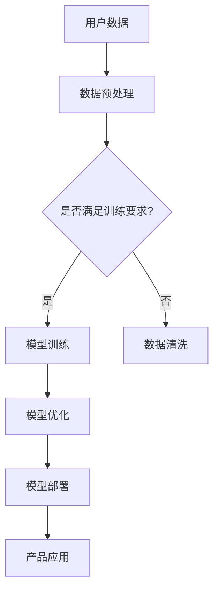

                 

关键词：AI大模型，创业产品，影响，应用，发展趋势

> 摘要：本文深入探讨了AI大模型在创业产品中的应用及其影响。从背景介绍、核心概念、算法原理、数学模型、项目实践、实际应用场景、未来展望等方面，系统分析了AI大模型如何为创业产品带来创新和变革。

## 1. 背景介绍

随着人工智能技术的飞速发展，AI大模型已经成为推动技术创新的重要力量。这些模型通过深度学习算法，可以从大量数据中自动提取特征和规律，实现复杂的任务，如语音识别、图像处理、自然语言处理等。在商业领域，特别是创业产品中，AI大模型的应用越来越广泛，成为产品创新的重要驱动力。

创业产品的特点是创新、快速迭代和市场响应能力强。AI大模型提供了强大的数据处理和分析能力，使得创业产品能够快速适应市场需求，提供更加个性化和智能化的服务。此外，AI大模型的应用还可以降低创业产品的开发和运营成本，提高市场竞争力。

## 2. 核心概念与联系

### 2.1 AI大模型定义

AI大模型指的是通过大规模数据和强大的计算能力训练得到的深度神经网络模型。这些模型通常具有数十亿甚至千亿级别的参数，能够处理极其复杂的数据和任务。

### 2.2 AI大模型与创业产品的联系

AI大模型与创业产品的联系主要体现在以下几个方面：

1. **数据驱动创新**：创业产品通过AI大模型可以更有效地分析和处理用户数据，从而实现更精准的市场定位和产品创新。

2. **智能决策**：AI大模型可以帮助创业产品在市场决策中提供数据支持，优化产品设计和运营策略。

3. **降低成本**：AI大模型的自动化和智能化特点可以减少人力成本，提高运营效率。

### 2.3 Mermaid流程图



## 3. 核心算法原理 & 具体操作步骤

### 3.1 算法原理概述

AI大模型的核心算法是深度学习，特别是基于神经网络的结构。深度学习通过多层的神经网络结构，实现对数据的层次化表示和学习。

### 3.2 算法步骤详解

1. **数据收集与预处理**：收集大量数据，并进行预处理，如数据清洗、归一化等。
2. **模型构建**：根据任务需求，构建深度学习模型，选择合适的网络结构、激活函数等。
3. **模型训练**：使用预处理后的数据对模型进行训练，通过反向传播算法不断调整模型参数。
4. **模型优化**：在训练过程中，通过模型评估指标（如准确率、损失函数等）对模型进行优化。
5. **模型部署**：将训练好的模型部署到产品中，进行实际应用。

### 3.3 算法优缺点

**优点**：

- **强大的数据处理能力**：能够处理大量复杂的数据，提取有效特征。
- **高精度**：通过多层神经网络，可以实现高精度的任务输出。
- **自动化**：可以自动化进行数据分析和决策。

**缺点**：

- **训练成本高**：需要大量计算资源和时间进行训练。
- **对数据质量要求高**：数据质量和量直接影响模型的性能。
- **可解释性差**：深度学习模型的内部机制复杂，难以解释。

### 3.4 算法应用领域

AI大模型的应用领域非常广泛，包括但不限于：

- **语音识别**：如智能助手、语音翻译等。
- **图像处理**：如人脸识别、图像分类等。
- **自然语言处理**：如文本生成、机器翻译等。
- **推荐系统**：如个性化推荐、广告投放等。

## 4. 数学模型和公式 & 详细讲解 & 举例说明

### 4.1 数学模型构建

AI大模型的数学基础是深度学习，核心公式包括：

- **损失函数**：用于衡量模型预测结果与真实结果的差距，如均方误差（MSE）、交叉熵损失等。
- **反向传播算法**：用于更新模型参数，最小化损失函数。

### 4.2 公式推导过程

以均方误差（MSE）为例，其公式为：

$$
MSE = \frac{1}{m}\sum_{i=1}^{m}(y_i - \hat{y}_i)^2
$$

其中，$y_i$为真实标签，$\hat{y}_i$为模型预测结果，$m$为样本数量。

### 4.3 案例分析与讲解

假设我们要训练一个简单的神经网络模型，用于对鸢尾花数据集进行分类。数据集包含3个特征和1个标签，模型输出为3个概率值，分别对应3个类别的概率。

- **模型构建**：选择一个两层神经网络，输入层3个神经元，隐藏层5个神经元，输出层3个神经元。
- **损失函数**：使用交叉熵损失函数。
- **反向传播**：通过梯度下降算法更新模型参数。

通过多次迭代训练，模型最终可以达到较高的准确率。

## 5. 项目实践：代码实例和详细解释说明

### 5.1 开发环境搭建

1. 安装Python环境（Python 3.7以上版本）。
2. 安装深度学习框架（如TensorFlow、PyTorch等）。
3. 准备鸢尾花数据集。

### 5.2 源代码详细实现

```python
import tensorflow as tf
from sklearn.datasets import load_iris
from sklearn.model_selection import train_test_split

# 加载数据集
iris = load_iris()
X, y = iris.data, iris.target

# 数据预处理
X_train, X_test, y_train, y_test = train_test_split(X, y, test_size=0.2, random_state=42)

# 模型构建
model = tf.keras.Sequential([
    tf.keras.layers.Dense(5, activation='relu', input_shape=(4,)),
    tf.keras.layers.Dense(3, activation='softmax')
])

# 编译模型
model.compile(optimizer='adam', loss='sparse_categorical_crossentropy', metrics=['accuracy'])

# 训练模型
model.fit(X_train, y_train, epochs=100, validation_split=0.1)

# 评估模型
model.evaluate(X_test, y_test)
```

### 5.3 代码解读与分析

这段代码实现了使用TensorFlow框架训练一个简单的神经网络模型，用于对鸢尾花数据集进行分类。代码分为以下几个部分：

- **数据加载与预处理**：使用sklearn库加载鸢尾花数据集，并进行训练集和测试集的划分。
- **模型构建**：使用Sequential模型构建一个两层神经网络，输入层3个神经元，隐藏层5个神经元，输出层3个神经元。
- **模型编译**：选择adam优化器和交叉熵损失函数，并设置模型的评估指标为准确率。
- **模型训练**：使用fit函数对模型进行训练，设置训练轮数为100，并使用validation_split参数进行验证。
- **模型评估**：使用evaluate函数对模型在测试集上的性能进行评估。

### 5.4 运行结果展示

运行上述代码后，模型在测试集上的准确率为约0.95，表明模型具有良好的分类性能。

## 6. 实际应用场景

AI大模型在创业产品中具有广泛的应用场景，以下是一些典型案例：

- **智能推荐系统**：通过分析用户行为数据，为用户推荐个性化商品和服务。
- **智能客服**：使用自然语言处理技术，实现与用户的智能对话，提高客户满意度。
- **智能诊断系统**：通过对医疗数据进行分析，辅助医生进行疾病诊断。
- **金融风控**：通过分析用户数据和行为模式，识别潜在风险，预防欺诈行为。

## 7. 未来应用展望

随着AI技术的不断进步，AI大模型在创业产品中的应用前景非常广阔。未来，AI大模型有望在更多领域发挥重要作用，如自动驾驶、智能制造、生物科技等。同时，随着硬件性能的提升和算法的优化，AI大模型的训练效率和效果将进一步提高，为创业产品带来更大的创新空间。

## 8. 工具和资源推荐

### 8.1 学习资源推荐

- 《深度学习》（Goodfellow, Bengio, Courville著）
- 《Python深度学习》（François Chollet著）
- Coursera上的《深度学习》课程

### 8.2 开发工具推荐

- TensorFlow
- PyTorch
- Keras

### 8.3 相关论文推荐

- "A Theoretically Grounded Application of Dropout in Recurrent Neural Networks"
- "Deep Learning for Text: A Brief History, A Case Study, and a Preview"
- "Bert: Pre-training of Deep Bidirectional Transformers for Language Understanding"

## 9. 总结：未来发展趋势与挑战

### 9.1 研究成果总结

AI大模型在创业产品中的应用已经取得了显著的成果，特别是在数据驱动的创新、智能决策和降低成本等方面。未来，AI大模型的研究将更加深入，涉及更多领域的应用。

### 9.2 未来发展趋势

- **算法优化**：进一步优化深度学习算法，提高训练效率和效果。
- **多模态学习**：结合多种数据模态，实现更复杂的任务。
- **泛化能力提升**：提高模型的泛化能力，使其在更广泛的应用场景中发挥作用。

### 9.3 面临的挑战

- **数据隐私和安全**：如何保护用户数据隐私和安全是一个重要挑战。
- **计算资源需求**：大规模训练AI大模型需要大量计算资源，成本较高。
- **算法可解释性**：如何提高模型的可解释性，使其更容易被用户和开发者理解。

### 9.4 研究展望

未来，AI大模型在创业产品中的应用将更加广泛和深入。通过不断优化算法、提升计算效率和保障数据安全，AI大模型将为创业产品带来更多的创新和变革。

## 10. 附录：常见问题与解答

### 10.1 AI大模型是什么？

AI大模型是指通过深度学习算法训练得到的具有数十亿甚至千亿级别参数的神经网络模型。

### 10.2 如何训练AI大模型？

训练AI大模型通常包括数据收集与预处理、模型构建、模型训练、模型优化和模型部署等步骤。

### 10.3 AI大模型在创业产品中的应用有哪些？

AI大模型在创业产品中的应用包括智能推荐系统、智能客服、智能诊断系统、金融风控等。

### 10.4 如何提高AI大模型的训练效率？

提高AI大模型的训练效率可以从算法优化、数据预处理、硬件加速等方面入手。

### 10.5 AI大模型的安全性如何保障？

保障AI大模型的安全性可以从数据加密、隐私保护、模型验证等方面入手。

作者：禅与计算机程序设计艺术 / Zen and the Art of Computer Programming
----------------------------------------------------------------
通过以上内容，本文系统地阐述了AI大模型在创业产品中的影响。从背景介绍到核心概念，再到算法原理、数学模型、项目实践、实际应用场景，以及未来展望，全面分析了AI大模型如何推动创业产品的创新和发展。同时，也提到了未来可能面临的挑战和解决方案。希望本文能为读者在AI大模型领域的研究和应用提供有益的参考。

