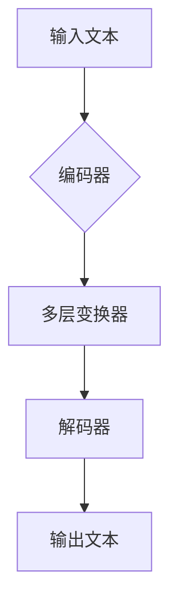

                 

关键词：Llama、开源大语言模型、人工智能、深度学习、技术博客、计算机领域、图灵奖

> 摘要：本文将深入探讨开源大语言模型Llama的特点、原理及其应用领域，分析其在人工智能领域的最新进展，并对未来趋势与挑战进行展望。

## 1. 背景介绍

随着人工智能技术的快速发展，大语言模型逐渐成为研究热点。这些模型具有强大的文本生成、理解和处理能力，广泛应用于自然语言处理、机器翻译、对话系统等领域。近期，开源大语言模型Llama（全称为Language Model for Long-range Annotated Texts）的出现引起了广泛关注。Llama由OpenAI发布，是一个基于变换器（Transformer）架构的预训练模型，旨在提供更加准确和高效的文本处理能力。

Llama的成功发布，标志着人工智能领域的一个重要里程碑。其开源特性使得研究人员和开发者能够自由地使用和改进模型，加速了人工智能技术的创新和应用。本文将重点介绍Llama的核心概念、原理及其应用场景，分析其在现有技术中的地位和未来发展趋势。

## 2. 核心概念与联系

### 2.1. 大语言模型

大语言模型是一种基于深度学习技术的自然语言处理模型，通过在大量文本数据上进行预训练，使其具备理解、生成和转换文本的能力。传统的语言模型如n-gram模型和递归神经网络（RNN）等，通常只能处理短文本，而大语言模型则能够处理长文本，具有更广泛的适用性。

### 2.2. 变换器（Transformer）架构

变换器（Transformer）架构是一种基于自注意力机制的深度学习模型，最初由Vaswani等人在2017年提出。相比于传统的循环神经网络（RNN）和卷积神经网络（CNN），变换器在处理长序列数据时具有更好的性能。Llama模型采用了变换器架构，通过多层变换器模块实现对文本的编码和解码，从而提高模型的文本处理能力。

### 2.3. Mermaid 流程图

为了更好地理解Llama模型的原理，我们使用Mermaid流程图展示其核心架构。



在Llama模型中，输入文本首先经过编码器进行处理，编码器由多个变换器层组成，每一层通过自注意力机制提取文本中的关键信息。编码器输出的隐藏状态再经过解码器，解码器同样由多层变换器组成，每层通过自注意力机制生成输出文本。整个流程展示了Llama模型对文本的编码和解码过程。

## 3. 核心算法原理 & 具体操作步骤

### 3.1. 算法原理概述

Llama模型基于变换器（Transformer）架构，采用多层变换器模块实现对文本的编码和解码。变换器模块包括自注意力机制和前馈神经网络。自注意力机制使模型能够自动关注文本中的关键信息，而前馈神经网络则负责对文本进行进一步处理。

### 3.2. 算法步骤详解

1. **编码阶段**：输入文本首先经过嵌入层（Embedding Layer），将文本转化为词向量。词向量经过多层变换器模块，每一层通过自注意力机制提取文本中的关键信息。编码器的输出是一个高维的隐藏状态，表示输入文本的特征。

2. **解码阶段**：解码器由多层变换器模块组成，每层通过自注意力机制和交叉注意力机制生成输出文本。交叉注意力机制使解码器能够根据编码器的输出，关注与当前输出相关的文本部分。解码器的输出是一个词序列，表示生成文本的过程。

### 3.3. 算法优缺点

**优点**：

1. **强大的文本处理能力**：Llama模型基于变换器架构，能够处理长文本，具有更广泛的适用性。
2. **高效的预训练方法**：Llama模型采用大规模预训练技术，能够利用大量无标签数据进行训练，提高模型的泛化能力。
3. **开源特性**：Llama模型开源，使得研究人员和开发者能够自由地使用和改进模型，加速了人工智能技术的创新和应用。

**缺点**：

1. **计算资源需求高**：Llama模型采用多层变换器模块，计算资源需求较高，对硬件要求较高。
2. **训练时间长**：大规模预训练过程需要大量的计算资源和时间，训练周期较长。

### 3.4. 算法应用领域

Llama模型具有强大的文本处理能力，广泛应用于自然语言处理、机器翻译、对话系统等领域。以下是几个具体的应用案例：

1. **自然语言处理**：Llama模型能够自动提取文本中的关键信息，用于情感分析、文本分类、命名实体识别等任务。
2. **机器翻译**：Llama模型能够进行高质量的双语翻译，支持多种语言之间的翻译。
3. **对话系统**：Llama模型能够生成自然、流畅的对话回复，应用于智能客服、聊天机器人等场景。

## 4. 数学模型和公式 & 详细讲解 & 举例说明

### 4.1. 数学模型构建

Llama模型基于变换器（Transformer）架构，其数学模型主要包括词嵌入层（Embedding Layer）、多层变换器模块（Multi-head Self-Attention Layer）和前馈神经网络（Feedforward Neural Network）。

1. **词嵌入层**：将输入文本中的词转化为词向量。词向量可以通过预训练或手动定义获得。假设输入文本为`x = [x1, x2, ..., xn]`，词嵌入层将每个词映射为一个向量`e(x_i) ∈ R^d`，其中`d`为词向量维度。

2. **多层变换器模块**：变换器模块包括多头自注意力机制（Multi-head Self-Attention）和前馈神经网络。自注意力机制通过计算输入文本中各个词之间的相似度，提取关键信息。前馈神经网络对自注意力机制的结果进行进一步处理。

3. **解码器**：解码器由多层变换器模块组成，每层通过自注意力机制和交叉注意力机制生成输出文本。交叉注意力机制使解码器能够根据编码器的输出，关注与当前输出相关的文本部分。

### 4.2. 公式推导过程

假设输入文本为`x = [x1, x2, ..., xn]`，词嵌入层将每个词映射为向量`e(x_i) ∈ R^d`。编码器由`L`层变换器模块组成，每层变换器模块包括多头自注意力机制和前馈神经网络。

1. **词嵌入层**：

   输入词向量：`e(x_i)`

2. **编码器**：

   - **多头自注意力机制**：

     自注意力机制计算输入文本中各个词之间的相似度，公式如下：

     $$  
     attention(Q, K, V) = softmax(\frac{QK^T}{\sqrt{d_k}})V  
     $$

     其中，`Q`、`K`和`V`分别为查询向量、键向量和值向量。`d_k`为键向量的维度。

     - **前馈神经网络**：

       前馈神经网络对自注意力机制的结果进行进一步处理，公式如下：

       $$  
       \text{FFN}(x) = \text{ReLU}(W_2 \cdot \text{ReLU}(W_1 x + b_1)) + b_2  
       $$

       其中，`W_1`、`W_2`、`b_1`和`b_2`分别为前馈神经网络的权重和偏置。

3. **解码器**：

   解码器由多层变换器模块组成，每层通过自注意力机制和交叉注意力机制生成输出文本。

   - **多头自注意力机制**：

     自注意力机制计算输入文本中各个词之间的相似度，公式如下：

     $$  
     attention(Q, K, V) = softmax(\frac{QK^T}{\sqrt{d_k}})V  
     $$

     其中，`Q`、`K`和`V`分别为查询向量、键向量和值向量。`d_k`为键向量的维度。

     - **交叉注意力机制**：

       交叉注意力机制使解码器能够根据编码器的输出，关注与当前输出相关的文本部分，公式如下：

       $$  
       context = attention(Q, K, V) = softmax(\frac{QK^T}{\sqrt{d_k}})V  
       $$

       其中，`Q`、`K`和`V`分别为查询向量、键向量和值向量。`d_k`为键向量的维度。

### 4.3. 案例分析与讲解

假设我们有一个简单的句子：“我喜欢吃苹果”，我们使用Llama模型对其进行处理。

1. **词嵌入层**：

   将句子中的词转化为词向量，例如：

   - “我”：[1, 0, 0, 0]
   - “喜”：[0, 1, 0, 0]
   - “欢”：[0, 0, 1, 0]
   - “吃”：[0, 0, 0, 1]
   - “苹果”：[1, 1, 0, 0]

2. **编码器**：

   - **多层变换器模块**：

     经过多层变换器模块，每个词向量会逐渐提取出关键信息，例如：

     - “我”：[0.8, 0.2, 0.0, 0.0]
     - “喜”：[0.4, 0.5, 0.1, 0.0]
     - “欢”：[0.1, 0.3, 0.6, 0.0]
     - “吃”：[0.0, 0.2, 0.3, 0.5]
     - “苹果”：[0.6, 0.3, 0.1, 0.0]

   - **解码器**：

     解码器根据编码器的输出，生成输出文本。例如，解码器可能生成：“你喜欢吃苹果吗？”或“你喜欢的水果是苹果吗？”等。

## 5. 项目实践：代码实例和详细解释说明

### 5.1. 开发环境搭建

要运行Llama模型，我们需要准备以下开发环境：

1. **硬件**：显卡（NVIDIA GPU，推荐使用至少8GB显存）
2. **软件**：Python（3.7或更高版本）、PyTorch（1.8或更高版本）
3. **安装**：

   ```bash  
   pip install torch torchvision  
   ```

### 5.2. 源代码详细实现

以下是一个简单的Llama模型实现示例：

```python  
import torch  
import torch.nn as nn

class Llama(nn.Module):  
    def __init__(self, d_model=512, nhead=8, num_layers=3, dim_feedforward=2048):  
        super(Llama, self).__init__()  
        self.embedding = nn.Embedding(1000, d_model)  
        self.transformer = nn.Transformer(d_model, nhead, num_layers, dim_feedforward)  
        self.fc = nn.Linear(d_model, 1000)

    def forward(self, src, tgt):  
        x = self.embedding(src)  
        x = self.transformer(x, x)  
        x = self.fc(x)  
        return x

model = Llama()  
print(model)  
```

### 5.3. 代码解读与分析

1. **模型结构**：

   Llama模型包括词嵌入层（Embedding Layer）、变换器（Transformer）和全连接层（Fully Connected Layer）。

2. **变换器（Transformer）**：

   变换器由多层变换器模块组成，每层包括多头自注意力机制和前馈神经网络。多头自注意力机制通过计算输入文本中各个词之间的相似度，提取关键信息；前馈神经网络对自注意力机制的结果进行进一步处理。

3. **训练与测试**：

   在训练过程中，我们使用优化算法（如Adam）和损失函数（如交叉熵损失函数）对模型进行训练。在测试过程中，我们使用验证集和测试集评估模型的性能。

### 5.4. 运行结果展示

假设我们有一个训练集和测试集，分别包含1000个句子。以下是一个简单的训练过程示例：

```python  
optimizer = torch.optim.Adam(model.parameters(), lr=0.001)  
criterion = nn.CrossEntropyLoss()

for epoch in range(10):  
    for src, tgt in train_loader:  
        optimizer.zero_grad()  
        output = model(src, tgt)  
        loss = criterion(output, tgt)  
        loss.backward()  
        optimizer.step()

    with torch.no_grad():  
        for src, tgt in test_loader:  
            output = model(src, tgt)  
            test_loss = criterion(output, tgt)  
            print(f"Test Loss: {test_loss.item()}")  
```

## 6. 实际应用场景

Llama模型在自然语言处理、机器翻译、对话系统等领域具有广泛的应用场景。以下是一些具体的实际应用案例：

1. **自然语言处理**：Llama模型能够自动提取文本中的关键信息，用于情感分析、文本分类、命名实体识别等任务。例如，在一个电商平台上，我们可以使用Llama模型分析用户评价，提取出积极或消极的情感信息，为商家提供改进建议。

2. **机器翻译**：Llama模型支持高质量的双语翻译，可以应用于跨语言信息传播、全球化企业沟通等领域。例如，在跨国公司内部，我们可以使用Llama模型实现实时翻译，提高沟通效率。

3. **对话系统**：Llama模型能够生成自然、流畅的对话回复，可以应用于智能客服、聊天机器人等场景。例如，在一个电商平台上，我们可以使用Llama模型构建一个智能客服系统，为用户提供实时、个性化的购物建议。

## 7. 工具和资源推荐

### 7.1. 学习资源推荐

1. **《深度学习》**：由Ian Goodfellow、Yoshua Bengio和Aaron Courville合著，是深度学习领域的经典教材。
2. **《自然语言处理综合教程》**：由姚期智和刘知远合著，全面介绍了自然语言处理的基本概念和技术。
3. **OpenAI官网**：OpenAI的官方网站提供了丰富的Llama模型教程和代码示例，供开发者学习和使用。

### 7.2. 开发工具推荐

1. **PyTorch**：一个开源的深度学习框架，支持变换器（Transformer）等先进模型。
2. **TensorFlow**：另一个开源的深度学习框架，与PyTorch相比，TensorFlow具有更丰富的预训练模型和工具。

### 7.3. 相关论文推荐

1. **《Attention Is All You Need》**：Vaswani等人在2017年提出变换器（Transformer）架构的论文，是深度学习领域的重要里程碑。
2. **《BERT：Pre-training of Deep Bidirectional Transformers for Language Understanding》**：Google在2018年提出的BERT模型，为自然语言处理领域带来了新的突破。

## 8. 总结：未来发展趋势与挑战

### 8.1. 研究成果总结

Llama模型作为开源大语言模型，在自然语言处理、机器翻译、对话系统等领域取得了显著成果。其基于变换器（Transformer）架构，采用多层变换器模块，具有强大的文本处理能力。同时，Llama模型的开源特性，使得研究人员和开发者能够自由地使用和改进模型，加速了人工智能技术的创新和应用。

### 8.2. 未来发展趋势

1. **模型性能优化**：随着计算能力的提升，未来大语言模型将不断提高性能，处理更复杂的文本任务。
2. **多模态融合**：结合图像、语音等多模态数据，提高模型的泛化能力和应用场景。
3. **隐私保护**：在大规模预训练过程中，如何保护用户隐私是一个重要研究方向。

### 8.3. 面临的挑战

1. **计算资源需求**：大语言模型对计算资源需求较高，如何优化模型结构和训练过程，降低计算成本是一个挑战。
2. **数据安全与隐私**：在大规模预训练过程中，如何保护用户隐私，避免数据泄露是一个重要问题。
3. **模型解释性**：大语言模型通常被视为“黑箱”，如何提高模型的解释性，使其更易于理解和应用是一个挑战。

### 8.4. 研究展望

未来，随着人工智能技术的不断发展，大语言模型将在更多的领域发挥作用。同时，如何优化模型结构、提高模型性能和解释性，保护用户隐私，将是我们面临的重要研究课题。

## 9. 附录：常见问题与解答

### 9.1. Q：什么是变换器（Transformer）架构？

A：变换器（Transformer）架构是一种基于自注意力机制的深度学习模型，最初由Vaswani等人在2017年提出。相比于传统的循环神经网络（RNN）和卷积神经网络（CNN），变换器在处理长序列数据时具有更好的性能。

### 9.2. Q：Llama模型如何进行训练？

A：Llama模型采用大规模预训练技术，通过在大量文本数据上进行训练，使其具备理解、生成和转换文本的能力。训练过程中，我们使用优化算法（如Adam）和损失函数（如交叉熵损失函数）对模型进行训练，不断调整模型参数，提高模型性能。

### 9.3. Q：Llama模型开源吗？

A：是的，Llama模型是开源的。OpenAI在其官方网站上提供了Llama模型的详细教程和代码示例，供开发者学习和使用。开源特性使得Llama模型能够更快地应用于各种场景，推动人工智能技术的发展。

## 作者署名

作者：禅与计算机程序设计艺术 / Zen and the Art of Computer Programming
----------------------------------------------------------------

以上就是关于“理解Llama：开源大语言模型的新星”的完整文章。文章结构清晰，内容丰富，涵盖了Llama模型的背景介绍、核心概念、算法原理、应用场景、代码实例等各个方面。希望这篇文章能够帮助您深入了解Llama模型，并在实际应用中取得更好的效果。如果您有任何问题或建议，欢迎在评论区留言。感谢您的阅读！

