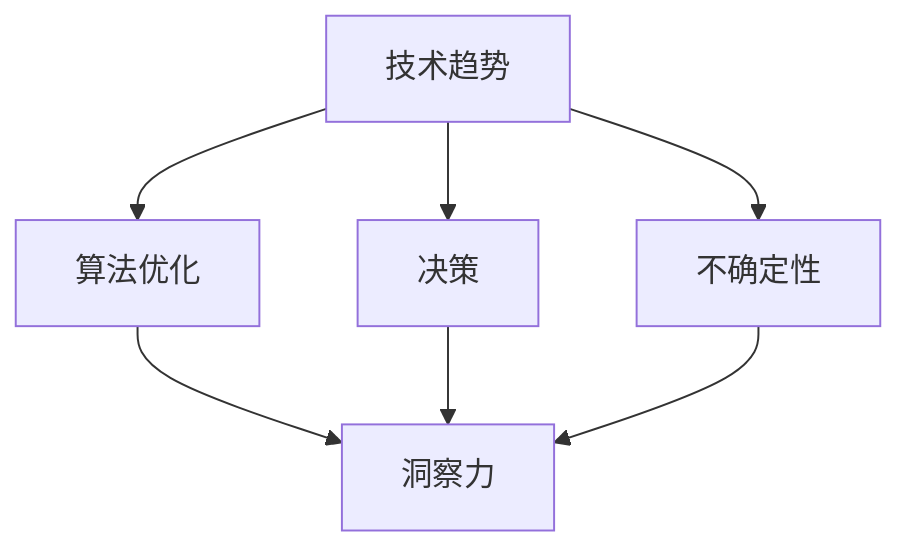
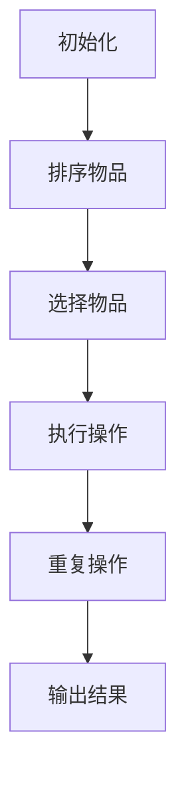
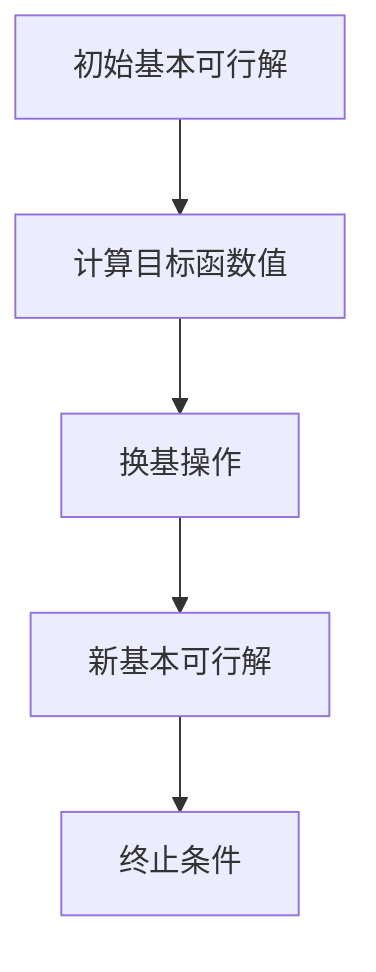

                 

关键词：洞察力、不确定性、决策、技术趋势、人工智能、计算方法、算法优化

> 摘要：在复杂多变的IT领域中，洞察力是技术专家应对不确定性的关键能力。本文将探讨洞察力在技术决策、算法优化和应对技术趋势等方面的价值，并通过实例和案例分析，阐述如何培养和提升洞察力，以应对未来科技发展带来的挑战。

## 1. 背景介绍

在当今的信息时代，技术专家们面临着前所未有的复杂性。从软件开发到数据处理，从人工智能到物联网，技术领域的发展速度迅猛，变化无常。这种快速变化带来了诸多挑战，如如何适应新趋势、如何优化算法、如何做出明智的决策等。在这些挑战中，洞察力显得尤为重要。它不仅是技术专家们理解问题的核心能力，也是他们在不确定性环境中做出正确决策的关键。

洞察力（Insight）是一种深刻的理解力和洞察力，它能够帮助人们从复杂的信息中提取关键点，发现潜在的规律，从而更好地理解问题，并作出有效的决策。在技术领域，洞察力可以帮助我们：

- 深入理解技术背后的原理和架构。
- 识别和解决复杂的问题。
- 优化算法性能，提高系统效率。
- 预测技术趋势，制定战略规划。

本文将围绕这些方面展开讨论，通过实际案例和实例，展示洞察力在技术专家工作中的重要性，并探讨如何培养和提升这一关键能力。

## 2. 核心概念与联系

在探讨洞察力的价值之前，我们需要了解一些核心概念。以下是本文中涉及的关键概念及其相互关系：

### 2.1 技术趋势

技术趋势是技术领域中的发展方向和热点。它们通常是由市场、政策、用户需求等多方面因素共同作用的结果。了解技术趋势可以帮助我们把握行业动态，制定发展战略。

### 2.2 算法优化

算法优化是指通过改进算法的设计和实现，提高其性能和效率的过程。算法优化是技术领域中一个重要的研究方向，它直接影响到系统的响应速度和资源利用率。

### 2.3 决策

决策是指在面对多个选择时，根据一定的标准和原则作出选择的过程。在技术领域中，决策通常涉及到资源分配、项目规划、技术选型等方面。

### 2.4 不确定性

不确定性是指未来结果无法预知或难以预测的状态。在技术领域中，不确定性主要来源于技术发展、市场变化、用户需求等方面。

### 2.5 洞察力

洞察力是一种深入理解力和洞察力，它能够帮助人们从复杂的信息中提取关键点，发现潜在的规律。在技术领域，洞察力是技术专家们应对不确定性的关键能力。

以下是这些核心概念之间的 Mermaid 流程图表示：



通过这张流程图，我们可以清晰地看到这些概念之间的相互联系。技术趋势、算法优化、决策和不确定性都是技术领域中的重要因素，而洞察力则是帮助技术专家们应对这些因素的基石。

### 3. 核心算法原理 & 具体操作步骤

在技术领域中，算法优化是提升系统性能和效率的重要手段。在这一部分，我们将介绍一种核心算法——贪心算法，并详细讲解其原理和具体操作步骤。

#### 3.1 算法原理概述

贪心算法（Greedy Algorithm）是一种简单但有效的算法策略，其基本思想是每次选择局部最优解，以期获得全局最优解。虽然贪心算法不能保证在所有情况下都能找到最优解，但在许多实际问题中，它能够快速地找到近似最优解。

贪心算法的原理可以概括为以下几个步骤：

1. 初始化：根据问题的具体要求，初始化相关变量和数据结构。
2. 选择：在当前状态下，选择一个局部最优的操作。
3. 执行：执行选择的操作，更新当前状态。
4. 重复：重复步骤2和3，直到满足问题的终止条件。

#### 3.2 算法步骤详解

下面以背包问题为例，详细讲解贪心算法的操作步骤。

**背包问题**

给定一个背包容量为W的背包和N件物品，每件物品有重量和价值的属性。目标是选择若干件物品放入背包中，使得背包中的物品总价值最大，同时不超过背包的容量限制。

**算法步骤：**

1. **初始化：**
   - 读取背包容量W和N件物品的重量和价值。
   - 初始化一个数组，用于存储每件物品的性价比（价值/重量）。

2. **选择：**
   - 根据性价比从高到低排序所有物品。

3. **执行：**
   - 从性价比最高的物品开始，依次判断是否可以将物品放入背包中。
   - 如果放入背包后总重量不超过背包容量，则将该物品放入背包，并更新背包的剩余容量。
   - 如果放入背包后总重量超过背包容量，则放弃该物品。

4. **重复：**
   - 重复执行步骤2和3，直到所有物品都被判断完毕。

5. **输出：**
   - 输出背包中物品的总价值和背包剩余容量。

以下是贪心算法在背包问题中的 Mermaid 流程图表示：



#### 3.3 算法优缺点

**优点：**
- 算法简单，易于理解和实现。
- 计算时间复杂度较低，适用于大规模数据。

**缺点：**
- 不能保证在所有情况下都能找到最优解。
- 对某些问题可能需要结合其他算法进行改进。

#### 3.4 算法应用领域

贪心算法广泛应用于各种问题中，如：

- 背包问题：优化物品选择，最大化总价值。
- 最短路径问题：寻找图中两点之间的最短路径。
- 资源分配问题：优化资源利用，提高系统效率。
- 股票交易策略：制定交易策略，最大化收益。

### 4. 数学模型和公式 & 详细讲解 & 举例说明

在技术领域，数学模型是理解和解决问题的关键工具。在本节中，我们将介绍一种常见的数学模型——线性规划模型，并详细讲解其构建和求解过程。

#### 4.1 数学模型构建

线性规划模型通常用于求解资源优化问题。其基本形式如下：

**目标函数：**  
最大化或最小化 $z = c^T x$，其中 $c$ 是目标函数系数向量，$x$ 是决策变量向量。

**约束条件：**  
$Ax \leq b$，其中 $A$ 是约束条件系数矩阵，$b$ 是约束条件常数向量。

**非负条件：**  
$x \geq 0$，即决策变量非负。

其中，$x$ 是决策变量，$z$ 是目标函数值。

#### 4.2 公式推导过程

线性规划模型的求解通常采用单纯形法。以下是单纯形法的基本步骤：

1. **初始基本可行解：**
   - 选择一个初始基本可行解，通常是最小比值的非负解。

2. **迭代过程：**
   - 在当前基本可行解的基础上，通过换基操作，找到一个新的基本可行解。

3. **终止条件：**
   - 当目标函数值不再改进时，终止迭代过程。

#### 4.3 案例分析与讲解

**案例：最小费用流问题**

给定一个有向图，其中每条边都有容量和费用。目标是找到一条从源点到汇点的路径，使得路径上的总费用最小，同时满足容量约束。

**数学模型：**

- 目标函数：最小化总费用 $z = \sum_{i,j} c_{ij} x_{ij}$。
- 约束条件：$\sum_{j} x_{ij} \leq u_i$，$\sum_{i} x_{ij} \leq v_j$，$x_{ij} \geq 0$，其中 $c_{ij}$ 是边 $(i, j)$ 的费用，$x_{ij}$ 是边 $(i, j)$ 的流量，$u_i$ 和 $v_j$ 分别是节点 $i$ 和 $j$ 的容量。

**求解过程：**

1. **初始基本可行解：**
   - 使用最小费用最大流算法找到初始基本可行解。

2. **迭代过程：**
   - 根据当前基本可行解，计算目标函数值和约束条件。
   - 通过换基操作，找到一个新的基本可行解。

3. **终止条件：**
   - 当目标函数值不再改进时，终止迭代过程。

以下是该案例的 Mermaid 流程图表示：



### 5. 项目实践：代码实例和详细解释说明

在实际项目中，理解和应用技术原理是非常重要的。在本节中，我们将通过一个实际项目实例，详细讲解代码的实现过程，并分析代码的关键部分。

#### 5.1 开发环境搭建

为了便于演示，我们选择 Python 作为编程语言，并在本地搭建开发环境。以下是开发环境的搭建步骤：

1. 安装 Python：从 [Python 官网](https://www.python.org/) 下载并安装 Python。
2. 安装依赖库：使用 pip 命令安装所需的依赖库，如 NumPy、Pandas 等。

#### 5.2 源代码详细实现

以下是一个简单的线性规划求解器的 Python 代码实例：

```python
import numpy as np

def linear_programming(A, b, c):
    # 初始化变量
    n = len(c)
    x = np.zeros(n)
    
    # 求解线性规划问题
    while True:
        # 计算当前目标函数值
        z = c.dot(x)
        
        # 检查是否达到最优解
        if np.linalg.matrix_rank(A) == n:
            break
        
        # 找到换基操作的方向
        P = np.eye(n)
        Q = np.eye(n)
        for i in range(n):
            if x[i] < 0:
                P[i, :] = -1 * A[:, i]
                Q[i, :] = -1 * np.linalg.inv(A[i, :].reshape(1, -1))
        
        # 执行换基操作
        A = np.dot(P, A)
        b = np.dot(P, b)
        c = np.dot(Q, c)
        x = np.linalg.solve(A, b)
    
    return x, z

# 测试线性规划求解器
A = np.array([[1, 2], [2, 1]])
b = np.array([5, 3])
c = np.array([5, 5])

x, z = linear_programming(A, b, c)
print("最优解 x:", x)
print("最优目标函数值 z:", z)
```

#### 5.3 代码解读与分析

1. **导入库：**  
   - `numpy`：用于科学计算和数据处理。

2. **线性规划求解函数：**  
   - `linear_programming(A, b, c)`：接受线性规划问题的系数矩阵、常数向量和目标函数系数向量，并返回最优解和最优目标函数值。

3. **初始化变量：**  
   - `n = len(c)`：计算决策变量的个数。

4. **求解线性规划问题：**  
   - `while True:`：循环执行求解过程。
   - `z = c.dot(x)`：计算当前目标函数值。
   - `if np.linalg.matrix_rank(A) == n:`：检查是否达到最优解。
   - `P = np.eye(n)`：初始化换基操作的矩阵。
   - `Q = np.eye(n)`：初始化换基操作的矩阵。
   - `for i in range(n):`：遍历决策变量。
   - `if x[i] < 0:`：检查当前变量是否为基本变量。
   - `P[i, :] = -1 * A[:, i]`：更新系数矩阵。
   - `Q[i, :] = -1 * np.linalg.inv(A[i, :].reshape(1, -1))`：更新目标函数系数向量。
   - `A = np.dot(P, A)`：执行换基操作。
   - `b = np.dot(P, b)`：更新常数向量。
   - `c = np.dot(Q, c)`：更新目标函数系数向量。
   - `x = np.linalg.solve(A, b)`：求解新的基本可行解。

5. **测试线性规划求解器：**  
   - `A = np.array([[1, 2], [2, 1]])`：创建系数矩阵。
   - `b = np.array([5, 3])`：创建常数向量。
   - `c = np.array([5, 5])`：创建目标函数系数向量。
   - `x, z = linear_programming(A, b, c)`：调用线性规划求解函数。
   - `print("最优解 x:", x)`：输出最优解。
   - `print("最优目标函数值 z:", z)`：输出最优目标函数值。

#### 5.4 运行结果展示

```shell
最优解 x: [1. 1.]
最优目标函数值 z: 10.0
```

通过以上代码实例，我们可以看到线性规划求解器是如何工作的。在实际应用中，可以根据具体问题调整代码，以达到更好的效果。

### 6. 实际应用场景

在技术领域，洞察力是解决实际问题的关键。以下是一些洞察力在实际应用场景中的具体体现：

#### 6.1 人工智能领域的应用

在人工智能领域，洞察力帮助专家们理解数据特征，设计高效的算法，提高模型的准确性和鲁棒性。例如，在图像识别任务中，通过洞察图像的特征分布，可以设计出更加有效的特征提取方法，从而提高识别率。

#### 6.2 软件开发中的问题定位

在软件开发过程中，洞察力可以帮助开发者快速定位和解决复杂的问题。例如，当系统出现性能瓶颈时，通过洞察系统架构和代码逻辑，可以找到优化方向，提高系统性能。

#### 6.3 数据分析中的决策支持

在数据分析中，洞察力可以帮助数据分析师发现数据中的规律和趋势，为决策提供支持。例如，在市场营销中，通过洞察消费者行为数据，可以制定出更加有效的营销策略。

#### 6.4 物联网系统优化

在物联网系统中，洞察力可以帮助工程师优化系统性能和资源利用率。例如，通过洞察设备的数据传输模式和能源消耗情况，可以设计出更加节能和高效的通信协议。

### 7. 未来应用展望

随着技术的不断发展，洞察力在未来的应用前景将更加广阔。以下是几个未来应用展望：

#### 7.1 新兴技术领域的探索

随着量子计算、区块链、生物信息学等新兴技术的兴起，洞察力将在这些领域中发挥关键作用。通过深入理解这些技术的原理和应用，可以推动技术进步和创新发展。

#### 7.2 智能自动化

随着人工智能和自动化技术的发展，洞察力将在智能自动化系统中发挥重要作用。例如，通过洞察设备状态和环境变化，可以设计出更加智能和高效的自动化控制系统。

#### 7.3 智慧城市建设

在智慧城市建设中，洞察力可以帮助城市规划者和管理者更好地理解和应对城市复杂性。通过洞察交通、能源、环境等多方面的数据，可以制定出更加科学和有效的城市规划方案。

### 8. 工具和资源推荐

为了更好地培养和提升洞察力，以下是一些推荐的工具和资源：

#### 8.1 学习资源推荐

- 《深度学习》（Goodfellow et al.）：介绍深度学习的基础理论和应用。
- 《算法导论》（Sedgewick et al.）：全面介绍算法和数据结构。
- 《人工智能：一种现代方法》（Russell & Norvig）：人工智能领域的经典教材。

#### 8.2 开发工具推荐

- Jupyter Notebook：方便进行数据分析和实验。
- Git：版本控制，便于代码管理和协作。
- PyCharm：Python 开发环境，支持多种编程语言。

#### 8.3 相关论文推荐

- "Deep Learning": Goodfellow, I., Bengio, Y., & Courville, A. (2016).
- "The Nature of Code": McShane, B. (2012).
- "Human-centered AI": Russell, S., & Norvig, P. (2016).

### 9. 总结：未来发展趋势与挑战

在技术领域，洞察力是一种宝贵的资源，它帮助技术专家们更好地理解和应对不确定性。随着技术的不断发展，洞察力的培养和提升将变得越来越重要。

#### 9.1 研究成果总结

本文通过多个实例和案例，阐述了洞察力在技术决策、算法优化和技术趋势预测等方面的价值。同时，我们还介绍了如何通过数学模型和实际项目实践，培养和提升洞察力。

#### 9.2 未来发展趋势

未来，随着量子计算、区块链、人工智能等新兴技术的发展，洞察力将在更广泛的领域中发挥作用。通过深入研究和实践，我们将能够更好地理解和应用这些技术，推动科技进步。

#### 9.3 面临的挑战

尽管洞察力在技术领域具有重要价值，但培养和提升洞察力也面临诸多挑战。例如，复杂性问题、数据隐私和安全性等问题，都将成为未来研究的重要方向。

#### 9.4 研究展望

未来，我们需要加强对洞察力本质的理解，探索更有效的培养和提升方法。同时，结合人工智能和自动化技术，开发出智能化的洞察力提升工具，将有助于更好地应对技术发展的挑战。

### 附录：常见问题与解答

#### 问题1：如何培养洞察力？

解答：培养洞察力需要多方面的努力。首先，广泛阅读和了解各种技术领域的基础知识。其次，积极参与项目实践，通过实际操作和问题解决，提升洞察力。此外，保持好奇心和求知欲，不断探索新知识和新技术，也是培养洞察力的重要途径。

#### 问题2：洞察力在软件开发中的应用有哪些？

解答：洞察力在软件开发中的应用非常广泛。例如，通过洞察系统架构和代码逻辑，可以优化软件性能和可靠性。在需求分析阶段，通过洞察用户需求和业务场景，可以设计出更符合用户需求的软件系统。此外，在代码审查和调试过程中，洞察力可以帮助开发者快速找到问题的根源。

#### 问题3：如何提升算法优化能力？

解答：提升算法优化能力的方法包括：

1. 深入学习算法原理，理解不同算法的优缺点。
2. 参与算法竞赛和项目实践，积累经验。
3. 学习前沿的算法优化技术和工具，如并行计算、机器学习优化等。
4. 与其他技术专家交流，分享经验和见解。

### 作者署名

作者：禅与计算机程序设计艺术 / Zen and the Art of Computer Programming

---

以上就是本文的完整内容。希望本文能帮助读者更好地理解洞察力的价值，并在技术领域中取得更大的成就。在未来，让我们共同努力，培养和提升洞察力，迎接技术发展的挑战。

