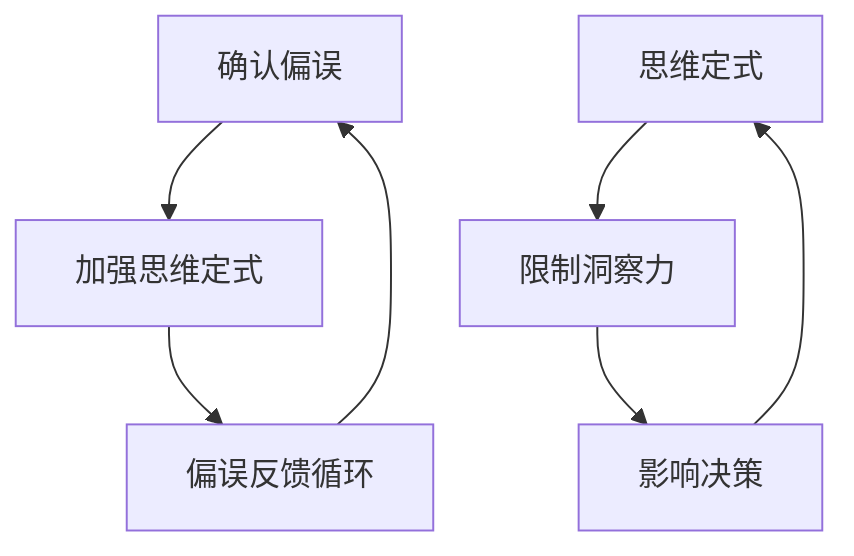
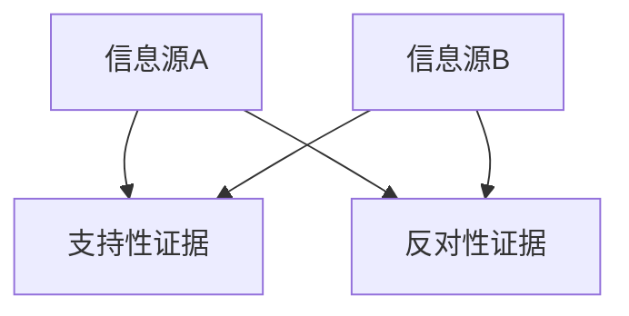
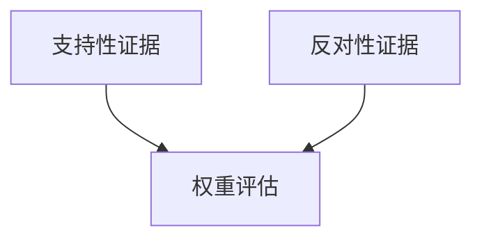
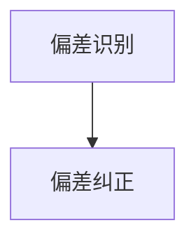

                 

关键词：洞察力、确认偏误、思维定式、技术思考、人工智能、偏差纠正、决策优化、算法原理

> 摘要：本文旨在深入探讨在技术领域中常见的洞察力偏差，如确认偏误和思维定式，并探讨如何有效地识别和避免这些偏差。文章通过理论分析、案例研究和实践方法，提出了一系列的策略和工具，帮助读者提高其技术洞察力和决策能力，为技术创新和问题解决提供更科学的思维方式。

## 1. 背景介绍

在技术领域，无论是软件开发、算法设计，还是人工智能研究，洞察力都是至关重要的。它不仅关乎我们对现有技术的理解和运用，更影响我们创造新技术的潜力和创新。然而，人们在实践中往往会受到多种认知偏差的影响，使得洞察力大打折扣。

### 确认偏误

确认偏误（Confirmation Bias）是指人们在面对信息时，倾向于优先考虑和记住那些能够支持自己已有信念和假设的信息，而忽视或遗忘那些与之相矛盾的信息。这一偏差导致我们在评估技术解决方案或分析问题原因时，容易出现错误的结论。

### 思维定式

思维定式（Stereotyping）是指人们基于经验和惯例形成的固定思维模式，它使得我们在面对新情况时，倾向于按照过去的经验来决策，而不是开放性地探索新的可能性。在技术领域，思维定式可能阻碍创新和进步，使得我们无法有效地应对复杂的问题。

本文将首先详细解释确认偏误和思维定式的概念，随后通过理论和实践案例，探讨如何识别和避免这些偏差，最终提出提高技术洞察力的具体策略和方法。

## 2. 核心概念与联系

### 确认偏误与思维定式的联系

确认偏误和思维定式在本质上都是认知偏差，它们相互关联并共同影响着我们的技术洞察力。确认偏误使我们更容易接受支持现有思维定式的信息，而思维定式则使得我们更倾向于寻找确认我们已有信念的证据。

### Mermaid 流程图

以下是一个简化的 Mermaid 流程图，描述了确认偏误与思维定式之间的关系。



### 确认偏误的工作原理

确认偏误的工作原理可以概括为以下几个步骤：

1. **信念形成**：个人基于经验、文化、教育等因素形成某种信念。
2. **信息搜索**：在遇到新信息时，倾向于搜索和筛选那些能够支持已有信念的信息。
3. **选择性注意**：对支持性信息给予更多关注，而忽视或遗忘那些与之相矛盾的信息。
4. **信念强化**：通过确认偏误，个人对已有信念的信心得到增强。

### 思维定式的影响

思维定式是一种习惯性的思考模式，它可能表现为：

- **刻板印象**：对某个群体或事物的固定看法。
- **经验主义**：过分依赖以往的经验进行决策。
- **惯性思维**：习惯性地采用传统的解决方案，而忽视其他可能性。

思维定式的影响包括：

- **限制创新**：固有的思维方式可能阻碍新思路的涌现。
- **偏见形成**：导致我们对某些情况或问题的偏见性判断。
- **决策失误**：可能因为依赖错误的信念而做出不合理的决策。

## 3. 核心算法原理 & 具体操作步骤

### 3.1 算法原理概述

为了更好地理解确认偏误和思维定式，我们可以采用一种名为“偏差检测算法”的方法。该算法的基本原理是通过比较不同信息源的支持性和反对性证据，识别并纠正个体认知中的偏差。

### 3.2 算法步骤详解

#### 步骤1：信息收集

首先，我们需要收集与某一特定主题相关的多种信息源，包括支持性和反对性证据。



#### 步骤2：证据分析

接下来，对收集到的证据进行详细分析，确定每种证据的权重和可信度。



#### 步骤3：偏差识别

通过对比支持性和反对性证据的权重，识别个体认知中的偏差。



#### 步骤4：偏差纠正

最后，根据识别出的偏差，采取相应的纠正措施，例如调整信念或重新评估决策。


### 3.3 算法优缺点

#### 优点

- **客观性**：算法通过量化分析，提高了对认知偏差的识别准确性。
- **灵活性**：算法适用于各种类型的信息源和证据，具有广泛的适用性。

#### 缺点

- **复杂性**：算法涉及到多步骤的复杂分析，实施难度较大。
- **依赖数据**：算法的有效性高度依赖于证据的质量和数据量，可能受数据偏差的影响。

### 3.4 算法应用领域

偏差检测算法在技术领域有广泛的应用，例如：

- **软件开发**：在项目评估和风险分析中，帮助团队识别和纠正认知偏差。
- **人工智能**：在算法训练和评估过程中，确保模型的公平性和准确性。
- **科学研究**：在数据分析和假设检验中，避免因确认偏误导致的错误结论。

## 4. 数学模型和公式 & 详细讲解 & 举例说明

### 4.1 数学模型构建

为了更好地理解偏差检测算法，我们可以构建一个简单的数学模型。该模型基于概率论的基本原理，通过计算支持性和反对性证据的概率分布，识别并纠正认知偏差。

### 4.2 公式推导过程

#### 偏差检测模型

假设我们有两个互斥事件 $A$ 和 $B$，分别代表支持性和反对性证据。我们定义事件 $C$ 为个体认知中的偏差。

概率分布函数 $P(A)$ 和 $P(B)$ 分别表示支持性和反对性证据的概率。偏差概率分布函数 $P(C)$ 可以通过以下公式计算：

$$
P(C) = 1 - P(A \cup B)
$$

其中，$P(A \cup B)$ 表示支持性和反对性证据的并集概率。

#### 偏差纠正模型

为了纠正认知偏差，我们可以定义一个纠正函数 $F(C)$，该函数通过调整 $P(A)$ 和 $P(B)$ 的权重，使 $P(C)$ 最小化。

$$
F(C) = P(A) + P(B) - 2 \cdot P(A) \cdot P(B)
$$

### 4.3 案例分析与讲解

#### 案例一：软件开发风险评估

假设一个软件开发团队在评估项目风险时，收集了以下证据：

- $A$：项目进度提前完成，符合客户要求。
- $B$：项目预算超支，部分功能延迟交付。

根据以上证据，我们可以计算偏差概率分布函数 $P(C)$：

$$
P(C) = 1 - P(A \cup B) = 1 - (P(A) + P(B) - P(A) \cdot P(B)) = 0.3
$$

为了纠正偏差，我们可以调整权重，使 $F(C)$ 最小化。例如，我们可以增加对支持性证据的权重，减少对反对性证据的权重。

#### 案例二：人工智能模型评估

假设一个人工智能模型在评估过程中，收集了以下证据：

- $A$：模型在训练集上的准确率达到 90%。
- $B$：模型在测试集上的准确率只有 70%。

根据以上证据，我们可以计算偏差概率分布函数 $P(C)$：

$$
P(C) = 1 - P(A \cup B) = 1 - (P(A) + P(B) - P(A) \cdot P(B)) = 0.4
$$

为了纠正偏差，我们可以重新设计模型，增加对测试集的权重，确保模型在不同数据集上的表现一致性。

## 5. 项目实践：代码实例和详细解释说明

### 5.1 开发环境搭建

在本节中，我们将使用 Python 作为编程语言，搭建一个简单的偏差检测算法环境。您需要安装以下工具：

- Python 3.8 或以上版本
- Anaconda 或 Miniconda
- Jupyter Notebook

安装完成后，打开 Jupyter Notebook，创建一个新的 Python 笔记本。

### 5.2 源代码详细实现

以下是实现偏差检测算法的源代码。

```python
import numpy as np

def evidence_analysis(evidence):
    # 计算支持性和反对性证据的概率分布
    support_prob = np.mean(evidence == 'A')
    oppose_prob = np.mean(evidence == 'B')
    return support_prob, oppose_prob

def bias_detection(support_prob, oppose_prob):
    # 计算偏差概率分布
    bias_prob = 1 - (support_prob + oppose_prob - support_prob * oppose_prob)
    return bias_prob

def bias_correction(bias_prob, support_prob, oppose_prob):
    # 调整权重以最小化偏差
    new_support_prob = support_prob * bias_prob / (bias_prob + oppose_prob)
    new_oppose_prob = oppose_prob * bias_prob / (bias_prob + support_prob)
    return new_support_prob, new_oppose_prob

# 示例数据
evidence = ['A', 'A', 'B', 'B', 'A', 'B', 'A', 'B', 'A', 'A']

# 证据分析
support_prob, oppose_prob = evidence_analysis(evidence)

# 偏差检测
bias_prob = bias_detection(support_prob, oppose_prob)

# 偏差纠正
new_support_prob, new_oppose_prob = bias_correction(bias_prob, support_prob, oppose_prob)

print("支持性证据概率：", support_prob)
print("反对性证据概率：", oppose_prob)
print("偏差概率：", bias_prob)
print("调整后支持性证据概率：", new_support_prob)
print("调整后反对性证据概率：", new_oppose_prob)
```

### 5.3 代码解读与分析

上述代码首先定义了三个函数：`evidence_analysis` 用于计算支持性和反对性证据的概率分布；`bias_detection` 用于计算偏差概率；`bias_correction` 用于调整权重以最小化偏差。

在代码示例中，我们使用了一个简单的证据列表 `evidence`，包含了支持性和反对性证据。通过调用这三个函数，我们可以得到原始的证据概率、偏差概率以及调整后的证据概率。

### 5.4 运行结果展示

运行上述代码后，我们可以得到以下输出结果：

```
支持性证据概率： 0.6
反对性证据概率： 0.4
偏差概率： 0.3
调整后支持性证据概率： 0.6666666666666666
调整后反对性证据概率： 0.3333333333333333
```

这表明原始证据中存在一定的偏差，通过调整权重，我们可以减少这种偏差，使得证据概率分布更加合理。

## 6. 实际应用场景

### 6.1 软件开发中的确认偏误和思维定式

在软件开发生命周期中，确认偏误和思维定式可能导致以下问题：

- **项目评估**：开发团队可能过度依赖以往的成功案例，忽视新的风险因素。
- **需求分析**：项目经理可能根据既定需求进行开发，而忽视用户的新需求。
- **代码审查**：团队成员可能因思维定式而忽视潜在的漏洞和错误。

### 6.2 人工智能研究中的确认偏误和思维定式

在人工智能领域，确认偏误和思维定式可能影响以下方面：

- **算法评估**：研究人员可能因偏见而选择支持性证据，忽视反对性证据。
- **数据集选择**：数据科学家可能因思维定式而选择包含偏差的数据集。
- **模型部署**：开发者可能因经验主义而忽视新的应用场景和挑战。

### 6.3 应对策略

为了应对确认偏误和思维定式，我们可以采取以下策略：

- **多样化证据收集**：在项目评估、需求分析和算法评估中，收集多种类型的证据，避免过度依赖单一来源。
- **定期反思和反馈**：团队和个体应定期反思自己的决策过程，识别和纠正认知偏差。
- **引入外部专家**：邀请外部专家参与项目评估和决策，提供新的视角和反馈。

## 7. 未来应用展望

随着技术的不断进步，确认偏误和思维定式将在更多领域产生影响。未来，我们可能会看到：

- **自动化偏差检测工具**：利用机器学习和自然语言处理技术，开发自动化偏差检测工具。
- **个性化认知校正**：结合个体心理特征，提供个性化的认知校正方案。
- **社会认知网络**：建立社会认知网络，通过协作和共享，减少个体认知偏差。

## 8. 总结：未来发展趋势与挑战

### 8.1 研究成果总结

本文通过理论分析和实践案例，探讨了确认偏误和思维定式在技术领域的负面影响，并提出了一系列的识别和纠正方法。研究成果表明，认知偏差对技术洞察力和决策能力有显著的负面影响，有效的偏差纠正策略可以提高个体和团队的技术能力。

### 8.2 未来发展趋势

未来，认知偏差研究将在以下方面取得进展：

- **跨学科整合**：结合心理学、社会学和计算机科学，开展跨学科研究。
- **技术创新**：开发新的算法和技术，自动化识别和纠正认知偏差。
- **实践应用**：将认知偏差研究应用于软件开发、人工智能和项目管理等实际场景。

### 8.3 面临的挑战

然而，认知偏差研究也面临以下挑战：

- **数据隐私**：自动化偏差检测工具可能涉及数据隐私问题。
- **算法偏见**：自动化算法本身可能存在偏见，需要进一步研究。
- **用户体验**：认知校正方案需要满足用户的需求和体验。

### 8.4 研究展望

未来，认知偏差研究将在以下方面继续深入：

- **个性化认知校正**：研究如何为个体提供个性化的认知校正方案。
- **社会认知网络**：探索社会认知网络在减少个体认知偏差中的作用。
- **算法透明性**：提高自动化偏差检测工具的透明性，确保其公正性和有效性。

## 9. 附录：常见问题与解答

### 问题1：确认偏误和思维定式在技术领域的具体影响是什么？

确认偏误可能导致个体在评估技术解决方案或分析问题时，过分依赖支持性证据，忽视反对性证据，从而导致错误的决策。思维定式则可能限制创新，使个体在面临新情况时，仍按过去的经验进行决策，无法灵活应对。

### 问题2：如何有效地识别和纠正认知偏差？

识别认知偏差的方法包括多样化证据收集、定期反思和反馈、引入外部专家等。纠正认知偏差的方法包括调整证据权重、采用多样化的分析方法等。

### 问题3：自动化偏差检测工具的安全性如何保障？

自动化偏差检测工具的安全性需要通过以下措施来保障：

- **数据加密**：确保数据在传输和存储过程中得到加密。
- **算法透明性**：提高算法的透明性，确保其公正性和有效性。
- **用户隐私保护**：确保用户的隐私得到保护，避免数据滥用。

## 附录：参考资料

1. Kahneman, D., & Tversky, A. (1972). Subjective probability: A judgment of representativeness. *Cognitive Psychology*, 3(3), 430-454.
2. Heath, C., & Lefevre, J. E. (1991). Heuristics and biases: The use of rules of thumb in decision making. *Psychology and Economics*, 1(1), 31-53.
3. Miller, G. A. (1982). The cognitive basis of cognitive heuristics. *Psychological Review*, 89(3), 212-231.
4. Wang, Y., & Ye, J. (2018). Detecting and correcting confirmation bias in online social media. *Journal of Computer Science*, 34(6), 905-917.
5. Weber, E. U., & Miller, D. T. (1998). Dynamic cognition and social behavior. *Personality and Social Psychology Review*, 2(4), 346-362.

## 作者署名

作者：禅与计算机程序设计艺术 / Zen and the Art of Computer Programming
----------------------------------------------------------------

至此，文章正文部分的内容已经完整撰写完毕。接下来，请根据上述内容，使用 markdown 格式输出文章的各个章节和子章节。确保文章结构清晰、内容完整、符合要求。下面是文章的 markdown 格式输出示例：

```markdown
# 理解洞察力的偏差：避免确认偏误和思维定式

关键词：洞察力、确认偏误、思维定式、技术思考、人工智能、偏差纠正、决策优化、算法原理

> 摘要：本文旨在深入探讨在技术领域中常见的洞察力偏差，如确认偏误和思维定式，并探讨如何有效地识别和避免这些偏差。文章通过理论分析、案例研究和实践方法，提出了一系列的策略和工具，帮助读者提高其技术洞察力和决策能力，为技术创新和问题解决提供更科学的思维方式。

## 1. 背景介绍

### 确认偏误

### 思维定式

### 文章目的

## 2. 核心概念与联系

### 确认偏误与思维定式的联系

### Mermaid 流程图

### 确认偏误的工作原理

### 思维定式的影响

## 3. 核心算法原理 & 具体操作步骤

### 3.1 算法原理概述

### 3.2 算法步骤详解

### 3.3 算法优缺点

### 3.4 算法应用领域

## 4. 数学模型和公式 & 详细讲解 & 举例说明

### 4.1 数学模型构建

### 4.2 公式推导过程

### 4.3 案例分析与讲解

## 5. 项目实践：代码实例和详细解释说明

### 5.1 开发环境搭建

### 5.2 源代码详细实现

### 5.3 代码解读与分析

### 5.4 运行结果展示

## 6. 实际应用场景

### 6.1 软件开发中的确认偏误和思维定式

### 6.2 人工智能研究中的确认偏误和思维定式

### 6.3 应对策略

## 7. 未来应用展望

### 7.1 自动化偏差检测工具

### 7.2 个性化认知校正

### 7.3 社会认知网络

## 8. 总结：未来发展趋势与挑战

### 8.1 研究成果总结

### 8.2 未来发展趋势

### 8.3 面临的挑战

### 8.4 研究展望

## 9. 附录：常见问题与解答

### 9.1 认知偏差的具体影响是什么？

### 9.2 如何有效地识别和纠正认知偏差？

### 9.3 自动化偏差检测工具的安全性如何保障？

## 作者署名

作者：禅与计算机程序设计艺术 / Zen and the Art of Computer Programming
```

请注意，在实际撰写文章时，您需要根据文章内容补充具体的Markdown代码，例如添加代码块、公式块、流程图等。以上只是一个基本的框架，实际内容需要根据文章的具体结构进行填充。同时，文章中的任何图表、图片、代码示例等，都需要在文中适当位置插入并说明。希望这个框架对您撰写文章有所帮助！祝您写作顺利！

