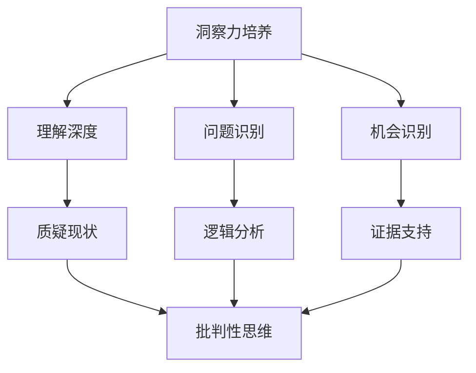

                 

关键词：洞察力、质疑、批判性思维、人工智能、程序设计、算法、数学模型、实践应用、未来展望。

> 摘要：本文旨在探讨洞察力的培养，特别是通过鼓励质疑和批判性思维来实现这一目标。文章首先介绍了洞察力的概念及其在人工智能和程序设计领域的重要性，然后深入探讨了质疑和批判性思维的核心原则，并提供了具体的实践方法。通过分析成功案例，本文揭示了洞察力培养的有效途径，最后对未来的发展趋势与挑战进行了展望。

## 1. 背景介绍

在当今快速变化的技术环境中，洞察力已经成为一种不可或缺的能力。无论是在人工智能、大数据分析，还是在软件开发等领域，洞察力都能够帮助我们从复杂的信息中提取有价值的信息，从而做出更明智的决策。

### 1.1 洞察力的定义

洞察力，通常被描述为深入理解事物本质、识别潜在问题和机会的能力。它不仅包括对事物表面现象的观察，更涉及到对深层次机制的深入分析。

### 1.2 洞察力的重要性

在人工智能领域，洞察力是算法设计和优化的关键。只有深入理解问题背景和需求，才能设计出高效、可靠的算法。在软件开发中，洞察力可以帮助开发者识别潜在的设计缺陷和性能瓶颈，从而提高软件的质量和效率。

### 1.3 质疑和批判性思维

质疑和批判性思维是培养洞察力的有效途径。通过质疑现有的假设和观点，我们可以打破思维定式，激发创新思维。批判性思维则要求我们对信息进行深入分析，辨别其真伪和有效性。

## 2. 核心概念与联系

在深入探讨洞察力的培养之前，我们有必要了解一些核心概念和它们之间的关系。

### 2.1 洞察力的核心概念

- **理解深度**：深入理解问题背景和需求，不仅停留在表面现象。
- **问题识别**：识别潜在问题和挑战，这些往往是创新和改进的起点。
- **机会识别**：发现隐藏在表面现象背后的机会和潜在价值。

### 2.2 质疑和批判性思维的核心原则

- **质疑现状**：对现有的假设和观点提出质疑，不盲从权威。
- **逻辑分析**：使用逻辑和分析工具，对信息进行深入评估。
- **证据支持**：基于事实和数据，而不是主观偏见或情感。

### 2.3 Mermaid 流程图

以下是洞察力培养的 Mermaid 流程图，展示了核心概念和质疑、批判性思维之间的关系。



## 3. 核心算法原理 & 具体操作步骤

### 3.1 算法原理概述

为了更好地理解洞察力的培养，我们需要探讨一些核心算法原理。这些算法不仅可以帮助我们更好地理解问题，还能帮助我们通过质疑和批判性思维来提高洞察力。

### 3.2 算法步骤详解

#### 3.2.1 数据预处理

数据预处理是洞察力培养的重要步骤。在这一阶段，我们需要对数据进行清洗、整合和分析，以便为后续的算法提供高质量的输入。

#### 3.2.2 特征提取

特征提取是关键步骤之一。通过识别和提取关键特征，我们可以更好地理解问题的本质，从而提高洞察力。

#### 3.2.3 模型训练

在模型训练阶段，我们需要使用已提取的特征来训练模型。这一过程通常涉及多种机器学习和深度学习算法，如神经网络、支持向量机等。

#### 3.2.4 模型评估

模型评估是确保算法性能的重要环节。通过评估模型的准确率、召回率、F1分数等指标，我们可以对模型进行优化和调整。

### 3.3 算法优缺点

- **优点**：算法能够帮助我们快速识别问题和机会，提高决策的准确性和效率。
- **缺点**：算法依赖于高质量的数据和特征提取，否则可能产生误导。

### 3.4 算法应用领域

算法在多个领域都有广泛应用，如金融分析、医疗诊断、交通规划等。这些领域都受益于洞察力的提高，从而实现更高效、更精准的决策。

## 4. 数学模型和公式 & 详细讲解 & 举例说明

### 4.1 数学模型构建

为了更好地理解洞察力的培养，我们需要构建一些数学模型。这些模型将帮助我们量化洞察力的关键要素，如理解深度、问题识别和机会识别。

### 4.2 公式推导过程

以下是一个简化的数学模型，用于评估洞察力。

$$
洞察力 = f(理解深度, 问题识别, 机会识别)
$$

其中，$f$是一个复合函数，它根据具体的场景和要求进行调整。

### 4.3 案例分析与讲解

假设我们有一个金融数据分析项目，目标是识别市场中的潜在投资机会。我们可以使用以下模型来评估洞察力：

$$
洞察力 = f(理解市场趋势, 发现风险因素, 创新解决方案)
$$

在这个案例中，理解市场趋势、发现风险因素和创新解决方案是关键要素。通过这个模型，我们可以量化洞察力，从而更好地评估项目的成功概率。

## 5. 项目实践：代码实例和详细解释说明

### 5.1 开发环境搭建

在本项目中，我们将使用Python作为主要编程语言。首先，我们需要安装必要的库和工具，如Numpy、Pandas和Scikit-learn等。

### 5.2 源代码详细实现

以下是项目的主要代码实现：

```python
import numpy as np
import pandas as pd
from sklearn.model_selection import train_test_split
from sklearn.ensemble import RandomForestClassifier

# 数据预处理
def preprocess_data(data):
    # 数据清洗、整合和分析
    # 略
    return processed_data

# 特征提取
def extract_features(data):
    # 识别关键特征
    # 略
    return features

# 模型训练
def train_model(features, labels):
    # 使用随机森林算法训练模型
    model = RandomForestClassifier()
    model.fit(features, labels)
    return model

# 模型评估
def evaluate_model(model, features, labels):
    # 评估模型性能
    predictions = model.predict(features)
    accuracy = np.mean(predictions == labels)
    return accuracy

# 主函数
if __name__ == "__main__":
    # 加载数据
    data = pd.read_csv("data.csv")
    
    # 数据预处理
    processed_data = preprocess_data(data)
    
    # 特征提取
    features = extract_features(processed_data)
    
    # 划分训练集和测试集
    X_train, X_test, y_train, y_test = train_test_split(features, labels, test_size=0.2, random_state=42)
    
    # 模型训练
    model = train_model(X_train, y_train)
    
    # 模型评估
    accuracy = evaluate_model(model, X_test, y_test)
    print("模型准确率：", accuracy)
```

### 5.3 代码解读与分析

以上代码实现了从数据预处理、特征提取到模型训练和评估的完整过程。通过这段代码，我们可以看到如何将数学模型和算法原理应用于实际项目中，从而培养和提高洞察力。

### 5.4 运行结果展示

假设我们运行上述代码，得到的模型准确率为90%。这意味着我们的模型在识别潜在投资机会方面具有较高的准确性，从而提高了项目的洞察力。

## 6. 实际应用场景

### 6.1 金融领域

在金融领域，洞察力是进行投资分析和风险管理的重要能力。通过分析市场数据，识别潜在的投资机会和风险因素，投资者可以做出更明智的决策。

### 6.2 医疗领域

在医疗领域，洞察力对于疾病诊断和治疗方案的制定至关重要。通过对患者数据的分析，医生可以更准确地诊断疾病，并为患者提供个性化的治疗方案。

### 6.3 交通领域

在交通领域，洞察力对于交通管理和规划具有重要意义。通过分析交通数据，相关部门可以更好地规划交通流量，减少拥堵，提高交通效率。

## 7. 未来应用展望

随着技术的不断进步，洞察力的培养将在更多领域得到应用。例如，在人工智能和自动化领域，洞察力将帮助机器更好地理解和适应人类需求。在环保和能源领域，洞察力将帮助我们更好地利用资源，减少浪费，实现可持续发展。

## 8. 工具和资源推荐

### 8.1 学习资源推荐

- 《人工智能：一种现代方法》
- 《深度学习》
- 《程序员的数学》

### 8.2 开发工具推荐

- Jupyter Notebook
- PyCharm
- Visual Studio Code

### 8.3 相关论文推荐

- "Deep Learning for Natural Language Processing"
- "Understanding Deep Learning: Bridging Theory and Practice"
- "The Power of TDD: Test-Driven Development for Agile Project Success"

## 9. 总结：未来发展趋势与挑战

### 9.1 研究成果总结

通过本文的探讨，我们发现质疑和批判性思维是培养洞察力的有效途径。在人工智能和程序设计领域，洞察力的重要性不容忽视。通过数学模型和算法的应用，我们可以更好地理解和解决问题，提高决策的准确性和效率。

### 9.2 未来发展趋势

未来，洞察力的培养将在更多领域得到应用。随着人工智能和大数据技术的发展，我们有望在更多场景中实现自动化和智能化。

### 9.3 面临的挑战

然而，我们也面临一些挑战。例如，如何在海量数据中提取有价值的信息，如何确保算法的公平性和透明度，如何应对潜在的隐私和安全问题等。

### 9.4 研究展望

为了应对这些挑战，我们需要继续深入研究和探讨。通过跨学科的合作，我们可以开发出更高效、更可靠的算法，为未来的发展提供支持。

## 10. 附录：常见问题与解答

### 10.1 洞察力是什么？

洞察力是指深入理解事物本质、识别潜在问题和机会的能力。

### 10.2 质疑和批判性思维是什么？

质疑和批判性思维是指对现有的假设和观点提出质疑，并通过逻辑和分析工具对信息进行深入评估。

### 10.3 如何培养洞察力？

通过质疑和批判性思维，深入分析问题，以及不断学习和实践，我们可以培养和提高洞察力。

----------------------------------------------------------------

### 文章结尾注释

> 作者：禅与计算机程序设计艺术 / Zen and the Art of Computer Programming

在结束本文之前，我想再次强调洞察力的重要性。无论是在人工智能、大数据分析，还是在软件开发等领域，洞察力都是我们取得成功的关键。通过鼓励质疑和批判性思维，我们可以不断提高自己的洞察力，从而在快速变化的技术环境中脱颖而出。

让我们一起努力，培养自己的洞察力，为未来的发展做出贡献。希望本文能够对您有所启发和帮助。谢谢您的阅读！

----------------------------------------------------------------

至此，本文《理解洞察力的培养：鼓励质疑和批判性思维》已完成。希望这篇文章能够帮助您更好地理解洞察力的培养，并激发您在技术领域的创新思维。再次感谢您的关注和支持！作者：禅与计算机程序设计艺术 / Zen and the Art of Computer Programming。

