                 

关键词：洞察力、知识发现、人工智能、算法、数学模型、应用场景

> 摘要：本文旨在深入探讨洞察力的奥秘，并揭示知识发现引擎在这一过程中所扮演的关键角色。通过分析核心概念、算法原理、数学模型，以及实际应用案例，本文旨在帮助读者全面理解洞察力的本质，并了解知识发现引擎如何助力我们在复杂世界中发掘新的知识和见解。

## 1. 背景介绍

在当今这个信息爆炸的时代，人类面临着海量数据的挑战。从互联网到物联网，从社交媒体到企业数据库，各种数据源不断产生大量的信息。然而，这些数据中蕴含的潜在知识和模式，往往隐藏在复杂的关系网络和数据结构中，难以被人类直接感知和理解。这就需要我们借助先进的计算技术和人工智能算法，来发现这些隐藏的知识。

洞察力，是指从复杂的数据和现象中提取出有价值的模式和关系的能力。它是一种理解问题本质、预见未来趋势、发现新机遇的重要能力。然而，人类的认知能力有限，很难在短时间内处理和分析大量的数据。这就需要借助人工智能，特别是知识发现引擎，来辅助我们的洞察力。

知识发现引擎是一种利用机器学习和数据分析技术，从大规模数据集中自动识别出潜在模式和知识的系统。它通过算法和模型，将复杂的数据转换为易于理解和分析的形式，帮助我们更快速、更准确地洞察数据中的规律和趋势。

本文将首先介绍知识发现引擎的核心概念和原理，然后深入探讨其算法和数学模型，并结合实际案例进行详细分析。最后，我们将展望知识发现引擎在未来应用中的前景，以及面临的挑战和机遇。

## 2. 核心概念与联系

### 2.1 知识发现引擎的定义

知识发现引擎（Knowledge Discovery Engine，简称KDE）是一种基于人工智能和数据挖掘技术的系统，它可以从大规模数据集中提取出隐藏的、未知的、潜在的知识和信息。知识发现引擎的目标是帮助用户从海量数据中快速、准确地找到有价值的洞察和模式。

### 2.2 知识发现的过程

知识发现过程通常包括以下几个步骤：

1. **数据预处理**：对原始数据进行清洗、整合和格式化，确保数据的质量和一致性。
2. **数据探索**：通过可视化、统计分析和模式识别等方法，对数据进行初步探索，发现数据中的潜在模式和趋势。
3. **特征选择**：从原始数据中提取出对知识发现最有帮助的特征，提高算法的效率和准确性。
4. **模型训练**：使用机器学习算法，对数据集中的特征进行训练，构建预测模型。
5. **模型评估**：对训练好的模型进行评估和调整，确保其具有良好的性能和可靠性。
6. **知识提取**：从模型中提取出有价值的模式和知识，进行可视化展示或转化为决策支持系统。

### 2.3 知识发现引擎的关键组件

知识发现引擎通常包括以下几个关键组件：

1. **数据源**：提供原始数据的各种来源，包括数据库、文件、API接口等。
2. **数据预处理模块**：负责数据清洗、转换和整合，确保数据的质量和一致性。
3. **特征提取模块**：从原始数据中提取出对知识发现最有帮助的特征，提高算法的效率和准确性。
4. **算法模块**：包括各种机器学习和数据挖掘算法，如聚类、分类、关联规则挖掘等。
5. **模型评估模块**：对训练好的模型进行评估和调整，确保其具有良好的性能和可靠性。
6. **知识提取模块**：从模型中提取出有价值的模式和知识，进行可视化展示或转化为决策支持系统。

### 2.4 Mermaid 流程图

以下是一个简化的知识发现引擎的流程图，使用Mermaid语言进行描述：

```mermaid
flowchart LR
    subgraph 数据源
        数据源1[数据库]
        数据源2[文件系统]
        数据源3[API接口]
    end

    subgraph 数据预处理
        数据预处理1[数据清洗]
        数据预处理2[数据整合]
        数据预处理3[数据格式化]
    end

    subgraph 数据探索
        数据探索1[可视化分析]
        数据探索2[统计分析]
        数据探索3[模式识别]
    end

    subgraph 特征提取
        特征提取1[特征选择]
        特征提取2[特征提取]
    end

    subgraph 模型训练
        模型训练1[算法选择]
        模型训练2[模型训练]
    end

    subgraph 模型评估
        模型评估1[性能评估]
        模型评估2[模型调整]
    end

    subgraph 知识提取
        知识提取1[模式提取]
        知识提取2[知识可视化]
    end

    数据源 --> 数据预处理
    数据预处理 --> 数据探索
    数据探索 --> 特征提取
    特征提取 --> 模型训练
    模型训练 --> 模型评估
    模型评估 --> 知识提取
```



## 3. 核心算法原理 & 具体操作步骤

### 3.1 算法原理概述

知识发现引擎的核心算法通常包括以下几类：

1. **聚类算法**：将相似的数据点分组，形成聚类。常见的聚类算法有K-means、DBSCAN等。
2. **分类算法**：根据已知的标签数据，将新数据分类到不同的类别中。常见的分类算法有决策树、支持向量机、神经网络等。
3. **关联规则挖掘**：发现数据集中不同属性之间的关联关系。常见的算法有Apriori、FP-growth等。
4. **异常检测算法**：识别数据中的异常或异常模式。常见的算法有孤立森林、Isolation Forest等。

### 3.2 算法步骤详解

以下以K-means算法为例，详细描述其操作步骤：

1. **初始化中心点**：随机选择K个数据点作为初始中心点。
2. **分配数据点**：计算每个数据点到各个中心点的距离，将数据点分配到距离最近的中心点所在的聚类。
3. **更新中心点**：重新计算每个聚类的中心点，作为新的中心点。
4. **重复步骤2和3，直到满足停止条件**：例如，中心点的变化小于某个阈值，或者达到最大迭代次数。

### 3.3 算法优缺点

**K-means算法的优点**：

- 算法简单，易于实现。
- 运算速度快，适合处理大规模数据。
- 对于初始中心点的选择敏感，可能收敛到局部最优解。

**K-means算法的缺点**：

- 对噪声和异常值敏感，可能导致聚类结果不准确。
- 无法提前知道K值（聚类数量），需要通过交叉验证等方法确定。
- 聚类结果可能受到数据分布形状的影响。

### 3.4 算法应用领域

K-means算法在多个领域都有广泛的应用，包括：

- **市场营销**：将客户划分为不同的群体，为每个群体制定个性化的营销策略。
- **图像处理**：对图像进行降维处理，提取关键特征，用于图像分类或图像增强。
- **推荐系统**：根据用户的兴趣和行为，推荐相关的商品或内容。

## 4. 数学模型和公式 & 详细讲解 & 举例说明

### 4.1 数学模型构建

在K-means算法中，我们首先需要构建一个数学模型来描述聚类过程。这个模型包括以下部分：

1. **数据点表示**：每个数据点可以用一个多维向量表示，例如$x = [x_1, x_2, ..., x_n]$。
2. **聚类中心表示**：聚类中心可以用一个多维向量表示，例如$c = [c_1, c_2, ..., c_n]$。
3. **距离度量**：常用的距离度量有欧氏距离、曼哈顿距离、余弦相似度等。其中，欧氏距离公式为：
   $$d(x, c) = \sqrt{\sum_{i=1}^{n} (x_i - c_i)^2}$$
4. **目标函数**：K-means算法的目标是最小化每个数据点到其对应聚类中心的距离平方和，即：
   $$J(x, c) = \sum_{i=1}^{m} \sum_{j=1}^{k} d(x_i, c_j)^2$$
   其中，$m$是数据点的个数，$k$是聚类数量。

### 4.2 公式推导过程

假设我们已经有了初始的聚类中心$c_0$，接下来，我们通过迭代更新聚类中心，直到目标函数$J(x, c)$收敛到最小值。

1. **初始化聚类中心**：随机选择$k$个数据点作为初始聚类中心$c_0$。
2. **分配数据点**：对于每个数据点$x_i$，计算其到每个聚类中心$c_j$的距离$d(x_i, c_j)$，然后将$x_i$分配到距离最近的聚类中心$c_j$。
3. **更新聚类中心**：计算每个聚类中心的新值$c_{new}$，公式为：
   $$c_{new} = \frac{1}{N_j} \sum_{x_i \in C_j} x_i$$
   其中，$N_j$是分配到聚类中心$c_j$的数据点个数。
4. **重复步骤2和3，直到满足停止条件**：例如，当聚类中心的变化小于某个阈值$\epsilon$，或者达到最大迭代次数$T$时，停止迭代。

### 4.3 案例分析与讲解

假设我们有一个包含100个数据点的数据集，需要将其分为5个聚类。以下是K-means算法的运行过程：

1. **初始化聚类中心**：随机选择5个数据点作为初始聚类中心。
2. **分配数据点**：计算每个数据点到5个聚类中心的距离，将数据点分配到距离最近的聚类中心。
3. **更新聚类中心**：根据每个聚类中心的新值，更新聚类中心。
4. **重复步骤2和3，直到满足停止条件**：例如，当聚类中心的变化小于0.01，或者达到100次迭代时，停止迭代。

通过多次迭代，K-means算法最终收敛到一个聚类结果。我们可以在可视化工具中展示聚类结果，以便更直观地观察数据点的分布情况。

以下是一个简单的Python代码示例，实现了K-means算法：

```python
import numpy as np
import matplotlib.pyplot as plt

def kmeans(data, k, max_iters, epsilon):
    # 初始化聚类中心
    centroids = data[np.random.choice(data.shape[0], k, replace=False)]
    for _ in range(max_iters):
        # 分配数据点
        distances = np.linalg.norm(data[:, np.newaxis] - centroids, axis=2)
        labels = np.argmin(distances, axis=1)
        
        # 更新聚类中心
        new_centroids = np.array([data[labels == i].mean(axis=0) for i in range(k)])
        
        # 判断是否收敛
        if np.linalg.norm(new_centroids - centroids) < epsilon:
            break
        
        centroids = new_centroids
    
    return centroids, labels

# 示例数据集
data = np.random.rand(100, 2)

# 运行K-means算法
centroids, labels = kmeans(data, 5, 100, 0.01)

# 可视化聚类结果
plt.scatter(data[:, 0], data[:, 1], c=labels)
plt.scatter(centroids[:, 0], centroids[:, 1], s=300, c='red')
plt.show()
```

## 5. 项目实践：代码实例和详细解释说明

### 5.1 开发环境搭建

为了实现知识发现引擎，我们需要搭建一个合适的开发环境。以下是推荐的开发环境和工具：

- **编程语言**：Python
- **开发环境**：Anaconda
- **库和依赖**：NumPy、Pandas、Scikit-learn、Matplotlib

安装Python和Anaconda：

1. 访问Anaconda官网（https://www.anaconda.com/products/individual）并下载适合操作系统的Anaconda安装包。
2. 运行安装程序，按照提示进行安装。

安装NumPy、Pandas、Scikit-learn和Matplotlib：

1. 打开Anaconda命令行或终端。
2. 输入以下命令，依次安装所需库：
   ```shell
   conda install numpy
   conda install pandas
   conda install scikit-learn
   conda install matplotlib
   ```

### 5.2 源代码详细实现

以下是一个简单的Python代码示例，实现了K-means算法，并对结果进行可视化展示：

```python
import numpy as np
import matplotlib.pyplot as plt

def kmeans(data, k, max_iters, epsilon):
    # 初始化聚类中心
    centroids = data[np.random.choice(data.shape[0], k, replace=False)]
    for _ in range(max_iters):
        # 分配数据点
        distances = np.linalg.norm(data[:, np.newaxis] - centroids, axis=2)
        labels = np.argmin(distances, axis=1)
        
        # 更新聚类中心
        new_centroids = np.array([data[labels == i].mean(axis=0) for i in range(k)])
        
        # 判断是否收敛
        if np.linalg.norm(new_centroids - centroids) < epsilon:
            break
        
        centroids = new_centroids
    
    return centroids, labels

# 示例数据集
data = np.random.rand(100, 2)

# 运行K-means算法
centroids, labels = kmeans(data, 5, 100, 0.01)

# 可视化聚类结果
plt.scatter(data[:, 0], data[:, 1], c=labels)
plt.scatter(centroids[:, 0], centroids[:, 1], s=300, c='red')
plt.show()
```

### 5.3 代码解读与分析

这段代码实现了K-means算法的核心步骤，并对结果进行可视化展示。以下是代码的详细解读：

1. **导入库和模块**：
   ```python
   import numpy as np
   import matplotlib.pyplot as plt
   ```

2. **定义K-means算法函数**：
   ```python
   def kmeans(data, k, max_iters, epsilon):
       # 初始化聚类中心
       centroids = data[np.random.choice(data.shape[0], k, replace=False)]
       for _ in range(max_iters):
           # 分配数据点
           distances = np.linalg.norm(data[:, np.newaxis] - centroids, axis=2)
           labels = np.argmin(distances, axis=1)
           
           # 更新聚类中心
           new_centroids = np.array([data[labels == i].mean(axis=0) for i in range(k)])
           
           # 判断是否收敛
           if np.linalg.norm(new_centroids - centroids) < epsilon:
               break
           
           centroids = new_centroids
       
       return centroids, labels
   ```

   - **初始化聚类中心**：从数据集中随机选择$k$个数据点作为初始聚类中心。
   - **分配数据点**：计算每个数据点到每个聚类中心的距离，并将数据点分配到距离最近的聚类中心。
   - **更新聚类中心**：计算每个聚类中心的新值，作为新的聚类中心。
   - **判断是否收敛**：当聚类中心的变化小于某个阈值$\epsilon$时，算法收敛。

3. **示例数据集**：
   ```python
   data = np.random.rand(100, 2)
   ```

   生成一个包含100个数据点的随机数据集，每个数据点由两个维度组成。

4. **运行K-means算法**：
   ```python
   centroids, labels = kmeans(data, 5, 100, 0.01)
   ```

   调用`kmeans`函数，运行K-means算法，将数据集分为5个聚类。

5. **可视化聚类结果**：
   ```python
   plt.scatter(data[:, 0], data[:, 1], c=labels)
   plt.scatter(centroids[:, 0], centroids[:, 1], s=300, c='red')
   plt.show()
   ```

   使用Matplotlib库将聚类结果可视化展示，蓝色点表示数据点，红色点表示聚类中心。

### 5.4 运行结果展示

运行上述代码后，将生成一个包含100个数据点和5个聚类中心的可视化结果。数据点被分配到不同的聚类中心，形成5个不同的簇。红色点表示聚类中心，用于展示聚类的分布情况。


## 6. 实际应用场景

### 6.1 社交网络分析

在社交网络分析中，知识发现引擎可以帮助我们识别潜在的兴趣群体、发现网络中的关键节点和传播路径。通过分析用户的行为和关系，我们可以发现隐藏在复杂社交网络中的模式和趋势，从而为社区运营、市场营销等提供有力支持。

### 6.2 金融市场预测

在金融市场预测中，知识发现引擎可以挖掘历史交易数据中的潜在规律和模式，帮助投资者识别潜在的投资机会和风险。通过对市场数据的分析，我们可以预测股票价格、汇率走势等，为投资决策提供数据支持。

### 6.3 健康数据分析

在健康数据分析中，知识发现引擎可以帮助我们识别疾病的风险因素、预测疾病的发病趋势。通过对医疗数据的分析，我们可以发现潜在的健康问题，为早期干预和预防提供依据。

### 6.4 智能推荐系统

在智能推荐系统中，知识发现引擎可以挖掘用户行为和偏好数据中的潜在关联关系，为用户推荐个性化的商品、内容和服务。通过分析用户的历史行为和兴趣，我们可以为用户提供更精准的推荐，提高用户体验和满意度。

## 7. 工具和资源推荐

### 7.1 学习资源推荐

1. **《机器学习》（周志华 著）**：全面介绍了机器学习的基本概念、算法和应用。
2. **《数据挖掘：实用工具与技术》（Mike Murray 著）**：详细介绍了数据挖掘的基本方法和技术。
3. **《深度学习》（Ian Goodfellow、Yoshua Bengio、Aaron Courville 著）**：深度学习的经典教材，涵盖了深度学习的基本理论和实践应用。

### 7.2 开发工具推荐

1. **Anaconda**：Python的开发环境，包括NumPy、Pandas、Scikit-learn等常用库。
2. **Jupyter Notebook**：交互式编程环境，方便进行数据分析和实验。
3. **TensorFlow**：开源的深度学习框架，支持各种深度学习模型的构建和训练。

### 7.3 相关论文推荐

1. **"K-means++: The Advantages of Conditional Probability and Generalized Regularization"**：对K-means算法的改进，提出了一种更有效的聚类中心初始化方法。
2. **"LDA: A Method for Topic Modeling"**：LDA（Latent Dirichlet Allocation）算法的原始论文，用于主题建模和文本分析。
3. **"Recommender Systems Handbook"**：全面介绍了推荐系统的基本理论和实践方法。

## 8. 总结：未来发展趋势与挑战

### 8.1 研究成果总结

知识发现引擎作为人工智能和数据分析的重要工具，已经在多个领域取得了显著的研究成果和应用。通过聚类、分类、关联规则挖掘等方法，知识发现引擎帮助我们从海量数据中提取出有价值的模式和知识，为决策支持、业务优化、风险控制等提供了有力支持。

### 8.2 未来发展趋势

1. **算法改进与优化**：随着计算技术和人工智能的发展，知识发现引擎的算法和模型将不断优化，提高其效率和准确性。
2. **跨领域融合**：知识发现引擎将在更多领域得到应用，如生物信息学、金融科技、智能交通等，实现跨领域的融合与发展。
3. **智能化与自主性**：知识发现引擎将逐步实现智能化和自主性，能够自动发现新的知识和模式，无需人工干预。

### 8.3 面临的挑战

1. **数据质量和多样性**：高质量、多样化的数据是知识发现引擎成功的关键。然而，现实世界中的数据往往存在噪声、缺失和多样性问题，这对知识发现引擎的性能和可靠性提出了挑战。
2. **可解释性和透明性**：知识发现引擎的结果往往是一个复杂的模型或算法，如何确保其可解释性和透明性，让用户能够理解并信任其结果，是一个重要的挑战。
3. **计算资源消耗**：大规模数据集的处理需要大量的计算资源，如何在有限的计算资源下高效地运行知识发现引擎，是一个需要解决的问题。

### 8.4 研究展望

随着大数据、人工智能技术的不断进步，知识发现引擎将在更多领域得到应用，发挥更大的作用。未来，我们将致力于解决数据质量、可解释性、计算资源等问题，推动知识发现引擎在各个领域的深入研究和应用，为人类社会的进步和发展做出更大的贡献。

## 9. 附录：常见问题与解答

### 9.1 知识发现引擎与数据挖掘的区别是什么？

知识发现引擎和数据挖掘有很多相似之处，但也有一些区别：

- **范围**：知识发现引擎主要关注从大规模数据集中提取出隐藏的、未知的、潜在的知识，而数据挖掘则更侧重于发现数据中的有用信息。
- **目标**：知识发现引擎的目标是发现新的知识和见解，而数据挖掘的目标是提取出有用的信息，以支持决策。
- **技术**：知识发现引擎通常采用机器学习和数据分析技术，而数据挖掘则采用更多传统的方法，如统计分析和模式识别。

### 9.2 K-means算法是否适用于所有数据集？

K-means算法适用于许多数据集，尤其是那些具有明显聚类特征的数据。然而，它也有一些局限性：

- **数据分布**：K-means算法假设数据点在聚类中心附近呈高斯分布，对于非高斯分布的数据，聚类效果可能较差。
- **聚类数量**：K-means算法需要提前知道聚类数量$k$，否则需要通过交叉验证等方法确定$k$的值。
- **噪声和异常值**：K-means算法对噪声和异常值敏感，可能导致聚类结果不准确。

### 9.3 如何解决K-means算法的局部最优问题？

K-means算法容易陷入局部最优解，以下是一些解决方法：

- **多次运行**：多次运行K-means算法，选择最优的聚类结果。
- **改进初始化方法**：使用更有效的初始化方法，如K-means++，来初始化聚类中心。
- **使用其他聚类算法**：尝试其他聚类算法，如DBSCAN、层次聚类等，以避免局部最优问题。

## 参考文献

1. 周志华，《机器学习》，清华大学出版社，2016。
2. Mike Murray，《数据挖掘：实用工具与技术》，机械工业出版社，2014。
3. Ian Goodfellow、Yoshua Bengio、Aaron Courville，《深度学习》，电子工业出版社，2017。
4. David C. Williams，《Knowledge Discovery and Data Mining》，Springer，2005。
5. MacNab, P. A.，《A Review of K-Means Clustering: Algorithms and Applications》，ACM Computing Surveys，2005。

**作者：禅与计算机程序设计艺术 / Zen and the Art of Computer Programming**

