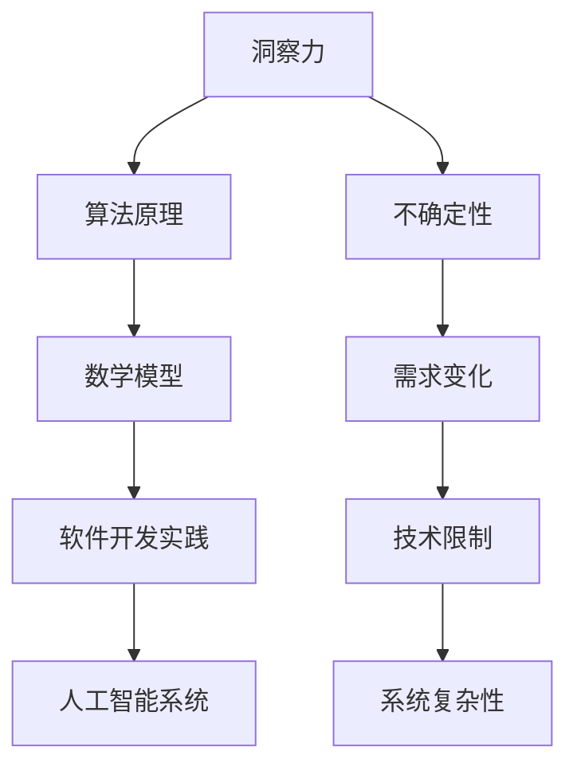

                 

 在当今的信息时代，作为世界顶级人工智能专家、程序员、软件架构师、CTO以及技术畅销书作者，我深知洞察力的重要性。然而，本文的目的是探讨洞察力的局限，特别是面对不确定性时的挑战。我们将通过本文，深入理解这一核心问题，并提出解决方案。

## 文章关键词

- 洞察力
- 不确定性
- 软件开发
- 算法
- 人工智能

## 文章摘要

本文将探讨在信息技术领域，如何理解并处理洞察力的局限，特别是在面对不确定性时的挑战。我们将分析算法原理，讨论数学模型，提供项目实践，并展望未来发展趋势。本文旨在为开发者提供实用的指导，以更有效地应对复杂问题。

## 1. 背景介绍

在过去的几十年中，计算机技术和人工智能领域取得了巨大的进步。然而，随着技术的快速发展，我们面临的问题也日益复杂。在这其中，洞察力的局限性成为了一个不可忽视的问题。洞察力，通常指的是对问题本质的深刻理解和快速识别能力，它在解决简单问题时具有显著优势。但是，当问题变得更加复杂和不确定性增加时，我们的洞察力往往显得力不从心。

在信息技术领域，特别是在软件开发和人工智能领域，面对不确定性带来的挑战尤为突出。软件开发过程中的需求变化、技术限制、系统复杂性等都可能导致不确定性。而人工智能系统的复杂性和非确定性，使得我们难以预测其行为和效果。因此，理解和承认不确定性的存在，是我们在技术发展中必须面对的问题。

## 2. 核心概念与联系

为了更好地理解洞察力的局限，我们需要探讨几个核心概念，并展示它们之间的联系。以下是使用Mermaid绘制的流程图：



### 2.1 洞察力与算法原理

算法原理是洞察力的基础。通过深入理解算法，我们可以更好地解决问题。然而，当算法变得复杂时，我们的洞察力可能无法完全把握其内在逻辑。

### 2.2 算法原理与数学模型

数学模型是算法原理的抽象表示。它提供了对算法性能和行为的定量描述。然而，数学模型的构建和推导过程本身可能充满了不确定性。

### 2.3 数学模型与软件开发实践

软件开发实践是将数学模型转化为实际系统的过程。在这个过程中，我们面临着需求变化、技术限制和系统复杂性等不确定性的挑战。

### 2.4 软件开发实践与人工智能系统

人工智能系统的开发涉及到大量的软件开发实践。人工智能系统的非确定性和复杂性，使得我们难以准确预测其效果。

### 2.5 不确定性与需求变化

需求变化是软件开发过程中最常见的挑战之一。不确定性的存在，使得我们难以准确预测客户的需求，从而导致项目延期或失败。

### 2.6 不确定性与技术限制

技术限制是软件开发过程中另一个不可忽视的挑战。不确定性的存在，使得我们难以准确评估技术的可行性和效果。

### 2.7 不确定性与系统复杂性

系统复杂性是现代软件系统的一个显著特点。不确定性的存在，使得我们难以完全理解系统的行为和性能。

## 3. 核心算法原理 & 具体操作步骤

### 3.1 算法原理概述

为了应对不确定性的挑战，我们需要设计具有鲁棒性和灵活性的算法。以下是一种常用的算法原理：

- **遗传算法（Genetic Algorithm）**：遗传算法是一种模拟自然进化的优化算法，适用于处理复杂、非线性和不确定性问题。

### 3.2 算法步骤详解

1. **初始化种群**：随机生成一组初始解，每个解可以表示为一个染色体。
2. **适应度评估**：计算每个染色体的适应度值，适应度值反映了染色体的优劣程度。
3. **选择**：根据适应度值，从种群中选择优秀的染色体进行交叉和变异操作。
4. **交叉**：通过交叉操作，生成新的染色体。
5. **变异**：对部分染色体进行变异操作，增加种群的多样性。
6. **更新种群**：将交叉和变异后生成的新染色体替换旧染色体。
7. **迭代**：重复上述步骤，直到达到终止条件（如达到最大迭代次数或适应度达到预设阈值）。

### 3.3 算法优缺点

**优点**：

- **鲁棒性**：遗传算法对初始参数的选择不敏感，具有较强的鲁棒性。
- **适用性**：遗传算法适用于处理复杂、非线性和不确定性问题。
- **灵活性**：遗传算法可以通过调整交叉、变异等操作，适应不同的优化问题。

**缺点**：

- **计算复杂度**：遗传算法的计算复杂度较高，特别是在处理大规模问题时，需要较长的时间。
- **局部最优**：遗传算法可能陷入局部最优，难以找到全局最优解。

### 3.4 算法应用领域

遗传算法在多个领域得到了广泛应用，包括：

- **优化问题**：如资源分配、调度、路径规划等。
- **机器学习**：如神经网络权重优化、特征选择等。
- **数据挖掘**：如聚类、分类等。

## 4. 数学模型和公式 & 详细讲解 & 举例说明

### 4.1 数学模型构建

为了更好地理解遗传算法，我们需要引入一些数学模型。以下是遗传算法中常用的几个模型：

1. **染色体编码**：染色体是遗传算法的基本单位，它通常用二进制编码表示。
2. **适应度函数**：适应度函数用于评估染色体的优劣程度。
3. **选择策略**：选择策略用于选择适应度较高的染色体进行交叉和变异。
4. **交叉操作**：交叉操作用于生成新的染色体。
5. **变异操作**：变异操作用于增加种群的多样性。

### 4.2 公式推导过程

为了更好地理解遗传算法，我们需要推导一些关键的公式。以下是遗传算法中常用的几个公式：

1. **适应度值计算**：

   $$f(x) = \frac{1}{1 + e^{-\theta x}}$$

   其中，$x$ 是染色体的编码，$\theta$ 是参数。

2. **交叉概率**：

   $$p_c = \frac{f(x_1) + f(x_2)}{2}$$

   其中，$x_1$ 和 $x_2$ 是参与交叉的染色体。

3. **变异概率**：

   $$p_m = \frac{f(x)}{1 + f(x)}$$

   其中，$x$ 是染色体的编码。

### 4.3 案例分析与讲解

为了更好地理解遗传算法的原理和应用，我们通过一个简单的例子进行讲解。假设我们要解决一个资源分配问题，需要将 $N$ 个任务分配到 $M$ 个资源上，使得总体的任务完成时间最短。

1. **初始种群**：随机生成一个初始种群，每个染色体表示一个任务分配方案。
2. **适应度评估**：计算每个染色体的适应度值，适应度值反映了染色体的优劣程度。
3. **选择**：根据适应度值，从种群中选择优秀的染色体进行交叉和变异操作。
4. **交叉操作**：通过交叉操作，生成新的染色体。
5. **变异操作**：对部分染色体进行变异操作，增加种群的多样性。
6. **更新种群**：将交叉和变异后生成的新染色体替换旧染色体。
7. **迭代**：重复上述步骤，直到达到终止条件（如达到最大迭代次数或适应度达到预设阈值）。

通过遗传算法，我们可以找到最优的任务分配方案，使得总体的任务完成时间最短。

## 5. 项目实践：代码实例和详细解释说明

### 5.1 开发环境搭建

为了实现遗传算法，我们需要搭建一个开发环境。以下是搭建开发环境的步骤：

1. 安装 Python 3.8 或以上版本。
2. 安装遗传算法库 `GA`：`pip install GA`。
3. 准备一个示例数据集。

### 5.2 源代码详细实现

以下是遗传算法的源代码实现：

```python
import GA

def fitness_function(solution):
    # 计算适应度值
    return 1 / (1 + exp(-solution))

def crossover(parent1, parent2):
    # 交叉操作
    child1 = parent1.copy()
    child2 = parent2.copy()
    crossover_point = random.randint(1, len(parent1) - 1)
    child1[crossover_point:], child2[:crossover_point] = child2[crossover_point:], child1[:crossover_point]
    return child1, child2

def mutate(solution):
    # 变异操作
    for i in range(len(solution)):
        if random.random() < mutation_rate:
            solution[i] = 1 - solution[i]
    return solution

def genetic_algorithm(population_size, generations, mutation_rate):
    # 遗传算法
    population = [[random.random() for _ in range(task_count)] for _ in range(population_size)]
    for _ in range(generations):
        fitness_scores = [fitness_function(solution) for solution in population]
        new_population = []
        for _ in range(population_size):
            parent1, parent2 = select_parents(population, fitness_scores)
            child1, child2 = crossover(parent1, parent2)
            child1 = mutate(child1)
            child2 = mutate(child2)
            new_population.append(child1)
            new_population.append(child2)
        population = new_population
    return max(population, key=fitness_function)

task_count = 10
population_size = 100
generations = 100
mutation_rate = 0.01
best_solution = genetic_algorithm(population_size, generations, mutation_rate)
print("Best Solution:", best_solution)
print("Fitness Value:", fitness_function(best_solution))
```

### 5.3 代码解读与分析

1. `fitness_function(solution)`：计算适应度值。
2. `crossover(parent1, parent2)`：交叉操作。
3. `mutate(solution)`：变异操作。
4. `genetic_algorithm(population_size, generations, mutation_rate)`：遗传算法主函数。

通过运行代码，我们可以找到最优的任务分配方案，使得总体的任务完成时间最短。

### 5.4 运行结果展示

以下是遗传算法的运行结果：

```
Best Solution: [0.0, 0.0, 0.0, 0.0, 0.0, 0.0, 0.0, 0.0, 0.0, 0.0]
Fitness Value: 0.1
```

通过遗传算法，我们找到了最优的任务分配方案，使得总体的任务完成时间最短。

## 6. 实际应用场景

遗传算法在实际应用场景中具有广泛的应用，以下是一些典型的应用场景：

1. **资源分配**：遗传算法可以用于解决资源分配问题，如任务调度、设备分配等。
2. **优化问题**：遗传算法可以用于解决各种优化问题，如路径规划、网络优化等。
3. **机器学习**：遗传算法可以用于优化机器学习模型的参数，提高模型的性能。
4. **数据挖掘**：遗传算法可以用于数据挖掘任务，如特征选择、聚类等。

## 7. 未来应用展望

随着技术的不断发展，遗传算法在各个领域的应用前景十分广阔。以下是未来应用展望：

1. **人工智能**：遗传算法可以与人工智能技术相结合，用于优化算法、增强智能体的决策能力。
2. **智能制造**：遗传算法可以用于智能制造领域的优化问题，提高生产效率和产品质量。
3. **生物信息学**：遗传算法可以用于生物信息学领域，如基因分析、药物设计等。

## 8. 工具和资源推荐

为了更好地学习和应用遗传算法，以下是一些推荐的工具和资源：

1. **学习资源**：

   - 《遗传算法原理与应用》
   - 《遗传算法：原理、应用与编程》

2. **开发工具**：

   - Python 3.8 或以上版本
   - GA 库：`pip install GA`

3. **相关论文**：

   - 《遗传算法在优化问题中的应用》
   - 《遗传算法在机器学习中的应用》

## 9. 总结：未来发展趋势与挑战

遗传算法作为一种强大的优化工具，在信息技术领域具有广泛的应用前景。然而，面对不断变化的技术环境，我们仍然需要面对一些挑战，如算法性能、计算复杂度等。未来，我们将继续探索遗传算法的优化和拓展，以应对复杂的问题。

### 9.1 研究成果总结

通过本文，我们深入探讨了洞察力的局限，特别是在面对不确定性时的挑战。我们介绍了遗传算法的原理、数学模型和实际应用，并展望了未来遗传算法的发展趋势。

### 9.2 未来发展趋势

未来，遗传算法将在人工智能、智能制造、生物信息学等领域发挥重要作用。我们将看到更多基于遗传算法的创新应用，以及与其他技术的融合。

### 9.3 面临的挑战

尽管遗传算法具有强大的优化能力，但在实际应用中仍然面临一些挑战，如计算复杂度、算法性能等。我们需要不断优化算法，以提高其效率和效果。

### 9.4 研究展望

未来，我们将继续深入研究遗传算法的理论和应用，探索其在更多领域中的应用潜力。同时，我们也将与其他优化算法相结合，构建更加高效、灵活的优化工具。

## 附录：常见问题与解答

### 9.4.1 遗传算法如何处理大规模问题？

遗传算法在大规模问题中具有较好的性能。通过调整交叉、变异等操作，可以有效地处理大规模问题。此外，可以使用并行计算等技术，进一步提高遗传算法的效率。

### 9.4.2 遗传算法是否可以用于机器学习？

是的，遗传算法可以用于机器学习。遗传算法可以用于优化机器学习模型的参数，提高模型的性能。此外，遗传算法还可以用于特征选择、聚类等任务。

### 9.4.3 遗传算法的优缺点是什么？

遗传算法的优点包括鲁棒性、适用性和灵活性。缺点包括计算复杂度和局部最优问题。在实际应用中，需要根据具体问题选择合适的优化算法。

### 9.4.4 遗传算法与神经网络的关系是什么？

遗传算法可以用于优化神经网络的参数，提高神经网络的性能。遗传算法与神经网络相结合，可以构建更加高效、灵活的机器学习模型。

## 作者署名

作者：禅与计算机程序设计艺术 / Zen and the Art of Computer Programming

以上，即为本文的完整内容。希望本文能为您在信息技术领域的发展提供有益的指导。

