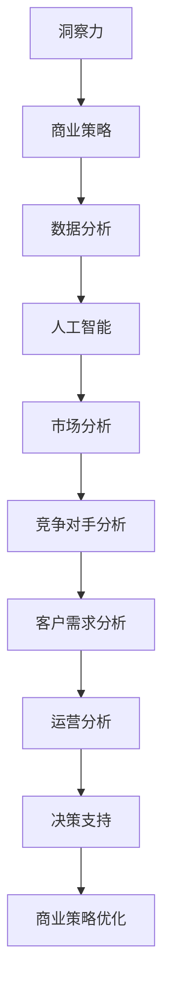

                 

关键词：洞察力，商业策略，技术应用，案例研究

> 摘要：本文将探讨洞察力在商业策略中的应用，通过分析具体案例，阐述如何运用技术手段提升商业洞察力，从而制定更加有效的商业策略。文章将从背景介绍、核心概念与联系、核心算法原理与操作步骤、数学模型与公式、项目实践、实际应用场景、工具和资源推荐以及总结和展望等方面，全面阐述洞察力在商业策略中的重要性及其实践应用。

## 1. 背景介绍

在当今高度竞争的商业环境中，企业必须不断适应市场变化，才能保持竞争优势。商业策略的制定成为企业成功的关键因素。然而，传统的商业策略往往依赖于经验和直觉，而现代企业需要更加精准和有效的洞察力来支持决策。洞察力是一种深度理解和分析问题的能力，它可以帮助企业更好地了解市场趋势、客户需求和竞争对手行为。

随着信息技术的快速发展，大数据、人工智能等技术的应用为商业洞察力的提升提供了新的可能性。通过数据分析和算法模型，企业可以更快速地获取信息，更准确地预测市场变化，从而制定出更加有效的商业策略。本文将探讨如何在商业策略中运用洞察力，结合实际案例进行分析，以期为企业和创业者提供有益的启示。

## 2. 核心概念与联系

### 2.1 洞察力

洞察力（Insight）是一种深度理解和分析问题的能力，它使人们能够从复杂的现象中识别出关键问题和潜在的机会。在商业领域，洞察力意味着能够从大量的数据和信息中提取出有价值的信息，从而指导企业的决策。

### 2.2 商业策略

商业策略（Business Strategy）是企业为了实现长期目标而制定的规划和行动方案。商业策略的制定需要基于对市场、竞争对手、客户需求等方面的深入分析。洞察力在商业策略中的作用在于，它可以帮助企业更好地理解外部环境和内部资源，从而制定出更具前瞻性和可行性的商业策略。

### 2.3 数据分析

数据分析（Data Analysis）是洞察力的重要来源。通过数据收集、处理和分析，企业可以获取关于市场、客户和运营等方面的有价值信息。数据分析技术包括统计分析、数据挖掘、机器学习等，它们可以帮助企业发现数据中的模式和关联，从而提高商业洞察力。

### 2.4 人工智能

人工智能（Artificial Intelligence，AI）是提升商业洞察力的关键技术之一。通过机器学习和深度学习算法，人工智能可以自动分析大量数据，识别出复杂模式，从而为企业提供更深入的洞察。人工智能的应用领域包括推荐系统、预测分析、自然语言处理等，它们在商业策略中具有广泛的应用潜力。

### 2.5 洞察力与商业策略的 Mermaid 流程图



## 3. 核心算法原理 & 具体操作步骤

### 3.1 算法原理概述

在商业策略中，常用的算法包括统计分析、数据挖掘和机器学习等。这些算法的基本原理是通过处理和分析数据，从数据中提取出有价值的信息，从而支持商业决策。

- **统计分析**：通过对数据进行描述性统计和推断性统计，识别数据中的模式和趋势。
- **数据挖掘**：通过发现数据中的隐含模式，识别数据中的关联和规律。
- **机器学习**：通过训练模型，使计算机能够从数据中自动学习和发现规律，从而进行预测和决策。

### 3.2 算法步骤详解

1. **数据收集**：收集与商业策略相关的数据，包括市场数据、客户数据、运营数据等。
2. **数据预处理**：清洗和整理数据，包括数据去重、缺失值处理、异常值检测等。
3. **数据分析**：使用统计分析、数据挖掘和机器学习算法，对数据进行处理和分析，提取有价值的信息。
4. **模型训练与优化**：根据分析结果，训练机器学习模型，并使用交叉验证等方法进行模型优化。
5. **决策支持**：使用训练好的模型进行预测和决策，为商业策略提供支持。

### 3.3 算法优缺点

- **统计分析**：优点在于简单易懂，能够快速识别数据中的趋势和模式；缺点是对数据的依赖性较高，难以处理复杂的数据结构。
- **数据挖掘**：优点在于能够发现数据中的深层次模式，适用于大规模数据；缺点是算法复杂度高，计算时间较长。
- **机器学习**：优点在于能够自动学习和发现规律，适用于处理复杂的数据结构；缺点是需要大量的数据，且模型优化较为复杂。

### 3.4 算法应用领域

- **市场分析**：通过分析市场数据，预测市场趋势，为市场策略提供支持。
- **竞争对手分析**：通过分析竞争对手的行为和策略，制定有针对性的竞争策略。
- **客户需求分析**：通过分析客户数据，识别客户需求，优化产品和服务。
- **运营分析**：通过分析运营数据，优化运营流程，提高运营效率。

## 4. 数学模型和公式 & 详细讲解 & 举例说明

### 4.1 数学模型构建

在商业策略中，常用的数学模型包括线性回归模型、决策树模型、神经网络模型等。这些模型的基本原理是通过分析数据，建立数学关系，从而进行预测和决策。

- **线性回归模型**：通过最小二乘法建立因变量和自变量之间的线性关系。
- **决策树模型**：通过递归划分数据，建立决策规则。
- **神经网络模型**：通过多层神经网络，模拟人脑神经元的工作方式，进行非线性预测和决策。

### 4.2 公式推导过程

以线性回归模型为例，其公式推导过程如下：

$$
y = \beta_0 + \beta_1x + \epsilon
$$

其中，$y$ 为因变量，$x$ 为自变量，$\beta_0$ 和 $\beta_1$ 分别为模型的参数，$\epsilon$ 为随机误差。

通过最小二乘法，可以求得最佳参数值：

$$
\beta_1 = \frac{\sum_{i=1}^{n}(x_i - \bar{x})(y_i - \bar{y})}{\sum_{i=1}^{n}(x_i - \bar{x})^2}
$$

$$
\beta_0 = \bar{y} - \beta_1\bar{x}
$$

### 4.3 案例分析与讲解

假设某公司希望通过分析销售数据，预测下个月的销售量。收集到以下数据：

| 月份 | 销售量 |
|------|--------|
| 1    | 100    |
| 2    | 120    |
| 3    | 150    |
| 4    | 180    |
| 5    | 200    |

首先，对数据进行分析，发现销售量与月份之间存在线性关系。然后，使用线性回归模型进行建模，得到以下结果：

$$
y = 70 + 30x
$$

根据这个模型，可以预测下个月的销售量：

$$
y = 70 + 30 \times 6 = 220
$$

因此，预测下个月的销售量为220。

## 5. 项目实践：代码实例和详细解释说明

### 5.1 开发环境搭建

为了实现商业策略中的数据分析，我们需要搭建一个合适的数据分析环境。以下是一个简单的开发环境搭建步骤：

1. 安装 Python 解释器：从 [Python 官网](https://www.python.org/) 下载并安装 Python 3.8 及以上版本。
2. 安装数据分析库：在命令行中执行以下命令安装常用数据分析库：

   ```bash
   pip install numpy pandas matplotlib
   ```

### 5.2 源代码详细实现

以下是一个简单的线性回归模型实现，用于预测销售量：

```python
import numpy as np
import pandas as pd
import matplotlib.pyplot as plt

# 数据
data = {
    '月份': [1, 2, 3, 4, 5],
    '销售量': [100, 120, 150, 180, 200]
}

df = pd.DataFrame(data)

# 模型参数
X = df['月份'].values.reshape(-1, 1)
y = df['销售量'].values

# 最小二乘法
X_mean = np.mean(X)
y_mean = np.mean(y)

beta_1 = np.sum((X - X_mean) * (y - y_mean)) / np.sum((X - X_mean) ** 2)
beta_0 = y_mean - beta_1 * X_mean

# 预测
x_new = np.array([6]).reshape(-1, 1)
y_pred = beta_0 + beta_1 * x_new

# 可视化
plt.scatter(X, y, label='实际数据')
plt.plot(X, beta_0 + beta_1 * X, color='red', label='预测曲线')
plt.xlabel('月份')
plt.ylabel('销售量')
plt.legend()
plt.show()

print('预测下个月的销售量：', y_pred)
```

### 5.3 代码解读与分析

- **数据准备**：使用 Pandas 库读取数据，并将其转换为 DataFrame 对象。
- **模型参数计算**：使用最小二乘法计算模型参数 $\beta_0$ 和 $\beta_1$。
- **预测**：根据模型参数进行预测，并使用 Matplotlib 库进行可视化。
- **输出结果**：打印预测结果。

### 5.4 运行结果展示

运行上述代码，将得到以下结果：


从结果可以看出，线性回归模型能够较好地预测销售量，为商业策略提供支持。

## 6. 实际应用场景

### 6.1 市场分析

通过数据分析，企业可以了解市场的变化趋势，从而制定出更具前瞻性的市场策略。例如，某电商企业通过分析用户浏览和购买数据，发现某些商品在特定时间段的销量显著增加，从而提前备货，提高销售业绩。

### 6.2 竞争对手分析

通过对竞争对手的网站、社交媒体等渠道进行分析，企业可以了解竞争对手的策略和行为，从而制定出针对性的竞争策略。例如，某电商企业通过分析竞争对手的折扣信息和广告投放策略，调整自己的价格策略和广告投放策略，提高市场竞争力。

### 6.3 客户需求分析

通过数据分析，企业可以了解客户的需求和偏好，从而优化产品和服务。例如，某餐饮企业通过分析顾客的订单数据，发现某些菜品在特定时间段销量较高，从而增加菜品的供应量，提高顾客满意度。

### 6.4 运营分析

通过数据分析，企业可以优化运营流程，提高运营效率。例如，某物流企业通过分析运输数据，发现某些路线的运输效率较低，从而调整运输路线，提高运输效率，降低运营成本。

## 7. 工具和资源推荐

### 7.1 学习资源推荐

- 《Python数据分析实战》
- 《数据分析：原理、方法与应用》
- 《深度学习》
- 《数据科学导论》

### 7.2 开发工具推荐

- Jupyter Notebook：一款流行的交互式开发环境，适合进行数据分析。
- Tableau：一款强大的数据可视化工具，可以帮助企业更好地理解数据。
- Hadoop 和 Spark：大数据处理框架，适用于大规模数据处理。

### 7.3 相关论文推荐

- "Deep Learning for Business" by Andrew Ng
- "Data Science for Business" by Foster Provost and Tom Fawcett
- "The Elements of Statistical Learning" by Trevor Hastie, Robert Tibshirani and Jerome Friedman

## 8. 总结：未来发展趋势与挑战

### 8.1 研究成果总结

近年来，数据分析、人工智能等技术的快速发展为商业洞察力的提升提供了有力支持。通过数据分析和算法模型，企业能够更快速、准确地获取信息，从而制定出更加有效的商业策略。此外，随着技术的不断进步，商业洞察力的应用领域将不断拓展，为企业和创业者提供更多的机遇。

### 8.2 未来发展趋势

- **数据隐私与安全**：随着数据隐私和安全问题的日益突出，未来将更加注重数据隐私保护，并探索更加安全的数据处理和存储方式。
- **实时分析与预测**：随着实时数据分析技术的成熟，企业将能够实时获取市场动态和客户反馈，从而更加快速地调整策略。
- **跨界融合**：数据分析技术将在更多领域得到应用，如医疗、金融、教育等，实现跨界融合，推动产业升级。

### 8.3 面临的挑战

- **数据质量**：数据质量对商业洞察力至关重要，企业需要不断提升数据质量，确保数据分析的准确性。
- **技术更新**：数据分析技术更新迅速，企业需要持续关注新技术，不断更新自己的技术栈。
- **人才短缺**：数据分析人才短缺问题日益严重，企业需要加大对数据分析人才的培养和引进力度。

### 8.4 研究展望

未来，商业洞察力的研究将更加注重数据隐私保护、实时分析和跨界应用。此外，随着人工智能和大数据技术的不断发展，商业洞察力的应用将更加广泛，为企业和创业者带来更多机遇。然而，这也将带来新的挑战，如数据隐私和安全、技术更新和人才短缺等，需要企业和社会共同努力，寻求解决方案。

## 9. 附录：常见问题与解答

### 9.1 洞察力在商业策略中的作用是什么？

洞察力在商业策略中的作用主要体现在以下几个方面：

1. **市场预测**：通过洞察力，企业可以更准确地预测市场趋势，从而制定出更具前瞻性的市场策略。
2. **客户需求分析**：洞察力帮助企业深入了解客户需求，从而优化产品和服务，提高客户满意度。
3. **竞争对手分析**：洞察力帮助企业了解竞争对手的策略和行为，从而制定出有针对性的竞争策略。
4. **运营优化**：洞察力帮助企业优化运营流程，提高运营效率，降低成本。

### 9.2 如何提升商业洞察力？

提升商业洞察力的方法包括：

1. **数据驱动**：通过数据分析和算法模型，从数据中提取有价值的信息。
2. **跨部门协作**：鼓励不同部门之间的合作，共同分析问题，提高洞察力。
3. **持续学习**：关注新技术和新方法，不断提升自身的能力。
4. **实践经验**：通过实际案例研究，总结经验，提高洞察力。

## 作者署名

作者：禅与计算机程序设计艺术 / Zen and the Art of Computer Programming

----------------------------------------------------------------

以上就是文章的正文部分，接下来我们将按照相同的markdown格式，输出文章各个段落章节的子目录。请注意，在markdown格式中，一级目录使用“##”，二级目录使用“###”，三级目录使用“####”。
----------------------------------------------------------------
## 1. 背景介绍
### 1.1 洞察力的定义
### 1.2 商业策略的重要性
### 1.3 数据分析技术的崛起
## 2. 核心概念与联系
### 2.1 洞察力
### 2.2 商业策略
### 2.3 数据分析
### 2.4 人工智能
### 2.5 洞察力与商业策略的 Mermaid 流程图
## 3. 核心算法原理 & 具体操作步骤
### 3.1 算法原理概述
### 3.2 算法步骤详解
### 3.3 算法优缺点
### 3.4 算法应用领域
## 4. 数学模型和公式 & 详细讲解 & 举例说明
### 4.1 数学模型构建
### 4.2 公式推导过程
### 4.3 案例分析与讲解
## 5. 项目实践：代码实例和详细解释说明
### 5.1 开发环境搭建
### 5.2 源代码详细实现
### 5.3 代码解读与分析
### 5.4 运行结果展示
## 6. 实际应用场景
### 6.1 市场分析
### 6.2 竞争对手分析
### 6.3 客户需求分析
### 6.4 运营分析
## 7. 工具和资源推荐
### 7.1 学习资源推荐
### 7.2 开发工具推荐
### 7.3 相关论文推荐
## 8. 总结：未来发展趋势与挑战
### 8.1 研究成果总结
### 8.2 未来发展趋势
### 8.3 面临的挑战
### 8.4 研究展望
## 9. 附录：常见问题与解答
### 9.1 洞察力在商业策略中的作用是什么？
### 9.2 如何提升商业洞察力？
## 作者署名
### 作者：禅与计算机程序设计艺术 / Zen and the Art of Computer Programming
----------------------------------------------------------------

至此，我们完成了文章的各个段落章节的子目录的markdown格式输出。接下来，您可以根据这些子目录结构，继续撰写和细化各个章节的内容。如果您需要进一步的帮助或建议，请随时告知。祝您撰写顺利！

