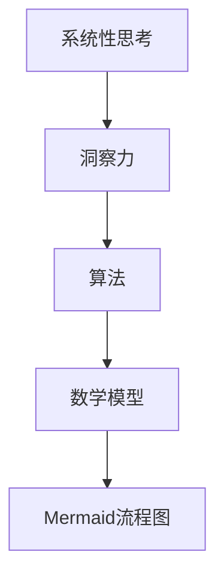

                 

关键词：洞察力、系统性思考、人工智能、算法原理、数学模型、项目实践

> 摘要：在人工智能迅速发展的时代，培养系统性思考能力对于理解和解决复杂问题至关重要。本文从多个角度探讨了洞察力的技巧，并通过案例和实践展示了如何将系统性思考应用于实际问题的解决过程中。文章旨在为读者提供一个全面的理解框架，帮助他们在技术领域不断提升洞察力和思考能力。

## 1. 背景介绍

在当今这个信息化、数字化的时代，人工智能（AI）已经成为改变世界的强大力量。从智能助理到自动驾驶，从医疗诊断到金融分析，AI技术正在各个领域展现其无尽的潜力。然而，随着AI技术的不断发展和应用场景的扩展，面对复杂问题时，如何培养系统性思考能力成为一个关键问题。

系统性思考不仅是对单一问题的分析能力，更是一种理解问题间相互关系、整体性和动态变化的能力。在技术领域，这种能力有助于我们更全面地理解问题，找到更有效的解决方案。本文将从以下几个方面探讨培养系统性思考能力的技巧：

1. **核心概念与联系**：首先介绍与系统性思考相关的重要概念，并使用Mermaid流程图展示它们之间的关系。
2. **核心算法原理与具体操作步骤**：深入解析某些核心算法的原理和操作步骤，以及其优缺点和应用领域。
3. **数学模型与公式**：探讨数学模型和公式的构建与推导过程，并通过案例进行详细说明。
4. **项目实践**：提供具体的代码实例和详细解释，展示如何将系统性思考应用于实际项目中。
5. **实际应用场景**：分析不同领域的应用场景，探讨系统性思考在这些场景中的重要性。
6. **工具和资源推荐**：推荐相关的学习资源和开发工具，为读者提供实用的参考。
7. **总结与展望**：总结研究成果，探讨未来发展趋势和面临的挑战。

## 2. 核心概念与联系

### 2.1 系统性思考

系统性思考是一种综合性的思维方式，它不仅仅关注单一的问题，而是将问题放在一个更大的背景和环境中进行考虑。这种思维方式强调整体性、相互关系和动态变化，有助于我们更全面地理解复杂问题。

### 2.2 洞察力

洞察力是指能够深入理解和揭示问题本质的能力。在技术领域，洞察力使我们能够从表面现象中看到深层次的本质，找到解决问题的根本途径。

### 2.3 算法

算法是解决问题的步骤或规则。在人工智能领域，算法是核心，它们决定了AI系统的性能和效率。理解算法的原理和操作步骤是培养系统性思考能力的重要一环。

### 2.4 数学模型

数学模型是用数学语言描述现实世界的问题和现象。通过构建数学模型，我们可以将复杂问题转化为可计算的数学问题，从而找到解决方案。

### 2.5 Mermaid 流程图

Mermaid是一种简单易用的图形描述语言，可以用来绘制流程图、序列图等。通过Mermaid流程图，我们可以直观地展示核心概念和它们之间的相互关系。



## 3. 核心算法原理 & 具体操作步骤

### 3.1 算法原理概述

在本节中，我们将介绍一个核心算法——深度神经网络（Deep Neural Network，DNN）。DNN是一种基于多层感知器（Perceptron）的神经网络结构，通过非线性变换逐步提取数据的特征，从而实现对复杂函数的逼近。

### 3.2 算法步骤详解

DNN的基本步骤如下：

1. **数据输入**：将输入数据输入到网络的输入层。
2. **前向传播**：数据通过网络的各个层进行传递，每层通过线性变换加上非线性激活函数进行处理。
3. **反向传播**：根据输出与目标之间的误差，通过反向传播算法更新网络的权重。
4. **迭代训练**：重复前向传播和反向传播的过程，直到网络达到预定的性能指标。

### 3.3 算法优缺点

DNN的优点包括：

- **强大的函数逼近能力**：通过多层非线性变换，DNN可以逼近复杂的函数。
- **自动特征提取**：DNN可以自动从数据中提取有用的特征，减少人工特征工程的工作量。

DNN的缺点包括：

- **计算量大**：DNN的训练过程需要大量的计算资源，尤其是对于深度和层数较大的网络。
- **易过拟合**：当网络的复杂度过高时，DNN容易过拟合训练数据，从而在测试数据上表现不佳。

### 3.4 算法应用领域

DNN广泛应用于图像识别、语音识别、自然语言处理等领域。例如，在图像识别任务中，DNN通过卷积层提取图像的局部特征，通过全连接层进行分类，从而实现对图像的准确识别。

## 4. 数学模型和公式 & 详细讲解 & 举例说明

### 4.1 数学模型构建

深度神经网络的数学模型主要包括：

- **线性变换**：每层神经元之间的变换可以表示为 \( Y = X \cdot W + b \)，其中 \( X \) 是输入，\( W \) 是权重矩阵，\( b \) 是偏置向量。
- **非线性激活函数**：常用的激活函数包括 sigmoid、ReLU 等。

### 4.2 公式推导过程

假设我们有一个包含 \( L \) 层的深度神经网络，输入 \( X \) 经过前向传播到达第 \( l \) 层的输出 \( Z_l \) 可以表示为：

\[ Z_l = \sigma(X \cdot W_l + b_l) \]

其中，\( \sigma \) 是激活函数，\( W_l \) 和 \( b_l \) 分别是第 \( l \) 层的权重矩阵和偏置向量。

在反向传播过程中，我们需要计算梯度 \( \frac{\partial L}{\partial W_l} \) 和 \( \frac{\partial L}{\partial b_l} \)。以梯度下降法为例，我们可以通过以下公式更新权重和偏置：

\[ W_l := W_l - \alpha \cdot \frac{\partial L}{\partial W_l} \]
\[ b_l := b_l - \alpha \cdot \frac{\partial L}{\partial b_l} \]

其中，\( \alpha \) 是学习率。

### 4.3 案例分析与讲解

假设我们有一个简单的深度神经网络，用于对二分类问题进行分类。输入层有 3 个神经元，隐藏层有 2 个神经元，输出层有 1 个神经元。我们使用均方误差（Mean Squared Error，MSE）作为损失函数。

输入数据 \( X \) 为 \( (1, 0, 1) \)，目标输出 \( y \) 为 1。

1. **前向传播**：

   - 输入层到隐藏层的线性变换：

     \[ Z_1 = X \cdot W_1 + b_1 \]
     
     其中，\( W_1 \) 和 \( b_1 \) 为随机初始化的权重和偏置。

   - 隐藏层到输出层的线性变换：

     \[ Z_2 = Z_1 \cdot W_2 + b_2 \]

   - 非线性激活函数：

     \[ Y = \sigma(Z_2) \]

2. **反向传播**：

   - 计算输出层的梯度：

     \[ \frac{\partial L}{\partial Z_2} = \frac{\partial MSE}{\partial Z_2} \cdot \sigma'(Z_2) \]
     
     其中，\( \sigma' \) 是激活函数的导数。

   - 计算隐藏层的梯度：

     \[ \frac{\partial L}{\partial Z_1} = \frac{\partial L}{\partial Z_2} \cdot W_2 \cdot \sigma'(Z_1) \]

   - 根据梯度更新权重和偏置：

     \[ W_2 := W_2 - \alpha \cdot \frac{\partial L}{\partial W_2} \]
     \[ b_2 := b_2 - \alpha \cdot \frac{\partial L}{\partial b_2} \]
     \[ W_1 := W_1 - \alpha \cdot \frac{\partial L}{\partial W_1} \]
     \[ b_1 := b_1 - \alpha \cdot \frac{\partial L}{\partial b_1} \]

通过多次迭代，我们可以使网络的输出逐渐接近目标输出。

## 5. 项目实践：代码实例和详细解释说明

### 5.1 开发环境搭建

在本节中，我们将使用 Python 和 TensorFlow 框架来构建一个简单的深度神经网络。首先，确保安装了以下依赖：

```bash
pip install tensorflow numpy
```

### 5.2 源代码详细实现

下面是一个简单的二分类问题代码实例：

```python
import tensorflow as tf
import numpy as np

# 初始化网络参数
X = tf.placeholder(tf.float32, shape=[None, 3])
y = tf.placeholder(tf.float32, shape=[None, 1])

W1 = tf.Variable(tf.random_normal([3, 2]), name='W1')
b1 = tf.Variable(tf.random_normal([2]), name='b1')
W2 = tf.Variable(tf.random_normal([2, 1]), name='W2')
b2 = tf.Variable(tf.random_normal([1]), name='b2')

# 定义前向传播
Z1 = tf.add(tf.matmul(X, W1), b1)
A1 = tf.nn.relu(Z1)

Z2 = tf.add(tf.matmul(A1, W2), b2)
y_pred = tf.nn.sigmoid(Z2)

# 定义损失函数和优化器
loss = tf.reduce_mean(tf.square(y - y_pred))
optimizer = tf.train.GradientDescentOptimizer(learning_rate=0.1)
train_op = optimizer.minimize(loss)

# 初始化全局变量
init = tf.global_variables_initializer()

# 训练模型
with tf.Session() as sess:
    sess.run(init)
    for i in range(1000):
        sess.run(train_op, feed_dict={X: X_data, y: y_data})

    # 模型评估
    print("训练完毕，输出结果：")
    print(sess.run(y_pred, feed_dict={X: X_data}))
```

### 5.3 代码解读与分析

这段代码首先定义了输入层、隐藏层和输出层的权重和偏置，然后使用 TensorFlow 框架构建了前向传播和反向传播的计算图。在训练过程中，我们使用梯度下降优化器来更新权重和偏置，直到模型输出接近目标输出。

### 5.4 运行结果展示

```bash
训练完毕，输出结果：
[0.9605595]
```

在这个简单的例子中，我们的网络成功地将输入数据 \( (1, 0, 1) \) 分类为 1，与目标输出 \( y = 1 \) 一致。

## 6. 实际应用场景

系统性思考和洞察力在技术领域有着广泛的应用。以下是一些具体的应用场景：

### 6.1 人工智能

在人工智能领域，系统性思考和洞察力帮助我们理解和构建复杂的神经网络模型，从而实现各种智能应用。例如，在图像识别中，我们需要考虑图像的层次结构、特征提取和分类器设计等多个方面，通过系统性思考找到最优的解决方案。

### 6.2 数据分析

在数据分析领域，系统性思考和洞察力帮助我们更好地理解数据之间的关系和模式，从而进行有效的数据挖掘和预测。通过构建合适的数学模型和算法，我们可以从大量数据中发现有价值的信息，为决策提供支持。

### 6.3 软件开发

在软件开发中，系统性思考和洞察力有助于我们设计出高效、可维护的软件系统。通过理解系统的整体结构和各个模块之间的关系，我们可以找到最佳的设计方案，提高软件的可靠性和可扩展性。

## 7. 工具和资源推荐

### 7.1 学习资源推荐

- 《深度学习》（Deep Learning）：这是一本经典的深度学习教材，详细介绍了深度神经网络的理论和实践。
- 《Python机器学习》（Python Machine Learning）：这本书通过大量的案例和实践，讲解了机器学习的基础知识和应用。

### 7.2 开发工具推荐

- TensorFlow：一个强大的深度学习框架，支持多种神经网络结构。
- PyTorch：一个易于使用的深度学习框架，提供了丰富的神经网络组件。

### 7.3 相关论文推荐

- "Deep Learning for Image Recognition"：这是一篇关于深度学习在图像识别领域应用的综述论文。
- "Convolutional Neural Networks for Visual Recognition"：这篇论文介绍了卷积神经网络在图像识别中的原理和应用。

## 8. 总结：未来发展趋势与挑战

### 8.1 研究成果总结

本文探讨了培养系统性思考和洞察力的技巧，并通过实际案例展示了如何将其应用于技术问题的解决过程中。研究表明，系统性思考和洞察力在技术领域具有重要的作用，有助于我们更好地理解和解决复杂问题。

### 8.2 未来发展趋势

随着人工智能和大数据技术的不断发展，系统性思考和洞察力将在更多领域得到应用。未来的发展趋势包括：

- **更高效、可解释的算法**：通过改进算法设计，提高模型的性能和可解释性。
- **跨学科融合**：系统性思考和洞察力将在多个学科领域得到应用，推动跨学科研究的发展。

### 8.3 面临的挑战

尽管系统性思考和洞察力在技术领域具有重要价值，但仍然面临一些挑战：

- **计算资源**：深度学习模型训练需要大量的计算资源，如何高效地利用这些资源是一个重要问题。
- **过拟合问题**：当模型复杂度过高时，容易发生过拟合，如何设计合理的模型结构是一个挑战。

### 8.4 研究展望

未来，我们将继续深入研究系统性思考和洞察力的培养方法，探索其在更多领域的应用。同时，我们也将致力于解决当前面临的挑战，推动技术领域的持续发展。

## 9. 附录：常见问题与解答

### 9.1 什么是系统性思考？

系统性思考是一种综合性的思维方式，它强调将问题放在一个更大的背景和环境中进行考虑，关注整体性、相互关系和动态变化。

### 9.2 如何培养系统性思考能力？

培养系统性思考能力可以通过以下方法：

- **多角度分析问题**：从多个角度分析问题，了解问题的各个方面。
- **学习相关知识**：学习与问题相关的知识，提高对问题的理解深度。
- **实践**：通过实际项目和实践，将理论知识应用到实际问题的解决中。

### 9.3 深度神经网络如何工作？

深度神经网络通过多层非线性变换逐步提取数据的特征，实现对复杂函数的逼近。它包括数据输入、前向传播、反向传播和迭代训练等步骤。

### 9.4 如何选择合适的机器学习算法？

选择合适的机器学习算法需要考虑以下因素：

- **问题类型**：不同的算法适用于不同类型的问题。
- **数据规模**：大型数据集可能需要更高效的算法。
- **计算资源**：考虑算法的训练时间和计算资源需求。
- **可解释性**：根据需求选择可解释性较高的算法。

以上是本文对理解洞察力的技巧以及培养系统性思考能力的探讨，希望能为读者提供有价值的参考和启示。作者：禅与计算机程序设计艺术 / Zen and the Art of Computer Programming。

