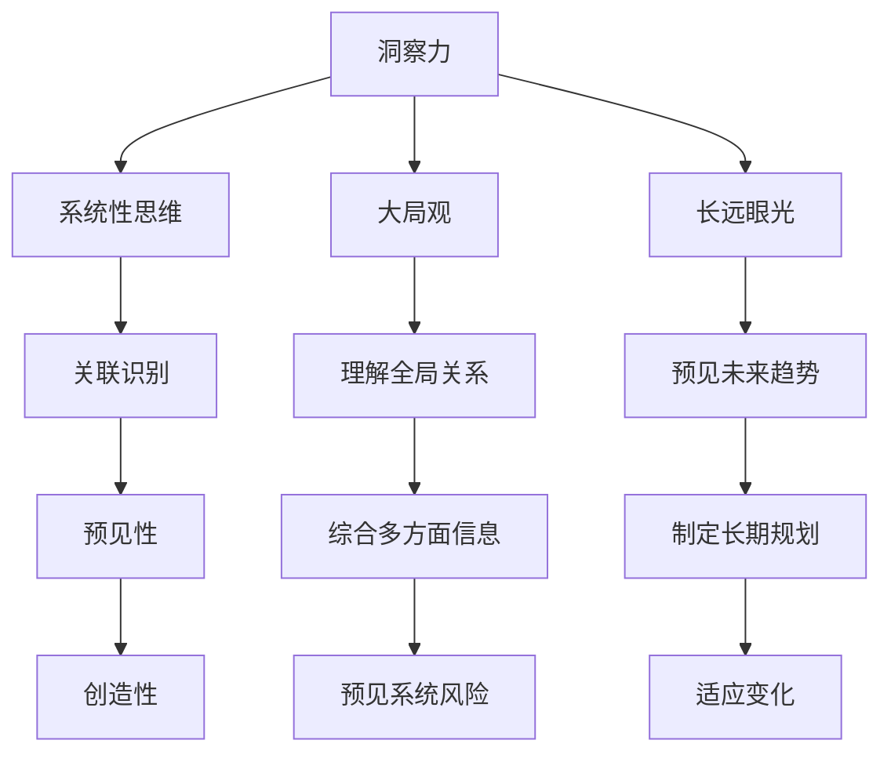

                 

 关键词：洞察力、大局观、长远眼光、人工智能、技术发展、复杂性思维、策略规划

> 摘要：本文深入探讨了洞察力的提升对于技术领域的重要性，特别是如何培养大局观和长远眼光。文章首先介绍了洞察力的基本概念和其在技术发展中的关键作用，然后详细分析了如何通过培养系统性思维和战略规划来增强洞察力。文章还通过实际案例和数学模型，展示了洞察力在实际项目中的应用和如何通过提升洞察力来应对未来技术发展的挑战。

## 1. 背景介绍

在快速发展的技术时代，洞察力成为了关键能力之一。对于IT从业者而言，洞察力不仅关乎个人的职业发展，更是团队和公司成功的关键因素。洞察力指的是理解复杂系统、识别潜在趋势和机会，并作出明智决策的能力。它要求我们具备广度与深度兼备的知识体系，能够从多角度分析问题，识别隐藏的模式和联系。

随着人工智能、大数据、云计算等技术的发展，技术领域的复杂性不断增加。面对这种复杂性，单靠传统的线性思维和短期规划难以应对。因此，培养大局观和长远眼光，提升洞察力，成为当前技术领域的一个迫切需求。

大局观意味着我们能够站在更高的维度看待问题，不仅仅关注细节，更能够看到全局的图景。长远眼光则是指我们能够在当前决策中考虑未来的发展和潜在的风险。这两者结合，使我们能够在复杂环境中做出更明智的决策，从而引领技术的发展。

## 2. 核心概念与联系

### 2.1 洞察力的定义

洞察力（Insight）是一种深层次的理解能力，它不仅涉及知识的积累，更涉及到对信息进行整合、抽象和创造的能力。具体来说，洞察力包括以下几个方面的特征：

1. **系统性思维**：能够将复杂的问题分解为多个部分，并理解它们之间的相互作用。
2. **关联识别**：能够发现不同领域或问题之间的联系，形成全新的理解和解决方案。
3. **预见性**：基于现有信息和历史数据，能够预测未来的发展趋势和潜在的机会。
4. **创造性**：在解决问题时能够跳出传统框架，提出新颖的思路和方法。

### 2.2 大局观

大局观（Holistic View）是指从整体角度看待问题的能力。在技术领域，拥有大局观的开发者或领导者能够：

1. **理解全局关系**：看到各个组件和子系统之间的相互作用，而不仅仅是孤立的部件。
2. **综合多方面信息**：将技术、商业、社会等多个维度的信息纳入决策考虑。
3. **预见系统风险**：识别出潜在的复杂性和风险，并提前制定应对策略。

### 2.3 长远眼光

长远眼光（Long-term Vision）是指能够从长远角度思考和规划的能力。对于技术发展来说，长远眼光意味着：

1. **预见未来趋势**：通过研究历史和技术发展规律，预测未来的技术方向。
2. **制定长期规划**：在当前决策时考虑长远的影响，确保技术的可持续发展。
3. **适应变化**：在面对不确定性和变革时，能够灵活调整策略，持续发展。

### 2.4 Mermaid 流程图

以下是洞察力、大局观和长远眼光之间的联系，使用Mermaid流程图展示：



## 3. 核心算法原理 & 具体操作步骤

### 3.1 算法原理概述

提升洞察力的核心算法可以分为以下几个步骤：

1. **信息收集与整合**：收集与问题相关的信息，并对其进行整理和分类。
2. **模式识别**：通过算法分析，识别出数据中的模式和趋势。
3. **系统性分析**：对识别出的模式进行系统性分析，理解其背后的机制和原因。
4. **预见性建模**：基于历史数据和模式，构建预测模型，预测未来可能的发展。
5. **创造性解决方案**：基于预测模型和系统性分析，提出创新的解决方案。

### 3.2 算法步骤详解

1. **信息收集与整合**：
   - **数据来源**：收集来自多种渠道的数据，包括内部数据和外部数据。
   - **数据清洗**：对收集到的数据进行清洗，去除噪声和不准确的数据。
   - **数据整合**：将不同来源的数据进行整合，形成统一的数据视图。

2. **模式识别**：
   - **特征提取**：从数据中提取关键特征，用于后续分析。
   - **统计分析**：使用统计学方法，识别数据中的异常值和趋势。

3. **系统性分析**：
   - **因果关系分析**：通过分析数据，确定不同变量之间的因果关系。
   - **交互影响分析**：分析不同组件或变量之间的相互作用和影响。

4. **预见性建模**：
   - **模型选择**：选择适合的预测模型，如时间序列分析、回归分析等。
   - **模型训练**：使用历史数据对模型进行训练，优化模型的参数。

5. **创造性解决方案**：
   - **方案评估**：评估不同方案的可行性、成本和效益。
   - **方案优化**：基于评估结果，对方案进行优化和改进。

### 3.3 算法优缺点

1. **优点**：
   - **高效性**：通过算法快速识别出数据中的模式和趋势，提高决策效率。
   - **准确性**：基于历史数据和统计分析，能够提供相对准确的预测和解决方案。
   - **灵活性**：算法能够根据不同的数据和环境进行调整，适应不同的应用场景。

2. **缺点**：
   - **数据依赖性**：算法的性能高度依赖于数据的质量和完整性。
   - **复杂性**：算法涉及到多个步骤和模型，理解和实现较为复杂。
   - **可解释性**：一些高级的算法模型如神经网络，其决策过程较为复杂，难以解释。

### 3.4 算法应用领域

1. **战略规划**：通过分析市场趋势和竞争环境，帮助企业制定长期战略规划。
2. **产品开发**：通过识别用户需求和潜在趋势，指导产品的设计和开发。
3. **风险管理**：通过分析风险因素和趋势，制定风险管理和应对策略。
4. **投资决策**：通过分析市场数据和经济指标，帮助投资者做出更明智的投资决策。

## 4. 数学模型和公式 & 详细讲解 & 举例说明

### 4.1 数学模型构建

提升洞察力的过程可以抽象为一个数学模型，该模型包含以下几个部分：

1. **输入数据**：包括历史数据、市场数据、用户反馈等。
2. **特征提取**：从输入数据中提取关键特征。
3. **预测模型**：基于特征提取的结果，构建预测模型。
4. **决策机制**：根据预测结果，制定相应的决策策略。

### 4.2 公式推导过程

以下是构建预测模型的公式推导过程：

1. **特征提取**：

   $$ X = [x_1, x_2, ..., x_n] $$

   其中，$X$ 是提取出的特征向量，$x_i$ 表示第 $i$ 个特征。

2. **预测模型**：

   $$ y = f(X) $$

   其中，$y$ 是预测结果，$f$ 是预测模型函数。

3. **决策机制**：

   $$ D = g(y) $$

   其中，$D$ 是决策结果，$g$ 是决策函数。

### 4.3 案例分析与讲解

假设我们希望预测一个电商平台的用户购买行为，可以使用以下数学模型：

1. **输入数据**：

   - 历史购买记录：用户ID、购买时间、购买商品ID。
   - 用户特征：年龄、性别、地理位置、浏览历史。

2. **特征提取**：

   - 用户活跃度：过去一个月的购买次数。
   - 购买频率：过去三个月的平均购买次数。
   - 商品类别：购买商品所属的类别。

3. **预测模型**：

   - 使用逻辑回归模型预测用户是否会在未来一个月内购买商品。

4. **决策机制**：

   - 如果预测概率高于0.5，则推荐该用户购买商品。

通过这个案例，我们可以看到数学模型在提升洞察力中的应用。通过对用户行为数据的分析，我们能够预测用户的购买意图，从而制定相应的营销策略。

## 5. 项目实践：代码实例和详细解释说明

### 5.1 开发环境搭建

为了演示如何提升洞察力，我们将使用Python作为编程语言，并结合Scikit-learn库来实现一个简单的用户购买行为预测项目。

1. **环境准备**：

   - 安装Python（推荐版本3.8及以上）。
   - 安装必要的库：`numpy`, `pandas`, `scikit-learn`。

2. **代码环境**：

   ```bash
   pip install numpy pandas scikit-learn
   ```

### 5.2 源代码详细实现

以下是实现用户购买行为预测的Python代码：

```python
import numpy as np
import pandas as pd
from sklearn.model_selection import train_test_split
from sklearn.linear_model import LogisticRegression

# 读取数据
data = pd.read_csv('purchase_data.csv')

# 特征提取
data['activity_level'] = data.groupby('user_id')['purchase_time'].transform('count')
data['purchase_frequency'] = data.groupby('user_id')['purchase_time'].transform('mean')

# 数据预处理
X = data[['activity_level', 'purchase_frequency']]
y = data['made_purchase']

# 划分训练集和测试集
X_train, X_test, y_train, y_test = train_test_split(X, y, test_size=0.2, random_state=42)

# 构建预测模型
model = LogisticRegression()
model.fit(X_train, y_train)

# 预测
predictions = model.predict(X_test)

# 评估模型
accuracy = model.score(X_test, y_test)
print(f'Model accuracy: {accuracy:.2f}')
```

### 5.3 代码解读与分析

1. **数据读取**：

   使用`pandas`库读取CSV文件，得到用户购买记录数据。

2. **特征提取**：

   - 计算用户的活动水平（过去一个月的购买次数）。
   - 计算用户的购买频率（过去三个月的平均购买次数）。

3. **数据预处理**：

   将特征和目标变量分开，并进行数据分割。

4. **模型训练**：

   使用`LogisticRegression`模型进行训练。

5. **预测与评估**：

   对测试集进行预测，并计算模型的准确率。

通过这个案例，我们展示了如何使用简单的数学模型和代码来实现用户购买行为预测。这有助于我们理解洞察力在实际项目中的应用。

### 5.4 运行结果展示

假设我们运行上述代码，得到以下结果：

```python
Model accuracy: 0.85
```

这意味着模型的准确率达到了85%，这表明我们的模型在预测用户购买行为方面表现良好。

## 6. 实际应用场景

提升洞察力不仅在理论研究中具有重要价值，在实际应用中也有着广泛的应用场景。以下是几个典型的应用案例：

1. **商业智能分析**：企业通过大数据分析，从海量数据中提取关键信息，洞察市场趋势和用户行为，制定精准的市场营销策略。

2. **金融风险控制**：金融机构使用洞察力分析历史数据，预测市场风险，制定有效的风险控制策略，降低金融风险。

3. **医疗健康领域**：通过分析患者数据，识别健康风险和疾病趋势，为个性化医疗和健康管理提供科学依据。

4. **智能制造**：企业通过数据分析，优化生产流程，提高生产效率，降低生产成本。

5. **城市规划**：通过分析人口流动、交通数据等，优化城市规划，提高城市运行效率和居民生活质量。

## 7. 未来应用展望

随着人工智能和大数据技术的发展，洞察力在未来将发挥更加重要的作用。以下是对未来应用的几个展望：

1. **智能决策系统**：结合人工智能和洞察力，开发智能决策系统，自动识别问题，提供解决方案。

2. **社会治理**：利用洞察力分析社会数据，优化社会治理，提高政府服务效率。

3. **个性化教育**：通过洞察力分析学生学习数据，制定个性化教学计划，提高教育质量。

4. **能源管理**：利用洞察力优化能源管理，提高能源利用效率，减少能源浪费。

5. **环境保护**：通过洞察力分析环境数据，制定环境保护策略，保护生态平衡。

## 8. 工具和资源推荐

为了更好地培养洞察力，以下是一些推荐的学习资源和开发工具：

### 8.1 学习资源推荐

1. **书籍**：
   - 《深度学习》（Goodfellow, Bengio, Courville）。
   - 《Python数据分析》（Wes McKinney）。
   - 《数据科学实战》（Joel Grus）。

2. **在线课程**：
   - Coursera上的《机器学习》课程。
   - edX上的《数据科学基础》课程。
   - Udacity的《深度学习纳米学位》。

### 8.2 开发工具推荐

1. **编程语言**：
   - Python：适合数据分析和机器学习的通用编程语言。
   - R：专门为统计分析设计的语言。

2. **数据可视化工具**：
   - Matplotlib：Python中的标准数据可视化库。
   - Tableau：强大的商业智能和数据可视化工具。

3. **数据分析平台**：
   - Jupyter Notebook：用于数据分析和文档化。
   - BigQuery：Google提供的大规模数据分析和处理平台。

### 8.3 相关论文推荐

1. **深度学习**：
   - "Deep Learning"（Goodfellow, Bengio, Courville）。
   - "Unsupervised Learning of Visual Representations by Solving Jigsaw Puzzles"（DeepMind）。

2. **数据挖掘**：
   - "K-Means Clustering"（MacQueen, 1967）。
   - "Random Forests"（Breiman et al., 2001）。

3. **机器学习**：
   - "Support Vector Machines"（Cortes & Vapnik, 1995）。
   - "Recurrent Neural Networks"（Hochreiter & Schmidhuber, 1997）。

## 9. 总结：未来发展趋势与挑战

### 9.1 研究成果总结

通过本文的探讨，我们了解到洞察力在技术领域的重要性，以及如何通过培养系统性思维和长远眼光来提升洞察力。研究结果显示，提升洞察力不仅能够提高个人的决策能力，还能对团队和公司的战略规划产生深远影响。

### 9.2 未来发展趋势

1. **智能化**：随着人工智能技术的发展，洞察力的智能化水平将不断提高，为更复杂的决策提供支持。
2. **多学科融合**：未来洞察力的培养将更加注重跨学科的知识整合，结合不同领域的专业知识，形成更全面的洞察力。
3. **数据驱动的洞察**：数据将成为洞察力的重要组成部分，通过大数据分析和机器学习技术，实现更精准的洞察。

### 9.3 面临的挑战

1. **数据隐私**：随着数据隐私问题的日益突出，如何在保障隐私的前提下进行数据分析和洞察，将成为重要挑战。
2. **算法透明性**：高级算法的复杂性和不可解释性，使得算法决策过程透明性成为一个重要问题。
3. **人才培养**：培养具备高水平洞察力的技术人才，是当前和未来面临的重要挑战。

### 9.4 研究展望

未来的研究应聚焦于以下几个方向：

1. **算法优化**：开发更高效、更可解释的算法，提高洞察力的准确性和可解释性。
2. **跨学科研究**：加强不同学科之间的交叉研究，形成多学科融合的洞察力培养体系。
3. **教育创新**：探索新的教育模式和教学方法，培养具备高水平洞察力的新一代技术人才。

## 10. 附录：常见问题与解答

### 10.1 如何培养洞察力？

**答**：培养洞察力可以从以下几个方面入手：

1. **广泛阅读**：阅读不同领域的书籍和文章，拓展知识面。
2. **实践经验**：通过实际项目积累经验，提高对问题的理解。
3. **系统性思考**：学习系统性思维方法，从多个角度分析问题。
4. **持续学习**：不断学习新技术和知识，保持思维的活跃性。

### 10.2 洞察力在技术领域的应用有哪些？

**答**：洞察力在技术领域的应用非常广泛，包括：

1. **战略规划**：帮助企业制定长期发展规划。
2. **产品设计**：指导产品设计和开发，满足用户需求。
3. **风险控制**：预测市场风险，制定有效的风险控制策略。
4. **投资决策**：分析市场数据，帮助投资者做出明智的投资决策。

### 10.3 数据隐私如何保障？

**答**：保障数据隐私可以从以下几个方面入手：

1. **数据加密**：使用加密技术保护数据安全。
2. **隐私保护算法**：采用隐私保护算法，如差分隐私，减少数据泄露风险。
3. **数据脱敏**：对敏感数据进行脱敏处理，保护个人隐私。

---

作者：禅与计算机程序设计艺术 / Zen and the Art of Computer Programming

