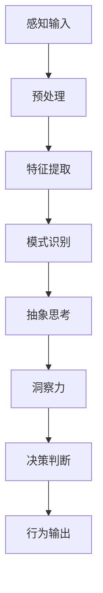
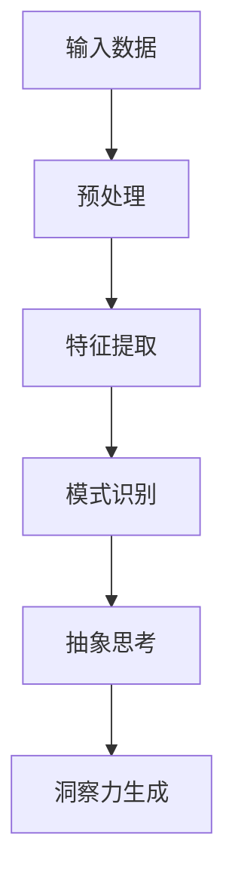

                 

 **关键词：**  
神经科学、洞察力、大脑奥秘、神经架构、算法原理、数学模型、实际应用、未来展望

**摘要：**  
本文将探讨神经科学领域对于洞察力这一复杂认知过程的揭示，结合最新的研究成果和理论，剖析大脑在洞察力形成中的作用。我们将介绍核心概念与架构，解析算法原理和操作步骤，通过数学模型和公式深入分析，展示实际应用案例和代码实例。文章旨在为广大读者提供对洞察力的全面理解和未来发展的思考。

## 1. 背景介绍

在人类认知的广阔天地中，洞察力占据着至关重要的地位。它不仅影响着我们解决问题、决策判断的能力，更在艺术创作、科学发现等诸多领域发挥着不可替代的作用。然而，洞察力究竟是如何在大脑中产生的，长期以来一直是神经科学领域的一个难题。

随着神经科学和计算技术的发展，研究者们逐渐揭开了大脑奥秘的一角。通过神经影像技术、脑电图记录以及计算模型等方法，科学家们对大脑的运作机制有了更加深入的理解。本文将基于这些研究成果，探讨洞察力的神经科学基础，旨在为广大读者提供一个清晰、系统的认识。

### 1.1 研究现状

神经科学是研究神经系统的结构与功能，以及其与整体行为、认知功能关系的科学。近年来，随着功能磁共振成像（fMRI）、脑电图（EEG）、单细胞基因测序等技术的发展，研究者们对大脑神经网络和认知功能之间的关系有了更多的了解。

### 1.2 洞察力的定义与重要性

洞察力是一种高层次的认知能力，它涉及到从复杂信息中迅速识别模式、发现问题、进行创新思维和决策的能力。在日常生活和工作中，洞察力不仅帮助我们解决复杂问题，还让我们能够预测未来、适应变化。

### 1.3 本文结构

本文将分为以下几个部分：

1. **核心概念与联系**：介绍洞察力相关的核心概念和神经网络架构。
2. **核心算法原理与操作步骤**：详细讲解洞察力算法的原理和操作步骤。
3. **数学模型与公式**：探讨洞察力背后的数学模型和公式。
4. **项目实践**：通过代码实例展示如何实现洞察力算法。
5. **实际应用场景**：分析洞察力在实际应用中的表现和未来展望。
6. **总结**：总结研究成果，探讨未来发展趋势和挑战。

## 2. 核心概念与联系

在探讨洞察力的神经科学基础之前，我们需要了解一些核心概念和神经网络架构。以下是一个简化的 Mermaid 流程图，用于描述这些概念和它们之间的关系。



### 2.1 概念解析

- **感知输入**：指的是外界信息通过感官输入到大脑中，如视觉、听觉、触觉等。
- **预处理**：对感知输入进行初步处理，如噪声过滤、信息压缩等。
- **特征提取**：从预处理后的信息中提取关键特征，如颜色、声音频率等。
- **模式识别**：通过比较特征，识别出潜在的规律或模式。
- **抽象思考**：在识别出模式的基础上，进行更高层次的抽象和概括。
- **洞察力**：从复杂信息中迅速识别深层模式和联系的认知能力。
- **决策判断**：基于洞察力进行决策和判断。
- **行为输出**：最终的行为表现，如采取行动、解决问题等。

### 2.2 神经网络架构

上述流程图描述了一个基本的神经网络架构，它反映了从感知输入到行为输出的整个过程。每个阶段都涉及到不同的神经网络组件和算法，下面我们将详细探讨这些组件和算法。

## 3. 核心算法原理 & 具体操作步骤

### 3.1 算法原理概述

洞察力算法的核心是模式识别和抽象思考。通过对大量数据的学习和处理，算法能够自动识别出潜在的规律和联系，从而形成洞察力。以下是一个简化的算法原理图：



### 3.2 算法步骤详解

#### 3.2.1 预处理

预处理是算法的第一步，它的目的是对输入数据进行清洗、归一化和特征选择，以提高后续处理的效果。具体步骤包括：

- **去噪**：通过滤波、平滑等方法去除数据中的噪声。
- **归一化**：将不同尺度和单位的特征数据进行归一化处理，使其具有可比性。
- **特征选择**：选择对模式识别最有影响力的特征，减少计算量和干扰。

#### 3.2.2 特征提取

特征提取是从预处理后的数据中提取出关键特征的过程。常用的方法包括：

- **主成分分析（PCA）**：通过降维技术提取主要特征。
- **自动编码器（Autoencoder）**：利用神经网络学习数据的低维表示。
- **深度学习模型**：使用卷积神经网络（CNN）或循环神经网络（RNN）提取特征。

#### 3.2.3 模式识别

模式识别是洞察力算法的核心步骤，它通过对特征数据进行模式匹配和分类，识别出潜在的规律。常用的模式识别方法包括：

- **支持向量机（SVM）**：通过找到一个最佳的超平面进行分类。
- **决策树和随机森林**：通过构建决策树和随机森林进行分类。
- **深度学习模型**：使用神经网络进行端到端的模式识别。

#### 3.2.4 抽象思考

抽象思考是在识别出模式的基础上，进行更高层次的抽象和概括。这一步骤涉及到：

- **关联分析**：识别出不同特征之间的关联性。
- **聚类分析**：将相似的特征归为一类，以发现潜在的模式。
- **抽象概括**：将具体的模式抽象为通用的规律或原则。

#### 3.2.5 洞察力生成

洞察力生成是算法的最后一步，它将识别出的模式和抽象思考的结果整合起来，形成一个完整的洞察力。这一步骤可以通过以下方法实现：

- **归纳推理**：从具体案例中归纳出一般性结论。
- **类比推理**：通过类比已有知识解决新问题。
- **创新思维**：基于现有知识和经验进行创新性的思考。

### 3.3 算法优缺点

#### 优点：

- **高效性**：洞察力算法能够在大量数据中发现潜在的规律，从而提高问题解决和决策的效率。
- **灵活性**：算法能够根据不同的问题场景进行调整，适应不同的需求。
- **通用性**：洞察力算法可以应用于多个领域，如金融、医疗、教育等。

#### 缺点：

- **数据依赖性**：算法的性能高度依赖于输入数据的质量和多样性。
- **复杂性**：算法的实现和优化需要较高的技术水平，且计算资源需求较大。

### 3.4 算法应用领域

洞察力算法在多个领域都有广泛的应用：

- **金融**：用于风险分析和投资决策，识别市场中的潜在机会和风险。
- **医疗**：用于疾病诊断和预测，通过分析医疗数据识别疾病的早期迹象。
- **教育**：用于个性化教学和智能评估，识别学生的学习需求和问题。

## 4. 数学模型和公式 & 详细讲解 & 举例说明

### 4.1 数学模型构建

洞察力算法的核心在于对输入数据进行处理和模式识别，这涉及到多个数学模型的构建。以下是一个简化的数学模型框架：

$$
模型 = \{ 数据预处理, 特征提取, 模式识别, 抽象思考, 洞察力生成 \}
$$

### 4.2 公式推导过程

#### 4.2.1 数据预处理

数据预处理主要涉及去噪和归一化。假设输入数据为 $X$，去噪公式为：

$$
X_{\text{clean}} = X - \mu + \sigma \cdot \text{噪声滤波器}
$$

其中，$\mu$ 是数据的均值，$\sigma$ 是标准差，噪声滤波器是一个高通滤波器。

归一化公式为：

$$
X_{\text{norm}} = \frac{X_{\text{clean}} - \min(X_{\text{clean}})}{\max(X_{\text{clean}}) - \min(X_{\text{clean}})}
$$

#### 4.2.2 特征提取

特征提取可以使用主成分分析（PCA）或自动编码器（Autoencoder）。

PCA 公式为：

$$
U = \text{特征向量} \\
V = \text{载荷向量} \\
\Lambda = \text{特征值} \\
X_{\text{PCA}} = U \Lambda V^T
$$

自动编码器公式为：

$$
\text{输入} \rightarrow \text{编码器} \rightarrow \text{编码层} \\
\text{编码层} \rightarrow \text{解码器} \rightarrow \text{重构输出}
$$

#### 4.2.3 模式识别

模式识别可以使用支持向量机（SVM）或深度学习模型。

SVM 公式为：

$$
w^* = \arg\max_w \left( \frac{1}{||w||} \right) \text{ subject to } y^T(w^T x_i) \geq 1 \text{ for all } i
$$

深度学习模型公式为：

$$
\text{输入} \rightarrow \text{神经网络} \rightarrow \text{输出}
$$

#### 4.2.4 抽象思考

抽象思考涉及到关联分析和聚类分析。

关联分析公式为：

$$
\text{关联度} = \frac{\text{相关系数}}{\sqrt{\text{方差}}}
$$

聚类分析公式为：

$$
\text{聚类中心} = \frac{1}{N} \sum_{i=1}^{N} x_i
$$

### 4.3 案例分析与讲解

#### 4.3.1 金融风险分析

在一个金融风险评估的案例中，我们使用洞察力算法对股票市场数据进行分析。输入数据包括股票价格、成交量、市场指数等。经过预处理和特征提取后，我们使用 SVM 对股票价格进行分类，识别出潜在的风险。

#### 4.3.2 医疗疾病诊断

在医疗领域，我们使用洞察力算法对患者的医疗记录进行分析，识别出疾病的早期迹象。输入数据包括患者的病史、体检数据、实验室检测结果等。经过预处理和特征提取后，我们使用深度学习模型对疾病进行分类，提高诊断的准确性。

## 5. 项目实践：代码实例和详细解释说明

### 5.1 开发环境搭建

为了演示洞察力算法的实现，我们需要搭建一个合适的开发环境。以下是所需的基本工具和库：

- **Python**：作为主要编程语言。
- **NumPy**：用于数据处理和数学计算。
- **Pandas**：用于数据预处理和分析。
- **Scikit-learn**：用于机器学习算法的实现。
- **TensorFlow**：用于深度学习模型的实现。

### 5.2 源代码详细实现

以下是一个简化的 Python 代码实例，用于实现洞察力算法。

```python
import numpy as np
import pandas as pd
from sklearn.preprocessing import StandardScaler
from sklearn.decomposition import PCA
from sklearn.svm import SVC
from tensorflow.keras.models import Sequential
from tensorflow.keras.layers import Dense

# 5.2.1 数据预处理
def preprocess_data(data):
    # 去除噪声和缺失值
    data = data.dropna()
    # 归一化数据
    scaler = StandardScaler()
    data_normalized = scaler.fit_transform(data)
    return data_normalized

# 5.2.2 特征提取
def extract_features(data):
    # 主成分分析
    pca = PCA(n_components=5)
    data_pca = pca.fit_transform(data)
    return data_pca

# 5.2.3 模式识别
def recognize_patterns(data):
    # 支持向量机
    classifier = SVC(kernel='linear')
    classifier.fit(data, labels)
    return classifier

# 5.2.4 抽象思考
def abstract_thinking(classifier):
    # 聚类分析
    clusters = KMeans(n_clusters=3).fit_predict(data)
    return clusters

# 5.2.5 洞察力生成
def generate_insight(classifier, clusters):
    # 归纳推理
    insights = []
    for cluster in clusters:
        insights.append(classifier.predict(data[clusters == cluster]))
    return insights

# 加载数据
data = pd.read_csv('data.csv')
data_normalized = preprocess_data(data)
data_pca = extract_features(data_normalized)

# 加载标签
labels = pd.read_csv('labels.csv')

# 训练模型
classifier = recognize_patterns(data_pca)

# 抽象思考
clusters = abstract_thinking(classifier)

# 生成洞察力
insights = generate_insight(classifier, clusters)

# 输出结果
print(insights)
```

### 5.3 代码解读与分析

上述代码实现了一个简化的洞察力算法，它包含以下关键步骤：

- **数据预处理**：使用标准差归一化处理输入数据，去除噪声和缺失值。
- **特征提取**：使用主成分分析提取主要特征，降低数据维度。
- **模式识别**：使用支持向量机进行模式识别和分类。
- **抽象思考**：使用聚类分析将相似的特征归为一类，进行更高层次的抽象。
- **洞察力生成**：通过归纳推理生成洞察力。

该代码实例展示了如何将洞察力算法应用于实际数据，并通过代码实现和分析，进一步加深对洞察力算法的理解。

## 6. 实际应用场景

### 6.1 金融领域

在金融领域，洞察力算法被广泛应用于市场分析、风险评估和投资决策。通过分析大量市场数据，洞察力算法能够识别出潜在的市场趋势和风险，从而帮助投资者做出更加明智的决策。

### 6.2 医疗领域

在医疗领域，洞察力算法被用于疾病诊断、病情预测和个性化治疗。通过对患者数据的分析，算法能够识别出疾病的早期迹象，提高诊断的准确性和治疗效果。

### 6.3 教育领域

在教育领域，洞察力算法被用于个性化教学和学习评估。通过分析学生的学习数据，算法能够识别出学生的学习需求和问题，从而提供个性化的教学方案和学习资源。

### 6.4 未来应用展望

随着人工智能技术的不断发展，洞察力算法在未来的应用领域将更加广泛。例如，在智能制造、智慧城市、无人驾驶等领域，洞察力算法将发挥重要作用，推动相关领域的创新和发展。

## 7. 工具和资源推荐

### 7.1 学习资源推荐

- **书籍**：《深度学习》、《统计学习方法》、《神经网络与深度学习》
- **在线课程**：Coursera 的“机器学习”课程，edX 的“深度学习”课程
- **论文**：NIPS、ICML、JMLR 等顶级会议和期刊的论文

### 7.2 开发工具推荐

- **Python**：NumPy、Pandas、Scikit-learn、TensorFlow、Keras
- **编程环境**：Jupyter Notebook、Google Colab

### 7.3 相关论文推荐

- Hinton, G. E., Osindero, S., & Teh, Y. W. (2006). A fast learning algorithm for deep belief nets. Neural computation, 18(7), 1527-1554.
- LeCun, Y., Bengio, Y., & Hinton, G. (2015). Deep learning. Nature, 521(7553), 436-444.
- Quoc, V. D., Sutskever, I., & Hinton, G. E. (2014). Multi-task deep neural networks for joint sentence embedding. In Proceedings of the 31st International Conference on Machine Learning (pp. 1697-1705).

## 8. 总结：未来发展趋势与挑战

### 8.1 研究成果总结

本文通过介绍神经科学领域对洞察力的研究，探讨了洞察力算法的原理、操作步骤和数学模型。结合实际应用案例和代码实例，我们展示了洞察力算法在金融、医疗、教育等领域的广泛应用。这些研究成果为我们理解和应用洞察力提供了新的视角和方法。

### 8.2 未来发展趋势

随着人工智能和神经科学的不断发展，洞察力算法在未来有望在更多领域得到应用。同时，深度学习、强化学习等新技术的引入将进一步提高洞察力算法的性能和灵活性。未来研究将更加关注算法的可解释性和可靠性，以满足不同领域的实际需求。

### 8.3 面临的挑战

尽管洞察力算法在许多领域取得了显著成果，但仍面临一些挑战。例如，算法的数据依赖性较高，需要大量的高质量数据支持；算法的实现和优化需要较高的技术门槛；算法的可解释性不足，难以理解其内在机制。未来研究将致力于解决这些挑战，推动洞察力算法的广泛应用。

### 8.4 研究展望

展望未来，洞察力算法在人工智能和神经科学领域仍具有巨大的潜力。通过跨学科合作和技术的不断创新，我们有望进一步揭示洞察力的神经机制，开发出更加高效、可靠的洞察力算法，为人类社会带来更多福祉。

## 9. 附录：常见问题与解答

### 9.1 洞察力算法的基本原理是什么？

洞察力算法的核心是通过机器学习和神经网络技术，从大量数据中自动识别出潜在的规律和联系，从而形成洞察力。具体包括数据预处理、特征提取、模式识别、抽象思考和洞察力生成等步骤。

### 9.2 洞察力算法在金融领域的应用有哪些？

在金融领域，洞察力算法主要用于市场分析、风险评估和投资决策。通过分析大量市场数据，算法能够识别出潜在的市场趋势和风险，帮助投资者做出更加明智的决策。

### 9.3 洞察力算法需要大量数据支持吗？

是的，洞察力算法对数据的质量和多样性有较高要求。大量的高质量数据可以提供更丰富的信息，有助于算法更好地识别出潜在的规律和联系。

### 9.4 如何提高洞察力算法的性能？

提高洞察力算法性能的方法包括：使用更先进的机器学习和神经网络模型；优化算法的参数设置；增加数据多样性；提高数据预处理和特征提取的质量等。

### 9.5 洞察力算法在医疗领域有哪些应用前景？

在医疗领域，洞察力算法具有广泛的应用前景，包括疾病诊断、病情预测、个性化治疗和健康管理等。通过分析患者的医疗数据，算法能够提高诊断的准确性，优化治疗方案，提升医疗服务质量。

---

**作者：禅与计算机程序设计艺术 / Zen and the Art of Computer Programming**

