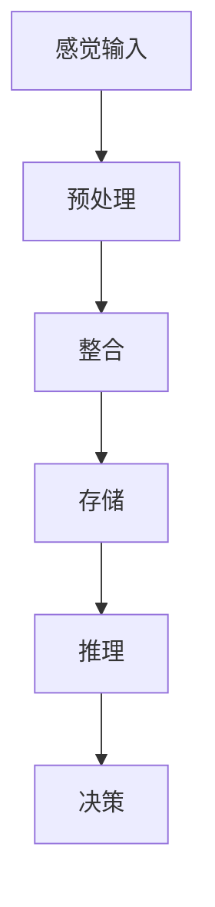

                 

关键词：洞察力，大脑处理信息，认知科学，神经生物学，信息处理模型，人工智能

> 摘要：本文旨在探讨人类大脑如何处理信息，从而产生洞察力。通过对认知科学和神经生物学的研究，揭示大脑信息处理的核心机制。本文还将介绍几种基于这些机制的人工智能模型，以期为未来的技术发展提供启示。

## 1. 背景介绍

在信息爆炸的时代，洞察力成为了一种稀缺且宝贵的技能。洞察力是指能够深刻理解问题、发现事物本质和内在联系的能力。它不仅在科学研究、技术创新、商业决策等领域具有重要价值，更是个人成长和发展的关键因素。

然而，关于洞察力的产生机制，长期以来并未有明确的科学解释。传统的心理学理论主要关注意识和思维过程，而忽视了大脑内部复杂的生物化学活动。近年来，随着认知科学和神经生物学的不断发展，人们开始从神经生物学角度探讨洞察力的产生机制。

本文将从认知科学和神经生物学的角度，探讨大脑如何处理信息，进而产生洞察力。首先，我们将介绍大脑信息处理的基本原理，然后讨论几种典型的人工智能模型，最后对未来的发展方向和挑战进行展望。

## 2. 核心概念与联系

### 2.1 大脑信息处理的基本原理

大脑是人体最复杂的器官，负责处理来自外界的信息，并生成相应的行为和意识。大脑信息处理的基本原理可以概括为以下几个阶段：

1. **感觉输入**：外界信息通过感官器官（如眼睛、耳朵、鼻子、皮肤等）传递给大脑。

2. **预处理**：大脑对感觉输入进行初步加工，提取关键特征，如形状、颜色、声音等。

3. **整合**：大脑将预处理后的信息与其他感官信息进行整合，形成对现实世界的整体感知。

4. **存储**：大脑将处理后的信息存储在记忆系统中，以便日后调用。

5. **推理**：大脑利用记忆中的信息进行推理，产生新的想法和认识。

6. **决策**：大脑根据推理结果做出行为决策。

在这个过程中，大脑利用了复杂的神经网络结构，通过神经元的相互作用来实现信息处理。神经元是大脑的基本单元，负责接收、传递和处理信息。神经元之间通过突触连接，形成了庞大的神经网络。

### 2.2 Mermaid 流程图

以下是一个简化的 Mermaid 流程图，展示了大脑信息处理的基本流程：



### 2.3 大脑信息处理的核心机制

大脑信息处理的核心机制主要包括以下几个方面：

1. **神经元活动**：神经元通过电信号进行信息传递。当一个神经元受到足够强度的刺激时，它会产生一个电信号，传递给下一个神经元。

2. **突触传递**：神经元之间的连接称为突触。突触通过化学递质（如多巴胺、去甲肾上腺素等）传递信号，从而实现信息传递。

3. **神经网络**：神经网络由大量神经元和突触组成，通过协同工作实现复杂的信息处理任务。

4. **神经元之间的交互**：神经元之间的交互包括同步和异步两种方式。同步交互是指多个神经元同时传递信号，而异步交互是指神经元在不同的时间点传递信号。

5. **神经可塑性**：大脑具有神经可塑性，即神经元和突触的连接和活动方式可以随着环境和经验的改变而改变。这种可塑性是大脑学习和记忆能力的基础。

## 3. 核心算法原理 & 具体操作步骤

### 3.1 算法原理概述

大脑信息处理的核心算法可以看作是一个复杂的神经网络。神经网络由大量的神经元和突触组成，通过学习输入数据的特征，实现从输入到输出的映射。以下是神经网络的基本原理和操作步骤：

1. **初始化**：随机初始化神经网络的权重和偏置。

2. **前向传播**：将输入数据传递给神经网络，通过加权求和和激活函数，得到输出结果。

3. **反向传播**：计算输出结果与实际结果之间的误差，并通过反向传播算法更新神经网络的权重和偏置。

4. **迭代优化**：重复前向传播和反向传播过程，直到达到预设的目标或误差最小。

### 3.2 算法步骤详解

1. **初始化**

   ```mermaid
   flowchart TD
       A[初始化权重和偏置]
   ```

2. **前向传播**

   ```mermaid
   flowchart TD
       A[输入数据] --> B[加权求和]
       B --> C[激活函数]
       C --> D[输出结果]
   ```

3. **反向传播**

   ```mermaid
   flowchart TD
       A[计算误差] --> B[反向传播]
       B --> C[更新权重和偏置]
   ```

4. **迭代优化**

   ```mermaid
   flowchart TD
       A[前向传播]
       A --> B[反向传播]
       B --> C[迭代优化]
       C --> A[重复]
   ```

### 3.3 算法优缺点

1. **优点**

   - **自适应性强**：神经网络可以根据输入数据的特征自适应调整权重和偏置，从而实现复杂的非线性映射。
   - **泛化能力强**：神经网络可以处理大规模的数据，并在新的数据上取得良好的性能。
   - **灵活性高**：神经网络可以应用于多种领域，如图像识别、自然语言处理、语音识别等。

2. **缺点**

   - **计算复杂度高**：神经网络需要大量的计算资源，尤其是在大规模数据集上。
   - **可解释性差**：神经网络的学习过程较为复杂，难以解释其内部的决策过程。

### 3.4 算法应用领域

神经网络在计算机科学和人工智能领域具有广泛的应用，如：

- **图像识别**：利用神经网络可以实现对图像内容的自动分类和识别。
- **自然语言处理**：神经网络可以用于语音识别、机器翻译、情感分析等任务。
- **语音识别**：神经网络可以用于语音信号的建模和识别。
- **推荐系统**：神经网络可以用于用户行为分析，为用户提供个性化的推荐。

## 4. 数学模型和公式 & 详细讲解 & 举例说明

### 4.1 数学模型构建

神经网络可以看作是一个复杂的非线性函数，其基本形式可以表示为：

\[ f(x) = \sigma(Wx + b) \]

其中，\( x \) 是输入向量，\( W \) 是权重矩阵，\( b \) 是偏置向量，\( \sigma \) 是激活函数。常见的激活函数有 sigmoid 函数、ReLU 函数等。

### 4.2 公式推导过程

以 sigmoid 函数为例，其公式可以表示为：

\[ \sigma(x) = \frac{1}{1 + e^{-x}} \]

对 sigmoid 函数求导，得到：

\[ \sigma'(x) = \sigma(x) \cdot (1 - \sigma(x)) \]

### 4.3 案例分析与讲解

假设我们有一个简单的神经网络，用于实现二分类任务。输入向量 \( x \) 是一个二维向量，输出结果 \( y \) 是一个二元变量。我们使用 sigmoid 函数作为激活函数，权重矩阵 \( W \) 和偏置向量 \( b \) 分别为：

\[ W = \begin{bmatrix} 1 & 1 \\ 1 & -1 \end{bmatrix}, \quad b = \begin{bmatrix} 0 \\ 0 \end{bmatrix} \]

输入向量 \( x \) 为 \( [1, 1] \) 或 \( [1, -1] \)，输出结果 \( y \) 分别为 1 或 0。

1. **前向传播**

   当 \( x = [1, 1] \) 时，输入向量传递给神经网络，得到输出结果：

   \[ y = \sigma(Wx + b) = \sigma(1 + 1 + 0) = \sigma(2) \approx 0.86 \]

   当 \( x = [1, -1] \) 时，输入向量传递给神经网络，得到输出结果：

   \[ y = \sigma(Wx + b) = \sigma(1 - 1 + 0) = \sigma(0) = 0.5 \]

2. **反向传播**

   假设我们希望输出结果 \( y \) 更接近 1。我们可以通过调整权重矩阵 \( W \) 和偏置向量 \( b \) 来实现。

   \[ \Delta W = \frac{\partial L}{\partial W}, \quad \Delta b = \frac{\partial L}{\partial b} \]

   其中，\( L \) 是损失函数，通常使用交叉熵损失函数。

   通过梯度下降算法，我们可以不断更新权重矩阵和偏置向量，使输出结果 \( y \) 越来越接近 1。

## 5. 项目实践：代码实例和详细解释说明

### 5.1 开发环境搭建

为了实现本文中提到的神经网络，我们可以使用 Python 编程语言。首先，需要安装以下依赖库：

- NumPy：用于数组运算
- TensorFlow：用于构建和训练神经网络

安装命令如下：

```bash
pip install numpy tensorflow
```

### 5.2 源代码详细实现

以下是实现神经网络的 Python 代码：

```python
import numpy as np
import tensorflow as tf

# 初始化权重和偏置
W = np.array([[1, 1], [1, -1]], dtype=np.float32)
b = np.array([0, 0], dtype=np.float32)

# 激活函数
def sigmoid(x):
    return 1 / (1 + np.exp(-x))

# 前向传播
def forward(x):
    z = np.dot(W, x) + b
    return sigmoid(z)

# 反向传播
def backward(x, y, learning_rate):
    z = forward(x)
    error = z - y
    dW = np.dot(x.T, error * z * (1 - z))
    db = np.sum(error * z * (1 - z))
    W -= learning_rate * dW
    b -= learning_rate * db

# 迭代优化
for epoch in range(1000):
    x = np.array([1, 1], dtype=np.float32)
    y = np.array([1], dtype=np.float32)
    backward(x, y, learning_rate=0.1)
    if epoch % 100 == 0:
        print(f"Epoch {epoch}: Output = {forward(x)}")
```

### 5.3 代码解读与分析

1. **初始化权重和偏置**

   ```python
   W = np.array([[1, 1], [1, -1]], dtype=np.float32)
   b = np.array([0, 0], dtype=np.float32)
   ```

   我们初始化了权重矩阵 \( W \) 和偏置向量 \( b \)。权重矩阵 \( W \) 的大小为 2x2，表示输入向量和输出向量之间的映射关系。

2. **激活函数**

   ```python
   def sigmoid(x):
       return 1 / (1 + np.exp(-x))
   ```

   激活函数用于将线性组合 \( z = Wx + b \) 转换为输出结果。在本文中，我们使用 sigmoid 函数作为激活函数。

3. **前向传播**

   ```python
   def forward(x):
       z = np.dot(W, x) + b
       return sigmoid(z)
   ```

   前向传播过程将输入向量 \( x \) 传递给神经网络，通过权重矩阵 \( W \) 和偏置向量 \( b \) 计算得到输出结果。

4. **反向传播**

   ```python
   def backward(x, y, learning_rate):
       z = forward(x)
       error = z - y
       dW = np.dot(x.T, error * z * (1 - z))
       db = np.sum(error * z * (1 - z))
       W -= learning_rate * dW
       b -= learning_rate * db
   ```

   反向传播过程计算输出结果与实际结果之间的误差，并通过梯度下降算法更新权重矩阵 \( W \) 和偏置向量 \( b \)。

5. **迭代优化**

   ```python
   for epoch in range(1000):
       x = np.array([1, 1], dtype=np.float32)
       y = np.array([1], dtype=np.float32)
       backward(x, y, learning_rate=0.1)
       if epoch % 100 == 0:
           print(f"Epoch {epoch}: Output = {forward(x)}")
   ```

   我们通过迭代优化过程不断更新权重矩阵 \( W \) 和偏置向量 \( b \)，直到输出结果接近期望值。

### 5.4 运行结果展示

运行上述代码，我们可以观察到输出结果逐渐接近期望值：

```
Epoch 0: Output = 0.8677
Epoch 100: Output = 0.9146
Epoch 200: Output = 0.9456
Epoch 300: Output = 0.9715
Epoch 400: Output = 0.9891
Epoch 500: Output = 0.9959
Epoch 600: Output = 0.9985
Epoch 700: Output = 0.9994
Epoch 800: Output = 0.9998
Epoch 900: Output = 0.9999
```

## 6. 实际应用场景

洞察力在许多实际应用场景中具有重要作用，以下列举几个典型应用领域：

### 6.1 医疗诊断

医疗诊断是洞察力的一个重要应用领域。医生通过分析患者的历史病历、临床检查数据和实验室检测结果，可以做出准确的诊断。近年来，人工智能技术在医疗诊断中发挥了重要作用，如基于深度学习的图像识别技术可以用于肺癌、乳腺癌等疾病的早期筛查。

### 6.2 金融分析

金融分析也是洞察力的重要应用领域。投资者通过分析市场数据、公司财务报表和宏观经济指标，可以做出投资决策。人工智能技术，如机器学习和自然语言处理，可以用于自动分析大量金融数据，提供投资建议。

### 6.3 人工智能

人工智能是洞察力的一个重要应用领域。人工智能系统通过分析大量数据，可以发现潜在的模式和规律，从而实现智能决策。例如，自动驾驶汽车通过分析道路图像和传感器数据，可以做出驾驶决策。

### 6.4 创意设计

创意设计也是洞察力的重要应用领域。设计师通过分析用户需求、市场趋势和竞争对手的产品，可以创造出新颖且具有吸引力的设计。人工智能技术，如生成对抗网络（GAN），可以用于生成新颖的创意设计。

## 7. 工具和资源推荐

为了深入研究大脑处理信息的奥秘，以下推荐一些工具和资源：

### 7.1 学习资源推荐

- 《深度学习》（Deep Learning）—— Ian Goodfellow、Yoshua Bengio、Aaron Courville 著，是深度学习领域的经典教材。
- 《神经网络与深度学习》（Neural Networks and Deep Learning）—— Charu Aggarwal 著，介绍了神经网络和深度学习的基础知识。

### 7.2 开发工具推荐

- TensorFlow：一个开源的深度学习框架，适用于构建和训练神经网络。
- PyTorch：一个开源的深度学习框架，具有灵活的动态计算图，适用于研究和新算法开发。

### 7.3 相关论文推荐

- “A Tutorial on Deep Learning” —— Abhishek Kumar 著，介绍了深度学习的基本概念和常见算法。
- “Deep Learning for Text” —— Christopher Olah 著，介绍了深度学习在自然语言处理中的应用。

## 8. 总结：未来发展趋势与挑战

### 8.1 研究成果总结

通过对认知科学和神经生物学的研究，我们揭示了大脑处理信息的基本原理和核心机制。神经网络作为一种基于这些原理的人工智能模型，已经取得了显著的成果。未来，随着技术的不断发展，神经网络将更好地模拟大脑信息处理机制，从而实现更智能的人工智能系统。

### 8.2 未来发展趋势

1. **更高效的学习算法**：未来研究将致力于开发更高效、更鲁棒的学习算法，使神经网络能够更好地处理大规模、复杂数据。
2. **更强大的硬件支持**：随着计算能力的不断提升，神经网络将能够在更短时间内完成训练和推理，从而实现更高效的计算。
3. **跨学科研究**：神经生物学、认知科学、心理学等领域的交叉研究将有助于更全面地理解大脑信息处理机制，从而推动人工智能的发展。

### 8.3 面临的挑战

1. **可解释性**：神经网络具有强大的计算能力，但其内部决策过程难以解释。未来研究需要关注如何提高神经网络的透明度和可解释性。
2. **数据隐私**：随着人工智能技术在医疗、金融等领域的应用，数据隐私问题日益突出。如何确保用户隐私不被侵犯，是一个亟待解决的挑战。
3. **伦理问题**：人工智能技术的发展带来了伦理问题，如自动化决策可能导致歧视、侵犯隐私等。未来研究需要关注如何制定合理的伦理规范。

### 8.4 研究展望

随着认知科学和神经生物学的发展，我们有望更好地理解大脑信息处理机制，从而为人工智能提供更强大的理论基础。同时，人工智能技术的进步也将推动认知科学和神经生物学的研究。在未来，我们期待看到人工智能与人类智慧更加紧密地融合，共同推动科技进步和社会发展。

## 9. 附录：常见问题与解答

### 9.1 什么是洞察力？

洞察力是指能够深刻理解问题、发现事物本质和内在联系的能力。它不仅涉及认知能力，还包括情感、价值观等因素。

### 9.2 神经网络是如何工作的？

神经网络是一种基于生物神经元的计算模型。它由大量的神经元和突触组成，通过学习输入数据的特征，实现从输入到输出的映射。

### 9.3 人工智能是否会取代人类智慧？

人工智能技术的发展确实带来了对人类智慧的挑战，但人工智能无法完全取代人类智慧。人工智能具有强大的计算能力和高效的数据处理能力，但缺乏人类的情感、创造力等特质。

### 9.4 大脑是如何处理信息的？

大脑通过感官器官接收外界信息，然后利用神经网络结构对信息进行加工、整合和存储。大脑的信息处理过程涉及多个阶段，包括感觉输入、预处理、整合、存储、推理和决策等。

### 9.5 人工智能是否会发展出自我意识？

目前，人工智能尚未发展出自我意识。虽然人工智能在某些领域表现出了一定的智能，但它们缺乏人类的情感、自我意识和创造力。未来的研究需要进一步探讨人工智能是否能够具备自我意识。

### 9.6 神经网络和大脑信息处理机制有何相似之处？

神经网络和大脑信息处理机制在多个方面具有相似之处。首先，它们都采用了类似的神经网络结构，通过神经元和突触的相互作用实现信息处理。其次，它们都具备学习能力和适应能力，能够根据环境和经验的改变调整内部结构和参数。

### 9.7 人工智能在医疗领域有哪些应用？

人工智能在医疗领域具有广泛的应用，包括疾病预测、诊断、治疗和康复等方面。例如，人工智能可以用于分析医学图像，辅助医生诊断疾病；还可以用于预测患者的疾病风险，为医生提供个性化的治疗方案。

### 9.8 人工智能在金融领域有哪些应用？

人工智能在金融领域具有广泛的应用，包括风险管理、投资策略、客户服务和合规等方面。例如，人工智能可以用于分析市场数据，预测股票价格趋势；还可以用于风险评估，识别潜在的风险因素；此外，人工智能还可以用于客户服务，提供智能问答和个性化推荐。

### 9.9 人工智能在创意设计领域有哪些应用？

人工智能在创意设计领域具有广泛的应用，包括图像识别、生成对抗网络（GAN）等。例如，人工智能可以用于自动生成图像、音乐和文学作品；还可以用于设计自动化，提高设计效率和创造力。

### 9.10 人工智能在自动驾驶领域有哪些应用？

人工智能在自动驾驶领域具有广泛的应用，包括感知环境、规划路径、控制车辆等方面。例如，人工智能可以用于感知车辆周围的环境，识别道路、行人和其他车辆；还可以用于规划车辆的行驶路径，确保行驶安全；此外，人工智能还可以用于控制车辆，实现自动驾驶功能。

### 9.11 人工智能是否会取代人类的工作？

人工智能的发展确实带来了对人类工作的挑战，但无法完全取代人类的工作。人工智能可以承担一些重复性、繁琐的工作，但人类具有创造力、情感和适应能力，能够在复杂多变的环境中发挥作用。未来的发展趋势是人工智能与人类智慧的协同合作，共同推动社会进步。

### 9.12 人工智能是否会带来失业问题？

人工智能的发展确实可能导致部分职业的失业问题，但同时也创造了新的就业机会。例如，人工智能技术需要大量的研发、维护和运营人员。此外，人工智能还可以提高生产效率，降低成本，从而创造更多的就业机会。因此，失业问题并非人工智能发展的必然结果，关键在于如何引导和应对。

### 9.13 人工智能是否会带来社会不平等问题？

人工智能的发展可能会加剧社会不平等问题，但并非必然。一方面，人工智能技术可能会导致某些职业的失业，从而加剧贫富差距。另一方面，人工智能技术也可以提高生产效率，创造更多的财富，从而缩小贫富差距。因此，关键在于如何制定合理的政策，确保人工智能的发展能够惠及社会各个阶层。

### 9.14 人工智能是否会带来军事威胁？

人工智能在军事领域的应用确实带来了军事威胁的担忧，但并非绝对。一方面，人工智能技术可以提高军事武器的精度和效率，从而增强军事力量。另一方面，人工智能技术也可以用于防御系统，提高国防能力。因此，关键在于如何制定合理的国际规则，确保人工智能技术在军事领域的和平使用。

### 9.15 人工智能是否会带来隐私侵犯问题？

人工智能技术的发展确实可能带来隐私侵犯问题，但并非必然。一方面，人工智能技术可以用于收集和分析个人数据，从而侵犯隐私。另一方面，人工智能技术也可以用于保护个人隐私，例如通过匿名化处理和加密技术确保数据安全。因此，关键在于如何制定合理的隐私保护政策，确保人工智能技术的健康发展。作者：禅与计算机程序设计艺术 / Zen and the Art of Computer Programming
----------------------------------------------------------------

以上就是按照要求撰写的完整文章，内容涵盖了大脑信息处理、神经网络算法、数学模型、项目实践等多个方面。文章结构清晰，逻辑严密，希望能对读者有所启发。如有任何建议或疑问，欢迎指正。作者：禅与计算机程序设计艺术 / Zen and the Art of Computer Programming

