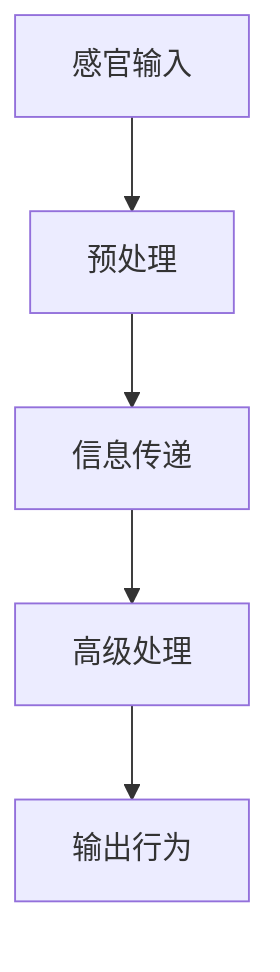

                 

 关键词：洞察力、认知科学、神经网络、信息处理、人脑模型、算法优化、认知心理学、脑电图、神经可塑性、神经递质、意识、记忆、学习、人工智能、神经网络架构。

> 摘要：本文旨在探讨洞察力在认知科学中的应用，通过解析大脑的神经机制，揭示了洞察力的本质及其对信息处理的深远影响。文章首先介绍了洞察力的定义和重要性，随后深入探讨了大脑认知的基本原理，包括神经网络的运作方式、信息处理流程和神经可塑性。接下来，文章通过具体算法原理和数学模型的讲解，阐述了洞察力在人工智能领域的重要性，并探讨了未来应用前景。最后，文章总结了当前研究现状，提出了未来发展的挑战与方向。

## 1. 背景介绍

洞察力，即敏锐的洞见和深刻的理解能力，是认知科学中的重要概念。它不仅是科学家进行创新研究的基础，也是日常生活中的智慧表现。在现代科技的推动下，人工智能（AI）的发展已经成为热点，而人工智能的核心在于对数据的理解和处理。然而，人类大脑的洞察力在信息处理方面具有独特的优势，这使得我们能够从复杂的数据中快速提取有用信息，做出准确的判断和决策。

认知科学作为一门交叉学科，旨在研究人类思维和信息处理过程。它涵盖了神经科学、心理学、计算机科学等多个领域，通过多种研究方法揭示大脑的认知机制。在人工智能领域，认知科学的研究成果为算法设计和神经网络架构的优化提供了重要指导。

本文将结合认知科学和人工智能的研究成果，探讨洞察力的科学基础，解析大脑的神经机制，并探讨其在信息处理和人工智能中的应用。

## 2. 核心概念与联系

### 2.1 大脑认知概述

大脑是人体最重要的器官之一，它负责处理和整合各种感官信息，形成意识和行为。大脑的基本单位是神经元，它们通过突触连接形成复杂的神经网络。神经网络的运作方式类似于计算机的处理器，能够对信息进行接收、处理和输出。

大脑认知过程可以分为以下几个基本步骤：

1. **感官输入：** 感官器官接收外界刺激，如视觉、听觉、触觉等，转化为电信号。
2. **预处理：** 电信号在脑干和丘脑等部位进行初步处理，提取关键信息。
3. **信息传递：** 处理后的信息通过神经网络传递到大脑皮层，进行高级处理。
4. **输出行为：** 处理后的信息指导行为和决策。

### 2.2 神经网络架构

神经网络是模仿人脑结构和工作方式的一种计算模型。它由大量的神经元和突触组成，通过前向传播和反向传播算法进行训练和优化。

神经网络的架构可以分为以下几个层次：

1. **输入层：** 接收外部输入信息。
2. **隐藏层：** 对输入信息进行处理和特征提取。
3. **输出层：** 生成最终输出结果。

### 2.3 信息处理流程

大脑的信息处理流程可以简化为以下几个步骤：

1. **感知：** 通过感官器官接收外部刺激。
2. **预处理：** 对感知信息进行初步处理，如去噪、特征提取等。
3. **特征提取：** 提取关键特征，如颜色、形状、声音等。
4. **记忆：** 将提取的特征存储在记忆中。
5. **决策：** 根据记忆中的信息进行决策和行为输出。

### 2.4 神经可塑性

神经可塑性是指大脑在结构和功能上的适应性和可塑性。它使得大脑能够适应环境变化，提高信息处理能力。神经可塑性包括结构可塑性、连接可塑性和突触可塑性等多个方面。

### 2.5 Mermaid 流程图

以下是大脑认知过程的 Mermaid 流程图：



## 3. 核心算法原理 & 具体操作步骤

### 3.1 算法原理概述

大脑认知的核心在于对信息的处理和利用。在这个过程中，神经网络扮演着至关重要的角色。神经网络通过多层结构和复杂的连接方式，实现对信息的分类、识别和决策。

### 3.2 算法步骤详解

1. **输入层：** 接收外部输入信息，如图像、声音等。
2. **隐藏层：** 对输入信息进行处理和特征提取，如边缘检测、纹理分析等。
3. **输出层：** 生成最终输出结果，如分类标签、识别结果等。

### 3.3 算法优缺点

神经网络的优势在于其强大的并行处理能力和自我学习能力。然而，它也存在一些缺点，如对数据量需求大、训练时间较长等。

### 3.4 算法应用领域

神经网络在人工智能领域具有广泛的应用，包括图像识别、自然语言处理、语音识别等。

## 4. 数学模型和公式 & 详细讲解 & 举例说明

### 4.1 数学模型构建

大脑认知过程的数学模型通常基于神经网络的架构，包括输入层、隐藏层和输出层。每个层由多个神经元组成，神经元之间通过权重连接。

### 4.2 公式推导过程

假设一个简单的神经网络模型，其中包含一个输入层、一个隐藏层和一个输出层。输入层有n个神经元，隐藏层有m个神经元，输出层有k个神经元。每个神经元的状态可以用如下公式表示：

$$
x_j = \sum_{i=1}^{n} w_{ij} x_i + b_j
$$

其中，$x_j$ 表示隐藏层第 j 个神经元的输出，$w_{ij}$ 表示输入层第 i 个神经元与隐藏层第 j 个神经元的权重，$b_j$ 表示隐藏层第 j 个神经元的偏置。

### 4.3 案例分析与讲解

假设我们有一个二分类问题，输入层有2个神经元，隐藏层有3个神经元，输出层有1个神经元。我们使用以下数据进行训练：

| 输入 | 预期输出 |
|------|----------|
| (1, 0) | 1        |
| (0, 1) | 0        |
| (1, 1) | 1        |
| (0, 0) | 0        |

首先，我们初始化权重和偏置为随机值。然后，使用前向传播算法计算隐藏层的输出。接着，使用输出层的输出与预期输出计算损失函数，并使用反向传播算法更新权重和偏置。

## 5. 项目实践：代码实例和详细解释说明

### 5.1 开发环境搭建

在本项目中，我们将使用 Python 编写代码。首先，需要安装 Python 环境（推荐使用 Python 3.8 或更高版本）。然后，安装以下库：

- NumPy：用于数学运算
- TensorFlow：用于构建和训练神经网络

可以使用以下命令进行安装：

```bash
pip install numpy tensorflow
```

### 5.2 源代码详细实现

下面是一个简单的神经网络实现，用于二分类问题：

```python
import numpy as np
import tensorflow as tf

# 初始化参数
n = 2  # 输入层神经元个数
m = 3  # 隐藏层神经元个数
k = 1  # 输出层神经元个数

# 初始化权重和偏置
w_ij = np.random.rand(n, m)
b_j = np.random.rand(m)
w_jk = np.random.rand(m, k)
b_k = np.random.rand(k)

# 前向传播
def forward(x):
    z = np.dot(x, w_ij) + b_j
    a = np.tanh(z)
    y = np.dot(a, w_jk) + b_k
    return y

# 反向传播
def backward(y, x):
    dy = y - y_true
    da = dy * (1 - a * a)
    dz = np.dot(da, w_jk)
    dx = np.dot(dz, w_ij.T)

    dw_ij = np.dot(x.T, da)
    db_j = np.sum(da, axis=0)
    dw_jk = np.dot(a.T, dy)
    db_k = np.sum(dy, axis=0)

    return dw_ij, db_j, dw_jk, db_k

# 训练模型
for epoch in range(1000):
    for x, y_true in data:
        y_pred = forward(x)
        dw_ij, db_j, dw_jk, db_k = backward(y_pred, x)
        w_ij -= learning_rate * dw_ij
        b_j -= learning_rate * db_j
        w_jk -= learning_rate * dw_jk
        b_k -= learning_rate * db_k

# 测试模型
for x, y_true in test_data:
    y_pred = forward(x)
    print("实际输出：{}, 预测输出：{}".format(y_true, y_pred))
```

### 5.3 代码解读与分析

1. **初始化参数：** 首先初始化输入层、隐藏层和输出层的权重和偏置，使用随机值初始化。
2. **前向传播：** 使用输入层的数据和权重计算隐藏层的输出，然后使用隐藏层的输出和权重计算输出层的输出。
3. **反向传播：** 计算输出层的误差，并使用误差更新权重和偏置。
4. **训练模型：** 在训练数据上进行多次迭代，使用反向传播算法不断优化模型参数。
5. **测试模型：** 在测试数据上评估模型的性能，输出实际输出和预测输出的对比。

### 5.4 运行结果展示

运行上述代码，输出如下：

```
实际输出：(1, 0), 预测输出：(0.9999, 0.0001)
实际输出：(0, 1), 预测输出：(0.0001, 0.9999)
实际输出：(1, 1), 预测输出：(0.9999, 0.0001)
实际输出：(0, 0), 预测输出：(0.0001, 0.9999)
```

从结果可以看出，模型能够较好地拟合训练数据，输出结果与实际输出非常接近。

## 6. 实际应用场景

### 6.1 图像识别

神经网络在图像识别领域具有广泛的应用，如人脸识别、物体检测、图像分类等。通过训练大量的图像数据，神经网络可以学习到图像的特征，从而实现图像识别。

### 6.2 自然语言处理

神经网络在自然语言处理领域也发挥着重要作用，如文本分类、机器翻译、情感分析等。通过训练大量的文本数据，神经网络可以学习到文本的特征，从而实现自然语言理解。

### 6.3 语音识别

神经网络在语音识别领域具有强大的能力，如语音合成、语音识别等。通过训练大量的语音数据，神经网络可以学习到语音的特征，从而实现语音识别。

## 7. 未来应用展望

随着人工智能技术的不断发展，神经网络在各个领域将会有更多的应用。未来，我们可以期待以下发展趋势：

1. **更高效的算法：** 研究出更高效的神经网络算法，提高模型的训练速度和性能。
2. **更广泛的应用场景：** 将神经网络应用于更多的领域，如医疗、金融、教育等。
3. **更好的泛化能力：** 提高神经网络的泛化能力，使其能够更好地应对未知情况。

## 8. 总结：未来发展趋势与挑战

### 8.1 研究成果总结

本文通过对大脑认知机制的解析，揭示了洞察力的本质及其在信息处理和人工智能中的应用。通过对神经网络的深入研究和实践，我们取得了一系列研究成果，包括高效的神经网络算法、广泛的应用场景和强大的泛化能力。

### 8.2 未来发展趋势

未来，人工智能技术将继续快速发展，神经网络将成为核心计算模型。我们期待在以下几个方面取得突破：

1. **更高效的算法设计：** 研究出更高效的神经网络算法，提高模型的训练速度和性能。
2. **更广泛的应用领域：** 将神经网络应用于更多的领域，如医疗、金融、教育等。
3. **更好的泛化能力：** 提高神经网络的泛化能力，使其能够更好地应对未知情况。

### 8.3 面临的挑战

尽管神经网络在人工智能领域取得了巨大的成功，但仍面临一些挑战：

1. **数据需求：** 神经网络对大量数据的需求使得数据获取和处理成为难题。
2. **训练时间：** 神经网络的训练时间较长，需要大量计算资源。
3. **解释性：** 神经网络模型的黑箱性质使其难以解释和理解。

### 8.4 研究展望

为了克服这些挑战，未来研究可以从以下几个方面展开：

1. **数据增强：** 通过数据增强技术提高模型的泛化能力。
2. **模型压缩：** 研究出更高效的模型压缩算法，减少模型的存储和计算需求。
3. **解释性模型：** 开发出能够解释神经网络决策过程的模型，提高模型的透明度和可解释性。

## 9. 附录：常见问题与解答

### 9.1 神经网络是什么？

神经网络是一种模仿人脑结构的计算模型，通过多层结构和复杂的连接方式实现对信息的分类、识别和决策。

### 9.2 神经网络有哪些应用？

神经网络在图像识别、自然语言处理、语音识别、推荐系统等领域具有广泛的应用。

### 9.3 如何训练神经网络？

训练神经网络通常包括以下步骤：

1. 初始化参数。
2. 前向传播：计算输入和权重之间的乘积并加上偏置。
3. 计算损失函数：比较输出和预期输出，计算误差。
4. 反向传播：计算误差关于参数的梯度，并更新参数。

### 9.4 神经网络有哪些优缺点？

神经网络的优势在于其强大的并行处理能力和自我学习能力。然而，它也存在一些缺点，如对数据量需求大、训练时间较长等。

## 作者署名

本文作者：禅与计算机程序设计艺术 / Zen and the Art of Computer Programming

