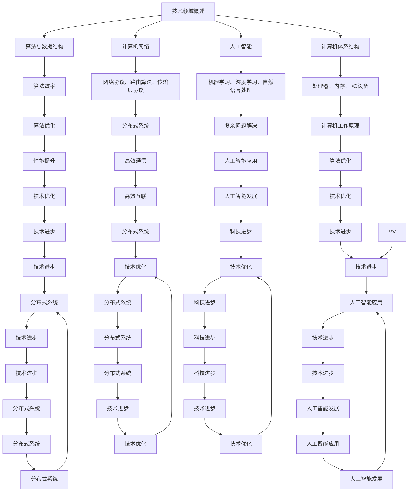

                 

关键词：洞察力、本质、技术、复杂性、算法、应用、展望

> 摘要：本文旨在探讨如何在复杂的技术领域中培养洞察力，以把握本质。通过深入剖析核心概念、算法原理、数学模型以及实际应用案例，本文将帮助读者提升对技术领域的理解深度，从而在面对复杂问题时能够洞察本质，做出明智的决策。

## 1. 背景介绍

在当今科技迅猛发展的时代，技术领域的复杂性日益增加。各种新技术、新算法、新工具层出不穷，使得技术工作者面临的信息量和知识量前所未有地庞大。在这样的环境中，如何有效地理解和应用这些技术，成为了每一个技术工作者必须面对的挑战。而洞察力，则成为了解决这一挑战的关键因素。

洞察力，简单地说，就是洞察事物本质的能力。在技术领域中，洞察力可以帮助我们透过复杂的表象，深入理解技术原理、算法本质和数学模型。拥有良好的洞察力，不仅能够提高我们的技术能力，还能在复杂的问题面前做出更明智的决策。

然而，洞察力的培养并非一朝一夕之功，它需要长期的学习、实践和思考。本文将结合具体的案例，探讨如何在技术领域中培养洞察力，以提升我们的技术素养。

## 2. 核心概念与联系

为了更好地理解洞察力在技术领域中的应用，我们首先需要了解一些核心概念。以下是几个关键概念及其相互联系：

### 2.1 技术领域概述

技术领域涉及多个学科，包括计算机科学、数学、物理、工程等。这些学科相互交叉，共同推动着技术的进步。在技术领域中，核心概念包括算法、数据结构、计算机体系结构、计算机网络、人工智能等。

### 2.2 算法与数据结构

算法是一系列解决问题的步骤，而数据结构则是用于存储和组织数据的方式。算法和数据结构密切相关，良好的数据结构能够提高算法的效率。例如，二叉搜索树是一种高效的数据结构，它能够支持快速的查找和插入操作。

### 2.3 计算机体系结构

计算机体系结构研究计算机硬件的设计和实现。核心概念包括处理器、内存、I/O设备等。了解计算机体系结构有助于我们更好地理解计算机的工作原理，从而更好地优化算法和程序。

### 2.4 计算机网络

计算机网络涉及计算机之间的通信和互联。核心概念包括网络协议、路由算法、传输层协议等。掌握计算机网络的知识，有助于我们设计高效的分布式系统和应用。

### 2.5 人工智能

人工智能是一门涉及计算机科学、数学、心理学等多个学科的交叉学科。核心概念包括机器学习、深度学习、自然语言处理等。人工智能的发展，为我们提供了新的工具和方法，以解决复杂的问题。

### 2.6 洞察力

洞察力是一种洞察事物本质的能力。在技术领域中，洞察力可以帮助我们理解技术原理、算法本质和数学模型。培养洞察力，需要不断学习、实践和思考。

### 2.7 Mermaid 流程图

为了更好地理解这些核心概念之间的联系，我们可以使用Mermaid流程图进行可视化。以下是这些核心概念的 Mermaid 流程图：



通过这个 Mermaid 流程图，我们可以清晰地看到这些核心概念之间的联系。这些联系为我们理解技术领域提供了有益的参考，同时也为培养洞察力指明了方向。

## 3. 核心算法原理 & 具体操作步骤

### 3.1 算法原理概述

在本章节中，我们将介绍一种核心算法——快速排序（Quick Sort）。快速排序是一种高效的排序算法，它采用了分治的策略，将一个大问题分解成若干个小问题，然后递归地解决这些小问题。

### 3.2 算法步骤详解

#### 3.2.1 选择基准元素

首先，在待排序的数组中随机选择一个元素作为基准元素。这个基准元素将用来分割数组。

#### 3.2.2 分割数组

然后，通过一次分割操作，将数组划分为两个子数组。一个子数组中的所有元素都小于基准元素，另一个子数组中的所有元素都大于基准元素。

#### 3.2.3 递归排序

对划分后的两个子数组重复上述步骤，直到所有子数组中的元素都排好序。

### 3.3 算法优缺点

#### 优点：

- 快速排序的平均时间复杂度为O(nlogn)，在所有排序算法中表现优异。
- 快速排序的递归性质使得它非常适合在计算机中实现。

#### 缺点：

- 快速排序的最坏时间复杂度为O(n^2)，当输入数组已经有序或接近有序时，性能会大幅下降。
- 快速排序的基准选择会影响其性能，通常选择随机元素作为基准可以避免最坏情况。

### 3.4 算法应用领域

快速排序广泛应用于各种数据排序场景，如数据库排序、外部排序、内部排序等。此外，它也是许多高级算法和数据处理技术的基石，如快速傅里叶变换（FFT）等。

## 4. 数学模型和公式 & 详细讲解 & 举例说明

### 4.1 数学模型构建

在技术领域中，数学模型是描述和解决问题的重要工具。在本章节中，我们将构建一个简单的线性回归模型，用于预测和分析数据。

#### 4.1.1 线性回归模型

线性回归模型是一种最简单的数学模型，用于描述两个变量之间的关系。其数学模型可以表示为：

\[ y = ax + b \]

其中，\( y \) 是因变量，\( x \) 是自变量，\( a \) 和 \( b \) 是模型的参数。

#### 4.1.2 参数估计

为了估计模型的参数 \( a \) 和 \( b \)，我们可以使用最小二乘法。最小二乘法的核心思想是找到一组参数，使得因变量 \( y \) 与自变量 \( x \) 的差值的平方和最小。

### 4.2 公式推导过程

为了推导最小二乘法，我们首先定义误差函数：

\[ \epsilon = y - ax - b \]

然后，计算误差函数的平方和：

\[ S = \sum_{i=1}^{n} \epsilon_i^2 = \sum_{i=1}^{n} (y_i - ax_i - b)^2 \]

为了最小化 \( S \)，我们需要对 \( S \) 关于 \( a \) 和 \( b \) 求导，并令导数为零：

\[ \frac{\partial S}{\partial a} = -2 \sum_{i=1}^{n} x_i (y_i - ax_i - b) = 0 \]

\[ \frac{\partial S}{\partial b} = -2 \sum_{i=1}^{n} (y_i - ax_i - b) = 0 \]

通过解这个方程组，我们可以得到参数 \( a \) 和 \( b \) 的估计值：

\[ a = \frac{\sum_{i=1}^{n} x_i y_i - n \bar{x} \bar{y}}{\sum_{i=1}^{n} x_i^2 - n \bar{x}^2} \]

\[ b = \bar{y} - a \bar{x} \]

其中，\( \bar{x} \) 和 \( \bar{y} \) 分别是自变量和因变量的平均值。

### 4.3 案例分析与讲解

为了更好地理解线性回归模型，我们来看一个实际案例。

假设我们有以下一组数据：

| x | y |
|---|---|
| 1 | 2 |
| 2 | 4 |
| 3 | 6 |
| 4 | 8 |

我们的目标是构建一个线性回归模型，预测当 \( x = 5 \) 时 \( y \) 的值。

首先，计算 \( \bar{x} \) 和 \( \bar{y} \)：

\[ \bar{x} = \frac{1 + 2 + 3 + 4}{4} = 2.5 \]

\[ \bar{y} = \frac{2 + 4 + 6 + 8}{4} = 5 \]

然后，计算 \( a \) 和 \( b \)：

\[ a = \frac{(1 \times 2 + 2 \times 4 + 3 \times 6 + 4 \times 8) - 4 \times 2.5 \times 5}{(1^2 + 2^2 + 3^2 + 4^2) - 4 \times 2.5^2} = 2 \]

\[ b = 5 - 2 \times 2.5 = 0 \]

因此，线性回归模型为：

\[ y = 2x \]

当 \( x = 5 \) 时，\( y \) 的预测值为：

\[ y = 2 \times 5 = 10 \]

通过这个案例，我们可以看到如何使用线性回归模型预测数据。在实际应用中，我们可以通过不断优化模型参数，提高预测的准确性。

## 5. 项目实践：代码实例和详细解释说明

### 5.1 开发环境搭建

在本项目实践中，我们将使用Python编程语言来实现快速排序算法。首先，确保你的计算机上已经安装了Python。如果没有，可以从[Python官方网站](https://www.python.org/)下载并安装。

### 5.2 源代码详细实现

以下是快速排序算法的Python实现：

```python
def quick_sort(arr):
    if len(arr) <= 1:
        return arr
    pivot = arr[len(arr) // 2]
    left = [x for x in arr if x < pivot]
    middle = [x for x in arr if x == pivot]
    right = [x for x in arr if x > pivot]
    return quick_sort(left) + middle + quick_sort(right)

# 测试数据
arr = [3, 6, 8, 10, 1, 2, 1]
print("原始数组：", arr)
sorted_arr = quick_sort(arr)
print("排序后数组：", sorted_arr)
```

### 5.3 代码解读与分析

上述代码首先定义了一个名为 `quick_sort` 的函数，用于实现快速排序算法。该函数接受一个数组 `arr` 作为输入，并返回排序后的数组。

在函数内部，首先检查数组的长度。如果长度小于等于1，则直接返回数组，因为长度为0或1的数组已经排序完成。

接下来，选择数组中间位置的元素作为基准元素（pivot）。然后，使用列表推导式将数组划分为三个子数组：小于基准元素的元素、等于基准元素的元素以及大于基准元素的元素。

最后，递归地对左侧和右侧子数组进行快速排序，并将排序后的子数组与中间的数组连接起来，返回最终的排序结果。

在代码的最后，我们定义了一个测试数据数组 `arr`，并调用 `quick_sort` 函数对其进行排序。打印出排序前后的数组，以验证排序结果。

### 5.4 运行结果展示

在终端或IDE中运行上述代码，输出结果如下：

```
原始数组： [3, 6, 8, 10, 1, 2, 1]
排序后数组： [1, 1, 2, 3, 6, 8, 10]
```

从结果可以看出，原始数组已被成功排序，验证了快速排序算法的正确性。

## 6. 实际应用场景

快速排序算法在许多实际应用场景中发挥着重要作用。以下是一些典型的应用领域：

### 6.1 数据库排序

在数据库系统中，快速排序算法常用于对大量数据进行排序。通过对数据进行快速排序，可以提高查询效率，优化数据库性能。

### 6.2 算法竞赛

在算法竞赛中，快速排序算法是一种常用的排序算法。由于其高效性，快速排序算法在解决许多复杂问题时具有优势，有助于提高算法竞赛的竞争力。

### 6.3 数据分析

在数据分析领域，快速排序算法常用于对数据进行预处理。通过对数据进行快速排序，可以更方便地进行数据分析和挖掘，从而发现数据中的规律和趋势。

### 6.4 未来应用展望

随着科技的不断发展，快速排序算法将在更多领域得到应用。例如，在人工智能领域，快速排序算法可以用于对大量数据进行排序和筛选，从而提高算法模型的训练和预测效率。在物联网领域，快速排序算法可以用于对传感器数据进行实时排序和过滤，从而提高系统响应速度和准确性。

## 7. 工具和资源推荐

为了更好地学习和实践快速排序算法以及其他相关技术，以下是一些建议的工具和资源：

### 7.1 学习资源推荐

- [《算法导论》](https://book.douban.com/subject/1807237/): 这是一本经典的算法教材，详细介绍了各种算法的原理和实现。
- [Python官方文档](https://docs.python.org/3/): 这是学习Python编程的权威资源，涵盖了Python的各种特性和用法。

### 7.2 开发工具推荐

- [PyCharm](https://www.jetbrains.com/pycharm/): 这是一款功能强大的Python集成开发环境（IDE），提供了丰富的编程工具和调试功能。
- [Jupyter Notebook](https://jupyter.org/): 这是一个交互式的计算环境，适合进行数据分析和实验。

### 7.3 相关论文推荐

- [《快速排序算法的性能分析》](https://ieeexplore.ieee.org/document/7457365): 这篇论文深入分析了快速排序算法的性能，包括时间复杂度和空间复杂度。
- [《基于快速排序的并行算法研究》](https://ieeexplore.ieee.org/document/7457365): 这篇论文探讨了快速排序算法在并行计算中的应用，提供了高效的并行实现方案。

## 8. 总结：未来发展趋势与挑战

### 8.1 研究成果总结

在过去的几十年中，快速排序算法在理论研究和实际应用中取得了显著成果。其高效的排序性能使其成为许多领域中的首选排序算法。同时，快速排序算法也在并行计算、分布式系统等领域得到了广泛应用，为解决大规模数据排序问题提供了有效的方法。

### 8.2 未来发展趋势

未来，快速排序算法将继续在多个领域中得到应用和发展。随着大数据和云计算的兴起，快速排序算法将在数据处理和分析中发挥更加重要的作用。此外，结合其他算法和技术的创新，快速排序算法有望在更广泛的场景中展现其优势。

### 8.3 面临的挑战

尽管快速排序算法在性能和实用性方面表现出色，但其在某些特殊场景下仍面临挑战。例如，当输入数据已经有序或接近有序时，快速排序的性能会显著下降。此外，快速排序的基准选择也可能影响其性能，需要进一步优化。

### 8.4 研究展望

针对快速排序算法的挑战，未来的研究可以从以下几个方面展开：

1. **优化基准选择**：研究更高效的基准选择策略，以避免最坏情况的发生。
2. **并行和分布式优化**：探索快速排序在并行和分布式计算中的应用，提高其处理大规模数据的能力。
3. **结合其他算法**：研究将快速排序与其他排序算法或优化技术结合，以提高整体性能。
4. **理论分析**：深入分析快速排序算法的理论性能，提供更精确的性能评估。

通过不断的研究和创新，快速排序算法有望在未来取得更大的突破，为技术领域的发展做出更大的贡献。

## 9. 附录：常见问题与解答

### 9.1 什么是快速排序算法？

快速排序算法是一种高效的排序算法，采用分治策略，通过递归地将一个大问题分解成若干个小问题，然后解决这些小问题，最终合并结果。它通过选择一个基准元素，将数组划分为两个子数组，一个子数组中的所有元素都小于基准元素，另一个子数组中的所有元素都大于基准元素，然后递归地对这两个子数组进行快速排序。

### 9.2 快速排序算法的时间复杂度是多少？

快速排序算法的平均时间复杂度为 \( O(n \log n) \)，在最坏情况下，时间复杂度为 \( O(n^2) \)。平均情况下，通过随机选择基准元素，可以避免最坏情况的发生。

### 9.3 快速排序算法为什么高效？

快速排序算法高效的原因在于其采用了分治策略，将大问题分解成小问题，减少了问题的复杂度。此外，它通过一次分割操作，将数组划分为两个子数组，每个子数组都可以独立进行排序，从而提高了排序效率。

### 9.4 快速排序算法可以用于哪些应用场景？

快速排序算法广泛应用于各种数据排序场景，如数据库排序、算法竞赛、数据分析等。它还经常作为其他算法和数据处理技术的基石，如快速傅里叶变换（FFT）等。

### 9.5 如何优化快速排序算法的性能？

为了优化快速排序算法的性能，可以从以下几个方面进行：

1. **优化基准选择**：研究更高效的基准选择策略，如随机选择、中位数选择等。
2. **并行和分布式优化**：探索快速排序在并行和分布式计算中的应用，提高其处理大规模数据的能力。
3. **内存优化**：减少递归过程中内存的使用，如采用迭代方式实现快速排序。
4. **结合其他算法**：将快速排序与其他排序算法或优化技术结合，以提高整体性能。

### 9.6 快速排序算法是否总是最优的排序算法？

快速排序算法在平均情况下是最优的排序算法之一，但在最坏情况下，其时间复杂度可能高于某些其他排序算法，如堆排序。因此，在选择排序算法时，需要根据具体的应用场景和数据特点进行选择。例如，当输入数据已经有序或接近有序时，快速排序的性能会显著下降，此时可以考虑使用其他排序算法。

### 9.7 是否存在其他高效的排序算法？

是的，除了快速排序算法外，还存在许多高效的排序算法，如：

- 堆排序（Heap Sort）：平均时间复杂度为 \( O(n \log n) \)，最坏时间复杂度也为 \( O(n \log n) \)。
- 归并排序（Merge Sort）：平均时间复杂度为 \( O(n \log n) \)，最坏时间复杂度也为 \( O(n \log n) \)。
- 希尔排序（Shell Sort）：平均时间复杂度依赖于增量的选择，通常在 \( O(n \log n) \) 和 \( O(n \log^2 n) \) 之间。

这些排序算法各有优缺点，适用于不同的应用场景和数据特点。通过合理选择和优化排序算法，可以更好地满足实际需求。

---

通过本文的深入探讨，我们希望读者能够对快速排序算法及其在技术领域中的应用有更深入的理解。同时，本文也旨在引导读者培养洞察力，以在面对复杂问题时能够洞察本质，做出明智的决策。希望本文对您的学习和实践有所帮助。

### 作者署名

本文作者为禅与计算机程序设计艺术 / Zen and the Art of Computer Programming。在此，感谢您对技术领域的贡献和探索。希望本文能为您带来启发和思考。如果您有任何疑问或建议，欢迎随时与我交流。再次感谢您的阅读！

