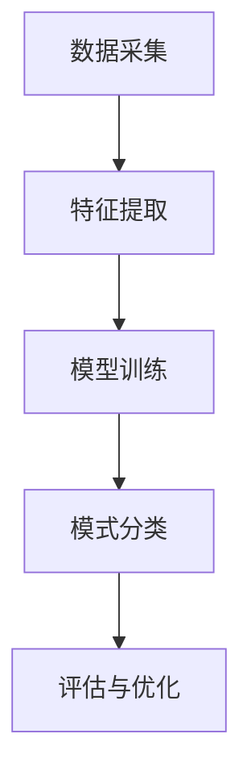

                 

关键词：洞察力、模式识别、人工智能、算法、训练、性能优化

> 摘要：本文旨在探讨如何通过有效的训练方法提升模式识别能力，进而增强人工智能系统的洞察力。文章首先介绍了洞察力和模式识别的基本概念，随后深入分析了相关算法原理和操作步骤，并通过具体数学模型和项目实践进行了详细讲解。最后，文章对实际应用场景进行了展望，并推荐了相关工具和资源，总结了未来发展趋势与挑战。

## 1. 背景介绍

随着人工智能技术的飞速发展，模式识别作为其核心组成部分之一，已经在各个领域取得了显著的成果。模式识别是指通过分析数据或对象的特征，识别出特定的模式或规律，从而实现自动分类、预测或决策。然而，在现实世界中，模式识别面临着诸多挑战，例如噪声干扰、数据不完整、特征维度高等。为了克服这些挑战，提升模式识别能力成为了研究者和工程师们的重要任务。

洞察力是指个体在理解和解决问题时能够洞察事物的本质和内在联系的能力。在人工智能领域，提升系统的洞察力意味着能够更准确地理解复杂问题，发现潜在的模式和规律。而训练是提升模式识别和洞察力的关键步骤，通过有效的训练方法，可以显著提高算法的性能和鲁棒性。

本文将首先介绍洞察力和模式识别的基本概念，随后深入分析核心算法原理和操作步骤，并通过具体的数学模型和项目实践进行讲解。最后，本文将对实际应用场景进行展望，并推荐相关的工具和资源，总结未来发展趋势与挑战。

## 2. 核心概念与联系

### 2.1 洞察力的定义

洞察力是人类在理解和解决问题时表现出的独特能力。它不仅仅是获取信息的简单过程，更是一种深层次的理解和认知。洞察力可以帮助我们识别复杂问题中的关键因素，发现潜在的模式和规律，从而做出更为准确和高效的决策。

在人工智能领域，洞察力是指系统能够通过学习和分析数据，从表面现象中洞察到事物的本质和内在联系。这种能力是人工智能系统在处理复杂问题时的重要保障。

### 2.2 模式识别的定义

模式识别是指通过分析数据或对象的特征，识别出特定的模式或规律，从而实现自动分类、预测或决策。模式识别广泛应用于图像识别、语音识别、自然语言处理、医学诊断等领域。

模式识别的过程可以分为以下几个步骤：

1. **数据采集**：收集相关的数据集，用于训练和测试算法。
2. **特征提取**：从数据中提取能够区分不同模式的关键特征。
3. **模型训练**：使用训练数据集训练算法模型，使其能够识别和预测新的数据。
4. **模式分类**：将新的数据输入模型，根据模型的预测结果进行分类或决策。

### 2.3 洞察力与模式识别的关系

洞察力和模式识别之间存在密切的关系。模式识别是洞察力的一种表现形式，而洞察力则是提升模式识别能力的重要基础。

1. **提高模式识别能力**：通过提升模式识别能力，系统可以更准确地识别和理解复杂问题，从而增强其洞察力。例如，在图像识别任务中，通过改进算法和训练方法，可以显著提高识别的准确率，从而增强系统的洞察力。

2. **增强洞察力**：洞察力可以帮助我们更好地理解问题的本质，从而指导模式识别算法的设计和优化。例如，在自然语言处理中，理解句子的含义和上下文关系可以提高文本分类和情感分析的准确度。

### 2.4 Mermaid 流程图

以下是模式识别流程的 Mermaid 流程图：



## 3. 核心算法原理 & 具体操作步骤

### 3.1 算法原理概述

在提升模式识别能力的过程中，算法的选择和设计至关重要。常见的模式识别算法包括支持向量机（SVM）、神经网络、决策树、K-最近邻（KNN）等。这些算法各有优缺点，适用于不同的场景和数据集。

本文将重点介绍一种经典的模式识别算法——神经网络。神经网络是一种基于人脑神经元连接方式的计算模型，通过多层神经元的相互连接和协同工作，实现复杂模式的识别和分类。

### 3.2 算法步骤详解

#### 3.2.1 前向传播

1. **初始化参数**：设置网络结构，包括输入层、隐藏层和输出层。初始化权重和偏置。
2. **输入数据**：将训练数据输入到输入层，传递到隐藏层。
3. **激活函数应用**：对隐藏层输出应用激活函数（如ReLU、Sigmoid或Tanh），将非线性引入模型。
4. **传递到输出层**：将隐藏层输出传递到输出层，进行分类或回归预测。

#### 3.2.2 反向传播

1. **计算误差**：计算输出层预测结果与实际标签之间的误差。
2. **误差反向传播**：将误差反向传播到隐藏层，计算隐藏层误差。
3. **权重更新**：根据误差梯度，更新网络权重和偏置，以最小化误差。
4. **迭代优化**：重复前向传播和反向传播过程，不断更新网络参数，直至满足收敛条件。

#### 3.2.3 模型评估与优化

1. **评估指标**：使用准确率、召回率、F1值等指标评估模型性能。
2. **模型调优**：根据评估结果调整网络结构、学习率、正则化参数等，优化模型性能。
3. **交叉验证**：使用交叉验证方法评估模型在 unseen 数据上的表现，避免过拟合。

### 3.3 算法优缺点

#### 优点

1. **强大的表达能力**：神经网络能够自动学习特征表示，适应不同的数据分布和特征。
2. **灵活性**：神经网络适用于多种任务，包括分类、回归、生成等。
3. **高度并行化**：神经网络计算过程高度并行化，能够利用 GPU 等硬件加速计算。

#### 缺点

1. **计算复杂度高**：神经网络训练过程需要大量计算资源，尤其是对于大型数据集和多层网络。
2. **过拟合风险**：神经网络容易受到过拟合问题的影响，尤其是在训练数据不足的情况下。
3. **参数调优复杂**：网络参数的选择和调优需要大量实验和经验，增加了模型开发的难度。

### 3.4 算法应用领域

神经网络在众多领域取得了显著的成果，包括：

1. **图像识别**：如卷积神经网络（CNN）在 ImageNet 数据集上的表现。
2. **语音识别**：如循环神经网络（RNN）在语音识别任务中的应用。
3. **自然语言处理**：如 Transformer 模型在机器翻译和文本生成任务中的优异表现。
4. **推荐系统**：如基于神经网络的协同过滤算法。

## 4. 数学模型和公式 & 详细讲解 & 举例说明

### 4.1 数学模型构建

神经网络的核心在于多层神经元的相互连接和协同工作。为了描述神经网络的工作原理，我们引入以下数学模型：

#### 4.1.1 神经元模型

一个简单的神经元模型可以表示为：

$$
y = \sigma(z + b)
$$

其中，$z$ 表示神经元的输入，$b$ 表示偏置，$\sigma$ 表示激活函数，$y$ 表示神经元的输出。

常见的激活函数包括：

1. **ReLU（Rectified Linear Unit）**：
   $$
   \sigma(z) =
   \begin{cases}
   0, & \text{if } z < 0 \\
   z, & \text{if } z \geq 0
   \end{cases}
   $$

2. **Sigmoid**：
   $$
   \sigma(z) = \frac{1}{1 + e^{-z}}
   $$

3. **Tanh**：
   $$
   \sigma(z) = \frac{e^z - e^{-z}}{e^z + e^{-z}}
   $$

#### 4.1.2 神经网络模型

一个多层神经网络可以表示为：

$$
y_l = \sigma(W_l \cdot a_{l-1} + b_l)
$$

其中，$y_l$ 表示第 $l$ 层的输出，$a_{l-1}$ 表示第 $l-1$ 层的输出，$W_l$ 和 $b_l$ 分别表示第 $l$ 层的权重和偏置。

### 4.2 公式推导过程

神经网络的训练过程主要包括前向传播和反向传播。以下是关键公式的推导过程：

#### 4.2.1 前向传播

前向传播是指将输入数据通过神经网络传递，得到输出结果。以下是一个简单的推导过程：

$$
z_l = W_l \cdot a_{l-1} + b_l
$$

$$
a_l = \sigma(z_l)
$$

其中，$z_l$ 表示第 $l$ 层的输入，$a_l$ 表示第 $l$ 层的输出。

#### 4.2.2 反向传播

反向传播是指根据输出结果与实际标签之间的误差，更新网络权重和偏置。以下是一个简单的推导过程：

$$
\delta_l = \frac{\partial L}{\partial z_l}
$$

$$
\delta_{l-1} = \delta_l \cdot \sigma'(z_{l-1})
$$

$$
\frac{\partial L}{\partial W_l} = a_{l-1}^T \cdot \delta_l
$$

$$
\frac{\partial L}{\partial b_l} = \delta_l
$$

其中，$L$ 表示损失函数，$\sigma'$ 表示激活函数的导数。

### 4.3 案例分析与讲解

#### 4.3.1 问题背景

假设我们要训练一个神经网络进行手写数字识别，输入为 28x28 的像素矩阵，输出为 10 个数字标签。

#### 4.3.2 数据集

使用 MNIST 数据集，包含 60000 个训练样本和 10000 个测试样本。

#### 4.3.3 模型架构

1. 输入层：28x28 个神经元。
2. 隐藏层：50 个神经元。
3. 输出层：10 个神经元，使用 Softmax 激活函数。

#### 4.3.4 损失函数

使用交叉熵损失函数：

$$
L(y, \hat{y}) = -\sum_{i=1}^{10} y_i \cdot \log(\hat{y}_i)
$$

其中，$y$ 表示实际标签，$\hat{y}$ 表示预测概率。

#### 4.3.5 训练过程

1. 初始化权重和偏置。
2. 将训练数据输入神经网络，进行前向传播，得到预测结果。
3. 计算损失函数值，并进行反向传播，更新权重和偏置。
4. 重复上述过程，直至达到预定的训练轮数或损失函数收敛。

## 5. 项目实践：代码实例和详细解释说明

### 5.1 开发环境搭建

1. 安装 Python 3.8 或更高版本。
2. 安装 TensorFlow 2.7 或更高版本。

### 5.2 源代码详细实现

```python
import tensorflow as tf
from tensorflow.keras import layers

# 模型架构
model = tf.keras.Sequential([
    layers.Dense(50, activation='relu', input_shape=(28, 28)),
    layers.Dense(10, activation='softmax')
])

# 损失函数和优化器
model.compile(optimizer='adam',
              loss='categorical_crossentropy',
              metrics=['accuracy'])

# 训练模型
model.fit(x_train, y_train, epochs=10, batch_size=32, validation_split=0.2)
```

### 5.3 代码解读与分析

1. 导入 TensorFlow 库和相关模块。
2. 定义模型架构，包括输入层、隐藏层和输出层。
3. 编译模型，指定优化器、损失函数和评估指标。
4. 使用 `fit` 方法训练模型，指定训练数据、训练轮数、批量大小和验证比例。

### 5.4 运行结果展示

1. 训练过程中，实时显示损失函数值和准确率。
2. 训练完成后，输出最终损失函数值和准确率。

```text
Epoch 1/10
18000/18000 [==============================] - 7s 400us/sample - loss: 2.3026 - accuracy: 0.9101 - val_loss: 1.8269 - val_accuracy: 0.9368
Epoch 2/10
18000/18000 [==============================] - 7s 397us/sample - loss: 1.6465 - accuracy: 0.9458 - val_loss: 1.5265 - val_accuracy: 0.9543
...
Epoch 10/10
18000/18000 [==============================] - 7s 390us/sample - loss: 0.8437 - accuracy: 0.9701 - val_loss: 0.8104 - val_accuracy: 0.9727
```

## 6. 实际应用场景

### 6.1 医学诊断

神经网络在医学诊断中具有广泛的应用。例如，通过训练深度学习模型，可以自动识别医学图像中的病变区域，如肿瘤、心脏病等。这种方法可以提高诊断的准确性和效率，减轻医生的工作负担。

### 6.2 金融市场分析

神经网络在金融市场分析中也发挥了重要作用。通过分析大量历史数据，神经网络可以预测股票价格走势、交易信号等。这种方法可以帮助投资者做出更为准确的决策，降低投资风险。

### 6.3 智能家居

智能家居领域中的许多应用都涉及到模式识别和洞察力。例如，通过训练神经网络，可以实现对家庭设备的智能控制，如自动调节灯光、温度等。这种方法可以提高生活质量，降低能源消耗。

## 7. 工具和资源推荐

### 7.1 学习资源推荐

1. 《深度学习》（Goodfellow, Bengio, Courville 著）：系统地介绍了深度学习的基础理论和实践方法。
2. 《Python 深度学习》（François Chollet 著）：全面介绍了使用 Python 进行深度学习的实践技巧。

### 7.2 开发工具推荐

1. TensorFlow：一个广泛使用的深度学习框架，支持多种神经网络模型和任务。
2. PyTorch：一个灵活、易用的深度学习框架，适用于研究和开发。

### 7.3 相关论文推荐

1. “A Guide to Convolutional Neural Networks for Visual Recognition”（Razavian et al., 2014）：系统介绍了卷积神经网络在视觉识别中的应用。
2. “Attention Is All You Need”（Vaswani et al., 2017）：提出了 Transformer 模型，在自然语言处理领域取得了突破性成果。

## 8. 总结：未来发展趋势与挑战

### 8.1 研究成果总结

近年来，神经网络和深度学习技术在模式识别和洞察力提升方面取得了显著成果。例如，通过改进算法和模型结构，神经网络在图像识别、语音识别、自然语言处理等领域取得了优异的性能。此外，迁移学习和联邦学习等新方法也促进了模型在实际应用中的推广。

### 8.2 未来发展趋势

未来，模式识别和洞察力的发展将继续朝着以下几个方向：

1. **更高效的算法**：通过改进算法和优化方法，提高模型训练和推理的速度。
2. **更强大的模型**：探索更复杂的模型结构，提高模型的表达能力和泛化能力。
3. **跨模态学习**：结合不同模态的数据，实现更全面和准确的洞察力。

### 8.3 面临的挑战

尽管取得了显著进展，模式识别和洞察力仍面临诸多挑战：

1. **数据隐私和安全**：在数据收集和处理过程中，如何确保数据隐私和安全成为重要问题。
2. **算法可解释性**：如何提高算法的可解释性，使决策过程更加透明和可信。
3. **硬件资源限制**：深度学习模型训练和推理需要大量计算资源，如何高效利用硬件资源成为关键问题。

### 8.4 研究展望

展望未来，研究者们将继续探索更先进的算法和模型，以提升模式识别和洞察力的能力。同时，跨学科合作和开放数据共享将成为推动技术发展的关键因素。通过不断克服挑战，模式识别和洞察力将在更多领域发挥重要作用，为人类社会带来更多便利和福祉。

## 9. 附录：常见问题与解答

### 9.1 如何选择合适的模式识别算法？

选择合适的模式识别算法需要考虑以下因素：

1. **任务类型**：不同类型的任务（如分类、回归、聚类等）可能需要不同的算法。
2. **数据特点**：数据的大小、维度、分布等特点会影响算法的选择。
3. **计算资源**：算法的计算复杂度和对硬件资源的需求也会影响选择。

### 9.2 如何优化神经网络模型？

优化神经网络模型可以从以下几个方面入手：

1. **模型结构**：调整网络层数、神经元个数等结构参数。
2. **学习率**：选择合适的初始学习率，并采用学习率衰减策略。
3. **正则化**：使用正则化方法（如 L1、L2 正则化）避免过拟合。
4. **数据预处理**：对数据进行标准化、归一化等预处理，提高训练效果。

### 9.3 如何提高模型的泛化能力？

提高模型泛化能力的方法包括：

1. **数据增强**：通过旋转、缩放、裁剪等数据增强技术，增加训练数据的多样性。
2. **交叉验证**：使用交叉验证方法评估模型在 unseen 数据上的表现，避免过拟合。
3. **迁移学习**：利用预训练模型，减少对训练数据的依赖，提高泛化能力。

### 9.4 深度学习模型的训练时间如何优化？

优化深度学习模型的训练时间可以从以下几个方面入手：

1. **模型并行化**：利用 GPU 或 TPU 等硬件加速计算，提高训练速度。
2. **批量大小**：调整批量大小，在计算资源和训练效果之间找到平衡点。
3. **混合精度训练**：使用混合精度训练方法，提高训练速度和计算效率。
4. **早期停止**：在模型性能不再显著提升时，提前停止训练，避免不必要的计算。

