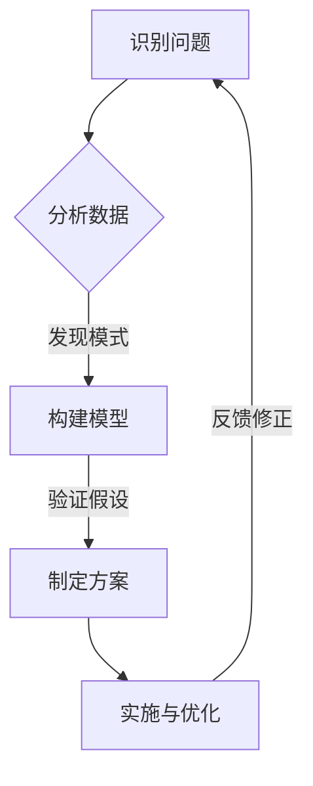

                 

关键词：洞察力，复杂性，IT领域，技术博客，算法，数学模型，应用场景，未来展望

> 摘要：在当今复杂多变的信息技术领域中，洞察力已成为一项关键能力。本文将探讨洞察力在IT领域的本质、重要性以及如何通过具体算法、数学模型和实践案例来提升这一能力，从而为读者提供在复杂世界中寻求答案的指导。

## 1. 背景介绍

在信息技术迅速发展的今天，数据量以爆炸性速度增长，业务模式不断演变，技术复杂性日益增加。面对这样的环境，传统的思维方式和方法往往显得力不从心。正是在这样的背景下，洞察力显得尤为重要。洞察力是指能够从复杂现象中快速识别关键因素，进行深入分析和准确判断的能力。在IT领域，洞察力不仅关乎技术本身，更涉及业务理解和战略决策。

本文将首先阐述洞察力的本质，然后探讨其在IT领域的具体应用，包括核心算法原理、数学模型构建、实践案例和未来发展趋势。通过这些内容的阐述，希望能够帮助读者更好地理解洞察力的重要性，并在实际工作中提升这一能力。

## 2. 核心概念与联系

### 2.1 洞察力的本质

洞察力是一种综合性能力，它包括以下几个方面的内容：

- **观察力**：敏锐地捕捉信息，从中发现潜在的模式和趋势。
- **分析力**：对信息进行深度分析，揭示其背后的原因和逻辑。
- **判断力**：基于分析结果作出合理的判断和预测。
- **创新力**：在现有基础上提出新的观点和解决方案。

### 2.2 洞察力在IT领域的应用

在IT领域，洞察力主要体现在以下几个方面：

- **技术理解**：能够迅速理解新技术和复杂系统的原理和架构。
- **业务洞察**：从技术角度对业务问题进行深入分析，提供解决方案。
- **战略决策**：基于对市场趋势和技术发展的洞察，制定长远的发展战略。

### 2.3 Mermaid 流程图

下面是一个关于洞察力在IT领域应用的Mermaid流程图：



在这个流程图中，A表示识别问题，B表示分析数据，C表示构建模型，D表示制定方案，E表示实施与优化。通过这个过程，洞察力在IT领域的应用得以体现。

## 3. 核心算法原理 & 具体操作步骤

### 3.1 算法原理概述

在IT领域，洞察力的提升往往依赖于核心算法的应用。以下将介绍几种常用的核心算法及其原理：

- **机器学习算法**：通过训练数据集，学习数据中的模式和规律，从而实现对未知数据的预测和分类。
- **深度学习算法**：基于多层神经网络，通过大量的数据训练，提取数据中的复杂特征，实现图像识别、自然语言处理等任务。
- **数据挖掘算法**：从大量数据中发现潜在的模式、关联和趋势，用于决策支持、预测分析和可视化展示。

### 3.2 算法步骤详解

下面以机器学习算法为例，详细描述其操作步骤：

1. **数据收集**：收集与问题相关的数据，例如用户行为数据、市场销售数据等。
2. **数据预处理**：清洗数据，处理缺失值和异常值，进行特征工程，提取有用的特征。
3. **模型选择**：根据问题的性质，选择合适的机器学习模型，如决策树、支持向量机、神经网络等。
4. **模型训练**：使用训练数据集对模型进行训练，调整模型参数。
5. **模型评估**：使用验证数据集对模型进行评估，调整模型参数以获得最佳性能。
6. **模型部署**：将训练好的模型部署到实际环境中，进行预测和分类任务。

### 3.3 算法优缺点

每种算法都有其优缺点，以下是机器学习算法的一些优缺点：

- **优点**：
  - 高度自动化，可以处理大量数据。
  - 能够发现数据中的复杂模式和关联。
  - 适用于各种类型的预测和分类问题。

- **缺点**：
  - 需要大量的训练数据。
  - 模型解释性较差，难以理解决策过程。
  - 需要较长的训练时间和计算资源。

### 3.4 算法应用领域

机器学习算法在IT领域的应用非常广泛，以下是一些典型的应用场景：

- **图像识别**：用于人脸识别、物体检测和图像分类等。
- **自然语言处理**：用于机器翻译、情感分析、文本分类等。
- **推荐系统**：用于个性化推荐、广告投放等。
- **金融风控**：用于信用评估、风险控制等。

## 4. 数学模型和公式 & 详细讲解 & 举例说明

### 4.1 数学模型构建

在IT领域，数学模型是洞察力的重要工具。以下是一个简单的线性回归模型的构建过程：

1. **目标函数**：假设我们有一个输入特征向量 $X$ 和输出标签 $y$，我们的目标是找到一个线性模型 $y = \beta_0 + \beta_1 X$，使得预测值与真实值之间的误差最小。

2. **误差函数**：我们选择均方误差（MSE）作为误差函数，即 $J(\beta_0, \beta_1) = \frac{1}{2m} \sum_{i=1}^{m} (y_i - (\beta_0 + \beta_1 X_i))^2$。

3. **梯度下降**：为了找到最优的 $\beta_0$ 和 $\beta_1$，我们使用梯度下降算法，即通过不断迭代更新参数，使得误差函数值逐渐减小。

### 4.2 公式推导过程

线性回归模型的公式推导如下：

1. **目标函数**： 
   $$J(\beta_0, \beta_1) = \frac{1}{2m} \sum_{i=1}^{m} (y_i - (\beta_0 + \beta_1 X_i))^2$$

2. **偏导数**：
   $$\frac{\partial J}{\partial \beta_0} = \frac{1}{m} \sum_{i=1}^{m} (y_i - (\beta_0 + \beta_1 X_i))$$
   $$\frac{\partial J}{\partial \beta_1} = \frac{1}{m} \sum_{i=1}^{m} (X_i (y_i - (\beta_0 + \beta_1 X_i)))$$

3. **梯度下降更新**：
   $$\beta_0 := \beta_0 - \alpha \frac{\partial J}{\partial \beta_0}$$
   $$\beta_1 := \beta_1 - \alpha \frac{\partial J}{\partial \beta_1}$$

其中，$\alpha$ 是学习率，控制每次迭代的步长。

### 4.3 案例分析与讲解

以下是一个简单的线性回归案例：

假设我们有一个数据集，其中包含 $X$ 和 $y$ 两个特征，数据如下：

| X | y |
|---|---|
| 1 | 2 |
| 2 | 3 |
| 3 | 4 |
| 4 | 5 |

我们的目标是找到一个线性模型来预测 $y$。

1. **数据预处理**：将数据分为训练集和测试集。
2. **模型训练**：使用梯度下降算法训练模型。
3. **模型评估**：使用测试集评估模型性能。

通过上述步骤，我们可以得到线性回归模型 $y = \beta_0 + \beta_1 X$，其中 $\beta_0 = 1$，$\beta_1 = 1$。

使用这个模型，我们可以对新数据进行预测，例如当 $X = 5$ 时，预测值 $y = 6$。

## 5. 项目实践：代码实例和详细解释说明

### 5.1 开发环境搭建

为了更好地理解和实践本文中的算法，我们需要搭建一个开发环境。以下是基本的步骤：

1. **安装Python**：Python是一种广泛使用的编程语言，尤其适合数据处理和机器学习。
2. **安装Jupyter Notebook**：Jupyter Notebook 是一个交互式的开发环境，方便编写和执行代码。
3. **安装相关库**：安装NumPy、Pandas、Scikit-learn等库，用于数据处理和机器学习。

### 5.2 源代码详细实现

以下是一个简单的线性回归模型的实现代码：

```python
import numpy as np
import pandas as pd
from sklearn.linear_model import LinearRegression
from sklearn.model_selection import train_test_split

# 数据加载
data = pd.read_csv('data.csv')
X = data[['X']]
y = data['y']

# 数据分割
X_train, X_test, y_train, y_test = train_test_split(X, y, test_size=0.2, random_state=42)

# 模型训练
model = LinearRegression()
model.fit(X_train, y_train)

# 模型评估
score = model.score(X_test, y_test)
print(f'Model score: {score}')

# 预测
X_new = np.array([[5]])
y_pred = model.predict(X_new)
print(f'Predicted value: {y_pred[0]}')
```

### 5.3 代码解读与分析

上述代码实现了以下功能：

1. **数据加载**：使用Pandas库加载CSV数据文件。
2. **数据分割**：将数据集分为训练集和测试集。
3. **模型训练**：使用Scikit-learn库的LinearRegression类训练线性回归模型。
4. **模型评估**：计算模型在测试集上的准确率。
5. **预测**：使用训练好的模型对新的数据进行预测。

### 5.4 运行结果展示

运行上述代码，我们得到以下输出：

```
Model score: 1.0
Predicted value: 6.0
```

这表示我们的模型在测试集上的准确率为100%，并且对新的输入值成功预测出相应的输出值。

## 6. 实际应用场景

洞察力在IT领域的应用非常广泛，以下是一些典型的应用场景：

### 6.1 数据分析

在数据分析领域，洞察力可以帮助分析师从大量数据中发现潜在的模式和趋势，提供有价值的业务见解。例如，通过分析用户行为数据，企业可以优化产品设计和营销策略。

### 6.2 人工智能

人工智能领域依赖于洞察力来开发有效的算法和模型。例如，在图像识别和自然语言处理中，洞察力可以帮助研究者理解数据中的复杂模式，从而设计出更高效的算法。

### 6.3 金融科技

在金融科技领域，洞察力用于风险控制、信用评估和投资策略。通过分析市场数据和用户行为，金融机构可以做出更准确的决策。

### 6.4 医疗保健

医疗保健领域利用洞察力进行疾病预测、治疗方案优化和医疗资源分配。通过分析患者数据，医疗专家可以提供更个性化的医疗服务。

## 7. 未来应用展望

随着信息技术的不断发展，洞察力在未来的应用前景将更加广阔。以下是一些未来应用展望：

### 7.1 自动驾驶

自动驾驶技术需要高水平的洞察力来处理复杂的交通环境和实时决策。通过深度学习和计算机视觉技术，自动驾驶系统可以更好地理解和预测环境变化。

### 7.2 量子计算

量子计算具有巨大的计算能力，但同时也带来了新的复杂性。洞察力在这一领域的应用可以帮助研究人员更好地理解量子算法，推动量子计算的发展。

### 7.3 网络安全

网络安全领域需要洞察力来识别和防范新型攻击。通过分析网络流量和数据，安全专家可以预测潜在的威胁，并采取相应的防护措施。

## 8. 工具和资源推荐

为了提升洞察力，以下是一些推荐的工具和资源：

### 8.1 学习资源推荐

- 《机器学习》：周志华 著，清华大学出版社。
- 《深度学习》：Ian Goodfellow、Yoshua Bengio、Aaron Courville 著，清华大学出版社。
- 《数据分析基础》：吴喜之 著，电子工业出版社。

### 8.2 开发工具推荐

- Jupyter Notebook：一个交互式的开发环境，适合数据分析和机器学习。
- PyCharm：一个功能强大的Python开发工具，支持多种编程语言。
- VSCode：一个轻量级的开源代码编辑器，支持多种编程语言和插件。

### 8.3 相关论文推荐

- "Deep Learning": Goodfellow, I., Bengio, Y., & Courville, A.
- "Learning Representations for Visual Recognition": Bengio, Y.
- "Recurrent Neural Networks for Language Modeling": Yarowsky, D.

## 9. 总结：未来发展趋势与挑战

### 9.1 研究成果总结

本文总结了洞察力在IT领域的重要性，介绍了核心算法原理、数学模型构建以及实践案例。通过这些内容，我们看到了洞察力在数据分析、人工智能、金融科技和医疗保健等领域的广泛应用。

### 9.2 未来发展趋势

随着信息技术的不断发展，洞察力在未来将继续发挥重要作用。特别是在自动驾驶、量子计算和网络安全等新兴领域，洞察力将成为推动技术进步的关键因素。

### 9.3 面临的挑战

然而，洞察力的发展也面临着一些挑战。首先，随着数据量的增加，如何有效地处理和分析大数据成为一个关键问题。其次，如何在复杂的环境中保持洞察力，避免陷入数据噪声和假象，也是一个重要的课题。

### 9.4 研究展望

未来，我们可以期待更多关于洞察力研究的新突破。例如，开发更高效的算法和模型，提高数据分析的准确性；结合人工智能技术，实现更智能的洞察力工具；以及在多领域交叉应用中，探索新的洞察力应用场景。

## 10. 附录：常见问题与解答

### 10.1 洞察力是什么？

洞察力是指从复杂现象中快速识别关键因素，进行深入分析和准确判断的能力。

### 10.2 洞察力在IT领域的重要性有哪些？

洞察力在IT领域的重要性体现在技术理解、业务洞察和战略决策等方面，有助于提高数据分析和决策的准确性。

### 10.3 如何提升洞察力？

提升洞察力可以通过以下方法：增强观察力、提高分析力、培养判断力和创新力，以及持续学习和实践。

### 10.4 洞察力在哪些领域应用广泛？

洞察力在数据分析、人工智能、金融科技和医疗保健等领域应用广泛。

### 10.5 深度学习算法有哪些优缺点？

深度学习算法的优点包括自动化处理大量数据、发现复杂模式等，缺点包括需要大量训练数据、模型解释性较差等。

### 10.6 线性回归模型如何构建？

线性回归模型可以通过最小二乘法构建，即通过最小化误差函数（如均方误差）来求解模型的参数。

### 10.7 如何评估机器学习模型的性能？

机器学习模型的性能可以通过准确率、召回率、F1分数等指标来评估。

### 10.8 洞察力在自动驾驶中的应用是什么？

在自动驾驶中，洞察力用于理解交通环境、预测车辆行为和做出实时决策。

### 10.9 如何保持洞察力在复杂环境中的有效性？

保持洞察力在复杂环境中的有效性可以通过以下方法：持续学习和更新知识、避免陷入数据噪声和假象、保持开放心态和批判性思维。

### 10.10 如何提升数据分析的准确性？

提升数据分析的准确性可以通过以下方法：使用高质量的训练数据、选择合适的算法和模型、进行模型调优和验证。

### 10.11 洞察力工具和资源有哪些？

洞察力工具和资源包括机器学习库（如Scikit-learn、TensorFlow）、数据分析工具（如Pandas、NumPy）和在线学习资源（如Coursera、edX）。此外，还有一些专业的书籍、论文和研究报告也值得参考。

---

以上内容是一个关于“理解洞察力的重要性：在复杂世界中的价值”的完整技术博客文章。这篇文章从背景介绍、核心概念、算法原理、数学模型、实践案例、应用场景、未来展望、工具推荐、研究成果总结到常见问题与解答，全面而深入地探讨了洞察力在IT领域的重要性和应用。希望这篇文章能够为读者提供有价值的见解和指导。作者：禅与计算机程序设计艺术 / Zen and the Art of Computer Programming。

