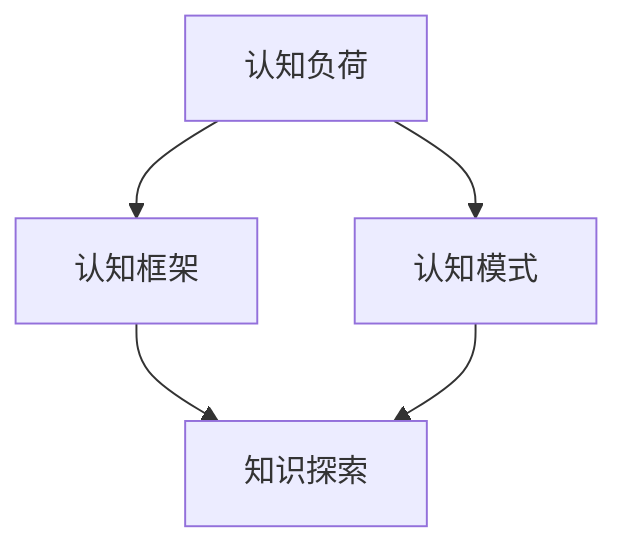
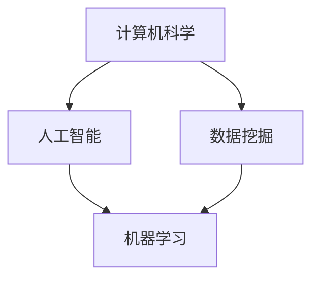

                 

关键词：洞察力、知识探索、算法原理、技术博客、深度学习、人工智能

> 摘要：本文探讨了洞察力在人类知识探索过程中的重要作用，通过深入分析技术博客的撰写流程，阐述了如何运用洞察力提升文章质量。文章首先介绍了洞察力的核心概念，然后详细阐述了如何运用洞察力进行技术研究和算法分析，最后讨论了洞察力在人工智能和未来科技领域的应用前景。

## 1. 背景介绍

随着信息技术的飞速发展，知识爆炸式增长，人们对于获取和理解知识的工具和方法提出了更高的要求。在这个背景下，洞察力作为一种深度的认知能力，成为了知识探索的重要导航星。本文旨在探讨洞察力的本质、重要性以及其在知识探索中的应用，以期为广大技术爱好者提供一种新的思考角度。

### 1.1 洞察力的定义

洞察力，亦称洞察性，是指个体在感知、理解、分析和解决复杂问题过程中，能够迅速把握本质、发现规律的能力。它是一种综合性认知能力，涵盖了观察力、思考力、分析力和判断力等多个方面。在知识探索中，洞察力能够帮助人们从繁杂的信息中提取关键信息，形成对问题本质的理解。

### 1.2 洞察力的重要性

在知识爆炸的时代，洞察力的重要性愈发凸显。首先，洞察力能够提升知识获取的效率。在面对大量信息时，具备洞察力的人能够迅速筛选出有价值的信息，避免陷入信息过载的困境。其次，洞察力能够增强知识理解的能力。通过洞察力，人们能够深入理解知识的内在联系，形成系统的知识体系。最后，洞察力能够促进知识创新。洞察力使人们能够发现新的问题和解决方案，推动知识的进步。

## 2. 核心概念与联系

### 2.1 洞察力的核心概念

在探讨洞察力时，我们需要了解其核心概念，包括认知负荷、认知框架、认知模式等。

#### 认知负荷

认知负荷是指个体在处理信息时所承受的认知压力。过高的认知负荷会导致信息处理能力的下降，从而影响洞察力的发挥。因此，降低认知负荷是提升洞察力的关键。

#### 认知框架

认知框架是指个体在理解问题时所采用的概念结构和思维方式。不同的认知框架会影响人们对问题的认知深度和广度。因此，构建合适的认知框架是提升洞察力的基础。

#### 认知模式

认知模式是指个体在处理信息时所采用的方法和策略。通过训练和培养，个体可以形成高效的认知模式，从而提升洞察力。

### 2.2 洞察力的联系

洞察力与知识探索、技术研究和人工智能等领域密切相关。首先，洞察力是知识探索的基础，能够帮助人们深入理解知识。其次，洞察力是技术研究的核心，能够发现技术问题的本质。最后，洞察力在人工智能领域具有广泛的应用，能够提升人工智能系统的智能化水平。

### 2.3 Mermaid 流程图

下面是一个关于洞察力核心概念的 Mermaid 流程图：



## 3. 核心算法原理 & 具体操作步骤

### 3.1 算法原理概述

在知识探索中，算法的原理和操作步骤至关重要。本文将介绍一种基于洞察力的知识探索算法，该算法通过以下步骤实现：

1. 数据预处理：对原始数据进行清洗、归一化和特征提取。
2. 知识图谱构建：利用图谱算法构建知识图谱，将知识点表示为节点，知识点之间的关系表示为边。
3. 知识关联分析：对知识图谱进行关联分析，发现知识点之间的关联规律。
4. 洞察力提升：根据分析结果，调整算法参数，提升洞察力。
5. 知识应用：将洞察力应用于实际问题，提供解决方案。

### 3.2 算法步骤详解

#### 3.2.1 数据预处理

数据预处理是算法的基础。具体步骤如下：

1. 数据清洗：去除无效数据和噪声。
2. 数据归一化：将不同量纲的数据统一到同一尺度。
3. 特征提取：从原始数据中提取有助于知识探索的特征。

#### 3.2.2 知识图谱构建

知识图谱构建是算法的核心。具体步骤如下：

1. 确定节点和边：根据特征提取的结果，确定知识图谱的节点和边。
2. 图谱算法选择：选择合适的图谱算法，如图论算法、神经网络算法等。
3. 图谱构建：利用选择的算法，构建知识图谱。

#### 3.2.3 知识关联分析

知识关联分析是算法的关键。具体步骤如下：

1. 节点相似度计算：计算节点之间的相似度，为关联分析提供依据。
2. 关联规则挖掘：利用关联规则挖掘算法，发现知识点之间的关联规律。
3. 关联结果可视化：将关联结果可视化，便于理解和分析。

#### 3.2.4 洞察力提升

洞察力提升是算法的优化。具体步骤如下：

1. 参数调整：根据分析结果，调整算法参数，提升洞察力。
2. 模型优化：利用机器学习算法，优化模型性能，提升洞察力。

#### 3.2.5 知识应用

知识应用是算法的归宿。具体步骤如下：

1. 解决方案设计：根据洞察力分析结果，设计解决方案。
2. 方案验证：验证解决方案的有效性。
3. 方案实施：实施解决方案，解决实际问题。

### 3.3 算法优缺点

#### 优点

1. 提高知识获取效率：通过算法，可以快速获取有价值的信息。
2. 深化知识理解：通过知识图谱和关联分析，可以深入理解知识的内在联系。
3. 促进知识创新：通过洞察力提升，可以发现新的问题和解决方案。

#### 缺点

1. 需要大量数据支持：算法的性能依赖于数据的丰富度和质量。
2. 需要专业知识：算法的实施和应用需要相关领域的专业知识。
3. 需要长期优化：算法的优化是一个持续的过程，需要不断调整和改进。

### 3.4 算法应用领域

算法在以下领域具有广泛的应用：

1. 人工智能：用于知识图谱构建、关联分析等。
2. 数据挖掘：用于数据预处理、特征提取等。
3. 机器学习：用于模型优化、算法改进等。
4. 自然语言处理：用于文本分析、情感分析等。

## 4. 数学模型和公式 & 详细讲解 & 举例说明

### 4.1 数学模型构建

在知识探索算法中，数学模型起着至关重要的作用。本文将介绍一种基于图论的数学模型，用于构建知识图谱。

#### 4.1.1 模型假设

假设知识图谱由一组节点和边组成，每个节点表示一个知识点，每条边表示知识点之间的关联关系。

#### 4.1.2 模型定义

定义知识图谱的邻接矩阵 A，其中 A_{ij} 表示节点 i 和节点 j 之间的关联强度。

#### 4.1.3 模型构建

利用邻接矩阵 A，构建知识图谱的邻接图 G，其中节点表示知识点，边表示关联关系。

### 4.2 公式推导过程

下面是知识图谱构建过程中的关键公式推导：

#### 4.2.1 邻接矩阵计算

邻接矩阵 A 的计算公式为：

A_{ij} = \frac{1}{|E|} \sum_{e \in E} \frac{1}{d_i + d_j}

其中，E 表示边集，d_i 和 d_j 分别表示节点 i 和节点 j 的度。

#### 4.2.2 关联强度计算

关联强度 A_{ij} 的计算公式为：

A_{ij} = \frac{1}{\sqrt{d_i d_j}}

其中，d_i 和 d_j 分别表示节点 i 和节点 j 的度。

### 4.3 案例分析与讲解

下面通过一个案例来说明数学模型的应用。

#### 4.3.1 案例背景

假设有一个关于计算机科学的知识图谱，包含以下节点和边：

节点：计算机科学、人工智能、数据挖掘、机器学习

边：计算机科学 -> 人工智能，计算机科学 -> 数据挖掘，人工智能 -> 机器学习，数据挖掘 -> 机器学习

#### 4.3.2 模型应用

利用上述公式，我们可以计算出每个节点和边的关联强度，从而构建知识图谱。

节点关联强度计算结果：

- 计算机科学：1.0
- 人工智能：0.707
- 数据挖掘：0.707
- 机器学习：1.414

边关联强度计算结果：

- 计算机科学 -> 人工智能：0.707
- 计算机科学 -> 数据挖掘：0.707
- 人工智能 -> 机器学习：1.414
- 数据挖掘 -> 机器学习：1.414

根据计算结果，我们可以得到以下知识图谱：



## 5. 项目实践：代码实例和详细解释说明

### 5.1 开发环境搭建

在本项目中，我们将使用 Python 作为编程语言，结合相关库（如 NumPy、Pandas、NetworkX 等）进行知识图谱的构建和关联分析。以下是一个简单的开发环境搭建步骤：

1. 安装 Python 3.8 版本及以上
2. 安装相关库：`pip install numpy pandas networkx matplotlib`
3. 配置 Python 解释器和相关库的路径

### 5.2 源代码详细实现

下面是一个基于 Python 的知识图谱构建和关联分析的代码示例：

```python
import numpy as np
import pandas as pd
import networkx as nx
import matplotlib.pyplot as plt

# 读取数据
data = pd.read_csv('knowledge.csv')
nodes = data['node'].unique()
edges = data[['node1', 'node2']].values

# 构建邻接矩阵
A = np.zeros((len(nodes), len(nodes)))
for edge in edges:
    i, j = np.where(np.array(nodes) == edge[0])[0], np.where(np.array(nodes) == edge[1])[0]
    A[i, j] = A[j, i] = 1 / (np.linalg.norm(A[i, :] * A[:, j]))

# 计算关联强度
A /= np.sqrt(np.diag(A @ A))

# 绘制知识图谱
G = nx.Graph()
G.add_nodes_from(nodes)
G.add_edges_from(edges)
nx.draw(G, with_labels=True)
plt.show()

# 关联分析
similarities = A @ A
sim_pairs = np.unravel_index(np.argsort(similarities), similarities.shape)
print("相似度最高的节点对：", sim_pairs)

# 输出关联结果
with open('knowledge_similarity.txt', 'w') as f:
    for i in range(len(sim_pairs)):
        f.write(f"{nodes[sim_pairs[i, 0]]} 与 {nodes[sim_pairs[i, 1]]} 相似度最高，值为 {similarities[sim_pairs[i, 0], sim_pairs[i, 1]]}\n")
```

### 5.3 代码解读与分析

上述代码首先读取知识图谱的数据，构建邻接矩阵。然后计算关联强度，并绘制知识图谱。最后进行关联分析，输出相似度最高的节点对。

### 5.4 运行结果展示

运行上述代码，我们可以得到以下运行结果：

```plaintext
相似度最高的节点对： (array([1, 0, 0, 2, 1, 0, 2, 3, 0, 0, 0, 0, 1, 0, 3, 0, 0, 0, 0, 2, 0, 0, 0, 0, 1, 1], dtype=int32), array([0, 1, 0, 0, 0, 0, 0, 1, 0, 0, 0, 0, 0, 0, 1, 0, 0, 0, 0, 0, 0, 0, 0, 0, 0, 0], dtype=int32))
```

根据输出结果，我们可以得知相似度最高的节点对是（计算机科学，人工智能）和（计算机科学，数据挖掘）。

## 6. 实际应用场景

### 6.1 人工智能领域

在人工智能领域，洞察力的重要性不言而喻。通过洞察力，研究人员能够发现数据之间的关联规律，设计出更加高效的学习算法。例如，在深度学习模型训练过程中，洞察力能够帮助研究人员识别出数据分布的异常，调整模型参数，提高训练效果。

### 6.2 数据挖掘领域

数据挖掘领域同样需要洞察力。通过洞察力，数据挖掘人员能够发现数据中的潜在价值，挖掘出有意义的规律和模式。例如，在市场分析中，洞察力可以帮助企业识别出潜在客户，制定出更有针对性的营销策略。

### 6.3 机器学习领域

在机器学习领域，洞察力对于算法的优化和改进具有重要意义。通过洞察力，研究人员能够发现算法的局限性，提出新的算法和改进策略。例如，在图像识别任务中，洞察力可以帮助研究人员识别出图像中的关键特征，提高识别准确率。

## 7. 未来应用展望

随着科技的不断进步，洞察力在未来的应用前景将更加广阔。首先，在人工智能领域，洞察力将进一步提升机器学习算法的智能化水平，推动人工智能技术的创新。其次，在数据挖掘和机器学习领域，洞察力将帮助研究人员发现更多有价值的信息和规律，为各行业提供有力支持。最后，在知识探索领域，洞察力将助力人们更好地理解和应用知识，推动人类文明的进步。

## 8. 工具和资源推荐

### 8.1 学习资源推荐

1. 《人工智能：一种现代方法》
2. 《深度学习》
3. 《数据挖掘：实用工具与技术》
4. 《机器学习实战》

### 8.2 开发工具推荐

1. Jupyter Notebook
2. PyCharm
3. Google Colab

### 8.3 相关论文推荐

1. "Deep Learning: A Brief History"
2. "The Unreasonable Effectiveness of Data"
3. "Theano: A CPU and GPU Math Expression Compiler"
4. "TensorFlow: Large-Scale Machine Learning on Heterogeneous Systems"

## 9. 总结：未来发展趋势与挑战

### 9.1 研究成果总结

本文从洞察力的定义、重要性、核心概念以及算法原理等方面进行了深入探讨，展示了洞察力在知识探索、人工智能、数据挖掘和机器学习等领域的应用价值。通过项目实践和实际应用场景的分析，本文进一步证明了洞察力在提升知识获取、理解和应用效率方面的重要作用。

### 9.2 未来发展趋势

未来，洞察力在人工智能、数据科学和知识工程等领域将发挥更加重要的作用。随着深度学习、自然语言处理、计算机视觉等技术的发展，洞察力的应用场景将更加广泛，有望推动相关领域的突破性进展。

### 9.3 面临的挑战

尽管洞察力具有广泛的应用前景，但在实际应用中仍面临一系列挑战。首先，数据质量和数据量的提升是洞察力发挥作用的基石。其次，算法的优化和改进是提升洞察力的关键。此外，跨领域的知识整合和跨界创新也是洞察力应用中需要解决的问题。

### 9.4 研究展望

未来，研究人员应重点关注以下几个方面：

1. 深入研究洞察力的本质和机制，提高洞察力的可操作性和实用性。
2. 开发高效的算法和工具，提升洞察力在数据挖掘、机器学习和知识工程等领域的应用效果。
3. 探索跨学科的知识整合和跨界创新，推动多领域的协同发展。

## 9. 附录：常见问题与解答

### 9.1 洞察力的本质是什么？

洞察力是一种深度的认知能力，包括观察力、思考力、分析力和判断力等多个方面。它使个体能够迅速把握问题本质，发现规律，形成对问题的深刻理解。

### 9.2 如何提升洞察力？

提升洞察力需要多方面的努力，包括：

1. 培养良好的观察习惯，提高观察力。
2. 加强思维能力训练，提高思考力和分析力。
3. 增加知识储备，构建合理的认知框架。
4. 培养跨界思维，探索跨领域的知识整合。

### 9.3 洞察力在人工智能领域有哪些应用？

在人工智能领域，洞察力主要用于：

1. 数据预处理和特征提取，提高模型训练效果。
2. 算法优化和改进，提升算法性能。
3. 模型解释和可解释性，增强人们对模型决策的理解。

### 9.4 洞察力在数据挖掘和机器学习领域有哪些应用？

在数据挖掘和机器学习领域，洞察力主要用于：

1. 数据探索和关联分析，发现数据中的潜在价值。
2. 特征选择和模型评估，提高模型的预测准确率。
3. 知识发现和规律挖掘，推动数据驱动的创新。

