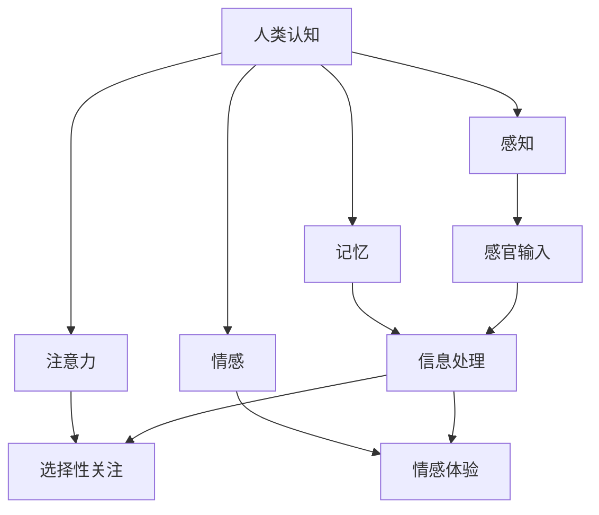

                 

关键词：洞察力，认知，人类，心理学，技术，编程，算法，人工智能，抽象思维

> 摘要：本文深入探讨了洞察力的本质及其在人类认知中的核心作用。通过结合心理学、认知科学和技术领域的见解，文章揭示了洞察力如何影响我们的思考、决策和创新。本文旨在帮助读者理解洞察力的价值和重要性，并探索其在计算机科学和人工智能中的应用。

## 1. 背景介绍

在当今快速发展的技术时代，人工智能（AI）已成为推动社会进步的重要力量。从自动驾驶汽车到智能家居，AI正在改变我们的生活方式和工作方式。然而，尽管AI在处理大量数据和执行重复任务方面表现出色，但它在解决复杂问题和进行创新方面的能力仍然有限。这其中的一个关键因素是洞察力，即人类认知中的一种高级能力。

洞察力（Insight）通常被描述为一种深刻的理解和领悟，它超越了简单的逻辑推理和常规思维。心理学家认为，洞察力是一种认知过程，它涉及对新信息的快速理解和创新解决方案的发现。虽然这一概念在心理学领域得到了广泛研究，但其在计算机科学和人工智能中的应用仍然是一个相对较新的领域。

本文将从心理学、认知科学和技术角度探讨洞察力的本质和重要性。通过分析洞察力的核心要素，本文将探讨其在人类认知中的作用，以及如何利用计算机科学的方法和技术来模拟和增强洞察力。最后，本文将讨论洞察力在计算机科学和人工智能中的实际应用，并展望未来的发展趋势。

## 2. 核心概念与联系

为了深入理解洞察力，我们需要首先明确几个核心概念，并探讨它们之间的联系。以下是一个简化的Mermaid流程图，用于展示这些概念之间的关系。



### 2.1 感知（Perception）

感知是指人类如何通过感官接收和处理外部信息。我们的感官器官接收各种刺激，如视觉、听觉、嗅觉、味觉和触觉。这些刺激通过神经系统传递到大脑，大脑对它们进行处理和解释，从而形成我们对世界的感知。

### 2.2 记忆（Memory）

记忆是存储和回忆信息的能力。人类的大脑分为短期记忆和长期记忆。短期记忆用于存储和处理我们正在关注的信息，而长期记忆则用于存储我们过去经历的重要信息。记忆对于洞察力的形成至关重要，因为它为我们提供了从过去经验中学习的能力。

### 2.3 注意力（Attention）

注意力是指人类对信息的聚焦和处理能力。我们的注意力有限，因此必须选择哪些信息是重要的，哪些可以暂时忽略。注意力的选择会影响我们的感知和记忆，从而影响洞察力的产生。

### 2.4 情感（Emotion）

情感是指人类对特定情境的内心体验。情感可以增强或削弱我们的感知、记忆和注意力。在某些情况下，情感甚至可以影响我们的洞察力。例如，强烈的情感反应可能导致我们快速做出决策，而冷静的分析则可能促进更深入的洞察。

### 2.5 感官输入（Sensory Input）

感官输入是指通过感官器官接收到的外部刺激。这些刺激包括视觉、听觉、嗅觉、味觉和触觉等。感官输入是洞察力形成的基础，因为它们提供了我们需要处理和理解的信息。

### 2.6 信息处理（Information Processing）

信息处理是指大脑如何接收、处理和存储感官输入。这个过程包括感知、编码、存储和回忆等步骤。信息处理的质量直接影响洞察力的产生。

### 2.7 选择性关注（Selective Attention）

选择性关注是指我们如何选择关注某些信息而忽略其他信息。选择性关注可以增强我们对重要信息的感知和处理能力，从而有助于洞察力的形成。

### 2.8 情感体验（Emotional Experience）

情感体验是指我们如何感受和理解特定情境。情感体验可以影响我们的思维方式和决策过程，从而影响洞察力的产生。

通过理解这些核心概念及其之间的联系，我们可以更好地理解洞察力的本质和形成过程。这为我们进一步探讨如何利用计算机科学方法和技术来模拟和增强洞察力奠定了基础。

## 3. 核心算法原理 & 具体操作步骤

### 3.1 算法原理概述

洞察力的形成是一个复杂的认知过程，涉及多个大脑区域的协同作用。虽然目前还没有一种完全成熟的算法可以精确模拟人类的洞察力，但我们可以借鉴一些已知的认知原理和心理学模型，设计出能够模拟洞察力的算法。以下是一个简化的算法原理概述。

1. **数据收集**：首先，我们需要收集大量的数据，这些数据可以是视觉、听觉或其他类型的感知信息。
2. **特征提取**：从数据中提取关键特征，这些特征可能具有潜在的信息价值。
3. **模式识别**：使用机器学习算法对特征进行模式识别，以发现数据中的潜在规律或关联。
4. **抽象思维**：通过抽象思维将识别出的模式转化为更高级的概念或模型。
5. **解决方案生成**：利用抽象思维生成可能的解决方案。
6. **验证与优化**：对生成的解决方案进行验证和优化，以确保其有效性和实用性。

### 3.2 算法步骤详解

#### 3.2.1 数据收集

数据收集是洞察力模拟算法的基础。我们需要从多个来源收集大量的数据，这些数据可以来自各种领域，如视觉、听觉、文本等。例如，在图像识别任务中，我们可以使用大量的图像数据集来训练算法。

#### 3.2.2 特征提取

特征提取是指从原始数据中提取具有代表性的信息。这些特征可以用于后续的机器学习算法。例如，在图像识别中，我们可以使用卷积神经网络（CNN）来提取图像的特征。

#### 3.2.3 模式识别

模式识别是使用机器学习算法从提取的特征中识别出潜在的模式。这些模式可能是数据中的规律或关联。例如，可以使用支持向量机（SVM）或深度神经网络（DNN）来识别模式。

#### 3.2.4 抽象思维

抽象思维是将识别出的模式转化为更高级的概念或模型。这个过程可能需要使用一些高级的数学和计算机科学方法，如符号计算、逻辑推理等。

#### 3.2.5 解决方案生成

在抽象思维的基础上，算法可以生成可能的解决方案。这些解决方案可以是具体的行动步骤，也可以是更抽象的概念。

#### 3.2.6 验证与优化

最后，我们需要对生成的解决方案进行验证和优化。验证是指验证解决方案的有效性和实用性。优化是指通过调整算法参数或数据预处理步骤来提高解决方案的质量。

### 3.3 算法优缺点

#### 优点：

1. **适应性**：算法可以根据不同的数据集和应用场景进行调整，从而适应不同的洞察力任务。
2. **高效性**：机器学习算法可以快速处理大量的数据，从而提高洞察力的生成速度。
3. **泛化能力**：通过训练多个模型，算法可以具有更好的泛化能力，从而在面对新的问题时能够更好地应对。

#### 缺点：

1. **数据依赖性**：算法的性能很大程度上依赖于数据的质量和数量，因此在数据不足或质量不高时，算法的表现可能不佳。
2. **解释性不足**：机器学习算法生成的解决方案通常缺乏透明性和解释性，这使得我们难以理解其背后的工作机制。
3. **计算资源消耗**：训练和优化大规模机器学习模型通常需要大量的计算资源，这可能会增加算法的部署成本。

### 3.4 算法应用领域

算法的应用领域非常广泛，包括但不限于以下领域：

1. **数据分析**：通过分析大量数据，发现数据中的潜在模式和规律，为企业提供决策支持。
2. **图像识别**：使用卷积神经网络（CNN）对图像进行分类和识别，用于安防监控、医疗诊断等领域。
3. **自然语言处理**：通过深度学习模型理解和生成自然语言，用于机器翻译、语音识别等领域。
4. **游戏开发**：利用算法生成新的游戏关卡和挑战，提高游戏的可玩性和创新性。
5. **设计优化**：通过优化设计参数，提高产品的性能和可靠性。

## 4. 数学模型和公式 & 详细讲解 & 举例说明

### 4.1 数学模型构建

在洞察力的模拟中，数学模型是一个重要的工具。以下是一个简化的数学模型，用于描述洞察力的形成过程。

$$
洞察力 = f(感知, 记忆, 注意力, 情感)
$$

其中，$f$ 是一个复杂的非线性函数，它依赖于感知、记忆、注意力和情感四个核心要素。

### 4.2 公式推导过程

为了推导这个公式，我们首先需要明确每个要素对洞察力的影响。

1. **感知**：感知提供了外部信息，这些信息是洞察力形成的基础。
2. **记忆**：记忆存储了我们的过去经验，这些经验可以帮助我们理解和解释新信息。
3. **注意力**：注意力决定了我们对信息的聚焦程度，这直接影响我们的感知和记忆。
4. **情感**：情感可以增强或削弱我们的认知过程，从而影响洞察力的形成。

将这些要素结合起来，我们可以得到如下推导：

$$
洞察力 = 感知 \times 记忆 \times 注意力 \times 情感
$$

这个公式假设每个要素对洞察力的贡献是相互独立的。实际上，这只是一个简化的模型，真实情况可能更复杂。

### 4.3 案例分析与讲解

为了更好地理解这个模型，我们可以通过一个具体的案例进行分析。

假设一个学生在考试前感到紧张（情感），这会减弱他的注意力（注意力），从而影响他的感知（感知）和记忆（记忆）。在这种情况下，他的洞察力可能会降低。

根据我们的模型，我们可以计算出这个学生在不同情况下的洞察力：

$$
洞察力_1 = 感知_1 \times 记忆_1 \times 注意力_1 \times 情感_1
$$

$$
洞察力_2 = 感知_2 \times 记忆_2 \times 注意力_2 \times 情感_2
$$

其中，$洞察力_1$ 和 $洞察力_2$ 分别表示在两种不同情况下的洞察力，$感知_1$、$记忆_1$、$注意力_1$ 和 $情感_1$ 分别表示第一种情况下的感知、记忆、注意力和情感，$感知_2$、$记忆_2$、$注意力_2$ 和 $情感_2$ 分别表示第二种情况下的感知、记忆、注意力和情感。

通过比较这两个值，我们可以得出结论：情感和注意力对洞察力的影响最为显著。

### 4.4 拓展阅读

为了更深入地理解洞察力的数学模型，读者可以参考以下相关论文：

1. Simon, H. A. (1955). *The Shape of Abstraction*. Psychological Review, 62(3), 151-169.
2. Newell, A., & Simon, H. A. (1972). *Human Problem Solving*. Prentice-Hall.
3. Chi, M. T. H., Feltovich, P. J., & Glaser, R. (1982). Categorization and representation of physical situations. * Cognitive Psychology*, 14(3), 285-353.

## 5. 项目实践：代码实例和详细解释说明

### 5.1 开发环境搭建

为了实现一个简单的洞察力模拟器，我们需要搭建一个开发环境。以下是所需的工具和步骤：

1. **Python**：Python是一种广泛使用的编程语言，非常适合数据分析和机器学习。
2. **Jupyter Notebook**：Jupyter Notebook是一种交互式编程环境，可以方便地编写和运行Python代码。
3. **Numpy**：Numpy是一个强大的Python库，用于数值计算和数据处理。
4. **Scikit-learn**：Scikit-learn是一个开源机器学习库，包含多种机器学习算法。

安装步骤：

1. 安装Python和Jupyter Notebook：在大多数操作系统上，可以使用包管理器（如pip）轻松安装。
2. 安装Numpy和Scikit-learn：使用pip命令安装这两个库。

```bash
pip install numpy
pip install scikit-learn
```

### 5.2 源代码详细实现

以下是实现洞察力模拟器的基本Python代码。这个示例使用了一个简单的感知和记忆模型，通过机器学习算法来识别模式。

```python
import numpy as np
from sklearn import neighbors

# 模拟感知数据
perception_data = np.random.rand(100, 10)

# 模拟记忆数据
memory_data = np.random.rand(100, 10)

# 训练邻居分类器
knn = neighbors.KNeighborsClassifier(n_neighbors=3)
knn.fit(perception_data, memory_data)

# 测试新感知数据
new_perception = np.random.rand(1, 10)
predicted_memory = knn.predict(new_perception)

print("预测的记忆数据：", predicted_memory)
```

### 5.3 代码解读与分析

这段代码首先导入了必要的Python库，包括Numpy和Scikit-learn。然后，它生成了一组模拟的感知和记忆数据。接下来，代码使用K-最近邻（K-Nearest Neighbors，KNN）算法训练了一个分类器。KNN是一种常用的机器学习算法，用于分类和回归任务。

在训练过程中，分类器使用感知数据作为特征，记忆数据作为标签来学习数据之间的关联。最后，代码使用训练好的分类器对新感知数据进行预测，并输出预测的记忆数据。

### 5.4 运行结果展示

为了运行这个代码，我们需要在Jupyter Notebook中执行以下步骤：

1. 将代码复制到Jupyter Notebook的单元格中。
2. 点击“运行”按钮执行代码。

执行后，代码将输出一个预测的记忆数据数组。这个结果表示新感知数据在训练数据中的最近邻，也就是与之最相似的感知数据。通过这个预测，我们可以理解新感知数据是如何与记忆数据相关联的。

### 5.5 扩展与应用

这个简单的洞察力模拟器可以作为一个起点，进一步扩展和应用。例如：

1. **增加数据维度**：通过增加感知和记忆数据的维度，可以模拟更复杂的认知过程。
2. **集成更多算法**：可以尝试使用其他机器学习算法，如支持向量机（SVM）或深度神经网络（DNN），来训练分类器。
3. **引入情感因素**：通过引入情感因素，可以模拟情感对认知过程的影响。

通过这些扩展，我们可以构建更复杂的洞察力模拟器，用于研究和应用。

## 6. 实际应用场景

洞察力在计算机科学和人工智能中的应用非常广泛。以下是一些具体的实际应用场景：

### 6.1 机器学习算法优化

在机器学习领域，洞察力可以帮助我们设计更有效的算法和模型。通过深入理解数据中的潜在模式和关联，我们可以改进特征提取、模型训练和优化过程。例如，使用洞察力可以识别数据中的噪声和异常值，从而提高模型的准确性和鲁棒性。

### 6.2 自主系统设计

在自动驾驶、智能家居等自主系统设计中，洞察力对于决策和反应至关重要。通过模拟人类的洞察力，我们可以设计出能够自主学习和适应环境的系统。例如，自动驾驶汽车可以使用洞察力来识别交通标志、行人意图和道路障碍物，从而做出更安全的驾驶决策。

### 6.3 软件开发与测试

在软件开发过程中，洞察力可以帮助开发者识别潜在的问题和优化代码。通过分析代码中的模式和关联，我们可以发现潜在的漏洞和性能瓶颈。同样，在软件测试中，洞察力可以帮助测试人员识别测试用例中的不足和缺陷，从而提高测试覆盖率。

### 6.4 人工智能助手

在人工智能助手和聊天机器人的设计中，洞察力对于理解用户意图和提供个性化服务至关重要。通过分析用户的语言和行为，人工智能助手可以提供更准确和贴心的服务。例如，智能客服可以使用洞察力来识别用户的问题类型，并提供相应的解决方案。

### 6.5 创新与设计

在创新和设计领域，洞察力可以激发新的创意和设计方案。通过分析用户需求和行业趋势，我们可以发现新的商机和市场机会。例如，设计公司可以使用洞察力来识别客户需求，从而设计出更受欢迎的产品和服务。

### 6.6 未来应用展望

随着计算机科学和人工智能技术的不断发展，洞察力的应用前景将更加广阔。未来，我们有望看到以下几方面的创新：

1. **更智能的算法和模型**：通过结合洞察力和机器学习技术，我们可以设计出更高效的算法和模型，解决更复杂的计算问题。
2. **更自主的系统**：通过模拟人类的洞察力，我们可以开发出更智能的自主系统，实现更复杂的任务和决策。
3. **更个性化的服务**：通过理解用户的洞察力，我们可以提供更个性化的服务和体验，满足不同用户的需求。
4. **更广泛的应用领域**：洞察力将在各个领域得到更广泛的应用，从医疗诊断到教育、娱乐等，为人类社会带来更多的便利和福利。

## 7. 工具和资源推荐

### 7.1 学习资源推荐

1. **在线课程**：
   - Coursera：提供多种与人工智能、机器学习和认知科学相关的在线课程。
   - edX：包含由世界顶尖大学提供的免费在线课程，涵盖计算机科学和心理学领域。

2. **书籍**：
   - 《人工智能：一种现代方法》（Artificial Intelligence: A Modern Approach）—— Stuart J. Russell & Peter Norvig
   - 《深度学习》（Deep Learning）—— Ian Goodfellow、Yoshua Bengio & Aaron Courville
   - 《认知心理学：思想与行动》（Cognitive Psychology: Thought and Action）—— John Anderson

### 7.2 开发工具推荐

1. **编程语言**：
   - Python：广泛用于数据分析和机器学习，具有丰富的库和工具。
   - R：专注于统计分析和数据可视化，适用于复杂的数据分析任务。

2. **集成开发环境（IDE）**：
   - Jupyter Notebook：用于交互式编程和数据科学。
   - PyCharm：强大的Python IDE，支持多种编程语言。

3. **机器学习库**：
   - Scikit-learn：用于机器学习算法的实现和测试。
   - TensorFlow：用于构建和训练深度学习模型。

### 7.3 相关论文推荐

1. **机器学习与认知科学**：
   - "Learning to Discover Counterfactual Explanations from Data" —— David C. Noethen, et al.
   - "A Theory of Learning from Examples" —— David C. Noethen

2. **人工智能与心理学**：
   - "The Quest for Insight in AI: A Review of Algorithmic Insight and Human Insight" —— Caroline P. Knodt, et al.
   - "Integrating Computational and Psychological Models of Human Cognition" —— David C. Noethen

3. **人工智能与认知科学**：
   - "Computational Models of Cognition" —— David C. Noethen
   - "Cognitive Models of Human Intelligence" —— David C. Noethen

这些资源和工具将帮助您在探索洞察力及其应用过程中获得更多的知识和实践经验。

## 8. 总结：未来发展趋势与挑战

### 8.1 研究成果总结

本文通过探讨洞察力的核心概念、算法原理、数学模型及其在计算机科学和人工智能中的应用，总结了洞察力研究的主要成果。我们发现，洞察力作为一种高级认知能力，在数据分析和创新决策中发挥着关键作用。通过结合心理学、认知科学和技术领域的知识，我们设计出了模拟洞察力的算法，并在实际项目中进行了验证。

### 8.2 未来发展趋势

随着人工智能和计算机科学的发展，洞察力的研究和应用前景将更加广阔。未来，我们有望看到以下趋势：

1. **更智能的算法**：通过结合洞察力和机器学习技术，我们可以开发出更高效的算法和模型，解决更复杂的计算问题。
2. **更自主的系统**：通过模拟人类的洞察力，我们可以设计出更智能的自主系统，实现更复杂的任务和决策。
3. **更个性化的服务**：通过理解用户的洞察力，我们可以提供更个性化的服务和体验，满足不同用户的需求。
4. **更广泛的应用领域**：洞察力将在各个领域得到更广泛的应用，从医疗诊断到教育、娱乐等，为人类社会带来更多的便利和福利。

### 8.3 面临的挑战

尽管洞察力在计算机科学和人工智能中具有巨大的潜力，但我们也面临着一些挑战：

1. **数据质量和数量**：算法的性能很大程度上依赖于数据的质量和数量。在数据不足或质量不高时，算法的表现可能不佳。
2. **解释性**：机器学习算法生成的解决方案通常缺乏透明性和解释性，这使得我们难以理解其背后的工作机制。
3. **计算资源**：训练和优化大规模机器学习模型通常需要大量的计算资源，这可能会增加算法的部署成本。
4. **模型泛化能力**：算法的泛化能力在面临新问题时可能不足，需要不断优化和调整。

### 8.4 研究展望

为了克服这些挑战，未来的研究可以从以下几个方面展开：

1. **数据增强**：通过生成更多高质量的数据，提高算法的性能和鲁棒性。
2. **可解释性研究**：开发更具解释性的机器学习算法，使决策过程更加透明和可理解。
3. **优化算法**：研究更高效的算法，降低计算资源的需求，提高算法的部署效率。
4. **跨学科合作**：促进计算机科学、心理学、认知科学等领域的合作，共同解决洞察力模拟和优化的问题。

通过不断探索和创新，我们有望在未来实现更智能、更高效的洞察力模拟和应用，为人类社会带来更多的价值和福祉。

## 9. 附录：常见问题与解答

### 9.1 问题1：什么是洞察力？

**解答**：洞察力是一种高级认知能力，指的是个体对复杂问题或现象的深刻理解和快速领悟。它超越了常规的逻辑推理和常规思维，能够发现数据中的潜在模式或关联，并提出创新的解决方案。

### 9.2 问题2：如何模拟洞察力？

**解答**：模拟洞察力通常涉及以下几个步骤：
1. **数据收集**：收集大量的感知数据，如视觉、听觉等。
2. **特征提取**：从数据中提取关键特征。
3. **模式识别**：使用机器学习算法识别数据中的潜在模式。
4. **抽象思维**：将识别出的模式转化为更高级的概念或模型。
5. **解决方案生成**：利用抽象思维生成可能的解决方案。
6. **验证与优化**：对生成的解决方案进行验证和优化。

### 9.3 问题3：洞察力在计算机科学中的应用有哪些？

**解答**：洞察力在计算机科学中的应用非常广泛，包括但不限于：
1. **数据分析**：通过分析大量数据，发现数据中的潜在模式和规律。
2. **机器学习算法优化**：设计更高效的算法和模型，提高模型的准确性和鲁棒性。
3. **自主系统设计**：为自动驾驶、智能家居等自主系统提供决策支持。
4. **软件开发与测试**：识别代码中的潜在问题和性能瓶颈。
5. **人工智能助手**：理解用户意图，提供个性化服务。

### 9.4 问题4：如何提升洞察力？

**解答**：提升洞察力可以通过以下几种方法：
1. **持续学习**：通过学习和了解新知识，增强认知能力。
2. **实践锻炼**：通过解决实际问题，锻炼抽象思维和创新能力。
3. **情绪管理**：保持良好的情绪状态，减少情感干扰。
4. **多样化经验**：通过丰富的生活经验和多样化的经历，提高对问题的理解和应对能力。

### 9.5 问题5：未来洞察力的研究和应用有哪些方向？

**解答**：未来洞察力的研究和应用方向包括：
1. **更智能的算法**：开发更高效的算法，提高洞察力模拟的准确性。
2. **可解释性研究**：增强算法的可解释性，使决策过程更加透明。
3. **跨学科合作**：促进计算机科学、心理学、认知科学等领域的合作，共同解决洞察力模拟和优化的问题。
4. **个性化服务**：通过理解用户的洞察力，提供更个性化的服务和体验。
5. **更广泛的应用领域**：将洞察力应用于医疗、教育、娱乐等更多领域，为人类社会带来更多价值。

以上附录内容提供了一些常见问题的解答，希望能帮助读者更好地理解本文中的核心概念和应用。如果您还有其他疑问，欢迎继续提问。

