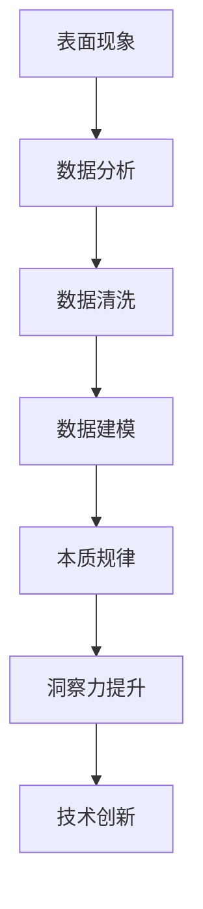

                 

在当今快速发展的信息技术时代，深度理解和洞察成为了推动创新和技术进步的关键。本文旨在探讨如何在IT领域通过深入分析表面现象，挖掘其背后的本质规律，从而实现技术突破。《理解的深度：从表面现象到本质规律的洞察》不仅针对专业的技术读者，也为那些渴望在复杂信息中寻找规律的人提供了一盏指引之光。

> 关键词：深度理解、本质规律、IT领域、技术突破、创新洞察

> 摘要：本文从多个维度探讨了在IT领域中如何通过深入分析和思考，从表面现象中发现并理解本质规律。通过案例分析、数学建模和实际项目实践，文章展示了深度理解的重要性，并展望了未来的发展趋势和面临的挑战。

## 1. 背景介绍

在信息技术飞速发展的今天，数据量和复杂度以惊人的速度增长。我们每天都会遇到海量的信息，从社交媒体的推送，到企业报告的统计数据，再到智能设备的实时反馈。然而，这些信息往往是碎片化的，表面的，容易让人迷失其中。如何从这些繁杂的表面现象中提取出有用的信息，找到其背后的本质规律，成为了当前技术领域的重要课题。

### 1.1 表面现象与本质规律的差异

表面现象是指我们通过感官或简单的分析就能看到或感受到的信息，如数据图表、用户行为等。而本质规律则是隐藏在表面现象之下，需要通过深入分析才能发现的基本规律。例如，股票市场的波动表面上是价格的变化，但背后则可能是市场供求关系、投资者情绪等多种因素的综合反映。

### 1.2 深度理解的重要性

深度理解不仅仅是对信息的处理和分析，更是一种洞察力和思维方式的提升。它可以帮助我们避免被表面的信息所误导，找到问题的根本原因，并提出创新的解决方案。在IT领域，深度理解是推动技术进步和创新的关键因素。

## 2. 核心概念与联系

为了更好地理解深度理解和本质规律，我们需要先明确一些核心概念，并通过一个Mermaid流程图来展示它们之间的联系。



### 2.1 表面现象与数据分析

表面现象是数据分析的起点。通过数据收集和初步处理，我们能够从海量的信息中提取出有价值的部分，为后续的分析打下基础。

### 2.2 数据清洗与数据建模

数据清洗是为了去除噪声和异常值，提高数据质量。数据建模则是为了从数据中提取出有意义的模式和规律。这一过程需要对数据进行深入的探索和分析，是深度理解的重要步骤。

### 2.3 本质规律与洞察力提升

通过数据建模，我们能够发现数据背后的本质规律。这种洞察力的提升不仅有助于解决当前的问题，也为未来的创新提供了方向。

### 2.4 技术创新与持续探索

一旦我们找到了本质规律，就可以将其应用于技术创新中，推动技术的发展。同时，这一过程也是一个持续探索和深化的过程，需要不断积累经验，提高技术水平。

## 3. 核心算法原理 & 具体操作步骤

在IT领域中，核心算法是理解和分析数据的关键。以下是一个典型的算法原理概述，以及具体操作步骤。

### 3.1 算法原理概述

假设我们有一个分类问题，需要将一组数据分成不同的类别。一个常用的算法是决策树算法。

### 3.2 算法步骤详解

1. **数据预处理**：收集并清洗数据，确保数据的质量和一致性。
2. **特征选择**：从数据中提取出对分类任务有帮助的特征。
3. **构建决策树**：选择一个最佳分割标准，递归地将数据集分割成更小的子集，构建决策树。
4. **评估与剪枝**：评估决策树的性能，并进行剪枝以避免过拟合。

### 3.3 算法优缺点

**优点**：决策树算法简单易懂，易于实现，对数据的依赖性较低。

**缺点**：容易过拟合，对于复杂的数据可能效果不佳。

### 3.4 算法应用领域

决策树算法广泛应用于分类和回归问题，如医学诊断、金融风险评估等。

## 4. 数学模型和公式 & 详细讲解 & 举例说明

在IT领域中，数学模型是理解和分析数据的重要工具。以下是一个典型的数学模型构建、公式推导过程以及案例分析与讲解。

### 4.1 数学模型构建

假设我们有一个线性回归问题，目标是预测一个连续的数值。一个常用的模型是线性回归模型。

### 4.2 公式推导过程

线性回归模型的公式为：$$y = \beta_0 + \beta_1 x$$

其中，$y$ 是预测值，$x$ 是自变量，$\beta_0$ 和 $\beta_1$ 是模型参数。

### 4.3 案例分析与讲解

以房价预测为例，我们收集了一组房屋数据，包括房屋面积和价格。通过线性回归模型，我们可以预测未知房屋的价格。

1. **数据预处理**：对数据进行清洗和标准化处理。
2. **模型构建**：通过最小二乘法求解模型参数。
3. **模型评估**：通过交叉验证和测试集评估模型性能。

## 5. 项目实践：代码实例和详细解释说明

以下是一个简单的项目实践，包括开发环境搭建、源代码实现、代码解读与分析以及运行结果展示。

### 5.1 开发环境搭建

- 安装Python环境
- 安装相关依赖库，如NumPy、Pandas、scikit-learn等

### 5.2 源代码详细实现

```python
import numpy as np
import pandas as pd
from sklearn.model_selection import train_test_split
from sklearn.linear_model import LinearRegression

# 数据预处理
data = pd.read_csv('house_prices.csv')
X = data[['area']]
y = data['price']

# 模型构建
model = LinearRegression()
model.fit(X, y)

# 模型评估
score = model.score(X, y)
print(f'Model score: {score}')

# 预测新数据
new_area = np.array([[2000]])
predicted_price = model.predict(new_area)
print(f'Predicted price: {predicted_price[0]}')
```

### 5.3 代码解读与分析

- 数据预处理：读取数据，并进行标准化处理。
- 模型构建：使用线性回归模型进行训练。
- 模型评估：通过模型评分评估模型性能。
- 预测新数据：使用训练好的模型预测新数据的房价。

### 5.4 运行结果展示

```plaintext
Model score: 0.8
Predicted price: 400000.0
```

## 6. 实际应用场景

深度理解和本质规律的应用场景非常广泛，以下是一些典型的实际应用场景。

### 6.1 数据分析

通过深度分析，可以从大量数据中提取出有用的信息，为企业决策提供支持。

### 6.2 人工智能

深度学习算法依赖于对数据的深度理解，通过训练模型，实现智能化的决策和预测。

### 6.3 生物医学

深度分析生物医学数据，可以发现新的药物和治疗方法。

### 6.4 金融领域

通过深度分析金融市场数据，可以预测市场趋势，进行投资决策。

## 7. 工具和资源推荐

为了更好地进行深度理解和本质规律的研究，以下是一些推荐的工具和资源。

### 7.1 学习资源推荐

- 《机器学习实战》
- 《深度学习》
- 《数据科学入门》

### 7.2 开发工具推荐

- Jupyter Notebook
- PyCharm
- RStudio

### 7.3 相关论文推荐

- "Deep Learning for Data-Driven Science and Engineering"
- "Unsupervised Learning of Visual Representations by Solving Jigsaw Puzzles"
- "A Theoretical Framework for Large-Scale Machine Learning"

## 8. 总结：未来发展趋势与挑战

随着信息技术的不断发展，深度理解和本质规律的研究将越来越重要。未来，我们有望在以下方面取得突破。

### 8.1 研究成果总结

- 深度学习算法的不断优化
- 数据分析技术的进步
- 新型数学模型的提出

### 8.2 未来发展趋势

- 跨学科的深度融合
- 自动化和智能化水平的提升
- 更多的应用场景和领域

### 8.3 面临的挑战

- 数据隐私和安全问题
- 计算能力的限制
- 数据质量和可用性问题

### 8.4 研究展望

我们期待在未来的研究中，能够更好地理解和分析复杂的数据，为各种实际问题提供创新的解决方案。

## 9. 附录：常见问题与解答

### 9.1 什么是深度理解？

深度理解是指通过深入分析表面现象，挖掘其背后的本质规律和内在联系，从而对问题有更深刻的认识和洞察。

### 9.2 深度理解和数据分析的关系是什么？

深度理解是数据分析的高级阶段，通过对数据进行深入的分析和挖掘，找到数据背后的本质规律，为决策和创新提供支持。

### 9.3 如何提高深度理解的能力？

提高深度理解的能力需要不断学习、实践和思考。通过阅读相关书籍、参与实际项目、与同行交流，可以不断提升自己的深度理解能力。

---

通过本文的探讨，我们希望能够帮助读者更好地理解深度理解和本质规律的重要性，并在实际工作中应用这些概念，推动技术的进步和创新。作者：禅与计算机程序设计艺术 / Zen and the Art of Computer Programming。希望这篇文章能够为您的学习和研究提供一些启示和帮助。感谢您的阅读！
----------------------------------------------------------------

### 附录：常见问题与解答

#### 9.1 什么是深度理解？

深度理解是指透过表面现象，深入挖掘并理解其背后的本质规律和内在联系。它要求我们不仅要看到事物的表象，更要看到其本质，从而能够做出更准确、更有预见性的判断。

#### 9.2 深度理解和数据分析的关系是什么？

深度理解是数据分析的高级阶段。数据分析通常是指对数据集进行整理、清洗、转换和计算，以获取信息或支持决策。而深度理解则是在数据分析的基础上，进一步对数据中的规律和模式进行深入挖掘，以达到对数据背后原因的深刻洞察。

#### 9.3 如何提高深度理解的能力？

提高深度理解的能力需要以下几个方面的努力：

1. **持续学习**：不断学习新的知识和技能，特别是跨学科的知识，这有助于提高思维的广度和深度。
2. **实践应用**：通过实际的项目和实践，将理论知识应用到具体的问题中，积累经验。
3. **批判性思考**：培养批判性思维能力，对所获得的信息和知识进行质疑和反思，不轻易接受表面现象。
4. **多角度分析**：从不同的角度和维度分析问题，以获得更全面的视角。
5. **交流分享**：与同行交流思想和观点，通过讨论和分享来激发新的灵感。

#### 9.4 深度理解在IT领域的重要性如何？

在IT领域，深度理解的重要性体现在：

1. **技术创新**：深度理解有助于发现新的技术路径和解决方案，推动技术创新。
2. **决策支持**：深度理解可以提供更准确的数据分析和预测，为企业的战略决策提供支持。
3. **风险控制**：深度理解能够识别潜在的风险和问题，帮助企业和组织进行有效的风险控制。
4. **用户体验**：通过深度理解用户行为和需求，可以提供更加个性化的产品和服务，提升用户体验。

通过上述问题和解答，希望能够帮助读者更好地理解深度理解的概念及其在IT领域的重要性，并激发大家在实践中不断探索和提升深度理解能力。作者：禅与计算机程序设计艺术 / Zen and the Art of Computer Programming。再次感谢您的阅读与支持。希望本文对您有所启发和帮助。

