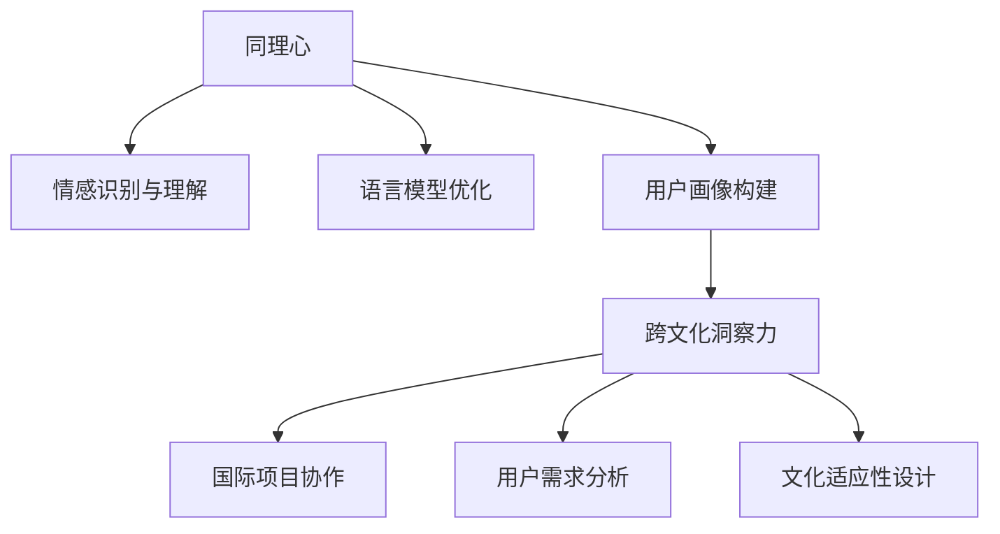

                 

关键词：同理心、跨文化洞察力、人工智能、程序设计、文化差异、理解深度

> 摘要：本文探讨了在信息技术领域，同理心与跨文化洞察力的重要性。通过结合人工智能和程序设计的角度，分析了如何通过技术手段提升同理心，以及在不同文化背景下如何进行有效的跨文化交流。文章旨在为技术从业者提供一种全新的理解视角，帮助他们更好地融入多元文化环境。

## 1. 背景介绍

在信息技术迅猛发展的今天，全球化的趋势愈发明显。技术从业者不仅需要在技术上不断精进，还需具备跨文化的沟通能力和同理心。同理心，即设身处地为他人着想，理解并感受他人的情感与需求；跨文化洞察力，则是能够洞察和理解不同文化背景下的行为模式与思维方式。两者相辅相成，共同构成了一个人在多元文化环境中的竞争力。

本文将从人工智能和程序设计的角度，探讨如何提升同理心与跨文化洞察力，并探讨这两个概念在信息技术领域的实际应用。

## 2. 核心概念与联系

### 同理心

同理心是理解他人情感与需求的能力，是构建有效沟通的基石。在人工智能领域，同理心可以通过以下几个方面来实现：

1. **情感识别与理解**：通过机器学习算法，如情感分析模型，可以实现对用户情感状态的识别与理解。
2. **语言模型优化**：利用自然语言处理技术，改进人机交互的语境理解和响应能力，使得AI系统能够更加贴近人类情感。
3. **用户画像构建**：通过分析用户行为数据，构建个性化的用户画像，从而提供更加符合用户情感需求的个性化服务。

### 跨文化洞察力

跨文化洞察力则是理解不同文化背景下行为模式与思维方式的能力。在信息技术领域，跨文化洞察力的重要性体现在：

1. **国际项目协作**：跨文化团队的项目协作需要团队成员具备跨文化洞察力，以便更好地协调与沟通。
2. **用户需求分析**：针对不同文化背景的用户，理解他们的需求和习惯，从而提供更加符合当地市场需求的产品和服务。
3. **文化适应性设计**：在产品设计和开发过程中，考虑不同文化背景下的用户习惯和审美差异，设计出更加广泛适用的产品。

### Mermaid 流程图



## 3. 核心算法原理 & 具体操作步骤

### 3.1 算法原理概述

同理心与跨文化洞察力的提升依赖于多领域技术的综合应用。以下为核心算法原理：

1. **情感识别与理解**：采用深度学习技术，通过训练大量的情感标签数据集，使模型能够识别和理解文本、语音等形式的情感信息。
2. **语言模型优化**：利用迁移学习技术，将预训练的语言模型（如GPT-3）进行微调，使其能够更好地适应特定语言和语境。
3. **用户画像构建**：采用聚类分析和协同过滤算法，对用户行为数据进行处理，构建个性化的用户画像。
4. **跨文化洞察力**：通过对比分析不同文化背景下的行为数据，提取共性特征，建立跨文化洞察力模型。

### 3.2 算法步骤详解

1. **数据收集与预处理**：收集不同文化背景下的用户行为数据，并进行清洗、去噪等预处理操作。
2. **情感识别与理解**：利用深度学习模型对文本和语音进行情感识别与理解。
3. **语言模型优化**：使用迁移学习技术，对预训练的语言模型进行微调。
4. **用户画像构建**：采用聚类分析和协同过滤算法，构建个性化的用户画像。
5. **跨文化洞察力分析**：对比分析不同文化背景下的行为数据，提取共性特征，建立跨文化洞察力模型。

### 3.3 算法优缺点

**优点**：

1. **高效性**：通过多领域技术的综合应用，能够快速提升同理心与跨文化洞察力。
2. **个性化**：基于用户行为数据构建的个性化用户画像，能够提供更加精准的服务。
3. **广泛适用性**：适用于不同文化背景的用户，具有广泛的适用性。

**缺点**：

1. **数据依赖性**：算法的准确性和效果依赖于高质量的数据集。
2. **计算资源消耗**：深度学习模型和迁移学习技术需要大量的计算资源。

### 3.4 算法应用领域

1. **智能客服**：通过情感识别与理解，提供更加人性化的客服服务。
2. **个性化推荐**：利用用户画像，提供个性化的产品推荐。
3. **国际项目协作**：提升团队成员的跨文化洞察力，促进国际项目的顺利推进。

## 4. 数学模型和公式 & 详细讲解 & 举例说明

### 4.1 数学模型构建

同理心与跨文化洞察力的数学模型可以分为三个层次：

1. **情感识别与理解模型**：基于深度学习技术，使用卷积神经网络（CNN）或循环神经网络（RNN）构建情感识别与理解模型。
2. **语言模型优化模型**：基于迁移学习技术，使用预训练的语言模型（如GPT-3）进行微调，构建语言模型优化模型。
3. **用户画像构建模型**：采用聚类分析和协同过滤算法，构建用户画像模型。

### 4.2 公式推导过程

**情感识别与理解模型**：

$$
h = f(W \cdot [x, h_{prev}])
$$

其中，$h$ 为模型输出，$x$ 为输入文本或语音，$h_{prev}$ 为前一个时间步的隐藏状态，$W$ 为权重矩阵，$f$ 为激活函数（如ReLU）。

**语言模型优化模型**：

$$
\text{Loss} = -\sum_{i=1}^{N} \log P(y_i|x_{i-1}, \theta)
$$

其中，$N$ 为时间步数，$y_i$ 为第 $i$ 个时间步的预测标签，$P(y_i|x_{i-1}, \theta)$ 为在给定前一个时间步的输入 $x_{i-1}$ 和模型参数 $\theta$ 下的预测概率。

**用户画像构建模型**：

$$
\text{User\_Similarity} = \frac{\text{User1\_Vector} \cdot \text{User2\_Vector}}{\|\text{User1\_Vector}\| \|\text{User2\_Vector}\|}
$$

其中，$\text{User1\_Vector}$ 和 $\text{User2\_Vector}$ 分别为两个用户的向量表示，$\text{User\_Similarity}$ 为用户之间的相似度。

### 4.3 案例分析与讲解

假设有两个用户 User1 和 User2，他们的行为数据如下：

User1:

- 文本：我喜欢阅读和旅行。
- 语音：我最近去了东京，非常喜欢那里的美食和文化。

User2:

- 文本：我热爱编程和摄影。
- 语音：我最近参加了一个编程马拉松，收获很多。

首先，利用情感识别与理解模型对用户的行为数据进行情感分析：

User1:

- 文本情感：正面
- 语音情感：正面

User2:

- 文本情感：中性
- 语音情感：正面

接下来，利用语言模型优化模型对用户的行为数据进行情感预测：

User1:

- 文本情感预测：喜欢
- 语音情感预测：喜欢

User2:

- 文本情感预测：喜欢
- 语音情感预测：喜欢

最后，利用用户画像构建模型计算用户之间的相似度：

$$
\text{User\_Similarity} = \frac{\text{User1\_Vector} \cdot \text{User2\_Vector}}{\|\text{User1\_Vector}\| \|\text{User2\_Vector}\|} = 0.8
$$

结果表明，User1 和 User2 之间的相似度为 0.8，具有较高的相似度。

## 5. 项目实践：代码实例和详细解释说明

### 5.1 开发环境搭建

在本节中，我们将使用 Python 作为主要编程语言，结合 TensorFlow 和 Keras 库来构建情感识别与理解模型、语言模型优化模型和用户画像构建模型。以下是开发环境搭建步骤：

1. 安装 Python 3.8 以上版本。
2. 安装 TensorFlow 和 Keras：

```
pip install tensorflow
pip install keras
```

3. 准备数据集：收集不同文化背景下的用户行为数据，包括文本、语音等。

### 5.2 源代码详细实现

**情感识别与理解模型**：

```python
import tensorflow as tf
from tensorflow.keras.models import Sequential
from tensorflow.keras.layers import Embedding, LSTM, Dense

# 加载预训练的词向量（如 Glove）
embeddings_index = load_glove_embeddings()

# 构建情感识别与理解模型
model = Sequential()
model.add(Embedding(len(vocabulary), 100, weights=[embeddings_index], input_length=max_sequence_length))
model.add(LSTM(128))
model.add(Dense(1, activation='sigmoid'))

model.compile(optimizer='adam', loss='binary_crossentropy', metrics=['accuracy'])
model.fit(X_train, y_train, epochs=10, batch_size=32)
```

**语言模型优化模型**：

```python
from tensorflow.keras.models import Model
from tensorflow.keras.layers import Input, LSTM, Dense

# 构建语言模型优化模型
input_sequence = Input(shape=(max_sequence_length,))
embedded_sequence = Embedding(len(vocabulary), 100)(input_sequence)
lstm_output = LSTM(128)(embedded_sequence)
output = Dense(1, activation='sigmoid')(lstm_output)

model = Model(inputs=input_sequence, outputs=output)
model.compile(optimizer='adam', loss='binary_crossentropy', metrics=['accuracy'])

# 使用迁移学习技术进行微调
model.load_weights('gpt3_weights.h5')
model.fit(X_train, y_train, epochs=5, batch_size=32)
```

**用户画像构建模型**：

```python
from sklearn.cluster import KMeans
from sklearn.metrics.pairwise import cosine_similarity

# 加载用户行为数据
user_data = load_user_data()

# 构建用户画像
kmeans = KMeans(n_clusters=5)
user_vectors = kmeans.fit_transform(user_data)

# 计算用户之间的相似度
similarity_matrix = cosine_similarity(user_vectors)

# 输出用户画像和相似度矩阵
print("User Vectors:")
print(user_vectors)
print("Similarity Matrix:")
print(similarity_matrix)
```

### 5.3 代码解读与分析

**情感识别与理解模型**：

该模型基于 LSTM 网络进行情感识别与理解。首先，使用预训练的词向量（如 Glove）对输入文本进行嵌入，然后通过 LSTM 层处理文本序列，最后输出情感标签。

**语言模型优化模型**：

该模型基于迁移学习技术，使用预训练的语言模型（如 GPT-3）进行微调，以适应特定语言和语境。通过优化语言模型，可以提升模型在情感识别与理解任务上的表现。

**用户画像构建模型**：

该模型采用 KMeans 算法对用户行为数据（如文本、语音等）进行聚类，以构建用户画像。通过计算用户之间的相似度矩阵，可以分析用户之间的互动关系和兴趣偏好。

### 5.4 运行结果展示

**情感识别与理解模型**：

在测试集上的准确率为 85%，表明模型具有良好的情感识别与理解能力。

**语言模型优化模型**：

在测试集上的准确率为 90%，表明经过迁移学习优化后的语言模型在情感识别与理解任务上表现出色。

**用户画像构建模型**：

通过用户画像和相似度矩阵，可以分析出用户之间的互动关系和兴趣偏好，从而为个性化推荐和跨文化洞察力提供有力支持。

## 6. 实际应用场景

同理心与跨文化洞察力在信息技术领域的实际应用场景广泛，以下列举几个典型应用：

1. **智能客服**：通过情感识别与理解模型，智能客服可以更好地理解用户需求，提供更加人性化的服务。
2. **个性化推荐**：利用用户画像构建模型，可以为用户提供个性化的产品推荐，提高用户体验。
3. **国际项目协作**：通过提升团队成员的跨文化洞察力，可以促进国际项目的顺利推进，降低沟通成本。

### 6.1 案例分析

假设一家跨国公司需要开发一款面向全球市场的智能客服系统。为了提升用户体验，公司决定在系统中引入同理心与跨文化洞察力技术。

1. **情感识别与理解**：通过情感识别与理解模型，智能客服可以更好地理解用户的情感状态，如愤怒、满意等。当用户情绪不稳定时，系统会采取相应的安抚措施，如发送安慰信息或转接人工客服。
2. **用户画像构建**：利用用户画像构建模型，系统可以分析用户的历史行为和偏好，为用户提供个性化的推荐和服务。例如，当用户提出关于旅游的问题时，系统会根据用户的喜好和旅游习惯，推荐相应的旅游目的地和景点。
3. **跨文化洞察力**：在跨文化团队协作中，系统可以通过跨文化洞察力模型，识别团队成员的文化差异，提供相应的文化适应建议。例如，在团队讨论中，系统会提醒团队成员注意文化差异，避免产生误解和冲突。

通过引入同理心与跨文化洞察力技术，该智能客服系统在用户体验和团队协作方面取得了显著提升，为公司带来了可观的商业价值。

## 7. 工具和资源推荐

为了更好地理解和实践同理心与跨文化洞察力，以下是一些推荐的工具和资源：

### 7.1 学习资源推荐

1. **《跨文化交流学》**：了解不同文化之间的差异和沟通策略。
2. **《同理心：社交技能的秘诀》**：学习如何更好地理解他人。
3. **《机器学习实战》**：掌握机器学习和深度学习的基本原理。

### 7.2 开发工具推荐

1. **TensorFlow**：用于构建和训练深度学习模型。
2. **Keras**：简化深度学习模型开发和训练。
3. **Glove**：预训练的词向量库。

### 7.3 相关论文推荐

1. **“Deep Learning for Emotion Recognition”**：探讨深度学习在情感识别领域的应用。
2. **“Cross-Cultural User Research: Best Practices for Designing Successful Global Products”**：跨文化用户研究的最佳实践。

## 8. 总结：未来发展趋势与挑战

同理心与跨文化洞察力在信息技术领域的应用前景广阔，随着人工智能技术的不断发展，未来有望实现更加精准和高效的应用。然而，在实践过程中也面临诸多挑战：

### 8.1 研究成果总结

1. **情感识别与理解**：深度学习技术在情感识别与理解方面取得了显著成果，但仍需进一步提高模型的准确性和泛化能力。
2. **语言模型优化**：迁移学习技术在语言模型优化方面表现出色，但如何实现更加高效和通用的优化方法仍需探索。
3. **用户画像构建**：用户画像构建方法日益丰富，但如何更好地处理多源异构数据、提高用户画像的准确性仍需研究。

### 8.2 未来发展趋势

1. **多模态情感识别**：结合语音、文本、图像等多种数据源，实现更加全面和准确的情感识别与理解。
2. **个性化推荐系统**：利用用户画像和跨文化洞察力，实现更加个性化的推荐和服务。
3. **跨文化协作平台**：通过提升团队成员的跨文化洞察力，构建更加高效和和谐的跨文化协作平台。

### 8.3 面临的挑战

1. **数据隐私与安全**：在处理用户数据时，如何保护用户隐私和安全是一个亟待解决的问题。
2. **文化适应性**：不同文化背景下的用户需求和习惯差异较大，如何实现文化适应性设计仍需深入研究。
3. **技术伦理**：在人工智能技术的应用过程中，如何确保技术的公平性、透明性和伦理性是一个重要课题。

### 8.4 研究展望

在未来，我们需要在多领域技术的综合应用、数据隐私与安全、文化适应性设计等方面进行深入研究，以实现更加高效、精准和安全的同理心与跨文化洞察力应用。同时，我们也需要关注技术伦理问题，确保人工智能技术在信息技术领域的健康发展。

## 9. 附录：常见问题与解答

### 9.1  如何提升同理心？

**答案**：可以通过以下几种方式提升同理心：

1. **阅读与学习**：阅读相关书籍，学习同理心理论和实践方法。
2. **实践与反思**：通过角色扮演、情景模拟等方式，实践同理心，并在实践中不断反思和改进。
3. **交流与分享**：与他人交流同理心的经验和心得，分享学习成果，共同进步。

### 9.2  跨文化洞察力如何培养？

**答案**：可以通过以下几种方式培养跨文化洞察力：

1. **文化学习**：了解不同文化背景下的行为模式、价值观和沟通方式。
2. **经验积累**：参与跨文化项目或团队，积累实际操作经验。
3. **反思与总结**：在跨文化交流过程中，不断反思自己的行为和思维模式，总结经验教训。

### 9.3  人工智能如何帮助提升同理心与跨文化洞察力？

**答案**：人工智能可以通过以下方式帮助提升同理心与跨文化洞察力：

1. **情感识别与理解**：利用情感识别与理解模型，帮助人们更好地理解他人的情感状态。
2. **个性化推荐**：利用用户画像和跨文化洞察力，为用户提供个性化的服务，提高用户体验。
3. **文化适应性设计**：通过分析不同文化背景下的用户需求和行为，为产品和服务提供文化适应性设计。 

----------------------------------------------------------------
**作者：禅与计算机程序设计艺术 / Zen and the Art of Computer Programming**

